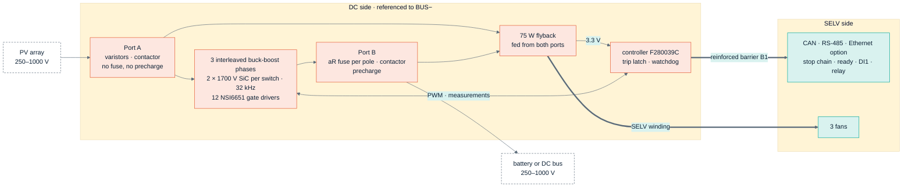
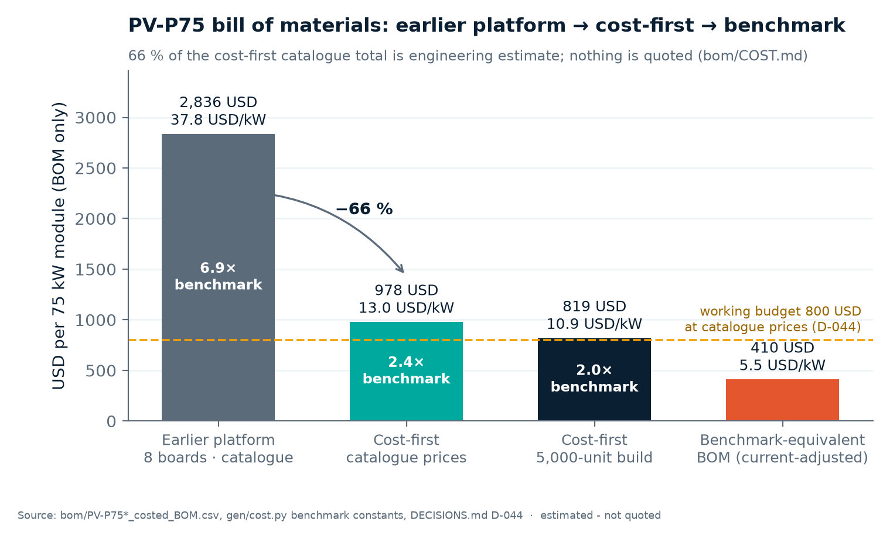
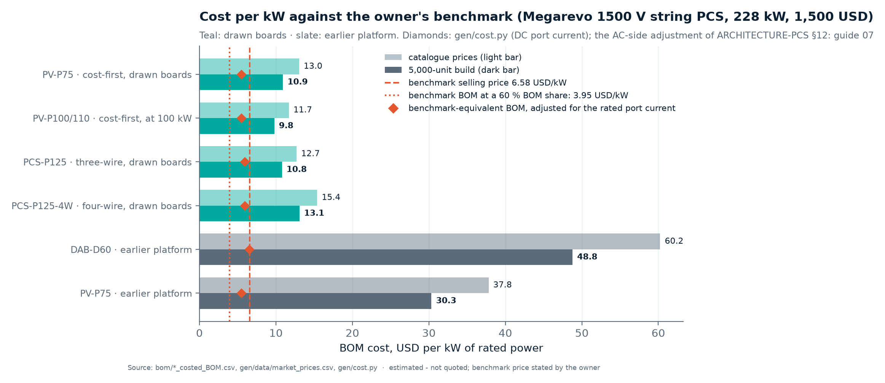
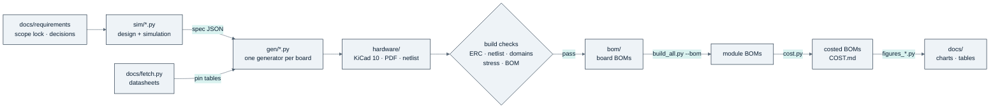

<p align="center">
  
</p>

<p align="center">
  
  
  
  
  
</p>

**PCM** is a family of power conversion modules for solar-plus-storage systems: a 75 kW non-isolated bidirectional
MPPT DC/DC (PV-P75, with a 100/110 kW four-phase build), a 125 kW three-phase battery inverter (PCS-P125, with a
four-wire build PCS-P125-4W) and a 60 kW isolated dual-active-bridge DC/DC (DAB-D60). Everything here — KiCad 10 schematics, BOMs, costed BOMs and the
simulations behind every component value — is generated by Python scripts in this repository. Nothing is
bench-validated: every figure is calculated, simulated or estimated, and is labelled as such.

<p align="center">
  <a href="docs/README.md"><b>Documentation</b></a> ·
  <a href="docs/guide/01-overview.md">Overview</a> ·
  <a href="docs/guide/07-sourcing-and-cost.md">Cost</a> ·
  <a href="docs/guide/11-megarevo-comparison.md">Comparison</a> ·
  <a href="docs/guide/12-risks-and-open-items.md">Risks</a> ·
  <a href="docs/guide/13-repository-guide.md">Repository guide</a>
</p>

---

## ⚡ At a glance

| Product | What it is | Rating | Ports | Status as of 2026-10-06 |
|---|---|---|---|---|
| **PV-P75** | non-isolated bidirectional buck-boost DC/DC with MPPT | 75 kW · 82.5 kW max | both 250–1000 V · 135 A | power board **PV-PWR rev A2** + control board **PV-CTL rev A2** drawn (recorder flash, chainable stop, ready, battery-fault input and status relay added; Ethernet footprints only, [D-075](docs/requirements/DECISIONS.md)); every build check passes; independent review answered ([D-065](docs/requirements/DECISIONS.md), [D-072](docs/requirements/DECISIONS.md)); rated power from 562 V at equal port voltages (calculated); BOM 978 / 819 USD |
| **PV-P100/110** | four-phase build of the same design | 100 / 110 kW | both 250–1000 V · 145 A on the battery port | PV-PWR-4 + PV-CTL drawn; checks pass; a derated build today (100 kW from 690 V, full power to 35 °C inlet); PV-P110's 110 kW is a PV-input rating (108.8 kW delivered A→B); BOM 1,169 / 979 USD |
| **PCS-P125** | three-phase bidirectional DC-to-AC battery inverter, three-wire (3W+PE) | 125 kW · 150 kVA for 2 min | DC 590–950 V required, 624–950 V calculated at 400 V AC · 400 V AC, 180 A | power board **PCS-PWR rev A0** + control board **PCS-CTL rev A0** (assembly PCS-CTL-3W) drawn, every build check passes; start-up from the grid through an AC tap and AC precharge, Ethernet (Modbus TCP) fitted ([D-074](docs/requirements/DECISIONS.md), [D-075](docs/requirements/DECISIONS.md)); control studied by calculation, off-grid accuracy and ride-through included ([D-066](docs/requirements/DECISIONS.md), [D-077](docs/requirements/DECISIONS.md)); BOM 1,588 / 1,348 USD |
| **PCS-P125-4W** | the same inverter, four-wire (3W+N+PE), with a fourth two-level leg for the neutral | 125 kW · 100 % unbalanced load (one phase at its tier) | DC 650–950 V required, 624–950 V calculated (neutral leg in mode B) · 400/230 V AC, 180 A | power board **PCS-PWR-4W rev A0** + **PCS-CTL rev A0** (assembly PCS-CTL-4W) drawn, every build check passes ([D-074](docs/requirements/DECISIONS.md)); auxiliary supply re-rated for it ([D-076](docs/requirements/DECISIONS.md)); BOM 1,924 / 1,635 USD (a lower bound: two lines unpriced) |
| **DAB-D60** | isolated dual-active-bridge DC/DC | 60 kW | 590–950 V · 400–900 V | device study with Chinese discretes (not drawn), corrected after the review ([D-068](docs/requirements/DECISIONS.md)); board DAB60 rev B (Wolfspeed modules) frozen, to be redrawn cost-first |

<sub>Ratings: <a href="docs/requirements/REQUIREMENTS.md">REQUIREMENTS.md</a> (PV-01…08, AC-02, DAB-01, DAB-10/11). BOM figures are catalogue / 5,000 units in USD, estimates where no price exists (<a href="bom/COST.md">bom/COST.md</a>, as of 2026-10-06). The earlier full-featured eight-board platform is kept as the roadmap's reference implementation and is not developed further.</sub>

## 🔬 Status dashboard

| | Requirements | Architecture | Design study | Schematic | Build checks | Costed BOM | Bench test |
|---|:---:|:---:|:---:|:---:|:---:|:---:|:---:|
| **PV-P75** |  |  |  |  |  |  | — |
| **PV-P100/110** |  |  |  |  |  |  | — |
| **PCS-P125 / -4W** |  |  |  |  |  |  | — |
| **DAB-D60** |  |  |  |  |  |  | — |

<sub>Teal = done · amber = partial, in study or frozen · — = not started. Bench tests and PCB layout are outside this repository's scope. Generated detail: <a href="docs/guide/01-overview.md#-status">Overview › Status</a>. Pin audit: 247 parts drawn, 191 pass (1,959 pins), 0 fail, 56 not auditable with a written reason (<a href="gen/data/pin_audit_report.csv">pin_audit_report.csv</a>). Review register: the independent review of commit <code>033d8d8</code> — 27 findings, 20 closed, 7 open — is <a href="gen/data/review_pcm.csv">gen/data/review_pcm.csv</a>, summarised in <a href="docs/guide/08-verification.md#-independent-design-reviews">Verification</a>.</sub>

---

## 🧭 The cost-first PV module

One power board and one control board, control referenced to the negative DC rail, **one** reinforced barrier to
everything a person or another device can touch ([ARCHITECTURE-COSTFIRST.md](docs/requirements/ARCHITECTURE-COSTFIRST.md)):



<sub>Red = hazardous-live DC side · teal = safe extra-low-voltage side. Detail: <a href="docs/guide/02-architecture.md">Architecture</a>, <a href="docs/guide/03-power-stage.md">Power stage</a>, <a href="docs/guide/04-protection-and-safety.md">Protection and safety</a>.</sub>

## 💰 Cost

<p align="center"></p>
<p align="center"><sub>Source: <a href="bom/COST.md">bom/COST.md</a> (generated by <a href="gen/cost.py">gen/cost.py</a>) · estimated, nothing quoted</sub></p>

<p align="center"></p>
<p align="center"><sub>Benchmark: Megarevo's 228 kW string PCS sells for 1,500 USD = 6.6 USD/kW (the owner's figure, a selling price). Source: <a href="gen/data/market_prices.csv">market_prices.csv</a>, <a href="sim/out/pcs_design/pcs_spec.json">pcs_spec.json</a>, <a href="bom/COST.md">bom/COST.md</a></sub></p>

<details>
<summary><b>The numbers behind the charts</b> (generated table)</summary>

<!-- BEGIN:cost-summary -->

| Product | What the figure is | kW | Catalogue USD | USD/kW | 5,000 units USD | USD/kW | Evidence | 5k ÷ benchmark-equivalent BOM |
|---|---|---:|---:|---:|---:|---:|---|---:|
| **PV-P75** | BOM of drawn boards (PV-PWR + PV-CTL) | 75 | **978** | 13.0 | **819** | 10.9 | 66 % of catalogue on estimates · 15 % of 5k on published breaks · 1 unpriced line (lower bound) | 2.0× (≈ 410 USD) |
| **PV-P100/110** | BOM of drawn boards (PV-PWR-4 + PV-CTL) | 100 / 110 | 1,169 | 11.7 / 10.6 | 979 | 9.8 / 8.9 | 64 % of catalogue on estimates · 15 % of 5k on published breaks · 2 unpriced lines (lower bound) | 1.8× / 1.8× |
| **PCS-P125** | BOM of drawn boards, three-wire (PCS-PWR + PCS-CTL-3W) | 125 | 1,588 | 12.7 | 1,348 | 10.8 | 77 % of catalogue on estimates · 9 % of 5k on published breaks · 1 unpriced line (lower bound) | 1.8× (≈ 744 USD) |
| **PCS-P125-4W** | BOM of drawn boards, four-wire (PCS-PWR-4W + PCS-CTL-4W) | 125 | 1,924 | 15.4 | 1,635 | 13.1 | 76 % of catalogue on estimates · 9 % of 5k on published breaks · 2 unpriced lines (lower bound) | 2.2× (≈ 744 USD) |
| PCS-P125 | design study, 3-wire (two-level, pcs_spec.json); the drawn boards above cost more (D-063) | 125 | 1,431 | 11.4 | 1,149 | 9.2 | 5 % of 5k on published prices | — |
| PCS-P125 | design study, 4-wire (two-level, pcs_spec.json); the drawn boards above cost more (D-063) | 125 | 1,731 | 13.8 | 1,392 | 11.1 | not stated for 4-wire | — |
| PV-P75 earlier platform | BOM of drawn boards (8 boards) | 75 | 2,836 | 37.8 | 2,275 | 30.3 | 51 % of catalogue on estimates · 17 % of 5k on published breaks · 7 unpriced lines (lower bound) | 5.5× |
| DAB-D60 earlier platform | BOM of drawn boards (5 boards) | 60 | 3,615 | 60.2 | 2,927 | 48.8 | 48 % of catalogue on estimates · 12 % of 5k on published breaks · 3 unpriced lines (lower bound) | 7.5× |
| PCS-P125 | three-level T-type estimate, **withdrawn by D-053** | 125 | 1,037 | 8.3 | 801 | 6.4 | — | — |

<sub>Generated by <a href="docs/assets/figures_overview.py">figures_overview.py</a> from <a href="bom/COST.md">bom/*_costed_BOM.csv</a>, <a href="sim/out/pcs_design/pcs_spec.json">pcs_spec.json</a> and <a href="gen/data/costfirst_pcs_bom.csv">costfirst_pcs_bom.csv</a>; benchmark arithmetic from <a href="gen/cost.py">gen/cost.py</a>. Do not edit between the markers.</sub>

<!-- END:cost-summary -->

</details>

Method, assumptions and the next cost levers: [Sourcing and cost](docs/guide/07-sourcing-and-cost.md).

## 📐 Against Megarevo, module for module

The owner's rule ([D-073](docs/requirements/DECISIONS.md)) is parity with the competitor's **modules** in both
directions — whatever its PMA inverter modules and its PMD-75-G3 DC/DC module offer, ours offer too, and the other way
round; cabinets, containers, hybrids and HMI panels are discarded, and both products stay bidirectional. Two generated
tables compare row by row, calculated against published: PV-P75 against the PMD-75-G3 — *2 better, 24 meets, 3 below,
5 not assessed, 0 pending, out of 34 published rows* — and PCS-P125 / PCS-P125-4W against the PMA0125 — *2 better, 38
meets, 4 below, 9 not assessed, 0 pending, out of 53 published rows*. The module-level items those tables do not cover
(grid type, start-up from the grid, Ethernet, the fault recorder and upgrade, discrete I/O, declarations) are tracked in
the register [gen/data/megarevo_2026_parity.csv](gen/data/megarevo_2026_parity.csv); its gaps were closed by D-074 to
D-077 except the altitude, which stays at 2,000 m with a 3,000 m / 5,000 m option specified. Details and the rows below
Megarevo: [Comparison with Megarevo](docs/guide/11-megarevo-comparison.md).

---

## 🧰 How the repository works

Python is the source of truth: simulations write the design values, generators turn them into checked schematics,
and the BOMs, costs and these charts are generated from the result. `hardware/` and `bom/` are never edited by hand.



## 🧰 Quick start

```bash
# 1  Python 3.12 environment
python3.12 -m venv .venv
.venv/bin/pip install numpy scipy matplotlib pyelftools   # PyOpenMagnetics (requirements.txt) is optional: sim/magnetics.py only

# 2  Third-party datasheets and reference designs are not kept in git - the BOM check needs them
.venv/bin/python docs/fetch.py          # downloads every file of docs/SOURCES.csv and verifies its SHA-256

# 3  Build the cost-first PV module: KiCad project, ERC, netlist check, PDF and BOM per board
.venv/bin/python gen/pv_power.py        # PV-PWR and PV-PWR-4
.venv/bin/python gen/pv_ctrl.py         # PV-CTL
.venv/bin/python gen/build_all.py --bom # roll the board BOMs up into module BOMs
.venv/bin/python gen/cost.py            # costed BOMs and bom/COST.md

# 4  Run one simulation; refresh the documentation charts and generated tables
.venv/bin/python sim/pv_design.py
.venv/bin/python docs/assets/figures_overview.py
```

Tools: KiCad 10 (`kicad-cli`; on macOS `/Applications/KiCad/KiCad.app/Contents/MacOS/kicad-cli`) and ngspice 46 on
`PATH`. A few library files must be saved by hand (sites that refuse scripted downloads): the list is in
[docs/LIBRARY.md](docs/LIBRARY.md). Everything else — every board, audit and simulation — is in the
[Repository guide](docs/guide/13-repository-guide.md).

## 📚 Repository map

```
.
├── README.md                this page
├── CLAUDE.md                project rules
├── docs/
│   ├── README.md            documentation hub
│   ├── guide/               the documentation pages
│   ├── assets/              style guide, banner, figure scripts, generated charts
│   ├── requirements/        scope lock, decision register, architecture specifications
│   ├── reference-designs/   vendor reference designs (documents fetched, READMEs in git)
│   ├── datasheets/          component datasheets (fetched, not in git)
│   ├── SOURCES.csv          manifest: every library file with URL and SHA-256
│   ├── fetch.py             downloads the library again
│   └── LIBRARY.md           the reference library's own README
├── gen/                     schematic generators, build checks, audits, cost model
│   └── data/                prices, estimates, volume factors, pin ledgers, review findings
├── sim/                     design calculations and simulations (numpy, scipy, ngspice)
│   ├── data/                device and supplier surveys
│   ├── spice/               ngspice decks
│   └── out/                 one folder per study: report, spec JSON, plots
├── hardware/                generated KiCad 10 projects with PDF, netlist, ERC and report per board
└── bom/                     generated BOMs, costed BOMs and COST.md
```

## 📚 Documentation

| | Page | What it answers |
|---:|---|---|
| 01 | [Overview](docs/guide/01-overview.md) | the product family, the roadmap, the decision timeline, status |
| 02 | [Architecture](docs/guide/02-architecture.md) | how the cost-first module is built: blocks, barriers, boards |
| 03 | [Power stage](docs/guide/03-power-stage.md) | the converter phases, devices, gate drive and losses |
| 04 | [Protection and safety](docs/guide/04-protection-and-safety.md) | trips, contactors, fuses, insulation; hardware against firmware |
| 05 | [Control and firmware](docs/guide/05-control-and-firmware.md) | control loops, MPPT, protection timing, the controller |
| 06 | [Magnetics](docs/guide/06-magnetics.md) | inductors, transformers, chokes and how they were verified |
| 07 | [Sourcing and cost](docs/guide/07-sourcing-and-cost.md) | makers and evidence, cost per module, the benchmark |
| 08 | [Verification](docs/guide/08-verification.md) | build checks, audits, reviews — and what is not verified |
| 09 | [PCS-P125](docs/guide/09-pcs-p125.md) | the DC-to-AC battery inverter, three- and four-wire, with its start-up from the grid |
| 10 | [DAB-D60](docs/guide/10-dab-d60.md) | the isolated DC/DC |
| 11 | [Comparison with Megarevo](docs/guide/11-megarevo-comparison.md) | row by row against the PMD-75-G3 and the PMA0125; the module-parity register; cost against the benchmark |
| 12 | [Risks and open items](docs/guide/12-risks-and-open-items.md) | every open risk, ranked, with what would close it |
| 13 | [Repository guide](docs/guide/13-repository-guide.md) | build, simulate, re-cost; conventions for parts and boards |
| | [Glossary](docs/guide/glossary.md) · [Decisions](docs/guide/decisions.md) | terms and abbreviations · digest of the decision register |

---

> [!IMPORTANT]
> **Honesty boundary.** Nothing in this repository has been built, bought, quoted or measured. Efficiencies,
> temperatures and margins are *calculated* or *simulated*; prices are catalogue readings (the LCSC readings are a
> snapshot of 2026-10-05) or *estimates*; competitor figures are *published* and unverified by us. A review finding
> marked closed is a corrected calculation, not a test. Several standard values are transcribed from memory and still
> have to be checked against the purchased standards. Scope is schematic + BOM + simulation — no PCB layout, mechanics
> or firmware.

> [!WARNING]
> **Top open risks** — the full ranked register is in [Risks and open items](docs/guide/12-risks-and-open-items.md).
> 1. **No supplier quotations.** About two thirds of the PV-P75 BOM (66 % of the catalogue total) is engineering estimate, and the 800 USD budget is not met ([D-052](docs/requirements/DECISIONS.md)).
> 2. **The Chinese 1700 V SiC device** (Sichain SG2M040170HJ) publishes no qualification, short-circuit or cosmic-ray data; its LCSC price is now read (5.07 USD at 90+, [D-069](docs/requirements/DECISIONS.md)) but not quoted; PV-P75 uses 24, PCS-P125 36, PCS-P125-4W 48 ([D-043](docs/requirements/DECISIONS.md), [D-053](docs/requirements/DECISIONS.md)).
> 3. **Insulation** rests on standard values from memory and an unverified surge-arrester credit; the gate driver's impulse rating needs that credit ([D-032](docs/requirements/DECISIONS.md), [D-043](docs/requirements/DECISIONS.md)).
> 4. **Gate-drive margins** for false turn-on and short-circuit turn-off rest on estimated loop inductances and assumed device withstand times — the double-pulse test is the first bench item ([D-028](docs/requirements/DECISIONS.md)).
> 5. **Requirements the calculations contradict:** PCS-P125's full load from 600 V at 400 V ±15 % (AC-02) is not reachable, PV-P75's 75 kW at 550 V needs 136.4 A against 135 A, and PV-P110's 110 kW is a PV-input rating — owner's decisions ([Risks, group G](docs/guide/12-risks-and-open-items.md#requirements-contradicted)).

## 🗺️ What comes next

- **PV-P75 boards:** drawn (PV-PWR rev A2, PV-CTL rev A2), reviewed and corrected ([D-065](docs/requirements/DECISIONS.md), [D-072](docs/requirements/DECISIONS.md)); the control board gained the recorder flash, the chainable stop, a ready permissive, a battery-fault input and a status relay, with Ethernet as a footprint option ([D-075](docs/requirements/DECISIONS.md)); BOM 978 USD at catalogue prices, 819 USD at 5,000 units. Next: the TLV9024's rejection measured at 3.3 V and 10 ppm/K ladder resistors (risk C9), the insulation audit extended to the cost-first boards, supplier quotations for the largest estimates, a sample set of the re-wound auxiliary transformer ([D-076](docs/requirements/DECISIONS.md)).
- **PCS-P125 and PCS-P125-4W:** both builds drawn and costed — 1,588 / 1,348 USD three-wire, 1,924 / 1,635 USD four-wire (catalogue / 5,000 units) ([D-074](docs/requirements/DECISIONS.md)). **Closed today:** the start-up from the grid (risk F8: AC tap and AC precharge on both builds), the four-wire build (risk F9: a fourth leg, not a midpoint neutral), Ethernet for the EMS and the recorder flash for the fault recorder and the authenticated upgrade ([D-075](docs/requirements/DECISIONS.md)), the auxiliary supply's live winding ([D-076](docs/requirements/DECISIONS.md)), the neutral-leg loop and the ride-through limiter ([D-077](docs/requirements/DECISIONS.md)). **Still open:** the owner's decision on AC-02; data sheets for the RFQ parts (AC contactor coil module, the 4-pole contactors, the type-B residual-current sensor, the four-bar CM choke, the precharge resistors); the L-N surge level (a 3+1 arrangement needs a GDT data sheet); pairing the DC-component measurement on one ADC; a cold-start rule for the inverter's fans; the stiff-grid derating of deep dips in firmware; the CH9121T's supply current and stock; no spare GPIO on the inverter's controller; powder-core inductors and the stud count as cost levers.
- **DAB-D60:** the device study is corrected ([D-068](docs/requirements/DECISIONS.md)); drawing a board for it is the owner's decision (DAB-12); otherwise redraw the board cost-first ([ARCHITECTURE-COSTFIRST §16](docs/requirements/ARCHITECTURE-COSTFIRST.md#16-dab-d60-on-the-same-principles)).
- **Comparison with Megarevo:** the rows below the published tables — PV-P75: cold limit, altitude and standby; PCS-P125: the 3W+PE DC window (two rows), cold limit and altitude ([Comparison](docs/guide/11-megarevo-comparison.md#the-four-pcs-rows-below-the-pma0125)). The altitude option (15 mm isolators for 3,000 m full / 5,000 m derated) is specified and fitted on demand.
- **Before any hardware release** (outside this repository): double-pulse test of the gate drive, a wound inductor sample, the purchased standards checked against the values used.

<sub>Scope and rules: <a href="CLAUDE.md">CLAUDE.md</a> · requirements: <a href="docs/requirements/REQUIREMENTS.md">REQUIREMENTS.md</a> · decisions: <a href="docs/requirements/DECISIONS.md">DECISIONS.md</a></sub>
