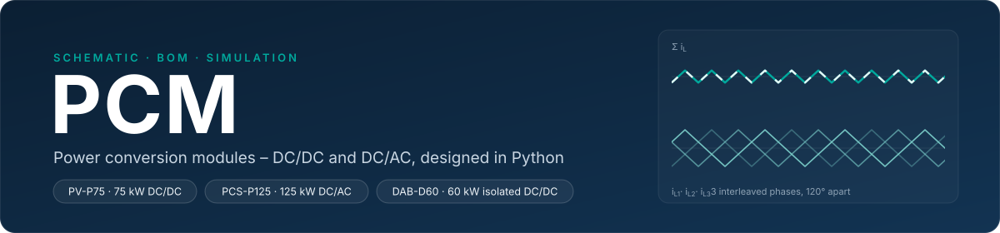
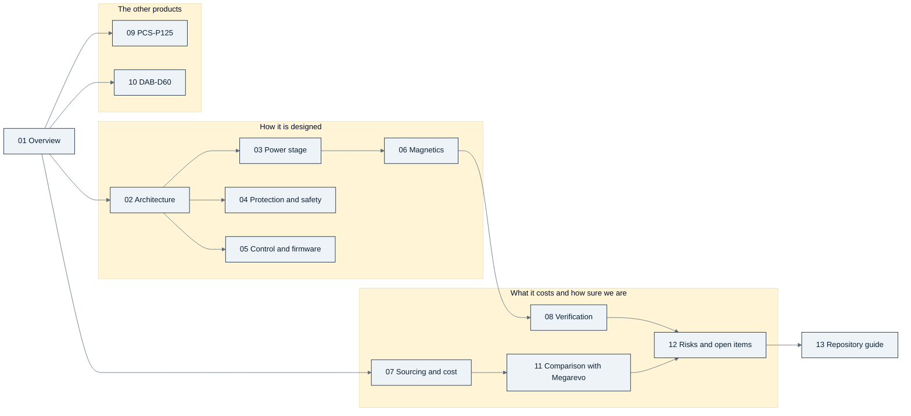

  

<!-- breadcrumb --> [Home](../README.md) › Documentation

# 📚 Documentation

> Where to start, every page of the guide in reading order, and the records the pages are built from.

---

## 🧭 Start here

| If you are… | Read in this order | You will come away with |
|---|---|---|
| **Manager or product owner** | [Overview](guide/01-overview.md) → [Sourcing and cost](guide/07-sourcing-and-cost.md) → [Comparison with Megarevo](guide/11-megarevo-comparison.md) → [Risks](guide/12-risks-and-open-items.md) → [Decisions](guide/decisions.md) | what exists, what it costs against the benchmark, what is still open and who decided what |
| **Hardware engineer** | [Overview](guide/01-overview.md) → [Architecture](guide/02-architecture.md) → [Power stage](guide/03-power-stage.md) → [Protection and safety](guide/04-protection-and-safety.md) → [Magnetics](guide/06-magnetics.md) → [Verification](guide/08-verification.md) → [Repository guide](guide/13-repository-guide.md) | how the boards are built, why each value is what it is, and how to change one safely |
| **Firmware engineer** | [Architecture](guide/02-architecture.md) → [Control and firmware](guide/05-control-and-firmware.md) → [Protection and safety](guide/04-protection-and-safety.md) → [PCS-P125](guide/09-pcs-p125.md) → [DAB-D60](guide/10-dab-d60.md) | the controller, the loops, the trip paths and what firmware must duplicate |
| **Purchaser** | [Sourcing and cost](guide/07-sourcing-and-cost.md) → [Risks](guide/12-risks-and-open-items.md) (group A) → [Repository guide](guide/13-repository-guide.md#adding-a-part) → [Glossary](guide/glossary.md) | which makers, which parts need quotations first, and the evidence behind each price |

## 🗺️ Map of the guide

## 📚 Every page

| | Page | What it answers |
|---:|---|---|
| 01 | [Overview](guide/01-overview.md) | the product family, the roadmap, the decision timeline, status by product and board |
| 02 | [Architecture](guide/02-architecture.md) | how the cost-first module is built: blocks, reference potentials, barriers, boards |
| 03 | [Power stage](guide/03-power-stage.md) | the converter phases, devices, gate drive, losses and thermal design |
| 04 | [Protection and safety](guide/04-protection-and-safety.md) | trips, contactors, fuses, insulation; what hardware does and what firmware duplicates |
| 05 | [Control and firmware](guide/05-control-and-firmware.md) | control loops, MPPT, protection timing, the controller's resources |
| 06 | [Magnetics](guide/06-magnetics.md) | inductors, transformers and chokes, and how each was verified |
| 07 | [Sourcing and cost](guide/07-sourcing-and-cost.md) | makers and evidence, cost per module at catalogue prices and at 5,000 units, the benchmark |
| 08 | [Verification](guide/08-verification.md) | build checks, audits and reviews — and what none of them proves |
| 09 | [PCS-P125](guide/09-pcs-p125.md) | the three-phase DC-to-AC battery inverter |
| 10 | [DAB-D60](guide/10-dab-d60.md) | the isolated dual-active-bridge DC/DC |
| 11 | [Comparison with Megarevo](guide/11-megarevo-comparison.md) | row by row against the PMD-75-G3; every product against the price benchmark |
| 12 | [Risks and open items](guide/12-risks-and-open-items.md) | every open risk, ranked, with its consequence and what would close it |
| 13 | [Repository guide](guide/13-repository-guide.md) | build a board, run a simulation, re-roll the cost; conventions for parts and boards |
| | [Glossary](guide/glossary.md) | abbreviations and project terms |
| | [Decisions](guide/decisions.md) | the decision register D-001…D-055, grouped by theme, with today's status |

---

## 📐 The records behind the pages

The pages explain; these files decide. Where a page and a record differ, the record wins.

| Record | What it holds | Edited by |
|---|---|---|
| [requirements/REQUIREMENTS.md](requirements/REQUIREMENTS.md) | the scope lock: every requirement with its source (roadmap or assumption) | the owner's instruction only |
| [requirements/DECISIONS.md](requirements/DECISIONS.md) | the decision register — rows are superseded, never deleted | appended per decision |
| [requirements/00-roadmap-source.md](requirements/00-roadmap-source.md) | the owner's engineering and product roadmap the requirements were distilled from | read-only |
| [requirements/COST-REVIEW.md](requirements/COST-REVIEW.md) | why the PV module was re-architected for cost | — |
| [requirements/ARCHITECTURE-COSTFIRST.md](requirements/ARCHITECTURE-COSTFIRST.md) | the cost-first PV module specification (and the DAB outline, §16) | — |
| [requirements/ARCHITECTURE-PCS.md](requirements/ARCHITECTURE-PCS.md) | the PCS-P125 architecture specification; its power stage is revised by D-053 | — |
| [requirements/GDRV-ALTERNATES.md](requirements/GDRV-ALTERNATES.md) · [REFERENCE-LESSONS.md](requirements/REFERENCE-LESSONS.md) | gate-driver alternates from datasheets · what recent TI reference designs change | — |
| [../bom/COST.md](../bom/COST.md) | the cost model, line by line | generated by `gen/cost.py` |
| `../sim/out/*/report.md` and `*_spec.json` | design calculations and simulations; the spec files are the hand-off to the generators | generated by `sim/*.py` |
| `../hardware/*/outputs/` | schematic PDF, netlist, ERC, build report and design check per board | generated by `gen/*.py` |
| [LIBRARY.md](LIBRARY.md) · [SOURCES.csv](SOURCES.csv) | the reference library: what is on file, what must be fetched by hand; one manifest row per document | `docs/fetch.py --summary` writes the counts |

## How to read the numbers

- **Calculated** — from a model or a datasheet in a script under `sim/` or `gen/`. **Simulated** — from a time-domain
  or circuit simulation (ngspice, Python). **Estimated** — an engineering judgement with its basis written next to it.
  **Published** — a competitor's or maker's statement, not verified by us. Nothing is **measured**.
- Numbers that will move carry an **as of** date; generated tables say which script wrote them and must not be edited
  between their `<!-- BEGIN -->` / `<!-- END -->` markers.
- Badge colours: teal = done or in force · amber = in study, partial or estimate · coral = open risk · slate = neutral
  · navy = reference. The visual rules are in the [style guide](assets/STYLE.md).
- Charts are drawn by [`assets/figures_overview.py`](assets/figures_overview.py) and
  [`assets/figures_design.py`](assets/figures_design.py) from the repository's own data files — never by hand.

---

<!-- footer --> ← [Home](../README.md) · Documentation index · [Overview](guide/01-overview.md) →
