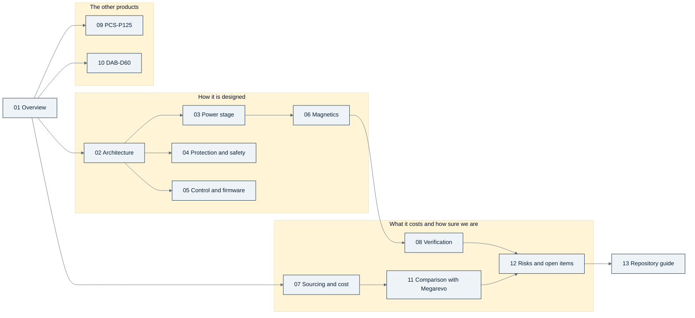

  

<!-- breadcrumb --> [Home](../README.md) › Documentation

# 📚 Documentation

> Where to start, every page of the guide in reading order, and the records the pages are built from.

---

## 🧭 Start here

| If you are… | Read in this order | You will come away with |
|---|---|---|
| **Manager or product owner** | [Overview](guide/01-overview.md) → [Sourcing and cost](guide/07-sourcing-and-cost.md) → [Comparison with Megarevo](guide/11-megarevo-comparison.md) → [Risks](guide/12-risks-and-open-items.md) → [Decisions](guide/decisions.md) | what exists, what it costs against the benchmark, what is still open and who decided what |
| **Hardware engineer** | [Overview](guide/01-overview.md) → [Architecture](guide/02-architecture.md) → [Power stage](guide/03-power-stage.md) → [Protection and safety](guide/04-protection-and-safety.md) → [Magnetics](guide/06-magnetics.md) → [Verification](guide/08-verification.md) → [Repository guide](guide/13-repository-guide.md) | how the boards are built, why each value is what it is, and how to change one safely |
| **Firmware engineer** | [Architecture](guide/02-architecture.md) → [Control and firmware](guide/05-control-and-firmware.md) → [Protection and safety](guide/04-protection-and-safety.md) → [PCS-P125](guide/09-pcs-p125.md) → [DAB-D60](guide/10-dab-d60.md) | the controller, the loops, the trip paths and what firmware must duplicate |
| **Purchaser** | [Sourcing and cost](guide/07-sourcing-and-cost.md) → [Risks](guide/12-risks-and-open-items.md) (group A) → [Repository guide](guide/13-repository-guide.md#adding-a-part) → [Glossary](guide/glossary.md) | which makers, which parts need quotations first, and the evidence behind each price |

## 🗺️ Map of the guide

## 📚 Every page

| | Page | What it answers |
|---:|---|---|
| 01 | [Overview](guide/01-overview.md) | the product family, the roadmap, the decision timeline, status by product and board |
| 02 | [Architecture](guide/02-architecture.md) | how the cost-first module is built: blocks, reference potentials, barriers, boards |
| 03 | [Power stage](guide/03-power-stage.md) | the converter phases, devices, gate drive, losses and thermal design |
| 04 | [Protection and safety](guide/04-protection-and-safety.md) | trips, contactors, fuses, insulation; what hardware does and what firmware duplicates |
| 05 | [Control and firmware](guide/05-control-and-firmware.md) | control loops, MPPT, protection timing, the controller's resources |
| 06 | [Magnetics](guide/06-magnetics.md) | inductors, transformers and chokes, and how each was verified |
| 07 | [Sourcing and cost](guide/07-sourcing-and-cost.md) | makers and evidence, cost per module at catalogue prices and at 5,000 units, the benchmark |
| 08 | [Verification](guide/08-verification.md) | build checks, audits and reviews — and what none of them proves |
| 09 | [PCS-P125](guide/09-pcs-p125.md) | the three-phase DC-to-AC battery inverter: the three-wire and four-wire builds, the start-up from the grid, the firmware specification |
| 10 | [DAB-D60](guide/10-dab-d60.md) | the isolated dual-active-bridge DC/DC |
| 11 | [Comparison with Megarevo](guide/11-megarevo-comparison.md) | row by row against the PMD-75-G3 and the PMA0125; the module-parity register; every product against the price benchmark |
| 12 | [Risks and open items](guide/12-risks-and-open-items.md) | every open risk, ranked, with its consequence and what would close it |
| 13 | [Repository guide](guide/13-repository-guide.md) | build a board, run a simulation, re-roll the cost; conventions for parts and boards |
| | [Glossary](guide/glossary.md) | abbreviations and project terms |
| | [Decisions](guide/decisions.md) | the decision register D-001…D-082, grouped by theme, with today's status |

> [!NOTE]
> **Status on 2026-10-07: the independent re-checks R2, R3 and R4 are answered.** A second independent review re-checked commit
> `a427981` and raised 14 findings (8 high, 6 medium); each was reproduced on our own models first and then classified —
> 9 *Confirmed*, 1 *Firmware Handled*, 2 *Already Fixed*, 1 *Not Applicable*, 1 *Improvement Recommended*
> ([review_r2.csv](../gen/data/review_r2.csv), all 14 closed in the register). [D-078](requirements/DECISIONS.md) answers
> the inverter's power stage and protection chain (the trip at its real gates-off current with RG,off 8.75 Ω,
> the backup band below the L1 knee, the SiC acceptance rule, one coil contract, the residual-current contract);
> [D-079](requirements/DECISIONS.md) the control study and hand-over (the tolerance regression, bounded off-grid
> transients, ride-through without derating, the AC start as an executed state machine). Everything stays calculated or
> simulated; the hardware gates are in [Risks](guide/12-risks-and-open-items.md#-the-re-check-r2-of-commit-a427981-2026-10-07),
> the installation conditions in [INSTALLATION.md](requirements/INSTALLATION.md).
>
> **The re-check R3 is answered too.** A third review re-checked the R2 response, commit `615e4b5`, and raised five
> findings (4 high, 1 low): 4 *Confirmed*, 1 *Improvement Recommended* ([review_r3.csv](../gen/data/review_r3.csv), all
> five closed in the register). [D-080](requirements/DECISIONS.md) answers them with firmware and acceptance rules and one
> requirement row: the synchronised close one AC coil at a time, the four-wire short replayed through both trip layers
> (a 5 ms onset clamp, 13.3 A margin), the coupled PCS / PV trajectory instead of an assumed 50 µs DC/DC stop (an island
> rides a full-load rejection with the PV modules' coordination row), two SiC module grades with full tier tables bound
> to the module serial, and the off-grid envelope as the ITIC-style points adopted by delegation as REQUIREMENTS AC-04 —
> nothing added to the BOM, all simulated or calculated ([Risks](guide/12-risks-and-open-items.md#-the-re-check-r3-of-commit-615e4b5-2026-10-07)).
>
> **The economical re-check R4 is answered as well.** A fourth review of commit `845131d` grouped its points into twelve
> decision areas: 3 *Confirmed*, 4 *Already Fixed*, 3 *Improvement Recommended*, 2 *Not Applicable*
> ([review_r4.csv](../gen/data/review_r4.csv), all twelve closed in the register). [D-081](requirements/DECISIONS.md)
> re-rates the DESAT string to two 1,300 V diodes per channel (each blocks the 1,130 V static envelope alone; +0.96 to
> +2.12 USD per module at 5,000 units), enforces the DC-bus window on a battery-less bus with the inter-module cable
> modelled (750 V default, 782 V firmware clamp, 791 V island permissive — the one-node 909 V is a model validity, not a
> rating) and a harness contract, rewords AC-04 as a declared output capability with a release sequence, sets the
> inverter's cold rating to full operation from −10 °C inlet, states grade B's 124.57 kW and indexes the magnetics RFQs
> ([RFQ-MAGNETICS.md](requirements/RFQ-MAGNETICS.md)); the restrictions it accepts and their boundaries are in
> [Risks](guide/12-risks-and-open-items.md#-the-re-check-r4-of-commit-845131d-2026-10-07).

---

## 📐 The records behind the pages

The pages explain; these files decide. Where a page and a record differ, the record wins.

| Record | What it holds | Edited by |
|---|---|---|
| [requirements/REQUIREMENTS.md](requirements/REQUIREMENTS.md) | the scope lock: every requirement with its source (roadmap or assumption) | the owner's instruction only |
| [requirements/DECISIONS.md](requirements/DECISIONS.md) | the decision register — rows are superseded, never deleted | appended per decision |
| [requirements/00-roadmap-source.md](requirements/00-roadmap-source.md) | the owner's engineering and product roadmap the requirements were distilled from | read-only |
| [requirements/COST-REVIEW.md](requirements/COST-REVIEW.md) | why the PV module was re-architected for cost | — |
| [requirements/ARCHITECTURE-COSTFIRST.md](requirements/ARCHITECTURE-COSTFIRST.md) | the cost-first PV module specification (and the DAB outline, §16) | — |
| [requirements/ARCHITECTURE-PCS.md](requirements/ARCHITECTURE-PCS.md) | the PCS-P125 architecture specification; its power stage is revised by D-053 | — |
| [requirements/INSTALLATION.md](requirements/INSTALLATION.md) | the installation conditions the modules depend on: 77 rows (INST-01…77), each with the generated line it comes from (review finding R2-12), and the installation-facing standing restrictions of the re-check R4; re-verified after the rebuild for the re-check R4 (D-081) on 2026-10-07 | by hand from the design checks; its quoted lines are re-verified after a rebuild |
| [requirements/RFQ-MAGNETICS.md](requirements/RFQ-MAGNETICS.md) | the request-for-quotation index for the ten custom magnetic parts: quantity per module and per build, the requirement rows a quotation must hold (inductance at current, losses, insulation, temperature), the type and production tests, the estimate held, the rows still without a number, and the 48 kHz weight-sensitive variant as an appendix (review R4, item E12) | by hand from the winding sheets and the costed BOMs; re-read after a magnetics or BOM rebuild |
| [requirements/QUALIFICATION-PLAN.md](requirements/QUALIFICATION-PLAN.md) | the consolidated qualification plan (D-082, review R5): every open gate of the five review rounds as Q-01…Q-44 — what is tested, the acceptance number our records give, the test asset, the product or claim it blocks and the stage (representative switching cell → controlled prototype → DVT → production controls) — with a "what a paper waiver cannot replace" section and a gate / blocks / stage / source table; nothing in it has been executed, and the R5 register [review_r5.csv](../gen/data/review_r5.csv) (six rows, all closed, no new defect) is the record behind it | by hand from the registers, the decisions' **Open** lists, INSTALLATION.md, RFQ-MAGNETICS.md and the generated checks; its quoted generated lines are re-found after a rebuild |
| [requirements/GDRV-ALTERNATES.md](requirements/GDRV-ALTERNATES.md) · [REFERENCE-LESSONS.md](requirements/REFERENCE-LESSONS.md) | gate-driver alternates from datasheets · what recent TI reference designs change, and (§6) the cross-check against Wolfspeed's firmware packages | — |
| `../gen/data/review_*.csv`, [integration_findings.csv](../gen/data/integration_findings.csv) | findings of the independent design reviews; [review_pcm.csv](../gen/data/review_pcm.csv) holds the 27 findings of the review of commit `033d8d8`, [review_r2.csv](../gen/data/review_r2.csv) the 14 of the re-check of `a427981`, [review_r3.csv](../gen/data/review_r3.csv) the 5 of the re-check of `615e4b5` and [review_r4.csv](../gen/data/review_r4.csv) the 12 decision areas of the economical re-check of `845131d` (each with a preferred option, an alternative, a no-change boundary and a cost basis), each with its status, class and closure | appended per review round |
| [../bom/COST.md](../bom/COST.md) | the cost model, line by line | generated by `gen/cost.py` |
| [../gen/data/megarevo_2026_parity.csv](../gen/data/megarevo_2026_parity.csv) | the module-parity register against Megarevo (D-073): item, their published statement, ours, verdict, the decision behind it | its `ours` / `verdict` / `action` cells per decision |
| `../sim/out/compare_megarevo/` · [`../sim/out/compare_megarevo_pcs/`](../sim/out/compare_megarevo_pcs/report.md) | the row-by-row comparisons with the PMD-75-G3 and the PMA0125 (`comparison.csv`, `report.md`) | generated by `sim/compare_megarevo.py` and `sim/compare_megarevo_pcs.py` |
| [reference-designs/megarevo/pma/spec-pma0125.md](reference-designs/megarevo/pma/spec-pma0125.md) · [MANUAL-NOTES.md](reference-designs/megarevo/pma/MANUAL-NOTES.md) | the PMA0125 table transcribed verbatim; the PMA user manual's module-level statements with page numbers | our notes on the competitor's documents (the PDFs are fetched, not kept in git) |
| `../sim/out/*/report.md` and `*_spec.json` | design calculations and simulations; the spec files are the hand-off to the generators | generated by `sim/*.py` |
| `../hardware/*/outputs/` | schematic PDF, netlist, ERC, build report and design check per board | generated by `gen/*.py` |
| [LIBRARY.md](LIBRARY.md) · [SOURCES.csv](SOURCES.csv) | the reference library: what is on file, what must be fetched by hand; one manifest row per document | `docs/fetch.py --summary` writes the counts |

## How to read the numbers

- **Calculated** — from a model or a datasheet in a script under `sim/` or `gen/`. **Simulated** — from a time-domain
  or circuit simulation (ngspice, Python). **Estimated** — an engineering judgement with its basis written next to it.
  **Published** — a competitor's or maker's statement, not verified by us. Nothing is **measured**.
- Numbers that will move carry an **as of** date; generated tables say which script wrote them and must not be edited
  between their `<!-- BEGIN -->` / `<!-- END -->` markers.
- Badge colours: teal = done or in force · amber = in study, partial or estimate · coral = open risk · slate = neutral
  · navy = reference. The visual rules are in the [style guide](assets/STYLE.md).
- Charts are drawn by [`assets/figures_overview.py`](assets/figures_overview.py) and
  [`assets/figures_design.py`](assets/figures_design.py) from the repository's own data files — never by hand.

---

<!-- footer --> ← [Home](../README.md) · Documentation index · [Overview](guide/01-overview.md) →
