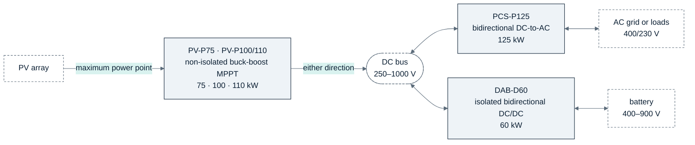
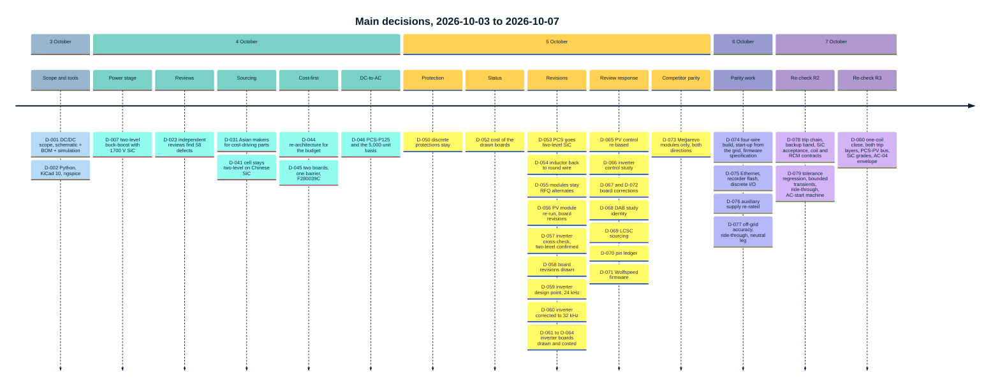
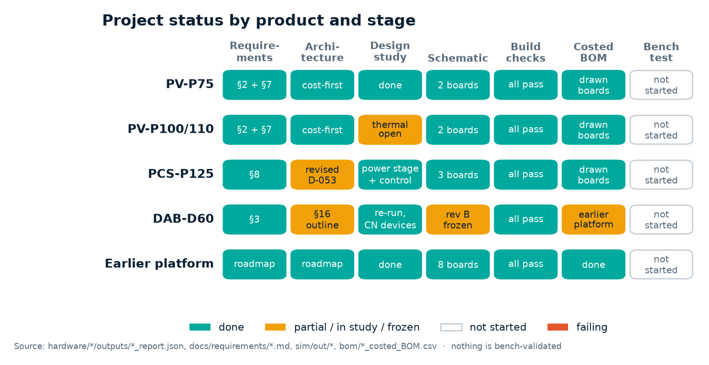
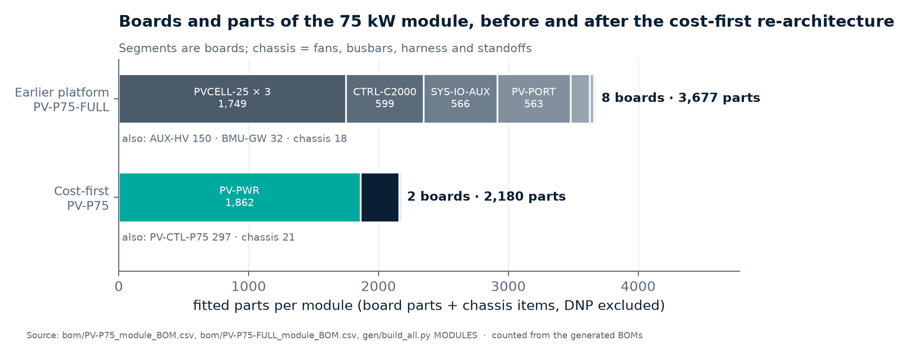

<!-- breadcrumb --> [Home](../../README.md) › [Documentation](../README.md) › Overview

# 🧭 Overview

> What the PCM product family is, what each product is for, where the design came from and where it stands as of 2026-10-06.

---

## 🧭 The product family

Three converters for solar-plus-storage systems, each designed to compete with a Megarevo product on price
([REQUIREMENTS.md](../requirements/REQUIREMENTS.md)):

| Product | What it is for | Rating | Topology as designed | Status as of 2026-10-06 |
|---|---|---|---|---|
| **PV-P75** | DC-coupled solar: tracks the array's maximum power point and moves power in either direction between the PV port and a battery or DC bus | 75 kW, 82.5 kW max · both ports 250–1000 V, 135 A | three interleaved two-level four-switch buck-boost phases, 2 × 1700 V SiC per switch, 32 kHz | power board PV-PWR rev A2 and control board PV-CTL rev A2 drawn (recorder flash, discrete I/O, Ethernet footprints, [D-075](../requirements/DECISIONS.md)); all build checks pass; independent review answered ([D-065](../requirements/DECISIONS.md), [D-072](../requirements/DECISIONS.md)); rated power from 562 V at equal port voltages, 73.3 kW at 550 / 550 V (calculated) |
| **PV-P100/110** | the same for larger hybrid and microgrid systems | 100 / 110 kW · 180 A | the same with four phases | PV-PWR-4 and PV-CTL drawn; checks pass; a derated build: PV-P100 rated from 690 / 697 V (A→B / B→A) to 35 °C inlet; PV-P110's 110 kW is a PV-input rating (108.8 kW delivered A→B) |
| **PCS-P125** | battery inverter: a battery or DC bus to three-phase AC, grid-following and off-grid; three-wire (3W+PE) and four-wire (3W+N+PE, PCS-P125-4W) builds | 125 kW, 150 kVA for 2 min · DC 590–950 V required · 400/230 V AC, 180 A | two-level, 6 × 1700 V SiC per switch (36 devices; 48 with the fourth leg of the four-wire build), 32 kHz, LCL filter ([D-053](../requirements/DECISIONS.md), design point of [D-060](../requirements/DECISIONS.md)) | both builds drawn: power boards PCS-PWR and PCS-PWR-4W rev A0, control board PCS-CTL rev A0 in two assemblies, every build check passes ([D-061](../requirements/DECISIONS.md) to [D-064](../requirements/DECISIONS.md), [D-074](../requirements/DECISIONS.md)); start-up from the grid through an AC tap and AC precharge on both builds; Ethernet (Modbus TCP), recorder flash and discrete I/O on the control board ([D-075](../requirements/DECISIONS.md)); module BOM 1,588 / 1,348 USD three-wire, 1,924 / 1,635 USD four-wire (catalogue / 5,000 units, estimates where no price exists, [bom/COST.md](../../bom/COST.md)); control studied by calculation, including off-grid accuracy, ride-through and the neutral leg ([D-066](../requirements/DECISIONS.md), [D-077](../requirements/DECISIONS.md)); independent review answered ([D-067](../requirements/DECISIONS.md)); AC-02's full load from 600 V is not reachable (owner's decision); against the PMA0125: 4 of 53 published rows below ([Comparison](11-megarevo-comparison.md)) |
| **DAB-D60** | isolation and voltage adaptation between a DC bus and a battery; one to four branches in parallel | 60 kW · port 1 590–950 V, port 2 400–900 V | dual active bridge, 100 kHz, custom transformer, liquid cold plate; DAB60 rev B0: one CBB011M12GM4T per bridge; device study (not drawn): 2 discretes per switch | device study with Chinese discretes corrected after the review ([D-068](../requirements/DECISIONS.md)): full power at 11 of 20 window points until a double-pulse test; board DAB60 rev B0 frozen, to be redrawn cost-first |
| *Earlier platform* | the roadmap's full-featured implementation: protected low-voltage control, eight boards per PV module | — | as PV-P75, with a reinforced barrier at every driver and sensor | kept as the reference implementation; not developed further ([D-044](../requirements/DECISIONS.md)) |

Ratings: [REQUIREMENTS.md](../requirements/REQUIREMENTS.md) PV-01…PV-08, AC-02, DAB-01, DAB-10/11 (the DAB port ranges
are assumptions, tagged **A** there). Design pages: [Architecture](02-architecture.md), [Power stage](03-power-stage.md),
[PCS-P125](09-pcs-p125.md), [DAB-D60](10-dab-d60.md).

> [!NOTE]
> **Why "cost-first".** The first costed BOM of the full-featured PV-P75 was several times the price level of the
> owner's benchmark (Megarevo's 228 kW string PCS at 1,500 USD = 6.6 USD/kW). The power stage was right; the system
> built around it was not. [COST-REVIEW.md](../requirements/COST-REVIEW.md) explains the re-architecture;
> [Sourcing and cost](07-sourcing-and-cost.md) gives today's figures.

---

## 🗺️ From the roadmap to this repository

The owner's roadmap ([00-roadmap-source.md](../requirements/00-roadmap-source.md), read-only) proposes a modular
family. This repository covers part of it:

| Roadmap product | Rating | Roadmap priority | Here |
|---|---|---|---|
| PCS-P125 | 125 kW | highest commercial priority | in scope since 2026-10-04 (S-8, [D-046](../requirements/DECISIONS.md)) |
| PCS-P105 · PCS-P60 | 80/105 kW · 50/62.5 kW | high · develop first as the lower-risk prototype | later, as derivatives of PCS-P125 (D-046) |
| PV-P75 | 75 kW | high, after the PCS control platform | in scope (S-1) |
| PV-P100 / PV-P110 | 100–110 kW | second generation | in scope (S-2) |
| DAB-D60 | 60 kW isolated | only against a real customer need | in scope at schematic level (S-3, DAB-12) |
| Shared ecosystem boards | controller, I/O, gate drive, auxiliary supply, gateway | — | drawn for the earlier platform (S-4) |
| U30/U40/U50 Vienna modules · STS-250 | — | preserve · separate assembly | out of scope |

In the roadmap's gate structure, the work here belongs to **Gate 0 — architecture closure**: specifications, topology
trade-off and source review. Its exit also asks for supplier quotations, which do not exist yet; Gate 1 onwards needs
hardware and a bench. PCB layout, mechanics, firmware and certification are out of scope
([REQUIREMENTS.md §1](../requirements/REQUIREMENTS.md#1-scope)).

## 🗺️ How the design got here

Eighty decisions in five days, each a row of the [decision register](../requirements/DECISIONS.md)
(digest: [Decisions](decisions.md)):

---

## 🔬 Status

Source: board build reports <code>hardware/*/outputs/*_report.json</code>, the requirement and architecture files, <code>sim/out/</code>, <code>bom/</code> · generated by <a href="../assets/figures_overview.py">figures_overview.py</a>

**Every board in the repository** — drawn by its generator, checked on every build:

<!-- BEGIN:board-status -->

| Board | Role | Rev | Sheets | Drawn symbols | Nets | Build checks | Schematic |
|---|---|---|---:|---:|---:|---|---|
| `PV-CTL` | cost-first module | A2 | 8 | 316 | 222 | pass (6/6) | [PDF](../../hardware/PV-CTL/outputs/PV-CTL_schematic.pdf) |
| `PV-PWR` | cost-first module | A2 | 22 | 1,874 | 939 | pass (6/6) | [PDF](../../hardware/PV-PWR/outputs/PV-PWR_schematic.pdf) |
| `PV-PWR-4` | cost-first module | A2 | 25 | 2,322 | 1,150 | pass (6/6) | [PDF](../../hardware/PV-PWR-4/outputs/PV-PWR-4_schematic.pdf) |
| `PCS-CTL` | inverter (PCS-P125, PCS-P125-4W) | A0 | 9 | 339 | 241 | pass (6/6) | [PDF](../../hardware/PCS-CTL/outputs/PCS-CTL_schematic.pdf) |
| `PCS-PWR` | inverter (PCS-P125) | A0 | 27 | 1,708 | 768 | pass (6/6) | [PDF](../../hardware/PCS-PWR/outputs/PCS-PWR_schematic.pdf) |
| `PCS-PWR-4W` | inverter (PCS-P125-4W) | A0 | 31 | 2,110 | 930 | pass (6/6) | [PDF](../../hardware/PCS-PWR-4W/outputs/PCS-PWR-4W_schematic.pdf) |
| `AUX-HV` | earlier platform | C1 | 4 | 150 | 70 | pass (6/6) | [PDF](../../hardware/AUX-HV/outputs/AUX-HV_schematic.pdf) |
| `BMU-GW` | earlier platform | B0 | 1 | 32 | 23 | pass (6/6) | [PDF](../../hardware/BMU-GW/outputs/BMU-GW_schematic.pdf) |
| `CTRL-C2000` | earlier platform | E0 | 14 | 599 | 468 | pass (4/4) | [PDF](../../hardware/CTRL-C2000/outputs/CTRL-C2000_schematic.pdf) |
| `PV-PORT` | earlier platform | F0 | 6 | 563 | 345 | pass (6/6) | [PDF](../../hardware/PV-PORT/outputs/PV-PORT_schematic.pdf) |
| `PV-PORT-180` | earlier platform | F0 | 6 | 563 | 345 | pass (6/6) | [PDF](../../hardware/PV-PORT-180/outputs/PV-PORT-180_schematic.pdf) |
| `PVCELL-25` | earlier platform | C0 | 9 | 587 | 284 | pass (6/6) | [PDF](../../hardware/PVCELL-25/outputs/PVCELL-25_schematic.pdf) |
| `SYS-IO-AUX` | earlier platform | E0 | 12 | 566 | 351 | pass (5/5) | [PDF](../../hardware/SYS-IO-AUX/outputs/SYS-IO-AUX_schematic.pdf) |
| `DAB60` | frozen: rev B outputs kept | B0 | 16 | 1,264 | 683 | pass (5/5) | [PDF](../../hardware/DAB60/outputs/DAB60_schematic.pdf) |
| `GDRV-HB` | verification / reference board | J0 | 3 | 128 | 68 | pass (6/6) | [PDF](../../hardware/GDRV-HB/outputs/GDRV-HB_schematic.pdf) |
| `PORT-LEAN` | verification / reference board | F0 | 8 | 272 | 200 | pass (6/6) | [PDF](../../hardware/PORT-LEAN/outputs/PORT-LEAN_schematic.pdf) |
| `PORT-LEAN-HOLD` | verification / reference board | F0 | 8 | 245 | 186 | pass (6/6) | [PDF](../../hardware/PORT-LEAN-HOLD/outputs/PORT-LEAN-HOLD_schematic.pdf) |

Generated by <a href="../assets/figures_overview.py">figures_overview.py</a> from <code>hardware/*/outputs/*_report.json</code> and the module lists of <a href="../../gen/build_all.py">gen/build_all.py</a>. Drawn symbols include parts marked DNP. Do not edit between the markers.

<!-- END:board-status -->

What the build checks prove, and what they do not, is in [Verification](08-verification.md). How the 75 kW module
shrank from eight boards to two:

Source: <a href="../../bom/PV-P75_module_BOM.csv">bom/PV-P75_module_BOM.csv</a>, <a href="../../bom/PV-P75-FULL_module_BOM.csv">bom/PV-P75-FULL_module_BOM.csv</a>, <a href="../../gen/build_all.py">gen/build_all.py</a> · counted from the generated BOMs

The architecture aimed at about 1,000 parts and estimated about 1,850; the gate-drive channel alone has about 85 parts
and appears twelve times ([ARCHITECTURE-COSTFIRST §10](../requirements/ARCHITECTURE-COSTFIRST.md#10-board-split-connectors-part-counts)).

---

<!-- footer --> ← [Home](../../README.md) · [Documentation index](../README.md) · [Architecture](02-architecture.md) →
