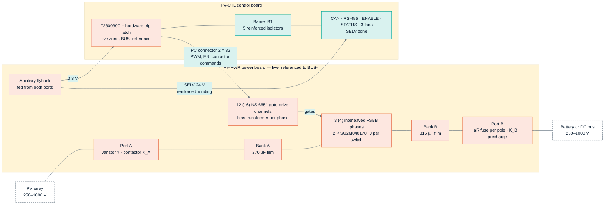
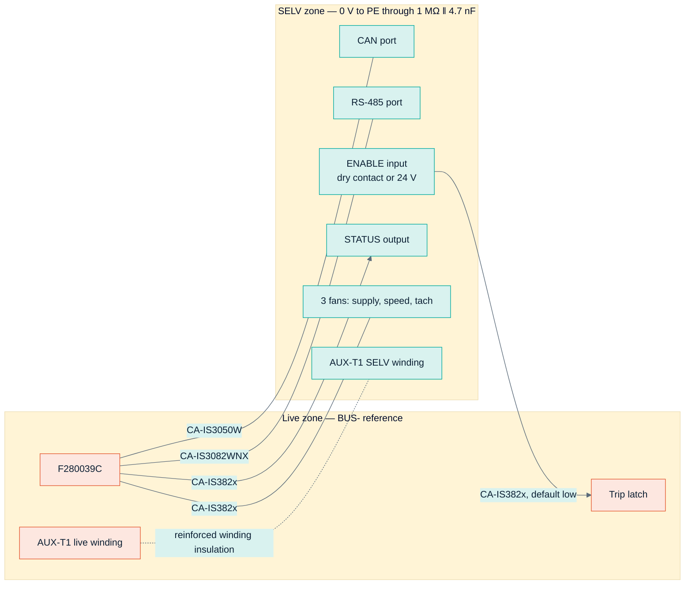
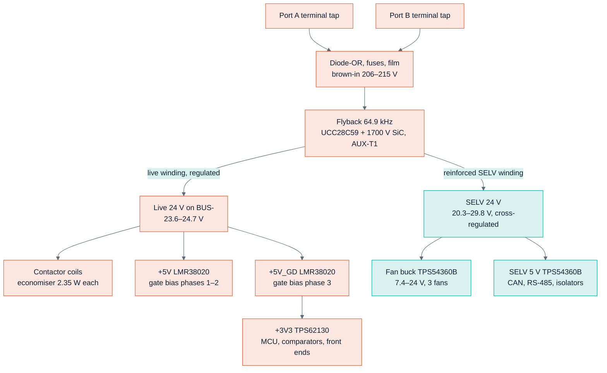
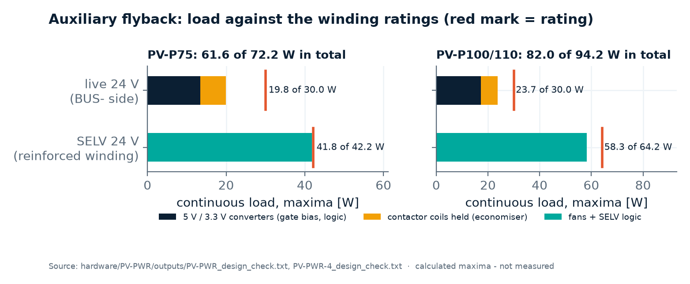

<!-- breadcrumb -->
[Home](../../README.md) › [Documentation](../README.md) › System architecture

# 🧭 System architecture — the cost-first PV module

> How PV-P75 and PV-P100/110 are partitioned: what each circuit is referenced to, the one reinforced barrier and what crosses it, the two boards and the 64-pin contract between them, the self-powered supply tree, the insulation concept, and what was given up against the earlier platform.

---

> [!NOTE]
> Everything on this page is a schematic-level design with **calculated** values. Nothing has been built or measured.
> The governing records are [ARCHITECTURE-COSTFIRST.md](../requirements/ARCHITECTURE-COSTFIRST.md) (decisions
> [D-044, D-045, D-050](../requirements/DECISIONS.md)) and the build outputs of the two boards,
> [PV-PWR design check](../../hardware/PV-PWR/outputs/PV-PWR_design_check.txt) and
> [PV-CTL design check](../../hardware/PV-CTL/outputs/PV-CTL_design_check.txt). Where they disagree, this page says so.

## 🧭 The architecture in one picture

The power stage (three or four interleaved four-switch buck-boost phases) is unchanged from the earlier platform. What
changed is everything around it: the controller sits on the negative DC rail (`BUS-`), so voltages are read with
resistor dividers and currents with shunts and open-loop sensors, and **only one reinforced barrier** separates the
hazardous-live DC side from everything a person or another device can touch.

Coral = hazardous live (up to 1000 V from earth, including the controller); teal = SELV. Sources:
[ARCHITECTURE-COSTFIRST.md §0–§1](../requirements/ARCHITECTURE-COSTFIRST.md), [gen/pv_power.py](../../gen/pv_power.py),
[gen/pv_ctrl.py](../../gen/pv_ctrl.py).

| | Earlier platform (kept as reference) | Cost-first module (baseline) |
|---|---|---|
| Boards per PV-P75 | 8: CTRL-C2000, SYS-IO-AUX, PV-PORT, 3 × PVCELL-25, AUX-HV, BMU-GW | 2: PV-PWR (power) + PV-CTL (control) |
| Parts per PV-P75 | 3,345 ([COST-REVIEW.md §3](../requirements/COST-REVIEW.md)) | 2,159 as drawn: 1,874 + 285 ([report JSONs](../../hardware/PV-PWR/outputs/PV-PWR_report.json)); the architecture estimated ~1,850 |
| Controller | dual-core F28388D on a protected low-voltage (PELV) island | single-core F280039C on `BUS-` |
| Safety barriers | 132 audited HV–PELV barrier rows ([insulation report](../../sim/out/insulation/report.md)) | B1 only: the auxiliary transformer's SELV winding + 5 isolators |
| Safety chain | dual channel, 75-row FMEA | one hardware latch + watchdog |
| Supply | cabinet 24 V, 30 W bootstrap flyback | self-powered from both ports |
| BOM, catalogue prices | 2,812 USD | 952 USD ([bom/COST.md](../../bom/COST.md), estimate, as of 2026-10-05) |

The costing itself is on [07 · Sourcing and cost](07-sourcing-and-cost.md).

## 📐 Which circuit is referenced to what

| Circuit | Board | Reference | To `BUS-` | To PE | To SELV |
|---|---|---|---|---|---|
| Port banks, legs, dampers, bleeders, inductors | power + chassis | A+, B+, `BUS-`, switch nodes | functional | basic (B2) | reinforced (B1) |
| 12 (16) gate-drive islands: NSI6651 output side, bias secondary, clamps, booster, DESAT | power | each device's Kelvin source (S1, S3: switch node; S2, S4: `BUS-`) | functional | basic (B2) | reinforced |
| Gate-bias primaries (SN6505B), NSI6651 input sides | power | `BUS-` | — | basic | reinforced |
| Inductor-current sensors (TMR, primary at the switch node) | power | `BUS-` | functional (in the sensor) | — | reinforced |
| Port dividers VA, VAX, VB, VBX, PE divider, insulation-monitor strings | power | `BUS-` | functional / basic | basic | reinforced |
| Port shunts in `BUS-` and their amplifiers | power | `BUS-` | — (same node) | basic | reinforced |
| Contactor and precharge-relay coils | power + chassis | `BUS-` | functional (coil–contact) | **basic coil-to-mounting — not stated by the maker (R-04)** | reinforced |
| Auxiliary flyback primary, live 24 V / 5 V / 3.3 V | power | `BUS-` | — | basic | reinforced (AUX-T1) |
| MCU, analog front end, comparators, latch, watchdog, debug header | control, live zone | `BUS-` | — | basic (distance, coating) | reinforced (B1) |
| CAN, RS-485, ENABLE, STATUS, fan supply and signals | control, SELV zone | SELV 0 V, tied to PE by 1 MΩ ‖ 4.7 nF | reinforced (B1) | — | — |
| Heatsink, chassis, fan mounting | mechanics | PE (earthed) | basic (B2) | — | — |

Source: [ARCHITECTURE-COSTFIRST.md §1.2](../requirements/ARCHITECTURE-COSTFIRST.md).

> [!CAUTION]
> The controller and its debug header sit at up to 1000 V from earth. Debugging needs an isolated probe rated
> ≥ 1000 V DC; field updates go over CAN on the SELV side
> ([ARCHITECTURE-COSTFIRST.md §2.2](../requirements/ARCHITECTURE-COSTFIRST.md)).

## 🛡️ The one reinforced barrier (B1) and what crosses it

| Part on B1 | Carries | Surge VIOSM (V) | Test VISO (V rms) | Working VIOWM (V DC) | Package creepage / clearance |
|---|---|---:|---:|---:|---|
| CA-IS3050W | CAN | 12,800 | 5,000 | 1,414 | 8 / 8 mm |
| CA-IS3082WNX | RS-485 | 8,000 | 5,000 | 1,414 | 8 / 8 mm |
| 2 × CA-IS3821LG + CA-IS3820LG | ENABLE in, STATUS out, fan speed out, 3 tachs in | 8,000 | 5,700 | 2,121 | 8 / 8 mm |
| AUX-T1 SELV winding (TIW-litz, potted) | SELV 24 V power | — | — | — | potted; solid-barrier field 7.4 kV/mm at the PD test ([magnetics report §8](../../sim/out/magnetics/report.md)) |
| **Requirement** (reinforced, DC pole) | | **8,000** (6,000 with the varistor credit) | **4,400** for 60 s | **1,100** at the OV trip | creepage 10.0 mm PD2, clearance 8.0 / 9.2 / 10.4 mm at 2000 / 3000 / 4000 m |

Source: [PV-CTL design check](../../hardware/PV-CTL/outputs/PV-CTL_design_check.txt), check "Barrier B1 ratings"
(calculated against the datasheet values cited there).

- **Conformal coating to PD1 over the whole B1 zone is mandatory:** the 8 mm packages are short of the 10.0 mm PD2
  creepage. At 3000–4000 m the 15 mm wide-body variants are needed.
- The architecture named a CA-IS3062W for CAN; the board uses a **CA-IS3050W**, because the CA-IS3062W would draw up to
  125 mA from the live +5 V where 50 mA is allocated (PV-CTL design check, "Rejected B1 candidates").
- The ENABLE input uses a **default-low** isolator channel: an open contact, a cut wire or a lost SELV supply means STOP,
  and the isolator output sets the hardware latch directly (no firmware in the path).

## 🧰 Two boards and the 64-pin contract between them

| Board | Revision | Sheets | Parts | Nets | Content |
|---|---|---:|---:|---:|---|
| PV-PWR (PV-P75) | A2 | 22 | 1,874 | 939 | PC connector and command buffers; 3 phases × (power stage, 2 gate-drive sheets); port A and port B (power path, sensing and interlocks, coil drives); terminals, EMI ring, insulation monitor; live 5 V / 3.3 V; 4 sheets of auxiliary flyback |
| PV-PWR-4 (PV-P100/110) | A2 | 25 | 2,322 | 1,150 | as PV-PWR with a fourth phase |
| PV-CTL | A1 | 7 | 285 | 192 | supply and reset; F280039C, clock, debug, EEPROM; reference and analog front ends; trip comparators; latch, watchdog, gating; barrier B1 with CAN and RS-485; SELV supply, fans, ENABLE / STATUS |

Source: [PV-PWR](../../hardware/PV-PWR/outputs/PV-PWR_report.json),
[PV-PWR-4](../../hardware/PV-PWR-4/outputs/PV-PWR-4_report.json),
[PV-CTL](../../hardware/PV-CTL/outputs/PV-CTL_report.json) report JSONs; schematic PDFs in the same folders.

Why two boards and not one: the power board is a large heavy-copper board carrying 135–180 A; putting the MCU, the
analog front ends and the SELV zone on it would cost more per cm², bring the analog circuits closer to nodes slewing at
124 V/ns, and prevent hipot-testing B1 as a sub-assembly. The split costs one connector pair and one small board
([ARCHITECTURE-COSTFIRST.md §10](../requirements/ARCHITECTURE-COSTFIRST.md)).

**Connector PC** (2 × 32, 2.54 mm, XKB X9555WV-2x32 on the power board) is defined once in
[gen/interfaces.py](../../gen/interfaces.py) and both generators wire to it. **Both sides are live; nothing on this
connector leaves the enclosure.** Levels below are as built on PV-PWR and accepted by PV-CTL's interface check.

| Group | Signals | Pins | Direction | Level and scaling (as built) |
|---|---|---:|---|---|
| Supplies | +3V3 | 1 | power → control | 3 A; the only supply that crosses (the four former 24 V / 5 V pins now carry IL1R–IL4R); the control board uses ≤ 157 mA of a 200 mA allocation |
| Returns | GND ×8, AGND ×3 | 11 | — | all equal to `BUS-`, joined at one star point |
| Gate commands | PWM1–PWM16 | 16 | control → power | 3.3 V CMOS **after** the latch gating; 10 k pull-down and an AND with EN on the power board; PWM13–16 unused on PV-P75 |
| Enables | EN, BIAS_EN | 2 | control → power | as PWM; EN low forces every gate off; BIAS_EN starts the gate-bias converters |
| Contactor commands | K_A, K_B, K_PRE | 3 | control → power | 100 k pull-down; the power board's polarity, precharge-ΔV and hold-off interlocks sit between these and the coils |
| Insulation test | IMD_SW1, IMD_SW2 | 2 | control → power | 100 k pull-down into a MOSFET gate |
| Fault and status | FLT_N, RDY, HOLD, MOV_OK | 4 | power → control | FLT_N open-drain wired-OR (12 drivers + 2 port over-current comparators), pulled up on PV-CTL; RDY open-drain wired-AND, pulled up on PV-PWR; HOLD push-pull; MOV_OK open drain, valid above ~200 V |
| Inductor currents | IL1–IL4 | 4 | power → control | 2.50 V + 10.667 mV/A, ±100 A = 1.43–3.57 V, from the sensor's own fixed reference (not ratiometric); IL4 = 0 V on PV-P75 |
| Sensor references | IL1R–IL4R | 4 | power → control | each sensor's own reference output, 2.48–2.52 V (source 111–121 Ω, ≤ 63 µA); PV-CTL derives each phase's over-current thresholds from it; IL4R = 0 V on PV-P75 |
| Port currents | IA, IA_H, IB, IB_H | 4 | power → control | around VMID 1.641–1.651 V: 3.0 mV/A (±513 A) and 1.0 mV/A (±1,539 A, hold-off path) |
| Port voltages | VA, VAX, VB, VBX, VPE | 5 | power → control | VMID + V/1203 (bank side); bipolar around VMID (terminal side and PE) |
| Temperatures | NTC1–NTC8 | 8 | power → control | NTC 10 k to AGND, biased and read on PV-CTL; NTC4 / NTC8 open on PV-P75 |
| **Total** | | **64** | | |

Sources: [gen/interfaces.py](../../gen/interfaces.py) (`PC`), "PC:" lines of the
[PV-PWR design check](../../hardware/PV-PWR/outputs/PV-PWR_design_check.txt), check "Interface PC = PV-PWR as built" of the
[PV-CTL design check](../../hardware/PV-CTL/outputs/PV-CTL_design_check.txt).

With the connector unplugged, every command is pulled low and no gate turns on and no coil is energised — asserted on
the netlist by the power board's design check.

> [!NOTE]
> **Where the records disagree.** [ARCHITECTURE-COSTFIRST.md §10](../requirements/ARCHITECTURE-COSTFIRST.md) still
> describes the connector as 2 × 30 (with a correction note); the contract and both boards use 2 × 32. The comment in
> `gen/interfaces.py` called the IL signals "ratiometric to +5V" until [D-058](../requirements/DECISIONS.md) aligned it
> with the power board's check: they are **not** ratiometric (a fixed 2.50 V ± 0.02 V zero from the sensor's own
> reference, re-zeroed by firmware at idle).

## ⚡ Supply tree

The module is self-powered: one flyback, fed from the terminal side of both ports through a diode-OR, starts when
either port reaches its brown-in level and makes two isolated outputs from one transformer, AUX-T1.

Chart: [figures_design.py](../assets/figures_design.py) from the two power-board design checks.

| Quantity | PV-P75 | PV-P100/110 | Source |
|---|---:|---:|---|
| Live 24 V load, maxima (W) / rating (W) | 19.8 / 20.0 | 23.7 / 24.0 | power-board design checks |
| SELV load: fans + logic (W) / rating (W) | 40.2 / 40.6 | 56.7 / 62.6 | same |
| Total (W) / rating (W) | 60.0 / 60.6 | 80.4 / 86.6 | same |
| Contactor pull-in peak on the live 24 V (W) / peak rating (W) | 26.6 / 32.0 | — | PV-PWR design check |
| One flyback design for both: continuous / 1 s peak (W) | 86.6 / 94.6 | | [aux75_spec.json](../../sim/out/aux_hv_design/aux75_spec.json) `ratings` |
| Flyback efficiency at full power, 250 / 600 / 1000 V input (%) | 82.2 / 85.6 / 83.8 | | aux75_spec.json `efficiency` |
| Brown-in / brown-out / over-voltage lock-out (V) | 206–215 / 179–192 / 1,107–1,162 | | aux75_spec.json `startup`, `protection` |
| Standby, gates and fans off, contactors open / both held, at 1000 V (W) | 11.3 / 20.9 | 11.9 / 21.5 | power-board design checks (estimate) |

All values are calculated maxima; none is measured.

- **The budget is nearly exhausted on PV-P75** (19.8 of 20.0 W live, 40.2 of 40.6 W SELV). Any added live load needs
  the flyback re-rated, which is easy only because one 86.6 W design already serves both variants.
- **Full fan speed is guaranteed only while the converter is switching:** the SELV winding is cross-regulated and reaches
  ≥ 24.5 V at full fan load only once the live winding carries ≥ 5.7 W (PV-PWR design check).
- **Standby:** Megarevo publishes < 20 W. The estimate meets it with the contactors open (11.3 W at 1000 V), not with both
  held (20.9 W). The architecture estimated ≈ 15 W and [aux75_spec.json](../../sim/out/aux_hv_design/aux75_spec.json)
  15.7–18.3 W for its own load assumptions — three estimates, no measurement.
- **Drain stress is the flyback's tight margin:** 1,316 V at 1000 V input and 1,420 V at 1100 V on a 1700 V SiC switch;
  the spec file states that a 10 % margin at 1000 V is not reachable with this winding ratio (risk R-13).

## 🛡️ Insulation concept

| # | Barrier | Type | Requirement (calculated from transcribed standard tables) | Provided by |
|---|---|---|---|---|
| B1 | DC side ↔ SELV (communication, ENABLE, STATUS, fans, SELV supply) | **reinforced** | 1000 V DC working (1100 V at the OV trip); impulse 8 kV (6 kV with the varistor credit); 4,400 V rms 60 s; creepage 10.0 mm PD2 (6.4 mm under a PD1 coating); clearance 8.0 / 9.2 / 10.4 mm at 2000 / 3000 / 4000 m | AUX-T1 SELV winding (TIW-litz, potted, PD-tested); CA-IS3050W, CA-IS3082WNX, 2 × CA-IS3821LG, CA-IS3820LG; routed slot under each isolator; SELV harness in its own channel |
| B2 | DC side ↔ PE (heatsink, chassis, enclosure) | **basic** | impulse 6 kV (4 kV with credit); 2,200 V rms; creepage 5.0 mm PD2, 12.5–16 mm PD3; switch-node parts partial-discharge-free | AlN pads 1.0 mm with 6.5 mm overhang; inductor winding–core insulation; contactor and fuse bodies; terminal feed-throughs; Y1 capacitors; varistor to PE; insulation-monitor strings; heatsink NTC probes (≥ 2.2 kV rms); **contactor coil-to-mounting (not stated by Hongfa, R-04)** |
| B3 | Inside the DC side | functional | 1000 V DC + 1,401 V recurring peak + 3.79 kV surge pole–pole; project rule: partial-discharge-free at ≥ 1.75 kVpk for anything that sees a switch node | NSI6651 (a reinforced part, used functionally), per-phase bias transformer, TMR sensors, dividers, contactor coil–contact, AUX-T1 primary ↔ live winding |

Sources: [ARCHITECTURE-COSTFIRST.md §2](../requirements/ARCHITECTURE-COSTFIRST.md),
[insulation_spec.json](../../sim/out/insulation/insulation_spec.json), [D-032](../requirements/DECISIONS.md).

The varistor network on each port limits the terminals to an effective protection level of **3.79 kV** pole–PE and
pole–pole ([port_spec.json](../../sim/out/port_design/port_spec.json) `spd`); rows marked "with credit" use it. Whether a
monitored arrester may be credited for reinforced insulation is **not verified against the standard text**, and all
standard values are transcriptions from memory ([D-032](../requirements/DECISIONS.md)). The detailed coordination is on
[04 · Protection and safety](04-protection-and-safety.md#insulation-coordination-summary).

## 🗺️ What was given up against the earlier platform, and why

The owner's benchmark is 6.6 USD/kW for a complete Chinese string PCS; the earlier platform's PV-P75 bill of materials
alone was about three to five times the estimated selling price of a 75 kW module of that class
([COST-REVIEW.md §1](../requirements/COST-REVIEW.md)). Trimming it bottomed out near 1,700–1,900 USD, so the
architecture around the power stage was replaced ([D-044](../requirements/DECISIONS.md)). Given up, in the
architecture's own words ([§12](../requirements/ARCHITECTURE-COSTFIRST.md)):

| # | Given up | What replaces it | Consequence |
|---:|---|---|---|
| 1 | Terminal-short survival (48 clamp rectifiers) | nothing | a bolted short at a port's terminals probably destroys that port's legs; the module fails without fire and is repaired |
| 2 | PELV control island | controller on `BUS-` | live controller and debug header; isolated tools for service; updates over CAN |
| 3 | Dual-channel safety chain with 75-row FMEA | one latch | the external stop is a single-channel functional stop with no SIL / PL claim |
| 4 | Self-sufficient battery-port fault coverage | aR fuse pair + one contactor | currents of 0.97–1.25 kA are left to the upstream battery protection (installation requirement) |
| 5 | Cabinet 24 V and redundant feeds | self-powered flyback | the module is dark when both ports are below ~200 V |
| 6 | Ethernet, CAN FD, second CAN and RS-485, 8 + 8 digital I/O, 12 temperatures, 4 fans | 1 CAN, 1 RS-485, 1 stop input, 1 status output, 7 (9) temperatures, 3 fans | fewer interfaces |
| 7 | Contactor auxiliary contact | weld check by a voltage test | — |
| 8 | Active discharge | passive bleeders | label "wait 10 min" (15 min for PV-P100/110) |
| 9 | Margins | shared heatsink, open-loop TMR sensors, per-phase bias | junction 78 → 107 °C at 45 °C inlet (power-board check); bias ±2 %; sensor 1.5 % before calibration; fan rated to −10 °C, not −30 °C |
| 10 | Common controller card shared with other products | product-specific control board | the DAB and the PCS reuse the PV control board as assembly variants |

What was **not** given up ([COST-REVIEW.md §5](../requirements/COST-REVIEW.md)): hardware over-current, over-voltage and
short-circuit trips that need no firmware; a contactor that is never opened above its breaking capacity; reinforced
insulation between the DC side and anything touchable; insulation monitoring. The later decision to keep the discrete
protection hardware as well is explained on [04 · Protection and safety](04-protection-and-safety.md#hardware-versus-firmware).

---

<!-- footer -->
← [01 · Overview](01-overview.md) · [Documentation index](../README.md) · [03 · Power stage](03-power-stage.md) →
