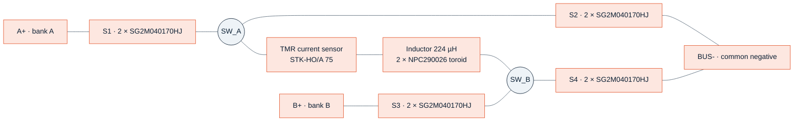
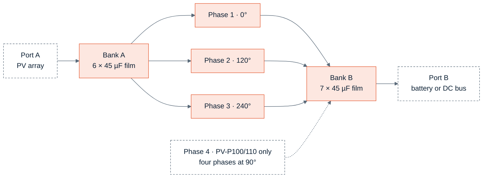
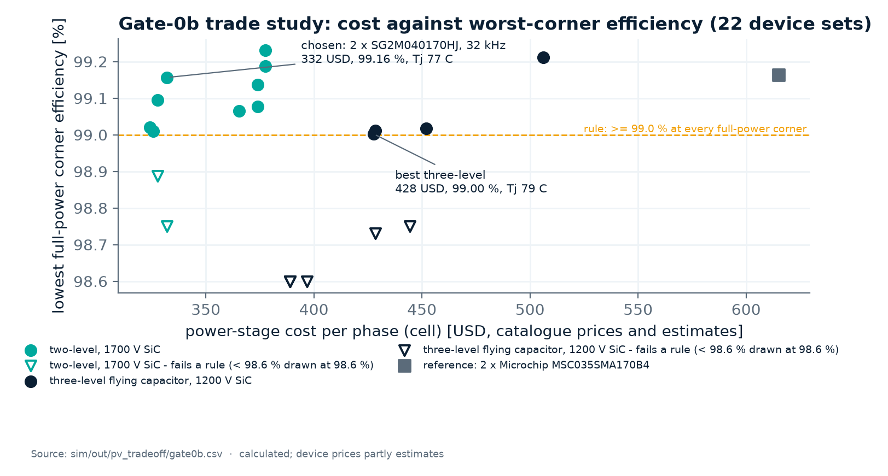
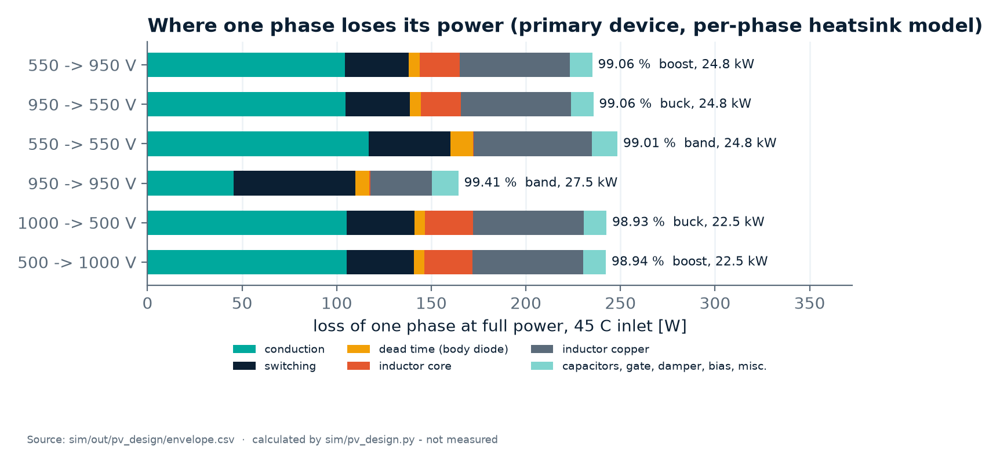
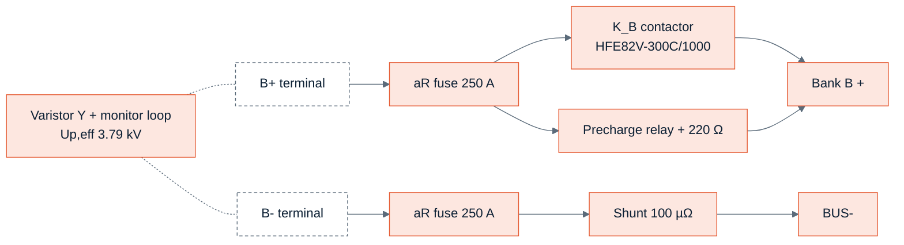

<!-- breadcrumb -->
[Home](../../README.md) › [Documentation](../README.md) › Power stage

# ⚡ Power stage — the interleaved four-switch buck-boost

> One phase, the interleaved module, why it is two-level, which devices it uses and on what evidence, the gate-drive channel and what each part of it protects against, the capacitors, the operating modes, the calculated losses and temperatures, and the port circuits.

---

> [!NOTE]
> All efficiencies, temperatures and stresses here are **calculated** (loss models on datasheet curves, ngspice decks
> with fitted device models). The cell design is [sim/out/pv_design/report.md](../../sim/out/pv_design/report.md) and
> [cell_spec.json](../../sim/out/pv_design/cell_spec.json); the as-built values are in the
> [PV-PWR design check](../../hardware/PV-PWR/outputs/PV-PWR_design_check.txt). "Phase" on this page is what the earlier
> platform called a "cell" (PVCELL-25).

## ⚡ One phase

A non-inverting four-switch buck-boost (FSBB) with a common negative rail: leg A faces port A, leg B faces port B, and
one inductor joins the two switch nodes. Every switch position is two paralleled 1700 V SiC MOSFETs.

| Mode | When | Leg A (S1 / S2) | Leg B (S3 / S4) |
|---|---|---|---|
| Buck | VB / VA ≤ Dmax = 0.943 | switches | S3 on, S4 off |
| Band | between the two | switches, DA = Dmax · min(1, VB/VA) | switches, DB = Dmax · min(1, VA/VB) |
| Boost | VB / VA ≥ 1 / Dmax = 1.060 | S1 on, S2 off | switches |

Source: [cell_spec.json](../../sim/out/pv_design/cell_spec.json) `switching.modes`. Bootstrap gate supplies are
impossible because S1 or S3 stays on for whole seconds; hence the isolated bias below. The mode transitions and their
hysteresis are on [05 · Control and firmware](05-control-and-firmware.md).

## 🧭 The interleaved module

| Rating | Per phase | PV-P75 (3 phases) | PV-P100/110 (4 phases) |
|---|---:|---:|---:|
| Rated / maximum power (kW) | 25 / 27.5 | 75 / 82.5 | 100 / 110 |
| Current on the lower-voltage port (A) | 45 | 135 | 180 |
| Port voltage range (V) | 250–1000 | 250–1000 | 250–1000 |
| Full-power window (V) | 550–950 | 550–950 | 550–950 |
| Power limit rule | min(27.5 kW, 45 A × min(VA, VB)) | 82.5 kW from 611 V | 110 kW from 611 V |
| Switching frequency, carrier | 32 kHz, centre-aligned | 120° interleave | 90° interleave |

Sources: [REQUIREMENTS.md §2](../requirements/REQUIREMENTS.md), [cell_spec.json](../../sim/out/pv_design/cell_spec.json)
`ratings`, `switching`; [control_spec.json](../../sim/out/pv_control/control_spec.json) `sampling.interleave_deg`.

## 🔬 Trade study: why two-level

Requirement PV-18 asked for a comparison of (a) 1700 V devices in a plain two-level stage, (b) a three-level stage with
lower-voltage devices and (c) a series or interleaved arrangement, by device loss and transient simulation.

**Gate-0** ([sim/out/pv_tradeoff/report.md](../../sim/out/pv_tradeoff/report.md), Western devices) recommended topology A,
two-level FSBB with 1700 V SiC. Its selected designs, calculated:

| Candidate | Devices / drivers per phase | Lowest corner η (%) | Peak η (%) | VDC / VDSS (rule ≤ 0.67) |
|---|---:|---:|---:|---:|
| A2k — two-level, 2000 V SiC | 8 / 4 | 99.12 | 99.63 | 0.50 |
| **A17 — two-level, 1700 V SiC (chosen)** | 8 / 4 | 99.03 | 99.52 | 0.59 |
| B — three-level flying capacitor, 1200 V SiC | 16 / 8 | 99.00 | 99.63 | 0.44 |
| C — series-stacked split bus, 1200 V SiC | 16 / 8 | 99.02 | 99.68 | 0.44 |
| X12 — two-level, 1200 V SiC (reference only) | 4 / 4 | 99.01 | 99.62 | **0.83 — excluded** |

**Gate-0b** ([gate0b.md](../../sim/out/pv_tradeoff/gate0b.md), [D-041](../requirements/DECISIONS.md)) re-ran the choice with
Asian devices and costs in USD. The rule was: stay two-level unless the best three-level candidate is more than 15 %
cheaper per phase.

Chart: [figures_design.py](../assets/figures_design.py) from [gate0b.csv](../../sim/out/pv_tradeoff/gate0b.csv).

| Gate-0b result (calculated, prices partly estimates) | Cost per phase (USD) | Lowest corner η (%) | Tj max at 45 °C (°C) |
|---|---:|---:|---:|
| Cheapest two-level: 1 × SG2M020170HJ at 40 kHz | 324 | 99.02 | 107 |
| **Chosen: 2 × SG2M040170HJ at 32 kHz (the D-007 design point)** | **332** | **99.16** | **77** |
| Best three-level: 1 × SG2M014120LJ at 40 kHz, 8 drivers, flying capacitors | 428 | 99.00 | 79 |
| Reference: 2 × Microchip MSC035SMA170B4 | 615 | 99.16 | 77 |

The best three-level candidate is 29 % dearer than the chosen two-level set and needs twice the gate-drive channels;
the result holds for device prices ±30 % and for InventChip at 1.5 × the Sichain price. The chosen set keeps the
verified boards, control and magnetics of the D-007 design point; the cheapest two-level set would save 8 USD per
phase at 30 K more junction temperature.

## ⚡ Devices

| Role | Part | Per module | Evidence on file | Price (USD) |
|---|---|---:|---|---:|
| **Primary** | Sichain SG2M040170HJ, 1700 V, 40 mΩ, TO-247-4L, 2 per switch | 24 (32) | datasheet only; **no qualification statement** (p1: halogen-free / RoHS; p14: consult Sichain for high-reliability use); no short-circuit rating; no cosmic-ray FIT curve | 4.07 — **estimate** (scaled from the LCSC price of the 20 mΩ part) |
| Qualified fallback | Microchip MSC035SMA170B4, 2 per switch at +20 / −4 V, assembly variant of the same board | 24 (32) | qualified; 3.1 µs typical short-circuit withstand at 1200 V | 39.44 (RS HK) |
| Rejected | InventChip IV2Q17020T4Z / IV2Q17040T4Z | — | fail the false-turn-on check: +4.0 / +4.41 V at the die even with an ideal clamp ([D-043](../requirements/DECISIONS.md)) | RFQ |
| Module option | none | — | no 1700 V SiC module in the 20–60 mΩ class at any maker that could be read; a module would have to beat 16.5 USD per half-bridge ([D-055](../requirements/DECISIONS.md), [asia_modules.md](../../sim/data/asia_modules.md)) | — |

Calculated device stress (PV-PWR design check, worst case of the envelope):

| Quantity | Value | Rule or rating | Ratio |
|---|---:|---:|---:|
| Peak VDS at the 1100 V trip and 72.4 A, with turn-on ringing (V) | 1,401 | 0.85 × 1,700 | 0.82 |
| Continuous VDS (V) | 1,000 | 0.67 × 1,700 | 0.59 |
| RMS current per device (A) | 23.2 | ID at 100 °C: 47 | 0.49 |
| Turn-off current per device (A) | 36.2 | IDM: 188 | 0.19 |
| Turn-on dv/dt at the switch node (V/ns) | 124 | driver CMTI 150 | 0.83 |

> [!WARNING]
> The primary device carries the design without a qualification statement, a short-circuit rating or a price
> quotation. Sichain's reliability data and a quote are a release condition ([D-043](../requirements/DECISIONS.md), risk
> R-02); the short-circuit protection timing below assumes a 2.0 µs withstand.

## 🛡️ Gate-drive channel

Twelve (sixteen) identical channels, generated by `gdrv.channel(bias="ext")` in [gen/gdrv.py](../../gen/gdrv.py). The
driver is used **functionally**: the safety barrier is B1 on the control board, so the driver's own impulse rating no
longer carries a reinforced claim ([02 · Architecture](02-architecture.md)).

| Element | As built (calculated) | Protects against |
|---|---|---|
| NOVOSENSE NSI6651ASC-Q1 isolated driver, 10 A, DESAT, soft turn-off | one per switch position; VCC2 UVLO drives RDY | — |
| Gate bias: per phase one SN6505B push-pull + transformer T_BIAS4 (1 : 6, 4 secondaries); per channel a regulator for VDD–VEE 21.29–21.80 V and a shunt for COM–VEE 3.47–3.54 V | VGS on 17.75–18.33 V (window 17.5–18.5 V), off −3.47…−3.54 V; 3.11 W per phase from 5 V; winding capacitance ≤ 3.43 pF | too low a gate voltage (UVLO → RDY → latch) |
| Split gate resistors per device: 3.75 Ω on, 2.5 Ω off, plus 0.5 Ω Kelvin-source resistor | — | turn-on ringing beyond 0.85 × VDSS; current sharing between the paralleled devices |
| Miller clamp: one clamp MOSFET per gate at the gate–Kelvin pins (clamp loop ≤ 1 nH, a layout rule) | die +1.38 V against a 1.94 V minimum threshold at 175 °C (1100 V, 72.4 A); +2.32 V at the pin without the clamp | false turn-on of the off device at 124 V/ns |
| DESAT: string of 3 × US1MH to the drain | trips at VDS 5.43–8.27 V (1.7 × the 3.13 V on-state at the trip current, 175 °C); blanking 263–810 ns | shoot-through, short circuit |
| Short-circuit booster: fires above the driver's 9.8 V maximum DESAT trip | gates off 0.62 µs after detection; 1.03 µs typical / 1.08 µs worst from fault to off, against an **assumed** 2.0 µs withstand | the driver's slow soft turn-off (1.96 µs alone) |
| Dead-time stretch: RC (4.02 kΩ / 100 pF C0G) + Schmitt on IN−, driver interlock | 211–554 ns at the gates; firmware dead band 200 ns | a firmware dead time of zero: about 85 ns of overlap and 59 mJ per edge, ending before the DESAT blanking — the switches would fail within milliseconds ([D-050](../requirements/DECISIONS.md)) |
| Negative-rail detector | a lost COM–VEE trips DESAT at the next turn-on | +5.1 V at the die, 1.57 mJ per event, about 50 W at 32 kHz that DESAT would never see |
| Default-off pull-downs and EN gating | every PWM line 10 k + AND with EN; all RST/EN pulled down | gates turning on while the controller is in reset or unprogrammed |

Sources: [PV-PWR design check](../../hardware/PV-PWR/outputs/PV-PWR_design_check.txt) ("Gate drive", "Dead time"),
[pv_design report §4](../../sim/out/pv_design/report.md), [pv_control report §9.3](../../sim/out/pv_control/report.md),
[ARCHITECTURE-COSTFIRST.md §6.5](../requirements/ARCHITECTURE-COSTFIRST.md).

Open points: the driver's CMTI margin is thin (150 V/ns against 124 V/ns, ×1.21); the Miller margin rests on estimated
loop inductance and is the first item for a double-pulse test ([D-028](../requirements/DECISIONS.md)). The documented
alternates of the driver are compared in [GDRV-ALTERNATES.md](../requirements/GDRV-ALTERNATES.md).

## 📐 Capacitors

| Position | Part and quantity | Calculated duty | Rating | Note |
|---|---|---|---|---|
| Port banks | FCSA3DS456 (45 µF PP film): port A 6 (2 per phase) = 270 µF; port B 7 = 315 µF; PV-P100/110: 8 per port = 360 µF | 1,100 V max; OV overshoot 1,144 V; 11.8 A rms per capacitor (worst phase, no interleaving credit) | 1,100 V at 85 °C hot spot (≤ 1.15 × after IEC 61071); 22.1 A at 85 °C | ripple at 53 % of rating; port B is sized by full-power load rejection (278.5 µF needed, [D-058](../requirements/DECISIONS.md)) |
| Leg decoupling | 3 × FCSA3DS225 per leg | 62.5 A peak (with recovery), 3.04 A rms, 0.21 W | 176 A peak, 3.9 A rms | ESL 8.3 nH per leg against the 8.5 nH basis |
| RC damper per leg | 2 × (3 × 15 Ω 2512) + 2 × 4.7 nF 2 kV C0G | 5.68 W at the trip corner, 235 V per resistor | 7.4 W at 85 °C board, 500 V | C0G at 687 V per element (≤ 50 %) |
| X capacitor per port | 2.2 µF / 1300 V (RFQ) | surge network | impulse ≥ 4.5 kV | |
| Y1 per port | 2 × 4.7 nF to PE | 1,144 V pole–PE | 1,500 V DC | 76 % |

Source: [PV-PWR design check](../../hardware/PV-PWR/outputs/PV-PWR_design_check.txt). **Open (R-08):** the Chinese
film capacitors' ESL (35 nH bank / 25 nH decoupling) differs from the KEMET parts in the leg deck
(`sim/spice/pv_dpt_leg_dec.cir`), which has to be re-run.

## 🔬 Losses, efficiency and temperature

Chart: [figures_design.py](../assets/figures_design.py) from [envelope.csv](../../sim/out/pv_design/envelope.csv)
(primary device, per-phase heatsink model of the cell design).

| Calculated, one phase, 45 °C inlet | Value | Source |
|---|---:|---|
| Peak efficiency, worse of the two devices | 99.57 % at 900 → 1000 V, 16.5 kW | [cell_spec.json](../../sim/out/pv_design/cell_spec.json) `efficiency` |
| Peak efficiency, primary device | 99.66 % | [pv_design report §2](../../sim/out/pv_design/report.md) |
| Full-power corners, worse of the two devices | 99.04 % (1000 → 500 V) to 99.31 % (950 → 950 V) | cell_spec.json `efficiency.corners` |
| Whole 250–1000 V square at the power limit | minimum 98.28 % (250 → 1000 V); 98 of 256 points below 99 %, none inside 550–950 V | pv_design report §2 |
| Dip where VA = VB = 800 V (both legs switching) | 99.59 → 99.33 % | pv_design report §2 |

These per-phase figures include gate drive, bias, sensing and the dampers, with the dead time at its maximum; they
exclude fans, controller and port parts.

**Module level — not yet re-run for the cost-first module.** The module efficiency of
[module_report.md](../../sim/out/pv_design/module_report.md) (99.49 % peak) was computed for the earlier platform
(Sanyo fans, NH fuses, per-phase heatsinks). For the cost-first module the power-board check adds the cheaper
round-wire inductor: +98 W per PV-P75 at the worst point, about −0.13 percentage points
([D-054](../requirements/DECISIONS.md)). A module re-run with the shared heatsink, the Delta fans and the lean port
parts is open ([ARCHITECTURE-COSTFIRST.md §9](../requirements/ARCHITECTURE-COSTFIRST.md)).

| Thermal, 45 °C inlet, full power (calculated) | PV-P75 | PV-P100/110 |
|---|---:|---:|
| Shared heatsink, Rsa incl. air rise (K/W) | ≤ 0.060 at ~424 m³/h | ≤ 0.049 at ~566 m³/h |
| Device losses (W) | 536 | 715 |
| Heatsink (°C) | 77.2 | 80.0 |
| Hottest junction (°C), design limit 125 °C | 107.3 | 110.1 |
| Inductor hot spot at 55 °C local air (°C), limit 155 °C | 145 | 145 |

Source: power-board design checks ([PV-PWR](../../hardware/PV-PWR/outputs/PV-PWR_design_check.txt),
[PV-PWR-4](../../hardware/PV-PWR-4/outputs/PV-PWR-4_design_check.txt)). The per-phase heatsinks of the earlier platform
gave 78–80 °C.

The check also raised a finding the control board then implemented: to keep a 5 K margin on the junction, the heatsink
over-temperature trip must be ≤ 89.9 °C, not the architecture's 95 °C — PV-CTL trips at 86.3–89.5 °C. The three fans
(Delta AFB1224SHE-F00) are rated only to −10 °C against the −30 °C of PV-20 (risk R-05).

Existing simulation plots of the cell design (efficiency maps, load curves, ngspice against analytic)

From [sim/pv_design.py](../../sim/out/pv_design/report.md); per-phase heatsink model (78 °C junction), not the
shared heatsink of the cost-first module.

## 🛡️ Port circuits

Both ports keep one Hongfa contactor in the + pole; only the battery port has fuses and precharge. The circuits are
`lean_port()` in [gen/port.py](../../gen/port.py), sized in [port_spec.json](../../sim/out/port_design/port_spec.json)
`lean` and [port report §13](../../sim/out/port_design/report.md).

Battery port B. Port A (PV) is the same without fuses and without precharge: the array is a current-limited source
(Isc ≤ 1.25 × 135 A = 169 A).

| Function | Port A (PV) | Port B (battery or DC bus) |
|---|---|---|
| Contactor | HFE82V-300C/1000 in A+ (300 A at 85 °C; 200 openings at 300 A / 1000 V; no auxiliary contact) | same in B+ |
| Fuses | none: the array cannot exceed 169 A | Hongfa HPE501/000B100-250 aR in both poles; breaks only 1.25–50 kA |
| Precharge | none; with a battery present the converter precharges bank A from bank B | relay + 220 Ω: τ 69 ms, ΔV ≤ 10 V after 0.32 s, 158 J per attempt |
| Hardware interlocks in the coil drive | polarity enable 187–213 V | polarity enable 187–213 V and precharge ΔV window 3.5–16.5 V |
| Hold-off (contactor kept closed above its breaking capability) | 967–1,033 A | 967–1,033 A |
| Port over-current trip (onto FLT_N) | 387–413 A | 387–413 A |
| Current sensing | 100 µΩ shunt in `BUS-` (2 × 200 µΩ), two gains: 3.0 mV/A (±513 A, 11.3 kHz) and 1.0 mV/A (±1,539 A) | same |
| Surge | monitored varistor Y: 3 × Thinking TVT25751, two 14 × 51 branch fuses, one monitor loop; Up,eff 3.79 kV, Uc 1,230 V, In 3 kA, Imax 25 kA | same |
| Common-mode filter | one flat-µ nanocrystalline ring + ≥ 127 nF to PE: 17.2 dB at 150 kHz (calculated) | same |
| Discharge | passive bleeder 8 × 73.2 kΩ: 60 V after 8.2 min from 1,100 V (8.4 min worst case, calculated); label "wait 10 min" | same bleeder: 60 V after 9.5 min (9.7 min worst case, calculated); label "wait 10 min" |
| Insulation monitor | PE divider + two switched 992 kΩ strings through CA-IS3417WT; threshold 33 kΩ; ~1.5 s per state with the 3-sample prediction | — (one monitor per connected system) |

Sources: [port_spec.json](../../sim/out/port_design/port_spec.json) `lean`, `spd`, `imd`; [port report §13](../../sim/out/port_design/report.md);
[PV-PWR design check](../../hardware/PV-PWR/outputs/PV-PWR_design_check.txt) ("Port currents", "Bleeders");
[magnetics report](../../sim/out/magnetics/report.md) (CM ring); [D-042](../requirements/DECISIONS.md), [D-048](../requirements/DECISIONS.md).

What the published data do **not** support, stated by the port report itself: Hongfa's "1.5 kA once" is a no-fire test,
not a rated interruption; the 1.0 kA hold-off rule rests on an interpolation (2.3 openings) at L/R ≤ 1 ms; closing K_A
onto an empty bank at 1000 V makes about 499 A (estimate) against a published make rating of 140 A at 20 V only. The
coordination with the upstream protection is on [04 · Protection and safety](04-protection-and-safety.md). The
capacitance to PE puts about 11 mA into the protective conductor: the product needs PE ≥ 10 mm² Cu and a
high-touch-current label ([D-048](../requirements/DECISIONS.md)).

The inductor, the bias transformer and the CM ring are covered on [06 · Magnetics](06-magnetics.md).

---

<!-- footer -->
← [02 · Architecture](02-architecture.md) · [Documentation index](../README.md) · [04 · Protection and safety](04-protection-and-safety.md) →
