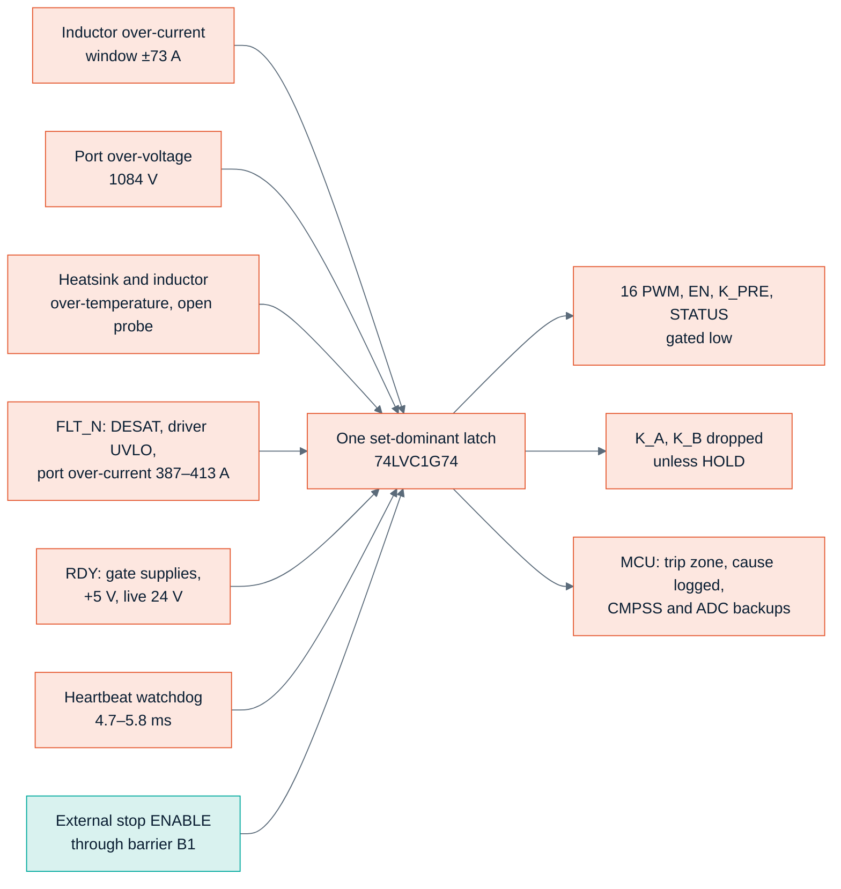
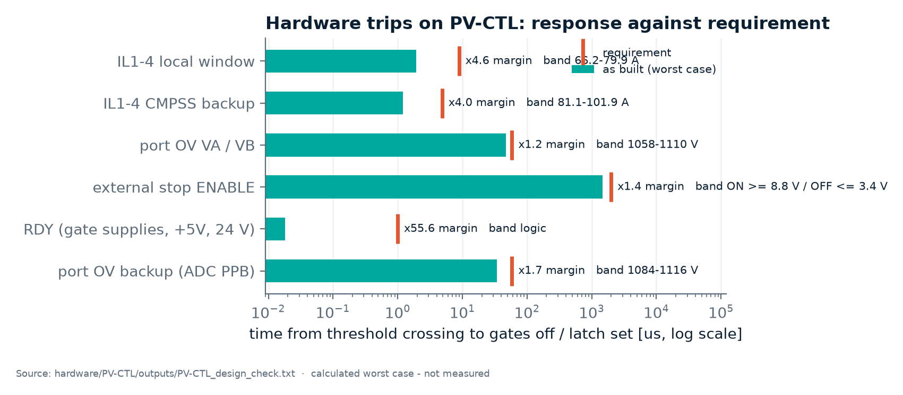
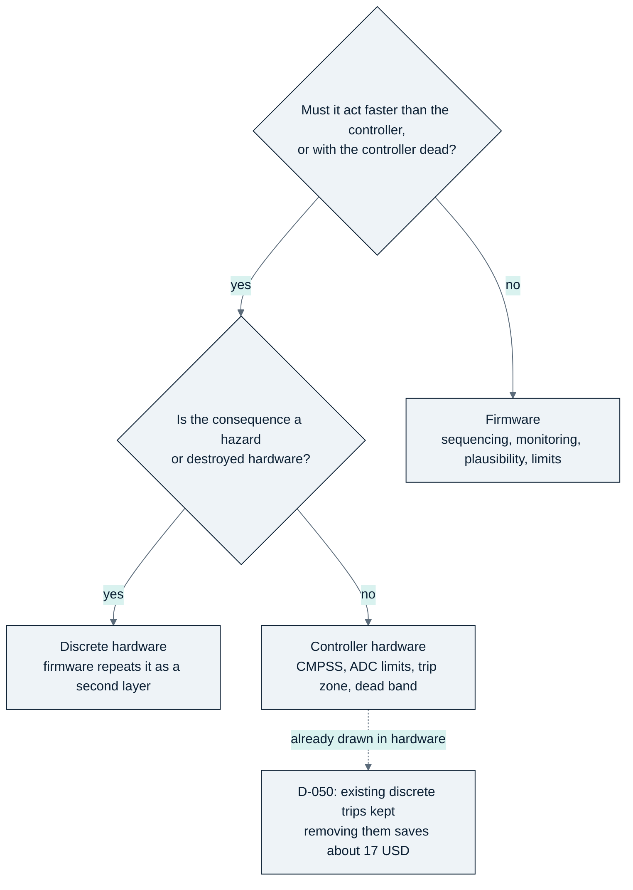
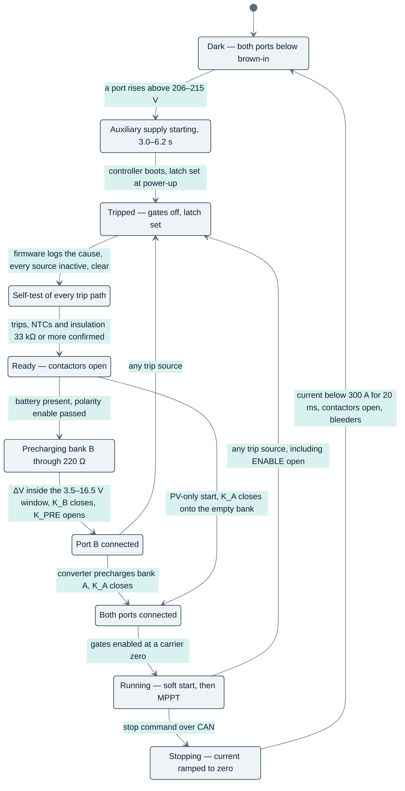
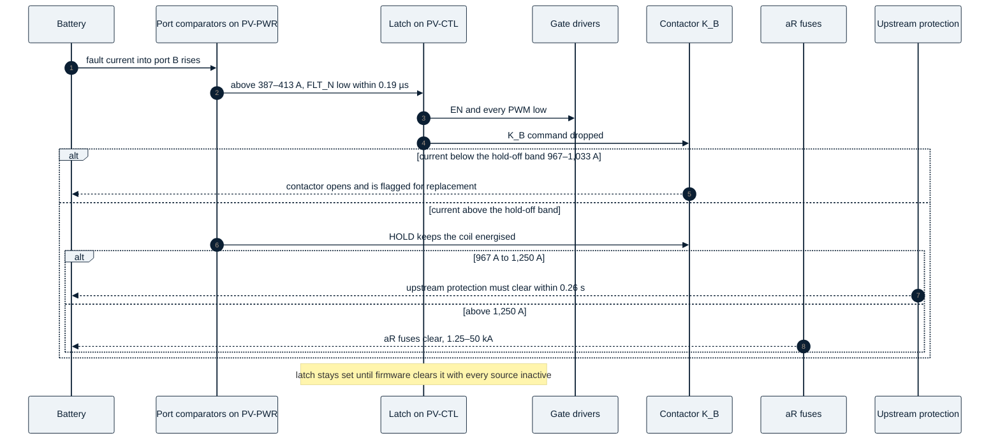

<!-- breadcrumb -->
[Home](../../README.md) › [Documentation](../README.md) › Protection and safety

# 🛡️ Protection and safety

> Every trip of the cost-first PV module — where it is detected, its threshold band and response time against the requirement — the latch, the split between hardware and firmware and the numbers behind it, the contactor rules and the installation requirement, the start-up, shutdown and fault sequences, the insulation coordination, and what the design does not protect against.

---

> [!NOTE]
> Thresholds, bands and response times are **calculated worst cases** from the drawn netlists and the datasheets
> ([PV-CTL design check](../../hardware/PV-CTL/outputs/PV-CTL_design_check.txt),
> [PV-PWR design check](../../hardware/PV-PWR/outputs/PV-PWR_design_check.txt)); the requirements come from simulation
> ([pv_control report §9–§10](../../sim/out/pv_control/report.md)) and the port design
> ([port_spec.json](../../sim/out/port_design/port_spec.json) `lean`). Nothing has been tested on hardware.

## 🛡️ Protection layers at a glance

Every hazardous condition is caught by a discrete circuit that needs no firmware; the controller's own comparators and
ADC limits are a second, independent layer; firmware is a third layer and owns sequencing and monitoring.

As drawn on [PV-CTL sheets 04–05](../../hardware/PV-CTL/outputs/PV-CTL_schematic.pdf) and the power board's port and
gate-drive sheets.

## 🛡️ Every trip

| Trip | Source and sensor | Detected in | Threshold (worst-case band) | Response | Requirement |
|---|---|---|---|---|---|
| Inductor over-current, primary | TMR sensor → TLV9024 window | discrete, PV-CTL | +73.0 / −73.5 A (66.2–79.9 A) | 1.95 µs to gates off | ≥ 65.4 A (1.05 × normal peak) and below the backup band; ≤ 8.92 µs after 76 A, before 50 % inductance at 129 A |
| Inductor over-current, backup | same sensor → CMPSS1–4 | controller hardware | ±91.5 A (81.1–101.9 A) | 1.21 µs | ≤ 4.87 µs |
| Short circuit, shoot-through | DESAT on each driver + booster | driver | VDS 5.43–8.27 V; blanking 263–810 ns | gates off 0.62 µs after detection, 1.03–1.08 µs from the fault | within the **assumed** 2.0 µs withstand |
| Port over-current | shunt (low-gain path) → window comparator → FLT_N | discrete, PV-PWR | 387–413 A | 0.19 µs (logic) | coordination band 387–413 A |
| Port over-current, backup | IA / IB → ADC post-processing limit or CMPSS4 | controller hardware | 373–427 A | 46 µs (ADC) / 30 µs (CMPSS4) | firmware latency ≤ 0.50 s (aR melting curve) |
| Port over-voltage | bank divider → TLV9024 | discrete, PV-CTL | 1,084 V (1,058–1,110 V) | 47 µs | ≤ 58.5 µs; last switching event ≤ 1,135 V |
| Port over-voltage, backup | ADC post-processing limit, conversion every ≤ 10 µs | controller hardware | 1,100 V (1,084–1,116 V) | 33.9 µs | ≤ 58.5 µs |
| Port over-voltage, soft limit | ADC, controlled stop | firmware | 1,050 V | outer loop | above the 1,010 V limit loop |
| Heatsink over-temperature | NTC1–4 | discrete | 87.9 °C (86.3–89.5 °C) | thermal (1 ms RC) | ≤ 89.9 °C (junction ≤ 125 °C with 5 K margin) |
| Inductor over-temperature | NTC5–8 in the winding pocket | discrete | 149.9 °C (146.2–153.7 °C) | thermal | above the 145 °C full-load hot spot, below 155 °C |
| Open NTC probe | all 8 channels | discrete | reading > 2.975 V | thermal | — |
| Gate-supply loss | NSI6651 UVLO, +5 V supervisor (RDY low below 4.52–4.69 V), live 24 V undervoltage 21.0–21.8 V | RDY wired-AND | logic | 18 ns | ≤ 1 µs |
| Watchdog | 74LVC1G123 heartbeat monoflop + TPS3828 reset | discrete | 4.7–5.8 ms without an ISR edge; reset after 0.9–2.5 s | = monoflop time | 5 ms |
| External stop | ENABLE, default-low isolator CA-IS3821LG | discrete, across B1 | ON ≥ 8.8 V, OFF ≤ 3.4 V | 1.47 ms | ≤ 2 ms |
| 3.3 V brown-out | TPS3828 2.88–3.00 V → MCU reset → watchdog line | discrete | — | via reset | — |
| Reverse polarity | terminal divider VAX / VBX → comparator in the coil driver | discrete interlock | enable at 187–213 V | blocks the coil | firmware cannot close onto a reversed source |
| Precharge ΔV | G = 20 difference amplifier → comparator | discrete interlock | 3.5–16.5 V window | blocks K_B | ≤ 10 V nominal |
| Contactor hold-off | shunt (1.0 mV/A path) → comparator → HOLD | discrete | 967–1,033 A | holds an energised coil | never open a contactor above its breaking capability |

Sources: trip table and checks of the [PV-CTL design check](../../hardware/PV-CTL/outputs/PV-CTL_design_check.txt);
gate drive and port lines of the [PV-PWR design check](../../hardware/PV-PWR/outputs/PV-PWR_design_check.txt);
[port_spec.json](../../sim/out/port_design/port_spec.json) `lean`; requirements from
[pv_control report §9–§10](../../sim/out/pv_control/report.md).

Chart: [figures_design.py](../assets/figures_design.py) from the PV-CTL trip table (rows that state both a response
time and a time requirement).

> [!IMPORTANT]
> **Where the records disagree.** [ARCHITECTURE-COSTFIRST.md §6](../requirements/ARCHITECTURE-COSTFIRST.md) lists a local
> over-current band of 68.5–76 A (the closed-loop LEM sensor of the earlier platform), a heatsink trip of 95 °C, an
> inductor trip of 145 °C (which would trip at full load), a hold-off of 1.0 kA (0.95–1.05 kA) and an upstream
> requirement of 0.95–1.3 kA within 0.25 s at L/R ≤ 3 ms. The drawn boards and the port design use 66.2–79.9 A,
> 86.3–89.5 °C, 146.2–153.7 °C, 967–1,033 A and 967–1,250 A within 0.26 s at **L/R ≤ 1 ms** — the contactor's breaking
> data exist only at L/R ≤ 1 ms ([port report §13](../../sim/out/port_design/report.md)). This page uses the drawn values.
> The requirement times in [control_spec.json](../../sim/out/pv_control/control_spec.json) `hardware_trips` still describe
> the earlier platform's trip chain.

## 🛡️ The latch

One set-dominant flip-flop (74LVC1G74) on PV-CTL, set through a 74LVC07 open-drain wired-AND by any source above.

| | |
|---|---|
| What sets it | inductor windows, port OV, both over-temperatures, open probe, FLT_N, RDY, ENABLE open, heartbeat stop, 3.3 V supervisor, MCU reset; **power-up always starts tripped** |
| What it does | gates all 16 PWM lines, EN, K_PRE and STATUS low through 6 × 74LVC08; drops K_A and K_B unless the power board asserts HOLD (a trip never commands a held contactor open); signals the MCU trip zone |
| What clears it | only a firmware rising edge on the clock input (GPIO24) **while every source is inactive**; an edge during an active source is ignored; no automatic clear after a watchdog reset, an over-current or an over-voltage trip; the cause is logged to EEPROM first |
| How it was checked | logic evaluated from the drawn netlist for **79 fault cases in 2 builds** (PV-P75 and PV-P100/110), including dead sensors (0 V), shorted and open NTCs and firmware still commanding the outputs |
| Dual channel | none (decision D-044): a single latch, no fault-tree analysis |

Source: [PV-CTL design check](../../hardware/PV-CTL/outputs/PV-CTL_design_check.txt), "Latch logic evaluated from the
drawn netlist"; [gen/pv_ctrl.py](../../gen/pv_ctrl.py) docstring.

## 🎛️ Hardware versus firmware

The owner asked to "offload whatever possible to the firmware to save cost" (requirement SRC-7). Decision
[D-049](../requirements/DECISIONS.md) moved most discrete protection into the controller; one day later
[D-050](../requirements/DECISIONS.md) reversed it after the saving was worked out part by part
([ARCHITECTURE-COSTFIRST.md §6.5](../requirements/ARCHITECTURE-COSTFIRST.md)).

| Protection kept in hardware | Cost of keeping it | Why it stays |
|---|---:|---|
| Discrete inductor-current, port-OV and over-temperature comparators, the latch, the PWM gating, the heartbeat watchdog (PV-CTL) | about 5 USD | an independent layer that works with the controller mis-programmed; the controller's comparators stay the backup |
| RC dead-time stretch, per gate-drive channel | about 1.5 USD per module | a firmware dead time of zero gives ~85 ns of overlap per edge (~59 mJ), ending before the DESAT blanking: nothing catches it and the switches fail within milliseconds |
| Negative-rail detector, per channel | about 0.03 USD per channel | a lost negative rail gives +5.1 V at the die, 1.57 mJ per event, ~50 W at 32 kHz — survivable, but never seen by DESAT |
| Polarity and precharge-ΔV interlocks, port over-current comparators (PV-PWR) | about 11 USD for both ports | a firmware error would close a contactor onto reversed polarity or a large ΔV, or let a battery-fed fault melt a fuse below its breaking range |
| Hold-off comparator, external stop onto the latch, DESAT, driver UVLO, default-off pull-downs | — | must work with the controller dead; a hazard otherwise |

In total about **17 USD per module, roughly 2 % of the bill of materials**. The lighter variants remain as generator
options (`interlocks="hold"`, `oc_trip=False` in [gen/port.py](../../gen/port.py); `stretch=False`, `neg_det=False` in
[gen/gdrv.py](../../gen/gdrv.py)); the build PORT-LEAN-HOLD exercises the lighter port. The same allocation is applied to
the DC-to-AC product ([09 · PCS-P125](09-pcs-p125.md)). The firmware's side of the bargain is listed on
[05 · Control and firmware](05-control-and-firmware.md#firmware-requirements).

## 🛡️ Contactor rules and the installation requirement

1. **Close** only with the latch clear and the terminal voltage of the right polarity (hardware interlock, enable at
   187–213 V); K_A only after an insulation measurement of ≥ 33 kΩ (IEC 62109-2 rule, quoted from memory); K_B only
   after precharge with ΔV inside the 3.5–16.5 V window.
2. **Open** for a normal stop only after the converter has stopped and |I| < 300 A has held for ≥ 20 ms (two release
   times). The HFE82V-300C/1000 is rated for 200 openings at 300 A / 1000 V.
3. **Fault opening** up to the hold-off band: above 967–1,033 A the hold-off keeps an energised coil on; it can never
   energise an open contactor. About 2.3 openings are expected at the band top (interpolated, L/R ≤ 1 ms); every opening
   above 300 A flags the contactor for replacement.
4. **No auxiliary contact:** a weld is found by moving the bank voltage by ≥ 50 V after opening and checking that the
   terminal voltage does not follow; a weld blocks restart.

| Current from the battery into the module | Who clears it |
|---|---|
| ≤ 300 A | converter control and K_B, normal opening |
| 300 A – 967 A | K_B opens (fault opening; contactor replaced afterwards) |
| **967 A – 1,250 A** | **neither, guaranteed — the upstream battery protection** (K_B is held; the 250 A aR fuse breaks only from 1.25 kA) |
| 1,250 A – 50 kA | HPE501/000B100-250 aR fuse in each pole |

**Installation requirement (battery or DC-bus side), as numbers**
([port report §13](../../sim/out/port_design/report.md), [port_spec.json](../../sim/out/port_design/port_spec.json)
`lean.installation`):

- The upstream battery protection must interrupt **any current of 967–1,250 A into the module's battery port within
  0.26 s**.
- The prospective short-circuit current at the battery terminals must not exceed **50 kA with L/R ≤ 1 ms**.
- The cable from the battery protection to the module is protected by that upstream device.
- One active insulation monitor per galvanically connected system (array and battery are one system through `BUS-`).
- PV side: array short-circuit current ≤ 169 A (225 A for PV-P100/110); string fuses in the combiner; a load-break DC
  isolator upstream for maintenance.

## 🎛️ Sequences

**Start-up, normal stop and trip** (from [ARCHITECTURE-COSTFIRST.md §6.2](../requirements/ARCHITECTURE-COSTFIRST.md),
[aux75_spec.json](../../sim/out/aux_hv_design/aux75_spec.json) `startup`, [pv_control report §8](../../sim/out/pv_control/report.md)):

**A battery-fed fault at port B** — how the layers hand over:

**A shoot-through inside a phase** is not seen by the inductor sensor when the inductor is bypassed: DESAT detects it
after the 263–810 ns blanking, the booster has the gates off 0.62 µs later, FLT_N sets the latch, and every other channel
is disabled. Total 1.03 µs typical / 1.08 µs worst against an assumed 2.0 µs withstand
([pv_control report §9.3](../../sim/out/pv_control/report.md)).

## 🛡️ Insulation coordination summary

| Item | Value | Source |
|---|---|---|
| Working voltage, DC side | 1,000 V DC; 1,100 V at the OV trip | [insulation_spec.json](../../sim/out/insulation/insulation_spec.json) |
| Recurring switch-node peak | 1,273 V at 1,000 V; 1,401 V at the trip | [ARCHITECTURE-COSTFIRST.md §2](../requirements/ARCHITECTURE-COSTFIRST.md) |
| Overvoltage category, pollution | DC OVC II; PD2 inside the coated electronics compartment, PD3 in the cooling-air path | [D-032](../requirements/DECISIONS.md) |
| Port surge level with the varistor network | Up,eff 3.79 kV pole–PE and pole–pole | [port_spec.json](../../sim/out/port_design/port_spec.json) `spd` |
| B1, DC side ↔ SELV, reinforced | 8 kV impulse (6 kV with credit), 4,400 V rms, creepage 10.0 mm PD2 (6.4 mm PD1), clearance 8.0 / 9.2 / 10.4 mm at 2000 / 3000 / 4000 m | [PV-CTL design check](../../hardware/PV-CTL/outputs/PV-CTL_design_check.txt) |
| B2, DC side ↔ PE, basic | 6 kV impulse (4 kV with credit), 2,200 V rms, creepage 5.0 mm PD2 / 12.5–16 mm PD3 | ARCHITECTURE-COSTFIRST.md §2.1 |
| B3, inside the DC side, functional | partial-discharge-free at ≥ 1.75 kVpk for parts at a switch node | same |
| Audit status | earlier platform: 132 rows, 22 fail at 2000 m; cost-first boards: only B1's five isolators checked so far | [insulation report](../../sim/out/insulation/report.md), [08 · Verification](08-verification.md) |

All standard values (IEC 60664-1, IEC 62477-1, IEC 62109) are transcriptions from memory; the credit of a monitored
arrester for reinforced insulation is not verified against the standard text ([D-032](../requirements/DECISIONS.md)).

## ⚠️ What the design does not protect against

Stated plainly, from [ARCHITECTURE-COSTFIRST.md §6.4 and §12](../requirements/ARCHITECTURE-COSTFIRST.md), the
[port report §13](../../sim/out/port_design/report.md) and the decision register:

- **A bolted short at a port's terminals.** The bank (270 µF, 135 J at 1000 V) dumps through the contactor (~22 kA peak,
  a weld is likely) and rings below zero; the leg body diodes carry up to ~4.5 kA per device — **that port's legs are
  likely destroyed**. On the battery port the dump also melts the aR fuses. The module is expected to fail without fire,
  stays latched and is repaired.
- **Battery-fed currents of 967–1,250 A** are cleared only by the upstream protection (installation requirement above).
- **Loss of both port voltages while more than ~1 kA flows** lets the contactor open above its rating (a double fault).
- **No rated safety function.** ENABLE is a single-channel functional stop with no SIL / PL claim; a cabinet that needs
  a rated function must open its own DC switching devices.
- **Device short circuits beyond the assumed withstand.** No Chinese maker publishes a short-circuit rating; the 2.0 µs
  used for the DESAT timing is an assumption.
- **Data the makers do not publish:** the contactor's making current at 1000 V onto an empty bank (~0.5 kA estimated,
  140 A at 20 V published), its coil-to-mounting insulation, the aR fuse's L/R and let-through, the TMR sensors' dv/dt
  immunity at 124 V/ns.
- **Cold starts below −10 °C** are outside the fans' rating (PV-20 asks −30 °C); a firmware rule or a low-temperature
  fan option is needed (R-05).
- **Firmware faults** that end in a stopped or damaged unit rather than a hazard: D-050 reduced this exposure by keeping
  the discrete layer, but the firmware's own safety-requirement list is not yet implemented (firmware is out of scope).

---

<!-- footer -->
← [03 · Power stage](03-power-stage.md) · [Documentation index](../README.md) · [05 · Control and firmware](05-control-and-firmware.md) →
