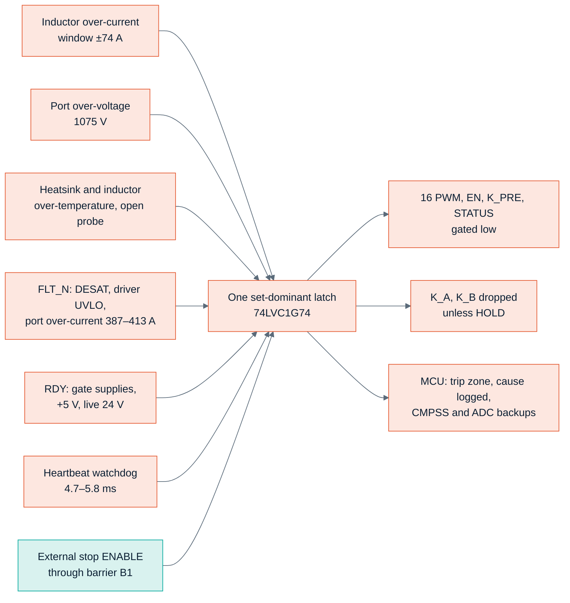
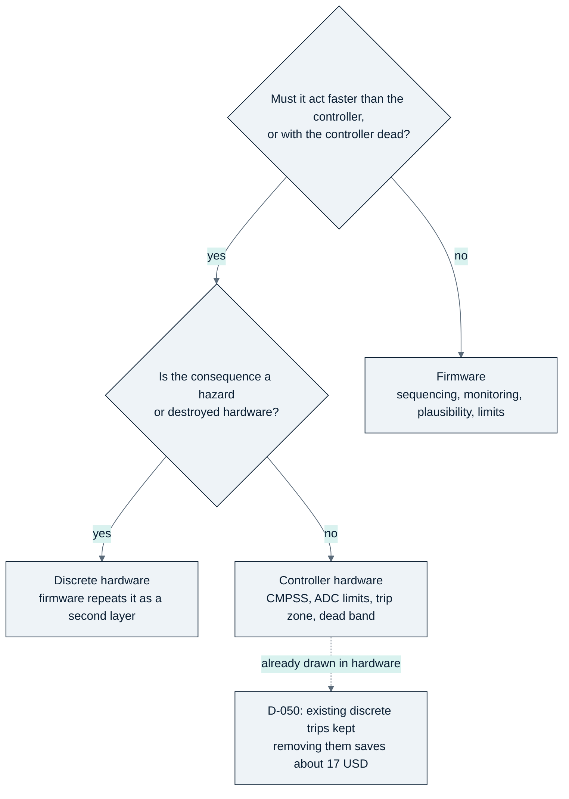
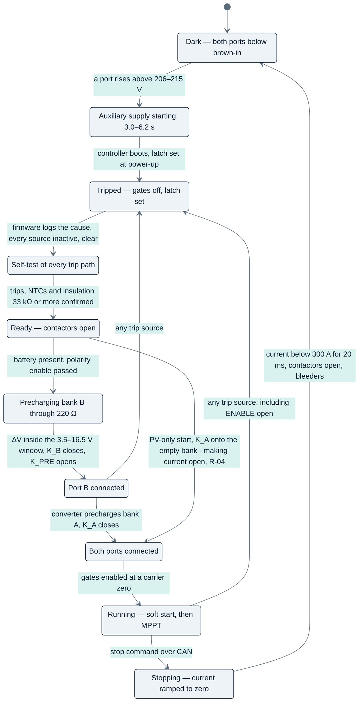
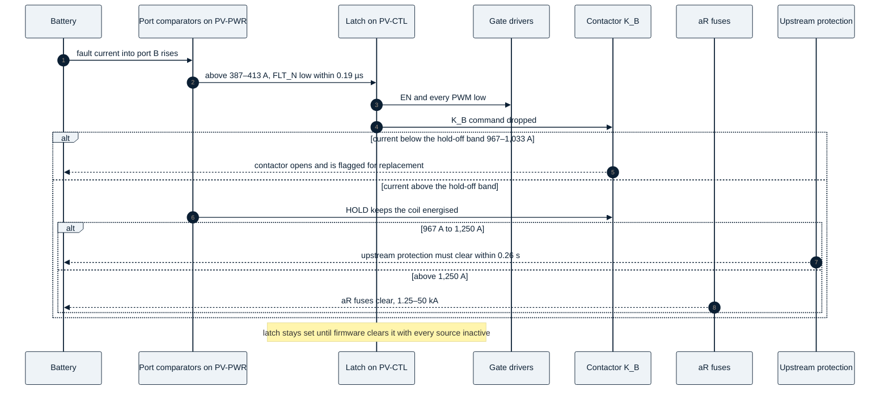

<!-- breadcrumb -->
[Home](../../README.md) › [Documentation](../README.md) › Protection and safety

# 🛡️ Protection and safety

> Every trip of the cost-first PV module — where it is detected, its threshold band and response time against the requirement — the latch, the split between hardware and firmware and the numbers behind it, the contactor rules, the port A declaration and the installation requirement, what differs on the inverter, the start-up, shutdown and fault sequences, the insulation coordination, and what the design does not protect against.

---

> [!NOTE]
> Thresholds, bands and response times are **calculated worst cases** from the drawn netlists and the datasheets
> ([PV-CTL design check](../../hardware/PV-CTL/outputs/PV-CTL_design_check.txt),
> [PV-PWR design check](../../hardware/PV-PWR/outputs/PV-PWR_design_check.txt)); the requirements come from simulation
> ([pv_control report §9–§10](../../sim/out/pv_control/report.md)) and the port design
> ([port_spec.json](../../sim/out/port_design/port_spec.json) `lean`). Nothing has been tested on hardware.

## 🛡️ Protection layers at a glance

Every hazardous condition is caught by a discrete circuit that needs no firmware; the controller's own comparators and
ADC limits are a second, independent layer; firmware is a third layer and owns sequencing and monitoring.

As drawn on [PV-CTL sheets 04–05](../../hardware/PV-CTL/outputs/PV-CTL_schematic.pdf) and the power board's port and
gate-drive sheets.

## 🛡️ Every trip

| Trip | Source and sensor | Detected in | Threshold (worst-case band) | Response | Requirement |
|---|---|---|---|---|---|
| Inductor over-current, primary | TMR sensor → TLV9024 window, thresholds derived from each sensor's own reference output | discrete, PV-CTL | +74.2 / −74.4 A (67.9–80.5 A) | 1.52 µs to gates off | ≥ 68.5 A (1.10 × normal peak) — **missed by 0.58 A** (risk C9) — and below the 81.1 A backup; ≤ 6.92 µs after 80.5 A, before 50 % inductance at 129 A |
| Inductor over-current, backup | same sensor → CMPSS1–4 | controller hardware | ±91.5 A (81.1–101.9 A) | 1.21 µs | ≤ 3.48 µs after 101.9 A |
| Short circuit, shoot-through | DESAT on each driver + booster | driver | VDS 5.43–8.47 V; blanking 263–821 ns | gates off 0.42 µs after detection; 1.17–1.51 µs from the fault in the control model | within the **assumed** 2.0 µs withstand; release needs the maker's tSC ≥ 2.10 µs and ESC ≥ 0.87 J at 1100 V |
| Port over-current | shunt (low-gain path) → window comparator → FLT_N | discrete, PV-PWR | 387–413 A | 0.19 µs (logic) | coordination band 387–413 A |
| Port over-current, backup | IA / IB → ADC post-processing limit or CMPSS4 | controller hardware | 373–427 A | 30 µs (ADC) / 15 µs (CMPSS4) | firmware latency ≤ 0.50 s (aR melting curve) |
| Port over-voltage | bank divider → TLV9024 | discrete, PV-CTL | 1,075 V (1,039–1,110 V) | 47 µs | ≤ 68.8 µs with the phases frozen at their limit (110.7 µs at full power); last switching event ≤ 1,135 V |
| Port over-voltage, backup | ADC post-processing limit, conversion every ≤ 10 µs | controller hardware | 1,100 V (1,084–1,116 V) | 33.9 µs | ≤ 68.8 µs |
| Port over-voltage, soft limit | ADC, controlled stop | firmware | 1,034 V = the comparator band's bottom − 5 V | outer loop (31 µs) | above the 1,010 V limit loop; below the hardware band, so the latch cannot pre-empt it |
| Heatsink over-temperature | NTC1–4 | discrete | 87.9 °C (86.2–89.6 °C) | thermal (1 ms RC) | ≤ 89.9 °C (junction ≤ 125 °C with 5 K margin) |
| Inductor over-temperature | NTC5–8 in the winding pocket | discrete | 149.9 °C (146.1–153.9 °C) | thermal | above the 145 °C full-load hot spot, below 155 °C |
| Open NTC probe | all 8 channels | discrete | reading > 2.975 V | thermal | — |
| Gate-supply loss | NSI6651 UVLO, +5 V supervisor (RDY low below 4.52–4.69 V), live 24 V undervoltage 21.0–21.8 V | RDY wired-AND | logic | 18 ns | ≤ 1 µs |
| Watchdog | 74LVC1G123 heartbeat monoflop + TPS3828 reset | discrete | 4.7–5.8 ms without an ISR edge; reset after 0.9–2.5 s | = monoflop time | 5 ms |
| External stop | ENABLE, default-low isolator CA-IS3821LG | discrete, across B1 | ON ≥ 8.8 V, OFF ≤ 3.4 V | 1.47 ms | ≤ 2 ms |
| 3.3 V brown-out | TPS3828 2.88–3.00 V → MCU reset → watchdog line | discrete | — | via reset | — |
| Reverse polarity | terminal divider VAX / VBX → comparator in the coil driver | discrete interlock | enable at 187–213 V | blocks the coil | firmware cannot close onto a reversed source |
| Precharge ΔV | G = 20 difference amplifier → comparator | discrete interlock | 3.5–16.5 V window | blocks K_B | ≤ 10 V nominal |
| Contactor hold-off | shunt (1.0 mV/A path) → comparator → HOLD | discrete | 967–1,033 A | holds an energised coil | never open a contactor above its breaking capability |

Sources: trip table and checks of the [PV-CTL design check](../../hardware/PV-CTL/outputs/PV-CTL_design_check.txt);
gate drive and port lines of the [PV-PWR design check](../../hardware/PV-PWR/outputs/PV-PWR_design_check.txt);
[port_spec.json](../../sim/out/port_design/port_spec.json) `lean`; requirements from
[pv_control report §9–§10](../../sim/out/pv_control/report.md).

Since the review ([D-072](../requirements/DECISIONS.md), PCM-19) every comparator band includes the TLV9024's
common-mode error at its guaranteed 50 dB rejection (0.98 A / 0.51 A at the inductor window, 9.7 V on the over-voltage
comparator) and the datasheet delay at the real overdrive (×2 assumed, no maximum is published). The inductor window
then misses the 1.10 × normal-peak floor by 0.58 A and its top sits 0.58 A over the 79.9 A cap: the fixed error terms
(5.84 A) exceed the corridor's half-width (5.69 A), so no ladder value restores it. The window stays as drawn (margin
1.09) with an [OPEN] line in the PV-CTL check — a nuisance trip at the worst ripple corner with every tolerance stacked,
not a hazard. Closing path: the CMRR measured ≥ 60 dB at 3.3 V on samples plus 10 ppm/K ladder resistors (0.74 USD)
give 68.8–79.8 A. The sensor's reference output still has no published drive rating or drift
([risk C9](12-risks-and-open-items.md)).

Chart: [figures_design.py](../assets/figures_design.py) from the PV-CTL trip table (rows that state both a response
time and a time requirement).

> [!IMPORTANT]
> **Where the records disagree.** [ARCHITECTURE-COSTFIRST.md §6](../requirements/ARCHITECTURE-COSTFIRST.md) lists a local
> over-current band of 68.5–76 A (the closed-loop LEM sensor of the earlier platform), a heatsink trip of 95 °C, an
> inductor trip of 145 °C (which would trip at full load), a hold-off of 1.0 kA (0.95–1.05 kA) and an upstream
> requirement of 0.95–1.3 kA within 0.25 s at L/R ≤ 3 ms. The drawn boards and the port design use 67.9–80.5 A,
> 86.2–89.6 °C, 146.1–153.9 °C, 967–1,033 A and 967–1,250 A within 0.26 s at **L/R ≤ 1 ms** — the contactor's breaking
> data exist only at L/R ≤ 1 ms ([port report §13](../../sim/out/port_design/report.md)). This page uses the drawn values;
> since [D-065](../requirements/DECISIONS.md) [control_spec.json](../../sim/out/pv_control/control_spec.json)
> `hardware_trips` describes the drawn trip chain as well.

## 🛡️ The latch

One set-dominant flip-flop (74LVC1G74) on PV-CTL, set through a 74LVC07 open-drain wired-AND by any source above.

| | |
|---|---|
| What sets it | inductor windows, port OV, both over-temperatures, open probe, FLT_N, RDY, ENABLE open, heartbeat stop, 3.3 V supervisor, MCU reset; **power-up always starts tripped** |
| What it does | gates all 16 PWM lines, EN, K_PRE and STATUS low through 6 × 74LVC08; drops K_A and K_B unless the power board asserts HOLD (a trip never commands a held contactor open); signals the MCU trip zone |
| What clears it | only a firmware rising edge on the clock input (GPIO24) **while every source is inactive**; an edge during an active source is ignored; no automatic clear after a watchdog reset, an over-current or an over-voltage trip; the cause is logged to the recorder flash first (GD25Q32E, which replaced the EEPROM in [D-075](../requirements/DECISIONS.md)) |
| How it was checked | logic evaluated from the drawn netlist for **86 fault cases in 2 builds** (PV-P75 and PV-P100/110), including dead sensors (0 V), shorted and open NTCs and firmware still commanding the outputs |
| Dual channel | none (decision D-044): a single latch, no fault-tree analysis |

Source: [PV-CTL design check](../../hardware/PV-CTL/outputs/PV-CTL_design_check.txt), "Latch logic evaluated from the
drawn netlist"; [gen/pv_ctrl.py](../../gen/pv_ctrl.py) docstring.

## 🎛️ Hardware versus firmware

The owner asked to "offload whatever possible to the firmware to save cost" (requirement SRC-7). Decision
[D-049](../requirements/DECISIONS.md) moved most discrete protection into the controller; one day later
[D-050](../requirements/DECISIONS.md) reversed it after the saving was worked out part by part
([ARCHITECTURE-COSTFIRST.md §6.5](../requirements/ARCHITECTURE-COSTFIRST.md)).

| Protection kept in hardware | Cost of keeping it | Why it stays |
|---|---:|---|
| Discrete inductor-current, port-OV and over-temperature comparators, the latch, the PWM gating, the heartbeat watchdog (PV-CTL) | about 5 USD | an independent layer that works with the controller mis-programmed; the controller's comparators stay the backup |
| RC dead-time stretch, per gate-drive channel | about 1.5 USD per module | a firmware dead time of zero gives ~85 ns of overlap per edge (~59 mJ), ending before the DESAT blanking: nothing catches it and the switches fail within milliseconds |
| Negative-rail detector, per channel | about 0.03 USD per channel | a lost negative rail gives +5.1 V at the die, 1.57 mJ per event, ~50 W at 32 kHz — survivable, but never seen by DESAT |
| Polarity and precharge-ΔV interlocks, port over-current comparators (PV-PWR) | about 11 USD for both ports | a firmware error would close a contactor onto reversed polarity or a large ΔV, or let a battery-fed fault melt a fuse below its breaking range |
| Hold-off comparator, external stop onto the latch, DESAT, driver UVLO, default-off pull-downs | — | must work with the controller dead; a hazard otherwise |

In total about **17 USD per module, roughly 2 % of the bill of materials**. The lighter variants remain as generator
options (`interlocks="hold"`, `oc_trip=False` in [gen/port.py](../../gen/port.py); `stretch=False`, `neg_det=False` in
[gen/gdrv.py](../../gen/gdrv.py)); the build PORT-LEAN-HOLD exercises the lighter port. The same allocation is applied to
the DC-to-AC product ([09 · PCS-P125](09-pcs-p125.md)). The firmware's side of the bargain is listed on
[05 · Control and firmware](05-control-and-firmware.md#firmware-requirements).

## 🛡️ Contactor rules and the installation requirement

1. **Close** only with the latch clear and the terminal voltage of the right polarity (hardware interlock, enable at
   187–213 V); K_A only after an insulation measurement of ≥ 33 kΩ (IEC 62109-2 rule, quoted from memory); K_B only
   after precharge with ΔV inside the 3.5–16.5 V window.
2. **Open** for a normal stop only after the converter has stopped and |I| < 300 A has held for ≥ 20 ms (two release
   times). The HFE82V-300C/1000 is rated for 200 openings at 300 A / 1000 V.
3. **Fault opening** up to the hold-off band: above 967–1,033 A the hold-off keeps an energised coil on; it can never
   energise an open contactor. About 2.3 openings are expected at the band top (interpolated, L/R ≤ 1 ms); every opening
   above 300 A flags the contactor for replacement.
4. **No auxiliary contact:** a weld is found by moving the bank voltage by ≥ 50 V after opening and checking that the
   terminal voltage does not follow; a weld blocks restart.

| Current from the battery into the module | Who clears it |
|---|---|
| ≤ 300 A | converter control and K_B, normal opening |
| 300 A – 967 A | K_B opens (fault opening; contactor replaced afterwards) |
| **967 A – 1,250 A** | **neither, guaranteed — the upstream battery protection** (K_B is held; the 250 A aR fuse breaks only from 1.25 kA) |
| 1,250 A – 50 kA | HPE501/000B100-250 aR fuse in each pole |

**Installation requirement (battery or DC-bus side), as numbers**
([port report §13](../../sim/out/port_design/report.md), [port_spec.json](../../sim/out/port_design/port_spec.json)
`lean.installation`):

- The upstream battery protection must interrupt **any current of 967–1,250 A into the module's battery port within
  0.26 s**.
- The prospective short-circuit current at the battery terminals must not exceed **50 kA with L/R ≤ 1 ms**.
- The cable from the battery protection to the module is protected by that upstream device.
- One active insulation monitor per galvanically connected system (array and battery are one system through `BUS-`).
- PV side: array short-circuit current ≤ 169 A (225 A for PV-P100/110); string fuses in the combiner; a load-break DC
  isolator upstream for maintenance.

**Port A declaration** (PCM-16, [D-072](../requirements/DECISIONS.md); printed by the
[PV-PWR design check](../../hardware/PV-PWR/outputs/PV-PWR_design_check.txt), calculated, no hardware change). Port A
has no fuse and no precharge, so it admits **a current-limited PV array only**: short-circuit current at the module
terminals ≤ 168.8 A (1.25 × 135 A; 225 A for PV-P100/110), open-circuit voltage ≤ 1000 V, string fuses and a load-break
isolator in the combiner, array and cable capacitance ≤ 1.1 µF terminal to terminal behind ≥ 11 µH. K_A closes only with
the latch clear, the terminal voltage above the polarity enable, the insulation result in range and — with port B live —
after the converter has precharged the 290 µF bank to within 20 V. **Not admitted:** closing onto the empty bank at the
array's Voc (about 499 A making current, an estimate, against a published making rating of 140 A at 20 V only
— Hongfa to confirm, R-04); reverse power into an array (firmware holds the port A current ≥ 0); a stiff DC source on
port A (about 7.4 kA peak onto the empty bank, a weld likely) — that needs the fused, precharged lean port of port B.

## 🛡️ What differs on the inverter (PCS-P125)

The inverter reuses the PV latch, the hardware / firmware split of [D-050](../requirements/DECISIONS.md) and the lean
battery port; the review of 2026-10-05 changed its protection in five places ([D-067](../requirements/DECISIONS.md)) and
the re-check R2 of 2026-10-07 in six more ([D-078](../requirements/DECISIONS.md), register
[review_r2.csv](../../gen/data/review_r2.csv) R2-02, R2-03, R2-06, R2-07, R2-13) — all from the
[PCS-PWR](../../hardware/PCS-PWR/outputs/PCS-PWR_design_check.txt) and
[PCS-CTL](../../hardware/PCS-CTL/outputs/PCS-CTL_design_check.txt) design checks and
[pcs_spec.json](../../sim/out/pcs_design/pcs_spec.json) `protection_chain`, calculated:

| Protection | As drawn now | Why |
|---|---|---|
| Phase current, local window | 426.0–485.5 A (±455 A nominal) on the frozen Sinomags STK-250HO/4. The gates go off at **520.5 A**, not at the window top: the band top plus 1,050 V across L1 on its hot envelope (9.84 A/µs at the top) over the chain 2.000 (sensor step, maximum) + 0.130 (power-board RC) + 0.290 (comparator node RC) + 0.830 (TLV9024, 2 × typical, ASSUMED) + 0.018 (logic) + 0.118 (AHCT1G08 + NSI6651) + 0.156 µs (six gates turning off at RG,off 8.75 Ω) = **3.54 µs** | the review's screen used a constant 120 µH and the PV channel's 52 ns turn-off (515.9 A); the chain on the L1 trajectory gives 520.5 A (R2-02; [D-078](../requirements/DECISIONS.md) records 520.8 A over 3.572 µs with the comparator at 0.860 µs) |
| Turn-off at the gates-off current | RG,off **8.75 Ω** per device (was 7.5 Ω; now equal to RG,on): the leg deck at 520.5 A / 1,050 V peaks at **1,437 V** (387 V overshoot), 1,438 V at the over-voltage corner (1,071 V bus, 485.5 A), against 0.85 × 1,700 V = 1,445 V; the deck admits up to **533.6 A**; the window top may rise to about 498 A before the chain reaches that | at 7.5 Ω the same current peaked at 1,457 V — the earlier sweep had run at the 450 A window nominal with KEMET film values. The change costs nothing on the BOM: device loss 1,390 → 1,406 W at 125 kW / 750 V, peak efficiency 98.99 → 98.98 %, turn-off 156 ns inside the 185 ns dead-time minimum, dv/dt 64 → 58 V/ns |
| Phase current, CMPSS backup | the controller's comparators at DAC ±1,075 codes about the nulled idle zero (0.4285 A per code) = ±460.7 A → **423.9–497.5 A** at tolerances, inside the requirement **417.3–504.1 A**; 2.97 µs → gates off at 526.9 A (about 1,441 V, an estimate between deck points); the band overlaps the window and whichever trips first turns the gates off; the discrete window stays the controller-independent layer | drawn before at 492.6–571.4 A, where a backup trip near the band top let the current run past the L1 knee toward about 866 A unless DESAT caught it (R2-03). What the ceiling protects: first the turn-off peak (533.6 A), then the L1 knee (flux rule 566 A, hot knee 578 A) — **not** the device's pulse rating (6 × 188 A / 1.1 = 1,025 A per switch for 100 µs, a thermal on-state rating) |
| DC-link over-voltage | 978–1,048 V on the bus, 508–569 V on the lower half (comparators); the firmware ADC-PPB backup at 1,035 V nominal, 1,019–1,051 V (lowered from 1,045 V by [D-078](../requirements/DECISIONS.md): the deck's bus limit at gates-off is now 1,445 − 367 = 1,077 V); **upper half by firmware**: VB − VA ≥ 540 V (527–553 V) within ≤ 72 µs, a shorted-half check and a slow imbalance limit (\|VA − VB/2\| > 0.07 VB for 1 s, controlled stop) | the comparators see the bus and the lower half only; every upper-half mechanism is slow except a shorted lower-half capacitor, which only the DC contactor's ~10 ms release ends — a comparator would gain nothing (residual second-failure stress of about 20 ms) |
| Desaturation | 2 × US1MH (was 3): 6.41–9.37 V; margin 1.07 at the 200 ms overload peak at the predicted 162 °C junction, 1.00 at 175 °C; a hard short off 1.28 µs after it starts | the three-diode band (5.43 V lowest) lay below the hot overload on-state voltage |
| DC-port fault coordination | the 387–413 A window opens the contactor up to its 967–1,033 A hold-off band; 0.97–2.01 kA nothing clears quickly; the 400 A links clear 2.0–7.4 kA; above 7.5 kA prospective the contactor's short-circuit capacity (8 kA for 6 ms, 10 kA for 1.5 ms) is exceeded | an I²t comparison at one point (290 against 384 kA²s) did not bound the contactor |
| Discharge | 4 × 93.1 kΩ per half: 60 V after 14.7 min worst case with the full 409.4 µF and the AC filter capacitors; label "wait 15 min" | the earlier bleeders were sized on the 350 µF bank alone (17.0 min with the real network) |
| SiC acceptance, absolute | **RDS(on) ≤ 40.0 mΩ per device** at 25 °C (VGS 18 V, 38 A pulsed), in the same incoming measurement as the ±5 % matching rule; at the limit the 200 ms tier reaches 6.27 V at 162 °C against 6.39 V (the lowest DESAT trip with the string at ≥ 45 °C, 6.71 V, over the stated margin 1.05). A switch with any device above the limit is not scrapped: its module runs derated firmware tiers — 200 ms and 2 min both 209 A — a parameter per lot | the matching rule bounded the share, not the level: six 52 mΩ (data-sheet maximum) parts would reach 9.68 V at 198 °C in the 200 ms tier (R2-07). 40.0 mΩ equals the data-sheet typical, so Sichain's distribution or a ≤ 40 mΩ bin is an RFQ item. Short-circuit survival is a separate statement and stays a hardware release gate (risk C2) |
| Residual-current monitor | an RFQ contract, ASSUMED until a part is chosen: type B around every live conductor; firmware trips at ≥ 1,250 mA continuous within 0.3 s and at 30 / 60 / 150 mA steps within 0.3 / 0.15 / 0.04 s; range ±2.0 A; output 2.50 V + 1.00 V/A (0.5–4.5 V), a sensor fault drives it to ≤ 0.25 V or ≥ 4.75 V within 100 ms; a 50 mA DC test winding driven from GPIO21; 5 V ≤ 50 mA; on PCS-CTL 100 Ω + 10.0 k / 13.0 k (0.5628 V/V, 1.30 mA per ADC step), fault window ≤ 255 / ≥ 3,586 codes | the sensor was a quotation row without an interface (R2-13); the class figures are IEC 62109-2 from memory; the sensor's output impedance (≤ 44 Ω for the fault window) belongs in the RFQ |
| AC contactor coils | one contract per contactor: **20 W pull-in for ≤ 100 ms, 4 W hold**, one coil pulling in at a time; live 24 V 22.9 W of 30 W running and 38.9 W of 48 W (1 s) at the synchronised close; four-wire 26.2 / 42.2 W | the budget, the BOM text and the self-check carried different coil figures (R2-06); the 24 / 5.5 W the auxiliary would allow is margin to the contract (4 / 1.5 W), not the contract |

**Installation requirements of the inverter's DC port** (in addition to the PV module's): the battery-side protection
interrupts any current of **0.97–2.01 kA within 2.5 s** (25 s at 1 kA), and either keeps the prospective short-circuit
current at the PCS DC terminals **≤ 7.5 kA** (L/R ≤ 1 ms) or interrupts above it within the contactor's short-circuit
capacity ([port report §14](../../sim/out/port_design/report.md)). The fuse's chart tail does not match its tabulated I²t
— a quotation or test item. Every installation condition of the modules, each with the generated line it rests on, is
collected in [INSTALLATION.md](../requirements/INSTALLATION.md); since [D-079](../requirements/DECISIONS.md) that includes
the inverter's system rules — a DC/DC on a battery-less bus cuts its current within 0.51 ms of an AC load rejection, the
CV-mode DC/DC power is limited by the grid's short-circuit ratio, and the ride-through fallback's 8.07 MVA fault level per
125 kW module.

## 🎛️ Sequences

**Start-up, normal stop and trip** (from [ARCHITECTURE-COSTFIRST.md §6.2](../requirements/ARCHITECTURE-COSTFIRST.md),
[aux75_spec.json](../../sim/out/aux_hv_design/aux75_spec.json) `startup`, [pv_control report §8](../../sim/out/pv_control/report.md)):

**A battery-fed fault at port B** — how the layers hand over:

**A shoot-through inside a phase** is not seen by the inductor sensor when the inductor is bypassed: DESAT detects it
after the 263–821 ns blanking; the driver's DESAT-to-output delay (≤ 360 ns, its deglitch filter inside it) and the
booster have the gates off 0.42 µs after detection, FLT_N sets the latch, and every other channel is disabled. From the
fault 1.17 µs typical / 1.51 µs worst in the control model, which adds the deglitch once more (conservative), against an
assumed 2.0 µs withstand ([pv_control report §9.3](../../sim/out/pv_control/report.md), [GDRV-HB design check](../../hardware/GDRV-HB/outputs/GDRV-HB_design_check.txt)).

## 🛡️ Insulation coordination summary

| Item | Value | Source |
|---|---|---|
| Working voltage, DC side | 1,000 V DC; 1,100 V at the OV trip | [insulation_spec.json](../../sim/out/insulation/insulation_spec.json) |
| Recurring switch-node peak | 1,273 V at 1,000 V; 1,401 V at the trip | [ARCHITECTURE-COSTFIRST.md §2](../requirements/ARCHITECTURE-COSTFIRST.md) |
| Overvoltage category, pollution | DC OVC II; PD2 inside the coated electronics compartment, PD3 in the cooling-air path | [D-032](../requirements/DECISIONS.md) |
| Port surge level with the varistor network | Up,eff 3.79 kV pole–PE and pole–pole | [port_spec.json](../../sim/out/port_design/port_spec.json) `spd` |
| B1, DC side ↔ SELV, reinforced | 8 kV impulse (6 kV with credit), 4,400 V rms, creepage 10.0 mm PD2 (6.4 mm PD1), clearance 8.0 / 9.2 / 10.4 mm at 2000 / 3000 / 4000 m | [PV-CTL design check](../../hardware/PV-CTL/outputs/PV-CTL_design_check.txt) |
| B2, DC side ↔ PE, basic | 6 kV impulse (4 kV with credit), 2,200 V rms, creepage 5.0 mm PD2 / 12.5–16 mm PD3 | ARCHITECTURE-COSTFIRST.md §2.1 |
| B3, inside the DC side, functional | partial-discharge-free at ≥ 1.75 kVpk for parts at a switch node | same |
| Audit status | earlier platform: 132 rows, 22 fail at 2000 m (last complete run); the audit script has no domain map for the cost-first and inverter boards and now stops with 102 problems (the four-wire power board PCS-PWR-4W added one) — their barrier parts are checked in their own design checks (B1's six isolators, isolation domains) | [insulation report](../../sim/out/insulation/report.md), [08 · Verification](08-verification.md) |

All standard values (IEC 60664-1, IEC 62477-1, IEC 62109) are transcriptions from memory; the credit of a monitored
arrester for reinforced insulation is not verified against the standard text ([D-032](../requirements/DECISIONS.md)).

## ⚠️ What the design does not protect against

Stated plainly, from [ARCHITECTURE-COSTFIRST.md §6.4 and §12](../requirements/ARCHITECTURE-COSTFIRST.md), the
[port report §13](../../sim/out/port_design/report.md) and the decision register:

- **A bolted short at a port's terminals.** The bank (270 µF, 135 J at 1000 V on the PV port; 315 µF, 158 J on the battery
  port of the three-phase board) dumps through the contactor (~22 kA peak, a weld is likely) and rings below zero; the
  leg body diodes carry up to ~4.5 kA per device — **that port's legs are likely destroyed**. On the battery port the
  dump also melts the aR fuses. Both currents are calculated for 270 µF; the re-run on the drawn Jianghai bank (PCM-18)
  covered the clamped case only and found the bank's internal reversal at −104 V (three phases) / −92 V (four), with no
  reversal allowance in either capacitor datasheet (open). The module is expected to fail without fire, stays latched
  and is repaired.
- **Battery-fed currents of 967–1,250 A** are cleared only by the upstream protection (installation requirement above).
- **Loss of both port voltages while more than ~1 kA flows** lets the contactor open above its rating (a double fault).
- **No rated safety function.** ENABLE is a single-channel functional stop with no SIL / PL claim; a cabinet that needs
  a rated function must open its own DC switching devices.
- **Device short circuits beyond the assumed withstand.** No Chinese maker publishes a short-circuit rating; the 2.0 µs
  used for the DESAT timing is an assumption, and each gate-drive preset prints what the maker must confirm (risk C2).
  The device's pulse rating (188 A for 100 µs) is a thermal on-state rating, not a short-circuit or turn-off rating:
  survival stays a release gate for a test on samples ([D-078](../requirements/DECISIONS.md)).
- **Turn-off above the published switching data.** Sichain's switching data stop at 70 A per device; the inverter's
  window trip turns off about 95 A on the hottest device at 1,437 V calculated, on an estimated layout inductance — a
  double-pulse test near 520 A / 1,050 V or the extracted layout decides (risk C10).
- **Data the makers do not publish:** the contactor's making current at 1000 V onto an empty bank (~0.5 kA estimated,
  140 A at 20 V published), its coil-to-mounting insulation, the aR fuse's L/R and let-through, the TMR sensors' dv/dt
  immunity at 124 V/ns; on the inverter the AC coil module, the residual-current monitor (both now RFQ contracts) and the
  L1 core's hot saturation flux (1.40 T estimated; the first-article L(I) test to 600 A decides, risk D11).
- **Cold starts below −10 °C** are outside the fans' rating (PV-20 asks −30 °C): the firmware keeps the fans off and
  limits the power to a passive-cooling table (19.2 / 17.5 / 15.5 kW at −30 / −20 / −10 °C inlet for PV-P75, estimates
  ±50 %, [D-072](../requirements/DECISIONS.md)); full power below −10 °C is not available (R-05).
- **Firmware faults** that end in a stopped or damaged unit rather than a hazard: D-050 reduced this exposure by keeping
  the discrete layer, but the firmware's own safety-requirement list is not yet implemented (firmware is out of scope).

---

<!-- footer -->
← [03 · Power stage](03-power-stage.md) · [Documentation index](../README.md) · [05 · Control and firmware](05-control-and-firmware.md) →
