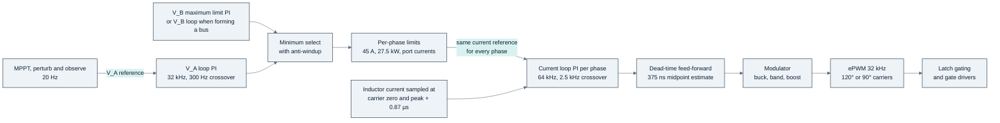

<!-- breadcrumb -->
[Home](../../README.md) › [Documentation](../README.md) › Control and firmware

# 🎛️ Control and firmware

> How the PV module is controlled — loops, modulation and mode transitions, interleaving and current sharing, MPPT — with the plant numbers, the simulated stability margins and transients, the controller's resource use, and the list of firmware requirements the hardware relies on.

---

> [!NOTE]
> Firmware itself is out of scope ([REQUIREMENTS.md §1](../requirements/REQUIREMENTS.md)); the controller's pin plan is
> in scope. The control design is **simulated** with switched, averaged and small-signal models plus an ngspice
> cross-check ([sim/out/pv_control/report.md](../../sim/out/pv_control/report.md),
> [control_spec.json](../../sim/out/pv_control/control_spec.json)). It was run against the earlier platform's sensing
> chain (closed-loop LEM sensor, isolated amplifiers, F28388D at 200 MHz); the cost-first board meets the measurement
> requirements derived from it (below), but the loops have **not** been re-simulated with the open-loop TMR sensor and
> the F280039C.

## 🎛️ Control structure

| Element | Design (calculated) | Source |
|---|---|---|
| Inner loop | average inductor-current PI per phase, 64 kHz (double update), port-voltage feed-forward inside the modulator | `loop_structure`, `sampling` |
| Outer loops | 32 kHz, one per module: VA loop (MPPT reference or DC bus on A) or VB loop (bus forming on B), plus a port-B over-voltage limit loop at 1,010 V; minimum select | `loop_structure`, `limits` |
| Load-current feed-forward | 1 on a DC-bus port (an inverter is a constant-power load), 0 on a PV or battery port; without it 4 of 16 constant-power corners are unstable | `loop_structure.feed_forward`, report §5 |
| Interleaving | 120° (3 phases), 90° (4 phases); each phase samples at its own carrier zero and peak | `sampling.interleave_deg` |
| Sharing | equal current references; each phase closes its own loop on its own sensor | report §6 |
| Timing | one-sample computation delay (15.6 µs); mode changes only at a carrier zero; ISR budget 14.2 µs on the F28388D | `sampling` |

Field names refer to [control_spec.json](../../sim/out/pv_control/control_spec.json); "report" is
[pv_control/report.md](../../sim/out/pv_control/report.md).

## 📐 Plant numbers and loop gains

| Quantity | 3 phases (PV-P75) | 4 phases (PV-P100/110) |
|---|---:|---:|
| Inductance used for the current-loop gain (µH) | 225.9 | 225.9 |
| Current loop kp (V/A) / ki (V/(A·s)) | 3.548 / 11,147 | 3.548 / 11,147 |
| Current loop design crossover / PI zero (Hz) | 2,500 / 500 | 2,500 / 500 |
| Port capacitance used for the outer loops (µF) | 274 | 364 |
| Outer loop kp (A/V) / ki (A/(V·s)) | 0.517 / 162.5 | 0.687 / 215.8 |
| Outer loop design crossover / PI zero (Hz) | 300 / 50 | 300 / 50 |
| Limits: current and power per phase | 45 A, 27.5 kW | 45 A, 27.5 kW |
| Limits: port current, module power | 135 A, 82.5 kW | 180 A, 110 kW |
| Port-B limit loop / firmware over-voltage / undervoltage stop (V) | 1,010 / 1,050 / 240 | same |
| MPPT tracking floor (V) | 255 | 255 |
| Duty limits Dmin / Dmax, minimum pulse | 0.057 / 0.943, 1.77 µs | same |

Source: [control_spec.json](../../sim/out/pv_control/control_spec.json) `current_loop`, `outer_loops`, `limits`,
`modulator`.

## 🎛️ Modulation and mode transitions

- Entering the band is immediate; leaving it needs the duty 0.02 below Dmax, which is 2.8 × the worst
  per-leg dead-time residual (0.0072 in duty), so a phase cannot re-enter the mode it just left.
- The hardware dead time is 211–554 ns at the gates and its exact value is **not** known to the firmware. The firmware
  compensates the midpoint (375 ns) with the sign taken from the slew-limited current reference; the residual is
  ≤ 225 ns, i.e. 4.0 V at 550 V and 7.2 V at 1000 V per leg.
- Simulated over 36 sweeps of VA through VB with three sets of per-edge dead times: every phase
  enters and leaves the band exactly once (no chatter); worst sampled-current error 2.23 A (1.61 A at full current);
  highest instantaneous current 50.6 A, below the trip band.
- Band edges seen in the sweeps (VB/VA): boost → band 1.032–1.092, band → buck 0.895–0.957,
  buck → band 0.916–0.967, band → boost 1.046–1.120.

From [pv_control report §4](../../sim/out/pv_control/report.md) (switched model, simulated).

## 🔬 Stability and transient results

| Loop | 3 phases | 4 phases | Worst case |
|---|---:|---:|---|
| Cases evaluated / unstable | 320 / 0 | 320 / 0 | VA, VB at 250 / 550 / 950 / 1000 V, 5 % and 100 % load, both directions, PV, battery and constant-power loads |
| Current loop phase margin (°) | 57.5 | 57.4 | boost 250 → 550 V (3 phases) |
| Current loop gain margin (dB) | 11.6 | 11.6 | band at 250 / 250 V, MPPT on the left of the MPP |
| Outer loop phase margin (°) | 43.7 | 43.6 | constant-power load on B at 250 / 250 V, full load |
| Outer loop modulus margin min \|1 + L\| | 0.68 | 0.67 | constant-power load on B, 250 → 550 V |
| Outer loop gain margin (dB) | 5.7 | 5.7 | same corner |
| Current loop with L at its extremes (×0.9…1.1, 0 A to the trip) | PM 54.9–59.5°, GM 9.6–13.3 dB | — | a fixed gain copes with the soft saturation |

Source: [control_spec.json](../../sim/out/pv_control/control_spec.json) `stability`; [report §5](../../sim/out/pv_control/report.md).
The 43.7° at the 250 V constant-power corner is below the 45° rule of thumb; the report calls it adequate.

| Transient (simulated) | Result |
|---|---|
| Load rejection at 82.5 kW, bus at 1000 V opens | VB peaks at 1,027.4 V and settles at 1,010 V; firmware OV (1,050 V) not reached |
| Power reversal +75 → −75 kW in 2 ms, bus forming on B at 750 V | VB stays within 746.1–757.6 V; peak inductor current 41.1 A |
| Start-up with MPPT (17s × 8p array, 300 W/m²) | first-period phase current 0.36 A; 99.89 % of Pmpp after 0.45 s |
| One phase faults at full load | the others hold their 27.5 kW limit (peak 42.3 A, no trip); module power 82.6 → 54.3 kW |
| Loss of the PV source at 82.5 kW | VA minimum 543 V; no reverse power into port A |
| Current sharing, calibrated sensors (gain 0.83 %, offset 0.3 A) | every phase within 1.7 % of 45 A; 4.4 % uncalibrated |
| Model agreement | switched, averaged and small-signal overshoot within ~3 %; energy balance residual 0.007 %; ngspice band check −16.281 A against −16.288 A drift |

Source: [pv_control report §3, §6–§9](../../sim/out/pv_control/report.md).

More plots from the control simulation (Bode, sharing, start-up, reversal, protection, dead time, model agreement)

## 🎛️ MPPT

| Item | Design (simulated) |
|---|---|
| Algorithm | dP-P&O (perturb and observe with a mid-period power sample), step adapted to the measured slope, 0.6–3 % of VA; global scan every 300 s for partial shading |
| Measurement | VA and IA oversampled at 500 kS/s, 20 ms averaging windows |
| Static efficiency, MPP inside 255–1000 V | ≥ 99.932 % (requirement PV-C1: ≥ 99.9 %) |
| Static efficiency, overall minimum | 99.854 % (8s × 8p at 50 W/m², 70 °C: the MPP is below the 255 V floor) |
| EU-weighted static / dynamic overall | 99.974 % / 99.957 % |
| Without the oversampling (32 kHz samples only) | 99.69 % at 50 W/m² — PV-C1 not met |

Source: [pv_mppt report](../../sim/out/pv_mppt/report.md), [control_spec.json](../../sim/out/pv_control/control_spec.json) `mppt`.
The measurement noise in that study is the earlier platform's isolated-amplifier chain; the cost-first divider and shunt
chain meets the resolution needed (below) but the MPPT has not been re-run with it.

## 🧰 Controller resource use

TI F280039CSPZR, 100-pin, 120 MHz C28x CPU with a CLA. The pin table is read from the datasheet (SPRSP61C) on every
build and the plan is written to [pv_ctrl_pin_plan.csv](../../gen/data/pv_ctrl_pin_plan.csv).

Chart: [figures_design.py](../assets/figures_design.py) from the [PV-CTL design check](../../hardware/PV-CTL/outputs/PV-CTL_design_check.txt).

| Pin group (100 pins) | Pins | Content |
|---|---:|---|
| PWM outputs | 16 | GPIO0–15 = ePWM1–8 A/B, all with HRPWM; phase p uses ePWM(2p−1) for leg A and ePWM(2p) for leg B on one carrier |
| Analog inputs | 23 | all 23 analog pins: 4 inductor currents, 4 port currents, 5 port voltages, 8 NTCs, inlet NTC, VDAC; IL1–4 also on CMPSS1–4 |
| Digital inputs | 13 | FLT_N, RDY, HOLD, MOV_OK, OVT_N, OC_N, STOP_OK, TRIP, 3 tachs (eCAP2/3, eQEP1), TDI, crystal |
| Digital outputs | 13 | EN, K_A, K_B, K_PRE, BIAS_EN, IMD_SW1/2, STATUS, fan PWM (eCAP1 APWM), heartbeat, latch clear, LED, TDO |
| Communication and EEPROM | 7 | DCAN on GPIO32/33 (boot option 1), SCIA on GPIO28/29 (SCI boot), I2C on GPIO56/57 |
| Power, reference, test, not connected | 28 | — |

Counted from [pv_ctrl_pin_plan.csv](../../gen/data/pv_ctrl_pin_plan.csv). ADC load: 17 conversions per 31.25 µs on
three ADCs = 10 %.

| Measurement the control design needs | Requirement ([control_spec.json](../../sim/out/pv_control/control_spec.json)) | As built on PV-CTL / PV-PWR |
|---|---|---|
| Inductor current: resolution, bandwidth, delay | ≤ 0.0759 A/LSB, ≥ 200 kHz, ≤ 4.14 µs | 0.0722 A/LSB, 331 kHz, 0.81 µs |
| Port voltage VA, VB resolution | ≤ 0.638 V/LSB | 0.881 V/LSB raw, 0.223 V/LSB with the 500 kS/s oversampling |
| Port current IA, IB resolution, bandwidth | ≤ 0.258 A/LSB, ≥ 10 kHz | 0.244 A/LSB, 11.3 kHz |
| Inductor-current gain after calibration, for sharing | ≤ 2 % | 1.83 % at 45 A (0.83 % from control_spec met at 25 °C only) |

Sources: [PV-CTL design check](../../hardware/PV-CTL/outputs/PV-CTL_design_check.txt) ADC checks;
[PV-PWR design check](../../hardware/PV-PWR/outputs/PV-PWR_design_check.txt) "Inductor current", "IA / IB bandwidth".
The PV-CTL text still reports the IA / IB bandwidth as an open 5.3 kHz item; the later PV-PWR build fitted 470 pF and
reports 11.3 kHz.

> [!WARNING]
> **Timing at 120 MHz is open (risk R-14).** The ISR budget of 14.2 µs was set for a 200 MHz F28388D. The architecture's
> estimate for the F280039C is about 10 µs of each 31.25 µs period on the CLA for three phases (32 %) and 13.3 µs for
> four (43 %) ([ARCHITECTURE-COSTFIRST.md §7](../requirements/ARCHITECTURE-COSTFIRST.md)). No firmware timing has been
> measured or simulated on the target.

## 🛡️ Firmware requirements the hardware relies on

Under [D-050](../requirements/DECISIONS.md) every hazard is caught by hardware first; firmware repeats each trip as a
second layer and owns sequencing, monitoring and the edge cases that are not hazards. These requirements are collected
from the [PV-CTL design check](../../hardware/PV-CTL/outputs/PV-CTL_design_check.txt) ("Firmware on top of the hardware"),
[port_spec.json](../../sim/out/port_design/port_spec.json) `lean.firmware_requirements`, the
[PV-PWR design check](../../hardware/PV-PWR/outputs/PV-PWR_design_check.txt) and
[control_spec.json](../../sim/out/pv_control/control_spec.json).

| Area | What firmware must do | Number it must hold |
|---|---|---|
| Second-layer trips | CMPSS windows on IL1–4 (DAC set from the idle zero), ADC limits on IA / IB and VA / VB, all to a one-shot trip on every ePWM | 81.1–101.9 A in 1.21 µs; 373–427 A; 1,084–1,116 V in 33.9 µs, VA / VB converted every ≤ 10 µs |
| Start-up self-test | exercise every trip path before PWM: CMPSS and ADC limits by moving the DAC / limit across the idle reading, BIAS_EN low must pull RDY low, stopping the heartbeat for 10 ms must set TRIP | each path's flag must set |
| Latch handling | read and log FLT_N, RDY, STOP_OK, OC_N, OVT_N before any clear; clear only with every source inactive, flags cleared and PWM commands low; the power-up TRIP = 1 must be read first | no automatic clear after a watchdog reset, an over-current or an over-voltage trip |
| Watchdogs and clocks | toggle the heartbeat in the control ISR; on-chip watchdog from boot, NMI watchdog on; missing-clock and DCC checks force a trip; keep the I/O brown-out reset enabled | edge period ≤ 2 ms; timeout ≤ 10 ms; < 6 ms from clock loss to the latch |
| Configuration integrity | lock GPIO mux and X-BAR where possible; never enable a pull-up on a command pin; read back CMPSS, ADC limits, trip zone and dead band every 10 ms and trip on a mismatch | a 19–54 kΩ internal pull-up against 10 kΩ would give 1.14 V, above the 0.8 V VIL of the gating |
| Contactor sequencing | close K_A / K_B only above the polarity enable; K_B only after precharge inside the ΔV window, then open K_PRE; port over-current trip from the ADC limit; open normally only below 300 A held for 20 ms; weld check after opening; insulation ≥ 33 kΩ before K_A; three precharge attempts, then lock out | 187–213 V; 3.5–16.5 V; 387–413 A within 0.50 s (0.76 s to 0.95 kA); the hold-off stays in hardware |
| Calibration and plausibility | re-zero the inductor-current sensors at every idle; trim the CMPSS DACs at idle; two-point end-of-line calibration; reject a null above the limit; treat out-of-range readings (open sensor or divider) as sensor faults with no automatic restart | uncalibrated zero ±3.9 A; gain ≤ 1 %, offset ≤ 0.3 A after calibration for sharing |
| Dead time and modulation | dead band 200 ns (the hardware stretch is the floor); compensate with the 375 ns midpoint, sign from the slew-limited reference; band-exit hysteresis 0.02 on the filtered integrator; mode changes at a carrier zero | residual ≤ 225 ns per edge |
| Supervision and limits | per-phase limit = min(45 A, 27.5 kW / VA, port limits), slewed; feed-forward set by port type (needs to know whether a BMS is present); slew-limit external commands; MPPT oversampling | feed-forward 1 on a bus port, 0 on PV or battery |
| Thermal and fans | over-temperature derating below the hardware bands; NTC plausibility at a cold start; fans only with BIAS_EN, duty 0 or ≥ 0.34; full speed is available only while switching; below −10 °C inlet either the low-temperature fan option or a rule that holds the fans off (R-05, not decided) | heatsink ≤ 85 °C, inductor ≤ 145 °C; every NTC within 10 K of the inlet NTC at a cold start |
| Variant handling | PV-P75 build: phase 4 held off by a forced one-shot, IL4 / NTC4 / NTC8 ignored, CMPSS4 used for the IB backup | build code from the EEPROM |

None of these is implemented or tested; they are requirements on future firmware.

---

<!-- footer -->
← [04 · Protection and safety](04-protection-and-safety.md) · [Documentation index](../README.md) · [06 · Magnetics](06-magnetics.md) →
