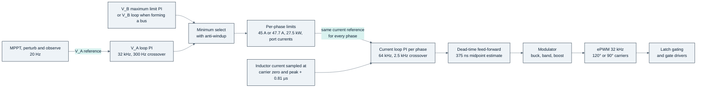
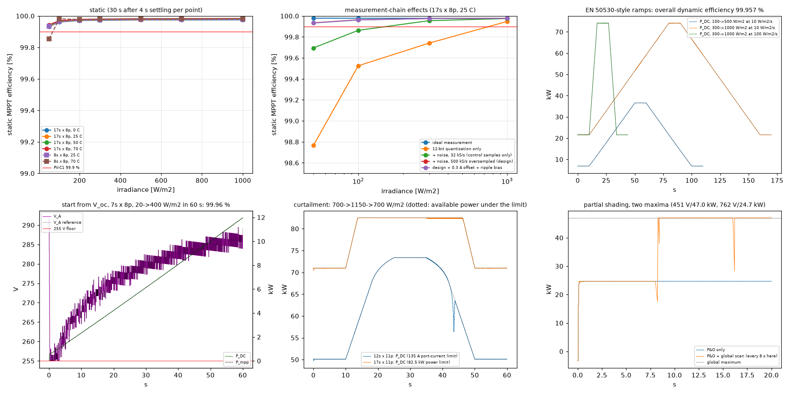
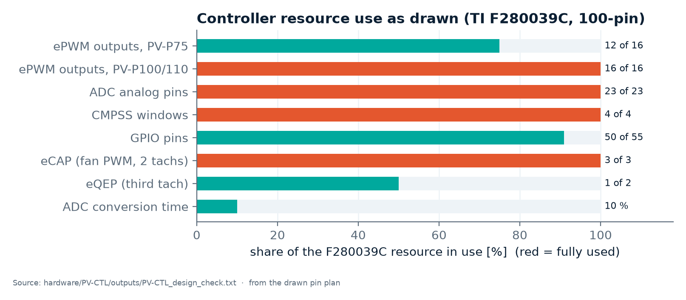

<!-- breadcrumb -->
[Home](../../README.md) › [Documentation](../README.md) › Control and firmware

# 🎛️ Control and firmware

> How the PV module is controlled — loops, modulation and mode transitions, interleaving and current sharing, MPPT — with the plant numbers, the simulated stability margins and transients, the controller's resource use, the list of firmware requirements the hardware relies on, the control board's ports, recorder and upgrade path, and a summary of the inverter's firmware specification.

---

> [!NOTE]
> Firmware itself is out of scope ([REQUIREMENTS.md §1](../requirements/REQUIREMENTS.md)); the controller's pin plan is
> in scope. The control design is **simulated** with switched, averaged and small-signal models plus an ngspice
> cross-check ([sim/out/pv_control/report.md](../../sim/out/pv_control/report.md),
> [control_spec.json](../../sim/out/pv_control/control_spec.json)). Since the review ([D-065](../requirements/DECISIONS.md),
> PCM-02) the model is the drawn build: port banks 289.8 / 334.8 µF (386.4 µF per port with four phases), the
> STK-HO/A 75 sensor with the PV-CTL front end (0.81 µs, 0.0722 A per count, 2.3 A pp noise), V/1203 dividers behind a
> 6.8 kHz pole, the 11.3 kHz shunt amplifiers, 17 conversions per 31.25 µs and the trips as drawn; the earlier
> platform's LEM sensor, isolated amplifiers and 274.4 µF example are no longer used. The F280039C timing is still an
> estimate (R-14), and the MPPT study keeps the earlier noise model (below).

## 🎛️ Control structure

| Element | Design (calculated) | Source |
|---|---|---|
| Inner loop | average inductor-current PI per phase, 64 kHz (double update), port-voltage feed-forward inside the modulator | `loop_structure`, `sampling` |
| Outer loops | 32 kHz, one per module: VA loop (MPPT reference or DC bus on A) or VB loop (bus forming on B), plus a port-B over-voltage limit loop at 1,010 V; minimum select; gains scaled with each port's own bank | `loop_structure`, `limits` |
| Load-current feed-forward | 1 on a DC-bus port (an inverter is a constant-power load), 0 on a PV or battery port; without it 4 of 16 constant-power corners are unstable (3 of 16 with four phases) | `loop_structure.feed_forward`, report §5 |
| Interleaving | 120° (3 phases), 90° (4 phases); each phase samples at its own carrier zero and peak | `sampling.interleave_deg` |
| Sharing | equal current references; each phase closes its own loop on its own sensor | report §6 |
| Timing | one-sample computation delay (15.6 µs) — a **requirement**: with two samples the current loop keeps only 42.6–46.0°; mode changes only at a carrier zero; budget per loop execution 14.5 µs after the conversion (architecture estimate about 1.7 µs per current-loop execution on the 120 MHz CLA) | `sampling` |

Field names refer to [control_spec.json](../../sim/out/pv_control/control_spec.json); "report" is
[pv_control/report.md](../../sim/out/pv_control/report.md).

## 📐 Plant numbers and loop gains

| Quantity | 3 phases (PV-P75) | 4 phases (PV-P100/110) |
|---|---:|---:|
| Inductance used for the current-loop gain (µH) | 225.9 | 225.9 |
| Current loop kp (V/A) / ki (V/(A·s)) | 3.548 / 11,147 | 3.548 / 11,147 |
| Current loop design crossover / PI zero (Hz) | 2,500 / 500 | 2,500 / 500 |
| Port capacitance used for the outer loops, port A / port B (µF) | 289.8 / 334.8 | 386.4 / 386.4 |
| Outer loop kp (A/V) / ki (A/(V·s)), port A; port B | 0.546 / 171.6; 0.631 / 198.3 | 0.728 / 228.8 on both |
| Outer loop design crossover / PI zero (Hz) | 300 / 50 | 300 / 50 |
| Limits: inductor current per phase, buck / boost and band | 45 A and 47.70 A | 45 A and 47.70 A |
| Limits: power per phase (at the port-A node) | 27.5 kW | 27.5 kW |
| Limits: PV port / battery port current, module power | 135 / 135 A, 82.5 kW | 180 / 145 A, 110 kW |
| Port-B limit loop / firmware over-voltage / undervoltage stop (V) | 1,010 / 1,034 / 240 | same |
| MPPT tracking floor (V) | 255 | 255 |
| Duty limits Dmin / Dmax, minimum pulse | 0.057 / 0.943, 1.77 µs | same |

Source: [control_spec.json](../../sim/out/pv_control/control_spec.json) `current_loop`, `outer_loops`, `limits`,
`modulator`.

**Limits and the delivered-power envelope** ([D-065](../requirements/DECISIONS.md), PCM-01 / PCM-13). The 45 A of the
earlier model was the low-voltage port's rating applied to the inductor in every mode; in the band it held PV-P75 to
70.0 kW at 550 / 550 V. The inductor limit is now the inductor's own rating — 45 A in buck / boost, 47.70 A in the band —
and the port limits are separate. Calculated result: 73.3 kW delivered at 550 / 550 V; PV-P75 reaches 75 kW from 562 V
at equal port voltages (both directions, 35 and 45 °C inlet); PV-P100 from 690 / 697 V (A→B / B→A); PV-P110 delivers
108.8 kW A→B (110 kW is a PV-input rating) and 110 kW B→A from 765 V at 35 °C only; at 60 °C no product reaches its
rating. The table and the 1 % requirement inconsistency at 550 V (75 kW needs 136.4 A against 135 A) are on
[03 · Power stage](03-power-stage.md#delivered-power-envelope). The hardware trips the loops sit inside — the inductor
window 67.9–80.5 A with gates off in 1.52 µs, which misses the 1.10 × normal-peak floor by 0.58 A (risk C9), and the
port over-voltage band 1,039–1,110 V, with the firmware stop derived 5 V below it at 1,034 V — are on
[04 · Protection and safety](04-protection-and-safety.md#-every-trip).

## 🎛️ Modulation and mode transitions

- Entering the band is immediate; leaving it needs the duty 0.02 below Dmax, which is 2.8 × the worst
  per-leg dead-time residual (0.0072 in duty), so a phase cannot re-enter the mode it just left.
- The hardware dead time is 211–554 ns at the gates and its exact value is **not** known to the firmware. The firmware
  compensates the midpoint (375 ns) with the sign taken from the slew-limited current reference; the residual is
  ≤ 225 ns, i.e. 4.0 V at 550 V and 7.2 V at 1000 V per leg.
- Simulated over 36 sweeps of VA through VB with three sets of per-edge dead times and the drawn
  sensor's noise: every phase enters and leaves the band exactly once (no chatter); worst sampled-current error 3.26 A
  (2.63 A at full current); highest instantaneous current 50.8 A, below the 67.9 A trip band. The phase limit steps
  45 → 47.70 → 45 A with each phase's own mode and is slewed.
- Band edges seen in the sweeps (VB/VA): boost → band 1.034–1.098, band → buck 0.892–0.957,
  buck → band 0.914–0.965, band → boost 1.044–1.121.

From [pv_control report §4](../../sim/out/pv_control/report.md) (switched model, simulated).

## 🔬 Stability and transient results

| Loop | 3 phases | 4 phases | Worst case |
|---|---:|---:|---|
| Cases evaluated / unstable | 320 / 0 | 320 / 0 | VA, VB at 250 / 550 / 950 / 1000 V, 5 % and 100 % load, both directions, PV, battery and constant-power loads |
| Current loop phase margin (°) | 57.6 | 57.5 | current loop B → A at 250 / 250 V, band (3 phases); 250 / 550 V, boost (4 phases) |
| Current loop gain margin (dB) | 11.6 | 11.7 | constant-power source on B at 250 / 250 V (3 phases); battery on B, 250 / 550 V (4 phases) |
| Current loop crossover (Hz) | 2,282–2,750 | — | design 2,500 Hz at L(45 A), fixed gain |
| Outer loop phase margin (°) | **44.3** | **45.0** | constant-power load on A, B → A, 250 / 250 V band (3 phases) or 250 / 550 V boost (4 phases), full load |
| Outer loop modulus margin min \|1 + L\| | 0.67 | 0.66 | constant-power load, 250 V on the low port |
| Outer loop gain margin (dB) | 6.0 | 6.0 | same corners |
| Current loop with L at its extremes (×0.9…1.1, 0 A to the trip), one sample of delay | PM 55.1–59.6°, GM 9.6–13.4 dB | — | a fixed gain copes with the soft saturation |
| Same with two samples of delay | PM 39.1–47.7°, GM 4.8–8.8 dB | — | why the one-sample delay is a requirement |

Source: [control_spec.json](../../sim/out/pv_control/control_spec.json) `stability`; [report §5](../../sim/out/pv_control/report.md)
(the drawn build, [D-065](../requirements/DECISIONS.md)). The 44.3° at the 250 V constant-power corner of PV-P75 is just
below the 45° rule of thumb; the report calls it adequate, and the inverter's own DC link raises it. The review's
reduced model (1/(sL + R) with an exact zero-order hold) gives 56.8–58.8° with one sample and 40.9–45.1° with two,
against 56.9–58.9° and 42.6–46.0° here.

| Transient (simulated) | Result |
|---|---|
| Load rejection at 82.5 kW, bus at 1000 V opens | VB peaks at 1,023.8 V and settles at 1,010 V; firmware OV (1,034 V) not reached |
| Power reversal +75 → −75 kW in 2 ms, bus forming on B at 750 V | VB stays within 746.8–757.2 V; peak inductor current 41.6 A |
| Start-up with MPPT (17s × 8p array, 300 W/m²) | first-period phase current 0.32 A; 99.97 % of Pmpp after 0.45 s |
| One phase faults at full load | the others hold their 27.5 kW limit (peak 42.1 A, no trip); module power 82.7 → 55.0 kW |
| Loss of the PV source at 82.5 kW | VA minimum 554 V; no reverse power into port A |
| Current sharing, calibrated sensors (gain 1.00 %, offset 0.4 A) | every phase within 2.2 % of 45 A; 4.6 % uncalibrated (2 %, 1 A) |
| Load-rejection bank | the port-B bank needs 243 µF in this model; 334.8 µF are drawn (the seventh capacitor stays as a cost lever, [D-065](../requirements/DECISIONS.md)) |
| Model agreement | switched and averaged models within 4.8 % and 2.8 % of the step (RMS deviation from the small-signal model); energy balance residual 0.005 %; ngspice band check −16.376 A against −16.383 A drift |

Source: [pv_control report §3, §6–§9](../../sim/out/pv_control/report.md).

More plots from the control simulation (Bode, sharing, start-up, reversal, protection, dead time, model agreement)

## 🎛️ MPPT

| Item | Design (simulated) |
|---|---|
| Algorithm | dP-P&O (perturb and observe with a mid-period power sample), step adapted to the measured slope, 0.6–3 % of VA; global scan every 300 s for partial shading |
| Measurement | VA and IA oversampled at 500 kS/s, 20 ms averaging windows |
| Static efficiency, MPP inside 255–1000 V | ≥ 99.950 % (requirement PV-C1: ≥ 99.9 %) |
| Static efficiency, overall minimum | 99.854 % (8s × 8p at 50 W/m², 70 °C: the MPP is below the 255 V floor) |
| EU-weighted static / dynamic overall | 99.976 % / 99.957 % |
| Without the oversampling (32 kHz samples only) | 99.83 % at 50 W/m² — PV-C1 not met |

Source: [pv_mppt report](../../sim/out/pv_mppt/report.md), [control_spec.json](../../sim/out/pv_control/control_spec.json) `mppt`
(re-run 2026-10-05). The measurement noise in that study is still the earlier platform's isolated-amplifier chain; the
cost-first divider and shunt chain meets the resolution needed (below) but is not yet the noise model of the MPPT study.

## 🧰 Controller resource use

TI F280039CSPZR, 100-pin, 120 MHz C28x CPU with a CLA. The pin table is read from the datasheet (SPRSP61C) on every
build and the plan is written to [pv_ctrl_pin_plan.csv](../../gen/data/pv_ctrl_pin_plan.csv).

Chart: [figures_design.py](../assets/figures_design.py) from the [PV-CTL design check](../../hardware/PV-CTL/outputs/PV-CTL_design_check.txt).

| Pin group (100 pins) | Pins | Content |
|---|---:|---|
| PWM outputs | 16 | GPIO0–15 = ePWM1–8 A/B, all with HRPWM; phase p uses ePWM(2p−1) for leg A and ePWM(2p) for leg B on one carrier |
| Analog inputs | 23 | all 23 analog pins: 4 inductor currents, 4 port currents, 5 port voltages, 8 NTCs, inlet NTC, VDAC; IL1–4 also on CMPSS1–4 |
| Digital inputs | 12 | FLT_N, RDY, HOLD, MOV_OK, STOP_OK, TRIP, PRE_N (the combined on-board comparator trip, read since rev A2 instead of OC_N and OVT_N), DI1 (battery fault), 3 tachs (GPIO35 / GPIO34 to eCAP2/3, eQEP1), crystal |
| Digital outputs | 11 | EN, K_A, K_B, K_PRE, BIAS_EN, IMD_SW1/2, STATUS (also drives the status relay), fan PWM (eCAP1 APWM), heartbeat, latch clear; the run LED hangs on the watchdog's WD_OK, not on a GPIO |
| Communication and recorder flash | 11 | DCAN on GPIO32/33 (boot option 1); SCIA on GPIO28/29 + DE (RS-485, SCI boot); SCIB on GPIO56/57 (Ethernet bridge); SPIA on GPIO18/54/55 + CS# on GPIO37 (recorder flash GD25Q32E, in place of the I2C EEPROM) |
| Power, reference, cJTAG debug, not connected | 27 | — |

Counted from [pv_ctrl_pin_plan.csv](../../gen/data/pv_ctrl_pin_plan.csv) (rev A2, [D-075](../requirements/DECISIONS.md)):
50 of 55 GPIO used, GPIO58–61 free. The inverter's plan ([pcs_ctrl_pin_plan.csv](../../gen/data/pcs_ctrl_pin_plan.csv),
four-wire view [pcs_ctrl_pin_plan_4w.csv](../../gen/data/pcs_ctrl_pin_plan_4w.csv)) uses 55 of 55. The pins for the flash
and the Ethernet UART came from the EEPROM's I2C pair, cJTAG in place of 4-wire JTAG, the run LED moved to WD_OK and the
single PRE_N read. ADC load: 17 conversions per 31.25 µs on three ADCs = 10 %.

| Measurement the control design needs | Requirement ([control_spec.json](../../sim/out/pv_control/control_spec.json)) | As built on PV-CTL / PV-PWR |
|---|---|---|
| Inductor current: resolution, bandwidth, delay to the comparator input | ≤ 0.0759 A/LSB, ≥ 200 kHz, ≤ 3.08 µs | 0.0722 A/LSB, 331 kHz, 0.81 µs |
| Port voltage VA, VB resolution | ≤ 0.638 V/LSB | 0.881 V/LSB raw, 0.223 V/LSB with the 500 kS/s oversampling |
| Port current IA, IB resolution, bandwidth | ≤ 0.258 A/LSB, ≥ 10 kHz | 0.244 A/LSB, 11.3 kHz |
| Inductor-current gain after calibration, for sharing | ≤ 2 % | 1.83 % at 45 A; the sharing study uses the drawn sensor's 1.00 % gain and 0.38 A after calibration |

Sources: [PV-CTL design check](../../hardware/PV-CTL/outputs/PV-CTL_design_check.txt) ADC checks;
[PV-PWR design check](../../hardware/PV-PWR/outputs/PV-PWR_design_check.txt) "Inductor current", "IA / IB bandwidth".
PV-CTL rev A1 reads the IA / IB bandwidth from the PV-PWR check: 11.3 kHz with the 470 pF fitted, no longer an open
5.3 kHz item.

> [!WARNING]
> **Timing at 120 MHz is open (risk R-14).** The control model allows 14.5 µs per loop execution after the conversion;
> the architecture estimates about 200 cycles = 1.7 µs per current-loop execution on the 120 MHz CLA, six or eight per
> 31.25 µs, and about 10 µs of each period for three phases (32 %), 13.3 µs for four (43 %)
> ([ARCHITECTURE-COSTFIRST.md §7](../requirements/ARCHITECTURE-COSTFIRST.md)). No firmware timing has been measured or
> simulated on the target.

## 🛡️ Firmware requirements the hardware relies on

Under [D-050](../requirements/DECISIONS.md) every hazard is caught by hardware first; firmware repeats each trip as a
second layer and owns sequencing, monitoring and the edge cases that are not hazards. These requirements are collected
from the [PV-CTL design check](../../hardware/PV-CTL/outputs/PV-CTL_design_check.txt) ("Firmware on top of the hardware"),
[port_spec.json](../../sim/out/port_design/port_spec.json) `lean.firmware_requirements`, the
[PV-PWR design check](../../hardware/PV-PWR/outputs/PV-PWR_design_check.txt) and
[control_spec.json](../../sim/out/pv_control/control_spec.json).

| Area | What firmware must do | Number it must hold |
|---|---|---|
| Second-layer trips | CMPSS windows on IL1–4 (DAC set from the idle zero), ADC limits on IA / IB and VA / VB, all to a one-shot trip on every ePWM; soft over-voltage stop derived from the drawn hardware band ([D-072](../requirements/DECISIONS.md)) | 81.1–101.9 A in 1.21 µs; 373–427 A; 1,084–1,116 V in 33.9 µs, VA / VB converted every ≤ 10 µs; controlled stop at 1,034 V = the comparator band's bottom 1,039 V − 5 V (was a fixed 1,050 V the latch could pre-empt) |
| Start-up self-test | exercise every trip path before PWM: CMPSS and ADC limits by moving the DAC / limit across the idle reading, BIAS_EN low must pull RDY low, stopping the heartbeat for 10 ms must set TRIP | each path's flag must set |
| Latch handling | read and log FLT_N, RDY, STOP_OK, OC_N, OVT_N before any clear; clear only with every source inactive, flags cleared and PWM commands low; the power-up TRIP = 1 must be read first | no automatic clear after a watchdog reset, an over-current or an over-voltage trip |
| Watchdogs and clocks | toggle the heartbeat in the control ISR; on-chip watchdog from boot, NMI watchdog on; missing-clock and DCC checks force a trip; keep the I/O brown-out reset enabled | edge period ≤ 2 ms; timeout ≤ 10 ms; < 6 ms from clock loss to the latch |
| Configuration integrity | lock GPIO mux and X-BAR where possible; never enable a pull-up on a command pin; read back CMPSS, ADC limits, trip zone and dead band every 10 ms and trip on a mismatch | a 19–54 kΩ internal pull-up against 10 kΩ would give 1.14 V, above the 0.8 V VIL of the gating |
| Contactor sequencing | close K_A / K_B only above the polarity enable; K_B only after precharge inside the ΔV window, then open K_PRE; port over-current trip from the ADC limit; open normally only below 300 A held for 20 ms; weld check after opening; insulation ≥ 33 kΩ before K_A; three precharge attempts, then lock out; a pull-in that does not close is retried at most 3 times, ≥ 10 s apart, then the contactor stays open for 30 s and the fault is latched | 187–213 V; 3.5–16.5 V; 387–413 A within 0.50 s (0.76 s to 0.95 kA); the hold-off stays in hardware |
| Port A declaration ([D-072](../requirements/DECISIONS.md)) | treat port A as a PV array only: hold IA ≥ 0 (no reverse power into the array); with port B live, precharge bank A to within 20 V before K_A closes | array Isc ≤ 168.8 A (225 A four-phase), Voc ≤ 1000 V |
| Calibration and plausibility | re-zero the inductor-current sensors at every idle; trim the CMPSS DACs at idle; two-point end-of-line calibration; reject a null above the limit; treat out-of-range readings (open sensor or divider) as sensor faults with no automatic restart | uncalibrated zero ±3.9 A; gain ≤ 1 %, offset ≤ 0.3 A after calibration for sharing |
| Dead time and modulation | dead band 200 ns (the hardware stretch is the floor); compensate with the 375 ns midpoint, sign from the slew-limited reference; band-exit hysteresis 0.02 on the filtered integrator; mode changes at a carrier zero | residual ≤ 225 ns per edge |
| Supervision and limits | inductor-current limit by mode — 45 A in buck / boost, 47.70 A in the band — plus 27.5 kW at the port-A node and the port limits converted through each phase's actual duty with a slow trim on the measured port current, all slewed; feed-forward set by port type (needs to know whether a BMS is present); slew-limit external commands; MPPT oversampling; one-sample computation delay | feed-forward 1 on a bus port, 0 on PV or battery; port limits PV 135 / 180 A, battery 135 / 145 A |
| Thermal and fans | over-temperature derating below the hardware bands; NTC plausibility at a cold start; fans only with BIAS_EN, duty 0 or ≥ 0.34; full speed is available only while switching; the cold-start rule below | heatsink ≤ 85 °C, inductor ≤ 145 °C; every NTC within 10 K of the inlet NTC at a cold start; one fan-supply contract: S_24V ≥ 24.50 V, the fan buck passes ≥ 23.59 V (PV-P75: airflow × 0.983) |
| Variant handling | PV-P75 build: phase 4 held off by a forced one-shot, IL4 / NTC4 / NTC8 ignored, CMPSS4 used for the IB backup | build code from the recorder flash |
| Practice adopted from the Wolfspeed firmware cross-check (R-WS-1…9, [REFERENCE-LESSONS §6](../requirements/REFERENCE-LESSONS.md), [D-071](../requirements/DECISIONS.md)) | range-check every bus or service input (switching frequency and dead time not writable in operation); ramp to zero and stop on communication loss; lock out after the third hazard trip of a class and at once on an over-voltage seen by both the hardware and the firmware; explicit recovery threshold, dwell and restart-rate limit per non-latched limit; every exception path forces the one-shot trip and stops the heartbeat; no bus-reachable mode disables a protection; the self-test fires each fault line alone and the read-back covers the trip routing; calibration stored redundantly and range-checked | communication loss 1 s on CAN, third trip within 10 min (both assumed) |

None of these is implemented or tested; they are requirements on future firmware. The same practice is written into the
inverter's and the DAB's firmware lists ([09 · PCS-P125](09-pcs-p125.md), [10 · DAB-D60](10-dab-d60.md), with the DAB
rules FW-DAB-1…11). The Wolfspeed packages themselves are open-loop starting points with almost no protection in
firmware; their notes are in `docs/reference-designs/wolfspeed/<design>/FIRMWARE-NOTES.md`.

**Cold start below the fans' rating** (PCM-17, [D-072](../requirements/DECISIONS.md)). Below −10 °C inlet the fans stay
off and the module power is limited to a passive-cooling table; the fans start once the inlet NTC reads above −10 °C,
and at once at a heatsink NTC ≥ 80 °C or an inductor NTC ≥ 135 °C whatever the inlet reads:

| Inlet (°C) | −30 | −20 | −10 |
|---|---:|---:|---:|
| PV-P75, passive power (kW) | 19.2 | 17.5 | 15.5 |
| PV-P75, pessimistic model (kW) | 6.8 | 0 | 0 |
| PV-P100/110, passive power (kW) | 19.9 | 14.9 | 5.0 |

ESTIMATES ±50 % ([module_spec.json](../../sim/out/pv_design/module_spec.json), `sim/pv_module.py` passive model:
natural-convection heatsink and inductors, 2.4 W/K enclosure, 24 kJ/K structure); the inlet warms from −30 to −10 °C in
about 45–48 min; at 611 / 611 V there is no passive power. PV-20's −30 °C therefore holds at reduced power only. Fans
rated for −30 °C were priced and not taken (+225–300 USD per module).

**Short-circuit timing in the gate drive.** The NSI6651 times its DESAT-to-output delay (≤ 360 ns) from the threshold
crossing, with its deglitch filter inside it (NSI66x1A Fig. 8.10); the shared chain of `gen/gdrv.py` added the deglitch
on top until the review (PCM-10). Each preset now prints a short-circuit acceptance rule — twice the energy-equivalent
full-current time and fault energy of its chain, to be confirmed by the maker: PV tSC ≥ 2.10 µs / ESC
≥ 0.87 J at 1100 V, PCS 2.07 µs / 0.82 J at 1050 V, DAB study 2.22 µs / 2.18 J at 1000 V (release blocks, risk C2).

## 🧰 Ports, recorder and upgrade — control board rev A2

Added on 2026-10-06 for parity with the competitor's module ([D-075](../requirements/DECISIONS.md); one schematic for
PV-CTL, PV-CTL-P75 and the inverter's PCS-CTL). Everything here is calculated or declared in the
[PV-CTL](../../hardware/PV-CTL/outputs/PV-CTL_design_check.txt) and
[PCS-CTL](../../hardware/PCS-CTL/outputs/PCS-CTL_design_check.txt) design checks; no firmware exists.

| Port | Role (declared) | Hardware |
|---|---|---|
| CAN | **module bus**: paralleling, carrier synchronisation by CAN time-stamping, software addressing (no address switch) | CA-IS3050W across B1; split termination on a solder jumper |
| RS-485 | **BMS** (Modbus RTU), or the EMS; service / PC tool at 9600-8-N-1 | CA-IS3082WNX across B1; 120 Ω on a solder jumper |
| CAN for the BMS | only when the module is **not** paralleled (the one CAN is the module bus) | — |
| Ethernet | **EMS**: Modbus TCP on port 502 (or RTU over TCP), one register map shared with RS-485; also the PC tool | WCH CH9121T UART-to-Ethernet bridge (10/100, transparent TCP server) on SCIB at 115,200 baud through a CA-IS3842HW, HanRun HR913550AE RJ45 with magnetics, SRV05-4 surge array, TPS7A2033; **fitted on PCS-CTL, footprints only on PV-CTL** |

Where the allocation fails: a CAN-only BMS whose bit rate or identifiers cannot share the module bus while modules run
in parallel — the BMS then needs RS-485 and the EMS Ethernet; on PV-CTL the Ethernet option is fitted first. One Ethernet
port only (a daisy chain is the cabinet switch's job), no web server (the bridge is transparent), no hardware
synchronisation pair across the barrier; the HMI panel and its 12 V supply are a cabinet accessory. The bridge was
chosen over a W5500 SPI controller with a second isolator: 17 against 40 parts, 3.89 against 4.26 USD with assembly,
one barrier part instead of two.

| Function | As drawn (calculated) |
|---|---|
| **Fault recorder** (GD25Q32E, 4 MB SPI NOR, in place of the 32 kB I2C EEPROM) | 32 channels for 100 ms before and after the trigger (the competitor's published bar); the F280039C's 69 kB RAM allows a pre-trigger buffer of about 24 kB (ASSUMED), so the record runs at 3.6 kHz = 44 kB per event: **71 events** beside two 384 kB firmware images and two 64 kB calibration sectors (8 events at the full 32 kHz control rate — the RAM, not the flash, is the limit); a 2 ms full-rate snapshot from RAM is added; one event is written in about 0.09 s. Calibration, serial number and event log move into the flash in two copies with CRC (R-WS-9) |
| **Upgrade** | authenticated dual image (R-WS-8): the new image is staged in the recorder flash over Ethernet, RS-485 or CAN, its signature and CRC checked, then copied by a bootloader in a DCSM-protected sector; the golden image stays for roll-back; only in SERVICE, with authorisation and a timeout |
| **Stop chain** | the stop input already gated the PWM in hardware through the latch; terminals 2 / 3 (stop line in / out) and 4 / 5 (0 V in / out) chain a cabinet 24 V stop line from module to module (0.84 mA per module at 36 V) |
| **Ready permissive** | an installed / ready contact in series with the stop input: open = stop in hardware; the firmware sees one STOP_OK for both (a readable ready input would need a 56th GPIO) |
| **DI1, battery fault** | BMS or battery-fault dry contact: 5 V wetting through 1.0 kΩ, 10 kΩ down, 1.1 ms filter, 5.1 V clamp, through the CA-IS3842HW to GPIO52 (an interrupt); NO / NC meaning set in firmware |
| **Status relay** | Hongfa HFD27/005-S changeover on the STATUS channel: energised = healthy, NC on any trip, stop or supply loss; SELV contacts only; pick-up 4.66 V needed at 85 °C against 4.79 V at the coil with a ≤ 3 Ω driver (ASSUMED) |
| **SELV and live budgets** | SELV 5 V 231 mA without / 340 mA with the Ethernet bridge (allocation 0.5 A, was 0.3 A); SELV logic 1.44 / 2.13 W → the auxiliary supply carries 2.2 W for every variant ([D-076](../requirements/DECISIONS.md)); live +3.3 V 188 of 200 mA (94 %) |

**Open on the control board:** the CH9121T publishes a typical supply current only (× 1.3 assumed) and LCSC showed 1,155
in stock; its LAN set-up tool cannot be disabled, so the firmware must authorise every write; one TCP client per port is
assumed; the 25 MHz crystal's ageing reaches the 40 ppm limit near end of life; the relay's pick-up margin is thin; the
inverter's plan has no spare GPIO ([risks E8–E10](12-risks-and-open-items.md#e--control-and-firmware)).

## 🎛️ The inverter's firmware specification (summary)

The inverter's hand-over to firmware is the list `handover.firmware_requirements` of
[pcs_spec.json](../../sim/out/pcs_design/pcs_spec.json) — **30 rows**, 15 of them added on 2026-10-06
([D-074](../requirements/DECISIONS.md)) — plus the grid-start sequence of its `ac_start` key and the control study's
rows ([pcs_control report §9](../../sim/out/pcs_control/report.md), [D-066](../requirements/DECISIONS.md),
[D-077](../requirements/DECISIONS.md)). Rows that restate a competitor claim without published parameters say so, and
their values are labelled ASSUMED; grid-code values are FROM MEMORY.

| Group | What the rows require (calculated or ASSUMED as labelled there) |
|---|---|
| Protection and sequencing | the second layer of every discrete trip; a start-up self-test of each trip path; DC precharge, insulation test, synchronisation and relay test; the upper DC-link half by firmware; one contactor coil pulling in at a time |
| Operating map | modulation-index limiter, the AC-contactor closing permissive (624 V DC at 400 V, 718 V at 460 V), a controlled stop before the bridge would rectify, overload tiers in kVA per grid voltage (198 A continuous, 216 A for 2 min, 259 A for 200 ms) |
| Modes | PQ, CP / CC, CV, VF (grid forming off-grid), generator following (ASSUMED parameters), standby; mode changes only through stop → start except PQ ↔ CC / CP |
| Off-grid quality | VF secondary restoration with a 0.5 s time constant: voltage accuracy **0.59 %** worst-case sum, frequency **±60 ppm**; THDu ≤ 1.31 % (three-wire) / 1.98 % (four-wire) on a linear balanced load, analytical; a DC-component regulator per phase (and for the neutral leg) |
| Ride-through | LVRT / HVRT profiles (FROM MEMORY); a ride-through state at 1.0 Ir with the PLL frozen below 0.2 pu and a per-sample clamp at 380 A keep every in-dip and recovery peak ≤ 382 A; on a stiff connection the first-millisecond peak is out of firmware's reach, so the power is derated to 95.5 / 105.5 / 115 kW for 0 / 0.1 / 0.2 pu dips; from SCR 50 down the whole assumed profile passes at rated current |
| Four-wire | the neutral leg in mode A (at 50 %) from 724 V DC, mode B (zero sequence on four legs) below it to 624 V; the neutral leg runs the off-grid cascade in every mode (worst PM 57°, GM 8.7 dB); per-phase power, each phase at most its tier |
| Transfers and paralleling | charge ↔ discharge ≤ 15.7 ms; grid-to-island automatic with about 150 ms interruption (detection and contactor drop-out ASSUMED; seamless needs a static transfer switch, out of scope); parallel modules on the module CAN with droop, carrier synchronisation and zero-sequence control on a shared battery |
| Grid start, recorder, upgrade, map | the AC-side start-up sequence ([09 · PCS-P125](09-pcs-p125.md#-start-up-from-the-grid)); the fault recorder and the authenticated upgrade of the section above; the Modbus TCP map scope (telemetry, set points, SERVICE-only parameters, files) |

ISR budget of the four-wire build in the control study: 46.7 % of the period (operation count, not timed on the
target). Details, figures and open items of each row: [09 · PCS-P125](09-pcs-p125.md#-control-study-calculated).

---

<!-- footer -->
← [04 · Protection and safety](04-protection-and-safety.md) · [Documentation index](../README.md) · [06 · Magnetics](06-magnetics.md) →
