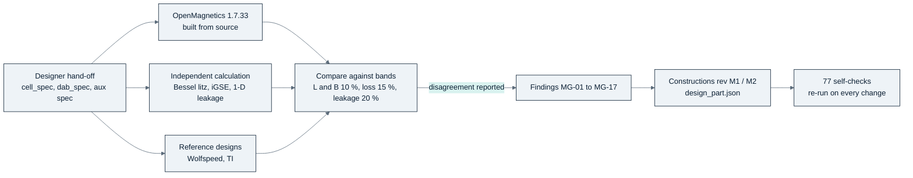
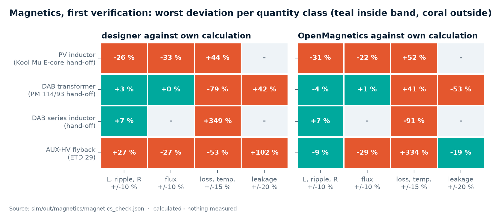
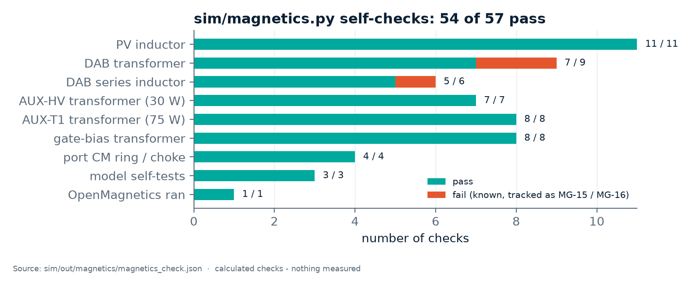
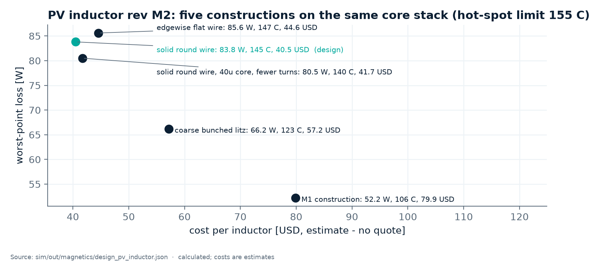

<!-- breadcrumb -->
[Home](../../README.md) › [Documentation](../README.md) › Magnetics

# 🧲 Magnetics

> Every custom magnetic part of the PV module, the DAB and the inverter's filter — what it is for, how it is built, how it was verified three ways (designer, OpenMagnetics, an independent calculation), how it compares with the reference designs, which Asian materials it uses, what it costs, what a first article must prove — and how OpenMagnetics was built and where it fell short.

---

> [!NOTE]
> Every loss, temperature and inductance here is **calculated**; no part has been wound or measured. Source of truth:
> [sim/out/magnetics/report.md](../../sim/out/magnetics/report.md), the machine-readable
> [magnetics_check.json](../../sim/out/magnetics/magnetics_check.json), one `design_<part>.json` and one winding-house
> sheet `spec_<part>.md` per part in [sim/out/magnetics/](../../sim/out/magnetics/). Costs are engineering estimates
> without quotations.

## 🧲 The parts at a glance

| Part | Used in | Construction (revision) | Key calculated figures | Cost estimate (USD) |
|---|---|---|---|---:|
| PV inductor, 224 µH | PV-PWR, 3 (4) per module, chassis-mounted | 2 × POCO NPC290026 (NPC 26) stacked toroid, **37 turns of 3.15 mm solid round enamelled copper**, one layer, Nomex + polyimide, VPI class H, NTC in the winding (rev M2, [D-054](../requirements/DECISIONS.md)) | L(45 A) 225.9 µH nominal, ≥ 207.8 µH at −8 % AL; L(trip)/L0 0.81; worst-point loss 83.8 W; hot spot 145 °C at 55 °C air (limit 155 °C) | 40.5 |
| AUX-T1, auxiliary transformer (AUX-75 rev A3) | the flyback of every power board (PV-PWR, PV-PWR-4, PCS-PWR, PCS-PWR-4W) | DMEGC EC39A DMR95 (ETD39 class), gap 1.17 mm, **50 : 9 live : 10 SELV** (was 48 : 8 : 9 before the re-rate of [D-076](../requirements/DECISIONS.md)), order P1 \| shield \| SELV \| live \| P2, SELV winding 200-strand TIW-litz, single-layer build 7.97 of 8.20 mm, vacuum-potted (rev M1 construction) | copper loss ≤ 1.30 W (own) / 1.78 W (OpenMagnetics) against 1.95 W allowed; leakage 15.2 µH (limit 18.3), live–SELV 0.41 µH (limit 0.62); flux 328.5 mT at the current limit (limit 348.5, 5.7 % margin); the re-wound part needs a new sample set | 8.8 (5.9 at 5,000) |
| T_BIAS4, gate-bias transformer | PV-PWR, one per phase | DMEGC EP17 DMR44 ungapped, 5-section bobbin S1 \| S2 \| P \| S3 \| S4, secondaries 24 turns TIW 0.16 mm, ratio 1 : 6 (rev M1) | winding-pair capacitance ≤ 3.43 pF (limit 5); magnetising current 0.136 A (limit 0.15) | 2.18 (1.22 at 5,000 + about 4,000 one-off bobbin tooling) |
| Port CM ring | PV-PWR, one per port | one flat-µ nanocrystalline ring 63/38/25 mm around both bars, single pass, plus ≥ 127 nF to PE on the board (rev M2) | 17.2 dB at 150 kHz, 18.3 dB at 0.5–2 MHz with the capacitance; ring flux 0.83 T in the low-frequency CM case | 11 |
| DAB transformer, 11 : 12 | DAB-D60 | two units in parallel, each 2 × DMEGC EE80 DMR95, P-S-P interleaved litz 0.05 mm, vacuum-potted aluminium housing on the cold plate (rev M1) | worst loss 189 W against a 182 W budget; hot spot 133 °C against 130 °C at 65 °C coolant — **2 checks fail (MG-16)** | 186 |
| DAB series inductor | DAB-D60 | 4 × EE80 DMR95, 3 turns profiled litz 0.05 mm, quasi-distributed gap (6 × 1.11 mm), potted (rev M1) | L 5.56 µH; 90 W worst; B = 0.99 Bsat (0.405 T at 100 °C) at the 700 A saturation requirement (1.1 × the DAB study's 632 A fault peak, [D-068](../requirements/DECISIONS.md)) against the 0.8 limit — **check fails (MG-15)** | 86 |
| AUX-HV transformer, 30 W | earlier platform only | DMEGC EC34A DMR95, 90 : 15 : 16, TIW-litz secondary, potted (rev M1) | winding loss 0.69 W (own), 1.04 W (OpenMagnetics) | 5.9 |

Sources: `design_*.json` and [report.md](../../sim/out/magnetics/report.md) "Constructions by the magnetics designer" and
§8; costs from each file's `cost` block. Catalogue magnetics (Würth push-pull transformers and buck inductors) were checked
against their datasheets only (report §3.6).

## 🔬 The three-way verification

[D-039](../requirements/DECISIONS.md) gave the construction of every magnetic part to one owner and required each to be
checked three ways. Disagreements are reported, not averaged: **the design takes the higher loss** of the tool and the
own model.

**First round — the hand-off constructions.** The designer's figures, OpenMagnetics and the own calculation agreed on
some quantities and were far apart on others:

Chart: [figures_design.py](../assets/figures_design.py) from [magnetics_check.json](../../sim/out/magnetics/magnetics_check.json)
`comparison`; a figure the designer did not state is left out.

| Decisive disagreement (calculated) | Designer | OpenMagnetics | Own | What it meant |
|---|---:|---:|---:|---|
| DAB transformer copper loss at 800 / 873 V, 60 kW (W) | 72 | 236 | 338 | the assumed AC-resistance ratio 1.15 is about 2.5 at 100 kHz and grows with the harmonics; Wolfspeed's measured 78 mΩ at 100 kHz confirms the order of magnitude (MG-01, critical) |
| DAB transformer hot spot at maximum loss (°C) | 130 | — | 354 | a 0.4 K/W path through a pot core is not credible (MG-02, critical) |
| DAB series inductor copper loss (W) | 29 at 60 kW | 16 at maximum current | 163 at 60 kW | litz in the gap fringing field; an order of magnitude between models — "cannot be released on calculation" (MG-05) |
| AUX-HV flyback copper loss at 1000 V (W) | 1.04 | 9.52 | 2.19 | the 1-D models cannot see the centre-leg gap; project figure 2–5.5 W until measured |
| PV inductor total loss (W) | 51.2 | 52.1 | 53.9 | agree within 5 %; but OpenMagnetics' inductance is 26 % low (its DC-bias fit is the toroid one) — use the catalogue figure |
| PV inductor hot-spot rise (K) | 50 | 114 (natural convection) | 75 | the designer's surface model has no internal winding gradient (MG-07) |

Source: [report.md §3](../../sim/out/magnetics/report.md). Findings are in
[review_magnetics.csv](../../gen/data/review_magnetics.csv): 17 rows (2 critical, 11 major, 4 minor), 13 closed by the
rev M1 / M2 constructions **by calculation**, 4 open (the report's own summary line still counts the first 14).

**Second round — the constructions now in the design.** Each construction file is re-checked on every run:

Chart: [figures_design.py](../assets/figures_design.py) from [magnetics_check.json](../../sim/out/magnetics/magnetics_check.json)
`checks`: 77 checks, 73 pass; the other four are recorded as known shortfalls, none unexplained: the DAB transformer pair
at the 137 A worst corner (MG-16, two checks), the series inductor's saturation margin at 700 A (MG-15) and the
PV-P100/110 inductor's hot spot, 5.3 K over its 155 °C limit at 114 m³/h per phase and 45 °C inlet (MG-17).

## 🧲 PV inductor: what "do not trust the tool, do not trust yourself" looks like

The inductor was re-opened for cost ([D-044](../requirements/DECISIONS.md)): the rev M1 profiled litz was estimated at
80 USD, a quarter of the module budget. Five conductors were compared on the same POCO toroid stack:

Chart: [figures_design.py](../assets/figures_design.py) from [design_pv_inductor.json](../../sim/out/magnetics/design_pv_inductor.json) `options`.

| Option (37 turns unless stated) | Core loss (W) | Copper loss (W) | Total (W) | Hot spot (°C) | Cost (USD) |
|---|---:|---:|---:|---:|---:|
| M1: profiled litz 1923 × 0.10 mm | 25.4 | 26.7 | 52.2 | 106 | 79.9 |
| coarse bunched litz 61 × 0.50 mm | 25.4 | 40.8 | 66.2 | 123 | 57.2 |
| **solid round wire 3.15 mm (chosen)** | 25.4 | 58.3 | **83.8** | **145** | **40.5** |
| solid round wire, 40µ core, 32 turns | 40.6 | 39.9 | 80.5 | 140 | 41.7 |
| edgewise flat wire 2.8 × 3.2 mm | 25.4 | 60.2 | 85.6 | 147 | 44.6 |

The history is the method working:

1. [D-048](../requirements/DECISIONS.md) first chose **edgewise** flat wire on a 73 W / 133 °C figure. That figure came
   from the in-house model alone: the OpenMagnetics run for that row had been made on a litz stand-in by mistake.
2. With the real rectangular conductor, OpenMagnetics gives **60.2 W** of copper loss against the own model's 47.5 W —
   a **27 % disagreement**. The rule takes the higher figure: 85.6 W, 147 °C, 44.6 USD.
3. For the round wire the order is reversed: own 58.3 W, OpenMagnetics 50.5 W; the design again takes the higher, 58.3 W.
4. With both rows on the same footing, edgewise is 2 K hotter and 4.1 USD dearer per inductor (12 USD per PV-P75), so
   [D-054](../requirements/DECISIONS.md) returned to **solid round wire**. A wound sample decides if edgewise is ever
   reconsidered.

Against the 51.2 W budget of the cell design the chosen inductor adds about 33 W per phase — 98 W per PV-P75, about
0.13 percentage points at the worst point (1000 V, duty 0.5, 45 A) — for 118 USD less per module than rev M1
([PV-PWR design check](../../hardware/PV-PWR/outputs/PV-PWR_design_check.txt)).

## 🧲 PCS-P125 filter magnetics

The inverter's LCL filter is the largest block of its bill of materials. At the design point of
[D-060](../requirements/DECISIONS.md) (32 kHz) the three L1, the three L2 and the common-mode choke are the trade study's
selections, designed by `sim/magnetics.py` — each against its own current peaks, trip level and thermal screen — and
together cost 419 USD at 5,000 units of the filter's 443 USD (the rest is Cf, damping and the choke's Y1
capacitors):

| Part | Construction (calculated) | Loss at 180 A, 750 V (198 A, 950 V) | Hot spot at 45 / 60 °C inlet | Mass | USD each, catalogue / 5,000 units |
|---|---|---|---|---|---|
| L1, 120 µH (× 3, plus LN in the four-wire version) | gapped amorphous C-core, 20 turns of 0.8 mm aluminium foil | 169 W (285 W) | 125 / 140 °C (140 °C is its limit) | 11.6 kg | 126.6 / 103.1 |
| L2, 6 µH (× 3) | gapped amorphous C-core, 4 turns of 1.5 mm aluminium foil | 11.4 W (13.7 W) | 71 / 86 °C | 1.2 kg | 38.6 / 29.7 |
| AC common-mode choke, ≥ 126 µH (one set) | 2 nanocrystalline rectangular cores, flat-µ grade, N = 1, stacked over the phase bars | 0.5 W | no winding | 0.8 kg (2 cores) | 24.8 / 20.6 (the set) |

Source: [design_pcs_l1.json](../../sim/out/magnetics/design_pcs_l1.json),
[design_pcs_l2.json](../../sim/out/magnetics/design_pcs_l2.json) and
[design_pcs_cm_choke.json](../../sim/out/magnetics/design_pcs_cm_choke.json) (rev M1, regenerated for the D-060 design
point; the checks `pcs_l1_spec` and `pcs_l2_spec` compare them with the study's selection in
[pcs_spec.json](../../sim/out/pcs_design/pcs_spec.json) `inductors` on every run) and the section "PCS-P125 filter
magnetics" of [report.md](../../sim/out/magnetics/report.md). Losses are the higher of the own and OpenMagnetics models,
copper and core separately. Core and conductor prices are estimates per kilogram; nothing is quoted.

**Powder cores were not searched.** The inductor search covers gapped nanocrystalline and amorphous C-cores only. Powder
block cores (FeSiAl, high flux) roll off softly and could be sized for the overload peak instead of the trip point; they
are the remaining cost lever for a filter that is 39 % of the inverter's bill of materials, and they need a search of
their own before the filter is frozen.

## 📚 Comparison with the reference designs

| Design | Power (kW) | f (kHz) | Series reactance (p.u.) | Magnetising reactance (p.u.) | Core volume (cm³/kW) | AC resistance at 100 kHz (mΩ) |
|---|---:|---:|---:|---:|---:|---:|
| Ours, DAB-D60 transformer (hand-off) | 60 | 100 | 0.383 | 8.84 | 15.8 | 49.5 |
| Wolfspeed CRD60DD12N-GMB | 60 | 100 | 0.442 | 19.38 | 19.9 | 78.0 (measured; implies ~439 W copper at 60 kW) |
| TI TIDA-010054 | 10 | 100 | 0.344 | 7.07 | 60.8 | 43.0 (DC value) |

| Inductor | Power (kW) | f (kHz) | L (µH) | DC current (A) | Ripple (% pp) | Stored energy per kW (mJ) | Current density (A/mm²) |
|---|---:|---:|---:|---:|---:|---:|---:|
| Ours, PV phase (hand-off E-core design) | 25 | 32 | 224 | 45.0 | 78 | 17.5 | 4.5 |
| Wolfspeed CRD-60DD12N, per phase | 15 | 78 | 279 | 26.9 | 35 | 9.3 | 9.4 |

Source: [report.md §4](../../sim/out/magnetics/report.md), data in [reference_magnetics.csv](../../sim/data/reference_magnetics.csv)
(267 rows, document and page per value). Scaled to 32 kHz the Wolfspeed inductor stores 22.6 mJ/kW, so ours is
consistent. Wolfspeed's flyback transformer on CRD-020DD17P-J measured 94.9 °C at 25 °C ambient; ours calculates to
~28 K rise from its own loss only, so the board heat around it must be measured.

## 📚 Asian core materials

| Part | Western material | Asian option | Consequence (calculated from the datasheet) |
|---|---|---|---|
| PV inductor | Kool Mu MAX 26µ (E-core) | **POCO NPC 26** (toroid; no 80 mm E-core exists) | better DC bias (94 % against 85 % of µ at 45 A), Bsat 1.25 T, core loss 25.9 W against 17.6 W |
| PV inductor | — | POCO NPH-L 26 (FeSi) | about twice the core loss (36.8 W) |
| DAB transformer and inductor | TDK N95 (PM 114/93) | **DMEGC DMR95** (EE80 shape) | 21 W against 29 W at 950 V; Bsat 0.41 T at 100 °C |
| AUX transformers | TDK N97 | DMEGC DMR95 / DMR96 | close to N97; the ETD shape comes from another maker |
| Port CM | VITROPERM-class nanocrystalline | Yunlu, AT&M 1K107 | the high-µ grades saturate under the 150 Hz CM current; a flat-µ grade (≤ 25,000) is needed |

Source: [report.md §5](../../sim/out/magnetics/report.md), [asian_magnetic_materials.csv](../../sim/data/asian_magnetic_materials.csv).
KDM, CSC and TDG data could not be retrieved.

## 💰 Cost

| Part | Per module | Catalogue (USD each) | 5,000 units (USD each) | Basis |
|---|---:|---:|---:|---|
| PV inductor rev M2 | 3 (4) | 40.5 | — | core 2 × 8.0, copper at 18 USD/kg, insulation 4, winding 7 — estimate |
| AUX-T1 | 1 | 8.8 | 5.9 | estimate ([D-054](../requirements/DECISIONS.md)) |
| T_BIAS4 | 3 (4) | 2.18 | 1.22 + ~4,000 one-off tooling | estimate |
| Port CM ring | 2 | 11 | — | 0.27 kg nanocrystalline at 20 USD/kg + case — estimate |
| DAB transformer pair | 1 | 186 | — | 4 × EE80 at 6 USD/kg + litz 0.05 mm at 60 USD/kg + housing — estimate |
| DAB series inductor | 1 | 86 | — | estimate |

Sources: `cost` blocks of the `design_*.json` files; the module totals are on [07 · Sourcing and cost](07-sourcing-and-cost.md).
The DAB magnetics leave little to cut: the litz grade is the only real lever, and the real cost lever is the
requirement envelope — the 137 A transformer current and the 700 A saturation current (report, "DAB magnetics - what a
cost-first version would give"; that section of the report still quotes the earlier 635 A).

## 🔬 What a first article must prove

| Part | Type tests named in its specification | What else is still assumed |
|---|---|---|
| PV inductor | AC 2,200 V rms 1 min winding–core, 4,400 V rms NTC–winding, impulse 6 kV / 8 kV; L(I) to 72.4 A; thermal run at 83.8 W, the worst point of rev M2 | the thermal model (h = 25 W/m²K surface model); the copper loss (two models 15 % apart) |
| AUX-T1 | AC 4,400 V rms 60 s; impulse 8 kV; thermal at 82.5 W; routine PD ≤ 10 pC at 2,472 Vpk on every unit; for a 3,000 m rating ≥ 9.2 mm clearance and a 10.4 kV sea-level impulse ([D-075](../requirements/DECISIONS.md)) | leakage and switched capacitance hold the drain-voltage budget (1,336 V against 1,360 V) only within the routine-test limits |
| T_BIAS4 | impulse 3,790 V between windings; thermal at 85 °C; PD ≤ 10 pC at 1,750 Vpk (sample); C ≤ 5 pF (sample) | the capacitances are calculated only |
| Port CM ring | low-frequency CM bias, saturation, attenuation with the capacitance to PE | µ at 150 Hz and the flat-µ grade are assumptions; the 11 mA touch current needs the PE measures |
| DAB transformer and inductor | measured Rth, calorimetric loss with the real current shape, leakage tolerance, L(I) to the 700 A saturation requirement at 100 °C | the 137 A corner exceeds the loss and hot-spot budgets today; four turns (0.74 Bsat, 106 W) or a measured L(I) settles MG-15 |

Sources: `spec_<part>.md` §5 in [sim/out/magnetics/](../../sim/out/magnetics/) and [report.md §7](../../sim/out/magnetics/report.md).
Everything also needs calorimetric loss, a thermal run and L(I) on a wound sample.

## 🧰 How OpenMagnetics was built, and what it could not do

PyOpenMagnetics 1.7.33 has no wheel for macOS on Apple silicon, so it was **built from the source distribution on this
machine** (about 2.5 hours, mostly compile time) with four local fixes, none of which touches a physics model: a
Kirchhoff build option that avoided a header clash with Homebrew's ngspice; linker flags for Apple's `ld`; a replacement
for a floating-point `std::from_chars` call that needs a newer macOS runtime (CSV import only); and weak linkage for four
thread-local globals that clang emitted twice. Engine commits and the models used (iGSE core loss, Zhang reluctance,
Maniktala temperature, Roshen fringing) are recorded in [report.md §1](../../sim/out/magnetics/report.md). A fresh
environment needs the same procedure, or a Linux x86-64 machine where the published wheel works.

What the tool could not do, and how it was handled:

- **Impose an insulation barrier between windings** through the Python API (the 3 mm barrier of the DAB transformer): the
  own model added the barrier's energy term; with it the two leakage figures agree (2.97 against 3.08 µH).
- **Model forced-air cooling:** its temperature model is natural convection on the bare core, so its 114 K for the PV
  inductor only shows that the fan is needed.
- **The right DC-bias curve for a powder E-core:** its database carries the toroid fit, hence −26 % on inductance; the
  catalogue fit is used.
- **A loss fit below 100 kHz for DMR96:** the 64.9 kHz flyback is outside the fitted span; DMR95 data were used instead.
- **The third winding of AUX-T1:** the live winding is not in its model; all secondary ampere-turns were put in the SELV
  winding.
- **Its own winding geometry for rectangular wire on a toroid:** the orientation is the tool's own, which is part of the
  27 % disagreement above.

**A data fault that a change of design point exposed ([D-060](../requirements/DECISIONS.md)).** OpenMagnetics' data for
the amorphous core material gives a permeability of 1 at 20, 24 and 30 kHz, so it modelled an air core there and
flattered every amorphous inductor at those frequencies; with the core modelled properly the 24 kHz inductor of D-059
loses 263 W instead of 165 W and reaches 198 °C against its 140 °C limit. The script's own inductance comparison caught
it, at a factor of 300, when the inverter's design point changed. The trade study was re-run with the corrected model
and the design point moved from 24 kHz back to 32 kHz.

---

<!-- footer -->
← [05 · Control and firmware](05-control-and-firmware.md) · [Documentation index](../README.md) · [07 · Sourcing and cost](07-sourcing-and-cost.md) →
