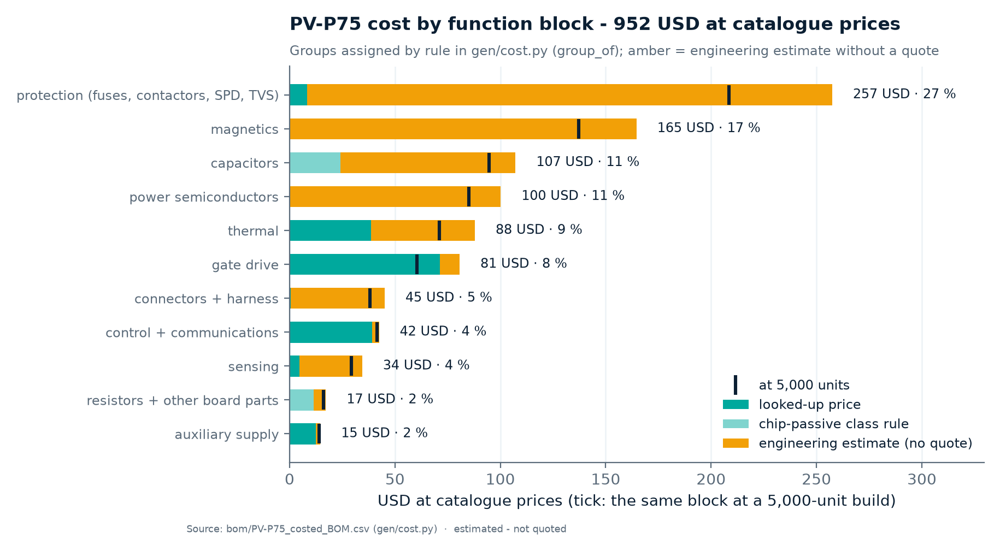

<!-- breadcrumb --> [Home](../../README.md) › [Documentation](../README.md) › Sourcing and cost

# 💰 Sourcing and cost

> Where the parts come from, how firm each price is, what the products cost at catalogue prices and at a 5,000-unit build, and how that compares with the owner's price benchmark.

---

> [!IMPORTANT]
> **No part has been bought or quoted.** A price here is either a looked-up catalogue reading (URL and date in
> [`gen/data/prices.csv`](../../gen/data/prices.csv)), a class rule for chip passives, or an engineering estimate with
> its basis written next to it ([`gen/data/cost_estimates.csv`](../../gen/data/cost_estimates.csv)). About two thirds
> (66 %) of the PV-P75 catalogue total is estimate. Read every figure on this page as *estimated*.

## 💰 The costs in one table

<!-- BEGIN:cost-summary -->

| Product | What the figure is | kW | Catalogue USD | USD/kW | 5,000 units USD | USD/kW | Evidence | 5k ÷ benchmark-equivalent BOM |
|---|---|---:|---:|---:|---:|---:|---|---:|
| **PV-P75** | BOM of drawn boards (PV-PWR + PV-CTL) | 75 | **976** | 13.0 | **817** | 10.9 | 66 % of catalogue on estimates · 15 % of 5k on published breaks | 2.0× (≈ 410 USD) |
| **PV-P100/110** | BOM of drawn boards (PV-PWR-4 + PV-CTL) | 100 / 110 | 1,167 | 11.7 / 10.6 | 977 | 9.8 / 8.9 | 64 % of catalogue on estimates · 15 % of 5k on published breaks | 1.8× / 1.7× |
| **PCS-P125** | design study, 3-wire (two-level), design point D-060; the three-wire boards are drawn and cost more, see D-063 | 125 | 1,409 | 11.3 | 1,131 | 9.0 | 5 % of 5k on published prices | see note |
| **PCS-P125** | design study, 4-wire (two-level), design point D-060; the three-wire boards are drawn and cost more, see D-063 | 125 | 1,694 | 13.6 | 1,361 | 10.9 | not stated for 4-wire | see note |
| PV-P75 earlier platform | BOM of drawn boards (8 boards) | 75 | 2,836 | 37.8 | 2,275 | 30.3 | 51 % of catalogue on estimates · 17 % of 5k on published breaks | 5.5× |
| DAB-D60 earlier platform | BOM of drawn boards (5 boards) | 60 | 3,615 | 60.2 | 2,927 | 48.8 | 48 % of catalogue on estimates · 12 % of 5k on published breaks | 7.5× |
| PCS-P125 | three-level T-type estimate, **withdrawn by D-053** | 125 | 1,037 | 8.3 | 801 | 6.4 | — | — |

Generated by <a href="../assets/figures_overview.py">figures_overview.py</a> from <a href="../../bom/COST.md">bom/*_costed_BOM.csv</a>, <a href="../../sim/out/pcs_design/pcs_spec.json">pcs_spec.json</a> and <a href="../../gen/data/costfirst_pcs_bom.csv">costfirst_pcs_bom.csv</a>; benchmark arithmetic from <a href="../../gen/cost.py">gen/cost.py</a>. Do not edit between the markers.

<!-- END:cost-summary -->

**How to read it.** *Catalogue* = the price break at the highest quantity up to 1,000 pieces from the best source
(LCSC first). *5,000 units* = a published break of at least 1,000 pieces where one exists (REAL), otherwise the
catalogue price times a factor per part class from [`gen/data/volume_factors.csv`](../../gen/data/volume_factors.csv)
(ASSUMED). *Benchmark-equivalent BOM*: see [Against the benchmark](#-against-the-benchmark) below. The full model, line
by line, is [`bom/COST.md`](../../bom/COST.md).

**Note on the PCS ratio.** `gen/cost.py` adjusts the benchmark for current only for the DC/DC modules. For PCS-P125 the
current adjustment is in [ARCHITECTURE-PCS.md §12](../requirements/ARCHITECTURE-PCS.md#12-cost--both-products-catalogue-and-5000-units-against-the-benchmark):
the benchmark corresponds to a BOM of about 690 USD for a 125 kW / 400 V unit. The PCS rows of the table are the design
study's (three-wire, [D-060](../requirements/DECISIONS.md): 1,131 USD at 5,000 units, about 1.6 × that). The module BOM
of the drawn boards, which `gen/cost.py` prices ([`bom/COST.md`](../../bom/COST.md), [D-063](../requirements/DECISIONS.md)),
is higher: 1,557 USD at catalogue prices and 1,322 USD at 5,000 units (10.6 USD/kW; catalogue / 5,000 units, estimates
where no price exists), about 1.9 × that (our arithmetic on the two records). The PV and PCS figures rose on
2026-10-05 with the live LCSC price of the SG2M040170HJ (5.07 USD at 90+ instead of the 4.07 USD estimate,
[D-069](../requirements/DECISIONS.md)), plus the inverter's frozen phase-current sensor and less its six removed DESAT
diodes ([D-067](../requirements/DECISIONS.md)): PV-P75 952 → 976 / 796 → 817 USD, PV-P100-110 1,135 → 1,167 / 949 → 977 USD,
PCS-P125 1,521 → 1,557 / 1,292 → 1,322 USD (catalogue / 5,000 units).

---

## 📐 Sourcing policy

The owner's instruction of 2026-10-04 ([REQUIREMENTS.md §7](../requirements/REQUIREMENTS.md#7-sourcing-cost-and-magnetics-owner-instruction-2026-10-04))
and the rules derived from it in the [decision register](../requirements/DECISIONS.md):

| Rule | What it means in practice | Source |
|---|---|---|
| Asian, preferably Chinese, makers for every cost-driving part | SiC switches, drivers, capacitors, contactors, fuses, sensors and magnetic materials; the TI C2000 controller stays | SRC-1, D-031 |
| "Proper, verified and reliable" | complete datasheet on file, documented qualification, an established maker; availability checked on LCSC | SRC-2 |
| Primary **and** alternate maker per power-switch position | the design is done for the worse of the two; a candidate that fails a design check is not an alternate | D-037, D-043 |
| Second source for everything else | 107 lines studied: 38 drop-in, 14 functional, 53 without a properly documented Asian part, 21 adopted | D-040 |
| Kept on purpose | E-stop input isolators, CAN / RS-485 isolators and a few others where the Asian part is weaker or has no obtainable datasheet (earlier platform) | D-040 |
| Reliability is not traded for cost | derating rules, hardware protection and single-fault behaviour stay | SRC-4, D-050 |
| Chinese power modules | catalogued as request-for-quotation alternates; the designs stay on paralleled discretes | D-055 |
| Costs reported at a 5,000-unit build too | with the share of the figure that rests on real volume prices | SRC-6 |

## Cost-driving parts and the evidence behind them

Evidence is graded twice: **qualification** (is the part proven?) and **price** (how firm is the number?).

| Function | Maker · part | Qualification evidence | Price evidence | Open point |
|---|---|---|---|---|
| SiC MOSFET 1700 V, 40 mΩ (24 per PV-P75, 36 per PCS-P125) | Sichain · SG2M040170HJ | **none published** — a release condition | LCSC C42456100: 5.07 USD at 90+ (6.73 at 1), 418 in stock, read 2026-10-05 — a catalogue reading, no quote | qualified fallback: Microchip MSC035SMA170B4 as an assembly variant ([D-043](../requirements/DECISIONS.md)); for the inverter, matched devices per switch ([D-067](../requirements/DECISIONS.md)) |
| Isolated gate driver (12 per PV-P75) | NOVOSENSE · NSI6651ASC-Q1 | AEC-Q100 grade 1; VDE 0884-17, UL 1577, CQC granted | stocked at LCSC (single-piece reading) | impulse rating 6,250 V against 8 kV reinforced: passes only with the surge-arrester credit ([D-043](../requirements/DECISIONS.md)) |
| Gate-drive bias | TI · SN6505B + custom transformer (DMEGC EP17 core) | TI datasheet; transformer is a new custom part | TI.com 1ku list; transformer estimate | partial-discharge test on samples (ARCHITECTURE-COSTFIRST R-06) |
| DC contactor 300 A / 1000 V (2 per PV-P75) | Hongfa · HFE82V-300C/1000 | datasheet; coil-to-mounting insulation **not stated** | quote needed (marketplace listing of the same family) | R-04 |
| aR fuse 250 A / 1000 V DC (battery port) | Hongfa · HPE501 size 000 | datasheet; curves read conservatively | quote needed (no public price) | R-03 |
| Port film capacitors 45 µF / 1300 V | Jianghai · FCSA3DS456 | datasheet | quote needed (no Chinese price found) | Faratronic second source is rated 1200 V at 70 °C |
| PV inductor 224 µH (one per phase) | custom · POCO NPC 26 toroids, solid round wire | own design, checked by two models ([D-054](../requirements/DECISIONS.md)) | estimate, no quote | wound sample and thermal test |
| Surge protection | Thinking Electronic · TVT25751 varistors + ETI 14×51 fuses | datasheets; thermal links have **no DC rating** | estimate | [D-042](../requirements/DECISIONS.md) |
| Inductor current sensor | Sinomags · STK-HO/A 75 | datasheet; no dv/dt immunity figure | quote needed (estimate) | R-07 |
| Inverter phase-current sensor (3 per PCS-P125) | Sinomags · STK-250HO/4 | datasheet (±625 A linear, 8 kV impulse); no working-voltage, qualification or dv/dt statement | estimate 6.0 USD (no LCSC listing, no published price) | frozen by [D-067](../requirements/DECISIONS.md); the residual-current sensor is still a quotation |
| Reinforced barrier B1 (5 isolators) | Chipanalog · CA-IS3050W, CA-IS3082WNX, CA-IS3820LG / 3821LG | datasheet ratings pass in the [PV-CTL design check](../../hardware/PV-CTL/outputs/PV-CTL_design_check.txt), with mandatory conformal coating over the barrier | stocked at LCSC (1,000+ breaks) for most | coating to pollution degree 1 |
| Fans (3 per PV-P75) | Delta · AFB1224SHE-F00 | datasheet: rated **−10 °C**, requirement −30 °C | distributor reading (web-search result) | R-05 |
| Controller | TI · F280039C | TI (kept by policy) | TI.com 1ku list | — |
| Power modules (alternative to discretes) | HIITIO, StarPower, Macmic, BASiC, Leapers and others — 24 candidates | short-circuit ratings only on StarPower (IGBT), Macmic and BASiC sheets; HIITIO sheets treated as unverified | **no public price; none on LCSC** | RFQ alternates; [D-055](../requirements/DECISIONS.md), [survey](../../sim/data/asia_modules.md) |

Line-by-line prices and their sources: [`bom/PV-P75_costed_BOM.csv`](../../bom/PV-P75_costed_BOM.csv). The survey
behind each choice: [`sim/data/asia_devices.md`](../../sim/data/asia_devices.md),
[`asia_drivers.md`](../../sim/data/asia_drivers.md), [`asia_fuses.md`](../../sim/data/asia_fuses.md),
[`asia_ics.md`](../../sim/data/asia_ics.md), [`asia_modules.md`](../../sim/data/asia_modules.md).

> [!NOTE]
> **Break-even prices for a module** ([D-055](../requirements/DECISIONS.md)): a Chinese module must cost less than
> 38.7 USD per phase leg (PCS-P125), 36 USD per half-bridge (DAB-D60) or 16.5 USD per half-bridge (PV cell) to beat the
> discretes it would replace. No 1700 V SiC module of the size the PV cell needs exists at any maker that could be read,
> so the PV module has no module option. For the DAB-D60 the BASiC BMF008MR12E2G3 is the module to quote.

---

## 💰 Where the money is

Source: <a href="../../bom/PV-P75_costed_BOM.csv">bom/PV-P75_costed_BOM.csv</a>, groups by <code>group_of()</code> in <a href="../../gen/cost.py">gen/cost.py</a> · estimated, not quoted

- **Protection** (contactors, fuses, surge network, terminals) and **magnetics** are the two largest blocks, and both
  are almost entirely estimate.
- The **power semiconductors** — 24 SiC devices — are about an eighth of the BOM (124 USD, 12.7 %), now at the live LCSC
  price.
- Control and communications are small: the cost-first design moved the money out of boards and into a few chassis parts.

## The cost journey

Source: <a href="../../bom/COST.md">bom/COST.md</a>, benchmark constants of <a href="../../gen/cost.py">gen/cost.py</a>, budget of <a href="../requirements/DECISIONS.md">D-044</a> · estimated, not quoted

How the PV-P75 figure got here (each step is a record):

| Step | PV-P75 BOM | Record |
|---|---:|---|
| First costed BOM, Western devices | 4,948 USD (66 USD/kW) | [D-038](../requirements/DECISIONS.md) |
| Asian devices and drivers on the full-featured platform | 2,789 USD (37 USD/kW) | [COST-REVIEW.md §1](../requirements/COST-REVIEW.md) |
| Cost-first architecture, architect's costed list | 966 USD (12.9 USD/kW) | [D-045](../requirements/DECISIONS.md), [ARCHITECTURE-COSTFIRST.md §14](../requirements/ARCHITECTURE-COSTFIRST.md#14-cost-summary-from-gendatacostfirst_bomcsv) |
| Cost-first, drawn boards PV-PWR + PV-CTL, with the live LCSC switch price | 976 USD (13.0 USD/kW); 817 USD at 5,000 units | [bom/COST.md](../../bom/COST.md), as of 2026-10-05 |

The earlier platform is re-priced on every run with today's prices, so its figure in the table above differs slightly
from the 2,789 USD of the cost review.

## The 5,000-unit view

The owner asked for costs at a 5,000-unit volume (SRC-6). Only a small share of that figure rests on a published
volume price; the rest is the catalogue price times a factor chosen by part class:

| Factor class | Factor | What it covers | Confidence |
|---|---:|---|---|
| `asia_part_estimate` | 0.85 | Asian parts with an estimated catalogue price | low |
| `protection_estimate` | 0.80 | contactors, fuses, surge parts | low |
| `custom_magnetic_large` | 0.85 | inductors, common-mode cores | low |
| `custom_mech` | 0.85 | heatsink, busbars, terminals | low |
| `single_piece_list` | 0.52 | parts with only a one-piece price (e.g. the gate driver) | medium |
| `ceramic_pad` | 0.70 | device insulators | low |

Factors and their reasoning: [`gen/data/volume_factors.csv`](../../gen/data/volume_factors.csv). Shares per module:
[`bom/COST.md`](../../bom/COST.md) (sections "The 5000-unit view").

---

## 💰 Against the benchmark

Source: <a href="../../bom/COST.md">bom/*_costed_BOM.csv</a>, <a href="../../sim/out/pcs_design/pcs_spec.json">pcs_spec.json</a>, <a href="../../gen/data/market_prices.csv">market_prices.csv</a> · estimated; the benchmark price is the owner's statement

**The benchmark.** Megarevo's MPHV 1500 V string PCS, 228 kW, sells for **1,500 USD = 6.6 USD/kW** — the owner's
figure of 2026-10-04, not a published price ([row in market_prices.csv](../../gen/data/market_prices.csv),
[product file](../reference-designs/megarevo/string-pcs-1500v/README.md)). It is the *selling price* of a complete
AC/DC unit, so it cannot be compared with a BOM directly. `gen/cost.py` converts it with stated assumptions:

| Assumption | Value | Where it is set |
|---|---:|---|
| Gross margin of the benchmark's maker | 25 % | `BENCH_MARGIN` in [gen/cost.py](../../gen/cost.py) |
| BOM share of the cost of goods | 80 % | `BOM_SHARE_OF_COGS` |
| → BOM share of the selling price | 0.60 | (1 − 0.25) × 0.80 |
| → benchmark BOM | 900 USD = 3.95 USD/kW | 1,500 × 0.60 / 228 kW |
| DC current per kW of the benchmark | 1.16 A/kW | `BENCH_DC_A_PER_KW` |
| Share of a BOM that scales with current, not power | 70 % | `CURRENT_SHARE` |
| PV-P75 current per kW (135 A / 75 kW) | 1.80 A/kW → BOM multiplier 1.39 | `MODULE_AMPS` |
| → benchmark-equivalent BOM of a 135 A, 75 kW module | ≈ 410 USD | [bom/COST.md](../../bom/COST.md) "Against the owner's benchmark" |

**A second, weaker reference:** 17 marketplace listings of Chinese DC/DC modules of 30 kW and more sell for 22–74 USD/kW
(median 34 USD/kW); at the same margin assumptions the median implies a BOM of about 20 USD/kW. They are export list
prices of mostly isolated storage modules, none a non-isolated PV tracker ([bom/COST.md](../../bom/COST.md)).

> [!WARNING]
> **Budget not met.** The working budget for PV-P75 is 800 USD of BOM at catalogue prices (D-044, the architect's
> assumption — the owner gave a PCS price, not a DC/DC price). The drawn boards are above it, and about twice the
> benchmark-equivalent BOM at 5,000 units. Whether the gap is real cannot be judged without supplier quotations
> ([D-052](../requirements/DECISIONS.md)).

## 💰 The LCSC sourcing pass (2026-10-05)

Every transistor and diode position of the three module BOMs and of the DAB study was checked against LCSC's own product
pages for stock, price ladder and an orderable Chinese alternative ([D-069](../requirements/DECISIONS.md); owner's
instruction of 2026-10-05; the record is [sim/data/lcsc_semis.md](../../sim/data/lcsc_semis.md) with 180 candidate rows
in [lcsc_semis.csv](../../sim/data/lcsc_semis.csv) and 73 datasheets filed). Stock and prices are a snapshot of
2026-10-05; nothing was bought.

| Finding | Detail | Effect |
|---|---|---|
| The main switch is on LCSC | Sichain SG2M040170HJ, C42456100: 6.73 USD at 1, **5.07 USD at 90+**, 418 in stock — enough for 17 PV-P75, 13 PV-P100-110 or 11 PCS-P125 modules; LCSC-only, so it is not in the JLCPCB assembly library | the earlier "not on LCSC, 4.07 USD estimate" was wrong (the mirror searched holds only the JLCPCB library); the cost model now uses the live price: +24 / +32 / +36 USD per PV-P75 / PV-P100-110 / PCS-P125 module |
| Positions orderable as specified | 25 of 42 incumbents are in stock; 17 are not orderable as specified, and some in stock are shallow (the DAB clamp VS-60EPS16-M3: 36 pieces, one DAB module) | a recommended part per position, with its re-check |
| Adopted | the Bourns SMBJ33A / SMBJ36A / SMBJ58CA TVS (not on LCSC) become **MDD SMBJ33A / SMBJ36A / SMBJ58CA** (C173526 / C114001 / C114007, in stock) — same JEDEC numbers, ratings, package and polarity marking; Bourns stays the alternate | the only change on the boards |
| Recorded as options, not adopted | Vishay US1MHE3 for the out-of-stock US1MH (leakage 10 against 5 µA in the DESAT string); Yangjie 60EPS16 for the DAB clamp (0.90 against 2.67 USD at 1,000, −36 USD per DAB module; surge with VRRM reapplied not stated); ST STTH8L06G for VS-8ETU04S; Yangjie BZX84B20 / B6V8 (no temperature coefficient stated); Nexperia BZX84-B18-QR for the unobtainable BZX84-A18 (±2 % instead of ±1 %); Vishay SQ2318AES for PMV30ENEAR (clamp timing re-check); UTC 2P50G for IRFR9214 (8.5 against 3.0 Ω, hold-current re-check); Nexperia PBSS4041PX for PBSS5540X; JSCJ FMMT619 for ZXTN25040 | each needs its stated re-check first; a main-switch alternate stays "functional" by rule, because the Miller and short-circuit analyses are device-specific ([D-041](../requirements/DECISIONS.md)) |
| No orderable part | the 1700 V flyback switch IV2Q171R0D7Z (listed, 0 in stock; WeEn WNSC2M1K0170B7 through TME / element14, not verified on their pages) and the ZXTP25040 PNP followers of the inverter's gate buffer (6.6 A peak; no LCSC part carries it) | a distributor or a quotation |
| Price book corrected | four rows of `gen/data/prices.csv` had been keyed to look-alike listings of other makers (Hottech BAS16, UMW BAT54, MDD BAT54S, ElecSuper BSS138BK) and now carry the genuine Nexperia C-numbers | the small-signal prices match the drawn maker |
| What the datasheets do not give | no Chinese SiC datasheet states a short-circuit rating; AEC-Q101 is stated only by InventChip and the Western automotive variants; no maker publishes a reliability report or a cosmic-ray curve | risk A2 unchanged |

All transistor and diode lines of the recommended parts at LCSC unit prices (@1 / @100 / @1000 break, USD per
module): PV-P75 235.93 / 178.73 / 167.58, PV-P100-110 308.23 / 233.79 / 219.54, PCS-P125 306.14 / 232.05 / 222.64 —
catalogue prices at small quantities, not a 5,000-unit price ([lcsc_semis.md §3.3](../../sim/data/lcsc_semis.md)).

## 🗺️ Next cost levers

| Lever | Expected effect | Cost in function | Record |
|---|---|---|---|
| Supplier quotations for SiC devices, inductors, contactors, film capacitors, the inverter's current sensors | turns the largest estimates into numbers | none | [D-052](../requirements/DECISIONS.md) |
| Powder-core inductors for the inverter's filter | the filter is 443 USD of the 1,131 USD (39 %); powder cores saturate softly and could be sized for the overload peak instead of the trip point | a magnetics search that does not exist yet; L1 already runs at its 140 °C hot-spot limit | [D-060](../requirements/DECISIONS.md) |
| Fewer press-fit studs on the inverter's power board | 48 studs cost +39 USD against the study, which allowed 13 USD for studs, harness and standoffs together | a fastening concept with fewer studs | [D-063](../requirements/DECISIONS.md) |
| The PV-P100/110 inductor | the four-phase build is derated (full power to 35 °C inlet): its inductor hot spot is 5.3 K over the 155 °C limit at 114 m³/h per phase and 45 °C inlet (calculated) | a litz-wound inductor (about +17 USD per phase) or more airflow | [D-056](../requirements/DECISIONS.md), MG-17 |
| AlN → Al₂O₃ 0.635 mm device pads | about −18 USD (architect's list) | junction +2–3 K; partial-discharge test again | [ARCHITECTURE-COSTFIRST §14](../requirements/ARCHITECTURE-COSTFIRST.md#14-cost-summary-from-gendatacostfirst_bomcsv) |
| Standard panel terminals instead of custom stud feed-throughs | about −16 USD | none if creepage is kept | §14 |
| Asian 10×38 gPV branch fuses in the varistor network | about −16 USD | I²t margin 1.65× instead of 3.6× | §14 |
| Remove the PV-port contactor | about −56 USD | **not advised**: a reversed or shorted array is fed until someone opens the array isolator | §14 |
| Drop the seventh battery-side film capacitor of PV-P75 | about −5.4 USD (the re-based control model needs 243 µF; six capacitors and the films give 289.8 µF) | kept until a bench load-rejection test confirms the model | [D-065](../requirements/DECISIONS.md) |
| Yangjie 60EPS16 for the DAB clamp | about −36 USD per DAB module at the 1,000 break | surge and I²t with VRRM reapplied are not stated; lead polarity not tabulated | [D-069](../requirements/DECISIONS.md) |
| Quote a Chinese module where the break-even price allows | DAB-D60 and PCS only | none if the module's documents hold | [D-055](../requirements/DECISIONS.md) |

## Where the records disagree

- The inverter has three cost figures. The table above shows the design study at the design point of
  [D-060](../requirements/DECISIONS.md) (from [`pcs_spec.json`](../../sim/out/pcs_design/pcs_spec.json)) and the
  three-level T-type estimate that [D-053](../requirements/DECISIONS.md) withdrew (from
  `gen/data/costfirst_pcs_bom.csv`), and labels both. The BOM of the drawn boards, priced by `gen/cost.py`, is higher:
  1,557 / 1,322 USD ([`bom/COST.md`](../../bom/COST.md), module PCS-P125; [D-063](../requirements/DECISIONS.md) and the
  live switch price of [D-069](../requirements/DECISIONS.md) explain the difference). `bom/COST.md`'s design-study section
  now names the drawn boards.
- The PV-P75 5,000-unit figure differs between the architect's list (731 USD, [ARCHITECTURE-PCS.md §12](../requirements/ARCHITECTURE-PCS.md#12-cost--both-products-catalogue-and-5000-units-against-the-benchmark))
  and the drawn boards ([bom/COST.md](../../bom/COST.md)): the list set a volume price per row, the BOM uses published
  breaks and class factors. `bom/COST.md` reconciles the two line by line.

---

<!-- footer --> ← [Magnetics](06-magnetics.md) · [Documentation index](../README.md) · [Verification](08-verification.md) →
