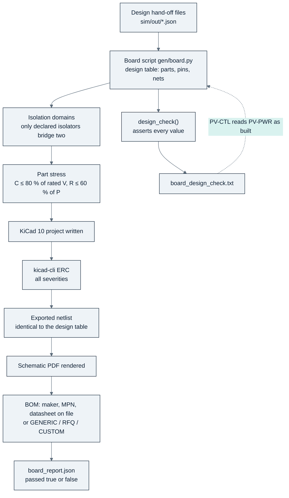

<!-- breadcrumb -->
[Home](../../README.md) › [Documentation](../README.md) › Verification

# 🔬 Verification

> What "verified" means in a project with no hardware: the build pipeline and its checks, the board design checks, the pin, temperature and insulation audits, the independent design reviews, the simulation self-checks and the three-way magnetics check — with the result for every board, and an honest list of what has not been verified.

---

> [!IMPORTANT]
> **"Verified" here never means measured.** It means one of: *build-checked* (a script proved a property of the drawn
> netlist), *design-checked* (a board's own calculation asserted every value against its datasheet and its
> requirement), *audited* (an independent table compared against the drawing), *reviewed* (an independent engineer read
> the design and logged findings), or *simulated* (a model with its own self-checks). Each claim on these pages names
> which one applies.

## 🔬 The build pipeline

Every board is a Python script; running it regenerates the KiCad 10 project, checks it and writes the outputs. Nothing
under `hardware/` or `bom/` is edited by hand ([gen/README.md](../../gen/README.md), [gen/dcdclib.py](../../gen/dcdclib.py)).

| Check | What it proves | What it cannot prove |
|---|---|---|
| Isolation domains | every net belongs to one domain; only parts declared as isolators or deliberate crossings touch two | that the isolator's rating is adequate (that is the insulation audit and the design check) |
| Part stress | every jellybean capacitor ≤ 80 % of its rated voltage and resistor ≤ 60 % of its power, on nets with a known DC range | pulse load, ripple, temperature derating — left to each board's design check |
| ERC (kicad-cli, all severities) | no electrical-rule error; warnings only with a written waiver | function |
| Netlist identity | the KiCad export equals the Python design table, net by net and part by part | that the design table is right |
| BOM completeness | every line has a maker, an orderable MPN and a datasheet on file, or is marked GENERIC, RFQ or CUSTOM | availability or price |
| Design check (per board) | the board's numbers against datasheets and requirements: stress, budgets, trip bands, interfaces | anything the model leaves out (layout, parasitics, real parts) |

## 🔬 Every board, as of 2026-10-05

| Board | Rev | Role | Sheets | Parts | Nets | Build checks | ERC warnings (all waived with a reason) |
|---|---|---|---:|---:|---:|---|---:|
| **PV-PWR** | A2 | cost-first power board, PV-P75 | 22 | 1,874 | 939 | 6 / 6 pass | 12 |
| **PV-PWR-4** | A2 | cost-first power board, PV-P100/110 | 25 | 2,322 | 1,150 | 6 / 6 pass | 16 |
| **PV-CTL** | A1 | cost-first control board | 7 | 285 | 192 | 6 / 6 pass | 0 |
| **PCS-PWR** | A0 | inverter power board, three-wire | 26 | 1,686 | 754 | 6 / 6 pass | 6 |
| **PCS-CTL** | A0 | inverter control board, three-wire (re-valued PV-CTL) | 8 | 305 | 209 | 6 / 6 pass | 0 |
| PORT-LEAN | F0 | stand-alone build of the lean port functions | 8 | 272 | 200 | 6 / 6 pass | 0 |
| PORT-LEAN-HOLD | F0 | the lighter interlock option kept by D-050 | 8 | 245 | 186 | 6 / 6 pass | 0 |
| GDRV-HB | J0 | gate-drive card, one half-bridge | 3 | 128 | 68 | 6 / 6 pass | 2 |
| DAB60 | B0 | DAB-D60 board — frozen, to be redrawn cost-first | 16 | 1,264 | 683 | 5 / 5 pass (no stress check) | 12 |
| AUX-HV | C1 | earlier platform, reference | 4 | 150 | 70 | 6 / 6 pass | 0 |
| CTRL-C2000 | E0 | earlier platform, reference | 14 | 599 | 468 | 4 / 4 pass (no domain or stress check) | 0 |
| SYS-IO-AUX | E0 | earlier platform, reference | 12 | 566 | 351 | 5 / 5 pass | 0 |
| PV-PORT | F0 | earlier platform, reference | 6 | 563 | 345 | 6 / 6 pass | 16 |
| PV-PORT-180 | F0 | earlier platform, reference | 6 | 563 | 345 | 6 / 6 pass | 16 |
| PVCELL-25 | C0 | earlier platform, reference | 9 | 587 | 284 | 6 / 6 pass | 4 |
| BMU-GW | B0 | earlier platform, reference | 1 | 32 | 23 | 6 / 6 pass | 0 |

Source: `hardware/<board>/outputs/<board>_report.json` for each board, e.g.
[PV-PWR](../../hardware/PV-PWR/outputs/PV-PWR_report.json), [PV-CTL](../../hardware/PV-CTL/outputs/PV-CTL_report.json),
[PCS-PWR](../../hardware/PCS-PWR/outputs/PCS-PWR_report.json), [PCS-CTL](../../hardware/PCS-CTL/outputs/PCS-CTL_report.json),
[DAB60](../../hardware/DAB60/outputs/DAB60_report.json). The PV-PWR and PCS-PWR waiver is a single warning type: the
NSI6651's pin 3 is named GND2 in the datasheet but is the floating Kelvin reference of the gate island.

**Board design checks of the cost-first boards.** The [PV-PWR design check](../../hardware/PV-PWR/outputs/PV-PWR_design_check.txt)
asserts its values on every build (a failed assertion stops the build): devices, shared heatsink, inductor, banks,
damper, X / Y capacitors, gate-drive channel and dead time, sensors, port currents, bleeders, the 5 V / 3.3 V
converters, the auxiliary budget, contactor pull-in and hold, the levels on every connector pin, and the default-off
state with the connector unplugged. The [PV-CTL design check](../../hardware/PV-CTL/outputs/PV-CTL_design_check.txt)
reports **36 PASS, 4 INFO, 1 OPEN and no FAIL**, including the latch evaluated from the netlist for 86 fault cases and an
interface check that reads the power board's design check *as built* (since [D-072](../requirements/DECISIONS.md) the
build refuses a stale copy by its hash). The OPEN line is the over-current window's design margin: the band misses the
1.10 × normal-peak floor by 0.58 A once the comparator's common-mode term is in it ([risk C9](12-risks-and-open-items.md)).
The design checks also raised findings that were then implemented: the heatsink trip lowered to ≤ 89.9 °C, the inductor
trip raised above the 145 °C full-load hot spot, and the IA / IB filter changed to reach 10 kHz. After the review round
below they also print the port A declaration, one fan-supply contract, the leg commutation with the drawn capacitors
(PV-PWR) and the live-24 V budget with typical values beside the stacked maxima.

The inverter's two boards have the same pair of checks. The [PCS-PWR design check](../../hardware/PCS-PWR/outputs/PCS-PWR_design_check.txt)
asserts the DC link, bleeders, power stage, gate drive and dead time, desaturation, LCL filter, sensing, DC and AC
ports, supplies, trip sources and thermal inputs, and prints its open items; the
[PCS-CTL design check](../../hardware/PCS-CTL/outputs/PCS-CTL_design_check.txt) reports **41 PASS, 5 INFO and no FAIL**
and reads the power board's check *as built* and the control study's sampling plan. Since [D-067](../requirements/DECISIONS.md)
the PCS-PWR check also prints the full DC-link inventory and discharge time, the DESAT coordination with the overload,
the device acceptance rule, the DC-port fault coordination and the live-24 V step budget of the contactor pull-ins.
PCS-PWR's build checks passed on an independent rebuild ([D-061](../requirements/DECISIONS.md)); all of them are
calculations on the drawn netlists, not tests.

## 🔬 Audits

Chart: [figures_design.py](../assets/figures_design.py) from [pin_audit_report.csv](../../gen/data/pin_audit_report.csv),
a run of [gen/temp_audit.py](../../gen/temp_audit.py) and [barrier_audit.csv](../../sim/out/insulation/barrier_audit.csv).

| Audit | What it compares | Result | Coverage gap |
|---|---|---|---|
| **Pin audit** ([gen/pin_audit.py](../../gen/pin_audit.py)) | every drawn symbol's pin numbers and names against a ledger transcribed from the datasheet by someone who had not seen the symbol | 247 parts drawn, 2,457 pins: **191 parts pass (1,959 pins), 0 fail**, 56 not auditable with a written reason ([pin_audit_report.csv](../../gen/data/pin_audit_report.csv), as of 2026-10-06) | ledger E ([D-070](../requirements/DECISIONS.md)) added the cost-first and inverter boards, and the parts of the control board rev A2 and the four-wire power board were added on 2026-10-06; four naming mismatches were corrected in the drawing to the datasheet wording (pin numbers and functions agreed). The not-auditable parts are two-terminal parts and connectors whose datasheets print no terminal numbers, a bare core, a contactor and RFQ parts. D-070 counts 239 / 180 / 1,854 for the earlier state of the same audit — the generated report is the later record |
| **Temperature audit** ([gen/temp_audit.py](../../gen/temp_audit.py)) | every orderable part in the module BOMs against −30 °C (PV-20) and +85 °C (enclosure air) | 251 parts (the three-wire inverter module included): 155 ok, 1 cold-limited, 2 hot-limited, 5 unknown, **89 not audited** | the 89 are mostly new cost-first and inverter parts — among them the SiC MOSFET SG2M040170HJ, the driver NSI6651ASC-Q1, the F280039C and the fan AFB1224SHE-F00 (known to be rated only to −10 °C, R-05); the script's module list does not include the four-wire module PCS-P125-4W |
| **Insulation barrier audit** ([sim/insulation.py](../../sim/out/insulation/report.md)) | 118 barrier rows on eight boards of the earlier platform against coordinated requirements at 2000 / 3000 / 4000 m | last run (2026-10-06): 2000 m: 40 pass, 57 pass with a condition, 21 fail; 3000 m and 4000 m: 41 fail. "Altitude that can be claimed today: none" | **covers the earlier platform only, and a run stops:** the script has no domain map (`BOARD_DOMAINS`) for PV-CTL, PCS-PWR, PCS-PWR-4W, PCS-CTL, PORT-LEAN and PORT-LEAN-HOLD, and its PV-PORT IMD-switch override no longer matches the drawn pair, so it ends with "102 problem(s)" and a non-zero exit — an open tooling item (pre-existing, not raised by the review). No barrier is unchecked: the cost-first and inverter boards check their own barrier parts against `insulation_spec.json` (B1 ratings and the altitude the barrier reaches in the PV-CTL and PCS-CTL design checks, isolation domains in every build), but the audit's single table does not include them |

The temperature-audit numbers come from the run inside [figures_design.py](../assets/figures_design.py) on the current BOMs (2026-10-06); cold-limited is a
SIKA flow switch on DAB60 (−25 °C), hot-limited a RECOM DC/DC on PVCELL-25 (71 °C) and the same SIKA part (70 °C);
unknown are a Mersen fuse and four Phoenix Contact terminals without a stated range (as named on 2026-10-05).

## 🔬 Independent design reviews

Chart: [figures_design.py](../assets/figures_design.py) from `gen/data/review_*.csv` and
[integration_findings.csv](../../gen/data/integration_findings.csv).

| Review | Scope | Critical | Major | Minor | Status |
|---|---|---:|---:|---:|---|
| [CSR](../../gen/data/review_ctrl_sys.csv) | CTRL-C2000, SYS-IO-AUX | 0 | 5 | 7 | assigned to board revisions ([D-023](../requirements/DECISIONS.md)); boards then frozen as reference ([D-044](../requirements/DECISIONS.md)) |
| [PVR](../../gen/data/review_pvcell_gdrv.csv) | PVCELL-25, gate drive | 1 | 3 | 5 | the Miller-clamp critical (PVR-01) led to gate drive rev 5 and on ([D-028](../requirements/DECISIONS.md), [D-043](../requirements/DECISIONS.md)) |
| [PA](../../gen/data/review_port_auxhv.csv) | PV-PORT, AUX-HV | 2 | 10 | 3 | coil suppression and discharge criticals fixed on the earlier boards ([D-024](../requirements/DECISIONS.md), [D-025](../requirements/DECISIONS.md)) |
| [INT](../../gen/data/integration_findings.csv) | integration across boards | 4 | 7 | 11 | as CSR |
| [DR](../../gen/data/review_dab60.csv) | DAB60 board | 0 | 8 | 7 | DR-01…07 resolved by calculation in [dab_design report §0.1](../../sim/out/dab_design/report.md); DR-05 left as a residual risk |
| [IC](../../gen/data/review_insulation.csv) | insulation, all HV boards | 3 | 15 | 5 | partly closed by the Chipanalog isolators ([D-040](../requirements/DECISIONS.md)) and the varistor network ([D-042](../requirements/DECISIONS.md)) |
| [MG](../../gen/data/review_magnetics.csv) | magnetics | 2 | 11 | 4 | 13 closed by the rev M1 / M2 constructions (calculated), 4 open |
| [PCM](../../gen/data/review_pcm.csv) | independent review of commit `033d8d8`: PV-P75 / PV-P100-110 boards and control, PCS-P125 study and boards, DAB-D60 study | 0 | 21 | 6 | **20 closed, 7 open**; 21 Confirmed, 2 Firmware Handled, 3 Improvement Recommended, 1 Not Applicable ([D-065](../requirements/DECISIONS.md) to [D-069](../requirements/DECISIONS.md), [D-072](../requirements/DECISIONS.md)) |
| **Total** | | **12** | **80** | **48** | 140 findings |

The first four reviews are the round of [D-023](../requirements/DECISIONS.md): 58 defects (7 critical, 25 major, 26
minor) found **after** every board had passed its own checks — the reason the review step exists. The magnetics and
PCM files carry a status column; for the others the status is taken from the decision register. The PCM register's
severities map the reviewer's P1 to *major* and P2 / P3 to *minor*.

**How the PCM findings were handled.** Every finding was verified independently before anything changed: the
reviewer's evidence (code reading, recalculation, datasheet check) was reproduced against the code, the datasheets and
a fresh calculation — for example the 70.0 kW at 550 / 550 V (PCM-01), the 689.66 / 758.62 V of the four-phase battery
port (PCM-13), the 129.53 A rms circulating current at 950 / 400 V (PCM-12) and the deck peaks of 1,236 V and
1,398 / 1,437 V (PCM-11) were all reproduced, while the fault-timing ratio of PCM-10 was recomputed from the driver's
timing diagram and replaced (both the reviewer's 1.58 × and the earlier 0.97 ×). Each finding was then put in one of
six classes — Confirmed, Already Fixed, Firmware Handled, Not Applicable, False Finding, Improvement Recommended — and
only the required changes were made, at the source of the number (mostly the study scripts under `sim/`), with the
affected studies re-run and the boards rebuilt before a finding was marked closed. The closure text of each row is in
[review_pcm.csv](../../gen/data/review_pcm.csv); all of it is calculated, not measured.

| Open finding | Why it stays open | What closes it |
|---|---|---|
| PCM-08 | no Chinese 1700 V or 1200 V SiC maker publishes a short-circuit withstand, a hot VGS(th) minimum, a cosmic-ray curve or a qualification report | supplier evidence; for PV-P75 the qualified Microchip MSC035SMA170B4 assembly variant ([D-043](../requirements/DECISIONS.md)) |
| PCM-10 | the DAB study's fault chain is 0.99 × the assumed hot withstand; the 2 × rule needs 0.50 and no lever inside the NSI6651 reaches it (best 0.61) | maker-confirmed tSC ≥ 2.22 µs at 1000 V / 150 °C and ESC ≥ 2.18 J per device, or a short-circuit test |
| PCM-14 | the inverter's synchronised contactor close needed 38.9 W against the auxiliary's 32 W live peak with an *assumed* 20 W coil; since [D-076](../requirements/DECISIONS.md) the live winding is rated 30 W / 48 W for 1 s and the close leaves 9.1 W (three-wire) / 5.8 W (four-wire) of reserve — the register row is still marked open | the RFQ coil data ("pull-in ≤ 24 W for ≤ 100 ms, hold ≤ 5.5 W"), then the row re-classified |
| PCM-19 | the TLV9024's rejection at 3.3 V is unspecified; with the guaranteed 50 dB the window misses its 1.10 floor by 0.58 A | CMRR measured ≥ 60 dB at 3.3 V on samples plus 10 ppm/K ladder resistors (0.74 USD) |
| PCM-22 | the four-wire build was not drawn; it is drawn since [D-074](../requirements/DECISIONS.md) (PCS-PWR-4W + PCS-CTL-4W) — the register row is still marked open | re-classify the row in [review_pcm.csv](../../gen/data/review_pcm.csv) |
| PCM-24 | no supplier quotation exists | quotations for the main switch, magnetics, contactors and film capacitors; assembly and test cost |
| PCM-27 | standards, pollution degree, coating and the custom transformer construction are not fixed from purchased texts | the standards bought, the levels fixed and type-tested |

> [!WARNING]
> **A closed finding is a corrected calculation, not a test.** The PCM round changed studies, two board pairs and the
> firmware requirements, but nothing it closed has been measured; seven findings stay open because only supplier data,
> a measurement or a product decision can close them. On the earlier platform the review round found 58 defects in
> boards that passed every automated check — the reason the step exists.

## 🔬 Simulation self-checks

| Study | Self-check (calculated) | Source |
|---|---|---|
| PV control | switched and averaged models within 4.8 % and 2.8 % of the step (RMS deviation from the small-signal model); energy-balance residual 0.005 %; ngspice band-mode deck drifts −16.376 A against −16.383 A in the switched model (RMS difference 3.5 mA); the review's reduced model reproduced within 1–2° | [pv_control report §3, §5](../../sim/out/pv_control/report.md) |
| PCS control | the plant is re-derived from the magnetics design files with three plant checks (worst error 0.13 %); the protection state machine's transition table passes an exhaustive check of eight invariants over every (state, event) pair | [review_pcm.csv](../../gen/data/review_pcm.csv) PCM-23, [pcs_control report §9](../../sim/out/pcs_control/report.md) |
| Cell design | ngspice switching decks against the analytic model: ripple within 15 %, device peak within 12 % (asserted); bidirectional symmetry of the loss model asserted | [pv_design report §2, §4](../../sim/out/pv_design/report.md) |
| Magnetics | 77 checks, 73 pass, 4 recorded as known shortfalls (MG-15, MG-16 twice, MG-17); model self-tests (Bessel strand model → DC limit 1.0000, iGSE on a sine = Steinmetz 1.000, two forms of Sullivan's Fr agree) | [magnetics report §8](../../sim/out/magnetics/report.md) |
| DAB | model calibrated against Wolfspeed's measured CRD efficiency; ngspice switching cross-check; the admitted map follows the harsh commutation deck's envelope; the fault chain recomputed from the driver datasheet's timing diagrams | [dab_design report §0.1, §5, §7, §11](../../sim/out/dab_design/report.md) |
| PCS study | self-check passes on an independent re-run ([D-053](../requirements/DECISIONS.md)) | [pcs_design report](../../sim/out/pcs_design/report.md) |

**What the self-checks caught.** The magnetics script's own inductance comparison caught a data fault in the tool
([D-060](../requirements/DECISIONS.md)): OpenMagnetics' data for the amorphous core material gives a permeability of 1
at 20, 24 and 30 kHz, so it modelled an air core there and flattered every amorphous inductor at those frequencies. It
showed only when the inverter's design point changed (a factor of 300 between the script's inductance and the tool's);
the trade study was re-run and the design point moved from 24 kHz back to 32 kHz.

The three-way magnetics verification (designer / OpenMagnetics / own calculation) is described on
[06 · Magnetics](06-magnetics.md); the insulation coordination on
[04 · Protection and safety](04-protection-and-safety.md#insulation-coordination-summary).

## ⚠️ What has NOT been verified

- **Nothing is measured.** No board has been laid out, built or powered: no double-pulse test, thermal run, hipot,
  partial-discharge test, EMI scan or efficiency measurement exists.
- **No PCB layout** (out of scope): every loop inductance (15 nH bulk-to-leg, ≤ 1 nH clamp loop), creepage distance and
  thermal path is a stated requirement, not a result.
- **The cost-first module as a whole:** efficiency and thermal were re-run on the drawn boards ([D-056](../requirements/DECISIONS.md);
  99.47 % peak, junction 109.5 °C at 45 °C inlet, [module_report.md](../../sim/out/pv_design/module_report.md)) and the
  control loops on the drawn sensing chain ([D-065](../requirements/DECISIONS.md)) — calculations, not measurements; the
  MPPT study still uses the earlier platform's isolated-amplifier noise model; the F280039C timing at 120 MHz is an
  estimate (R-14). The inverter's control is a sampled, averaged model with no switching ripple in the loop
  ([D-066](../requirements/DECISIONS.md)).
- **No full temperature audit and no insulation re-audit of PV-PWR, PV-CTL, PCS-PWR and PCS-CTL** (above); their
  independent review (PCM) and pin audit (ledger E) are done.
- **Insulation:** the barrier audit stops on the new boards (above); all standard values are transcribed from memory;
  the arrester credit is not verified against the standard text ([D-032](../requirements/DECISIONS.md)).
- **Makers' data that do not exist or were not obtained:** Sichain's qualification and short-circuit withstand (its
  price is now an LCSC reading, [D-069](../requirements/DECISIONS.md)); cosmic-ray FIT curves for the 1700 V and 1200 V
  devices; the sensors' dv/dt immunity and, for the frozen inverter phase sensor, its working voltage and qualification;
  the contactor's making current at 1000 V and coil-to-mounting insulation; the aR fuse's L/R; the fans below −10 °C; a
  type-B residual-current sensor with a data sheet (a quotation item); a reversal allowance for the Jianghai film
  capacitors.
- **Magnetics:** all calculated; the DAB transformer and series inductor fail three of their own checks, and the
  PV-P100/110 inductor's hot spot is 5.3 K over its limit (MG-17).
- **Firmware:** not written (out of scope); the safety-requirement lists on [05 · Control and firmware](05-control-and-firmware.md#firmware-requirements),
  the inverter's state machine and the DAB's FW-DAB-1…11 are requirements, not code.
- **Prices:** no quotation exists; see [07 · Sourcing and cost](07-sourcing-and-cost.md).

---

<!-- footer -->
← [07 · Sourcing and cost](07-sourcing-and-cost.md) · [Documentation index](../README.md) · [09 · PCS-P125](09-pcs-p125.md) →
