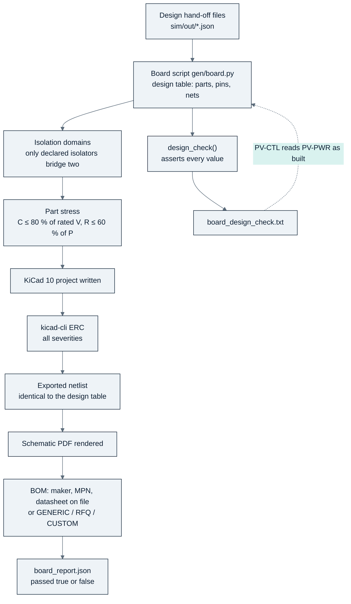
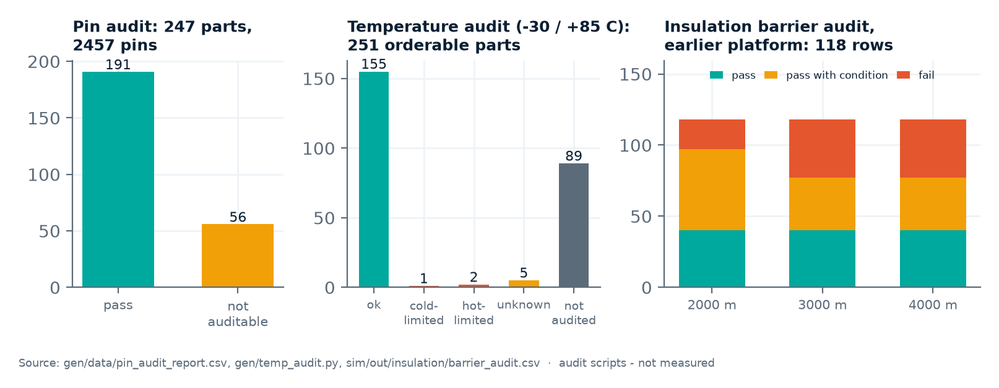
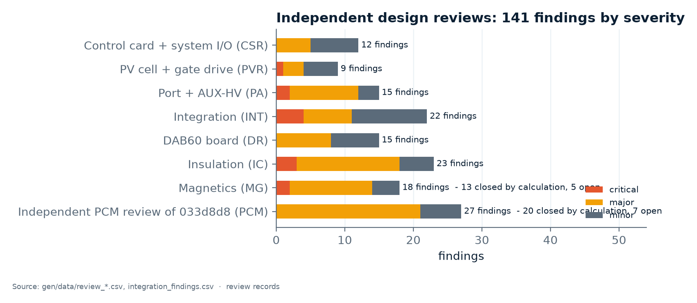

<!-- breadcrumb -->
[Home](../../README.md) › [Documentation](../README.md) › Verification

# 🔬 Verification

> What "verified" means in a project with no hardware: the build pipeline and its checks, the board design checks, the pin, temperature and insulation audits, the independent design reviews, the simulation self-checks and the three-way magnetics check — with the result for every board, and an honest list of what has not been verified.

---

> [!IMPORTANT]
> **"Verified" here never means measured.** It means one of: *build-checked* (a script proved a property of the drawn
> netlist), *design-checked* (a board's own calculation asserted every value against its datasheet and its
> requirement), *audited* (an independent table compared against the drawing), *reviewed* (an independent engineer read
> the design and logged findings), or *simulated* (a model with its own self-checks). Each claim on these pages names
> which one applies.

## 🔬 The build pipeline

Every board is a Python script; running it regenerates the KiCad 10 project, checks it and writes the outputs. Nothing
under `hardware/` or `bom/` is edited by hand ([gen/README.md](../../gen/README.md), [gen/dcdclib.py](../../gen/dcdclib.py)).

| Check | What it proves | What it cannot prove |
|---|---|---|
| Isolation domains | every net belongs to one domain; only parts declared as isolators or deliberate crossings touch two | that the isolator's rating is adequate (that is the insulation audit and the design check) |
| Part stress | every jellybean capacitor ≤ 80 % of its rated voltage and resistor ≤ 60 % of its power, on nets with a known DC range | pulse load, ripple, temperature derating — left to each board's design check |
| ERC (kicad-cli, all severities) | no electrical-rule error; warnings only with a written waiver | function |
| Netlist identity | the KiCad export equals the Python design table, net by net and part by part | that the design table is right |
| BOM completeness | every line has a maker, an orderable MPN and a datasheet on file, or is marked GENERIC, RFQ or CUSTOM | availability or price |
| Design check (per board) | the board's numbers against datasheets and requirements: stress, budgets, trip bands, interfaces | anything the model leaves out (layout, parasitics, real parts) |

## 🔬 Every board, as of 2026-10-05

| Board | Rev | Role | Sheets | Parts | Nets | Build checks | ERC warnings (all waived with a reason) |
|---|---|---|---:|---:|---:|---|---:|
| **PV-PWR** | A2 | cost-first power board, PV-P75 | 22 | 1,874 | 939 | 6 / 6 pass | 12 |
| **PV-PWR-4** | A2 | cost-first power board, PV-P100/110 | 25 | 2,322 | 1,150 | 6 / 6 pass | 16 |
| **PV-CTL** | A1 | cost-first control board | 7 | 285 | 192 | 6 / 6 pass | 0 |
| PORT-LEAN | F0 | stand-alone build of the lean port functions | 8 | 272 | 200 | 6 / 6 pass | 0 |
| PORT-LEAN-HOLD | F0 | the lighter interlock option kept by D-050 | 8 | 245 | 186 | 6 / 6 pass | 0 |
| GDRV-HB | J0 | gate-drive card, one half-bridge | 3 | 128 | 68 | 6 / 6 pass | 2 |
| DAB60 | B0 | DAB-D60 board — frozen, to be redrawn cost-first | 16 | 1,264 | 683 | 5 / 5 pass (no stress check) | 12 |
| AUX-HV | C1 | earlier platform, reference | 4 | 150 | 70 | 6 / 6 pass | 0 |
| CTRL-C2000 | E0 | earlier platform, reference | 14 | 599 | 468 | 4 / 4 pass (no domain or stress check) | 0 |
| SYS-IO-AUX | E0 | earlier platform, reference | 12 | 566 | 351 | 5 / 5 pass | 0 |
| PV-PORT | F0 | earlier platform, reference | 6 | 563 | 345 | 6 / 6 pass | 16 |
| PV-PORT-180 | F0 | earlier platform, reference | 6 | 563 | 345 | 6 / 6 pass | 16 |
| PVCELL-25 | C0 | earlier platform, reference | 9 | 587 | 284 | 6 / 6 pass | 4 |
| BMU-GW | B0 | earlier platform, reference | 1 | 32 | 23 | 6 / 6 pass | 0 |

Source: `hardware/<board>/outputs/<board>_report.json` for each board, e.g.
[PV-PWR](../../hardware/PV-PWR/outputs/PV-PWR_report.json), [PV-CTL](../../hardware/PV-CTL/outputs/PV-CTL_report.json),
[DAB60](../../hardware/DAB60/outputs/DAB60_report.json). The PV-PWR waiver is a single warning type: the NSI6651's pin 3
is named GND2 in the datasheet but is the floating Kelvin reference of the gate island.

**Board design checks of the cost-first boards.** The [PV-PWR design check](../../hardware/PV-PWR/outputs/PV-PWR_design_check.txt)
asserts its values on every build (a failed assertion stops the build): devices, shared heatsink, inductor, banks,
damper, X / Y capacitors, gate-drive channel and dead time, sensors, port currents, bleeders, the 5 V / 3.3 V
converters, the auxiliary budget, contactor pull-in and hold, the levels on every connector pin, and the default-off
state with the connector unplugged. The [PV-CTL design check](../../hardware/PV-CTL/outputs/PV-CTL_design_check.txt)
reports **35 PASS, 4 INFO and no FAIL**, including the latch evaluated from the netlist for 86 fault cases and an
interface check that reads the power board's design check *as built*. The design checks also raised findings that were
then implemented: the heatsink trip lowered to ≤ 89.9 °C, the inductor trip raised above the 145 °C full-load hot spot,
and the IA / IB filter changed to reach 10 kHz.

## 🔬 Audits

Chart: [figures_design.py](../assets/figures_design.py) from [pin_audit_report.csv](../../gen/data/pin_audit_report.csv),
a run of [gen/temp_audit.py](../../gen/temp_audit.py) and [barrier_audit.csv](../../sim/out/insulation/barrier_audit.csv).

| Audit | What it compares | Result | Coverage gap |
|---|---|---|---|
| **Pin audit** ([gen/pin_audit.py](../../gen/pin_audit.py)) | every drawn symbol's pin numbers and names against a ledger transcribed from the datasheet by someone who had not seen the symbol | 176 parts, 1,766 pins: 146 parts pass, 30 not auditable (no local PDF, or the datasheet prints no pin numbers), no mismatch | covers the earlier platform's boards only; the parts new on PV-PWR and PV-CTL are not in the ledger. The F280039C pin table is read from its datasheet on every PV-CTL build. [D-023](../requirements/DECISIONS.md) cites 1,348 pins — the audit has grown since |
| **Temperature audit** ([gen/temp_audit.py](../../gen/temp_audit.py)) | every orderable part in the module BOMs against −30 °C (PV-20) and +85 °C (enclosure air) | 236 parts: 154 ok, 1 cold-limited, 2 hot-limited, 5 unknown, **75 not audited** | the 75 are mostly new cost-first parts — among them the SiC MOSFET SG2M040170HJ, the driver NSI6651ASC-Q1, the F280039C and the fan AFB1224SHE-F00 (known to be rated only to −10 °C, R-05) |
| **Insulation barrier audit** ([sim/insulation.py](../../sim/out/insulation/report.md)) | 132 barrier rows on the earlier platform's 9 boards against coordinated requirements at 2000 / 3000 / 4000 m | 2000 m: 40 pass, 70 pass with a condition, 22 fail; 4000 m: 46 fail. "Altitude that can be claimed today: none" | not re-run for the cost-first boards; only B1's five isolators are checked, in the PV-CTL design check |

The temperature-audit numbers come from running the script on the current BOMs (2026-10-05); cold-limited is a
SIKA flow switch on DAB60 (−25 °C), hot-limited a RECOM DC/DC on PVCELL-25 (71 °C) and the same SIKA part (70 °C);
unknown are a Mersen fuse and four Phoenix Contact terminals without a stated range.

## 🔬 Independent design reviews

Chart: [figures_design.py](../assets/figures_design.py) from `gen/data/review_*.csv` and
[integration_findings.csv](../../gen/data/integration_findings.csv).

| Review | Scope | Critical | Major | Minor | Status |
|---|---|---:|---:|---:|---|
| [CSR](../../gen/data/review_ctrl_sys.csv) | CTRL-C2000, SYS-IO-AUX | 0 | 5 | 7 | assigned to board revisions ([D-023](../requirements/DECISIONS.md)); boards then frozen as reference ([D-044](../requirements/DECISIONS.md)) |
| [PVR](../../gen/data/review_pvcell_gdrv.csv) | PVCELL-25, gate drive | 1 | 3 | 5 | the Miller-clamp critical (PVR-01) led to gate drive rev 5 and on ([D-028](../requirements/DECISIONS.md), [D-043](../requirements/DECISIONS.md)) |
| [PA](../../gen/data/review_port_auxhv.csv) | PV-PORT, AUX-HV | 2 | 10 | 3 | coil suppression and discharge criticals fixed on the earlier boards ([D-024](../requirements/DECISIONS.md), [D-025](../requirements/DECISIONS.md)) |
| [INT](../../gen/data/integration_findings.csv) | integration across boards | 4 | 7 | 11 | as CSR |
| [DR](../../gen/data/review_dab60.csv) | DAB60 board | 0 | 8 | 7 | DR-01…07 resolved by calculation in [dab_design report §0.1](../../sim/out/dab_design/report.md); DR-05 left as a residual risk |
| [IC](../../gen/data/review_insulation.csv) | insulation, all HV boards | 3 | 15 | 5 | partly closed by the Chipanalog isolators ([D-040](../requirements/DECISIONS.md)) and the varistor network ([D-042](../requirements/DECISIONS.md)) |
| [MG](../../gen/data/review_magnetics.csv) | magnetics | 2 | 11 | 4 | 13 closed by the rev M1 / M2 constructions (calculated), 4 open |
| **Total** | | **12** | **59** | **42** | 113 findings |

The first four reviews are the round of [D-023](../requirements/DECISIONS.md): 58 defects (7 critical, 25 major, 26
minor) found **after** every board had passed its own checks — the reason the review step exists. Only the magnetics
file carries a status column; for the others the status is taken from the decision register.

> [!WARNING]
> The cost-first boards PV-PWR and PV-CTL have **not yet had an independent review round**. Their reviews so far are
> their own design checks and the cross-board interface check. On the earlier platform the review round found 58 defects
> in boards that passed every automated check.

## 🔬 Simulation self-checks

| Study | Self-check (calculated) | Source |
|---|---|---|
| Control | switched, averaged and small-signal models agree on overshoot within ~3 %; energy balance residual 0.007 %; ngspice band-mode deck drifts −16.281 A against −16.288 A in the switched model (RMS difference 3.5 mA) | [pv_control report §3](../../sim/out/pv_control/report.md) |
| Cell design | ngspice switching decks against the analytic model: ripple within 15 %, device peak within 12 % (asserted); bidirectional symmetry of the loss model asserted | [pv_design report §2, §4](../../sim/out/pv_design/report.md) |
| Magnetics | 77 checks, 73 pass, 4 recorded as known shortfalls (MG-15, MG-16 twice, MG-17); model self-tests (Bessel strand model → DC limit 1.0000, iGSE on a sine = Steinmetz 1.000, two forms of Sullivan's Fr agree) | [magnetics report §8](../../sim/out/magnetics/report.md) |
| DAB | model calibrated against Wolfspeed's measured CRD efficiency; ngspice switching cross-check | [dab_design report §5, §11](../../sim/out/dab_design/report.md) |
| PCS study | self-check passes on an independent re-run ([D-053](../requirements/DECISIONS.md)) | [pcs_design report](../../sim/out/pcs_design/report.md) |

The three-way magnetics verification (designer / OpenMagnetics / own calculation) is described on
[06 · Magnetics](06-magnetics.md); the insulation coordination on
[04 · Protection and safety](04-protection-and-safety.md#insulation-coordination-summary).

## ⚠️ What has NOT been verified

- **Nothing is measured.** No board has been laid out, built or powered: no double-pulse test, thermal run, hipot,
  partial-discharge test, EMI scan or efficiency measurement exists.
- **No PCB layout** (out of scope): every loop inductance (15 nH bulk-to-leg, ≤ 1 nH clamp loop), creepage distance and
  thermal path is a stated requirement, not a result.
- **The cost-first module as a whole:** efficiency and thermal were re-run on the drawn boards ([D-056](../requirements/DECISIONS.md);
  99.47 % peak, junction 109.5 °C at 45 °C inlet, [module_report.md](../../sim/out/pv_design/module_report.md)) — a
  calculation, not a measurement; the control loops and the MPPT have not been re-simulated with the TMR sensors and the
  divider / shunt chain; the F280039C timing at 120 MHz is an estimate (R-14).
- **No independent review, pin audit or full temperature audit of PV-PWR and PV-CTL** (above).
- **Insulation:** the barrier audit has not been re-run for the cost-first barrier list; all standard values are
  transcribed from memory; the arrester credit is not verified against the standard text ([D-032](../requirements/DECISIONS.md)).
- **Makers' data that do not exist or were not obtained:** Sichain's qualification, short-circuit withstand and price;
  cosmic-ray FIT curves for the 1700 V devices; the TMR sensors' dv/dt immunity; the contactor's making current at
  1000 V and coil-to-mounting insulation; the aR fuse's L/R; the fans below −10 °C.
- **Magnetics:** all calculated; the DAB transformer and series inductor fail three of their own checks, and the
  PV-P100/110 inductor's hot spot is 5.3 K over its limit (MG-17).
- **Firmware:** not written (out of scope); the safety-requirement list on [05 · Control and firmware](05-control-and-firmware.md#firmware-requirements)
  is unverified.
- **Prices:** no quotation exists; see [07 · Sourcing and cost](07-sourcing-and-cost.md).

---

<!-- footer -->
← [07 · Sourcing and cost](07-sourcing-and-cost.md) · [Documentation index](../README.md) · [09 · PCS-P125](09-pcs-p125.md) →
