<!-- breadcrumb -->
[Home](../../README.md) › [Documentation](../README.md) › PCS-P125

# 🗺️ PCS-P125 — the three-phase battery inverter

> The DC-to-AC product of the family: its requirement, the topology decision and the trade study that set its design point, the numbers behind it, the block diagram, what it reuses from the PV module, its cost at catalogue prices and at 5,000 units, what remains to be simulated, and its risks.

---

> [!IMPORTANT]
> **Architecture stage — preliminary.** The power board PCS-PWR rev A0 is drawn ([D-061](../requirements/DECISIONS.md)) and the control board is not, no control loop is simulated, every price is an estimate and
> nothing is measured. The power stage was decided on 2026-10-05 by [D-053](../requirements/DECISIONS.md) from the design
> study [sim/out/pcs_design/report.md](../../sim/out/pcs_design/report.md) (`sim/pcs_design.py`); an independent cross-check against
> Wolfspeed's 25 kW T-type and 200 kW two-level reference designs
> ([report](../../sim/out/pcs_design/crosscheck_wolfspeed.md), [D-057](../requirements/DECISIONS.md)) **confirmed the two-level stage on robustness**, and a trade study with the filter inductors actually designed
> ([tradeoff.md](../../sim/out/pcs_design/tradeoff.md), [D-060](../requirements/DECISIONS.md), which corrects
> [D-059](../requirements/DECISIONS.md)) **confirmed it on cost** and set the design point at 32 kHz.

> [!NOTE]
> **The design point was re-optimised with real inductor designs ([D-060](../requirements/DECISIONS.md)).** The cost and
> efficiency on this page are the figures of that trade study; they replace those of D-053, D-057 and D-059 (whose
> 24 kHz point rested on a fault in the magnetics tool, see [06 · Magnetics](06-magnetics.md)). All of them are
> calculated; none is quoted or measured. The exact frequency and inductance are not a firm result, the two-level choice
> is. Still open: powder-core inductors were not searched (the filter is 39 % of the bill of materials), L1 runs at its
> 140 °C hot-spot limit at 60 °C inlet, THDi and the control loops are not simulated, and no price is quoted.

## 📐 Requirement

The owner asked for "dc to ac" as well as DC/DC and named no rating; PCS-P125 is the roadmap's highest-priority PCS,
measured against Megarevo PMA0125 ([REQUIREMENTS.md §8](../requirements/REQUIREMENTS.md), AC-02 — the rating is an
assumption, [D-046](../requirements/DECISIONS.md)).

| Item | Value |
|---|---|
| Power | 125 kW rated, 137 kW maximum continuous DC, 150 kVA maximum |
| DC side | 590–950 V (full load 600–900 V; 650–950 V for three-wire + N), ±250 A maximum |
| AC side | 400 / 230 V, 180 A rated, 216 A maximum; PF −1…+1; THDi < 3 % |
| Modes | grid-following and off-grid / grid-forming; 100 % unbalanced load in the four-wire version |
| Overload | 110 % continuous, 120 % for 2 min |
| Efficiency | maximum 98.5 % (Megarevo's published figure) |
| Cooling, ambient | forced air, −30…+60 °C, derating above 45 °C |
| Price benchmark | Megarevo's 228 kW, 1500 V string PCS sells for 1,500 USD (6.6 USD/kW) — selling price of a different product ([SRC-5, AC-03](../requirements/REQUIREMENTS.md)) |

## 🧭 The topology decision

The architecture ([ARCHITECTURE-PCS.md](../requirements/ARCHITECTURE-PCS.md), [D-047](../requirements/DECISIONS.md)) chose a
**three-level T-type with discrete 1200 V / 650 V IGBTs** at 16 kHz on a first-order screen, and left one risk open:
its outer IGBTs would block the full DC link at 0.79 of their rating against the 0.67 rule of the PV design. The design
study settled that risk on evidence and on cost, and **D-053 withdrew the T-type**. ARCHITECTURE-PCS.md now carries a
"superseded" note for its power stage, filter, DC link and cost; its ports, the single reinforced barrier and the
control-board variant still stand.

Chart: [figures_design.py](../assets/figures_design.py) from [pcs_spec.json](../../sim/out/pcs_design/pcs_spec.json)
`topology_screen` (screen scope: devices, pads, gate drive, LCL filter, DC link; calculated, prices mostly assumed factors).
Each candidate is shown at its screening frequency — the chosen one at 32 kHz (351 USD). The screen prices L1 by a rule
(10 + 6 USD/J) and its own frequency sweep (`fsw_sweep`) would pick 48 kHz (322 USD); the trade study below, with the
inductors actually designed, put the design point at 32 kHz.

| Why two-level 1700 V SiC (all calculated) | Two-level, 6 × SG2M040170HJ per switch | Three-level T-type, as in the architecture |
|---|---|---|
| Device voltage at 950 V DC / rating | ≤ 0.56 for every device | 0.79 on the outer devices |
| Cosmic-ray failure rate at 950 V, sea level (Semikron AN 17-003 data) | 0.16 FIT per unit | about 104 FIT per unit |
| Devices, gate-drive channels (three-wire) | 36, 6 | 42 in the architecture; **66 needed** once the hot VCE(sat) and super-linear Eon are used |
| Device loss at 125 kW, 900 V | — | 2,638 W in the study's model against the architecture's 1,676 W |
| DC-link midpoint at PF 0 | no midpoint control needed | ≈ 3.5 mF per half for any three-level stage; the architecture's 660 µF per half cannot hold it |
| Screen-scope cost at 5,000 units (USD) | 351 (32 kHz) | 571 (best three-level SiC, 32 kHz); 557 for the architecture's IGBT T-type sized correctly |
| What two-level costs instead | common-mode voltage 432 V peak against 235 V: Cf star tied to the DC midpoint and about 6 dB more CM attenuation; L1 stores twice the energy | — |

Sources: [pcs_design report (a), (d), (g)](../../sim/out/pcs_design/report.md), [D-053](../requirements/DECISIONS.md).
Chinese three-level modules (HIITIO and others) were screened too: none has a public price, the best-fitting part prints
no short-circuit data, and one module per phase overheats by 16–32 K in the overloads
([asia_modules.md](../../sim/data/asia_modules.md), [D-055](../requirements/DECISIONS.md)). A module must beat
38.7 USD per phase leg to displace the discretes.

**The trade study of [D-060](../requirements/DECISIONS.md)** ([tradeoff.md](../../sim/out/pcs_design/tradeoff.md)) re-ran
the choice with the filter inductors designed by the magnetics model instead of priced by a rule (the first study's
filter was 167 USD; designed for real it was 611 USD). It corrects the study of [D-059](../requirements/DECISIONS.md),
whose 24 kHz point rested on a fault in the magnetics tool ([06 · Magnetics](06-magnetics.md)). It compared more than
twenty candidates; the headline ones, calculated, at 5,000 units:

| Candidate | Devices | fsw (kHz) | L1 / Cf / L2 | Filter (USD, kg) | Peak / full-load efficiency (%) | USD at 5,000 units (catalogue) | Limits |
|---|---:|---:|---|---:|---|---:|---|
| **Two-level, 32 kHz, L1 120 µH — chosen** | 36 | 32 | 120 µH / 50 µF / 6 µH | 443, 39 | 98.99 / 98.30 | **1,131** (1,409) | all met |
| Two-level, 28 kHz, L1 111 µH — runner-up | 36 | 28 | 111 µH / 75 µF / 6 µH | 454, 40 | 99.01 / 98.34 | 1,142 (1,421) | all met |
| Two-level, 48 kHz | 42 | 48 | 65 µH / 30 µF / 6 µH | 437, 23 | 98.92 / 98.36 | 1,156 (1,438) | all met |
| Two-level, 24 kHz, L1 130 µH — the point of D-059 | 36 | 24 | 130 µH / 75 µF / 6 µH | 495, 45 | 99.05 / 98.38 | 1,182 (1,469) | all met |
| Two-level, 32 kHz, L1 97 µH — the D-053 design, corrected | 36 | 32 | 97 µH / 50 µF / 6 µH | 506, 48 | 98.98 / 98.30 | 1,194 (1,482) | all met |
| Two-level, 16 kHz | 36 | 16 | 194 µH / 75 µF / 15 µH | 594, 57 | 99.17 / 98.46 | 1,282 (1,589) | all met |
| SiC T-type, 1200 V outer devices | 72 | 32 | 49 µH / 50 µF / 6 µH | 439, 22 | 99.49 / 98.84 | 1,236 (1,599) | outer devices at 0.88 of rating at the 1,050 V trip (limit 0.85) |
| SiC T-type, 1700 V outer devices | 72 | 32 | 49 µH / 50 µF / 6 µH | 439, 22 | 99.46 / 98.64 | 1,279 (1,619) | all met |
| IGBT T-type, 16 kHz — the architecture's, corrected | 126 | 16 | 97 µH / 30 µF / 47 µH | 820, 50 | 99.07 / 98.37 | 1,790 (2,308) | outer devices at 0.89 of rating at the 1,050 V trip |

Source: [tradeoff.md](../../sim/out/pcs_design/tradeoff.md) (28 rows; the acceptance limits are listed there) and
[pcs_design report (h)](../../sim/out/pcs_design/report.md). Efficiency at 125 kW and 750 V; the filter column is the
whole filter. Every candidate has its inductors designed by `sim/magnetics.py` (gapped nanocrystalline and amorphous
C-cores only — no powder cores) against its own trip level; the T-type's switching transients were not simulated.

Two-level is 148 USD below the cheapest T-type that keeps the voltage rule, but only 11 USD below the next two-level
point, and the sweep's resolution is about ±20 USD: the exact frequency and inductance are therefore not a firm result —
the two-level choice is. Modulations with less common-mode voltage bring no saving (AZSPWM1 1,223 USD; NSPWM fails the
earth-leakage limit), and the trip level cannot be lowered: protection needs 425 A and the inductor must stay
unsaturated to 434 A, so ±450 A stays.

The decision also brings the PCS onto the PV module's parts: the same SiC device, the same gate-drive channel, the same
32 kHz and the same control board. A published precedent for a two-level stage on a high-voltage bus is in the library —
Wolfspeed's 200 kW inverter for a 1500 V bus on 2300 V modules
([CRD200DA23N-GMA](../../docs/reference-designs/wolfspeed/crd200da23n-gma/)); the full library is indexed in
[docs/LIBRARY.md](../LIBRARY.md).

## ⚡ Design study result

| Block | Design (calculated) |
|---|---|
| Power stage | two-level, three legs (four for the four-wire version), **6 × Sichain SG2M040170HJ per switch, 36 devices**, **32 kHz**; sinusoidal PWM where m ≤ 0.98, min-max zero sequence above |
| Gate drive | **6 channels** (8 four-wire): NSI6651ASC + current buffer per channel driving 6 gates; RG,on 8.75 Ω / RG,off 7.5 Ω per device; rails +18 / −3.5 V; one bias transformer per phase |
| LCL filter | **L1 120 µH** (amorphous C-core, aluminium foil, 11.6 kg and 169 W each), **Cf 50 µF** with its star tied to the DC midpoint, **L2 6 µH**; the filter is 443 USD and 39 kg, 543 W at 125 kW / 750 V; resonance 2.2–9.4 kHz over the grid range; PWM THDi < 0.1 % (the 3 % budget is the controller's) |
| DC link | 5 + 5 Faratronic C3D1U147 film capacitors in two series halves; > 100,000 h at 60 °C inlet |
| Efficiency | peak **98.99 %**; **98.30 %** at 125 kW / 750 V; 98.08 % at 900 V; worst full-load point 98.04 % |
| Junction temperature | **123 °C** at 110 % load and 45 °C inlet; 145 °C at 60 °C; 161 °C after 1.2 × 216 A for 200 ms (175 °C rating) |
| Thermal | one earthed extrusion per leg, one Delta AFB1224SHE-F00 fan each |
| Protection | as on the PV module ([D-050](../requirements/DECISIONS.md)): DESAT + booster and UVLO, default-off pull-downs, external stop on the drivers' EN and the latch, dead-time stretch and negative-rail detector in every channel, PV-CTL's comparators (±450 A phase windows, 1,050 V, over-temperature), latch and gating; DC-port polarity and precharge-ΔV interlocks, hold-off at 1,000 A and the over-current window. The controller's CMPSS, ADC limits and trip zone are the second layer — about 8 USD of discrete parts in total |

Sources: [pcs_design report](../../sim/out/pcs_design/report.md) summary and sections (b)–(f) and (h);
[pcs_spec.json](../../sim/out/pcs_design/pcs_spec.json) `thermal_and_losses`, `inductors`, `handover`.

## 🧭 Block diagram

```mermaid
%%{init: {"theme": "base", "themeVariables": {"primaryColor": "#EEF3F7", "primaryBorderColor": "#0B1F33", "primaryTextColor": "#0B1F33", "lineColor": "#5B6B7A", "secondaryColor": "#D9F2EF", "tertiaryColor": "#FFF4D6", "fontFamily": "Inter, Helvetica, Arial, sans-serif"}}}%%
flowchart LR
    BAT["Battery or DC bus<br/>590–950 V"]:::ext --> DCP["DC port<br/>aR fuses 400 A class, HFE82V,<br/>precharge, varistor Y, IMD"]:::live
    DCP --> LINK["DC link<br/>5 + 5 film, midpoint"]:::live
    LINK --> BR["Two-level bridge, 32 kHz<br/>6 × SG2M040170HJ per switch"]:::live
    BR --> L1["L1 120 µH"]:::live
    L1 --> CF["C_f 50 µF<br/>star on the DC midpoint"]:::live
    CF --> L2["L2 6 µH"]:::live
    L2 --> ACP["AC port<br/>2 contactors in series, relay check,<br/>type II SPD, RCMU, CM cores"]:::live
    ACP --> GRID["Grid 400 / 230 V"]:::ext
    CTL["PV control board variant<br/>F280039C on DC-"]:::live --> BR
    AUX["75 W-class flyback<br/>+ tap from the AC side"]:::live --> CTL
    CTL --- B1["Barrier B1<br/>CAN, RS-485, stop, fans"]:::selv
    N4["Fourth leg<br/>four-wire version only"]:::ext -.-> L2
    classDef live fill:#FDE7E0,stroke:#E4572E,color:#0B1F33
    classDef selv fill:#D9F2EF,stroke:#00A99D,color:#0B1F33
    classDef ext fill:#FFFFFF,stroke:#5B6B7A,stroke-dasharray:4 3
```

Ports and barrier from [ARCHITECTURE-PCS.md §2–§5](../requirements/ARCHITECTURE-PCS.md) (still valid); bridge, filter and
DC link from the study. In grid-connected operation the battery poles sit at about ±VDC/2 against earth: the
rack's insulation and its monitor must be rated for that.

## 🧰 What is reused from the PV module

| Reused | How |
|---|---|
| Control board PV-CTL with the F280039C, the latch and barrier B1 | assembly variant: one extra 2 × 8 header for 6 grid voltages, the second AC contactor and the residual-current test; different firmware |
| SiC device, gate-drive channel and per-phase bias scheme | the same SG2M040170HJ, NSI6651 channel and 32 kHz, now six devices per switch with a current buffer |
| Auxiliary flyback | unchanged design (the 590–950 V DC range is inside its input range) plus a tap from the AC side to start from the grid |
| Lean battery port | contactor, precharge, varistor network, insulation monitor, shunt and hold-off logic, scaled to 250 A with a 400 A-class aR fuse |
| Build checks, insulation tables, cost model | `gen/dcdclib.py`, `sim/insulation.py`, `gen/cost.py` |
| **New** | power stage, LCL magnetics, AC port (contactors, AC surge protection, residual-current monitor, CM cores), grid sensing, the fourth leg |

## 💰 Cost

| Version | Catalogue (USD) | 5,000 units (USD) | Per kW at 5,000 (USD/kW) |
|---|---:|---:|---:|
| Three-wire, design point of D-060 | **1,409** | **1,131** | 9.0 |
| Four-wire, design point of D-060 | 1,694 | 1,361 | 10.9 |
| Three-wire, the D-053 design with the real inductors (32 kHz, L1 97 µH) | 1,482 | 1,194 | 9.6 |
| Three-wire, architecture (withdrawn T-type) | 1,037 | 801 | 6.4 |
| Architecture's T-type, corrected, with the real inductors | 2,308 | 1,790 | 14.3 |

Sources: [pcs_spec.json](../../sim/out/pcs_design/pcs_spec.json) `cost_usd`, [pcs_costed_bom.csv](../../sim/out/pcs_design/pcs_costed_bom.csv),
[tradeoff.md](../../sim/out/pcs_design/tradeoff.md) (rows 3 and 5), [ARCHITECTURE-PCS.md §12](../requirements/ARCHITECTURE-PCS.md).
As of 2026-10-05, after the D-050 protection layer was added to the study. Only 5 % of the 5,000-unit figure rests on
real volume prices; the rest is assumed factors, and no part has a quotation, the inductors included. Against the
owner's benchmark the three-wire figure is about 1.6 × the current-adjusted benchmark BOM of about 690 USD (our
arithmetic), and the filter is 39 % of it; the comparison is on [07 · Sourcing and cost](07-sourcing-and-cost.md).

## 🔬 Simulation plan and status

| # | Simulation ([ARCHITECTURE-PCS.md §9](../requirements/ARCHITECTURE-PCS.md)) | Status |
|---:|---|---|
| 1 | Loss and thermal map over VDC, PF and load | **done** in the study (step b) — calculated |
| 2 | LCL design and resonance against grid impedance | **done** for the design point (steps c and h): resonance 2.2–9.4 kHz against the 10.7 kHz limit (fs/6), the inductors designed by the magnetics model |
| 3 | Current control and PLL, active damping, THDi < 3 % | **not simulated**; the filter allows a current-loop bandwidth of up to 1 kHz (below half the lowest resonance) |
| 4 | Midpoint balance | not needed for two-level; the three-level case was quantified (step d) |
| 5 | Grid forming and grid ↔ off-grid transitions | **not simulated** |
| 6 | Unbalanced load, four-wire neutral leg | neutral leg sized; its control **not simulated** |
| 7 | Fault ride-through and AC short circuit | **not simulated** (current-limit duty 1.2 × 216 A for 200 ms used for the thermal check) |
| 8 | Relay check, contactor and DC fuse coordination | not done: the 400 A aR fuse's slow region leaves the upstream requirement to be re-derived (R-05) |
| 9 | Common mode and leakage | spectrum and installation limits done (step f); EMI pre-compliance model not done |
| 10 | Insulation re-run with the AC side (OVC III) | not done |

## ⚠️ Risks and open items

| Risk | Consequence | Next step |
|---|---|---|
| The filter inductors are 39 % of the BOM and powder cores were not searched ([D-060](../requirements/DECISIONS.md)) | the filter is 443 USD and 39 kg of the 1,131 USD; the search covered gapped nanocrystalline and amorphous C-cores only, and no inductor price is quoted | add powder block cores (they saturate softly and could be sized for the overload peak instead of the trip point) to the magnetics search before the filter is frozen |
| L1 runs at its 140 °C hot-spot limit at 60 °C inlet | no thermal margin on the heaviest inductor (11.6 kg each); the two loss models differ by 1.8 × on foil copper loss (the design takes the higher) and the amorphous high-frequency core-loss fit is quoted from memory | a wound sample with calorimetric loss and a thermal run |
| Threshold-voltage spread of the SiC device (2.5–4.0 V) across six paralleled parts | at a 1.30 share the hottest junction reaches 163 °C at 60 °C inlet | threshold binning or one lot per switch, a Kelvin-source resistor per device, derating re-run |
| Sichain SG2M040170HJ: no public price (4.07 USD is an estimate), no qualification, no short-circuit rating, no cosmic-ray data (the 0.67 rule is applied by scaling Wolfspeed's 1200 V curve) | the cost and the 0.16 FIT figure rest on assumptions; the qualified Microchip fallback does not fit the budget at 36 devices | Sichain data and quotation |
| Six TO-247 devices in parallel per switch | sharing (k = 1.10) needs binned devices and a per-pair decoupling layout — a requirement, not a result | double-pulse test with the real layout |
| Control loops, PLL, grid forming not simulated | THDi, stability on weak grids and transitions unproven | simulation items 3–7 |
| Inductors, contactors, the 400 A aR fuse, heatsink, film capacitors, CM cores have no quotes | cost uncertain | requests for quotation; HIITIO fuses and contactors are documented candidates ([D-055](../requirements/DECISIONS.md)) |
| Grid codes and safety clauses (EN 50549-1, IEC 62109-2, IEC 62116, GB/T 34120) quoted from memory | settings and relay-check details unverified | buy the standards |
| Battery capacitance to earth (1–20 µF assumed) | limits three-wire operation on a TN grid below about 680 V | installation rule or the four-wire version |
| AC contactors: no OEM price; live coil against mains contacts | insulation and cost | maker data sheets and quotes |
| Fans rated −10…+60 °C | cold start below −10 °C outside the rating (as PV, R-05) | low-temperature option or firmware rule |

Sources: [pcs_design report, "What is not verified"](../../sim/out/pcs_design/report.md),
[ARCHITECTURE-PCS.md §11](../requirements/ARCHITECTURE-PCS.md), [D-053](../requirements/DECISIONS.md), [D-060](../requirements/DECISIONS.md).

---

<!-- footer -->
← [08 · Verification](08-verification.md) · [Documentation index](../README.md) · [10 · DAB-D60](10-dab-d60.md) →
