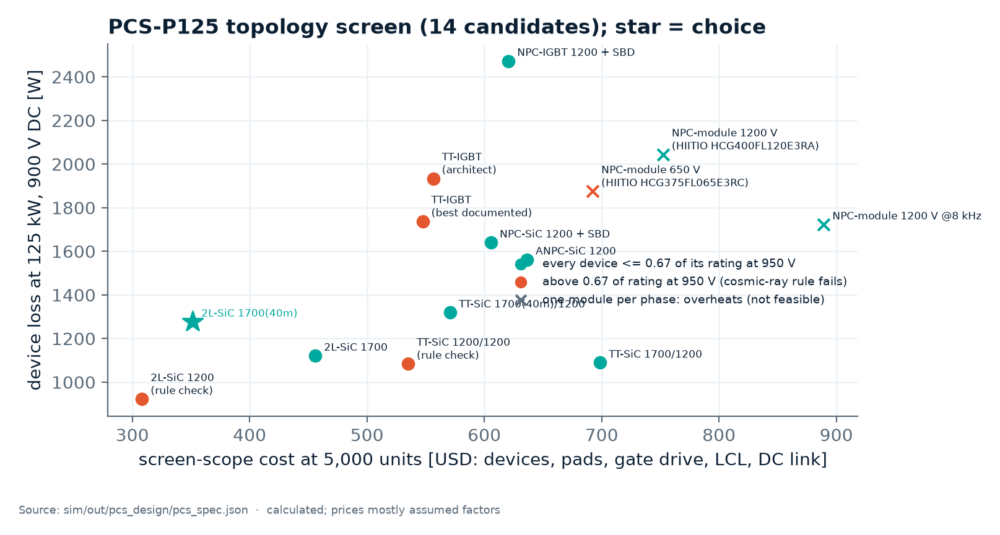

<!-- breadcrumb -->
[Home](../../README.md) › [Documentation](../README.md) › PCS-P125

# 🗺️ PCS-P125 — the three-phase battery inverter

> The DC-to-AC product of the family: its requirement, the topology decision and the trade study that set its design point, the numbers behind it, the two drawn boards, the block diagram, what it reuses from the PV module, its cost at catalogue prices and at 5,000 units, the control study, the corrections of the independent review, and its risks.

---

> [!IMPORTANT]
> **Three-wire boards drawn, control studied by calculation, independent review answered.** The power board PCS-PWR
> rev A0 and the control board PCS-CTL rev A0 are drawn and pass every build check ([D-061](../requirements/DECISIONS.md)
> to [D-064](../requirements/DECISIONS.md)); the review of 2026-10-05 corrected both and they were rebuilt
> ([D-067](../requirements/DECISIONS.md)). Their module BOM costs 1,557 USD at catalogue prices and 1,322 USD at
> 5,000 units (catalogue / 5,000 units, estimates where no price exists; [bom/COST.md](../../bom/COST.md)), above the
> design study's 1,409 / 1,131 USD for the reasons of [D-063](../requirements/DECISIONS.md) and the live switch price of
> [D-069](../requirements/DECISIONS.md). The control loops are designed on sampled averaged models
> ([D-066](../requirements/DECISIONS.md)) — no switched model, no measured THD. The four-wire build is not drawn, no
> part is quoted and nothing is built or measured. The power stage was decided on 2026-10-05 by [D-053](../requirements/DECISIONS.md)
> from the design study [sim/out/pcs_design/report.md](../../sim/out/pcs_design/report.md) (`sim/pcs_design.py`); an
> independent cross-check against Wolfspeed's 25 kW T-type and 200 kW two-level reference designs
> ([report](../../sim/out/pcs_design/crosscheck_wolfspeed.md), [D-057](../requirements/DECISIONS.md)) **confirmed the
> two-level stage on robustness**, and a trade study with the filter inductors actually designed
> ([tradeoff.md](../../sim/out/pcs_design/tradeoff.md), [D-060](../requirements/DECISIONS.md), which corrects
> [D-059](../requirements/DECISIONS.md)) **confirmed it on cost** and set the design point at 32 kHz.

> [!NOTE]
> **The design point was re-optimised with real inductor designs ([D-060](../requirements/DECISIONS.md)).** The
> efficiency, junction temperatures and the study's cost on this page are the figures of that trade study; they replace
> those of D-053, D-057 and D-059 (whose 24 kHz point rested on a fault in the magnetics tool, see
> [06 · Magnetics](06-magnetics.md)). The boards' own figures follow in [The drawn boards](#-the-drawn-boards). All of
> them are calculated; none is quoted or measured. The exact frequency and inductance are not a firm result, the
> two-level choice is. Still open: powder-core inductors were not searched (the filter is 39 % of the bill of
> materials), L1 runs at its 140 °C hot-spot limit at 60 °C inlet, THDi is an estimate from the linear control study
> (no switched simulation), and no price is quoted.

## 📐 Requirement

The owner asked for "dc to ac" as well as DC/DC and named no rating; PCS-P125 is the roadmap's highest-priority PCS,
measured against Megarevo PMA0125 ([REQUIREMENTS.md §8](../requirements/REQUIREMENTS.md), AC-02 — the rating is an
assumption, [D-046](../requirements/DECISIONS.md)).

| Item | Value |
|---|---|
| Power | 125 kW rated, 137 kW maximum continuous DC, 150 kVA maximum |
| DC side | 590–950 V (full load 600–900 V; 650–950 V for three-wire + N), ±250 A maximum — full load from 600 V is not reachable over 400 V ±15 % ([operating envelope](#after-the-review)) |
| AC side | 400 / 230 V, 180 A rated, 216 A maximum; PF −1…+1; THDi < 3 % |
| Modes | grid-following and off-grid / grid-forming; 100 % unbalanced load in the four-wire version |
| Overload | 110 % continuous, 120 % for 2 min |
| Efficiency | maximum 98.5 % (Megarevo's published figure) |
| Cooling, ambient | forced air, −30…+60 °C, derating above 45 °C |
| Price benchmark | Megarevo's 228 kW, 1500 V string PCS sells for 1,500 USD (6.6 USD/kW) — selling price of a different product ([SRC-5, AC-03](../requirements/REQUIREMENTS.md)) |

## 🧭 The topology decision

The architecture ([ARCHITECTURE-PCS.md](../requirements/ARCHITECTURE-PCS.md), [D-047](../requirements/DECISIONS.md)) chose a
**three-level T-type with discrete 1200 V / 650 V IGBTs** at 16 kHz on a first-order screen, and left one risk open:
its outer IGBTs would block the full DC link at 0.79 of their rating against the 0.67 rule of the PV design. The design
study settled that risk on evidence and on cost, and **D-053 withdrew the T-type**. ARCHITECTURE-PCS.md now carries a
"superseded" note for its power stage, filter, DC link and cost; its ports, the single reinforced barrier and the
control-board variant still stand.

Chart: [figures_design.py](../assets/figures_design.py) from [pcs_spec.json](../../sim/out/pcs_design/pcs_spec.json)
`topology_screen` (screen scope: devices, pads, gate drive, LCL filter, DC link; calculated, prices mostly assumed factors).
Each candidate is shown at its screening frequency — the chosen one at 32 kHz (351 USD). The screen prices L1 by a rule
(10 + 6 USD/J) and its own frequency sweep (`fsw_sweep`) would pick 48 kHz (322 USD); the trade study below, with the
inductors actually designed, put the design point at 32 kHz.

| Why two-level 1700 V SiC (all calculated) | Two-level, 6 × SG2M040170HJ per switch | Three-level T-type, as in the architecture |
|---|---|---|
| Device voltage at 950 V DC / rating | ≤ 0.56 for every device | 0.79 on the outer devices |
| Cosmic-ray failure rate at 950 V, sea level (Semikron AN 17-003 data) | 0.16 FIT per unit | about 104 FIT per unit |
| Devices, gate-drive channels (three-wire) | 36, 6 | 42 in the architecture; **66 needed** once the hot VCE(sat) and super-linear Eon are used |
| Device loss at 125 kW, 900 V | — | 2,638 W in the study's model against the architecture's 1,676 W |
| DC-link midpoint at PF 0 | no midpoint control needed | ≈ 3.5 mF per half for any three-level stage; the architecture's 660 µF per half cannot hold it |
| Screen-scope cost at 5,000 units (USD) | 351 (32 kHz) | 571 (best three-level SiC, 32 kHz); 557 for the architecture's IGBT T-type sized correctly |
| What two-level costs instead | common-mode voltage 432 V peak against 235 V: Cf star tied to the DC midpoint and about 6 dB more CM attenuation; L1 stores twice the energy | — |

Sources: [pcs_design report (a), (d), (g)](../../sim/out/pcs_design/report.md), [D-053](../requirements/DECISIONS.md).
Chinese three-level modules (HIITIO and others) were screened too: none has a public price, the best-fitting part prints
no short-circuit data, and one module per phase overheats by 16–32 K in the overloads
([asia_modules.md](../../sim/data/asia_modules.md), [D-055](../requirements/DECISIONS.md)). A module must beat
38.7 USD per phase leg to displace the discretes.

**The trade study of [D-060](../requirements/DECISIONS.md)** ([tradeoff.md](../../sim/out/pcs_design/tradeoff.md)) re-ran
the choice with the filter inductors designed by the magnetics model instead of priced by a rule (the first study's
filter was 167 USD; designed for real it was 611 USD). It corrects the study of [D-059](../requirements/DECISIONS.md),
whose 24 kHz point rested on a fault in the magnetics tool ([06 · Magnetics](06-magnetics.md)). It compared more than
twenty candidates; the headline ones, calculated, at 5,000 units:

| Candidate | Devices | fsw (kHz) | L1 / Cf / L2 | Filter (USD, kg) | Peak / full-load efficiency (%) | USD at 5,000 units (catalogue) | Limits |
|---|---:|---:|---|---:|---|---:|---|
| **Two-level, 32 kHz, L1 120 µH — chosen** | 36 | 32 | 120 µH / 50 µF / 6 µH | 443, 39 | 98.99 / 98.30 | **1,131** (1,409) | all met |
| Two-level, 28 kHz, L1 111 µH — runner-up | 36 | 28 | 111 µH / 75 µF / 6 µH | 454, 40 | 99.01 / 98.34 | 1,142 (1,421) | all met |
| Two-level, 48 kHz | 42 | 48 | 65 µH / 30 µF / 6 µH | 437, 23 | 98.92 / 98.36 | 1,156 (1,438) | all met |
| Two-level, 24 kHz, L1 130 µH — the point of D-059 | 36 | 24 | 130 µH / 75 µF / 6 µH | 495, 45 | 99.05 / 98.38 | 1,182 (1,469) | all met |
| Two-level, 32 kHz, L1 97 µH — the D-053 design, corrected | 36 | 32 | 97 µH / 50 µF / 6 µH | 506, 48 | 98.98 / 98.30 | 1,194 (1,482) | all met |
| Two-level, 16 kHz | 36 | 16 | 194 µH / 75 µF / 15 µH | 594, 57 | 99.17 / 98.46 | 1,282 (1,589) | all met |
| SiC T-type, 1200 V outer devices | 72 | 32 | 49 µH / 50 µF / 6 µH | 439, 22 | 99.49 / 98.84 | 1,236 (1,599) | outer devices at 0.88 of rating at the 1,050 V trip (limit 0.85) |
| SiC T-type, 1700 V outer devices | 72 | 32 | 49 µH / 50 µF / 6 µH | 439, 22 | 99.46 / 98.64 | 1,279 (1,619) | all met |
| IGBT T-type, 16 kHz — the architecture's, corrected | 126 | 16 | 97 µH / 30 µF / 47 µH | 820, 50 | 99.07 / 98.37 | 1,790 (2,308) | outer devices at 0.89 of rating at the 1,050 V trip |

Source: [tradeoff.md](../../sim/out/pcs_design/tradeoff.md) (28 rows; the acceptance limits are listed there) and
[pcs_design report (h)](../../sim/out/pcs_design/report.md). Efficiency at 125 kW and 750 V; the filter column is the
whole filter. Every candidate has its inductors designed by `sim/magnetics.py` (gapped nanocrystalline and amorphous
C-cores only — no powder cores) against its own trip level; the T-type's switching transients were not simulated.

Two-level is 148 USD below the cheapest T-type that keeps the voltage rule, but only 11 USD below the next two-level
point, and the sweep's resolution is about ±20 USD: the exact frequency and inductance are therefore not a firm result —
the two-level choice is. Modulations with less common-mode voltage bring no saving (AZSPWM1 1,223 USD; NSPWM fails the
earth-leakage limit), and the trip level cannot be lowered: protection needs 425 A and the inductor must stay
unsaturated to 434 A, so ±450 A stays.

The decision also brings the PCS onto the PV module's parts: the same SiC device, the same gate-drive channel, the same
32 kHz and the same control board. A published precedent for a two-level stage on a high-voltage bus is in the library —
Wolfspeed's 200 kW inverter for a 1500 V bus on 2300 V modules
([CRD200DA23N-GMA](../../docs/reference-designs/wolfspeed/crd200da23n-gma/)); the full library is indexed in
[docs/LIBRARY.md](../LIBRARY.md).

## ⚡ Design study result

| Block | Design (calculated) |
|---|---|
| Power stage | two-level, three legs (four for the four-wire version), **6 × Sichain SG2M040170HJ per switch, 36 devices**, **32 kHz**; sinusoidal PWM where m ≤ 0.98, min-max zero sequence above |
| Gate drive | **6 channels** (8 four-wire): NSI6651ASC + current buffer per channel driving 6 gates; RG,on 8.75 Ω / RG,off 7.5 Ω per device; rails +18 / −3.5 V; one bias transformer per phase |
| LCL filter | **L1 120 µH** (amorphous C-core, aluminium foil, 11.6 kg and 169 W each), **Cf 50 µF** with its star tied to the DC midpoint, **L2 6 µH**; the filter is 443 USD and 39 kg, 543 W at 125 kW / 750 V; resonance 2.2–9.4 kHz over the grid range; PWM THDi < 0.1 % (the 3 % budget is the controller's) |
| DC link | 5 + 5 Faratronic C3D1U147 film capacitors in two series halves; > 100,000 h at 60 °C inlet |
| Efficiency | peak **98.99 %**; **98.30 %** at 125 kW / 750 V; 98.08 % at 900 V; worst full-load point 98.04 % |
| Junction temperature | **123 °C** at 110 % load and 45 °C inlet; 145 °C at 60 °C; 161 °C after 1.2 × 216 A for 200 ms (175 °C rating) |
| Thermal | one earthed extrusion per leg, one Delta AFB1224SHE-F00 fan each |
| Protection | as on the PV module ([D-050](../requirements/DECISIONS.md)): DESAT + booster and UVLO, default-off pull-downs, external stop on the drivers' EN and the latch, dead-time stretch and negative-rail detector in every channel, PCS-CTL's comparators (±450 A phase windows, 1,050 V, over-temperature), latch and gating; DC-port polarity and precharge-ΔV interlocks, hold-off at 1,000 A and the over-current window. The controller's CMPSS, ADC limits and trip zone are the second layer — about 8 USD of discrete parts in total |

Sources: [pcs_design report](../../sim/out/pcs_design/report.md) summary and sections (b)–(f) and (h);
[pcs_spec.json](../../sim/out/pcs_design/pcs_spec.json) `thermal_and_losses`, `inductors`, `handover`.

## 🧰 The drawn boards

The generators [gen/pcs_power.py](../../gen/pcs_power.py) and [gen/pcs_ctrl.py](../../gen/pcs_ctrl.py) draw the three-wire
build ([D-061](../requirements/DECISIONS.md), [D-062](../requirements/DECISIONS.md),
[D-064](../requirements/DECISIONS.md)). Every value is read at build time from the design study (`pcs_spec.json`) and the
magnetics design files and asserted by the board's own design check — calculated, nothing built or measured. The control
board is a re-valued variant of the PV control board; the two meet at `PCS_PC`, the PV contract pin for pin (2 × 32, so
PV-CTL plugs in), plus a 2 × 8 header `PCS_X` for the grid voltages, the residual-current sensor and the second AC
contactor ([gen/interfaces.py](../../gen/interfaces.py)).

| Board | Revision | Sheets / parts / nets | What is on it |
|---|---|---|---|
| **PCS-PWR**, power board ([report](../../hardware/PCS-PWR/outputs/PCS-PWR_report.json), [design check](../../hardware/PCS-PWR/outputs/PCS-PWR_design_check.txt)) | A0 | 26 / 1,686 / 754 | three two-level legs of 6 × SG2M040170HJ per switch on Al2O3 pads, with six gate-drive channels and a bias supply per phase; the split film DC link (5 + 5 × C3D1U147, bleeders 4 × 93.1 kΩ per half, dividers); the lean DC port scaled to 250 A (HFE82V-300C contactor, 400 A fuse per pole, precharge, varistor network, insulation monitor, polarity and precharge interlocks, hold-off comparator); the Cf bank and damping branch; two 3-pole AC contactors in series, the AC surge network and the residual-current sensor (a quotation row); phase currents by three Sinomags STK-250HO/4, grid-voltage and DC-link sensing; the 75 W auxiliary supply and the 5 V / 3.3 V rails. L1, L2 and the common-mode choke are chassis parts from the magnetics design files |
| **PCS-CTL**, control board ([report](../../hardware/PCS-CTL/outputs/PCS-CTL_report.json), [design check](../../hardware/PCS-CTL/outputs/PCS-CTL_design_check.txt)) | A0 | 8 / 305 / 209 | the PV control board re-valued: F280039C on DC−; the trip latch with its hardware windows (phase current +455.7 / −454.9 A nominal, 426.0–485.5 A worst case for the frozen 3.2 mV/A sensor; DC-link over-voltage 1,013 V nominal, 978–1,048 V; lower-half over-voltage 538 V nominal, 508–569 V; heatsink and L1 over-temperature, open probe, heartbeat, external stop); the latch gating of the PWM lines, the DC contactor (healthy or hold) and both AC contactors (healthy only); barrier B1 with CAN and RS-485; the SELV supply for three fans; the `PCS_X` signals into the ADC |

```mermaid
%%{init: {"theme": "base", "themeVariables": {"primaryColor": "#EEF3F7", "primaryBorderColor": "#0B1F33", "primaryTextColor": "#0B1F33", "lineColor": "#5B6B7A", "secondaryColor": "#D9F2EF", "tertiaryColor": "#FFF4D6", "fontFamily": "Inter, Helvetica, Arial, sans-serif"}}}%%
flowchart LR
    BAT["Battery or DC bus<br/>590–950 V"]:::ext --> DCP["DC port<br/>HFE82V contactor, 400 A fuse per pole,<br/>precharge, varistor Y, insulation monitor"]:::live
    DCP --> LINK["DC link<br/>5 + 5 film, midpoint M"]:::live
    LINK --> LEGS["Three legs<br/>6 × SG2M040170HJ per switch"]:::live
    LEGS --> L1["L1 120 µH<br/>chassis part"]:::live
    L1 --> CF["C_f 50 µF + damping<br/>star on M"]:::live
    CF --> L2["L2 6 µH<br/>chassis part"]:::live
    L2 --> ACK["K1 + K2<br/>AC contactors in series"]:::live
    ACK --> CMC["CM choke<br/>surge network, RCM sensor"]:::live
    CMC --> GRID["Grid 400 / 230 V"]:::ext
    GD["Gate drive<br/>6 NSI6651 channels,<br/>3 bias supplies"]:::live --> LEGS
    SENS["Sensing<br/>phase currents, DC shunt,<br/>DC-link and AC dividers, NTCs"]:::live
    AUX["Auxiliary supply<br/>75 W flyback from the DC terminal<br/>and the DC link; 5 V, 3.3 V"]:::live
    CON["Connector to PCS-CTL<br/>PCS_PC 2 × 32 · PCS_X 2 × 8"]:::live
    CON -- "PWM, EN" --> GD
    CON -- "K_DC, K_PRE" --> DCP
    CON -- "K_AC1, K_AC2" --> ACK
    SENS -- "measurements" --> CON
    AUX -- "3.3 V" --> CON
    AUX -- "gate bias" --> GD
    classDef live fill:#FDE7E0,stroke:#E4572E,color:#0B1F33
    classDef ext fill:#FFFFFF,stroke:#5B6B7A,stroke-dasharray:4 3
```

Blocks of PCS-PWR from [gen/pcs_power.py](../../gen/pcs_power.py) (stages 1–6 of its header). Everything is live,
referenced to DC−; the control board's barrier B1 and the SELV side are on PCS-CTL.

**Gate drive for six paralleled devices.** The preset `6 × SG2M040170HJ` of [gen/gdrv.py](../../gen/gdrv.py), as drawn
(calculated):

| Item | As drawn |
|---|---|
| Gate resistors | 8.75 Ω on and 7.5 Ω off per device, plus a 0.5 Ω Kelvin-source resistor per device; 10 kΩ + 1 nF gate–source at the pins; 7.2 A source and 0.9 A sink per channel at the NSI6651 (limit 10 A) |
| Turn-off | through two PNP followers (2 × ZXTP25040DFH, 6.6 A each against 9 A peak); the driver sinks 0.89 A of base current |
| Dead-time stretch | 3.65 kΩ / 100 pF on the SN74LVC1G17: 185–510 ns at the gates, above the larger of turn-off time + 20 ns (157 ns) and the clamp engagement of six gates (135 ns); a firmware dead band below about 430 ns is stretched, so the study's 300 ns cannot be guaranteed |
| Desaturation | **2 × US1MH** (three before [D-067](../requirements/DECISIONS.md)): trips at VDS 6.41–9.37 V after a 281–879 ns blanking (6.71 V lowest with the string at ≥ 45 °C); at the 200 ms overload peak (66.2 A per device) the margin is 1.08 at the predicted 161 °C junction, 1.00 at the 175 °C rating and 1.57 from a −30 °C inlet; VDS is 6.30 V at the ±450 A trip, below the band, so DESAT stays the layer above the window |
| Short circuit | a hard short is detected after ≤ 879 ns; the driver's DESAT-to-output delay (≤ 360 ns, with the deglitch inside it) fires the booster (22 Ω per device), and the gates are off in 38 ns more: **0.40 µs** from detection to off against a 1.0 µs requirement, 1.28 µs from the start of the short; overshoot 1,050 V + 20 nH × 310 A / 38 ns = **1,212 V** against 0.85 × 1,700 V = **1,445 V**. Acceptance (release block, risk C2): energy-equivalent full-current time 1.03 µs, fault energy 0.41 J per device at 1050 V × 376 A (assumed) — the maker must confirm tSC ≥ 2.07 µs and ESC ≥ 0.82 J; not on file |
| Normal trip | worst turn-off peak 1,408 V at 1,050 V / 450 A against the same 1,445 V; dv/dt 64 V/ns against a CMTI of 150 V/ns |

Sources: the gate-drive, dead-time and DESAT lines of the [PCS-PWR design check](../../hardware/PCS-PWR/outputs/PCS-PWR_design_check.txt)
and the `6 × SG2M040170HJ` preset in the [GDRV-HB design check](../../hardware/GDRV-HB/outputs/GDRV-HB_design_check.txt).
The 2.0 µs withstand used for the timing is an assumption: Sichain publishes none.

**Controller budget** (F280039C, 100 pins; [PCS-CTL design check](../../hardware/PCS-CTL/outputs/PCS-CTL_design_check.txt),
[pin plan](../../gen/data/pcs_ctrl_pin_plan.csv)):

| Resource | Used | Note |
|---|---|---|
| Analog pins | 21 of 23 | the 24 signals of the three-wire build; the eight temperature inputs (six used) share one pin through a TMUX1208 multiplexer, which is in no trip path because the hardware over-temperature comparators sit on the sensor nets |
| PWM outputs | 6 of 16 | PWM1–6 = ePWM1–3 A/B, high-resolution |
| GPIO | 54 of 55 | including the crystal and the debug pins |
| ADC load | 25.2 conversions per 31.25 µs = 15 % | the control study's sampling plan, read by the PCS-CTL build: VA / VB every 7.8 µs, last loop input 1.67 µs after the trigger |
| Control ISR at 64 kHz | 3.9–4.8 µs = 25–31 % of 15.6 µs | operation count × an assumed 2.5 cycles per operation at 120 MHz ([pcs_control report §9](../../sim/out/pcs_control/report.md)); not timed on the target |

D-062's count of 24 of 25 ADC channels is corrected: the 100-pin package has 23 analog pins, because the data sheet counts
two channels twice ([D-064](../requirements/DECISIONS.md)). A four-wire build adds one signal, 22 of 23 by count; it is
not drawn.

**Cost of the drawn boards against the study** ([bom/COST.md](../../bom/COST.md), module PCS-P125 from
[bom/PCS-P125_module_BOM.csv](../../bom/PCS-P125_module_BOM.csv)):

| | Catalogue (USD) | 5,000 units (USD) | Per kW at 5,000 (USD/kW) |
|---|---:|---:|---:|
| Drawn boards, three-wire module BOM (as of 2026-10-05) | **1,557** | **1,322** | 10.6 |
| Drawn boards when first costed ([D-063](../requirements/DECISIONS.md)) | 1,521 | 1,292 | 10.3 |
| Design study, D-060 | 1,409 | 1,131 | 9.0 |

Catalogue / 5,000 units, estimates where no price exists ([bom/COST.md](../../bom/COST.md)). The rise since D-063 is the
live LCSC price of the SG2M040170HJ (5.07 USD at 90+ instead of the 4.07 USD estimate, × 36,
[D-069](../requirements/DECISIONS.md)) plus the frozen phase-current sensor, less the six DESAT diodes removed by
[D-067](../requirements/DECISIONS.md).

The drawn boards cost more than a study's allowances, for three reasons ([D-063](../requirements/DECISIONS.md)):

1. **+39 USD for 48 press-fit studs** — the study allowed 13 USD for studs, harness and standoffs together.
2. **+71 USD of circuitry** the study's per-line allowances did not cover: the full six-gate drive channels, the
   5 V / 3.3 V converters, the DC port's sensing and interlocks, and the AC voltage buffers.
3. **About 50 USD more at 5,000 units**, because the cost model applies its own volume factors to estimated lines (0.85
   on the inductors where the study used 0.81).

When first costed, the filter, ports, devices, DC link, heatsinks and control board agreed with the study within about
5 USD each; the devices now carry the live price. 77 % of the catalogue total is engineering estimate and about 9 % of
the 5,000-unit figure rests on published prices; the lines the line pricer could not price (inductors, film bank, fuses,
contactors, the residual-current sensor, heatsinks) are entered from the study's costed list as labelled estimates or
request-for-quotation rows, and one line (TLV9024PWR) stays unpriced. Against the benchmark the 5,000-unit figure is
about 1.9 × the current-adjusted benchmark BOM of about 690 USD.

## 🧭 Block diagram

```mermaid
%%{init: {"theme": "base", "themeVariables": {"primaryColor": "#EEF3F7", "primaryBorderColor": "#0B1F33", "primaryTextColor": "#0B1F33", "lineColor": "#5B6B7A", "secondaryColor": "#D9F2EF", "tertiaryColor": "#FFF4D6", "fontFamily": "Inter, Helvetica, Arial, sans-serif"}}}%%
flowchart LR
    BAT["Battery or DC bus<br/>590–950 V"]:::ext --> DCP["DC port<br/>aR fuses 400 A class, HFE82V,<br/>precharge, varistor Y, IMD"]:::live
    DCP --> LINK["DC link<br/>5 + 5 film, midpoint"]:::live
    LINK --> BR["Two-level bridge, 32 kHz<br/>6 × SG2M040170HJ per switch"]:::live
    BR --> L1["L1 120 µH"]:::live
    L1 --> CF["C_f 50 µF<br/>star on the DC midpoint"]:::live
    CF --> L2["L2 6 µH"]:::live
    L2 --> ACP["AC port<br/>2 contactors in series, relay check,<br/>type II SPD, RCMU, CM cores"]:::live
    ACP --> GRID["Grid 400 / 230 V"]:::ext
    CTL["PCS-CTL, a PV-CTL variant<br/>F280039C on DC-"]:::live --> BR
    AUX["75 W flyback<br/>from the DC terminal and the DC link"]:::live --> CTL
    CTL --- B1["Barrier B1<br/>CAN, RS-485, stop, fans"]:::selv
    N4["Fourth leg<br/>four-wire version only, not drawn"]:::ext -.-> L2
    classDef live fill:#FDE7E0,stroke:#E4572E,color:#0B1F33
    classDef selv fill:#D9F2EF,stroke:#00A99D,color:#0B1F33
    classDef ext fill:#FFFFFF,stroke:#5B6B7A,stroke-dasharray:4 3
```

Ports and barrier from [ARCHITECTURE-PCS.md §2–§5](../requirements/ARCHITECTURE-PCS.md) (still valid); bridge, filter and
DC link from the study. In grid-connected operation the battery poles sit at about ±VDC/2 against earth: the
rack's insulation and its monitor must be rated for that.

## 🧰 What is reused from the PV module

| Reused | How |
|---|---|
| Control board PV-CTL with the F280039C, the latch and barrier B1 | drawn as PCS-CTL, a re-valued variant of the PV control board (`gen/pcs_ctrl.py`): the PV contract `PCS_PC` pin for pin, one extra 2 × 8 header `PCS_X` for the grid voltages, the residual-current sensor and the second AC contactor; the PV board's outputs are unchanged; different firmware |
| SiC device, gate-drive channel and per-phase bias scheme | the same SG2M040170HJ, NSI6651 channel and 32 kHz, now six devices per switch with two PNP turn-off followers (a new preset in `gen/gdrv.py`) |
| Auxiliary flyback | the PV design (the 590–950 V DC range is inside its input range), fed from the DC terminal and the DC link; the study's tap from the AC side is **not drawn**, so there is no start-up from the grid |
| Lean battery port | contactor, precharge, varistor network, insulation monitor, shunt and hold-off logic, scaled to 250 A with a 400 A-class aR fuse (HIITIO HCHVF1000-400A-38R per pole) |
| Build checks, insulation tables, cost model | `gen/dcdclib.py`, `sim/insulation.py`, `gen/cost.py` |
| **New** | power stage, LCL magnetics (chassis parts), AC port (contactors, AC surge protection, residual-current sensor, CM choke), grid sensing; the fourth leg is not drawn |

## 💰 Cost

| Version | Catalogue (USD) | 5,000 units (USD) | Per kW at 5,000 (USD/kW) |
|---|---:|---:|---:|
| Three-wire, the drawn boards (module BOM, [D-063](../requirements/DECISIONS.md) with the live switch price of [D-069](../requirements/DECISIONS.md)) | **1,557** | **1,322** | 10.6 |
| Three-wire, design study at the design point of D-060 | 1,409 | 1,131 | 9.0 |
| Four-wire, design study at the design point of D-060 (not drawn) | 1,694 | 1,361 | 10.9 |
| Three-wire, the D-053 design with the real inductors (32 kHz, L1 97 µH) | 1,482 | 1,194 | 9.6 |
| Three-wire, architecture (withdrawn T-type) | 1,037 | 801 | 6.4 |
| Architecture's T-type, corrected, with the real inductors | 2,308 | 1,790 | 14.3 |

Sources: [bom/COST.md](../../bom/COST.md) (module PCS-P125) for the first row; [pcs_spec.json](../../sim/out/pcs_design/pcs_spec.json) `cost_usd`,
[pcs_costed_bom.csv](../../sim/out/pcs_design/pcs_costed_bom.csv), [tradeoff.md](../../sim/out/pcs_design/tradeoff.md)
(rows 3 and 5) and [ARCHITECTURE-PCS.md §12](../requirements/ARCHITECTURE-PCS.md) for the others. As of 2026-10-05; the
study's rows were made after the D-050 protection layer was added. Only 5 % of the study's 5,000-unit figure and about
9 % of the boards' rest on real volume prices; the rest is assumed factors, and no part has a quotation, the inductors
included. Against the owner's benchmark the boards' figure is about 1.9 × the current-adjusted benchmark BOM of about
690 USD and the study's about 1.6 × (our arithmetic); the study's filter is 39 % of its figure. The comparison is on
[07 · Sourcing and cost](07-sourcing-and-cost.md).

## 🎛️ Control study (calculated)

`sim/pcs_control.py` ([report](../../sim/out/pcs_control/report.md), hand-off
[pcs_control_spec.json](../../sim/out/pcs_control/pcs_control_spec.json), [D-066](../requirements/DECISIONS.md)) designs
the loops on the drawn plant — the magnetics design files, the PCS-CTL / PCS-PWR sensing chain (2.47 µs current chain,
6.8 kHz Cf dividers) and the 0.41 mF DC link, from a stiff grid to a short-circuit ratio (SCR) of 5. Sampled
averaged models and sample-by-sample simulations of the firmware structure: no switching ripple in the loop, ideal
devices; nothing is measured. PM / GM = phase / gain margin.

| Loop or function | Design (calculated) | Result (calculated) |
|---|---|---|
| Current loop, grid following | αβ proportional-resonant loop on the converter current (sensor between L1 and Cf), crossover **1,750 Hz** on a stiff grid (Kp 1.39 Ω), resonant terms at h1, h5, h7 (h11 / h13 fit at no crossover that meets the rule); Cf-voltage feed-forward through a second-order generalised integrator (SOGI) band-pass | with the drawn Rd 2 Ω + Cd 10 µF branch PM 67.9 / 56.0 / 56.3 / 48.7° and GM ≥ 12.1 dB at stiff / SCR 20 / 10 / 5 (rule ≥ 40° / ≥ 6 dB); crossovers that meet the rule 1.0–3.25 kHz; closed-loop −3 dB 2,650 Hz on a stiff grid, 301 Hz at SCR 5 |
| Passive damping branch | required | without it the stiff grid fails (resonance 9.01 kHz against fs/6 = 10.67 kHz, PM 1.3°); capacitor-current active damping from the sensed Cf voltage fails at every gain tried |
| Grid faults | circular current limiter, 367 A peak (259 A rms) for ≤ 200 ms, then the 2-minute and continuous tiers | 0.5 pu dip at 125 kW export: 409 A (stiff) / 414 A (SCR 5) peak, inside the 426 A lower edge of the window; **0.1 pu dip: 465 A — the window trips** (decision open: cycle-by-cycle CMPSS limiting, a faster Cf divider (442 A at 30 kHz) or accepting the trip) |
| PLL | synchronous-reference-frame PLL, 30 Hz, integrator clamped to ±5 Hz | PM 85° / GM 17.7 dB at SCR 5 and 125 kW export; the rule is lost above 114 Hz; a 30° phase jump is ridden through at ≤ 313 A |
| DC-link loop | PI, 40 Hz crossover, with the measured DC-current feed-forward — **mandatory** | without the feed-forward a constant-power DC/DC load is unstable; the 0.41 mF link stores 115 J at 750 V (about 1 ms of rated power): at SCR 5 a 125 kW DC/DC step collapses the bus and a 125 kW DC/DC trip lifts it to 1,098 V, so the DC/DC ramps ≤ 125 kW in 20 ms and trips are coordinated (DAB rules FW-DAB-8…10, [10 · DAB-D60](10-dab-d60.md)) |
| Grid forming | droop + virtual impedance (0.15 + j0.30 pu) + Cf-voltage PR (worst PM 83°, GM 11.6 dB) | closed-loop −3 dB 386 Hz at no load, 197 Hz at rated load; grid-connected stable from stiff to SCR 5 (least damping 0.18); a terminal short is held at 366 A peak with no hardware trip, firmware trips at 200 ms (L2 meanwhile carries an unsensed 786 A Cf discharge); a 0 → rated resistive step dips vC to 0.38 pu, within 10 % after 5 ms |
| THDi | linear closed loop with an assumed background distortion (3 / 2 / 1 / 1 % at h5 / h7 / h11 / h13) | **1.5–2.2 %** with the harmonic terms (worst at SCR 20; from no dead time to 510 ns uncompensated); 4.0–5.6 % without them; 6.3–8.8 % with a 1 kHz loop |
| Firmware | sampling plan (above); state machine IDLE → PRECHARGE → SYNC → grid-following (GFL) / grid-forming (GFM) → STOP, with FAULT and SERVICE; synchronisation at \|ΔV\| ≤ 5 %, \|Δθ\| ≤ 5°, \|Δf\| ≤ 0.1 Hz and Vdc above the map (624 V at 400 V, 718 V at 460 V, no load) | the transition table passes an exhaustive check of eight invariants over every (state, event) pair; anti-islanding specified (U / f windows, ROCOF, vector shift; active frequency shift) but not simulated |

This page said before that the filter limits the current loop to 1 kHz. That was wrong: 1 kHz is the **lower** edge of
the usable band, and a weak grid lowers the closed loop to about 0.3 kHz.

**What the study does not establish:** no switched model (ripple is added to the peaks as half its peak-to-peak value,
the dead time as a voltage disturbance); THDi is an estimate, not a measurement; grid-code limits (ROCOF, phase jump,
LVRT, islanding times) are quoted from memory and no compliance is claimed, IEC 62116 in particular; there is no
grid-side current sensor, so impedance-based islanding detection is not possible and off-grid load steps cannot be fed
forward; four-wire neutral control, parallel units, LVRT reactive-current profiles, the AC-side start-up path,
common-mode and leakage control, ADC noise, quantisation and sensor offsets are not covered.

## 🛡️ After the review: DC link, envelope and protection

The independent review of 2026-10-05 (PCM-03…07, 14, 15, 20, 25 in [review_pcm.csv](../../gen/data/review_pcm.csv))
found real gaps on the drawn boards; [D-067](../requirements/DECISIONS.md) corrected them in the study scripts and both
boards were rebuilt. Everything below is calculated ([PCS-PWR](../../hardware/PCS-PWR/outputs/PCS-PWR_design_check.txt) and
[PCS-CTL](../../hardware/PCS-CTL/outputs/PCS-CTL_design_check.txt) design checks, [pcs_design report](../../sim/out/pcs_design/report.md)
(b), (d), (f), [port report §14](../../sim/out/port_design/report.md)).

| Item | As drawn now | Before the review |
|---|---|---|
| DC-link inventory | **409.4 µF** across DC+ / DC− (350 µF split bank + 27 × 2.2 µF leg films; 450.3 µF at +10 %), used for precharge, bleeders and the label | the 350 µF bank only |
| Precharge, 220 Ω | 185 J and τ 90 ms at 950 V, within 10 V after 0.41 s; worst case 248 J at τ 104 ms from the 1,050 V trip; shorted bank 762 J in 0.14 s; the shared resistor rating raised to **280 J** at 105 ms / 900 J in 0.15 s (it covers the PV ports too) | 158 J; rating 180 J / 600 J |
| Discharge | bleeders **4 × 93.1 kΩ** per half: 60 V after **14.7 min** worst case (13.3 min nominal) with Cf, Cd and the 6.6 µF auxiliary bulk included; label "wait 15 min" (thin margin); standby +0.19 W (1.21 W at 950 V) | 4 × 110 kΩ: 17.0 min with the real network |
| Upper DC-link half | **firmware limit** VB − VA ≥ 540 V (527–553 V) within ≤ 72 µs, shorted-half detection (VA < 0.25 VB or VB − VA < 0.25 VB) and a slow imbalance limit \|VA − VB/2\| > 0.07 VB for 1 s; no comparator, because the only fast mechanism — a shorted lower-half capacitor, 1.58 × UN on the other half — ends only with the DC contactor's ~10 ms release (residual second-failure risk, about 20 ms) | not covered: the hardware sees the bus and the lower half only |
| Six devices per switch | **acceptance rule** on the SG2M040170HJ line: RDS(on) of a switch's six devices within ±5 % at 18 V / 38 A pulsed / 25 °C, VGS(th) within ±0.25 V, one lot per switch → hottest device ≤ 1.08 × the mean; every 45 °C tier holds; at 60 °C firmware derates the 200 ms tier to 246 A. Binning feasibility and cost with Sichain unconfirmed | a 1.30 share factor that covered only 60 °C / 100 %; the data-sheet population reaches 1.22 × and 186 °C at 45 °C / 200 ms |
| Desaturation | 2 × US1MH, 6.41–9.37 V, margin 1.08 at 161 °C (gate drive above) | 3 diodes, 5.43–8.27 V, below the hot overload on-state voltage |
| Phase-current sensor | **Sinomags STK-250HO/4** drawn (IPN 250 A, ±625 A linear, 3.2 mV/A on its own 2.5 V reference, 200 kHz, 2 µs maximum step, 4.3 kV rms / 8 kV impulse, > 8 mm); PCS-CTL window 426.0–485.5 A, gates off 3.47 µs → 516 A; CMPSS backup 492.6–571.4 A, 2.86 µs → 596.5 A against the 600 A inductor limit (thin); 0.4285 A/LSB; DC over-voltage ladder re-centred to 978–1,048 V once the comparator's common-mode term was added. Open on the sensor: no working-voltage, qualification or dv/dt statement | a quotation row with 4.0 mV/A assumed; window 422–491 A |
| Residual-current sensor | still a quotation: no part detects 6 mA DC and carries ≥ 180 A per phase through three conductors; candidate class Magtron RCMU101SN-3P50G-6C; the requirement is IEC 62109-2-style monitoring (300 mA continuous, 30 / 60 / 150 mA steps — from memory) | — |
| Pad text | the BOM line names the Al2O3 pad the drawing fits (0.261 K/W, asserted in the check) | "Mount on PAD_ALN" |

**Operating envelope** (PCM-05): the minimum DC-link voltage grows with the grid voltage and with reactive output.
Rated current (180 A), 50 Hz, with a 5 % loop headroom and the 510 ns dead-time compensation (both assumed):

| AC line voltage | PF 1, inverting | PF 1, rectifying | PF 0, Q > 0 | PF 0, Q < 0 | Closing permissive |
|---|---:|---:|---:|---:|---:|
| 340 V | 539 V | 523 V | 550 V | 511 V | 530 V |
| 400 V | 632 V | 617 V | 643 V | 605 V | 624 V |
| 460 V | 726 V | 710 V | 737 V | 698 V | 718 V |

So 590–600 V DC serves grids up to about 360 V only, and AC-02's "full load from 600 V at 400 V ±15 %" is **not
reachable** with these margins — an open requirement decision for the owner (REQUIREMENTS.md is not edited; risk G1).
With the grid impedance (control study), rated current at a 10 % high grid needs 672 V on a stiff grid and 790 V at
SCR 5. 125 kW at 400 V is 180.4 A; 150 kVA at 400 V is 216.5 A, the 2-minute tier, not the 198 A continuous one. The
map is enforced in firmware: modulation-index limiter, the AC-contactor closing permissive, a controlled stop before the
DC voltage falls below the rectification threshold (below it the body diodes rectify into the battery: 846 A peak /
730 A mean at 460 V AC on 590 V DC, stiff grid, gates off) and overload tiers in kVA per grid voltage.

**DC-port fault coordination** (PCM-15; HIITIO HCHVF1000-400A-38R per pole + HFE82V-300C):

| Fault current into the DC port | What clears it |
|---|---|
| up to the 967–1,033 A hold-off band | the 387–413 A port window opens the contactor (about 2.3 openings at the band top, 1000 V, L/R ≤ 1 ms) |
| 0.97–2.01 kA | nothing quickly — **installation requirement:** the battery-side protection interrupts within 2.5 s (25 s at 1 kA) |
| 2.0–7.4 kA | the 400 A links clear first |
| above 7.5 kA prospective | the contactor's short-circuit capacity (8 kA for 6 ms, 10 kA for 1.5 ms) is exceeded — **installation requirement:** limit the prospective current at the PCS DC terminals to ≤ 7.5 kA (L/R ≤ 1 ms) or interrupt above it within that capacity |

The fuse data are chart averages without a tolerance band (±10 % in current assumed); the chart's 2.5–6 ms tail at
20–50 kA does not match the tabulated 43 kA²s melting I²t — a quotation or test item. The earlier comparison (290 kA²s
against 384 kA²s) used the contactor's 8 kA point only.

**Auxiliary live 24 V through the start-up** (PCM-14; the AC coil is an **assumed** 20 W pull-in for ≤ 100 ms, 4 W hold):

| Step | Live 24 V load |
|---|---:|
| DC contactor pulls in at the end of the precharge | 21.7 W |
| relay test, each AC contactor alone | 31.4 W |
| synchronised close, second AC contactor with the PWM running | **38.9 W** (6.9 W over the 32 W live peak) |
| running, every coil on its economiser | 22.9 W of 24.0 W (5 % reserve); hold-up 26 ms |

Firmware rules: never two coils pulling in at once; the second AC contactor only after the first has settled; retries
≥ 10 s apart, 3 per start, then lock-out; at once on a welded contact. Remedy named, not drawn: move the auxiliary
transformer's live / SELV split to ≥ 29 W continuous / ≥ 43 W peak (no BOM cost), or specify the AC coil at ≤ 13.1 W
pull-in — decided when the coil's quotation data exist.

## 🔬 Simulation plan and status

| # | Simulation ([ARCHITECTURE-PCS.md §9](../requirements/ARCHITECTURE-PCS.md)) | Status |
|---:|---|---|
| 1 | Loss and thermal map over VDC, PF and load | **done** in the study (step b) — calculated |
| 2 | LCL design and resonance against grid impedance | **done** for the design point (steps c and h): resonance 2.2–9.4 kHz against the 10.7 kHz limit (fs/6), the inductors designed by the magnetics model |
| 3 | Current control and PLL, active damping, THDi < 3 % | **done by calculation** ([D-066](../requirements/DECISIONS.md)): PR loop at 1,750 Hz (usable 1.0–3.25 kHz), passive damping required, PLL 30 Hz; THDi 1.5–2.2 % estimated, not from a switched model |
| 4 | Midpoint balance | not needed for two-level; the three-level case was quantified (step d) |
| 5 | Grid forming and grid ↔ off-grid transitions | **done by calculation**: droop + virtual impedance + Cf-voltage loop, transfer sequence and protection state machine; islanding with a 62.5 kW export lifts vC to 1.40 pu (a load rejection), the planned sequence ramps the exchange to zero first; secondary restoration is a firmware item |
| 6 | Unbalanced load, four-wire neutral leg | neutral leg sized; its control **not covered** (the four-wire build is not drawn) |
| 7 | Fault ride-through and AC short circuit | **partly**: 0.5 pu dips held inside the window, a 0.1 pu dip trips (465 A), the grid-forming terminal short is held at 366 A; LVRT reactive-current profiles not studied |
| 8 | Relay check, contactor and DC fuse coordination | the relay-check sensing is drawn (grid and Cf voltages per phase, one contactor at a time); the 400 A fuse is **coordinated by calculation** with the DC contactor ([port report §14](../../sim/out/port_design/report.md)), with two installation requirements |
| 9 | Common mode and leakage | spectrum and installation limits done (step f); EMI pre-compliance model not done |
| 10 | Insulation re-run with the AC side (OVC III) | not done |

## ⚠️ Risks and open items

| Risk | Consequence | Next step |
|---|---|---|
| The filter inductors are 39 % of the BOM and powder cores were not searched ([D-060](../requirements/DECISIONS.md)) | the filter is 443 USD and 39 kg of the 1,131 USD; the search covered gapped nanocrystalline and amorphous C-cores only, and no inductor price is quoted | add powder block cores (they saturate softly and could be sized for the overload peak instead of the trip point) to the magnetics search before the filter is frozen; the 48 press-fit studs (+39 USD against the study, [D-063](../requirements/DECISIONS.md)) are the other first cost lever |
| L1 runs at its 140 °C hot-spot limit at 60 °C inlet | no thermal margin on the heaviest inductor (11.6 kg each); the two loss models differ by 1.8 × on foil copper loss (the design takes the higher) and the amorphous high-frequency core-loss fit is quoted from memory | a wound sample with calorimetric loss and a thermal run |
| **AC-02's "full load from 600 V at 400 V ±15 %" is not reachable** with the stated margins: 605–643 V DC at 400 V, 698–737 V at 460 V ([D-067](../requirements/DECISIONS.md)) | the rectangular requirement cannot be met; firmware refuses operating points below the map | the owner's requirement decision |
| Desaturation re-coordinated ([D-067](../requirements/DECISIONS.md)): 2 × US1MH, 6.41–9.37 V, margin 1.08 at the predicted 161 °C junction in the 200 ms overload, 1.00 at the 175 °C rating | the diodes' VF at 0.5 mA is extrapolated from typical curves; six data-sheet-maximum parts would reach 8.09 V — a nuisance trip of the 200 ms tier | measure the string's VF |
| **The hardware dead time is above the study's 300 ns**: 185–510 ns at the gates, and a firmware dead band below about 430 ns is stretched | dead-time compensation and the THDi budget assume 300 ns | compensate with the measured value, not the hand-over's 300 ns |
| **The residual-current sensor is still a quotation**; the phase-current sensor is frozen (STK-250HO/4, ladders re-valued) but its maker states no working voltage, qualification or dv/dt immunity ([D-067](../requirements/DECISIONS.md)) | the residual-current protection cannot be confirmed | a quotation with a data sheet (candidate class Magtron RCMU101SN-3P50G-6C); the phase sensor's working voltage from the maker and a bench dv/dt test |
| **Two installation requirements on the battery side** from the DC-port coordination ([D-067](../requirements/DECISIONS.md)): interrupt 0.97–2.01 kA within 2.5 s; keep the prospective current at the DC terminals ≤ 7.5 kA (L/R ≤ 1 ms) or interrupt above it within the contactor's capacity | the integrator carries part of the fault coverage; the fuse chart's tail does not match its I²t | state them in the product documentation; the fuse curve by quotation or test |
| Thin discharge margin: 14.7 min worst case against the "wait 15 min" label; a shorted DC-link capacitor over-stresses the other half for about 20 ms until the DC contactor opens | the label depends on tolerances; a first failure may cause a second | measured tolerances; the label stays at 15 min |
| **No start-up path from the AC side**: the auxiliary supply starts from the battery terminal or the DC link only; the study's AC tap is not drawn | the inverter cannot be started from the grid when the DC side is dead | draw the AC tap |
| **The four-wire build is not drawn**: it needs a fourth leg, the neutral inductor, a 4-pole disconnect and one more analog pin (22 of 23 by count) | the four-wire version, and its 100 % unbalanced load, rests on the study alone | draw it ([D-064](../requirements/DECISIONS.md)) |
| Six-device acceptance rule (RDS(on) within ±5 %, VGS(th) within ±0.25 V, one lot per switch; [D-067](../requirements/DECISIONS.md)) | whether Sichain can bin or supply matched lots, and at what cost, is unconfirmed; without the rule the 45 °C 200 ms tier reaches 186 °C | Sichain's confirmation and price, or an incoming measurement step |
| Sichain SG2M040170HJ: on LCSC at 5.07 USD at 90+ (418 in stock, enough for 11 inverters; [D-069](../requirements/DECISIONS.md)), but no qualification, no short-circuit rating, no cosmic-ray data (the 0.67 rule is applied by scaling Wolfspeed's 1200 V curve) | the 0.16 FIT figure and the short-circuit coverage rest on assumptions; the qualified Microchip fallback does not fit the budget at 36 devices | Sichain data and a quotation |
| Six TO-247 devices in parallel per switch | static sharing is bounded by the acceptance rule (≤ 1.08 × the mean); dynamic sharing and the per-pair decoupling layout are requirements, not results | double-pulse test with the real layout |
| The control is calculated, not switched or measured ([D-066](../requirements/DECISIONS.md)); a 0.1 pu grid dip trips the window (465 A against 426 A); a DC/DC on the 0.41 mF link needs a power ramp and coordinated trips | THDi and weak-grid behaviour rest on averaged models; close-in faults stop the inverter | a switched simulation; the dip decision (CMPSS limiting, a faster Cf divider or accepting the trip); the DC/DC rules FW-DAB-8…10 implemented |
| Inductors, both AC contactors, the 400 A aR fuse, the current and residual-current sensors, heatsinks, film capacitors, damping parts and the CM choke have no quotes: 77 % of the boards' catalogue total is engineering estimate | cost uncertain | requests for quotation; HIITIO fuses and contactors are documented candidates ([D-055](../requirements/DECISIONS.md)) |
| Grid codes and safety clauses (EN 50549-1, IEC 62109-2, IEC 62116, GB/T 34120) quoted from memory | settings and relay-check details unverified | buy the standards |
| Battery capacitance to earth (1–20 µF assumed) | limits three-wire operation on a TN grid below about 680 V | installation rule or the four-wire version |
| AC contactors and their coils: no OEM data (20 W pull-in / 4 W hold assumed); the synchronised close needs 38.9 W against the auxiliary's 32 W live peak; the AC surge arresters are not monitored | the auxiliary may brown out at the close; an arrester failure goes unseen | the coil data, then the auxiliary split (≥ 29 W / ≥ 43 W) or a coil of ≤ 13.1 W pull-in; monitor the arresters |
| Fans rated −10…+60 °C | cold start below −10 °C outside the rating (as PV, R-05) | low-temperature option or firmware rule |

Sources: [pcs_design report, "What is not verified"](../../sim/out/pcs_design/report.md),
[pcs_control report §10–§11](../../sim/out/pcs_control/report.md), [ARCHITECTURE-PCS.md §11](../requirements/ARCHITECTURE-PCS.md),
the OPEN list in the header of [gen/pcs_power.py](../../gen/pcs_power.py), the open findings of
[review_pcm.csv](../../gen/data/review_pcm.csv), [D-053](../requirements/DECISIONS.md), [D-060](../requirements/DECISIONS.md) to
[D-067](../requirements/DECISIONS.md), [D-069](../requirements/DECISIONS.md).

---

<!-- footer -->
← [08 · Verification](08-verification.md) · [Documentation index](../README.md) · [10 · DAB-D60](10-dab-d60.md) →
