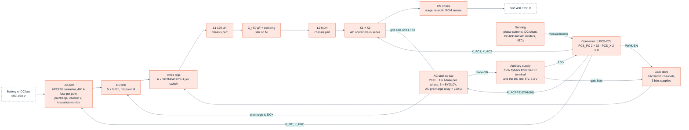

<!-- breadcrumb -->
[Home](../../README.md) › [Documentation](../README.md) › PCS-P125

# 🗺️ PCS-P125 — the three-phase battery inverter

> The DC-to-AC product of the family: its requirement, the topology decision and the trade study that set its design point, the numbers behind it, the drawn boards of the three-wire and four-wire builds, the start-up from the grid, the declarations, the block diagram, what it reuses from the PV module, its cost at catalogue prices and at 5,000 units, the control study and the firmware specification, the corrections of the independent review, and its risks.

---

> [!IMPORTANT]
> **Both builds drawn, control studied by calculation, independent review answered.** The three-wire module PCS-P125
> (power board PCS-PWR rev A0 + control board PCS-CTL rev A0 in its three-wire assembly) and the four-wire module
> PCS-P125-4W (PCS-PWR-4W rev A0 + the four-wire assembly of PCS-CTL) pass every build check
> ([D-061](../requirements/DECISIONS.md) to [D-064](../requirements/DECISIONS.md), [D-074](../requirements/DECISIONS.md));
> both start from the grid through an AC tap and an AC precharge, and the control board carries Ethernet, a recorder
> flash and discrete I/O ([D-075](../requirements/DECISIONS.md)). Their module BOMs cost **1,589 / 1,349 USD** (three-wire)
> and **1,926 / 1,636 USD** (four-wire, a lower bound: two lines unpriced) at catalogue prices / 5,000 units, estimates
> where no price exists ([bom/COST.md](../../bom/COST.md)), above the design study's 1,431 / 1,149 and 1,731 / 1,392 USD
> for the reasons of [D-063](../requirements/DECISIONS.md). The control loops are designed on sampled averaged models,
> extended on 2026-10-06 to the off-grid accuracy, the ride-through limiter and the neutral leg
> ([D-066](../requirements/DECISIONS.md), [D-077](../requirements/DECISIONS.md)) — no switched model, no measured THD.
> The independent re-check R2 of 2026-10-07 (14 findings, [review_r2.csv](../../gen/data/review_r2.csv)) was answered by
> [D-078](../requirements/DECISIONS.md) (the protection chain at its real gates-off current, RG,off 8.75 Ω, the
> CMPSS backup lowered, the L1 trajectory, an absolute RDS(on) rule, one coil contract, the residual-current
> contract) and [D-079](../requirements/DECISIONS.md) (tolerance regression, bounded off-grid transients, ride-through
> without derating, coupled four-wire cases, the AC start as an executed state machine) —
> [below](#after-the-review), at zero BOM cost. The re-check R3 of that response (commit `615e4b5`, five findings,
> [review_r3.csv](../../gen/data/review_r3.csv)) was answered the same day by [D-080](../requirements/DECISIONS.md) —
> the synchronised close one coil at a time, both trip layers replayed on the four-wire short, the PCS-to-PV
> over-voltage trajectory coupled, two SiC module grades with full tier tables, the off-grid envelope declared as
> requirement AC-04 — again at zero BOM cost ([below](#the-re-check-r3-2026-10-07)). The economical re-check R4 of
> commit `845131d` (twelve decision areas, [review_r4.csv](../../gen/data/review_r4.csv)) was answered by
> [D-081](../requirements/DECISIONS.md): the DESAT string re-rated to two 1,300 V diodes per channel (+0.96 / +1.28 USD
> per module at 5,000 units), the DC-bus window on a battery-less bus enforced with the cable modelled (750 V default,
> 782 V clamp, 791 V island permissive), the off-grid envelope stated as a declared output capability with a release
> sequence, the cold rating set to full operation from −10 °C inlet, grade B's rating stated (124.57 kW at 60 °C) and the
> magnetics RFQ index ([below](#the-re-check-r4-2026-10-07)).
> No part is quoted and nothing is built or measured. The power stage was decided on 2026-10-05 by [D-053](../requirements/DECISIONS.md)
> from the design study [sim/out/pcs_design/report.md](../../sim/out/pcs_design/report.md) (`sim/pcs_design.py`); an
> independent cross-check against Wolfspeed's 25 kW T-type and 200 kW two-level reference designs
> ([report](../../sim/out/pcs_design/crosscheck_wolfspeed.md), [D-057](../requirements/DECISIONS.md)) **confirmed the
> two-level stage on robustness**, and a trade study with the filter inductors actually designed
> ([tradeoff.md](../../sim/out/pcs_design/tradeoff.md), [D-060](../requirements/DECISIONS.md), which corrects
> [D-059](../requirements/DECISIONS.md)) **confirmed it on cost** and set the design point at 32 kHz.

> [!NOTE]
> **The design point was re-optimised with real inductor designs ([D-060](../requirements/DECISIONS.md)).** The
> efficiency, junction temperatures and the study's cost on this page are the figures of that trade study; they replace
> those of D-053, D-057 and D-059 (whose 24 kHz point rested on a fault in the magnetics tool, see
> [06 · Magnetics](06-magnetics.md)). The boards' own figures follow in [The drawn boards](#-the-drawn-boards). All of
> them are calculated; none is quoted or measured. The exact frequency and inductance are not a firm result, the
> two-level choice is. Still open: powder-core inductors were not searched (the filter is 39 % of the bill of
> materials), L1 runs at its 140 °C hot-spot limit at 60 °C inlet, THDi is an estimate from the linear control study
> (no switched simulation), and no price is quoted.

## 📐 Requirement

The owner asked for "dc to ac" as well as DC/DC and named no rating; PCS-P125 is the roadmap's highest-priority PCS,
measured against Megarevo PMA0125 ([REQUIREMENTS.md §8](../requirements/REQUIREMENTS.md), AC-02 — the rating is an
assumption, [D-046](../requirements/DECISIONS.md)).

| Item | Value |
|---|---|
| Power | 125 kW rated, 137 kW maximum continuous DC, 150 kVA maximum |
| DC side | 590–950 V (full load 600–900 V; 650–950 V for three-wire + N), ±250 A maximum — full load from 600 V is not reachable over 400 V ±15 % ([operating envelope](#after-the-review)) |
| AC side | 400 / 230 V, 180 A rated, 216 A maximum; PF −1…+1; THDi < 3 % |
| Modes | grid-following and off-grid / grid-forming; 100 % unbalanced load in the four-wire version |
| Overload | 110 % continuous, 120 % for 2 min |
| Efficiency | maximum 98.5 % (Megarevo's published figure) |
| Cooling, ambient | forced air, −30…+60 °C, derating above 45 °C (the benchmark's); amended by delegation ([D-081](../requirements/DECISIONS.md)): full operation from −10 °C inlet, below it standby or the passive-cooling table ([cold start](03-power-stage.md#inverter-cold-start)) |
| Price benchmark | Megarevo's 228 kW, 1500 V string PCS sells for 1,500 USD (6.6 USD/kW) — selling price of a different product ([SRC-5, AC-03](../requirements/REQUIREMENTS.md)) |

## 🧭 The topology decision

The architecture ([ARCHITECTURE-PCS.md](../requirements/ARCHITECTURE-PCS.md), [D-047](../requirements/DECISIONS.md)) chose a
**three-level T-type with discrete 1200 V / 650 V IGBTs** at 16 kHz on a first-order screen, and left one risk open:
its outer IGBTs would block the full DC link at 0.79 of their rating against the 0.67 rule of the PV design. The design
study settled that risk on evidence and on cost, and **D-053 withdrew the T-type**. ARCHITECTURE-PCS.md now carries a
"superseded" note for its power stage, filter, DC link and cost; its ports, the single reinforced barrier and the
control-board variant still stand.

Chart: [figures_design.py](../assets/figures_design.py) from [pcs_spec.json](../../sim/out/pcs_design/pcs_spec.json)
`topology_screen` (screen scope: devices, pads, gate drive, LCL filter, DC link; calculated, prices mostly assumed factors).
Each candidate is shown at its screening frequency — the chosen one at 32 kHz (351 USD). The screen prices L1 by a rule
(10 + 6 USD/J) and its own frequency sweep (`fsw_sweep`) would pick 48 kHz (322 USD); the trade study below, with the
inductors actually designed, put the design point at 32 kHz.

| Why two-level 1700 V SiC (all calculated) | Two-level, 6 × SG2M040170HJ per switch | Three-level T-type, as in the architecture |
|---|---|---|
| Device voltage at 950 V DC / rating | ≤ 0.56 for every device | 0.79 on the outer devices |
| Cosmic-ray failure rate at 950 V, sea level (Semikron AN 17-003 data) | 0.16 FIT per unit | about 104 FIT per unit |
| Devices, gate-drive channels (three-wire) | 36, 6 | 42 in the architecture; **66 needed** once the hot VCE(sat) and super-linear Eon are used |
| Device loss at 125 kW, 900 V | — | 2,638 W in the study's model against the architecture's 1,676 W |
| DC-link midpoint at PF 0 | no midpoint control needed | ≈ 3.5 mF per half for any three-level stage; the architecture's 660 µF per half cannot hold it |
| Screen-scope cost at 5,000 units (USD) | 351 (32 kHz) | 571 (best three-level SiC, 32 kHz); 557 for the architecture's IGBT T-type sized correctly |
| What two-level costs instead | common-mode voltage 432 V peak against 235 V: Cf star tied to the DC midpoint and about 6 dB more CM attenuation; L1 stores twice the energy | — |

Sources: [pcs_design report (a), (d), (g)](../../sim/out/pcs_design/report.md), [D-053](../requirements/DECISIONS.md).
Chinese three-level modules (HIITIO and others) were screened too: none has a public price, the best-fitting part prints
no short-circuit data, and one module per phase overheats by 16–32 K in the overloads
([asia_modules.md](../../sim/data/asia_modules.md), [D-055](../requirements/DECISIONS.md)). A module must beat
38.7 USD per phase leg to displace the discretes.

**The trade study of [D-060](../requirements/DECISIONS.md)** ([tradeoff.md](../../sim/out/pcs_design/tradeoff.md)) re-ran
the choice with the filter inductors designed by the magnetics model instead of priced by a rule (the first study's
filter was 167 USD; designed for real it was 611 USD). It corrects the study of [D-059](../requirements/DECISIONS.md),
whose 24 kHz point rested on a fault in the magnetics tool ([06 · Magnetics](06-magnetics.md)). It compared more than
twenty candidates; the headline ones, calculated, at 5,000 units:

| Candidate | Devices | fsw (kHz) | L1 / Cf / L2 | Filter (USD, kg) | Peak / full-load efficiency (%) | USD at 5,000 units (catalogue) | Limits |
|---|---:|---:|---|---:|---|---:|---|
| **Two-level, 32 kHz, L1 120 µH — chosen** | 36 | 32 | 120 µH / 50 µF / 6 µH | 443, 39 | 98.99 / 98.30 | **1,131** (1,409) | all met |
| Two-level, 28 kHz, L1 111 µH — runner-up | 36 | 28 | 111 µH / 75 µF / 6 µH | 454, 40 | 99.01 / 98.34 | 1,142 (1,421) | all met |
| Two-level, 48 kHz | 42 | 48 | 65 µH / 30 µF / 6 µH | 437, 23 | 98.92 / 98.36 | 1,156 (1,438) | all met |
| Two-level, 24 kHz, L1 130 µH — the point of D-059 | 36 | 24 | 130 µH / 75 µF / 6 µH | 495, 45 | 99.05 / 98.38 | 1,182 (1,469) | all met |
| Two-level, 32 kHz, L1 97 µH — the D-053 design, corrected | 36 | 32 | 97 µH / 50 µF / 6 µH | 506, 48 | 98.98 / 98.30 | 1,194 (1,482) | all met |
| Two-level, 16 kHz | 36 | 16 | 194 µH / 75 µF / 15 µH | 594, 57 | 99.17 / 98.46 | 1,282 (1,589) | all met |
| SiC T-type, 1200 V outer devices | 72 | 32 | 49 µH / 50 µF / 6 µH | 439, 22 | 99.49 / 98.84 | 1,236 (1,599) | outer devices at 0.88 of rating at the 1,050 V trip (limit 0.85) |
| SiC T-type, 1700 V outer devices | 72 | 32 | 49 µH / 50 µF / 6 µH | 439, 22 | 99.46 / 98.64 | 1,279 (1,619) | all met |
| IGBT T-type, 16 kHz — the architecture's, corrected | 126 | 16 | 97 µH / 30 µF / 47 µH | 820, 50 | 99.07 / 98.37 | 1,790 (2,308) | outer devices at 0.89 of rating at the 1,050 V trip |

Source: [tradeoff.md](../../sim/out/pcs_design/tradeoff.md) (28 rows; the acceptance limits are listed there) and
[pcs_design report (h)](../../sim/out/pcs_design/report.md). Efficiency at 125 kW and 750 V; the filter column is the
whole filter. Every candidate has its inductors designed by `sim/magnetics.py` (gapped nanocrystalline and amorphous
C-cores only — no powder cores) against its own trip level; the T-type's switching transients were not simulated.

Two-level is 148 USD below the cheapest T-type that keeps the voltage rule, but only 11 USD below the next two-level
point, and the sweep's resolution is about ±20 USD: the exact frequency and inductance are therefore not a firm result —
the two-level choice is. Modulations with less common-mode voltage bring no saving (AZSPWM1 1,223 USD; NSPWM fails the
earth-leakage limit), and the trip level cannot be lowered: protection needs 425 A and the inductor must stay
unsaturated to 434 A, so ±450 A stays.

The decision also brings the PCS onto the PV module's parts: the same SiC device, the same gate-drive channel, the same
32 kHz and the same control board. A published precedent for a two-level stage on a high-voltage bus is in the library —
Wolfspeed's 200 kW inverter for a 1500 V bus on 2300 V modules
([CRD200DA23N-GMA](../../docs/reference-designs/wolfspeed/crd200da23n-gma/)); the full library is indexed in
[docs/LIBRARY.md](../LIBRARY.md).

## ⚡ Design study result

| Block | Design (calculated) |
|---|---|
| Power stage | two-level, three legs (four for the four-wire version), **6 × Sichain SG2M040170HJ per switch, 36 devices**, **32 kHz**; sinusoidal PWM where m ≤ 0.98, min-max zero sequence above |
| Gate drive | **6 channels** (8 four-wire): NSI6651ASC + current buffer per channel driving 6 gates; RG,on 8.75 Ω / RG,off 8.75 Ω per device (RG,off was 7.5 Ω until [D-078](../requirements/DECISIONS.md)); rails +18 / −3.5 V; one bias transformer per phase |
| LCL filter | **L1 120 µH** (amorphous C-core, aluminium foil, 11.6 kg and 169 W each), **Cf 50 µF** with its star tied to the DC midpoint, **L2 6 µH**; the filter is 443 USD and 39 kg, 543 W at 125 kW / 750 V; resonance 2.2–9.4 kHz over the grid range; PWM THDi < 0.1 % (the 3 % budget is the controller's) |
| DC link | 5 + 5 Faratronic C3D1U147 film capacitors in two series halves; > 100,000 h at 60 °C inlet |
| Efficiency | peak **98.98 %**; **98.29 %** at 125 kW / 750 V; 98.06 % at 900 V; worst full-load point 98.03 % (0.01 point below the D-060 figures, the slower turn-off of [D-078](../requirements/DECISIONS.md)) |
| Junction temperature | **124 °C** at 110 % load and 45 °C inlet; 146 °C at 60 °C; 162 °C after 1.2 × 216 A for 200 ms (175 °C rating) |
| Thermal | one earthed extrusion per leg, one Delta AFB1224SHE-F00 fan each |
| Protection | as on the PV module ([D-050](../requirements/DECISIONS.md)): DESAT + booster and UVLO, default-off pull-downs, external stop on the drivers' EN and the latch, dead-time stretch and negative-rail detector in every channel, PCS-CTL's comparators (±450 A phase windows, 1,050 V, over-temperature), latch and gating; DC-port polarity and precharge-ΔV interlocks, hold-off at 1,000 A and the over-current window. The controller's CMPSS, ADC limits and trip zone are the second layer — about 8 USD of discrete parts in total. Since [D-078](../requirements/DECISIONS.md) the chain is checked at its real gates-off current: 520.5 A, turn-off peak 1,437 V against 1,445 V ([after the review](#after-the-review)) |

Sources: [pcs_design report](../../sim/out/pcs_design/report.md) summary and sections (b)–(f) and (h);
[pcs_spec.json](../../sim/out/pcs_design/pcs_spec.json) `thermal_and_losses`, `inductors`, `handover`.

## 🧰 The drawn boards

The generators [gen/pcs_power.py](../../gen/pcs_power.py) and [gen/pcs_ctrl.py](../../gen/pcs_ctrl.py) draw both
builds ([D-061](../requirements/DECISIONS.md), [D-062](../requirements/DECISIONS.md), [D-064](../requirements/DECISIONS.md),
[D-074](../requirements/DECISIONS.md)): one power-board script builds PCS-PWR (three-wire) and PCS-PWR-4W (four-wire),
and one control board, PCS-CTL, is assembled two ways (BOM variants PCS-CTL-3W and PCS-CTL-4W). Every value is read at
build time from the design study (`pcs_spec.json`), the control study and the magnetics design files and asserted by the
board's own design check — calculated, nothing built or measured. The control board is a re-valued variant of the PV
control board; the two meet at `PCS_PC`, the PV contract pin for pin (2 × 32, so PV-CTL plugs in), plus a 2 × 8 header
`PCS_X` for the grid voltages, the residual-current sensor and the second AC contactor
([gen/interfaces.py](../../gen/interfaces.py)).

| Board | Revision | Sheets / parts / nets | What is on it |
|---|---|---|---|
| **PCS-PWR**, power board, three-wire ([report](../../hardware/PCS-PWR/outputs/PCS-PWR_report.json), [design check](../../hardware/PCS-PWR/outputs/PCS-PWR_design_check.txt)) | A0 | 27 / 1,708 / 768 | three two-level legs of 6 × SG2M040170HJ per switch on Al2O3 pads, with six gate-drive channels and a bias supply per phase; the split film DC link (5 + 5 × C3D1U147, bleeders 4 × 93.1 kΩ per half, dividers); the lean DC port scaled to 250 A (HFE82V-300C contactor, 400 A fuse per pole, precharge, varistor network, insulation monitor, polarity and precharge interlocks, hold-off comparator); the Cf bank and damping branch; two 3-pole AC contactors in series, the AC surge network and the residual-current sensor (a quotation row); phase currents by three Sinomags STK-250HO/4, grid-voltage and DC-link sensing; the 75 W auxiliary supply and the 5 V / 3.3 V rails; **the AC start-up sheet** (grid tap, AC precharge, [below](#-start-up-from-the-grid)). L1, L2 and the common-mode choke are chassis parts from the magnetics design files |
| **PCS-PWR-4W**, power board, four-wire ([report](../../hardware/PCS-PWR-4W/outputs/PCS-PWR-4W_report.json), [design check](../../hardware/PCS-PWR-4W/outputs/PCS-PWR-4W_design_check.txt)) | A0 | 31 / 2,110 / 930 | PCS-PWR plus the neutral leg (the same six-device switch, two gate-drive channels, its own bias phase, films, dampers, DESAT, heatsink section and NTC4), LN = the L1 part (NTC8), a fourth STK-250HO/4, the neutral filter set CfN + damper to the DC midpoint, the N-terminal divider VGN, 4-pole AC contactors (RFQ), a four-bar common-mode choke on the same two cores, the residual-current sensor around three phases and N (RFQ), a 250 A N terminal, a varistor + Y1 from N to PE, bleeders 4 × 88.7 kΩ per half and the 200 Ω DC precharge ([details](#-the-four-wire-build-pcs-p125-4w)) |
| **PCS-CTL**, control board, both assemblies ([report](../../hardware/PCS-CTL/outputs/PCS-CTL_report.json), [design check](../../hardware/PCS-CTL/outputs/PCS-CTL_design_check.txt)) | A0 | 9 / 339 / 241 | the PV control board re-valued: F280039C on DC−; the trip latch with its hardware windows (phase current +455.7 / −454.9 A nominal, 426.0–485.5 A worst case for the frozen 3.2 mV/A sensor; DC-link over-voltage 1,013 V nominal, 978–1,048 V; lower-half over-voltage 538 V nominal, 508–569 V; heatsink and L1 over-temperature, open probe, heartbeat, external stop); the latch gating of the PWM lines, the DC contactor (healthy or hold), both AC contactors and the AC precharge relay (healthy only); barrier B1 with CAN, RS-485 and the Ethernet UART / battery-fault channel; **the Ethernet bridge fitted** (CH9121T, RJ45), the recorder flash, the chainable stop, ready permissive, DI1 and status relay ([D-075](../requirements/DECISIONS.md), [05 · Control](05-control-and-firmware.md#-ports-recorder-and-upgrade--control-board-rev-a2)); the SELV supply for the fans; the `PCS_X` signals into the ADC. The four-wire assembly fits the neutral-leg window and NTC comparators (U406 / U407), which the three-wire assembly leaves out |

Blocks of PCS-PWR from [gen/pcs_power.py](../../gen/pcs_power.py) (stages 1–7 of its header; PCS-PWR-4W adds the
neutral leg of its stage "4W"). Everything is live, referenced to DC−; the control board's barrier B1 and the SELV side
are on PCS-CTL.

**Gate drive for six paralleled devices.** The preset `6 × SG2M040170HJ` of [gen/gdrv.py](../../gen/gdrv.py), as drawn
(calculated):

| Item | As drawn |
|---|---|
| Gate resistors | 8.75 Ω on and **8.75 Ω off** per device (off was 7.5 Ω until [D-078](../requirements/DECISIONS.md)), plus a 0.5 Ω Kelvin-source resistor per device; 10 kΩ + 1 nF gate–source at the pins; 7.2 A source and 0.8 A sink per channel at the NSI6651 (limit 10 A) |
| Turn-off | through two PNP followers (2 × ZXTP25040DFH, 5.9 A each against 9 A peak); the driver sinks 0.78 A of base current; six gates off in 156 ns |
| Dead-time stretch | 3.65 kΩ / 100 pF on the SN74LVC1G17: 185–510 ns at the gates, above the larger of turn-off time + 20 ns (176 ns) and the clamp engagement of six gates (149 ns); a firmware dead band below about 433 ns is stretched, so the study's 300 ns cannot be guaranteed |
| Desaturation | **2 × Vishay BYG23T-M3/TR, 1,300 V each** ([D-081](../requirements/DECISIONS.md), review R4 E01; 2 × US1MH from [D-067](../requirements/DECISIONS.md) until then, three before): each diode alone blocks the 1,130 V static envelope of an off switch (× 1.15; × 1.13 over the 1,150 V design value), the capacitive share of the turn-off peak ≤ 867 V per diode ([the argument](04-protection-and-safety.md#desat-string-rating)); trips at VDS 6.41–9.37 V after a 276–861 ns blanking (6.71 V lowest with the string at ≥ 45 °C; the window did not move with the new diodes); at the 200 ms overload peak (66.2 A per device) the margin is 1.07 at the predicted 162 °C junction, 1.00 at the 175 °C rating and 1.56 from a −30 °C inlet; VDS is 6.30 V at the ±450 A trip, below the band, so DESAT stays the layer above the window. A switch of six 52 mΩ parts would reach 9.68 V at 198 °C: hence the absolute RDS(on) rule ([below](#after-the-review)) |
| Short circuit | a hard short is detected after ≤ 861 ns; the driver's DESAT-to-output delay (≤ 360 ns, with the deglitch inside it) fires the booster (22 Ω per device), and the gates are off in 38 ns more: **0.40 µs** from detection to off against a 1.0 µs requirement, 1.26 µs from the start of the short; overshoot 1,050 V + 20 nH × 310 A / 38 ns = **1,212 V** against 0.85 × 1,700 V = **1,445 V**. Acceptance (release block, risk C2): energy-equivalent full-current time 1.02 µs, fault energy 0.40 J per device at 1050 V × 376 A (assumed) — the maker must confirm tSC ≥ 2.03 µs and ESC ≥ 0.80 J; not on file |
| Trip turn-off | at the window trip's gates-off current, 520.5 A at 1,050 V: **1,437 V** against the same 1,445 V (1,438 V at the over-voltage corner; the deck admits 533.6 A); 1,394 V at the 450 A window nominal; dv/dt 58 V/ns against a CMTI of 150 V/ns ([D-078](../requirements/DECISIONS.md)) |

Sources: the gate-drive, dead-time and DESAT lines of the [PCS-PWR design check](../../hardware/PCS-PWR/outputs/PCS-PWR_design_check.txt)
and the `6 × SG2M040170HJ` preset in the [GDRV-HB design check](../../hardware/GDRV-HB/outputs/GDRV-HB_design_check.txt).
The 2.0 µs withstand used for the timing is an assumption: Sichain publishes none.

**Controller budget** (F280039C, 100 pins; [PCS-CTL design check](../../hardware/PCS-CTL/outputs/PCS-CTL_design_check.txt),
[pin plan](../../gen/data/pcs_ctrl_pin_plan.csv)):

| Resource | Used | Note |
|---|---|---|
| Analog pins | 21 of 23 (three-wire), 22 of 23 (four-wire) | the 24 (28) signals: the eight temperature inputs share one pin through a TMUX1208 multiplexer, which is in no trip path because the hardware over-temperature comparators sit on the sensor nets; the four-wire build adds VGN on pin 21, one pin stays spare |
| PWM outputs | 6 of 16 (8 four-wire) + PWM16 | PWM1–6 = ePWM1–3 A/B, high-resolution; the neutral leg PWM7/8 on GPIO6/7 (ePWM4 A/B, already routed); PWM16 = K_ACPRE, the AC precharge relay command of both builds |
| GPIO | **55 of 55** | including the crystal and the cJTAG pins; the Ethernet UART (GPIO56/57), the recorder flash (GPIO18/54/55, CS GPIO37), the fan tachometers (GPIO35/34), the battery-fault input (GPIO52) and PRE_N (GPIO17) — no spare pin (risk E9) |
| ADC load | 25.2 conversions per 31.25 µs = 15 % | the control study's sampling plan, read by the PCS-CTL build: VA / VB every 7.8 µs, last loop input 1.67 µs after the trigger |
| Control ISR at 64 kHz | 4.8–5.8 µs = 31–37 % of 15.6 µs (three-wire, grid following to grid forming with the DC-link loop); 7.3 µs = 46.7 % in the four-wire row of the control study | operation count × an assumed 2.5 cycles per operation at 120 MHz ([pcs_control report §9](../../sim/out/pcs_control/report.md)); not timed on the target |

D-062's count of 24 of 25 ADC channels is corrected: the 100-pin package has 23 analog pins, because the data sheet counts
two channels twice ([D-064](../requirements/DECISIONS.md)). One pin plan serves both builds (the routing does not differ);
its four-wire view is [pcs_ctrl_pin_plan_4w.csv](../../gen/data/pcs_ctrl_pin_plan_4w.csv), and the four-wire build needed
no GPIO (55 of 55 before and after).

**Cost of the drawn boards against the study** ([bom/COST.md](../../bom/COST.md), modules PCS-P125 and PCS-P125-4W from
[bom/PCS-P125_module_BOM.csv](../../bom/PCS-P125_module_BOM.csv) and [bom/PCS-P125-4W_module_BOM.csv](../../bom/PCS-P125-4W_module_BOM.csv)):

| | Catalogue (USD) | 5,000 units (USD) | Per kW at 5,000 (USD/kW) |
|---|---:|---:|---:|
| Drawn boards, three-wire module BOM (as of 2026-10-07, with the 1,300 V DESAT diodes of D-081) | **1,589** | **1,349** | 10.8 |
| Drawn boards, four-wire module BOM (as of 2026-10-07; two lines unpriced) | **1,926** | **1,636** | 13.1 |
| Three-wire drawn boards on 2026-10-05, before the AC start-up path and the control-board additions | 1,557 | 1,322 | 10.6 |
| Three-wire drawn boards when first costed ([D-063](../requirements/DECISIONS.md)) | 1,521 | 1,292 | 10.3 |
| Design study, three-wire / four-wire (`pcs_spec.json`) | 1,431 / 1,731 | 1,149 / 1,392 | 9.2 / 11.1 |

Catalogue / 5,000 units, estimates where no price exists ([bom/COST.md](../../bom/COST.md)). The three-wire rise of
2026-10-06 is the AC start-up path (24.80 / 20.57 USD) and the control board's Ethernet bridge, flash, isolator and relay
([D-074](../requirements/DECISIONS.md), [D-075](../requirements/DECISIONS.md)); the rise of 2026-10-05 was the live LCSC
price of the SG2M040170HJ (5.07 USD at 90+ instead of the 4.07 USD estimate, × 36, [D-069](../requirements/DECISIONS.md))
plus the frozen phase-current sensor, less the six DESAT diodes removed by [D-067](../requirements/DECISIONS.md). The
four-wire module's unpriced lines are two TLV9024 comparator lines and the 200 Ω precharge resistor (RFQ).

The drawn boards cost more than a study's allowances, for three reasons ([D-063](../requirements/DECISIONS.md)):

1. **+39 USD for 48 press-fit studs** — the study allowed 13 USD for studs, harness and standoffs together.
2. **+71 USD of circuitry** the study's per-line allowances did not cover: the full six-gate drive channels, the
   5 V / 3.3 V converters, the DC port's sensing and interlocks, and the AC voltage buffers.
3. **About 50 USD more at 5,000 units**, because the cost model applies its own volume factors to estimated lines (0.85
   on the inductors where the study used 0.81).

When first costed, the filter, ports, devices, DC link, heatsinks and control board agreed with the study within about
5 USD each; the devices now carry the live price. 77 % of the catalogue total is engineering estimate and about 9 % of
the 5,000-unit figure rests on published prices; the lines the line pricer could not price (inductors, film bank, fuses,
contactors, the residual-current sensor, heatsinks) are entered from the study's costed list as labelled estimates or
request-for-quotation rows, and one line (TLV9024PWR) stays unpriced (three in the four-wire BOM). Against the benchmark
the three-wire 5,000-unit figure is about 2.0 × the current-adjusted benchmark BOM of about 690 USD of ARCHITECTURE-PCS §12
and 1.8 × the 744 USD `gen/cost.py` derives from the DC-port current; the four-wire figure is about 2.4 × / 2.2 ×
(our arithmetic; [07 · Sourcing and cost](07-sourcing-and-cost.md#-the-costs-in-one-table)).

## 🧭 Block diagram

```mermaid
%%{init: {"theme": "base", "themeVariables": {"primaryColor": "#EEF3F7", "primaryBorderColor": "#0B1F33", "primaryTextColor": "#0B1F33", "lineColor": "#5B6B7A", "secondaryColor": "#D9F2EF", "tertiaryColor": "#FFF4D6", "fontFamily": "Inter, Helvetica, Arial, sans-serif"}}}%%
flowchart LR
    BAT["Battery or DC bus<br/>590–950 V"]:::ext --> DCP["DC port<br/>aR fuses 400 A class, HFE82V,<br/>precharge, varistor Y, IMD"]:::live
    DCP --> LINK["DC link<br/>5 + 5 film, midpoint M"]:::live
    LINK --> BR["Two-level bridge, 32 kHz<br/>6 × SG2M040170HJ per switch"]:::live
    BR --> L1["L1 120 µH"]:::live
    L1 --> CF["C_f 50 µF<br/>star on the DC midpoint"]:::live
    CF --> L2["L2 6 µH"]:::live
    L2 --> ACP["AC port<br/>2 contactors in series, relay check,<br/>type II SPD, RCM, CM cores"]:::live
    ACP --> GRID["Grid 400 / 230 V"]:::ext
    N4["Fourth leg (PCS-PWR-4W)<br/>L_N, C_fN to M, 4-pole contactors,<br/>N terminal"]:::live --> ACP
    LINK --> N4
    TAP["AC start-up tap<br/>fuse + 6 diodes per board,<br/>AC precharge to DC+"]:::live
    ACP -- "grid side" --- TAP
    TAP -- "precharge" --> LINK
    TAP -- "diode-OR" --> AUX
    CTL["PCS-CTL, a PV-CTL variant<br/>F280039C on DC-"]:::live --> BR
    AUX["75 W flyback AUX-75 rev A3<br/>from the DC terminal, the DC link<br/>and the grid tap"]:::live --> CTL
    CTL --- B1["Barrier B1<br/>CAN, RS-485, Ethernet,<br/>stop chain, DI1, relay, fans"]:::selv
    classDef live fill:#FDE7E0,stroke:#E4572E,color:#0B1F33
    classDef selv fill:#D9F2EF,stroke:#00A99D,color:#0B1F33
    classDef ext fill:#FFFFFF,stroke:#5B6B7A,stroke-dasharray:4 3
```

Ports and barrier from [ARCHITECTURE-PCS.md §2–§5](../requirements/ARCHITECTURE-PCS.md) (still valid); bridge, filter and
DC link from the study; the fourth leg, the tap and the barrier's new channels from [D-074](../requirements/DECISIONS.md) and
[D-075](../requirements/DECISIONS.md). In grid-connected operation the battery poles sit at about ±VDC/2 against
earth: the rack's insulation and its monitor must be rated for that.

## ⚡ The four-wire build (PCS-P125-4W)

The competitor sells one module for 3W+PE or 3W+N+PE; its user manual shows the N terminal on the DC-link midpoint — a
split-capacitor neutral ([MANUAL-NOTES.md](../reference-designs/megarevo/pma/MANUAL-NOTES.md), fig. 3-8;
[D-073](../requirements/DECISIONS.md)). PCS-P125-4W = PCS-PWR-4W + PCS-CTL-4W, drawn on 2026-10-06
([D-074](../requirements/DECISIONS.md)); every build check passes. Everything below is calculated
([PCS-PWR-4W design check](../../hardware/PCS-PWR-4W/outputs/PCS-PWR-4W_design_check.txt),
[pcs_design report (i)](../../sim/out/pcs_design/report.md)).

**Why a fourth leg and not a midpoint neutral.** On our 409.4 µF film DC link the neutral current charges both halves in
parallel (1,400 µF at M): at the rated 180 A it puts **579 V peak** of 50 Hz ripple on the 375 V of each half at 750 V
(695 V at the 2-minute 216 A), against the 560 V per-half trip — which is reached at 58 A rms of neutral current.
Holding the ripple to 5 % of Vdc/2 (18.8 V, ASSUMED) needs **43.2 mF** at M: about 368 electrolytics
(Samyoung TDC400V470M35 class), **2,337 / 1,376 USD** and 2,000 h at 105 °C — against **300 / 243 USD** for the fourth
leg (catalogue / 5,000 units, design study). The fourth leg also gives the wider DC window below.

| Added on PCS-PWR-4W and in the four-wire assembly of PCS-CTL | As drawn |
|---|---|
| Neutral leg | the same switch of 6 × SG2M040170HJ, two gate-drive channels with DESAT and Kelvin resistors, its own bias phase (on +5V with leg a: +5V at 61 %, +5V_GD at 64 %), local films and dampers, its own heatsink section with NTC4 |
| Neutral filter | LN = the L1 part with its NTC8 (no new magnetic); CfN = 2 × 25 µF + the Rd / Cd damper from the neutral filter node to the DC midpoint. The Cf star stays on M: a star on N would put hundreds of volts of 32 kHz common mode between the DC side and N / earth and need a new magnetic and common-mode design. LN–CfN resonate at 2,055 Hz |
| Sensing | a fourth STK-250HO/4 (IL4, IL4R) and the N-terminal divider VGN (relay test of the N pole, the N-leg loop, the DC-component regulator) |
| AC port | 4-pole AC contactors K1 + K2 in series (RFQ: the N pole switched with the phases); a four-bar common-mode choke through the same two cores; the type-B residual-current sensor around L1–L3 and N (RFQ); a 250 A N terminal; a TVT25751 varistor and a Y1 capacitor from N to PE |
| DC link | bleeders 4 × 88.7 kΩ per half: 60 V after 14.8 min worst case (label 15 min); the DC precharge at **200 Ω** of the same RFQ family, because with 220 Ω the time constant (109 ms) would exceed the resistor's 105 ms rating point: 260 J at τ 99 ms against 280 J, shorted bank 807 J in 0.139 s against 900 J in 0.15 s, 5.53 A peak against the relay's 25 A ([D-076](../requirements/DECISIONS.md)) |
| Control board | the neutral-leg window and NTC comparators fitted (U406 / U407); PWM7 / PWM8 on GPIO6 / 7 (ePWM4 A/B, already routed — no GPIO given up, 55 of 55); VGN on analog pin 21, one pin spare; the trip table and latch evaluated for four phases |
| Cooling | four heatsink sections and four fans on the control board's three fan headers — fans 3 and 4 on header 3 through a Y-harness; fan 4's tachometer is not read (a stopped fan 4 shows as NTC4 rising and trips the heatsink comparator) |

**DC window, two modulation modes** (operating-map model: 5 % loop headroom and dead-time compensation, both assumed;
rated current 180 A, 50 Hz):

| Grid line-to-neutral | 2√2 VLN | Mode A — neutral leg at 50 %: connect / rated current (worst PF) | Mode B — zero sequence on all four legs: connect / rated current |
|---|---:|---:|---:|
| 196.3 V (−15 %) | 555 V | 615 / 638 V | 530 / 550 V |
| 230.9 V (nominal) | 653 V | **724 / 746 V** | **624 / 643 V** |
| 254.0 V (+10 %) | 719 V | 796 / 819 V | 687 / 706 V |
| 265.6 V (+15 %) | 751 V | 833 / 855 V | 718 / 737 V |

The firmware baseline is mode A (sinusoidal phase legs, no 150 Hz common-mode voltage to N and earth) wherever it fits,
mode B below it down to the three-wire window. So the four-wire build connects from **624 V**, where a split-capacitor
neutral stops at 2√2 VLN — the competitor publishes 650 / 680 V (operating / full load), which equals 2√2 ×
230 V with no headroom (calculated). In mode B the DC side carries the 150 Hz zero sequence to N and earth, as the
three-wire build does (installation limit on the battery's capacitance to earth, risk F1).

**Neutral loading.** "100 % unbalanced load" is one phase at its own tier — 41.6 / 45.7 / 49.9 kW per phase at 230 V
rated / continuous / 2 min — with the neutral current equal to the phase current; half the module's power on one phase
would be 271 A, above every tier, and is not claimed. Per-phase P / Q set points with the three currents in phase could
reach 3 × IN; the firmware limits the neutral current to the leg's tiers.

| Neutral leg, mode A, own heatsink section | 198 A, 750 V, 45 °C | 198 A, 900 V, 45 °C | 216 A, 750 V, 45 °C | 216 A, 900 V, 45 °C | 198 A, 750 V, 60 °C | 198 A, 900 V, 60 °C |
|---|---:|---:|---:|---:|---:|---:|
| Loss (W) | 576 | 629 | 715 | 781 | 628 | 684 |
| Junction (°C), limit 150 / 165 (2 min) | 115 | 121 | 132 | 140 | 137 | 143 |

The DC-link capacitors see ≤ 26.2 A against their 28.1 A (three-wire 25.8 A); up to 47 A rms of low-frequency current
goes to the battery at 750 V (an installation item); the DC midpoint carries 0.26 A rms, so no balancing is needed.

**Half-wave loads** (off-grid): up to **280 A peak per phase** (89 A DC, 140 A rms); the neutral inductor then peaks at
311 A, the L1 part's continuous limit; the output's DC component is held to ≤ 1.15 V (0.5 % Un) by a firmware
regulator, against a calibrated divider mismatch of 0.56 V; the neutral leg needs a DC regulator of its own, because an
89 A DC current would otherwise shift N by 296 V ([D-077](../requirements/DECISIONS.md)).

**Coupled cases** (review finding R2-13, [D-079](../requirements/DECISIONS.md); a per-phase averaged model, simulated,
[pcs_control report §9c](../../sim/out/pcs_control/report.md)): a 100 % unbalanced load step keeps the phase-to-N
amplitudes at 0.966–1.036 pu; after a half-wave load step the DC component is back under 1.15 V after 469 ms, with the
N inductor at 319 A transiently against its 311 A continuous figure, far below the 578 A knee; the GFL ↔ GFM
transitions with unbalance stay inside the window. Not in these runs: switching, mode B, droop, the PLL and the
per-phase virtual reactance.

**The bolted line-to-neutral short** (review finding R3-02, [D-080](../requirements/DECISIONS.md); the same model with
the ripple rebuilt, [pcs_control report §9c-2](../../sim/out/pcs_control/report.md)). D-079 had screened its 425 A first
peak against the window's 426 A edge only — inside, thin — while the CMPSS backup's low edge is 423.9 A. Replayed through
both layers on their own signals, the D-079 firmware trips the backup at the low plant corner (4 of 20 threshold, sensor
and ripple corners, 166 µs after the short). Adopted: a 270 A clamp for a 5 ms onset window on the shorted phase and the
N leg, then the normal 378 A — first-millisecond peaks 344 / 351 A, hold 378.7 A, largest sensed peak 410.6 A, **13.3 A**
below the backup's edge, no layer trips at any studied corner, the firmware's limit timer trips at 200 ms, the healthy
phases stay at 0.986–1.010 pu; the unbalanced and half-wave steps are unchanged. Holding 270 A for the whole ride was
rejected: it leaves less fault current for a downstream breaker and clips half-wave loads. **Declared outcome:** a bolted
output short is ridden for the firmware's 200 ms at the 200 ms tier, then the firmware trip → FAULT; a unit outside the
modelled bands trips in hardware instead — latched, FAULT, no automatic clear after an over-current trip, a restart into
a persisting short trips again, the third trip of a class within 10 min locks out (ASSUMED). The 13.3 A rests on the
averaged model; a switched model and the bench are the gate.

**Still open on the four-wire build:** the carrier ripple into a stiff grid reaches 0.63 % of the rated peak at 950 V
(three-wire 0.12 %, target 0.3 %; 0.04 % at SCR 50) — a pre-compliance item, more L2 or the neutral leg's modulation;
the L-N surge path is two varistors in series, 2 × 1,240 V = 2,480 V at 150 A against the 4 kV rated impulse — a 3+1
arrangement with an N-PE spark gap would halve it, but no GDT data sheet is on file; the 4-pole contactors, the
four-conductor residual-current sensor, the four-bar choke and the 200 Ω resistor are RFQ / CUSTOM parts without data
sheets; the auxiliary's live winding has 3.8 W of reserve at stacked maxima (26.2 of 30 W). **Cost:** 1,926 / 1,636 USD
(catalogue / 5,000 units), 337 / 287 USD above the three-wire module, a lower bound with two lines unpriced.

## 🛡️ Start-up from the grid

Both builds, since [D-074](../requirements/DECISIONS.md) (risk F8 closed). Before, the auxiliary supply started from the
battery terminal or the DC link only, so the inverter could not start with the DC side dead. Calculated
([PCS-PWR design check](../../hardware/PCS-PWR/outputs/PCS-PWR_design_check.txt) "AC START-UP TAP", "AC PRECHARGE",
"GRID-START SEQUENCE"; [pcs_spec.json](../../sim/out/pcs_design/pcs_spec.json) `ac_start`).

| Part of the path | As drawn |
|---|---|
| Grid tap | per phase from the grid side of K1 / K2 (behind the common-mode choke and the AC surge network, so it works with the contactors open): 20 Ω AC10 wirewound (inrush, surge and fault limit) + Conquer **ABB-A 1.60** fuse (1.6 A, 500 V AC, 200 A breaking; catalogue PDF p. 30) into **6 × BYG10Y** (1600 V avalanche, kept over a cheaper diode for its avalanche rating), diode-OR into the auxiliary input: 416–651 V DC at 340–460 V AC |
| Its fault cases | auxiliary inrush 17.0 A, 1.7 % of the fuse's melting I²t; a shorted tap diode draws 12.0 A rms, the fuse melts in 16 ms with 45 J per 20 Ω resistor against its 52 J pulse rating; diode reverse voltage ≤ 0.72 × VRRM |
| Insulation | live domain: functional inside it, basic OVC III to PE (clearance 3.0 / 3.5 / 3.9 mm at 2,000 / 3,000 / 4,000 m); the control board's reinforced barrier B1 is unchanged |
| AC precharge | Omron G7L-2A-X relay (used inside its DC rating, two poles in series) + the 220 Ω RPRE_AL from the tap's + rail to DC+, on PWM16 = K_ACPRE (latch-gated): see the table |
| Cost | 24.80 / 20.57 USD per module (catalogue / 5,000 units) |

| Build · grid | Peak current | Energy in 220 Ω (rating 280 J) | Fuse I²t (share of melting) | Within 10 V after |
|---|---:|---:|---:|---:|
| three-wire · 340 / 400 / 460 V | 1.94 / 2.28 / 2.62 A | 40 / 56 / 74 J | 6 / 8 / 10 % | 0.86 / 0.94 / 1.02 s |
| four-wire · 340 / 400 / 460 V | 1.94 / 2.28 / 2.62 A | 42 / 59 / 78 J | 6 / 8 / 11 % | 0.91 / 0.99 / 1.07 s |

A shorted bank (460 V) puts 227 J into the resistor until the abort at 0.17 s, against the rating of 900 J in 0.15 s
(ASSUMED milder for the RFQ part). An AC-side bypass of the contactors was not used: the relay has no AC rating, the
Cf bank's reactive current would heat the resistors, and a welded relay would bypass the two-contactor
disconnect.

**Grid-start sequence** (firmware; grid present, DC side dead — battery absent, empty or its own contactors open). Since
[D-079](../requirements/DECISIONS.md) (review finding R2-14) this is the executed, fault-injected state machine of the
control study — 35 fault cases, no safety breach with the five repairs H1–H5; with the synchronised-close substates of
[D-080](../requirements/DECISIONS.md) the machine has 19 states and 15 invariants, checked over all 646 state-event pairs
([pcs_control report §9d](../../sim/out/pcs_control/report.md); simulated against a plant at the slow-task rate, relay
timings ASSUMED):

1. the tap feeds the auxiliary supply; live 24 V, 5 V and 3.3 V come up; the controller boots with the latch tripped and
   reads the attempt count, its spacing and any lock-out from the recorder flash, before every attempt (**H5**: a
   brown-out cannot reset the retry limit);
2. AC_TEST: self-test of the trip paths and the welded-precharge check with everything open and the converter passive —
   the link must stay below 50 V or, at a retry while the link is still charged from the earlier attempt, decay at the
   bleeder rate and sit below the tap peak (**H2**); no relay test on the dead link;
3. AC_PRECHARGE: K_ACPRE closes (the attempt is counted in the flash) and the link charges to the line-to-line peak less
   two diode drops; abort on the shorted-bank or timeout rule;
4. AC_CLOSE_K2 / AC_CLOSE_K1: K_ACPRE opens (the link holds; bleeder time constant about 5 min), the relay test runs onto
   the precharged link — K2 alone, then K1 alone, the converter passive (**H1**) — and K2, then K1 close, one coil at a
   time, each commanded only with Vdc ≥ 0.95 × √2 × VLL measured, the grid inside ±10 % at that
   command (**H3**) and the DC contactor open;
5. RECTIFY: the bridge starts as a rectifier on the DC-link loop and raises Vdc to the battery's terminal
   voltage (or 750 V without a battery);
6. the DC contactor closes directly, only with the battery at ≥ 1.05 × √2 × VLL measured and the link matched
   inside the hardware ΔV window (3.5–16.5 V); below that threshold no DC connection, standby on the grid and a report
   (**H4**: the old route through K_PRE closed onto a battery below the grid peak, an uncontrolled rectification);
7. normal operation; the auxiliary keeps both feeds (DC link and grid tap, diode-OR).

A stop during the AC start never passes through the controlled stop, which holds the DC contactor: before the bridge
runs everything opens; with the bridge running an own AC_STOP state brings the current to zero, opens K1 / K2 at zero
current and never commands the DC contactor. As first specified ([D-074](../requirements/DECISIONS.md)) the sequence
breached three safety checks in the executed cases — an AC close onto a link below the permissive, the DC contactor onto a
battery below the rectification threshold, more than three precharge attempts in 10 min — and locked out falsely after a
stuck contactor. Residuals (risk E11): DC_MATCH stays in the transition table though the repaired start never enters it;
the H2 numbers live in the executed code, not yet in the JSON; RECTIFY with a battery has no DC-match timeout; a grid sag
during the 100 ms pull-in is not among the 35 cases.

Interlocks: K_ACPRE only with K_B, K_PRE, K_A and K_AC2 open; K_ACPRE and the DC contactor mutually exclusive (no charging
of a live battery through 220 Ω); at most 3 attempts per start, ≥ 30 s apart, counted across controller resets, then
lock-out until a service reset. The live 24 V during the grid start peaks at 32.1 W (three-wire) / 34.2 W (four-wire) when
K1 pulls in, inside the 48 W one-second rating of the re-rated auxiliary ([D-076](../requirements/DECISIONS.md)), with the
AC coils at the one contract of [D-078](../requirements/DECISIONS.md) (20 W pull-in for ≤ 100 ms, 4 W hold).

**Grid-tie start with the DC side live** (review finding R3-01, [D-080](../requirements/DECISIONS.md); the executed state
machine, [pcs_control report §9e](../../sim/out/pcs_control/report.md), quoted in
[pcs_spec.json](../../sim/out/pcs_design/pcs_spec.json) `grid_tie_start`; relay timings ASSUMED). From the battery side
the inverter precharges the link, forms the voltage on Cf, synchronises and runs the relay test (each contactor
alone, the voltage across the open one); then it closes **one coil at a time**: SYNC → SYNC_CLOSE_K2 (K2 alone, settled
200 ms — the AC start's criterion) → SYNC_CLOSE_K1 → grid following (grid start) or grid forming (dead-bus start), with
SYNC's PWM and DC contactor kept throughout. As D-079 drew it, SYNC closed both contactors in one transition — 54.9 /
58.2 W of coil pull-in against the 48 W live peak — and the invariant "never both at once" exempted SYNC; now it holds
without exception, and the live 24 V peaks at 38.9 / 42.2 W (three- / four-wire).

| Close rule | As executed |
|---|---|
| Closing permissive | grid start: grid inside ±10 %, \|ΔV\| ≤ 5 %, \|Δθ\| ≤ 5°, \|Δf\| ≤ 0.1 Hz (ASSUMED), Vdc above the closing permissive; dead bus: VG < 10 % — at the K2 and the K1 command and every tick until the path forms; lost: back to SYNC, both coils released |
| Path check after K1 | grid start: a small active-power step in grid-connected grid forming, the measured P follows (ASSUMED method); dead bus: VG follows vC. Not formed: back to SYNC, a counted attempt |
| Faults | a contactor stuck open or not settled within 200 ms: a counted attempt (≤ 3 per start, ≥ 30 s apart, in the recorder flash), then LOCKOUT; dead bus with VG live on K2 alone and in phase with vC: K1 welded → LOCKOUT; a source appearing on a dead bus is never closed onto; a grid lost during a grid start never becomes a dead-bus close |
| Stop | in SYNC_CLOSE_K2 → IDLE (K1 open, no AC current); in SYNC_CLOSE_K1 → controlled stop (exchange to zero, then both open) |
| Checked | 646 state-event pairs (19 states × 34 events), every invariant incl. I12 (one coil at a time), I14 (the substates keep SYNC's PWM and DC contactor) and I15 (a lost permissive releases both coils); 24 fault runs over both starts — welded before / after the relay test, K2 welding, stuck K1 / K2, slow pull-in, grid lost (also for 5 s), a foreign source on a dead bus, a phase jump, a stop — no breach; as first specified the same runs breach three checks (two coils at once, closing outside the permissive, running without the path) |

> [!WARNING]
> **Two consequences are declared, not designed away.** With the grid present the tap ties DC− to the grid through its
> lower diodes, so the **insulation monitor's reading is valid only with the AC side de-energised** — the installation
> sequence and a firmware "not measurable" state cover it. And the DC link is fed from the AC side even with the battery
> disconnected: the enclosure carries the service label **"two sources — isolate AC and DC; wait 15 min"**.

## 📐 Declarations

Statements for the installer and the datasheet, calculated and labelled ([D-074](../requirements/DECISIONS.md),
[D-078](../requirements/DECISIONS.md), [D-079](../requirements/DECISIONS.md), [D-080](../requirements/DECISIONS.md),
[D-081](../requirements/DECISIONS.md);
[pcs_spec.json](../../sim/out/pcs_design/pcs_spec.json) `declarations`, PCS-PWR design check). The installation-facing
ones are also rows of [INSTALLATION.md](../requirements/INSTALLATION.md), each with the generated line it comes from:

| Declaration | Ours (calculated unless labelled) | Competitor (published) |
|---|---|---|
| kVA tiers at 400 V | 124.7 kVA rated (180 A), 137.2 kVA at 110 % continuous (198 A), 149.6 kVA for 2 min (216 A), 179.6 kVA for 200 ms (259.2 A) — grade A's tiers up to 45 °C inlet; above it, and for a grade-B module, the grade's table (row "Module grade"; grade B at 60 °C: 179.8 A continuous = 124.57 kW at PF 1) | 137 kVA continuous, 150 kVA maximum |
| AC short circuit | the circular limiter holds 367 A peak for ≤ 200 ms, then trips; faster rises reach the phase window and DESAT. A bolted leg short fed from a **stiff grid reaches 5,834 A rms and saturates L1 after 0.22 ms** (L1 keeps its inductance to 578 A at 100 °C; SCR 50: 3,543 A / 0.37 ms; SCR 5: 781 A / 1.66 ms): the upstream protection has under 2 ms of module-side current. **Installation requirement:** upstream protection ≥ 250 A (gG 250 A or an MCCB with an instantaneous release), breaking capacity ≥ the prospective current, a type-B RCD upstream where the code requires one; the contactors are disconnecting devices, their conditional short-circuit current an RFQ item | recommends a 250 A AC breaker for its 105 kW module; no prospective current, fuse type or earthing system stated |
| Airflow | 264 CFM three-wire / 352 CFM four-wire = 2.11 / 2.82 CFM per kW | ≥ 3.8 CFM per kW (manual's air-duct table, our arithmetic) |
| Frequency | the operating map holds at 50 and 60 Hz; PLL clamp ±5 Hz; trip windows are the grid code's (EN 50549-1 class, FROM MEMORY) | ±5 Hz (datasheet), ±2 Hz (manual) |
| DC stabilization precision | voltage RSS 0.74 % / worst-case sum 1.54 %; current RSS 0.95 % / 2.19 % — met by root-sum-square only | ±1 % voltage, ±2 % current |
| Off-grid load acceptance | resistive to rated, 110 % continuous, 120 % for 2 min; crest factor ≤ 2.04 at rated rms (CF 2.5: 147 A rms; CF 3.0: 122 A rms); direct-on-line motors with a 6 × start ≤ 36 A rated (20 kW); half-wave loads ≤ 280 A peak per phase (four-wire) | resistive below rated; RCD-type and VFD loads below 60 %; direct-on-line motors "ask the maker" |
| Environment | **−10…+60 °C at power** ([D-081](../requirements/DECISIONS.md); the fans are rated −10 °C), derating above 45 °C by module grade (at 60 °C grade A 198.0 / 216.0 / 242.9 A, grade B 179.8 / 192.6 / 192.6 A — continuous / 2 min / 200 ms; grade B's 179.8 A is 124.57 kW at PF 1 and 400 V); −30…−10 °C inlet: fans off, standby or the passive-cooling table only (three-wire 20 / 15 / 8 kVA at 600 V DC and −30 / −20 / −10 °C, nothing above 700 V DC; ESTIMATE) — a cold-rated fan (RFQ) is the way back to −30 °C at power; storage −40…+70 °C ASSUMED; altitude 2,000 m (the control board's barrier, [D-075](../requirements/DECISIONS.md)); OVC DC II / AC III; pollution degree external 3 / internal 2 | −30…+60 °C; 5,000 m with derating above 3,000 m |
| Insulation monitor, service | valid only with the AC side de-energised; label "two sources — isolate AC and DC; wait 15 min" | not stated |
| Grid strength and ride-through | SCR 5 to stiff admitted; the ride-through profile (FROM MEMORY) at rated current with no derating, by the 270 A ride-through clamp (simulated, averaged model; onset margin 20.5 A net of the ADC-noise term). Fallback, if a switched model or the bench shows less margin: no derating where the connection's fault level per 125 kW module is below **7.71 MVA** (n modules at one point: the point's fault level / n); above it the pre-dip derating to 94.5 / 104.5 / 114.0 / 124.0 kW for 0 / 0.1 / 0.2 / 0.3 pu dips (D-080; D-079 printed 8.07 MVA and 95.5 / 105.5 / 115 kW) | LVRT / HVRT claimed, no parameters published |
| Off-grid transient envelope — the declared output capability | requirement **AC-04** (D-080, adopted by delegation; reworded by D-081): what a single module does on a 100 % linear load step, on \|vC\|, drawn as the ITIC (CBEMA) curve's points as remembered (FROM MEMORY): over ≤ 2 pu to 1 ms, 1.4 pu to 3 ms, 1.2 pu to 500 ms, 1.1 pu after; under ≥ 0 pu to 20 ms, 0.7 pu to 500 ms, 0.8 pu to 10 s, 0.9 pu after — a standard-style curve, not set to the simulation. The simulated worst corner (0.43 / 1.77 pu) clears it by **+0.054 pu** at the tightest point (3–500 ms over-voltage: 1.146 against 1.2 pu). **Not a load-compatibility claim**: the ITI curve is the input tolerance of IT equipment at 120 V / 60 Hz, and a 400 / 230 V load's tolerance is its own specification. Release sequence: grid-following qualified first; grid forming for managed island loads with an agreed voltage-time and interruption specification; general-purpose off-grid or UPS-like supply only once an output class and its test method exist. IEC 62040-3 classes 1–3 (FROM MEMORY) are not met in the first 5 ms (1.77 against 1.3 pu) and not claimed; not declared for paralleled modules; the D-079 envelope (set to contain the simulation) is superseded | not stated in the documents on file (the accuracy rows are static) |
| DC side, system rules | in CV mode the DC/DC power the link may serve: 89.5 kW at SCR 5, 119.5 kW at SCR 10, 125 kW from SCR 20 (published to the DC/DC over CAN / the EMS). On a battery-less bus that the module turns into an island (no brake chopper): the PV modules' coordination row is required and the PV power on one link ≤ the PCS's DC power tier (the coupled PCS / PV trajectory of D-080, simulated). **Enforced window** (D-081, the cable modelled): CV set point **750 V** by default (755 V four-wire mode A), clamped to **≤ 782 V** in the PV module's parameter set; the PCS starts an island only at **≤ 791 V** on a bus declared battery-less; the one-node 909 / 921 V and the cable model's 846 V are model validities, not ratings. **Harness contract:** ≤ 20 m per PV run, one run per module; ≤ 1 µH/m and ≤ 20 µH per run including fuses, disconnectors and busbars; DC+ / DC− together, no series choke; loop resistance ≤ 12.6 mΩ per run; nothing else on the link; ≤ 2 PV-P75 per link; the as-built runs, the declaration, the set point and both serials in the commissioning record. A DC/DC that kept its current would reach the soft limit 0.51 ms after the rejection | not stated |
| Module grade | grade A (every device ≤ 40.0 mΩ at 25 °C): the full tiers to 45 °C inlet, 198.0 / 216.0 / 242.9 A at 60 °C; grade B (any device above): its own table — 196.8 / 207.5 / 207.5 A at 45 °C, 179.8 / 192.6 / 192.6 A at 60 °C (continuous / 2 min / 200 ms, steady start); grade B's honest rating (D-081): its 60 °C continuous limit is **124.57 kW** at PF 1 and 400 V (125 kW needs 180.42 A; the rated 180 A is 124.71 kW); the controller reports the grade with the module serial, the integrator records it, no record = grade B; a 200 ms excursion only from the continuous state or cold, and within 12 min after more than 0.22 s above the continuous tier the 200 ms limit is the 2-minute tier ([03 · Power stage](03-power-stage.md#inverter-module-grades)) | — |
| Bolted output short, four-wire grid forming | ridden for 200 ms at the 200 ms tier, then the firmware trip → FAULT (no hardware layer trips at any studied corner, 13.3 A margin, simulated); a unit outside the modelled bands trips in hardware — latched, FAULT, no automatic clear after an over-current trip, a restart into a persisting short trips again, the third trip of a class within 10 min locks out (ASSUMED) | not stated |

## 🧰 What is reused from the PV module

| Reused | How |
|---|---|
| Control board PV-CTL with the F280039C, the latch and barrier B1 | drawn as PCS-CTL, a re-valued variant of the PV control board (`gen/pcs_ctrl.py`): the PV contract `PCS_PC` pin for pin, one extra 2 × 8 header `PCS_X` for the grid voltages, the residual-current sensor and the second AC contactor; the PV board's outputs are unchanged; different firmware; the Ethernet bridge fitted |
| SiC device, gate-drive channel and per-phase bias scheme | the same SG2M040170HJ, NSI6651 channel and 32 kHz, now six devices per switch with two PNP turn-off followers (a new preset in `gen/gdrv.py`) |
| Auxiliary flyback | the PV design, one design for every module, re-rated as AUX-75 rev A3 (live 30 W, 48 W for 1 s; SELV 42.2 / 64.2 W; [D-076](../requirements/DECISIONS.md)); fed from the DC terminal, the DC link and — on both inverter builds — the grid tap |
| Lean battery port | contactor, precharge, varistor network, insulation monitor, shunt and hold-off logic, scaled to 250 A with a 400 A-class aR fuse (HIITIO HCHVF1000-400A-38R per pole) |
| Build checks, insulation tables, cost model | `gen/dcdclib.py`, `sim/insulation.py`, `gen/cost.py` |
| **New** | power stage and the fourth leg, LCL magnetics (chassis parts), AC port (contactors, AC surge protection, residual-current sensor, CM choke), grid sensing, the AC start-up path |

## 💰 Cost

| Version | Catalogue (USD) | 5,000 units (USD) | Per kW at 5,000 (USD/kW) |
|---|---:|---:|---:|
| Three-wire, the drawn boards (module BOM PCS-P125) | **1,589** | **1,349** | 10.8 |
| Four-wire, the drawn boards (module BOM PCS-P125-4W; two lines unpriced) | **1,926** | **1,636** | 13.1 |
| Three-wire, design study (`pcs_spec.json`) | 1,431 | 1,149 | 9.2 |
| Four-wire, design study | 1,731 | 1,392 | 11.1 |
| Three-wire, the D-053 design with the real inductors (32 kHz, L1 97 µH) | 1,482 | 1,194 | 9.6 |
| Three-wire, architecture (withdrawn T-type) | 1,037 | 801 | 6.4 |
| Architecture's T-type, corrected, with the real inductors | 2,308 | 1,790 | 14.3 |

Sources: [bom/COST.md](../../bom/COST.md) (modules PCS-P125 and PCS-P125-4W) for the first two rows;
[pcs_spec.json](../../sim/out/pcs_design/pcs_spec.json) `cost_usd`, [pcs_costed_bom.csv](../../sim/out/pcs_design/pcs_costed_bom.csv),
[tradeoff.md](../../sim/out/pcs_design/tradeoff.md) (rows 3 and 5) and [ARCHITECTURE-PCS.md §12](../requirements/ARCHITECTURE-PCS.md)
for the others. As of 2026-10-07: the 1,300 V DESAT diodes of [D-081](../requirements/DECISIONS.md) added
+1.12 / +0.96 USD (three-wire, 12 diodes) and +1.49 / +1.28 USD (four-wire, 16) to the boards; the two builds stay
separate assemblies, about 287 USD apart at 5,000 units (review R4, E12). The study's figures include the AC start-up
path. Only 5 % of the study's 5,000-unit
figure and about 9 % of the boards' rest on real volume prices; the rest is assumed factors, and no part has a quotation,
the inductors included. Against the owner's benchmark the three-wire boards' figure is about 2.0 × the current-adjusted
benchmark BOM of about 690 USD (1.8 × gen/cost.py's 744 USD) and the four-wire about 2.4 × (our arithmetic); the study's
filter is 39 % of its figure. The comparison is on [07 · Sourcing and cost](07-sourcing-and-cost.md).

## 🎛️ Control study (calculated)

`sim/pcs_control.py` ([report](../../sim/out/pcs_control/report.md), hand-off
[pcs_control_spec.json](../../sim/out/pcs_control/pcs_control_spec.json), [D-066](../requirements/DECISIONS.md)) designs
the loops on the drawn plant — the magnetics design files, the PCS-CTL / PCS-PWR sensing chain (2.47 µs current chain,
6.8 kHz Cf dividers) and the 0.41 mF DC link, from a stiff grid to a short-circuit ratio (SCR) of 5. Sampled
averaged models and sample-by-sample simulations of the firmware structure: no switching ripple in the loop, ideal
devices; nothing is measured. PM / GM = phase / gain margin.

| Loop or function | Design (calculated) | Result (calculated) |
|---|---|---|
| Current loop, grid following | αβ proportional-resonant loop on the converter current (sensor between L1 and Cf), crossover **1,750 Hz** on a stiff grid (Kp 1.39 Ω), resonant terms at h1, h5, h7 (h11 / h13 fit at no crossover that meets the rule); Cf-voltage feed-forward through a second-order generalised integrator (SOGI) band-pass | with the drawn Rd 2 Ω + Cd 10 µF branch PM 67.8 / 55.0 / 55.5 / 48.5° and GM ≥ 12.1 dB at stiff / SCR 20 / 10 / 5 (named corners at the assembly's tolerances; rule ≥ 40° / ≥ 6 dB); since review finding R2-01 a mixed-tolerance regression — 1,944 factorial cases (L1, L2, Cf, Cd, Rd at low / nominal / high, two sensor delays, four grids) plus 1,000 random ones — all meet the rule: worst PM 48.10°, worst GM 11.82 dB; nominal 71.15 / 61.38 / 61.68 / 49.04°, the same figures the reviewer reproduced on his own model; crossovers that meet the rule 1.0–3.25 kHz; closed-loop −3 dB 2,650 Hz on a stiff grid, 301 Hz at SCR 5 |
| Passive damping branch | required | without it the stiff grid fails (resonance 9.01 kHz against fs/6 = 10.67 kHz, worst PM 0.9°); capacitor-current active damping from the sensed Cf voltage fails at every gain tried |
| Grid faults and ride-through | circular current limiter, 367 A peak (259 A rms) for ≤ 200 ms, then the 2-minute and continuous tiers; a ride-through state (current held at 1.0 Ir, PLL held below 0.2 pu) and a per-sample predictive clamp ([D-077](../requirements/DECISIONS.md)) — since [D-080](../requirements/DECISIONS.md) at **378.0 A**, referenced to the lower edge of the two hardware layers (423.9 A − 30.9 A ripple/2 − 15 A; was 380.1 A from the window) — **lowered to 270 A while the ride-through state runs and predicting on the Cf voltage with the divider's pole inverted** ([D-079](../requirements/DECISIONS.md), R2-05) | onset 382 A on a stiff 0 pu dip, 403 A at the worst corner and dip instant — **23.0 A** below the 426.0 A window edge, **20.5 A net** of the ADC noise and quantisation through the prediction (2.53 A worst case, ±1 LSB ASSUMED) and 18.4 A net below the CMPSS backup's 423.9 A (rule ≥ 15 A); every onset, in-dip and recovery peak ≤ 389 A from stiff to SCR 5 at 0–0.5 pu: rated current, **no derating** (averaged model). The D-077 limiter alone left 484 / 465 / 445 A at 0 / 0.1 / 0.2 pu; its pre-fault derating, re-tabled against 423.9 A (94.5 / 104.5 / 114.0 / 124.0 kW at 0 / 0.1 / 0.2 / 0.3 pu), is the fallback, engaged by a grid-stiffness estimate at an estimated SCR ≥ 61.7 if the bench shows less margin |
| PLL | synchronous-reference-frame PLL, 30 Hz, integrator clamped to ±5 Hz | PM 85° / GM 17.7 dB at SCR 5 and 125 kW export; the rule is lost above 114 Hz; a 30° phase jump is ridden through at ≤ 313 A |
| DC-link loop | PI, 40 Hz crossover, with the measured DC-current feed-forward — **mandatory**; in CV mode the 975 V soft limit holds the loop instead of stopping ([D-079](../requirements/DECISIONS.md)) | without the feed-forward a constant-power DC/DC load is unstable; the 0.41 mF link stores 115 J at 750 V (about 1 ms of rated power): at SCR 5 a 125 kW DC/DC step collapses the bus and a 125 kW DC/DC trip lifts it to 1,098 V on the loop alone — with the protection in the loop the gates go off at 1,001–1,068 V and the bus is left at 1,094–1,106 V, latched (R2-04). So the DC/DC ramps ≤ 125 kW in 20 ms, trips are coordinated (DAB rules FW-DAB-8…10, [10 · DAB-D60](10-dab-d60.md)) and the CV-mode DC/DC power is limited at weak grids: 89.5 kW at SCR 5, 119.5 kW at SCR 10, full from SCR 20 |
| Grid forming | droop + virtual impedance (0.15 + j0.30 pu; 0 for a single module since [D-079](../requirements/DECISIONS.md)) + Cf-voltage PR (worst PM 83°, GM 11.6 dB); off-grid firmware of D-079: a load-current feed-forward (i1 − Ceq dvC/dt, 1 kHz low-pass) and an over-voltage deadbeat above 1.2 pu | closed-loop −3 dB 386 Hz at no load, 197 Hz at rated load; grid-connected stable from stiff to SCR 5 (least damping 0.18); a terminal short is held at 366 A peak with no hardware trip, firmware trips at 200 ms (L2 meanwhile carries an unsensed 786 A Cf discharge). Full-load steps on the bounded plant (modulation limit, diode clamp, finite DC link, the protection in the loop; R2-04): a 0 → rated step dips to ≥ 0.43 pu, rated → 0 overshoots to ≤ 1.77 pu at the worst corner, within 10 % after ≤ 3.4 ms and 1 % after ≤ 25 ms — inside the declared output capability of requirement AC-04 (the ITIC-style points since [D-080](../requirements/DECISIONS.md), a capability statement and not a load-compatibility claim since [D-081](../requirements/DECISIONS.md)), by +0.054 pu at the tightest point ([declarations](#-declarations)). **The D-077 figures 0.38 / 2.17 pu came from the unbounded model and are superseded** |
| VF accuracy (off-grid) | secondary restoration: slow integral layers on voltage and frequency, time constant 0.5 s (14.5 × slower than the nearest fast mode); shared over the module CAN when paralleled (stated, not modelled) | voltage accuracy **0.59 %** worst-case sum (0.33 % RSS) against the published ±1 %; frequency **±60 ppm** (oscillator 50 ppm + ageing 10 ppm ASSUMED) against ±0.2 %; with the virtual impedance on (paralleled modules) a 0 → rated step dips to 0.43 pu and is inside ±1 % after 1.57 s, rated → 0 overshoots to 1.75 pu and is inside after 0.35 s (averaged model) |
| THDu (off-grid, linear balanced load) | analytical: carrier groups, dead time through the closed loop, a modulated zero sequence through the filter-tolerance mismatch, now at the assembly's Cf / Cd / Rd tolerances (R2-01) | three-wire ≤ **1.39 %** (643 V; ≤ 0.61 % from 750 V up), four-wire ≤ **2.11 %** (643 V, mode B) — D-077 printed 1.31 / 1.98 % with Cf ±5 %; the largest term is the zero sequence through the filter mismatch (h33); DC component 0.56 V = 0.24 % Un |
| Output imbalance | the loops regulate the measured voltages; the output carries the sensing gain and anti-alias tolerances | three-wire ±0.41 % and 120 ± 0.40°, four-wire ±0.76 % and 120 ± 0.052° against ±1 % and ±1° |
| Neutral leg (four-wire) | the phase PR controller alone is unstable on the capacitive N terminations (largest pole 1.0004), so the N leg runs the off-grid cascade (inner current loop + voltage loop) in every mode, with its own DC regulator | worst PM 55°, GM 8.2 dB with the assembly's tolerances; a 100 % unbalanced load step moves the N node by 0.57 pu for 20 ms (linear); the coupled cases of D-079 are [above](#-the-four-wire-build-pcs-p125-4w); ISR budget of the four-wire build 46.7 % |
| THDi | linear closed loop with an assumed background distortion (3 / 2 / 1 / 1 % at h5 / h7 / h11 / h13) | **1.5–2.2 %** with the harmonic terms (worst at SCR 20; from no dead time to 510 ns uncompensated); 4.0–5.6 % without them; 6.3–8.8 % with a 1 kHz loop |
| Firmware | sampling plan (above); state machine IDLE → PRECHARGE → SYNC → SYNC_CLOSE_K2 → SYNC_CLOSE_K1 → grid-following (GFL) / grid-forming (GFM) → STOP, with FAULT and SERVICE; since [D-079](../requirements/DECISIONS.md) the AC-start states (AC_TEST, AC_PRECHARGE, AC_CLOSE_K2 / K1, RECTIFY, DC_MATCH, AC_STOP, RETRY_WAIT, LOCKOUT), since [D-080](../requirements/DECISIONS.md) the two synchronised-close substates (one AC coil at a time); synchronisation at \|ΔV\| ≤ 5 %, \|Δθ\| ≤ 5°, \|Δf\| ≤ 0.1 Hz and Vdc above the map (624 V at 400 V, 718 V at 460 V, no load) | the transition table (19 states × 34 events = 646 pairs) passes an exhaustive check of 15 invariants, the invariant "never both AC coils at once" without exceptions, and is executed against a plant with 35 injected AC-start faults and 24 synchronised-close faults ([start-up](#-start-up-from-the-grid)); anti-islanding specified (U / f windows, ROCOF, vector shift; active frequency shift) but not simulated |

This page said before that the filter limits the current loop to 1 kHz. That was wrong: 1 kHz is the **lower** edge of
the usable band, and a weak grid lowers the closed loop to about 0.3 kHz.

**What the study does not establish:** no switched model (ripple is added to the peaks as half its peak-to-peak value,
the dead time as a voltage disturbance); THDi and THDu are estimates, not measurements; grid-code limits (ROCOF, phase
jump, LVRT, islanding times) are quoted from memory and no compliance is claimed, IEC 62116 in particular; there is no
grid-side current sensor, so impedance-based islanding detection is not possible and the off-grid load current is
estimated from the converter current and the Cf voltage — the declared transient envelope rests on that
estimate in an averaged model, and its first millisecond is the bench's to confirm; not modelled: the restoration
consensus of paralleled modules, a switched model of the coupled four-wire cases (and mode B, droop and the PLL in them),
the per-phase virtual reactance, LVRT reactive-current injection, the AC start's electrical transients (the state machine
runs at the slow-task rate), common-mode and leakage control, ADC noise and quantisation (except through the ride-through
onset prediction, D-080) and sensor offsets ([pcs_control report §11](../../sim/out/pcs_control/report.md)). The
re-checks R2 and R3 confirmed the study's nominal margins by independent reproductions; what they corrected is on the
[review section](#after-the-review) below.

## 🎛️ Firmware specification

The firmware is out of scope; its specification is not. The inverter's hand-over lists **43 rows** in
[pcs_spec.json](../../sim/out/pcs_design/pcs_spec.json) `handover.firmware_requirements` (15 added by
[D-074](../requirements/DECISIONS.md), 10 by [D-078](../requirements/DECISIONS.md) / [D-079](../requirements/DECISIONS.md),
2 by [D-080](../requirements/DECISIONS.md), which also rewrote three, and 1 by [D-081](../requirements/DECISIONS.md), the
fans' cold-start rule, which rewrote three more) and a table of 34 firmware limits that the PCS-CTL design check prints
row by row, plus the grid-start and grid-tie close state machine above and the control study's rows (since D-081 also the
DC-bus set point and the operating-mode release);
the grouped summary is on
[05 · Control and firmware](05-control-and-firmware.md#inverter-firmware). In short:

- **Modes:** PQ (P / Q set points, PF −1…+1 at full current), CP / CC on the DC side, CV (the DC-link loop), VF (grid
  forming off-grid, with the secondary restoration above), generator following (small diesel genset; parameters ASSUMED)
  and standby; per-phase power on the four-wire build, each phase at most its tier.
- **Transfers:** charge ↔ discharge **≤ 15.7 ms** (a 10 ms ramp ASSUMED plus the current loop's settling at SCR 5) against
  the competitor's < 20 ms; grid-to-island automatic with an interruption of **about 150 ms** (detection 100 ms and
  contactor drop-out 50 ms, both ASSUMED); a seamless unplanned transfer needs a static transfer switch, which is out of
  scope; the competitor's transfer is manual (user manual).
- **Grid code:** LVRT / HVRT profiles and anti-islanding windows FROM MEMORY; the ride-through state and the per-sample
  clamp of [D-077](../requirements/DECISIONS.md) (378.0 A since [D-080](../requirements/DECISIONS.md), from the lower
  trip edge 423.9 A), with the 270 A ride-through clamp on the divider-inverted Cf voltage of
  [D-079](../requirements/DECISIONS.md) — no derating, 20.5 A of onset margin net of the noise term; the stiff-grid
  derating and the grid-stiffness estimate are the fallback (engaging at an estimated SCR ≥ 61.7).
- **Off-grid and DC side ([D-079](../requirements/DECISIONS.md), [D-080](../requirements/DECISIONS.md),
  [D-081](../requirements/DECISIONS.md)):** the load-current feed-forward, the over-voltage deadbeat and the declared
  output capability on a load step (AC-04, the ITIC-style points — not a load-compatibility claim); the CV-mode soft
  limit that holds the DC-link loop; the CV-mode DC/DC power by SCR; on a battery-less bus the PV modules' coordination
  row, the PV power on one link ≤ the DC power tier and the enforced window — CV set point 750 V by default (755 V
  four-wire mode A), clamped to ≤ 782 V in the PV module, no island start above 791 V — over the installation's harness
  contract; in four-wire grid forming the 5 ms onset clamp on a line-to-neutral short.
- **Operating-mode release ([D-081](../requirements/DECISIONS.md)):** the parameter set carries the released modes
  (CRC with the calibration, reported with the serial): grid-following first; grid forming for managed island loads
  with an agreed voltage-time and interruption specification, enabled per installation; general-purpose off-grid or
  UPS-like supply not released until an output class and its test method exist; the controller refuses a mode the set
  does not release.
- **Fans and cold start ([D-081](../requirements/DECISIONS.md)):** fans off below −10 °C inlet with the current limited
  to the passive table (standby where it is 0), fans on at −10 °C or above, at a heatsink NTC above 80 °C or on a
  failed inlet NTC ([cold start](03-power-stage.md#inverter-cold-start)).
- **Protection and module grades ([D-078](../requirements/DECISIONS.md), [D-080](../requirements/DECISIONS.md)):** the
  CMPSS backup DAC at ±1,075 codes, the ADC-PPB over-voltage backup at 1,035 V, the tier table of the module's grade (A
  or B) in the parameter set, reported with the serial, with the 200 ms cap rule (grade B: 179.8 A continuous at 60 °C,
  124.57 kW at PF 1 and 400 V), the residual-current trips from the monitor's contract.
- **Grid-tie close ([D-080](../requirements/DECISIONS.md)):** SYNC → SYNC_CLOSE_K2 → SYNC_CLOSE_K1, one AC coil at a
  time, the permissive at each coil command and every tick until the path forms, counted attempts, then lock-out
  ([start-up](#-start-up-from-the-grid)).
- **Parallel operation:** modules on one AC bus share by droop (±5 % of rated) or a shared CAN set point (±2 %); carrier
  synchronisation by CAN time-stamping (±2 µs ASSUMED), zero-sequence circulating-current control on a shared battery, up
  to 16 modules on one CAN (ASSUMED bus load); the competitor publishes 14 modules with DIP addresses and three
  synchronisation pairs.
- **Recorder, upgrade, map:** the control board's fault recorder (71 events of 32 channels × 200 ms at 3.6 kHz) and its
  authenticated dual-image upgrade ([D-075](../requirements/DECISIONS.md)); the Modbus TCP map scope — telemetry, set
  points and ramps, SERVICE-only parameters, files — with at least the competitor's parameter and telemetry sets.

## 🛡️ After the review: DC link, envelope and protection

The independent review of 2026-10-05 (PCM-03…07, 14, 15, 20, 25 in [review_pcm.csv](../../gen/data/review_pcm.csv))
found real gaps on the drawn boards; [D-067](../requirements/DECISIONS.md) corrected them in the study scripts and both
boards were rebuilt. Everything below is calculated ([PCS-PWR](../../hardware/PCS-PWR/outputs/PCS-PWR_design_check.txt) and
[PCS-CTL](../../hardware/PCS-CTL/outputs/PCS-CTL_design_check.txt) design checks, [pcs_design report](../../sim/out/pcs_design/report.md)
(b), (d), (f), [port report §14](../../sim/out/port_design/report.md)).

| Item | As drawn now | Before the review |
|---|---|---|
| DC-link inventory | **409.4 µF** across DC+ / DC− (350 µF split bank + 27 × 2.2 µF leg films; 450.3 µF at +10 %), used for precharge, bleeders and the label | the 350 µF bank only |
| Precharge, 220 Ω | 185 J and τ 90 ms at 950 V, within 10 V after 0.41 s; worst case 248 J at τ 104 ms from the 1,050 V trip; shorted bank 762 J in 0.14 s; the shared resistor rating raised to **280 J** at 105 ms / 900 J in 0.15 s (it covers the PV ports too) | 158 J; rating 180 J / 600 J |
| Discharge | bleeders **4 × 93.1 kΩ** per half: 60 V after **14.7 min** worst case (13.3 min nominal) with Cf, Cd and the 6.6 µF auxiliary bulk included; label "wait 15 min" (thin margin); standby +0.19 W (1.21 W at 950 V) | 4 × 110 kΩ: 17.0 min with the real network |
| Upper DC-link half | **firmware limit** VB − VA ≥ 540 V (527–553 V) within ≤ 72 µs, shorted-half detection (VA < 0.25 VB or VB − VA < 0.25 VB) and a slow imbalance limit \|VA − VB/2\| > 0.07 VB for 1 s; no comparator, because the only fast mechanism — a shorted lower-half capacitor, 1.58 × UN on the other half — ends only with the DC contactor's ~10 ms release (residual second-failure risk, about 20 ms) | not covered: the hardware sees the bus and the lower half only |
| Six devices per switch | **acceptance rule** on the SG2M040170HJ line: RDS(on) of a switch's six devices within ±5 % at 18 V / 38 A pulsed / 25 °C, VGS(th) within ±0.25 V, one lot per switch → hottest device ≤ 1.08 × the mean; every 45 °C tier holds; at 60 °C the grade-A table holds 198.0 / 216.0 / 242.9 A (the lowest over 600–950 V; the 246 A printed before was the 900 V point); since [D-078](../requirements/DECISIONS.md) also an absolute limit, RDS(on) ≤ 40.0 mΩ per device, and since [D-080](../requirements/DECISIONS.md) two module grades with their own tier tables (below). Binning feasibility and cost with Sichain unconfirmed | a 1.30 share factor that covered only 60 °C / 100 %; the data-sheet population reaches 1.22 × and 188 °C at 45 °C / 200 ms (186 °C before RG,off 8.75 Ω) |
| Desaturation | 2 diodes, 6.41–9.37 V, margin 1.07 at 162 °C since RG,off 8.75 Ω (gate drive above); the diodes are 1,300 V BYG23T-M3/TR since [D-081](../requirements/DECISIONS.md) (2 × US1MH until then) | 3 diodes, 5.43–8.27 V, below the hot overload on-state voltage |
| Phase-current sensor | **Sinomags STK-250HO/4** drawn (IPN 250 A, ±625 A linear, 3.2 mV/A on its own 2.5 V reference, 200 kHz, 2 µs maximum step, 4.3 kV rms / 8 kV impulse, > 8 mm); PCS-CTL window 426.0–485.5 A; 0.4285 A/LSB; DC over-voltage ladder re-centred to 978–1,048 V once the comparator's common-mode term was added; the trip chain and the CMPSS backup as re-checked by R2 are below. Open on the sensor: no working-voltage, qualification or dv/dt statement | a quotation row with 4.0 mV/A assumed; window 422–491 A |
| Residual-current sensor | still a quotation, now with a frozen interface contract ([D-078](../requirements/DECISIONS.md), below); candidate class Magtron RCMU101SN-3P50G-6C | no part found that carries ≥ 180 A per phase through three conductors; the requirement was stated as IEC 62109-2-style monitoring from memory |
| Pad text | the BOM line names the Al2O3 pad the drawing fits (0.261 K/W, asserted in the check) | "Mount on PAD_ALN" |

**Operating envelope** (PCM-05): the minimum DC-link voltage grows with the grid voltage and with reactive output.
Rated current (180 A), 50 Hz, with a 5 % loop headroom and the 510 ns dead-time compensation (both assumed):

| AC line voltage | PF 1, inverting | PF 1, rectifying | PF 0, Q > 0 | PF 0, Q < 0 | Closing permissive |
|---|---:|---:|---:|---:|---:|
| 340 V | 539 V | 523 V | 550 V | 511 V | 530 V |
| 400 V | 632 V | 617 V | 643 V | 605 V | 624 V |
| 460 V | 726 V | 710 V | 737 V | 698 V | 718 V |

So 590–600 V DC serves grids up to about 360 V only, and AC-02's "full load from 600 V at 400 V ±15 %" is **not
reachable** with these margins — an open requirement decision for the owner (REQUIREMENTS.md is not edited; risk G1).
With the grid impedance (control study), rated current at a 10 % high grid needs 672 V on a stiff grid and 790 V at
SCR 5. 125 kW at 400 V is 180.4 A; 150 kVA at 400 V is 216.5 A, the 2-minute tier, not the 198 A continuous one. The
map is enforced in firmware: modulation-index limiter, the AC-contactor closing permissive, a controlled stop before the
DC voltage falls below the rectification threshold (below it the body diodes rectify into the battery: 846 A peak /
730 A mean at 460 V AC on 590 V DC, stiff grid, gates off) and overload tiers in kVA per grid voltage.

**DC-port fault coordination** (PCM-15; HIITIO HCHVF1000-400A-38R per pole + HFE82V-300C):

| Fault current into the DC port | What clears it |
|---|---|
| up to the 967–1,033 A hold-off band | the 387–413 A port window opens the contactor (about 2.3 openings at the band top, 1000 V, L/R ≤ 1 ms) |
| 0.97–2.01 kA | nothing quickly — **installation requirement:** the battery-side protection interrupts within 2.5 s (25 s at 1 kA) |
| 2.0–7.4 kA | the 400 A links clear first |
| above 7.5 kA prospective | the contactor's short-circuit capacity (8 kA for 6 ms, 10 kA for 1.5 ms) is exceeded — **installation requirement:** limit the prospective current at the PCS DC terminals to ≤ 7.5 kA (L/R ≤ 1 ms) or interrupt above it within that capacity |

The fuse data are chart averages without a tolerance band (±10 % in current assumed); the chart's 2.5–6 ms tail at
20–50 kA does not match the tabulated 43 kA²s melting I²t — a quotation or test item. The earlier comparison (290 kA²s
against 384 kA²s) used the contactor's 8 kA point only.

**Auxiliary live 24 V through the start-up** (PCM-14; the AC coil at the one contract of [D-078](../requirements/DECISIONS.md),
20 W pull-in for ≤ 100 ms and 4 W hold — no OEM data yet; the auxiliary block re-rated to 30 W live and **48 W for 1 s**
by [D-076](../requirements/DECISIONS.md)):

| Step | Live 24 V, three-wire | Live 24 V, four-wire |
|---|---:|---:|
| DC contactor pulls in at the end of the precharge | 21.7 W | 23.8 W |
| relay test, each AC contactor alone | 31.4 W | 33.5 W |
| synchronised close, second AC contactor with the PWM running | **38.9 W** (reserve 9.1 W) | **42.2 W** (reserve 5.8 W) |
| grid start: K1 pulls in, K2 held, gates idle | 32.1 W | 34.2 W |
| running, every coil on its economiser | 22.9 W of 30.0 W (hold-up 26 ms) | 26.2 W of 30.0 W (hold-up 23 ms) |

Firmware rules: never two coils pulling in at once; the second AC contactor only after the first has settled; retries
≥ 10 s apart, 3 per start, then lock-out; at once on a welded contact. Since review finding R2-06 the budget, the
contactor's BOM text (the RFQ) and the self-check use one coil contract, 20 W / 4 W. What the auxiliary's rating would
still allow is printed as margin to that contract, not as the contract: ≤ 29.1 W (three-wire) / ≤ 25.8 W (four-wire)
pull-in and ≤ 7.5 / 5.9 W hold per contactor on each build's own budget, 24 / 5.5 W as the figure common to both.

### The re-check R2 (2026-10-07)

An independent re-check of commit `a427981` raised 14 findings ([review_r2.csv](../../gen/data/review_r2.csv): 9
*Confirmed*, 1 *Firmware Handled*, 2 *Already Fixed*, 1 *Not Applicable*, 1 *Improvement Recommended*; all closed in the
register). The inverter's answers are [D-078](../requirements/DECISIONS.md) and [D-079](../requirements/DECISIONS.md),
each verified with our own decks and models first; every closure costs nothing on the BOM. Calculated or simulated, not
measured:

| Finding | What was wrong or missing | What the boards and the study carry now |
|---|---|---|
| R2-02 gates-off current | the trip was checked at the 450 A window nominal; the chain actually turns the gates off above the window top, and the leg deck still carried the KEMET film values | gates off at **520.5 A** (window top 485.5 A + 3.54 µs on the L1 envelope; D-078 records 520.8 A over 3.572 µs); RG,off **7.5 → 8.75 Ω**: 1,437 V against 1,445 V (7.5 Ω gave 1,457 V), admissible 533.6 A; device loss +16 W, peak efficiency 98.98 % — published as `protection_chain` in [pcs_spec.json](../../sim/out/pcs_design/pcs_spec.json), which the control study now reads instead of its 495 A screen |
| R2-03 backup path | the CMPSS band top (571.4 A) let a fault run past the L1 knee; the L1 table ended at 450 A | the CMPSS DAC at ±1,075 codes: **423.9–497.5 A**, inside 417.3–504.1 A, gates off at 526.9 A; L1 along its trajectory to 700 A (flux rule 566 A, hot knee 578 A); the L1 type test now reads "L(I) to 600 A pulsed, at 25 °C and with the core at ≥ 100 °C"; the firmware ADC-PPB over-voltage backup 1,045 → 1,035 V |
| R2-07 SiC level | the ±5 % matching bounded the share, not the level | **RDS(on) ≤ 40.0 mΩ** per device in the same incoming test; switches above it ran 209 A overload tiers, a parameter per lot — replaced by D-080's two module grades (R3-04, below); survival stays a hardware release gate |
| R2-06 coil figures | the budget used 20 / 4 W while the declarations allowed 24 / 5.5 W | one contract, 20 W pull-in / 4 W hold (above) |
| R2-13 residual current | the sensor was a quotation row without an interface | the RFQ contract on [04 · Protection](04-protection-and-safety.md#-what-differs-on-the-inverter-pcs-p125); coupled four-wire cases in the control study ([above](#-the-four-wire-build-pcs-p125-4w)) |
| R2-01 tolerances | the control study took Cf ±5 % and left Rd, Cd nominal | 1,944 + 1,000 mixed-tolerance cases, all meeting the rule (worst PM 48.10°, GM 11.82 dB); the reviewer's independent reproduction of the nominal margins matched to two decimals |
| R2-04 off-grid and DC transients | 0.38 / 2.17 pu from an unbounded model; a 1,098 V recovery the hardware would not allow | bounded plant and firmware: 0.43 / 1.77 pu, envelope declared (re-set to the ITIC-style points by D-080); trip-aware DC rejection; DC/DC cut within 0.51 ms on a battery-less bus (since D-080 the coupled PCS / PV trajectory); CV-mode power by SCR |
| R2-05 stiff-grid ride-through | the onset could cross the window, answered by a pre-fault derating | the 270 A ride-through clamp: ≤ 403 A, 23 A margin, no derating; the derating is the fallback (SCR ≥ 64.5 estimated, 8.07 MVA per module — since D-080 61.7 / 7.71 MVA, the margin 20.5 A net of noise) |
| R2-14 AC start | not a state of the checked machine | executed with fault injection; five holes repaired (H1–H5) and an own AC_STOP state ([start-up](#-start-up-from-the-grid)) |
| R2-12 installation conditions | spread over several records | [INSTALLATION.md](../requirements/INSTALLATION.md), one row per requirement with its source line |

The PV-side findings (R2-09, R2-11) and the DAB finding (R2-08) changed no drawing; R2-10 (the DC-link inventory and the
200 Ω four-wire precharge) was already drawn. What stays open is on the risk list below and in
[12 · Risks](12-risks-and-open-items.md): short-circuit survival, the layout inductance behind the 1,437 V, the L1 L(I)
test, the RDS(on) distribution, the 23 A ride-through margin, the AC-start residuals, the RFQ parts and the
standards texts.

### The re-check R3 (2026-10-07)

An independent re-check of commit `615e4b5` — the R2 response — raised five findings
([review_r3.csv](../../gen/data/review_r3.csv): 4 *Confirmed*, 1 *Improvement Recommended*; all closed in the register).
The answer is [D-080](../requirements/DECISIONS.md): firmware rules the control study executes, acceptance rules the
assembly carries and one requirement row, AC-04 — nothing added to the BOM. The reviewer's three code-level findings
reproduced exactly in our own checks (the two counterexamples, the single-edge screen, the untied 50 µs). Simulated on the
averaged or executed models, or calculated; nothing measured:

| Finding | What was wrong or missing | What the study and the hand-over carry now |
|---|---|---|
| R3-01 synchronised close | SYNC → GFL / GFM commanded both AC coils at once (54.9 / 58.2 W against the 48 W live peak); the invariant I12 exempted SYNC | SYNC → SYNC_CLOSE_K2 → settled 200 ms → SYNC_CLOSE_K1, one coil at a time (38.9 / 42.2 W); I12 unconditional, I14 / I15 added; 646 pairs and 24 fault runs over both starts, no breach ([start-up](#-start-up-from-the-grid)) |
| R3-02 four-wire short | the L-N short's 425 A first peak was screened against the window's 426.0 A edge only; the CMPSS backup's edge is 423.9 A | both layers replayed: with the D-079 firmware the backup trips at a low corner; a 270 A clamp for a 5 ms onset window keeps every corner off both layers (13.3 A, hold 378.7 A), the firmware trip at 200 ms, the hardware-trip outcome declared; every "may trip" screen on 423.9 A — the per-sample clamp 378.0 A, the ride-through margins 20.5 / 18.4 A net of an ADC-noise term, the fallback derating 94.5 / 104.5 / 114.0 / 124.0 kW from an estimated SCR 61.7 (7.71 MVA per module) |
| R3-03 DC/DC stop | the tail model assumed the DC/DC stops 50 µs after the PCS trip — tied to no circuit (the PV board's external stop takes 1.47 ms) | the coupled PCS / PV trajectory with the PV modules' own protections: on that one-node model the island rides through to a 909 V set point (921 V with one module) — a model validity, not a rating (the enforced window since D-081: 750 / 782 V); the PV coordination row mandatory, PV power ≤ the DC power tier; the uncoordinated case recomputed at 1.50 / 1.94 ms and 1,060–1,061 V |
| R3-04 unscreened grade | the 209 A fallback was one corner (900 V, PF 0, 45 °C) and the 110 % tier of a high-resistance population was never limited (151 / 178 °C at 45 / 60 °C inlet) | grade A and grade B with full tier tables over inlet, DC voltage, power factor and start state; at 60 °C 198.0 / 216.0 / 242.9 A and 179.8 / 192.6 / 192.6 A (grade B's 179.8 A = 124.57 kW at PF 1 and 400 V, stated since D-081); one 200 ms cap rule (0.22 s, 12 min); the grade bound to the module serial and the parameter set ([03 · Power stage](03-power-stage.md#inverter-module-grades)) |
| R3-05 envelope | the declared envelope had been chosen to contain the simulated worst corner | the ITIC-style points FROM MEMORY, adopted by delegation as requirement AC-04: +0.054 pu at the tightest point; IEC 62040-3 classes 1–3 not met in the first 5 ms and not claimed; the D-079 envelope and the 2.17 pu figure stay superseded |

The reviewer's independent inner-loop reruns — 1,944 mixed-corner cases stable, worst spectral radius 0.999518, nominal
PM 71.15 / 61.38 / 61.68 / 49.04° — match this study to the last digit and are recorded as corroboration, not as a
measurement. What D-080 leaves open is on the risk list below: the relay timings, the synchronisation model, the
path-check method and the ADC noise figure (ASSUMED); the 13.3 A four-wire hold margin and the coupled-bus peaks
(a switched model and the bench); the ITIC and IEC 62040-3 texts; short-circuit survival; Sichain's RDS(on)
distribution or a ≤ 40 mΩ bin; the hot RDS(on) on the typical curve (ASSUMED).

### The re-check R4 (2026-10-07)

An independent economical re-check of commit `845131d` — the documentation of D-080 — grouped its points into twelve
decision areas, E01 to E12, each with a preferred option, an alternative, a no-change boundary and a cost basis
([review_r4.csv](../../gen/data/review_r4.csv): 3 *Confirmed*, 4 *Already Fixed*, 3 *Improvement Recommended*,
2 *Not Applicable*; all closed in the register). Its recommendations keep the corrected baseline and allow no blind
waiver of a safety limit (the register's recommendation column). The answer is [D-081](../requirements/DECISIONS.md) — one diode
substitution, firmware and product rules, a requirement wording, a cold rating, a rating statement and an RFQ index; no
topology, capacitor bank, brake chopper or inter-module trip line. Calculated or simulated, not measured:

| Area | What was wrong or missing | What the boards, the study and the hand-over carry now |
|---|---|---|
| E01 DESAT diodes (*Confirmed*) | the two 1,000 V US1MH were credited with 95 % of the 1,050 V bus on one diode, while the link across an off switch reaches 1,071 V at the over-voltage gates-off corner and 1,094–1,130 V latched — 1,017–1,074 V on one diode; no datasheet bounds the leakage split | **2 × BYG23T-M3/TR, 1,300 V each,** per channel on both presets: each diode alone blocks the 1,130 V static envelope (× 1.15), dynamic share ≤ 867 V; the window stays 6.41–9.37 V and the grade tables are identical; +0.96 / +1.28 USD per module at 5,000 units ([04 · Protection](04-protection-and-safety.md#desat-string-rating)) |
| E04 battery-less bus (*Confirmed*) | the coupled model put the PCS link and the PV banks on one node, without the cable; the 909 V validity read like a rating | the cable in the model (+28 V at most; every corner rides through at 750 and 782 V, ≤ 914 V); the window as a product rule — default 750 V (755 V four-wire mode A), 782 V clamp in the PV module, island start only ≤ 791 V; the 909 / 921 / 846 V are model validities; the harness contract for the integrator |
| E06 off-grid envelope (*Improvement Recommended*) | the ITIC-style points read as compatibility with any 400 / 230 V load; the ITI curve is IT-equipment input tolerance at 120 V / 60 Hz | AC-04 reworded: the module's declared output capability, not a load-compatibility claim; the release sequence grid-following → managed islands with an agreed specification → general-purpose off-grid only once an output class and its test exist; IEC 62040-3 not claimed |
| E11 cold rating (*Confirmed*) | AC-02's −30 °C kept on −10 °C fans, the passive rule never modelled for the inverter | the passive table (20 / 15 / 8 kVA three-wire, 14 / 7 / 0 kVA four-wire at 600 V DC, −30 / −20 / −10 °C; ESTIMATE) and its firmware rule; AC-02 amended by delegation: full operation from −10 °C inlet; the −30 °C fan on file rejected (+225–399 USD per module); a cold-rated fan RFQ |
| E05 SiC grades (*Already Fixed*) | — (the two grades of D-080 are the reviewer's preferred strategy) | grade B's honest rating stated: 179.8 A at 60 °C = 124.57 kW at PF 1 and 400 V; a supplier bin stays an RFQ item |
| E12 magnetics and variants (*Improvement Recommended*) | a cost opportunity, not a defect: no request for quotation that fixes inductance at current, losses, insulation and thermal acceptance; the boundary — keep the three- and four-wire builds separate | [RFQ-MAGNETICS.md](../requirements/RFQ-MAGNETICS.md): ten RFQs with the must-hold rows; the builds stay separate (about 287 USD apart at 5,000 units); the 48 kHz candidate recorded, not substituted |
| E02, E03, E10 (*Already Fixed*); E07, E09 (*Not Applicable*); E08 (*Improvement Recommended*) | — | the one-coil close (the reviewer's own 646-pair check found no counterexample); the four-wire onset clamp and its declared protective trip; the upstream DC fault contract; the PV 550 V corner, the DAB study's restricted map and the 1.09 comparator margin as stated restrictions ([12 · Risks](12-risks-and-open-items.md#standing-restrictions)) |

What D-081 leaves open is on the risk list below: the new diode's VF extrapolation and temperature
coefficient, the per-diode split after reverse conduction (bench), creepage across one diode in layout, a second source
(no AEC-Q101 variant; LCSC stock 10,840 against 60–160 k parts a year); the harness figures, ESR and skin effect and the
PV voltage loop not credited, unequal run lengths not studied, the coupled-bus peaks on the bench; an agreed load
specification per managed island; the cold-rated fan RFQ; the magnetics RFQ's 18 open rows.

## 🔬 Simulation plan and status

| # | Simulation ([ARCHITECTURE-PCS.md §9](../requirements/ARCHITECTURE-PCS.md)) | Status |
|---:|---|---|
| 1 | Loss and thermal map over VDC, PF and load | **done** in the study (step b) — calculated |
| 2 | LCL design and resonance against grid impedance | **done** for the design point (steps c and h): resonance 2.2–9.4 kHz against the 10.7 kHz limit (fs/6), the inductors designed by the magnetics model |
| 3 | Current control and PLL, active damping, THDi < 3 % | **done by calculation** ([D-066](../requirements/DECISIONS.md)): PR loop at 1,750 Hz (usable 1.0–3.25 kHz), passive damping required, PLL 30 Hz; THDi 1.5–2.2 % estimated, not from a switched model |
| 4 | Midpoint balance | not needed for two-level; the three-level case was quantified (step d) |
| 5 | Grid forming and grid ↔ off-grid transitions | **done by calculation**: droop + virtual impedance + Cf-voltage loop, transfer sequence and protection state machine; islanding with a 62.5 kW export lifts vC to 1.40 pu (a load rejection), the planned sequence ramps the exchange to zero first; secondary restoration, off-grid accuracy, THDu and imbalance calculated ([D-077](../requirements/DECISIONS.md)); full-load steps on the bounded plant with the load-current feed-forward and the over-voltage deadbeat, 0.43 / 1.77 pu, and a declared envelope ([D-079](../requirements/DECISIONS.md); since [D-080](../requirements/DECISIONS.md) the ITIC-style points of AC-04, +0.054 pu, a declared output capability since [D-081](../requirements/DECISIONS.md)); on a battery-less bus the coupled PCS / PV trajectory (D-080), with the inter-module cable and two PV source extremes since D-081 — averaged, not switched |
| 6 | Unbalanced load, four-wire neutral leg | **done by calculation**: the four-wire build is drawn and its neutral leg sized ([D-074](../requirements/DECISIONS.md)); the N-leg loop runs the off-grid cascade in every mode, worst PM 55°, GM 8.2 dB (linear, assembly tolerances); coupled unbalanced, line-to-neutral short, half-wave and transition cases on a per-phase averaged model ([D-079](../requirements/DECISIONS.md)); the bolted line-to-neutral short replayed through both hardware layers with the ripple rebuilt ([D-080](../requirements/DECISIONS.md)); mode B and a switched model not done |
| 7 | Fault ride-through and AC short circuit | **done by calculation** for the limiter: the ride-through state with the 270 A clamp on the divider-inverted Cf voltage holds every onset, in-dip and recovery peak ≤ 389 A (≤ 403 A at the worst corner) from stiff to SCR 5 — no derating ([D-079](../requirements/DECISIONS.md)), 20.5 A of margin net of an ADC-noise term ([D-080](../requirements/DECISIONS.md)); the derating is the fallback; the AC short-circuit declaration is computed on the L1 trajectory (saturation 578 A hot); LVRT reactive-current profiles not studied |
| 8 | Relay check, contactor and DC fuse coordination | the relay-check sensing is drawn (grid and Cf voltages per phase, one contactor at a time) and the relay test runs onto the precharged link in the executed AC-start machine (H1, [D-079](../requirements/DECISIONS.md)); the grid-tie close takes one contactor at a time ([D-080](../requirements/DECISIONS.md)); the 400 A fuse is **coordinated by calculation** with the DC contactor ([port report §14](../../sim/out/port_design/report.md)), with two installation requirements |
| 9 | Common mode and leakage | spectrum and installation limits done (step f); EMI pre-compliance model not done |
| 10 | Insulation re-run with the AC side (OVC III) | not done |

## ⚠️ Risks and open items

| Risk | Consequence | Next step |
|---|---|---|
| The filter inductors are 39 % of the BOM and powder cores were not searched ([D-060](../requirements/DECISIONS.md)) | the filter is 443 USD and 39 kg of the 1,131 USD; the search covered gapped nanocrystalline and amorphous C-cores only, and no inductor price is quoted | quotations against the must-hold rows of [RFQ-MAGNETICS.md](../requirements/RFQ-MAGNETICS.md) first (review R4, E12: inductance at current, losses, insulation, temperature — before any topology or frequency change; the 48 kHz candidate is recorded, not a qualified substitution); add powder block cores (they saturate softly and could be sized for the overload peak instead of the trip point) to the magnetics search before the filter is frozen; the 48 press-fit studs (+39 USD against the study, [D-063](../requirements/DECISIONS.md)) are the other first cost lever |
| L1 runs at its 140 °C hot-spot limit at 60 °C inlet | no thermal margin on the heaviest inductor (11.6 kg each); the two loss models differ by 1.8 × on foil copper loss (the design takes the higher) and the amorphous high-frequency core-loss fit is quoted from memory | a wound sample with calorimetric loss and a thermal run |
| **AC-02's "full load from 600 V at 400 V ±15 %" is not reachable** with the stated margins: 605–643 V DC at 400 V, 698–737 V at 460 V ([D-067](../requirements/DECISIONS.md)) | the rectangular requirement cannot be met; firmware refuses operating points below the map | the owner's requirement decision |
| Desaturation re-coordinated ([D-067](../requirements/DECISIONS.md)) and re-rated ([D-081](../requirements/DECISIONS.md)): 2 × BYG23T-M3/TR (1,300 V each, alone above the 1,130 V static envelope), 6.41–9.37 V, margin 1.07 at the predicted 162 °C junction in the 200 ms overload, 1.00 at the 175 °C rating | the diodes' VF at the 0.35–0.65 mA DESAT current is extrapolated below the first published point (0.59–0.81 V, ASSUMED), its temperature coefficient ASSUMED; a stored-charge mismatch after reverse conduction is covered only by the non-repetitive avalanche rating; no AEC-Q101 variant, LCSC stock 10,840 against 60–160 k parts a year; six data-sheet-maximum parts would reach 9.68 V at 198 °C — the absolute RDS(on) rule of [D-078](../requirements/DECISIONS.md) puts such a switch's module on grade B's tier table ([D-080](../requirements/DECISIONS.md)), checked against the DESAT minimum at each inlet (6.31–6.45 V) | measure the string's VF and the per-diode reverse split over temperature; creepage across one diode in layout; a second source (RFQ) |
| **The hardware dead time is above the study's 300 ns**: 185–510 ns at the gates, and a firmware dead band below about 433 ns is stretched | dead-time compensation and the THDi budget assume 300 ns | compensate with the measured value, not the hand-over's 300 ns |
| **The residual-current monitor is a contract without a part** ([D-078](../requirements/DECISIONS.md)): type B, firmware trips at ≥ 1,250 mA continuous and 30 / 60 / 150 mA steps, ±2.0 A, 2.50 V + 1.00 V/A, fault band, 50 mA test input — all ASSUMED from IEC 62109-2 class figures recalled from memory; the phase-current sensor is frozen (STK-250HO/4) but its maker states no working voltage, qualification or dv/dt immunity ([D-067](../requirements/DECISIONS.md)) | the residual-current protection cannot be confirmed | a quotation with a data sheet for a monitor meeting the contract, its output impedance ≤ 44 Ω (candidate class Magtron RCMU101SN-3P50G-6C); the phase sensor's working voltage from the maker and a bench dv/dt test |
| **Two installation requirements on the battery side** from the DC-port coordination ([D-067](../requirements/DECISIONS.md)): interrupt 0.97–2.01 kA within 2.5 s; keep the prospective current at the DC terminals ≤ 7.5 kA (L/R ≤ 1 ms) or interrupt above it within the contactor's capacity | the integrator carries part of the fault coverage; the fuse chart's tail does not match its I²t | state them in the product documentation; the fuse curve by quotation or test |
| Thin discharge margin: 14.7 min worst case against the "wait 15 min" label; a shorted DC-link capacitor over-stresses the other half for about 20 ms until the DC contactor opens | the label depends on tolerances; a first failure may cause a second | measured tolerances; the label stays at 15 min |
| Six-device acceptance rules: RDS(on) within ±5 %, VGS(th) within ±0.25 V, one lot per switch ([D-067](../requirements/DECISIONS.md)), and since [D-078](../requirements/DECISIONS.md) RDS(on) ≤ 40.0 mΩ per device (the data-sheet typical); since [D-080](../requirements/DECISIONS.md) a module with any device above it is grade B (at 60 °C 179.8 / 192.6 / 192.6 A instead of grade A's 198.0 / 216.0 / 242.9 A; since [D-081](../requirements/DECISIONS.md) declared as 124.57 kW at PF 1 and 400 V), the grade written into the parameter set and reported with the serial | whether Sichain can bin, supply matched lots or publish the distribution, and at what cost, is unconfirmed; without the matching rule the 45 °C 200 ms tier reaches 188 °C; the record estimates that a population centred on typical puts about half the switches above the limit, and one such device makes the module grade B; grade B's table assumes the hot RDS(on) follows the typical curve (ASSUMED) | Sichain's RDS(on) distribution or a ≤ 40 mΩ bin with a price (RFQ); the end-of-line grading and the grade record kept by the integrator |
| Sichain SG2M040170HJ: on LCSC at 5.07 USD at 90+ (418 in stock, enough for 11 inverters; [D-069](../requirements/DECISIONS.md)), but no qualification, no short-circuit rating, no cosmic-ray data (the 0.67 rule is applied by scaling Wolfspeed's 1200 V curve), and no turn-off data above 70 A per device while the window trip turns off about 95 A on the hottest one | the 0.16 FIT figure and the short-circuit coverage rest on assumptions; the pulse rating (188 A, 100 µs) is a thermal on-state rating, so short-circuit survival is a hardware release gate ([D-078](../requirements/DECISIONS.md)); the qualified Microchip fallback does not fit the budget at 36 devices | Sichain data and a quotation; a short-circuit test on samples at 1,050 V / 150 °C / +18 V on the six-device switch |
| Six TO-247 devices in parallel per switch | static sharing is bounded by the acceptance rule (≤ 1.08 × the mean); dynamic sharing and the per-pair decoupling layout are requirements, not results | double-pulse test with the real layout |
| The trip's turn-off rests on an estimated layout inductance ([D-078](../requirements/DECISIONS.md)): 1,437 V at 520.5 A / 1,050 V with bus and board inductance × 1.5, 7.7 V below the 1,445 V limit; 8.75 Ω is not an E96 value (8.66 Ω would cost about 1.4 V of that margin); the comparator delay is 2 × typical (no maximum published) | a layout or a comparator slower than assumed takes the peak past 0.85 × VDSS | the layout's loop inductance extracted, or a double-pulse test near 520 A / 1,050 V; comparator samples timed |
| L1 beyond 450 A ([D-078](../requirements/DECISIONS.md)): the knee rests on a hot saturation flux of 1.40 T, an estimate (the magnetics tool's figure, 1.35 T, puts the +5 % part's knee near 553 A); every gates-off current stays below both | a softer core moves the knee toward the trip; above it only DESAT stops a fault | the first-article type test: L(I) to 600 A pulsed at 25 °C and with the core at ≥ 100 °C, accepted at or above the envelope to 566 A |
| AC-start and synchronised-close residuals ([D-079](../requirements/DECISIONS.md), [D-080](../requirements/DECISIONS.md)): DC_MATCH stays in the table though never entered; the H2 numbers live in the code, not the JSON; RECTIFY with a battery has no DC-match timeout; a grid sag during the 100 ms pull-in is not among the 35 cases; relay timings and the 40 W auxiliary draw ASSUMED; for the grid-tie close the synchronisation model, the path check (a small active-power step, ASSUMED method) and the timeouts ASSUMED | a start-up or close path outside the checked set | the H2 numbers into the hand-over, a DC-match timeout and a sag case; relay data from the RFQ; the synchronisation and the path check on the bench |
| The control is calculated, not switched or measured ([D-066](../requirements/DECISIONS.md), [D-077](../requirements/DECISIONS.md), [D-079](../requirements/DECISIONS.md), [D-080](../requirements/DECISIONS.md)). On a stiff connection no derating is needed with the 270 A ride-through clamp: onset ≤ 403 A, 23.0 A below the 426.0 A window edge, 20.5 A net of an ADC-noise term (±1 LSB ASSUMED) and 18.4 A below the CMPSS backup's 423.9 A (averaged model); the derating (94.5 / 104.5 / 114.0 / 124.0 kW at 0 / 0.1 / 0.2 / 0.3 pu) is the fallback, engaged above an estimated SCR 61.7 — the installation's 7.71 MVA fault level per 125 kW module. A DC/DC on the 0.41 mF link needs a power ramp and coordinated trips | THDi, THDu, the declared transient envelope and the ride-through margin rest on averaged or analytical models | a switched simulation; the bench at every corner of the drawn parts; the DC/DC rules FW-DAB-8…10 and the PV bus-coordination row implemented |
| Four-wire bolted output short ([D-080](../requirements/DECISIONS.md), R3-02): with the 5 ms onset clamp no hardware layer trips at any studied corner, the hold at 378.7 A sits 13.3 A below the CMPSS backup's 423.9 A edge; with the D-079 firmware the backup tripped at a low corner | the 13.3 A rests on the averaged model and a rebuilt ripple; a unit outside the modelled bands trips in hardware (declared: FAULT, no automatic clear, lock-out at the third trip of a class in 10 min, ASSUMED) | a switched model of the short and the bench; the backup band is not raised |
| Battery-less DC bus with PV modules ([D-080](../requirements/DECISIONS.md), R3-03; [D-081](../requirements/DECISIONS.md), R4 E04): the island rides a full-load rejection only with the PV modules' coordination row, inside the enforced window — 750 V default (755 V four-wire mode A), 782 V clamp in the PV module, island start ≤ 791 V; with the cable modelled the PCS node peaks at 849–887 V (750 V) and 878–914 V (782 V); the one-node 909 / 921 V and the cable model's 846 V are model validities, not ratings; without the row the inverter trips (bus 1,063–1,069 V); with the PV firmware dead the bus ends at 1,126–1,130 V, above the auxiliary's 1,107 V lock-out | the peaks are simulation figures on an ASSUMED harness: the PV VB loop, capacitor ESR and the skin effect are not credited, unequal run lengths are not studied; an installation outside the harness contract is outside the study | a switched model and the bench; the installation rules (the row, the window, the harness contract, PV power ≤ the DC power tier) in [INSTALLATION.md](../requirements/INSTALLATION.md); a hardwired trip line only for a wider window |
| The off-grid transient envelope is a delegated decision and a capability statement ([D-080](../requirements/DECISIONS.md), R3-05; [D-081](../requirements/DECISIONS.md), R4 E06): requirement AC-04 declares the module's output capability on a load step as the ITIC-style points (FROM MEMORY), cleared by +0.054 pu at the tightest point — not a load-compatibility claim; grid forming is released for managed island loads with an agreed voltage-time and interruption specification only; IEC 62040-3 classes 1–3 not met in the first 5 ms and not claimed | a load that needs a UPS-grade class, or an island without an agreed load specification, is not served; the points are recalled, not read | an agreed load specification per managed island; the owner's confirmation or change of AC-04; the ITIC and IEC 62040-3 texts on file; the first milliseconds on the bench |
| Inductors, both AC contactors, the 400 A aR fuse, the current and residual-current sensors, heatsinks, film capacitors, damping parts and the CM choke have no quotes: 77 % of the boards' catalogue total is engineering estimate | cost uncertain | requests for quotation; HIITIO fuses and contactors are documented candidates ([D-055](../requirements/DECISIONS.md)) |
| Grid codes and safety clauses (EN 50549-1, IEC 62109-2, IEC 62116, GB/T 34120) and the classes behind the declared transient envelope (ITIC, IEC 62040-3) quoted from memory | settings, relay-check details, residual-current thresholds and the ride-through profile unverified | buy the standards |
| Battery capacitance to earth (1–20 µF assumed) | limits three-wire operation on a TN grid below about 680 V | installation rule or the four-wire version |
| AC contactors and their coils: no OEM data; one coil contract since [D-078](../requirements/DECISIONS.md) — 20 W pull-in for ≤ 100 ms, 4 W hold — behind the budget, the BOM text and the self-check; the synchronised close needs 38.9 / 42.2 W (three- / four-wire) against the 48 W one-second live rating, and the four-wire live reserve is 3.8 W at stacked maxima; the AC surge arresters are not monitored | a coil above the contract eats the margin (4 / 1.5 W against the auxiliary's 24 / 5.5 W) and beyond it browns out the auxiliary at the close; an arrester failure goes unseen | an AC coil module meeting 20 / 4 W (RFQ); monitor the arresters |
| Fans rated −10…+60 °C ([D-081](../requirements/DECISIONS.md), R4 E11): the passive table is modelled (20 / 15 / 8 kVA three-wire, 14 / 7 / 0 kVA four-wire at 600 V DC and −30 / −20 / −10 °C; nothing above 700 V DC; ESTIMATES ±50 %) and too small to be useful, so the cold rating is full operation from −10 °C inlet (AC-02 amended by delegation), with the fans-off rule below it | the PMA0125's −30 °C at power is not offered; the table is an unvalidated estimate | a cold-rated 12 W fan (RFQ) within a few USD; a cold-chamber run of the table; the temperature audit extended to the inverter BOMs |
| Four-wire specifics ([D-074](../requirements/DECISIONS.md)): L-N surge level 2,480 V at 150 A through two varistors against the 4 kV rated impulse; carrier ripple into a stiff grid 0.63 % at 950 V (target 0.3 %); the DC-component measurement needs VGx and VGN on one ADC module or nulling at no load | a surge stress on L-N loads, a pre-compliance finding, a DC offset beyond 0.5 % Un | a GDT data sheet for a 3+1 arrangement (risk B3); more L2 or the neutral leg's modulation; the ADC pairing in the pin plan or a no-load null in firmware |
| RFQ / CUSTOM parts without data sheets: AC contactor coil module, 4-pole contactors, type-B residual-current sensor (3 and 4 conductors), four-bar CM choke, the 220 Ω and 200 Ω precharge resistors (no pulse curve; the 200 Ω line is unpriced) | ratings and costs rest on class assumptions | requests for quotation with data sheets |

Sources: [pcs_design report, "What is not verified"](../../sim/out/pcs_design/report.md),
[pcs_control report §10–§11](../../sim/out/pcs_control/report.md), [ARCHITECTURE-PCS.md §11](../requirements/ARCHITECTURE-PCS.md),
the OPEN list in the header of [gen/pcs_power.py](../../gen/pcs_power.py), the open findings of
[review_pcm.csv](../../gen/data/review_pcm.csv) and the open points of [review_r2.csv](../../gen/data/review_r2.csv),
[review_r3.csv](../../gen/data/review_r3.csv) and [review_r4.csv](../../gen/data/review_r4.csv),
[D-053](../requirements/DECISIONS.md), [D-060](../requirements/DECISIONS.md) to [D-067](../requirements/DECISIONS.md),
[D-069](../requirements/DECISIONS.md), [D-074](../requirements/DECISIONS.md) to [D-081](../requirements/DECISIONS.md).

---

<!-- footer -->
← [08 · Verification](08-verification.md) · [Documentation index](../README.md) · [10 · DAB-D60](10-dab-d60.md) →
