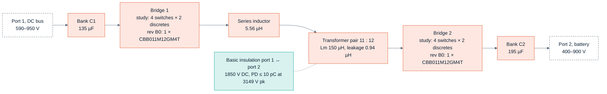
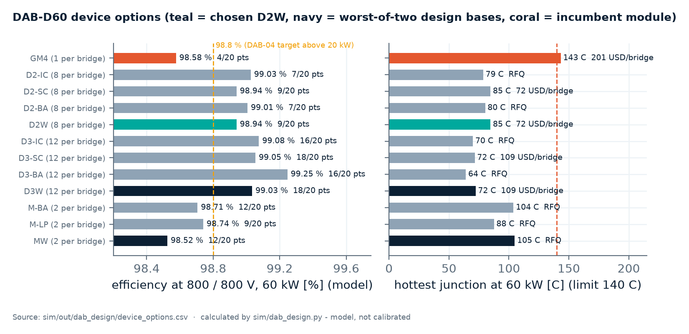
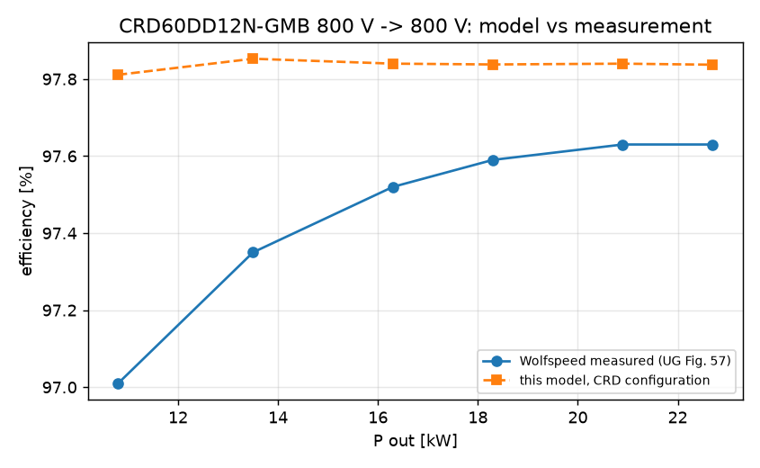
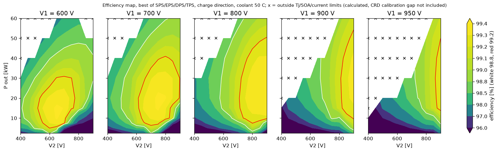
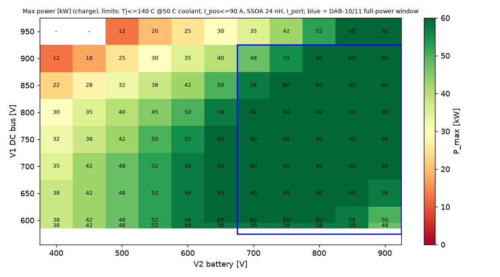
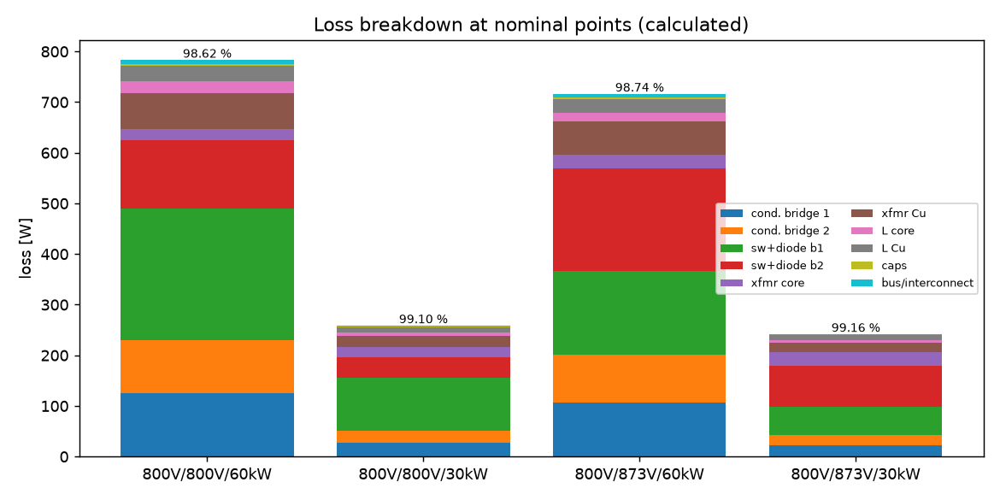
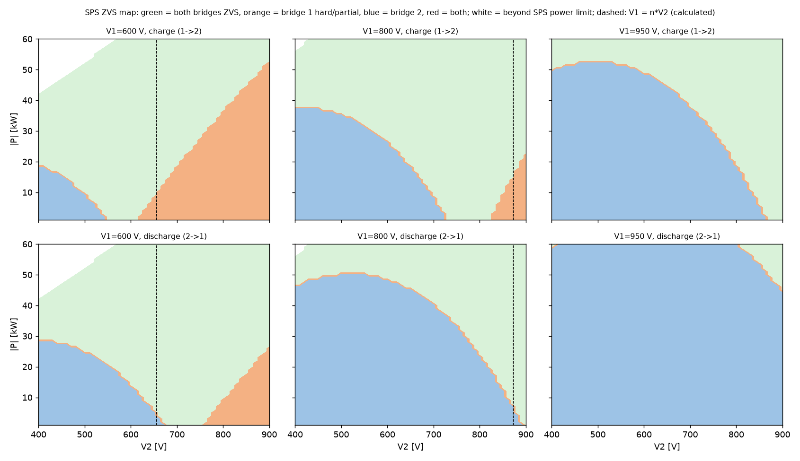

<!-- breadcrumb -->
[Home](../../README.md) › [Documentation](../README.md) › DAB-D60

# ⚡ DAB-D60 — the isolated 60 kW DC/DC

> The dual-active-bridge converter of the family: which result belongs to the drawn board and which to the device study, topology and design values, the device options, efficiency against the requirement (which is not met), the magnetics, the control results and firmware rules, the review findings, the status of the drawn board and what the cost-first redraw will change.

---

> [!NOTE]
> **Two assemblies, kept apart (review PCM-09, [D-068](../requirements/DECISIONS.md)).** The **drawn board is DAB60
> rev B0** (`gen/dab60.py`, frozen): one Wolfspeed CBB011M12GM4T full-bridge module per bridge, UCC21710 drivers,
> +15 / −4 V; its evidence is [DAB60_design_check.txt](../../hardware/DAB60/outputs/DAB60_design_check.txt). The design
> report [sim/out/dab_design/report.md](../../sim/out/dab_design/report.md) and
> [dab_spec.json](../../sim/out/dab_design/dab_spec.json) (`sim/dab_design.py`) are a **study** of option D2W — 2 ×
> IV3Q12013T4Z / SG2M014120LJ per switch, NSI6651 drivers, +18 / −3.5 V — with **no schematic**; nothing in it is
> acceptance evidence for rev B0, and drawing a board for the study is an owner decision (DAB-12). The control report
> [sim/out/dab_control/report.md](../../sim/out/dab_control/report.md) uses the plant common to both (n, L, Lm,
> banks) with the study devices' loop resistance and trip. `dab_spec.json`'s `assembly` block lists which result
> belongs to which. Everything is **calculated or simulated**.

## 📐 Requirement

| ID | Requirement | Value |
|---|---|---|
| DAB-01 | Rated power | 60 kW, bidirectional |
| DAB-02 | Topology | dual active bridge, 2 × full bridge, 1200 V SiC |
| DAB-03 | Switching frequency | 100 kHz |
| DAB-04 | Efficiency | **99.2 % peak, > 98.8 % above 20 kW** |
| DAB-05 | Operating map | full power ≈ 800 V, down to ≈ 700 V, derated toward 400 V — reproduced ourselves |
| DAB-06 | Transformer | custom; its leakage is part of the power transfer |
| DAB-07 | Cooling | liquid cold plate |
| DAB-09 | Parallel operation | 1…4 branches (+1); current sharing and one-branch-fault behaviour designed in |
| DAB-10 / 11 | Ports (assumptions) | port 1 (DC bus) 590–950 V, full load 600–900 V; port 2 (battery) 400–900 V, full power ≥ 700 V |

Source: [REQUIREMENTS.md §3](../requirements/REQUIREMENTS.md). The 99.2 % / 98.8 % figures are Wolfspeed web claims;
the reference user guide documents 800 V → 800 V at 10–23 kW only, at 97.0–97.6 % ([D-011](../requirements/DECISIONS.md)).

## ⚡ Topology and design values

Bridges: the device study (not drawn) has four switches of two paralleled 1200 V discretes per bridge; the drawn
DAB60 rev B0 has one CBB011M12GM4T full-bridge module per bridge. Banks, magnetics and the insulation barrier are common
to both.

| Design value | Value | Basis |
|---|---|---|
| Turns ratio n = N1 : N2 | 11 : 12 (0.9167) | centres d = n V2/V1 on the window ([D-014](../requirements/DECISIONS.md)) |
| Total series inductance | 6.50 µH ± 5 % = 0.94 µH leakage + 5.56 µH external | minimum mean loss; D-014 recorded 4.4 + 2.1 µH — the split moved with the rev M1 magnetics, the total did not |
| Magnetising inductance | 150 µH ± 10 % (gapped) | halves the DC flux per amp of residual DC current |
| Modulation | triple phase shift from an offline look-up table; single phase shift alone only near V1 = n V2 above ~30 % load | ZVS at light load and at 950 V |
| Dead time | hardware guard 69–188 ns at the gates + firmware table 50–300 ns | [dab_design report §0.1, DR-02](../../sim/out/dab_design/report.md) |
| DC flux walk | firmware flux-balance loop + gapped transformer + hardware trip; split phase update | open loop is not viable: a 5 ns pulse-width error gives ~44 A DC |
| 950 V on 1200 V devices (study) | **not admitted at power until a double-pulse test**: the admitted map follows the harsh ngspice deck with VDS ≤ 1,200 V = VDSS (no maker publishes a repetitive rating): turn-off current ≤ 54 A at 950 V and ≤ 58 A at 900 V per switch position; 12.5 kW at 950 / 900 V, 10 kW at 950 / 850 V, nothing ≥ 10 kW at 950 / 800 V or 950 / 700 V | the deck (15 nH loop, 10 A/ns channel) is an assumption; its 1.47 × harshness found on the GM4 module is information only, never a pass criterion ([dab_design report §7](../../sim/out/dab_design/report.md), PCM-11) |

Sources: [dab_design report §1, §3, §6, §7, §8](../../sim/out/dab_design/report.md); banks from
[dab_control report](../../sim/out/dab_control/report.md); insulation levels from IC-08 in §0.1.

**The full-power window (study).** With the turn-off limits above, 60 kW is admitted at **11 of the 20 points** of the
DAB-10 × DAB-11 window (V1 600–900 V × V2 700–900 V; it was 16 with the withdrawn 1.47 × credit).
Missing, both directions: 600 V / 850–900 V, 700 V / 900 V, 800 V / 900 V and the whole 900 V row, which is admitted at
10 / 15 / 25 kW for V2 = 800 / 850 / 900 V and not at all below 800 V. Only a double-pulse test on the real
layout with the real gate resistors can restore the 900–950 V rows; otherwise the corners stay derated or the PCS runs
its DC bus near V1 ≈ n V2 (report §1, §6, §7). Consequence for the assumed port windows DAB-10 /
DAB-11: full load at 900 V on either port is not admitted today ([D-068](../requirements/DECISIONS.md)).

## 🔬 Device option study

The decision rule: the cheapest option that meets the junction-temperature and current rules with a primary **and** an
alternate Asian maker, designed for the worse of the two, whose efficiency is not worse than the incumbent's.

Chart: [figures_design.py](../assets/figures_design.py) from [device_options.csv](../../sim/out/dab_design/device_options.csv)
(model figures, before the calibration below).

| Option | Devices per bridge | η at 800 / 800 V, 60 kW (model) | Tj max (°C) | Full-power points (screening rule) | USD per bridge | Verdict |
|---|---:|---:|---:|---:|---:|---|
| GM4: 1 × Wolfspeed CBB011M12GM4T module (incumbent, DAB-02; the drawn rev B0) | 1 | 98.58 % | 143 | 4 / 20 | 201 | fails Tj and its 100 A AC pins |
| **D2W: 2 × InventChip IV3Q12013T4Z or Sichain SG2M014120LJ per switch (worse of the two)** | 8 | **98.94 %** | **85** | **9 / 20** (11 / 20 on the admitted map) | **72** | **chosen for the study** |
| D3W: 3 per switch | 12 | 99.03 % | 72 | 18 / 20 | 109 | +72 USD per module for 18 of 20 points — owner's option |
| MW: BASiC or Leapers half-bridge modules (worse of the two) | 2 | 98.52 % | 105 | 12 / 20 | RFQ | efficiency worse than today's |

Source: [dab_design report §0](../../sim/out/dab_design/report.md). The screening rule (the same I² law for every
option, fitted to the harsh deck without credit) is stricter than the chosen option's admitted map, which follows the
deck itself. Evidence level: InventChip's datasheet states AEC-Q101 qualification but there is no public price and no
LCSC listing; Sichain's SG2M014120LJ is on LCSC (C52109935: 7.42 USD at 90+, only 14 in stock on 2026-10-05 against 16
per module; the study used 7.31 USD) without a qualification statement ([lcsc_semis.md](../../sim/data/lcsc_semis.md));
neither publishes a short-circuit rating or a cosmic-ray curve. Chinese modules stay
request-for-quotation alternates: a module must beat 36 USD per half-bridge, and the BASiC BMF008MR12E2G3 (8.1 mΩ, best
documents) is the one to quote ([D-055](../requirements/DECISIONS.md)).

## ⚠️ Efficiency against the requirement

> [!WARNING]
> **DAB-04 (99.2 % peak, > 98.8 % above 20 kW) is not met.** The calibrated figures for the study devices are a peak of
> **99.09 %**, **98.80 %** at 800 / 800 V and 60 kW, and a minimum of **97.94 %** above 20 kW in the full-power window,
> where 60 % of the points reach 98.8 % (calculated, [dab_design report §0.4](../../sim/out/dab_design/report.md)).
> The model alone gives 99.42 % / 98.95 % / 98.09 %; it is not claimed.

**Why "calibrated".** The same model run with the configuration of Wolfspeed's CRD60DD12N-GMB predicts 97.81–97.84 % at
10.8–22.7 kW; Wolfspeed measured 97.01–97.63 %. The gap is 183–288 W. This round explained 73 % of it (the harmonics of
the transformer copper loss, applied to Wolfspeed's measured 78 mΩ); Coss hysteresis, gate drive and sensing
might explain up to 84 %. The unexplained 46–91 W is carried as a constant 91 W in every claimed figure.

| Record | Figure at 800 / 800 V, 60 kW | Basis |
|---|---|---|
| [dab_design report §0.4](../../sim/out/dab_design/report.md) (the claim: study devices, look-up-table modulation) | 98.80 % calibrated, 98.95 % model | constant 91 W added |
| dab_design report §1, §5 and §5b (the same study devices, single phase shift at this point) | 98.47 % calibrated, 98.62 % model | same method, other modulation |
| [D-015](../requirements/DECISIONS.md) | 98.69 % model, ≈ 97.6 % with the loss scaled 2.5 × to Wolfspeed's data | first calibration, module round, before the gap was explained in part |

The first two rows differ by the modulation at this point, not by the devices; D-015 belongs to the module round. The
claim on this page is §0.4. Resolving the gap is the first bench task.

Efficiency map, derating map and loss breakdown (existing simulation plots)

## 🧲 Magnetics

The transformer and series inductor were redesigned after the first verification found the hand-off copper loss 2.5–4 ×
too low ([06 · Magnetics](06-magnetics.md)).

| Part | Rev M1 construction | Calculated result | Status |
|---|---|---|---|
| Transformer | two units in parallel, each 2 × DMEGC EE80 DMR95, P-S-P interleaved litz 0.05 mm, vacuum-potted aluminium housing on the cold plate | worst loss 189 W against 182 W; hot spot 133 °C against 130 °C at 65 °C coolant; transformer + inductor 0.44 % of 60 kW (266 W) | **2 checks fail (MG-16):** the maximum current rose to 137.3 A rms after the construction was sized for 118.5 A |
| Series inductor | 4 × EE80 DMR95, 3 turns profiled litz 0.05 mm, quasi-distributed gap 6 × 1.11 mm, potted | 90 W worst; hot spot 109 °C | **1 check fails (MG-15):** 0.99 Bsat (0.405 T at 100 °C, typical Bsat) at the **700 A** saturation requirement — 1.1 × the 632 A fault peak of the corrected DR-03 chain, raised from 275 A — against the 0.8 check limit; 4 turns would give 0.74 Bsat at 106 W |
| Cost | transformer pair 186 USD, inductor 86 USD — estimates | the litz grade is the only real cost lever | to settle in the DAB cost round |

Source: [magnetics report](../../sim/out/magnetics/report.md), "Constructions" and "DAB magnetics - what a cost-first
version would give"; [review_magnetics.csv](../../gen/data/review_magnetics.csv).

## 🎛️ Control results

| Test (simulated, n = 0.9167, L = 6.50 µH, 100 kHz, one-period delay; study plant, not acceptance evidence for DAB60 rev B) | Result |
|---|---|
| Soft start 0 → 75 A in 5 ms with the split update | peak 119 A (over-current trip 200 A); no steady-state error |
| Transformer DC offset during ramps and steps | 3.33 A with the split update and a 3°-per-period slew; 46.91 A with a naive update |
| Constant-voltage 800 V, load step 20 → 50 kW | dip 5.6 V, back within 1 V after 0.55 ms |
| Power reversal +70 → −70 A in 1 ms | no loss of control through zero phase; peak 115 A |
| Two branches, ±5 % inductance, common phase | sharing error −4.99 % |
| Two branches with per-branch current loops, sensors ±1 % | sharing error −1.00 %, set by the sensor gain |
| One of two branches trips at 2 × 60 kW | survivor holds 60 kW; bus overshoot of a generic 4 mF PCS 19.5 V with DC-current feed-forward, 65.2 V without |
| Soft start from idle with both ports live (800 V bus, 780 V battery) | gates off for the first 72 periods, then peak 119 A, DC offset 3.33 A |
| Power reversal +70 → −70 A through the idle band | 4 idle periods, restart offset 4.08 A, peak 115 A |
| What the idle rule prevents: single phase shift at zero phase, both bridges switching, 950 / 400 V | 260 A peak against the 200 A trip at 0.44 kW transferred |
| PCS-P125 link (0.41 mF + the DAB's 135 µF, bus 750 V, stiff grid): DAB 0 → 60 kW into the bus | 747–766 V as a step, 748–756 V at the ramp rule (9.6 ms) |
| PCS-P125 link: the DAB trips while feeding / while taking 60 kW | 735–751 V / 749–765 V, back to the set point |
| PCS-P125 link, off grid (the DAB forms the bus, CV 400 Hz): inverter load 6 → 60 kW / 60 → 6 kW | dip to 707 V (UV stop 647 V at a 400 V grid) / rise to 790 V |
| PCS-P125 link: the inverter trips while the DAB feeds the bus | the DAB's 1000 V port-1 trip acts after 1.70 ms; the bus peaks at 1,009 V, below the inverter's 1,050 V — the DAB stops first |

Source: [dab_control report](../../sim/out/dab_control/report.md). The plant is single phase shift with ideal edges and
no device model: valid near V1 = n V2 (\|V1 − n V2\| ≤ ~130 V) for either device
set. Decision [D-018](../requirements/DECISIONS.md): no hardware carrier-sync line; the system controller caps total
power at Nalive × Pbranch,max. The weak-grid link cases are the inverter study's
([09 · PCS-P125](09-pcs-p125.md)).

**Firmware rules for the DAB** (requirements in `dab_spec.json`, not code; [D-068](../requirements/DECISIONS.md),
[D-071](../requirements/DECISIONS.md)):

| Rules | What they require | Why (calculated) |
|---|---|---|
| FW-DAB-1…7, light load | switch only on feasible look-up-table entries (inner shifts up to 150°); gates off below 1.5 kW, on again at 2.5 kW or the lowest feasible row; single phase shift only where \|V1 − n V2\| ≤ 130 V; the table's CRC and the turn-on rule Vbus + Vres ≤ 1,200 V re-checked at start | the review's numbers were confirmed: at 950 / 400 V a zero-shift single phase shift circulates 129.53 A rms / 224.36 A peak; the committed table circulated 72.9 A rms at 2.5 kW, now 19.0 A rms / 53.5 A peak; light load stays ≤ 44 A rms / 93 A peak up to 10 kW; the feasible set covers V1 / (n V2) 0.73–2.59. Not simulated: a start from idle on a large-mismatch entry |
| FW-DAB-8…10, the inverter's DC link | every change of the DAB power reference into a link the PCS holds at ≤ 6.25 kW/ms in total (9.6 ms for 60 kW), shared between branches; non-hazard stops ramp, hazard trips gate off at once and report; off grid a set point ≥ 752 V or a CV crossover ≥ 423 Hz | the link is 0.41 mF, not the 4 mF the study had assumed; at SCR 5 an unramped 125 kW step collapses the bus |
| FW-DAB-11, offset nulling | transformer- and branch-current sensor offsets nulled at idle; a null outside ±4 A is a sensor fault | the DAB60 check allowed ±4 A of uncalibrated offset while the flux loop nulls the measured DC — an un-nulled offset becomes a real bias of up to about 32 mT that the 5 A DC trip cannot see (found by the Wolfspeed firmware cross-check, [REFERENCE-LESSONS §6](../requirements/REFERENCE-LESSONS.md)) |

The cross-check against ST's STSW-DABBIDIR firmware (requirement DAB-08) is in the control report, from a static
decode of ST's firmware binary ([st_dab_firmware_params.csv](../../sim/data/st_dab_firmware_params.csv)); it adds an
on-line single-phase-shift power plausibility check to the firmware. The Wolfspeed CRD60DD12N-GMB firmware is an
open-loop starting point with almost no protection in firmware; what it and the other Wolfspeed packages teach is in
[REFERENCE-LESSONS §6](../requirements/REFERENCE-LESSONS.md).

## 🛡️ Review findings and residual risks

The drawn DAB60 board had an independent review: **15 findings, 0 critical, 8 major, 7 minor**
([review_dab60.csv](../../gen/data/review_dab60.csv)). The design report resolves DR-01 to DR-07 and the insulation finding
IC-08 by calculation ([§0.1](../../sim/out/dab_design/report.md)):

| Finding | Resolution (calculated) |
|---|---|
| DR-01 transformer current through each module's four AC pins | discretes have no shared AC pin; hottest device lead 57.4 A against 106 A |
| DR-02 hardware dead time that the spec said did not exist | hardware guard owns the minimum (69–188 ns), the firmware table the rest |
| DR-03 firmware-independent trips used the fast turn-off | every hardware trip injects into DESAT of all 8 drivers, so all switches use the soft turn-off (response 1.47 µs); fault peak 632 A (338 A bounded by the PWM), per device against each maker's own pulse rating: 307 / 367 A (IV3Q12013T4Z), 373 / 491 A (SG2M014120LJ); the series inductor's saturation requirement rises to 700 A, 1.1 × the fault peak (MG-15) |
| DR-04 no hardware link between the bridges' trips | both bridges stop in hardware within 1 µs on any trip |
| **DR-05 short-circuit withstand** | **not shown to be covered (release block).** The chain is corrected (PCM-10): the driver's 265 ns deglitch lies inside its DESAT-to-output delay, and in a short VDS stays at the bus, so there is no Miller plateau and the current falls with the gate voltage. Worst case (SG2M014120LJ, NSI6651 industrial): blanking 592 ns, gate falling at 892 ns; the energy-equivalent full-current time is 1,112 ns = **0.99 × the assumed 1.12 µs hot withstand**, fault energy 1.09 J per device. The 2 × rule needs 0.50; the best lever inside the NSI6651 (booster + 10 kΩ DESAT pull-up) reaches 0.61. Release needs maker-confirmed tSC ≥ 2.22 µs at 1000 V / 150 °C (about 4.0 µs at 800 V / 25 °C) and ESC ≥ 2.18 J per device, a short-circuit test on samples, or a device with a published withstand — until then **a shoot-through at 1000 V / 150 °C may destroy the devices** (the fuse clears) |
| DR-06 no hardware over-temperature trip | plate NTC per bridge at 77 °C into the trip chain; magnetics NTCs at 140 °C |
| DR-07 terminal-network ratings | 20 × 47 nF C0G per bridge sized by the simulated current |

The study itself was read by the independent PCM review of 2026-10-05; [D-068](../requirements/DECISIONS.md) records the
answers ([review_pcm.csv](../../gen/data/review_pcm.csv)):

| Finding | Disposition (calculated) |
|---|---|
| PCM-09 the study is not the frozen board | **closed:** the assembly identity above, in `dab_spec.json` and in the report header |
| PCM-10 fault response beyond the assumed withstand | **open:** the corrected chain is 0.99 ×, not the reviewer's 1.58 × (full current to the plateau, which a short does not have) nor the earlier 0.97 × (an inverted ratio with the deglitch counted twice); release block as DR-05 |
| PCM-11 commutation peaks above 1,200 V | **closed:** the deck results were reproduced (1,236 V at 950 / 900 V, 60 kW; 1,398 / 1,437 V on hard turn-on) and the admitted map now follows the deck: 11 of 20 window points, hard turn-on excluded by the table rule |
| PCM-12 circulating current at zero power | **closed in firmware:** FW-DAB-1…7 above |

Further open items from the design report: the false-turn-on check of the chosen DAB devices is listed as not yet done
([D-043](../requirements/DECISIONS.md)); the file [result_dab.json](../../sim/out/gdrv_miller/result_dab.json) records die
peaks of +2.97 to +3.07 V for 2 × SG2M014120LJ against a 1.81 V minimum threshold at 175 °C, without stating the clamp
configuration of that run — **to be settled before the redraw**. Also open: the real loop inductance (sets the 900–950 V
derating), the cosmic-ray rate at 950 V (79 % of VDSS; no maker curve), and which allocation of the calibration gap
is real.

The economical re-check R4 ([D-081](../requirements/DECISIONS.md); [review_r4.csv](../../gen/data/review_r4.csv) E09,
*Not Applicable*) left the study where it stands: it keeps its own identity and restricted map, the product is deferred
behind the PV and PCS gates, and no unrestricted 60 kW, high-voltage or short-circuit claim is made from the study alone
([standing restrictions](12-risks-and-open-items.md#standing-restrictions)). The DESAT string of the 1,200 V-class
presets (DAB60, GDRV-HB) was not re-rated with the 1,700 V ones: three US1MH, of which one 1,000 V diode alone holds
× 0.95 of the port-1 over-voltage band peak (1,048 V), the dynamic share 600 V of the 1,400 V trip-corner requirement —
OPEN until the board is developed, with the 1,700 V-class string (2 × BYG23T-M3/TR) as the drop-in
([GDRV-HB design check](../../hardware/GDRV-HB/outputs/GDRV-HB_design_check.txt), risk C12).

## 🗺️ Status and the cost-first redraw

| Item | Status |
|---|---|
| Design and control studies | device study of the D2W discretes (2026-10-04), corrected after the review (2026-10-05, [D-068](../requirements/DECISIONS.md)); no schematic |
| Firmware rules | FW-DAB-1…11 in `dab_spec.json` — requirements, not code |
| Magnetics | redesigned (rev M1); three checks fail as above |
| Board DAB60 rev B0 | 16 sheets, 1,264 parts, passes its build checks ([report](../../hardware/DAB60/outputs/DAB60_report.json)); drawn on the earlier architecture (Wolfspeed modules, isolated bias per switch, PV-rated port blocks) — **frozen** |
| Cost-first board | not drawn |
| BOM of the earlier implementation | 3,615 USD at catalogue prices, 2,927 USD at 5,000 units ([bom/COST.md](../../bom/COST.md), as of 2026-10-05) |

What the redraw will change, by the same principles as the PV module
([ARCHITECTURE-COSTFIRST.md §16](../requirements/ARCHITECTURE-COSTFIRST.md)):

- The controller moves to **port 2's negative rail**; bridge-2 drivers and sensing become functional, as on the PV
  module, and the PV control board is reused with a different pin plan.
- **Port 1 is a second DC system:** the transformer and every part bridging the ports need basic insulation at
  1850 V DC; bridge-1 bias comes from one per-bridge transformer with that barrier; V1 and I1 cross it once (a
  reinforced isolated amplifier for V1, one TMR sensor for I1). The single reinforced barrier B1 to SELV stays.
- **Both ports become battery-type ports** (aR fuse pair, one contactor, precharge); the auxiliary supply is fed from
  port 2 only.
- **No clamp banks** (−53 USD with the Vishay clamps the design report chose, −785 USD against the Infineon parts of the
  first BOM). The design report shows what that gives up: without a clamp a bolted terminal short drives 3.9 / 4.5 kA
  through each device's body diode — the devices are destroyed, as on the PV module.
- The coolant flow switch and thermostat become two NTCs with a comparator; the 47 nF C0G HF capacitors become
  polypropylene film.

| Cost view | USD | Scope and basis |
|---|---:|---|
| Earlier implementation, whole module | 3,615 | catalogue prices, [bom/COST.md](../../bom/COST.md) |
| Device study, "this design's parts" | 1,127 (from 1,899) | switches, clamps, HF capacitors, snubber, magnetics, cold plate, flow switch, thermostat — ports excluded ([dab_design report §0.3](../../sim/out/dab_design/report.md)) |
| Cost-first block estimate, whole module | ≈ 1,140 (≈ 19 USD/kW) | ARCHITECTURE-COSTFIRST.md §16 — a block estimate, nothing designed; +20 % against the 950 USD working budget |

The remaining ≈ 190 USD to the budget can only come from the custom magnetics (272 USD estimate, no quote) or from
sharing one protected port with the PCS (§16).

---

<!-- footer -->
← [09 · PCS-P125](09-pcs-p125.md) · [Documentation index](../README.md) · [11 · Megarevo comparison](11-megarevo-comparison.md) →
