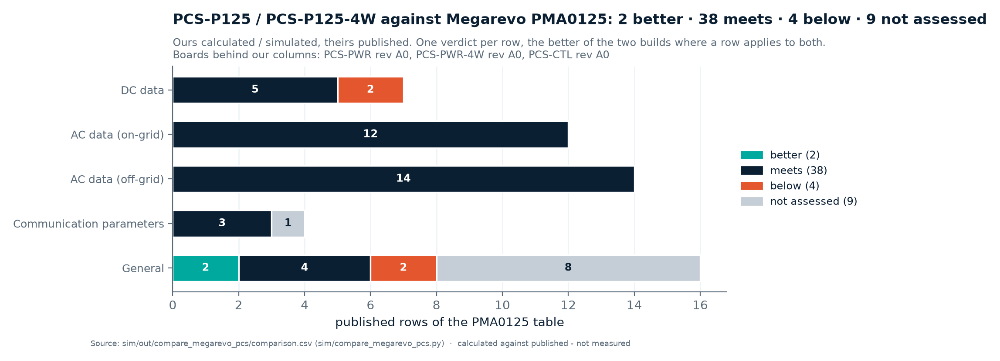

<!-- breadcrumb --> [Home](../../README.md) › [Documentation](../README.md) › Comparison with Megarevo

# 📐 Comparison with Megarevo

> How PV-P75 and PCS-P125 compare, row by row, with the published specifications of Megarevo's PMD-75-G3 and PMA0125, what the module-parity register adds beyond the two tables, and how every product compares with the owner's price benchmark.

---

> [!NOTE]
> **Two generated tables, one register.** The PV-P75 table describes the cost-first boards PV-PWR rev A2 + PV-CTL rev A2
> and is written by [`sim/compare_megarevo.py`](../../sim/compare_megarevo.py); the PCS-P125 table describes both
> inverter builds — PCS-PWR / PCS-PWR-4W rev A0 with PCS-CTL rev A0 in its three- and four-wire assemblies — and is
> written by [`sim/compare_megarevo_pcs.py`](../../sim/compare_megarevo_pcs.py). Both were regenerated on 2026-10-07,
> after the re-check R2 ([D-078](../requirements/DECISIONS.md), [D-079](../requirements/DECISIONS.md)), from the design
> files named in their evidence columns; no verdict moved. Three PV rows and four PCS rows are below Megarevo's published
> figure ([PV](#the-three-pv-rows-below-the-pmd-75-g3), [PCS](#the-four-pcs-rows-below-the-pma0125)). What the published
> tables do not list — interfaces, start-up, recorder, declarations — is tracked module by module in the
> [parity register](#-module-parity-register).

## 🧭 The competitor products

| Product | What it is | Role in this project | What is on file |
|---|---|---|---|
| **PMD-75-G3** | 75 kW non-isolated bidirectional buck-boost DC/DC module with one centralised MPPT, 250–1000 V and 135 A on both ports, 3U (550 × 444 × 133 mm, 30 kg) | the target of PV-P75 ([REQUIREMENTS.md §2](../requirements/REQUIREMENTS.md#2-pv-p75--pv-p100--pv-p110-non-isolated)) | published specification table and datasheet v1.0, retrieved 2026-10-04: [spec.md](../reference-designs/megarevo/pmd-75-g3/spec.md) |
| **PMA0125** (PMA family) | 125 kW bidirectional inverter module, ±250 A DC (±230 A continuous), grid type 3W+PE or 3W+N+PE, 5U | the target of PCS-P125 and PCS-P125-4W ([AC-02](../requirements/REQUIREMENTS.md#8-dc-to-ac-pcs-and-the-volume-basis-owner-instruction-2026-10-04)) | datasheet V1.0 transcribed verbatim in [spec-pma0125.md](../reference-designs/megarevo/pma/spec-pma0125.md); the user manual's module-level statements with page numbers in [MANUAL-NOTES.md](../reference-designs/megarevo/pma/MANUAL-NOTES.md) (the manual covers the 50–105 kW modules, not the 125 kW one); [README](../reference-designs/megarevo/pma/README.md) |
| **Catalogue 2026** V1.2 | Megarevo's product and solution catalogue | module pages only ([D-073](../requirements/DECISIONS.md)); the datasheet is the source where the two differ (altitude 5,000 m in the datasheet, 4,000 m in the catalogue) | manifest row in [docs/SOURCES.csv](../SOURCES.csv), folder `docs/reference-designs/megarevo/catalogue-2026/` (the PDF is fetched by `docs/fetch.py`, not kept in git) |
| **MPHV 1500 V string PCS** | 145–250 kW three-level string PCS, IP66, a complete AC/DC unit (not a module) | the **price benchmark**: the 228 kW version sells for 1,500 USD = 6.6 USD/kW, as stated by the owner | datasheet V1.1 ([README](../reference-designs/megarevo/string-pcs-1500v/README.md)); the price is not published |

Megarevo publishes no price for the PMD-75-G3 or the PMA0125 ([COST-REVIEW.md §1](../requirements/COST-REVIEW.md#1-the-benchmark)).

### What is compared, and what is not

The owner's rule of 2026-10-05 ([D-073](../requirements/DECISIONS.md)): match the competitor **module for module**, in
both directions — "if Megarevo has it, we have it, and the other way round" — and compare **modules only**. Compared are
the PMA inverter modules (50–60, 80–105 and 125–135 kW) and the PMD-75-G3 DC/DC module. Discarded as not in our plans:
the PMAE / PMDE / ESSF cabinets, the ESSP containers, the MEGA and HEGA 1500 V PCS, the integrated MPS / MPSM hybrids
(their PV-input-only MPPT module is sold only inside them), the REVO units, HMI panels, racks, hot-plug connectors and
IP5X compartments — mechanics are out of scope ([D-003](../requirements/DECISIONS.md)). Bidirectional is kept both ways:
the PMD-75-G3 is a bidirectional buck-boost as PV-P75 is (unidirectional PV use is a declared firmware mode), and the
PMA0125 is bidirectional (±250 A, charge ↔ discharge switching < 20 ms) as PCS-P125 is; nothing of ours was discarded.
Flagged to the owner and not done: a smaller AC module (their 50–60 and 80–105 kW classes) would be a requirements
change, and AC-02's 600 V full-load figure stays an open requirement item ([risk G1](12-risks-and-open-items.md#requirements-contradicted)).

---

## 🔬 PV-P75 against the PMD-75-G3

### Scorecard

<!-- BEGIN:megarevo-score -->

    &nbsp;of 34 published rows

<!-- END:megarevo-score -->

Source: <a href="../../sim/out/compare_megarevo/comparison.csv">comparison.csv</a> (written by <a href="../../sim/compare_megarevo.py">sim/compare_megarevo.py</a>) · calculated against published, not measured

The five *not assessed* rows (humidity, IP rating, dimensions, weight, mounting) need the mechanical design, which is
outside this project's scope ([REQUIREMENTS.md §1](../requirements/REQUIREMENTS.md#1-scope)).

### Row by row

<!-- BEGIN:megarevo-table -->

| Parameter | Megarevo PMD-75-G3 · published | PV-P75 · calculated or simulated | Verdict | Evidence |
|---|---|---|---|---|
| **DC Data** | | | | |
| Rated Power (kW) | 75 | 75 (3 interleaved phases on one power board) | ● meets | [module_spec.json](../../sim/out/pv_design/module_spec.json) |
| Max. Power (kW) | 82.5 | 82.5 | ● meets | [module_spec.json](../../sim/out/pv_design/module_spec.json) |
| MPPT Channels | 1 (Centralized 75kW Design) | 1 centralised tracker over the 3 interleaved phases | ● meets | [control_spec.json](../../sim/out/pv_control/control_spec.json) |
| **PV Data** | | | | |
| Operating Voltage Range (V) | 250~1000 | 250~1000 | ● meets | [module_spec.json](../../sim/out/pv_design/module_spec.json) |
| Full-Load Voltage Range (V) | 550~950 | 550~950 | ● meets | [module_spec.json](../../sim/out/pv_design/module_spec.json) |
| Max. Operating Current (A) | 135 | 135 (3 x 45 A) | ● meets | [module_spec.json](../../sim/out/pv_design/module_spec.json) |
| MPPT Tracking Accuracy | ≥99.9% | 99.950 % static (simulated), key /mppt/static_eta_min_in_window | ● meets | [control_spec.json](../../sim/out/pv_control/control_spec.json) |
| PV Start-up Voltage (V) | 250 | auxiliary supply starts at 206-215 V; the converter runs from 250 V | ● meets | [aux75_spec.json](../../sim/out/aux_hv_design/aux75_spec.json) |
| **Output Data** | | | | |
| Voltage Range (V) | 250~1000 | 250~1000 | ● meets | [module_spec.json](../../sim/out/pv_design/module_spec.json) |
| Full-Load Voltage Range (V) | 550~950 | 550~950 | ● meets | [module_spec.json](../../sim/out/pv_design/module_spec.json) |
| Max. Operating Current (A) | 135 | 135 (3 x 45 A) | ● meets | [module_spec.json](../../sim/out/pv_design/module_spec.json) |
| **Protection Data** | | | | |
| Over/Under Voltage Protection (Both Ports) | Supported | hardware trip 1039-1110 V (discrete comparators, latched) and firmware limit 1034 V on each port, stop below 240 V | ● meets | [cell_spec.json](../../sim/out/pv_design/cell_spec.json) [module_spec.json](../../sim/out/pv_design/module_spec.json) |
| Overcurrent Protection (Both Ports) | Supported | per phase: discrete hardware trip 67.9-80.5 A on the inductor current, controller comparator backup 81.1-101.9 A; battery port: hardware over-current trip 387-413 A | ● meets | [module_spec.json](../../sim/out/pv_design/module_spec.json) [port_spec.json](../../sim/out/port_design/port_spec.json) |
| Open-Circuit Protection (Both Ports) | Supported | full-power load rejection (calculated): the 1039-1110 V hardware over-voltage trip has the gates off 47 us after the crossing; the battery-side film bank needs 7 capacitors to stay under the device voltage limit and the drawn board has 7 | ● meets | [module_spec.json](../../sim/out/pv_design/module_spec.json) |
| Overtemperature Protection | Supported | hardware trips: heatsink 86.3-89.5 C, inductor 146.2-153.7 C; firmware derating below them | ● meets | [module_spec.json](../../sim/out/pv_design/module_spec.json) |
| Lightning Protection | Supported | monitored varistor network on the board, three Thinking Electronic TVT25751KFKG per port (pole to midpoint twice, midpoint to PE): effective level 3793 V pole-to-PE at 3 kA (calculated), 25 kA maximum | ● meets | [port_spec.json](../../sim/out/port_design/port_spec.json) |
| Insulation Impedance Detection | Supported | switched 992 kOhm test strings pole-to-PE through isolated solid-state relays on the power board; 33.3 kOhm threshold (1000 V / 30 mA) | ● meets | [port_spec.json](../../sim/out/port_design/port_spec.json) |
| Short-Circuit Protection | Supported | gate-driver DESAT at 9.3 V, gates off 0.42 us after detection (the 2 us device withstand is an assumption: no maker publishes one); 250 A aR fuse on each battery pole; the contactor is held closed above 967 A so the fuse clears first; faults of 967-1250 A must be cleared upstream within 0.26 s (installation requirement); the PV port has no fuse (current-limited source) | ● meets | [cell_spec.json](../../sim/out/pv_design/cell_spec.json) [port_spec.json](../../sim/out/port_design/port_spec.json) |
| Isolation Method | Non-Isolated | non-isolated, common negative rail (2-level non-inverting four-switch buck-boost (FSBB)) | ● meets | [cell_spec.json](../../sim/out/pv_design/cell_spec.json) |
| **General Data** | | | | |
| Max. Efficiency | 99% | 99.47 % peak at 900->1000 V, 49.5 kW (everything inside the module: phases, ports, auxiliary supply, contactor coils, fans); 98.77 % at the worst full-power corner, 45 C inlet | ▲ better | [module_spec.json](../../sim/out/pv_design/module_spec.json) |
| Operating Temperature Range (℃) | -30~60 (>45 Derating) | cold side: the fan is rated to -10 C (requirement and Megarevo: -30 C); the minimum rating of every other part has not been audited one by one. Hot side: full 82.5 kW to 45 C inlet at sea level, 75 % at 60 C (nominal thermal model; 73 % with the pessimistic model) | ▼ **below** | [module_spec.json](../../sim/out/pv_design/module_spec.json) |
| Operating Altitude (m) | ＞3000 Derating | derates with altitude: at 45 C inlet 86 % at 2000 m and 79 % at 3000 m; full power at 3000 m only up to about 25 C inlet. The inductor hot spot is the limit (144.7 C against a 146.2 C trip at sea level, 45 C inlet) | ▼ **below** | [module_spec.json](../../sim/out/pv_design/module_spec.json) |
| Relative Humidity | ≤95% (Non-condensing) | not assessed: mechanics and enclosure are outside this project's scope (schematic + BOM + simulation) | ○ not assessed | [REQUIREMENTS.md](../requirements/REQUIREMENTS.md) section 1 |
| IP Rating | IP20 | not assessed: mechanics and enclosure are outside this project's scope (schematic + BOM + simulation) | ○ not assessed | [REQUIREMENTS.md](../requirements/REQUIREMENTS.md) section 1 |
| Noise Level (dB) | ≤65 @1m | 60.8 dB(A) @1 m at full power, 45 C inlet (fan datasheet sound data + 3 dB installation estimate) | ▲ better | [module_spec.json](../../sim/out/pv_design/module_spec.json) |
| Cooling Method | Temperature-Controlled Smart Forced Air | forced air, 3 x Delta AFB1224SHE-F00 on one earthed heatsink, speed set through the fan supply from the heatsink and inductor NTCs; one fan failed still holds 84 % at 45 C | ● meets | [module_spec.json](../../sim/out/pv_design/module_spec.json) |
| Dimensions L*W*H (mm) | 550*444*133 | not assessed: mechanics and enclosure are outside this project's scope (schematic + BOM + simulation) | ○ not assessed | [REQUIREMENTS.md](../requirements/REQUIREMENTS.md) section 1 |
| Weight (kg) | 30 | not assessed: mechanics and enclosure are outside this project's scope (schematic + BOM + simulation) | ○ not assessed | [REQUIREMENTS.md](../requirements/REQUIREMENTS.md) section 1 |
| Mounting Method | Cabinet Fixed Installation | not assessed: mechanics and enclosure are outside this project's scope (schematic + BOM + simulation) | ○ not assessed | [REQUIREMENTS.md](../requirements/REQUIREMENTS.md) section 1 |
| **Communication Data** | | | | |
| Communication | 485, CAN | isolated CAN and isolated RS-485 on the control board, behind the module's one reinforced barrier | ● meets | [pv_ctrl.py](../../gen/pv_ctrl.py) |
| BMS Interface | Supported | over the same isolated CAN / RS-485 port (the cost-first build has no separate gateway card) | ● meets | [pv_ctrl.py](../../gen/pv_ctrl.py) |
| **Other Data** | | | | |
| Voltage Accuracy | ＜1%@100%Pn | <= 0.5 % (0.1 % dividers, ADC and reference) after the two-point calibration; a design budget, not an end-to-end calculation on the drawn boards (the control board's ADC share checks at 0.42 % worst) | ● meets | [ARCHITECTURE-COSTFIRST.md](../requirements/ARCHITECTURE-COSTFIRST.md) [PV-CTL_design_check.txt](../../hardware/PV-CTL/outputs/PV-CTL_design_check.txt) |
| Current Accuracy | ＜1%@100%Pn | <= 0.8 % at 135 A (shunt in the negative rail, temperature compensated) after the two-point calibration; a design budget, not an end-to-end calculation on the drawn boards (the control board's ADC share checks at 0.42 % worst) | ● meets | [ARCHITECTURE-COSTFIRST.md](../requirements/ARCHITECTURE-COSTFIRST.md) [PV-CTL_design_check.txt](../../hardware/PV-CTL/outputs/PV-CTL_design_check.txt) |
| Standby Power Consumption (W) | ＜20 | 12.7 with both contactors open, 22.4 with both held closed and the gates off, at 1000 V (9.1 / 16.3 at 600 V; estimate) | ▼ **below** | [module_spec.json](../../sim/out/pv_design/module_spec.json) |

Generated by <a href="../assets/figures_overview.py">figures_overview.py</a> from <a href="../../sim/out/compare_megarevo/comparison.csv">comparison.csv</a> (written by <a href="../../sim/compare_megarevo.py">sim/compare_megarevo.py</a>). Do not edit between the markers.

<!-- END:megarevo-table -->

### The three PV rows below the PMD-75-G3

| Row | Where the design stands (calculated) | Why | What closes it |
|---|---|---|---|
| Operating temperature | the fan is rated −10…+60 °C against a −30 °C requirement; below −10 °C inlet the fans stay off and the power is limited to a passive-cooling table (PV-P75 19.2 / 17.5 / 15.5 kW at −30 / −20 / −10 °C, estimates ±50 %, [D-072](../requirements/DECISIONS.md)) | a −30 °C fan (Sanyo 9GT1224P1S001) adds 225–300 USD per module and exceeds the SELV allocation | a cold-chamber run of the passive table, or the dearer fan — **open** ([R-05](../requirements/ARCHITECTURE-COSTFIRST.md#13-open-risks)) |
| Operating altitude | thermal: 79 % of full power at 3000 m and 45 °C inlet (86 % at 2000 m); barrier: the declared ceiling is **2,000 m**, set by the 8.0 mm clearance of barrier B1 on the control board, not by the thermal model ([D-075](../requirements/DECISIONS.md), [PV-CTL design check](../../hardware/PV-CTL/outputs/PV-CTL_design_check.txt)) | the round-wire inductor runs at 144.7 °C against a 146.2 °C trip, so thinner air costs power directly; 9.2 / 10.4 / 11.9 mm clearance are needed at 3,000 / 4,000 / 5,000 m | thermal: a litz-wound inductor (about +17 USD per phase) or more airflow ([D-054](../requirements/DECISIONS.md), [D-056](../requirements/DECISIONS.md)); barrier: the specified 15 mm isolator option (+1.53 to +3.02 USD per control board, AUX-T1 and the SELV connectors at ≥ 9.2 mm from live copper) — specified, not fitted ([D-075](../requirements/DECISIONS.md)) |
| Standby power | 22.4 W with both contactors held at 1000 V; 12.7 W with them open (9.1 / 16.3 W at 600 V; estimate, [module_spec.json](../../sim/out/pv_design/module_spec.json)) | two contactor coils on the economiser at 2.35 W each; the control board's SELV logic is now 1.44 W in standby (Ethernet not fitted) where 0.6 W was allocated before ([D-075](../requirements/DECISIONS.md), [D-076](../requirements/DECISIONS.md)) | opening the PV contactor in standby, or a lower hold power |

The fourth row of the earlier table, open-circuit protection (full-power load rejection), was closed by the seventh
battery-side film capacitor drawn in PV-PWR rev A2 ([D-058](../requirements/DECISIONS.md)): the bank is now 315 µF
against 278.5 µF needed (calculated).

<b>What moved against the earlier platform</b> (PV-P75 rows that changed when the eight-board platform was replaced)

| Row | Earlier platform | Cost-first design (table above) | Effect | Source |
|---|---|---|---|---|
| Communication | 2 × RS-485, 2 × CAN (one CAN FD), Ethernet → *better* | 1 CAN, 1 RS-485; Ethernet back as an option (CH9121T bridge: footprints on PV-CTL, fitted on PCS-CTL); chainable stop input, ready permissive, battery-fault input, changeover relay | *meets* (Megarevo: 485, CAN) | [ARCHITECTURE-COSTFIRST §12](../requirements/ARCHITECTURE-COSTFIRST.md#12-what-the-lean-design-gives-up-plain-list-for-the-owner), item 6; [D-075](../requirements/DECISIONS.md) |
| BMS interface | BMU-GW gateway daughtercard | the module's own isolated CAN / RS-485 port | *meets*, no separate gateway | ARCHITECTURE-COSTFIRST §0 |
| Operating temperature | fan rated to −40 °C | fan Delta AFB1224SHE-F00 rated **−10…+60 °C**; reduced power below −10 °C inlet by a firmware rule | *below* — open | [R-05](../requirements/ARCHITECTURE-COSTFIRST.md#13-open-risks), [D-072](../requirements/DECISIONS.md) |
| Operating altitude | full power at 3000 m up to a moderate inlet temperature | 79 % at 3000 m and 45 °C inlet; declared 2,000 m by the barrier clearance | *below*: the cheaper inductor leaves no thermal reserve, and the 8 mm isolators set the ceiling | [D-054](../requirements/DECISIONS.md), [D-056](../requirements/DECISIONS.md), [D-075](../requirements/DECISIONS.md) |
| Max. efficiency | 99.48 % peak, 98.90 % worst full-power corner | 99.47 % peak, 98.77 % worst full-power corner at 45 °C inlet; junction about 110 °C instead of 78 °C | still *better* than the published 99 % | [module_spec.json](../../sim/out/pv_design/module_spec.json) |
| Standby power | 18.7 W (estimate) | 12.7 W with both contactors open, 22.4 W with both held, at 1000 V | *below* by 2.4 W in the held state | [module_spec.json](../../sim/out/pv_design/module_spec.json) |
| Lightning protection | DIN-rail arrester, 4,000 V protection level | monitored varistor network on the board, 3.79 kV effective level at 3 kA | *meets*; the varistors' thermal links have no DC rating | [D-042](../requirements/DECISIONS.md) |
| Short-circuit protection | 160 A gPV fuse on every pole, contactor hold-closed interlock | DESAT with turn-off booster; battery port: aR fuse per pole and a contactor held closed above 967 A; PV port: no fuse. Faults of 967–1250 A are left to the upstream battery protection | *meets*, with an **installation requirement** | [ARCHITECTURE-COSTFIRST §15](../requirements/ARCHITECTURE-COSTFIRST.md#15-changes-against-the-d-044-direction-where-i-refined-or-disagree) |
| Over-current / over-temperature trips | cell 72.4 A, port 202.5 A / 405 A; heatsink 86 °C | inductor window 67.9–80.5 A (narrowed by D-058, widened by the comparator's common-mode term in D-072), port 387–413 A, heatsink 86–90 °C, inductor 146–154 °C | *meets*, new thresholds | [PV-CTL design check](../../hardware/PV-CTL/outputs/PV-CTL_design_check.txt) |
| Voltage and current accuracy | 0.83 % after calibration (isolated sensing), calculated end to end | ≤ 0.5 % and ≤ 0.8 % as a design budget: dividers and shunts on the negative rail | *meets* on the budget; not yet an end-to-end calculation on the drawn boards | [ARCHITECTURE-COSTFIRST §6](../requirements/ARCHITECTURE-COSTFIRST.md) |

---

## 🔬 PCS-P125 and PCS-P125-4W against the PMA0125

One module, two assemblies: PCS-P125 (grid type 3W+PE: PCS-PWR + PCS-CTL-3W) and PCS-P125-4W (3W+N+PE: PCS-PWR-4W +
PCS-CTL-4W, [D-074](../requirements/DECISIONS.md)). The table has a column for each; each row has **one verdict, the
better of the two builds** where the row applies to both — a row only the four-wire build can meet says so in the
three-wire cell. The two DC-voltage rows hold one window per grid type, and their verdict is the worse window. The four
off-grid quality rows (voltage and frequency accuracy, THDu, imbalance) were pending until the control study's extension
of 2026-10-06 ([D-077](../requirements/DECISIONS.md)); none is pending now. The re-check R2 changed figures inside two
of them, not their verdicts ([D-079](../requirements/DECISIONS.md)): the voltage-accuracy row's dynamic part now comes
from the bounded averaged model — a 0 → rated step dips to 0.43 pu (inside ±1 % after 1.57 s), rated → 0 overshoots to
1.75 pu (inside after 0.35 s), where the unbounded model of D-077 printed 0.38 / 2.17 pu — and THDu is 1.39 / 2.11 %
(three- / four-wire) with the assembly's filter tolerances instead of 1.31 / 1.98 %. The static ±1 % row is met by the
0.59 % worst-case sum either way; the single-module transient is declared as an envelope on
[09 · PCS-P125](09-pcs-p125.md#-declarations).

### Scorecard

<!-- BEGIN:megarevo-pcs-score -->

    &nbsp;of 53 published rows

<!-- END:megarevo-pcs-score -->

Source: <a href="../../sim/out/compare_megarevo_pcs/comparison.csv">comparison.csv</a> (written by <a href="../../sim/compare_megarevo_pcs.py">sim/compare_megarevo_pcs.py</a>) · calculated against published, not measured

The nine *not assessed* rows are mechanics or an accessory outside this project's scope — humidity, protection degree,
DC and AC connectors, installation style, dimensions, weight, the 10.1-inch touch panel (a cabinet accessory; the
upper-computer route over Modbus TCP is drawn) — and the storage range of −40…+70 °C, which is declared as an
assumption but not audited. The two *better* rows are the calculated 98.98 % peak efficiency against the published
98.5 % (98.75 % at the best point inside the 3W+PE window; 0.01 point lower than before the gate-resistor change of
[D-078](../requirements/DECISIONS.md)) and the estimated 60.8 / 62.0 dB(A) against < 70 dB.

### Row by row

<!-- BEGIN:megarevo-pcs-table -->

| Parameter | Megarevo PMA0125 · published | PCS-P125 (three-wire) · calculated | PCS-P125-4W (four-wire) · calculated | Verdict | Evidence |
|---|---|---|---|---|---|
| **DC data** | | | | | |
| Max. DC continuous power (kW) | 137 | 137.0 kW: the operating map's DC limit, reached at the 110 % tier (198 A x 400 V x sqrt 3 = 137.2 kVA); the DC port carries 230 A continuous (aR link at 58 % of In, rule <= 75 %) = 148 kW at 643 V, the lowest full-load voltage | 137.0 kW: the operating map's DC limit, reached at the 110 % tier (198 A x 400 V x sqrt 3 = 137.2 kVA); the DC port carries 230 A continuous (aR link at 58 % of In, rule <= 75 %) = 148 kW at 643 V, the lowest full-load voltage; the fourth leg adds no DC-side limit (DC-link capacitor ripple <= 26.2 A against 28.1 A) | ● meets | [pcs_spec.json](../../sim/out/pcs_design/pcs_spec.json) [PCS-PWR_design_check.txt](../../hardware/PCS-PWR/outputs/PCS-PWR_design_check.txt) [PCS-PWR-4W_design_check.txt](../../hardware/PCS-PWR-4W/outputs/PCS-PWR-4W_design_check.txt) |
| Operating DC voltage range (Vdc) | 590~950(3W+PE)/650~950(3W+N+PE) | 3W+PE: 624~950 V against 590~950 V (624.1 V is the closing permissive at 400 V / 50 Hz, calculated; without the map's loop headroom it would still be 594 V); a 590 V DC link closes only onto grids up to 378 V AC (interpolated); 3W+N+PE: not available on this assembly (four-wire build) | 3W+N+PE: 624~950 V against 650~950 V, met, with the neutral leg in mode B (zero sequence on four legs: 150 Hz common-mode voltage to N / earth, installation limit on the battery's earth capacitance); mode A (sinusoidal, no 150 Hz) starts at 724 V, above the published 650 V; the 3W+PE grid type is the three-wire assembly's (PCS-P125 cell) | ▼ **below** | [pcs_spec.json](../../sim/out/pcs_design/pcs_spec.json) [PCS-PWR-4W_design_check.txt](../../hardware/PCS-PWR-4W/outputs/PCS-PWR-4W_design_check.txt) [report.md](../../sim/out/pcs_design/report.md) |
| Full load DC voltage range (Vdc) | 600~900(3W+PE)/680~900(3W+N+PE) | 3W+PE: 643~900 V against 600~900 V (643.4 V is the DC voltage rated current needs at the worst power factor at 400 V / 50 Hz, calculated; without the map's loop headroom it would still be 613 V); a 600 V DC link carries rated current only on grids up to 372 V AC (interpolated); 3W+N+PE: not available on this assembly (four-wire build) | 3W+N+PE: 643~900 V against 680~900 V, met, with the neutral leg in mode B (zero sequence on four legs: 150 Hz common-mode voltage to N / earth, installation limit on the battery's earth capacitance); mode A (sinusoidal, no 150 Hz) starts at 746 V, above the published 680 V; the 3W+PE grid type is the three-wire assembly's (PCS-P125 cell) | ▼ **below** | [pcs_spec.json](../../sim/out/pcs_design/pcs_spec.json) [PCS-PWR-4W_design_check.txt](../../hardware/PCS-PWR-4W/outputs/PCS-PWR-4W_design_check.txt) [report.md](../../sim/out/pcs_design/report.md) |
| Max. DC current (A) | ±250 | 250 A port, both directions (inverter and rectifier maps): contactor 300 A at 85 C, a 400 A aR link in each pole, shunt 25 mV at 250 A, over-current trip 400 A, contactor hold-off 1000 A; the largest DC current of the operating map is 229 A | 250 A port, both directions (inverter and rectifier maps): contactor 300 A at 85 C, a 400 A aR link in each pole, shunt 25 mV at 250 A, over-current trip 400 A, contactor hold-off 1000 A; the largest DC current of the operating map is 229 A | ● meets | [pcs_spec.json](../../sim/out/pcs_design/pcs_spec.json) [PCS-PWR_design_check.txt](../../hardware/PCS-PWR/outputs/PCS-PWR_design_check.txt) |
| Max. DC continuous current (A) | ±230 | 230 A continuous: the 400 A aR link at 58 % of In (rule <= 75 %), contactor 300 A at 85 C; the largest DC current of the operating map is 229 A | 230 A continuous: the 400 A aR link at 58 % of In (rule <= 75 %), contactor 300 A at 85 C; the largest DC current of the operating map is 229 A | ● meets | [pcs_spec.json](../../sim/out/pcs_design/pcs_spec.json) [PCS-PWR_design_check.txt](../../hardware/PCS-PWR/outputs/PCS-PWR_design_check.txt) |
| Voltage stabilization accuracy | ±1% | RSS 0.74 % (worst of 600 / 750 / 950 V DC), worst-case linear sum 1.54 % - calculated through the measurement chain of the DC voltage, convention b: re-zero at cold start, 30 K swing (ASSUMED); the regulation itself adds nothing at DC; the control board's ADC share checks at RSS 0.27 % / worst 0.42 % (+ 0.15 % divider TCR = 0.57 %) - met by RSS only: the worst-case sum is above the published figure (not guaranteed) | RSS 0.74 % (worst of 600 / 750 / 950 V DC), worst-case linear sum 1.54 % - calculated through the measurement chain of the DC voltage, convention b: re-zero at cold start, 30 K swing (ASSUMED); the regulation itself adds nothing at DC; the control board's ADC share checks at RSS 0.27 % / worst 0.42 % (+ 0.15 % divider TCR = 0.57 %) - met by RSS only: the worst-case sum is above the published figure (not guaranteed) | ● meets | [pcs_spec.json](../../sim/out/pcs_design/pcs_spec.json) [PCS-CTL_design_check.txt](../../hardware/PCS-CTL/outputs/PCS-CTL_design_check.txt) |
| Current stabilization accuracy | ±2% (Of rated power) | RSS 0.95 % (worst of 600 / 750 / 950 V DC), worst-case linear sum 2.19 % - calculated through the measurement chain of the DC current, as % of the rated current at that voltage (= of rated power), convention b: re-zero at cold start, 30 K swing (ASSUMED); the regulation itself adds nothing at DC; the control board's ADC share checks at RSS 0.27 % / worst 0.42 % (+ 0.15 % divider TCR = 0.57 %) - met by RSS only: the worst-case sum is above the published figure (not guaranteed) | RSS 0.95 % (worst of 600 / 750 / 950 V DC), worst-case linear sum 2.19 % - calculated through the measurement chain of the DC current, as % of the rated current at that voltage (= of rated power), convention b: re-zero at cold start, 30 K swing (ASSUMED); the regulation itself adds nothing at DC; the control board's ADC share checks at RSS 0.27 % / worst 0.42 % (+ 0.15 % divider TCR = 0.57 %) - met by RSS only: the worst-case sum is above the published figure (not guaranteed) | ● meets | [pcs_spec.json](../../sim/out/pcs_design/pcs_spec.json) [PCS-CTL_design_check.txt](../../hardware/PCS-CTL/outputs/PCS-CTL_design_check.txt) |
| **AC data (on-grid)** | | | | | |
| Rated AC power (kW) | 125 | 124.7 kVA at the 180 A rating and 400 V; 125 kW needs 180.4 A, inside the 198 A continuous tier | 124.7 kVA at the 180 A rating and 400 V; 125 kW needs 180.4 A, inside the 198 A continuous tier | ● meets | [pcs_spec.json](../../sim/out/pcs_design/pcs_spec.json) |
| Max. AC power (kVA) | 150 | 149.6 kVA = 216 A at 400 V (120 % for 2 min; the map's S limit is 150 kVA); the published figure is itself this tier | 149.6 kVA = 216 A at 400 V (120 % for 2 min; the map's S limit is 150 kVA); the published figure is itself this tier | ● meets | [pcs_spec.json](../../sim/out/pcs_design/pcs_spec.json) |
| Max. AC continuous power (kVA) | 137 | 137.2 kVA = 198 A at 400 V (110 % continuous) | 137.2 kVA = 198 A at 400 V (110 % continuous) | ● meets | [pcs_spec.json](../../sim/out/pcs_design/pcs_spec.json) |
| Grid type | 3W+PE or 3W+N+PE | 3W+PE only: no neutral terminal, N leg or fourth AC pole (module BOM); 3W+N+PE needs the four-wire assembly PCS-P125-4W | 3W+N+PE: four-pole AC contactors, N terminal in the BOM, neutral leg with L_N 120 uH and C_fN 50 uF on its own heatsink section; the C_f star stays on the DC midpoint | ● meets | [pcs_spec.json](../../sim/out/pcs_design/pcs_spec.json) [PCS-P125_module_BOM.csv](../../bom/PCS-P125_module_BOM.csv) [PCS-P125-4W_module_BOM.csv](../../bom/PCS-P125-4W_module_BOM.csv) |
| Rated AC voltage (Vac) | 400/230 | 400 V line-to-line (operating map); no neutral terminal, so no 230 V line-to-neutral on this assembly | 400 V line-to-line / 230.9 V line-to-neutral (the four-wire window table's nominal row) | ● meets | [pcs_spec.json](../../sim/out/pcs_design/pcs_spec.json) |
| Rated AC current (A) | 180 | 180 A (the rated current; 124.7 kVA at 400 V) | 180 A (the rated current; 124.7 kVA at 400 V) | ● meets | [pcs_spec.json](../../sim/out/pcs_design/pcs_spec.json) |
| Max. AC current (A) | 216 | 216 A (120 % for 2 min; 149.6 kVA at 400 V) | 216 A (120 % for 2 min; 149.6 kVA at 400 V) | ● meets | [pcs_spec.json](../../sim/out/pcs_design/pcs_spec.json) |
| Max. AC continuous current (A) | 198 | 198 A (110 % continuous; 137.2 kVA at 400 V) | 198 A (110 % continuous; 137.2 kVA at 400 V) | ● meets | [pcs_spec.json](../../sim/out/pcs_design/pcs_spec.json) |
| THDi | < 3% (Of rated power) | <= 2.17 % worst (control-study estimate, SCR 5..stiff: PR current loop, 1,750 Hz crossover with h5 / h7 terms, 510 ns dead time uncompensated, ASSUMED grid background 3 / 2 / 1 / 1 % at h5 / h7 / h11 / h13); 1.58 % with the dead time compensated per leg; the PWM spectrum alone 0.20 %; not a switched simulation | <= 2.17 % worst (control-study estimate, SCR 5..stiff: PR current loop, 1,750 Hz crossover with h5 / h7 terms, 510 ns dead time uncompensated, ASSUMED grid background 3 / 2 / 1 / 1 % at h5 / h7 / h11 / h13); 1.58 % with the dead time compensated per leg; the PWM spectrum alone 0.20 %; not a switched simulation; same phase legs and filter; the carrier group above h50 reaches 0.63 % of the rated peak on a stiff grid (three-wire 0.12 %), the N-leg loop is not studied | ● meets | [pcs_control_spec.json](../../sim/out/pcs_control/pcs_control_spec.json) [pcs_spec.json](../../sim/out/pcs_design/pcs_spec.json) |
| Rated voltage/voltage range (V) | 400±15% (According to load standards) | 340~460 V AC computed (operating map); rated current needs at least 550 V DC at 340 V AC and 737 V DC at 460 V AC (worst power factor): the +15 % end is reachable only with a DC link above 737 V | 196.3~265.6 V line-to-neutral computed; rated current from 550 V (-15 %) to 737 V DC (+15 %) in mode B, 638 / 855 V in mode A | ● meets | [pcs_spec.json](../../sim/out/pcs_design/pcs_spec.json) |
| Rated frequency/frequency range (Hz) | 50±5 / 60±5 (According to load standards) | the operating map is computed at 50 and 60 Hz only; the PLL integrator clamp is +/-5 Hz (45~55 / 55~65 Hz, control study); grid-code trip windows are firmware parameters (EN 50549-1 class, FROM MEMORY) | the operating map is computed at 50 and 60 Hz only; the PLL integrator clamp is +/-5 Hz (45~55 / 55~65 Hz, control study); grid-code trip windows are firmware parameters (EN 50549-1 class, FROM MEMORY) | ● meets | [pcs_spec.json](../../sim/out/pcs_design/pcs_spec.json) [pcs_control_spec.json](../../sim/out/pcs_control/pcs_control_spec.json) |
| Adjustable power factor range | >0.99; -1~ +1 | PF -1..+1 at full continuous current: at 750 V DC and 400 V the inverter, rectifier, over-excited and under-excited corners of the operating map are all 137.0-137.2 kVA; the filter capacitors' 2.51 kvar alone leave PF 0.9998 at rated power before the current loop compensates it (grid current for PF = i_L1 - C_f dv/dt) | PF -1..+1 at full continuous current: at 750 V DC and 400 V the inverter, rectifier, over-excited and under-excited corners of the operating map are all 137.0-137.2 kVA; the filter capacitors' 2.51 kvar alone leave PF 0.9998 at rated power before the current loop compensates it (grid current for PF = i_L1 - C_f dv/dt) | ● meets | [pcs_spec.json](../../sim/out/pcs_design/pcs_spec.json) |
| **AC data (off-grid)** | | | | | |
| Rated AC power (kW) | 125 | 124.7 kVA at the 180 A rating and 400 V; 125 kW needs 180.4 A, inside the 198 A continuous tier; resistive load: up to rated (180 A per phase, 125 kW), 110 % continuous, 120 % for 2 min | 124.7 kVA at the 180 A rating and 400 V; 125 kW needs 180.4 A, inside the 198 A continuous tier; resistive load: up to rated (180 A per phase, 125 kW), 110 % continuous, 120 % for 2 min | ● meets | [pcs_spec.json](../../sim/out/pcs_design/pcs_spec.json) |
| Max. AC power (kVA) | 150 | 149.6 kVA = 216 A at 400 V (120 % for 2 min; the map's S limit is 150 kVA); the published figure is itself this tier; resistive load: up to rated (180 A per phase, 125 kW), 110 % continuous, 120 % for 2 min | 149.6 kVA = 216 A at 400 V (120 % for 2 min; the map's S limit is 150 kVA); the published figure is itself this tier; resistive load: up to rated (180 A per phase, 125 kW), 110 % continuous, 120 % for 2 min | ● meets | [pcs_spec.json](../../sim/out/pcs_design/pcs_spec.json) |
| Max. AC continuous power (kVA) | 137 | 137.2 kVA = 198 A at 400 V (110 % continuous); resistive load: up to rated (180 A per phase, 125 kW), 110 % continuous, 120 % for 2 min | 137.2 kVA = 198 A at 400 V (110 % continuous); resistive load: up to rated (180 A per phase, 125 kW), 110 % continuous, 120 % for 2 min | ● meets | [pcs_spec.json](../../sim/out/pcs_design/pcs_spec.json) |
| Max. AC current (A) | 216 | 216 A (120 % for 2 min; 149.6 kVA at 400 V); resistive load: up to rated (180 A per phase, 125 kW), 110 % continuous, 120 % for 2 min | 216 A (120 % for 2 min; 149.6 kVA at 400 V); resistive load: up to rated (180 A per phase, 125 kW), 110 % continuous, 120 % for 2 min | ● meets | [pcs_spec.json](../../sim/out/pcs_design/pcs_spec.json) |
| Max. AC continuous current (A) | 198 | 198 A (110 % continuous; 137.2 kVA at 400 V); resistive load: up to rated (180 A per phase, 125 kW), 110 % continuous, 120 % for 2 min | 198 A (110 % continuous; 137.2 kVA at 400 V); resistive load: up to rated (180 A per phase, 125 kW), 110 % continuous, 120 % for 2 min | ● meets | [pcs_spec.json](../../sim/out/pcs_design/pcs_spec.json) |
| Rated voltage (V) | L-N:220/230/240; L-L:380/400/415 | line-to-line 380/400/415 V: set points inside the computed 340~460 V range (rated current needs at most 706 V DC up to 440 V, the next computed row; not computed at 380 / 415 V themselves); no neutral, so no line-to-neutral 220/230/240 V output | line-to-line 380/400/415 V: set points inside the computed 340~460 V range (rated current needs at most 706 V DC up to 440 V, the next computed row; not computed at 380 / 415 V themselves); line-to-neutral 220/230/240 V through the N leg (the same set points per phase) | ● meets | [pcs_spec.json](../../sim/out/pcs_design/pcs_spec.json) |
| Rated frequency (Hz) | 50/60 | 50 and 60 Hz both computed (operating map); the controller clock is a +/-50 ppm oscillator (module BOM) | 50 and 60 Hz both computed (operating map); the controller clock is a +/-50 ppm oscillator (module BOM) | ● meets | [pcs_spec.json](../../sim/out/pcs_design/pcs_spec.json) [PCS-P125_module_BOM.csv](../../bom/PCS-P125_module_BOM.csv) |
| Voltage accuracy | ±1% | 0.59 % worst-case sum (0.33 % RSS), calculated: regulation residual 0.024 % (VF secondary restoration, T 0.5 s - zero by construction on the sensed C_f voltage; the L2 drop at rated load remains) + the control board's sensing floor 0.57 % (ADC share RSS 0.27 % / worst 0.42 % + 0.15 % divider TCR); steady state, no load to rated; dynamic (simulated, averaged model): a 0 -> rated step dips to 0.43 pu and is within 1 % after 1.57 s, a rated -> 0 step overshoots to 1.75 pu and is within 1 % after 0.35 s | 0.59 % worst-case sum (0.33 % RSS), calculated: regulation residual 0.024 % (VF secondary restoration, T 0.5 s - zero by construction on the sensed C_f voltage; the L2 drop at rated load remains) + the control board's sensing floor 0.57 % (ADC share RSS 0.27 % / worst 0.42 % + 0.15 % divider TCR); steady state, no load to rated; dynamic (simulated, averaged model): a 0 -> rated step dips to 0.43 pu and is within 1 % after 1.57 s, a rated -> 0 step overshoots to 1.75 pu and is within 1 % after 0.35 s; four-wire: per-phase loops, each phase-to-N restored by its own integrator, the same floor | ● meets | [pcs_control_spec.json](../../sim/out/pcs_control/pcs_control_spec.json) [PCS-CTL_design_check.txt](../../hardware/PCS-CTL/outputs/PCS-CTL_design_check.txt) |
| Frequency accuracy (Hz) | 50/60 ± 0.2% | +/-0.0060 % (+/-60 ppm), calculated: the output frequency is the angle generator's - the controller oscillator +/-50 ppm (module BOM) + ageing 10 ppm (ASSUMED) + the 32-bit phase accumulator 0.06 ppm; the VF secondary restoration (T 0.5 s) returns the droop's offset to zero; dynamic (simulated): after a 0 -> rated step the frequency is within +/-0.2 % again after 1.42 s (lowest -0.61 Hz) | +/-0.0060 % (+/-60 ppm), calculated: the output frequency is the angle generator's - the controller oscillator +/-50 ppm (module BOM) + ageing 10 ppm (ASSUMED) + the 32-bit phase accumulator 0.06 ppm; the VF secondary restoration (T 0.5 s) returns the droop's offset to zero; dynamic (simulated): after a 0 -> rated step the frequency is within +/-0.2 % again after 1.42 s (lowest -0.61 Hz) | ● meets | [pcs_control_spec.json](../../sim/out/pcs_control/pcs_control_spec.json) [PCS-P125_module_BOM.csv](../../bom/PCS-P125_module_BOM.csv) |
| THDu | <3% (Of linear balance load) | <= 1.39 % worst (rated / 50 % / no load, 643, 750, 950 V DC; 50 % load at 643 V, dead time 510 ns, not compensated), 1.32 % with it compensated per leg - calculated, analytical (PWM carrier groups through the LCL, the dead-time error through the closed VF loop, a modulated zero sequence through the filters' tolerance mismatch; largest term: h33 zero sequence via the filter mismatch 1.01 %), not a switched simulation; DC component held at 0.56 V (0.24 % Un) by the DC regulator | <= 2.11 % worst (rated / 50 % / no load, 643, 750, 950 V DC; 50 % load at 643 V, dead time 510 ns, not compensated), 2.00 % with it compensated per leg - calculated, analytical (PWM carrier groups through the LCL, the dead-time error through the closed VF loop, a modulated zero sequence through the filters' tolerance mismatch; largest term: h33 zero sequence via the filter mismatch 1.51 %), not a switched simulation; DC component held at 0.56 V (0.24 % Un) by the DC regulator | ● meets | [pcs_control_spec.json](../../sim/out/pcs_control/pcs_control_spec.json) |
| DC voltage component | <0.5%Un(Of linear balance load) | same dividers and regulator on the line-to-line means (firmware row); the budget in the right-hand cell is the four-wire phase-to-neutral case, not repeated here | firmware DC-component regulator on the one-cycle mean of each phase-to-neutral voltage; its measurement floor is 0.56 V (divider TCR mismatch at 750 V, calculated) against the limit of 1.15 V; the ADC gain drift of the two channels is an open term (pair VG_x and VGN on one ADC module); the regulator itself is not simulated | ● meets | [pcs_spec.json](../../sim/out/pcs_design/pcs_spec.json) [PCS-CTL_design_check.txt](../../hardware/PCS-CTL/outputs/PCS-CTL_design_check.txt) |
| Output voltage imbalance | ±1%; 120 ±1° (Of linear balance load) | +/-0.41 % and 120 +/-0.40 deg (line-to-line, the alpha-beta PR; negative sequence 0.41 %), calculated: the loop regulates the measured voltages exactly at the fundamental, so the output carries the per-channel gain error after the two-point calibration (+/-0.57 %, every term independent - conservative) and the anti-alias filters' tolerance (+/-0.026 deg per channel, the drawn values); VC1-3 sampled simultaneously; worst of 50 / 60 Hz | +/-0.76 % and 120 +/-0.052 deg (phase-to-N, one PR per phase; negative sequence 0.41 %), calculated: the loop regulates the measured voltages exactly at the fundamental, so the output carries the per-channel gain error after the two-point calibration (+/-0.57 %, every term independent - conservative) and the anti-alias filters' tolerance (+/-0.026 deg per channel, the drawn values); VC1-3 sampled simultaneously; worst of 50 / 60 Hz | ● meets | [pcs_control_spec.json](../../sim/out/pcs_control/pcs_control_spec.json) |
| Load unbalance | 100% Three-phase unbalanced | not possible: no neutral path (firmware requirement: 100 % unbalanced load is four-wire only) | 100 % unbalance = one phase at its own tier with I_N = I (41.6 / 45.7 / 49.9 kW per phase at 230 V, rated / continuous / 2 min); neutral leg Tj <= 143 C over its 6 cases (198 / 216 A, 750 / 900 V, 45 / 60 C) against 150 / 165 C; DC-link capacitor ripple <= 26.2 A against 28.1 A; 47 A rms at 100 Hz into the battery at 750 V (installation item); half-wave load <= 280 A peak per phase; the N leg runs the off-grid cascade with its own DC regulator (control study D-077: a 100 % unbalanced load step moves the N node by 0.57 pu for 20 ms; the per-phase virtual reactance is not modelled) | ● meets | [pcs_spec.json](../../sim/out/pcs_design/pcs_spec.json) [PCS-PWR-4W_design_check.txt](../../hardware/PCS-PWR-4W/outputs/PCS-PWR-4W_design_check.txt) |
| Overload capacity | <110%:Continuous; 110%~<120%:2min; >120%:200ms | continuous 198 A = 110 % (137.2 kVA); 2 min 216 A = 120 % (149.6 kVA); 200 ms 259.2 A = 144 % (current limiter 367 A peak); worst Tj 137 C (2 min) / 162 C (200 ms) at 45 C inlet against 165 / 175 C; at 60 C inlet the 200 ms tier derates to 246 A | continuous 198 A = 110 % (137.2 kVA); 2 min 216 A = 120 % (149.6 kVA); 200 ms 259.2 A = 144 % (current limiter 367 A peak); worst Tj 137 C (2 min) / 162 C (200 ms) at 45 C inlet against 165 / 175 C; at 60 C inlet the 200 ms tier derates to 246 A; neutral leg 143 C at worst over its 6 cases (its 200 ms tier is not computed) | ● meets | [pcs_spec.json](../../sim/out/pcs_design/pcs_spec.json) |
| **Communication parameters** | | | | | |
| Human-computer interaction | 10.1" Touch screen / Local web/ Upper computer (Optional) | not assessed: the 10.1-inch touch panel is a cabinet accessory outside this project's scope (control board check: not added; no web server, the Ethernet bridge is transparent); the upper-computer route is drawn: Modbus TCP over the Ethernet bridge or the RS-485 service port | not assessed: the 10.1-inch touch panel is a cabinet accessory outside this project's scope (control board check: not added; no web server, the Ethernet bridge is transparent); the upper-computer route is drawn: Modbus TCP over the Ethernet bridge or the RS-485 service port | ○ not assessed | [PCS-CTL_design_check.txt](../../hardware/PCS-CTL/outputs/PCS-CTL_design_check.txt) [REQUIREMENTS.md](../requirements/REQUIREMENTS.md) section 1 |
| Communication interface | Ethernet/RS485/CAN | Ethernet (CH9121T 10/100 bridge + RJ45, FITTED, one port - the published module has two, a daisy chain is the cabinet's switch), isolated RS-485 (CA-IS3082WNX) and isolated CAN (CA-IS3050W), all behind the module's reinforced barrier; parts present in both module BOMs | Ethernet (CH9121T 10/100 bridge + RJ45, FITTED, one port - the published module has two, a daisy chain is the cabinet's switch), isolated RS-485 (CA-IS3082WNX) and isolated CAN (CA-IS3050W), all behind the module's reinforced barrier; parts present in both module BOMs | ● meets | [PCS-CTL_design_check.txt](../../hardware/PCS-CTL/outputs/PCS-CTL_design_check.txt) [PCS-P125_module_BOM.csv](../../bom/PCS-P125_module_BOM.csv) [PCS-P125-4W_module_BOM.csv](../../bom/PCS-P125-4W_module_BOM.csv) |
| Communication with BMS | RS485/CAN (Optional) | BMS = RS-485 (Modbus RTU) or, when the module is not paralleled, CAN (declared port role); where it fails: a CAN-only BMS whose bit rate or identifiers cannot share the module bus while modules run in parallel needs the RS-485 port (the EMS then on Ethernet) | BMS = RS-485 (Modbus RTU) or, when the module is not paralleled, CAN (declared port role); where it fails: a CAN-only BMS whose bit rate or identifiers cannot share the module bus while modules run in parallel needs the RS-485 port (the EMS then on Ethernet) | ● meets | [PCS-CTL_design_check.txt](../../hardware/PCS-CTL/outputs/PCS-CTL_design_check.txt) |
| Communication with EMS | RS485/Ethernet (Optional) | EMS = Ethernet (Modbus TCP, port 502, fitted) or RS-485 (declared port role) | EMS = Ethernet (Modbus TCP, port 502, fitted) or RS-485 (declared port role) | ● meets | [PCS-CTL_design_check.txt](../../hardware/PCS-CTL/outputs/PCS-CTL_design_check.txt) |
| **General** | | | | | |
| Max. efficiency | 98.5% | 98.98 % peak (inverter, 600 V DC, 40 % load; 400 V AC, PF 1, 45 C; everything in the module: devices, inductors, contactors, fuses, auxiliary supply, fans); 600 V is below the 624 V closing permissive at 400 V AC, so inside the 3W+PE window the map's best point is 98.75 % (700 V, 50 % load); margin of the in-window point 0.25 points against the study's model uncertainty of about +/-0.2; full load 98.29 % at 750 V, 98.03 % at the worst corner | not separately computed: the efficiency map is the three-wire power stage; the fourth leg (switching of its ripple, L_N), the fourth fan and one more gate-bias phase are not in the map | ▲ better | [pcs_spec.json](../../sim/out/pcs_design/pcs_spec.json) [report.md](../../sim/out/pcs_design/report.md) |
| Charge/discharge switching time (ms) | < 20 | <= 15.7 ms at SCR 5 (10 ms reference ramp ASSUMED + 5.7 ms current-loop settling to 5 % for a 0 -> rated step, control study); 10.4 ms on a stiff grid; CV mode about 12 ms (estimate); a full reversal is a 2 x step, not simulated | <= 15.7 ms at SCR 5 (10 ms reference ramp ASSUMED + 5.7 ms current-loop settling to 5 % for a 0 -> rated step, control study); 10.4 ms on a stiff grid; CV mode about 12 ms (estimate); a full reversal is a 2 x step, not simulated | ● meets | [pcs_spec.json](../../sim/out/pcs_design/pcs_spec.json) [pcs_control_spec.json](../../sim/out/pcs_control/pcs_control_spec.json) |
| Relative humidity | < 95% (Non-condensing) | not assessed: mechanics and enclosure are outside this project's scope (schematic + BOM + simulation) | not assessed: mechanics and enclosure are outside this project's scope (schematic + BOM + simulation) | ○ not assessed | [REQUIREMENTS.md](../requirements/REQUIREMENTS.md) section 1 |
| Operating temperature range (℃) | -30~+60 (>45 Derating) | cold side: the 3 (4 on the four-wire build) x AFB1224SHE-F00 fans are rated -10~+60 C (module BOM) against the -30 C of the published module (pcs_spec declares the same target and lists the fans as an open risk); the temperature audit has no row for 75 of 128 orderable parts of the module BOM, the fans among them, so the cold side of those is unaudited. Hot side: the 110 % tier (198 A) holds to 60 C inlet with the hottest device at 146 C against 150 C - no derating where the published module derates above 45 C - provided the R_DS(on) acceptance rule is applied (production requirement); the fan is at its 60 C limit; the 2-min tier holds, the 200 ms tier derates to 246 A | cold side: the 3 (4 on the four-wire build) x AFB1224SHE-F00 fans are rated -10~+60 C (module BOM) against the -30 C of the published module (pcs_spec declares the same target and lists the fans as an open risk); the temperature audit has no row for 75 of 128 orderable parts of the module BOM, the fans among them, so the cold side of those is unaudited. Hot side: the 110 % tier (198 A) holds to 60 C inlet with the hottest device at 146 C against 150 C - no derating where the published module derates above 45 C - provided the R_DS(on) acceptance rule is applied (production requirement); the fan is at its 60 C limit; the 2-min tier holds, the 200 ms tier derates to 246 A; neutral leg 143 C at 198 A, 900 V, 60 C | ▼ **below** | [pcs_spec.json](../../sim/out/pcs_design/pcs_spec.json) [PCS-P125_module_BOM.csv](../../bom/PCS-P125_module_BOM.csv) [PCS-P125-4W_module_BOM.csv](../../bom/PCS-P125-4W_module_BOM.csv) [temp_audit.csv](../../gen/data/temp_audit.csv) |
| Storage temperature range (℃) | -40~+70 | not assessed: the declared -40..+70 C is ASSUMED in pcs_spec (the parts' storage ratings are to be confirmed); the temperature audit (gen/data/temp_audit.csv) holds operating limits only, no storage ratings | not assessed: the declared -40..+70 C is ASSUMED in pcs_spec (the parts' storage ratings are to be confirmed); the temperature audit (gen/data/temp_audit.csv) holds operating limits only, no storage ratings | ○ not assessed | [pcs_spec.json](../../sim/out/pcs_design/pcs_spec.json) [temp_audit.csv](../../gen/data/temp_audit.csv) |
| Max. operating altitude (m) | 5,000 (>3,000 Derating) | 2000 m: the control board's isolation barrier B1 gives 8.0 mm (8.0 / 9.2 / 10.4 / 11.9 mm are needed at 2000 / 3000 / 4000 / 5000 m); the inverter has no altitude derating model (power-board clearances, port SPD ratings, contactors, fuses and fans are not assessed); 5000 m needs 11.9 mm: the 15 mm (WW) isolator set (+1.53 to +3.02 USD per control board; the check does not fit it) and the AUX-T1 transformer of the power board drawn for it | 2000 m: the control board's isolation barrier B1 gives 8.0 mm (8.0 / 9.2 / 10.4 / 11.9 mm are needed at 2000 / 3000 / 4000 / 5000 m); the inverter has no altitude derating model (power-board clearances, port SPD ratings, contactors, fuses and fans are not assessed); 5000 m needs 11.9 mm: the 15 mm (WW) isolator set (+1.53 to +3.02 USD per control board; the check does not fit it) and the AUX-T1 transformer of the power board drawn for it | ▼ **below** | [PCS-CTL_design_check.txt](../../hardware/PCS-CTL/outputs/PCS-CTL_design_check.txt) |
| Noise emission (dB) | < 70 | 60.8 dB(A) at 1 m with all 3 fans at full speed: ESTIMATE by analogy, not computed for the inverter - the PV-P75 fan model (3 x the same AFB1224SHE-F00, data-sheet sound data + a 3 dB installation estimate, free field) scaled by 10 log10(fans / 3); published: < 70 dB, distance and weighting not stated | 62.0 dB(A) at 1 m with all 4 fans at full speed: ESTIMATE by analogy, not computed for the inverter - the PV-P75 fan model (3 x the same AFB1224SHE-F00, data-sheet sound data + a 3 dB installation estimate, free field) scaled by 10 log10(fans / 3); published: < 70 dB, distance and weighting not stated | ▲ better | [module_spec.json](../../sim/out/pv_design/module_spec.json) [PCS-P125_module_BOM.csv](../../bom/PCS-P125_module_BOM.csv) [PCS-P125-4W_module_BOM.csv](../../bom/PCS-P125-4W_module_BOM.csv) |
| Over voltage category | DC type II / AC type III | DC type II / AC type III: the declared design basis of the insulation coordination (pcs_spec), not a certification | DC type II / AC type III: the declared design basis of the insulation coordination (pcs_spec), not a certification | ● meets | [pcs_spec.json](../../sim/out/pcs_design/pcs_spec.json) |
| Pollution degree | External PD3; Internal PD2 | external PD3 / internal PD2: the declared design basis (pcs_spec); the control board's barrier needs conformal coating to PD1 over the B1 zone (its check: mandatory) | external PD3 / internal PD2: the declared design basis (pcs_spec); the control board's barrier needs conformal coating to PD1 over the B1 zone (its check: mandatory) | ● meets | [pcs_spec.json](../../sim/out/pcs_design/pcs_spec.json) [PCS-CTL_design_check.txt](../../hardware/PCS-CTL/outputs/PCS-CTL_design_check.txt) |
| Protection degree | IP20 (Power compartment) IP5X (Control compartment) | not assessed: mechanics and enclosure are outside this project's scope (schematic + BOM + simulation) | not assessed: mechanics and enclosure are outside this project's scope (schematic + BOM + simulation) | ○ not assessed | [REQUIREMENTS.md](../requirements/REQUIREMENTS.md) section 1 |
| Cooling | Intelligent forced air-cooling | forced air, 3 x AFB1224SHE-F00 (one per heatsink section: 149 m3/h at 51 Pa), fan speed control (firmware requirement; isolated PWM fan supply on the control board, NTCs on every heatsink section, the L1 windings and the DC-link bank); 264 CFM = 2.11 CFM/kW against the published module's 3.8 CFM/kW; hottest device 124 C at 110 %, 45 C inlet (calculated) | forced air, 4 x AFB1224SHE-F00 (one per heatsink section: 149 m3/h at 51 Pa), fan speed control (firmware requirement; isolated PWM fan supply on the control board, NTCs on every heatsink section, the L1 windings and the DC-link bank); 352 CFM = 2.82 CFM/kW against the published module's 3.8 CFM/kW; hottest device 124 C at 110 %, 45 C inlet (calculated) | ● meets | [pcs_spec.json](../../sim/out/pcs_design/pcs_spec.json) [PCS-P125_module_BOM.csv](../../bom/PCS-P125_module_BOM.csv) [PCS-P125-4W_module_BOM.csv](../../bom/PCS-P125-4W_module_BOM.csv) |
| DC connector | Quick plug terminal (front maintained), hot plug (quick connector) (back maintained) | not assessed: connectors are mechanics outside this project's scope; the module BOM draws 2 chassis-mounted custom M10 stud terminals (250 A), not quick-plug / hot-plug connectors | not assessed: connectors are mechanics outside this project's scope; the module BOM draws 2 chassis-mounted custom M10 stud terminals (250 A), not quick-plug / hot-plug connectors | ○ not assessed | [PCS-P125_module_BOM.csv](../../bom/PCS-P125_module_BOM.csv) [PCS-P125-4W_module_BOM.csv](../../bom/PCS-P125-4W_module_BOM.csv) [REQUIREMENTS.md](../requirements/REQUIREMENTS.md) section 1 |
| AC connector | Quick plug terminal (front maintained), hot plug (quick connector) (back maintained) | not assessed: connectors are mechanics outside this project's scope; the module BOM draws 3 chassis-mounted custom M10 stud terminals (250 A), not quick-plug / hot-plug connectors | not assessed: connectors are mechanics outside this project's scope; the module BOM draws 4 chassis-mounted custom M10 stud terminals (250 A), not quick-plug / hot-plug connectors | ○ not assessed | [PCS-P125_module_BOM.csv](../../bom/PCS-P125_module_BOM.csv) [PCS-P125-4W_module_BOM.csv](../../bom/PCS-P125-4W_module_BOM.csv) [REQUIREMENTS.md](../requirements/REQUIREMENTS.md) section 1 |
| Installation style | Rack-mounted (Vertical/horizontal) | not assessed: mechanics and enclosure are outside this project's scope (schematic + BOM + simulation) | not assessed: mechanics and enclosure are outside this project's scope (schematic + BOM + simulation) | ○ not assessed | [REQUIREMENTS.md](../requirements/REQUIREMENTS.md) section 1 |
| Dimension W*D*H (mm) | 690(without mounting ears 650)*700*220 5U | not assessed: mechanics and enclosure are outside this project's scope (schematic + BOM + simulation) | not assessed: mechanics and enclosure are outside this project's scope (schematic + BOM + simulation) | ○ not assessed | [REQUIREMENTS.md](../requirements/REQUIREMENTS.md) section 1 |
| Weight (kg) | 75 | not assessed: mechanics and enclosure are outside this project's scope (schematic + BOM + simulation); the masses the design does record (L1, L2, CM choke, heatsink sections) already sum to 51 kg of the published 75 kg - a lower bound, not the module weight | not assessed: mechanics and enclosure are outside this project's scope (schematic + BOM + simulation); the masses the design does record (L1, L2, CM choke, heatsink sections, the neutral inductor taken as an L1) already sum to 66 kg of the published 75 kg - a lower bound, not the module weight | ○ not assessed | [pcs_spec.json](../../sim/out/pcs_design/pcs_spec.json) [REQUIREMENTS.md](../requirements/REQUIREMENTS.md) section 1 |

Generated by <a href="../assets/figures_overview.py">figures_overview.py</a> from <a href="../../sim/out/compare_megarevo_pcs/comparison.csv">comparison.csv</a> (written by <a href="../../sim/compare_megarevo_pcs.py">sim/compare_megarevo_pcs.py</a>); one verdict per row, the better of the two builds where a row applies to both. Do not edit between the markers.

<!-- END:megarevo-pcs-table -->

### The four PCS rows below the PMA0125

| Row | Where the design stands (calculated) | Why | What closes it |
|---|---|---|---|
| Operating DC voltage range | 3W+PE: **624–950 V** against 590–950 V (624.1 V is the closing permissive at 400 V / 50 Hz; without the operating map's loop headroom it would be 594 V); a 590 V link closes only onto grids up to 378 V AC. 3W+N+PE: 624–950 V in mode B against 650–950 V — met; mode A starts at 724 V | the operating map keeps a 5 % loop headroom and the dead-time compensation (both assumed); the competitor's 650 V for 3W+N+PE equals 2√2 × 230 V, a split-capacitor neutral with no headroom (calculated) | the owner's decision on AC-02 and on the headroom ([risk G1](12-risks-and-open-items.md#requirements-contradicted)); the firmware refuses points below the map |
| Full-load DC voltage range | 3W+PE: **643–900 V** against 600–900 V (rated current at the worst power factor at 400 V; 613 V without the headroom); a 600 V link carries rated current only on grids up to 372 V AC. 3W+N+PE: 643–900 V in mode B against 680–900 V — met; mode A from 746 V | as above | as above |
| Operating temperature | the three (four-wire: four) AFB1224SHE-F00 fans are rated −10…+60 °C against −30 °C; 75 of the module BOM's 128 orderable parts have no temperature-audit row. Hot side: the 110 % tier holds to 60 °C inlet with the hottest device at 146 °C against 150 °C, provided the RDS(on) acceptance rules are applied (a switch of data-sheet-maximum parts would reach 178 °C there, [D-078](../requirements/DECISIONS.md)) | the PV fan, chosen for cost (R-05); the temperature audit's module list does not include the inverter's new parts | a cold-start rule for the PCS like the PV module's passive table ([D-072](../requirements/DECISIONS.md); not yet modelled for the inverter), or a −30 °C fan; the temperature audit extended to the inverter BOMs |
| Max. operating altitude | **2,000 m** against 5,000 m (derating above 3,000 m): barrier B1 gives 8.0 mm where 9.2 / 10.4 / 11.9 mm are needed at 3,000 / 4,000 / 5,000 m; the inverter has no altitude derating model | the six B1 isolators are all 8 / 8 mm packages; the 15 mm set costs more than the ~1 USD per board rule set for D-075 | the specified option: the 15 mm (WW) isolators (+1.53 USD consolidated, +3.02 USD part for part, per control board), AUX-T1 at ≥ 9.2 mm and 10.4 kV sea-level impulse, SELV connectors ≥ 9.2 mm from live copper — 3,000 m full / 5,000 m derated; or a port surge credit to 4,000 m, which needs an effective protection level ≤ 4.0 kV that the drawn SPD does not give and the standard's text to confirm (risk B1). Power-board clearances, SPD ratings, contactors, fuses and fans are not assessed for altitude |

Two *meets* rest on the root-sum-square of the measurement chain, not its worst case: the DC voltage and current
stabilization rows (RSS 0.74 % / 0.95 %, worst-case sum 1.54 % / 2.19 % against ±1 % / ±2 %; [D-074](../requirements/DECISIONS.md)).

---

## 📐 Module parity register

[gen/data/megarevo_2026_parity.csv](../../gen/data/megarevo_2026_parity.csv) holds every module-level item the two
published tables do not cover — power-flow direction, grid type, start-up, operating modes, communication, the fault
recorder, discrete I/O, protections, environment, short-circuit coordination, off-grid load acceptance, the parameter
and telemetry sets — each with the competitor's published statement (datasheet, web page, catalogue or the user
manual, with page numbers), ours, a verdict and the decision behind it. The gaps it opened on 2026-10-05
([D-073](../requirements/DECISIONS.md)) were closed by [D-074](../requirements/DECISIONS.md) (four-wire build, AC-side
start-up, operating-mode firmware specification, declarations), [D-075](../requirements/DECISIONS.md) (Ethernet,
recorder flash, discrete I/O, port roles), [D-076](../requirements/DECISIONS.md) (the auxiliary supply re-rated for
them) and [D-077](../requirements/DECISIONS.md) (off-grid accuracy, ride-through, neutral-leg loop). Altitude stays a
gap, with its option specified.

<!-- BEGIN:megarevo-parity -->

| Item | Megarevo · published | Ours · calculated, simulated or declared | Verdict |
|---|---|---|---|
| **Scope** | | | |
| Items compared | Modules only, as the owner instructed: the PMA inverter modules (50-60 / 80-105 / 125-135 kW) and the PMD-75-G3 DC/DC module. Discarded as not in our plans: PMAE / PMDE cabinets, ESSF outdoor cabinets, ESSP containers, MEGA and HEGA 1500 V PCS, the integrated MPS / MPSM hybrids (their MPS MPPT module is a PV-input-only variant sold only inside the MPS), REVO residential units, HMI touch panels, racks, hot-plug drawer connectors and other mechanics (no mechanics in scope, D-003) | PV-P75 / PV-P100 / PV-P110 (DC/DC), PCS-P125 (AC, three-wire) and PCS-P125-4W (AC, four-wire, D-074), DAB-D60 (isolated DC/DC, optional track) | - |
| **Direction of power flow** | | | |
| DC/DC module power flow | ds PMD-75-G3 V1.0 + PMD web page: 'World's First Bidirectional Buck-Boost Capability'; 250-1000 V and 135 A on both ports, 550-950 V full load | PV-P75: bidirectional four-switch buck-boost, same ports, same full-load window (module_spec, envelope.csv) | match (both bidirectional); unidirectional PV use is a firmware mode (port A current >= 0 with an array, PV-PWR port A declaration) |
| Inverter module power flow | ds PMA0125/0135 V1.0: max DC current +/-250 A, continuous +/-230 A; charge/discharge switching time < 20 ms | PCS-P125 / PCS-P125-4W: bidirectional +/-250 A port (HFE82V-300C, 400 A aR fuse per pole); charge <-> discharge transfer <= 15.7 ms at SCR 5 (10 ms reference ramp ASSUMED + 5.7 ms current-loop settling; 10.4 ms on a stiff grid), pcs_spec firmware row and sim/out/pcs_control/report.md | match (calculated: <= 15.7 ms against < 20 ms) |
| **DC/DC module: PMD-75-G3 and PV-P75 / P100 / P110** | | | |
| Published table, 34 rows (power, windows, currents, protections, efficiency, environment, communication, accuracy, standby) | ds PMD-75-G3 V1.0 + PMD web page | row-by-row in sim/out/compare_megarevo/report.md: 2 better, 24 meets, 3 below (fan rated to -10 C, altitude derating, standby 22.4 W with both contactors held at 1000 V), 5 not assessed (mechanics), 0 pending | tracked by sim/compare_megarevo.py |
| Protection response | ds PMD-75-G3 V1.0 + PMD web page: 'ultra-fast protection response <= 3 ms' | hardware trips in microseconds: DESAT gates off 0.42 us after detection, phase over-current 1.52 us, over-voltage 47 us (cell_spec); firmware limits at the control rate | we exceed (calculated) |
| Sampling accuracy | ds PMD-75-G3 V1.0 + PMD web page: current / voltage sampling error < 1 %; voltage and current accuracy < 1 % at 100 % Pn | <= 0.5 % voltage, <= 0.8 % current at 135 A after two-point calibration (design budget, compare report) | match (calculated) |
| MPPT accuracy | ds PMD-75-G3 V1.0 + PMD web page: tracking accuracy >= 99.9 %; 'MPPT efficiency up to 99.99 %' | 99.95 % static (simulated, control_spec) | match (simulated) |
| Operating modes | ds PMA0125/0135 V1.0 + PMA web page + catalogue 2026 p.62: PQ / CV, small-power diesel generator connection, LVRT / HVRT / AIP, active power quality control, on-grid split-phase power control, parallel operation of modules. PMA manual (MANUAL-NOTES.md pp. 10-11, 30-31): documented modes are on-grid charge / discharge in CV, CC and CP, standby and off-grid constant V/f only; no genset, LVRT / HVRT, anti-islanding, per-phase or droop parameters are published | MPPT, battery CC / CV limits from the BMS, buck / boost / pass-through transitions, reverse (bus to battery) charging, curtailment, insulation test, standby (pv_control firmware requirements); BMS over isolated CAN / RS-485 (PV-14); port roles declared on the control board (D-075): module bus = CAN, BMS = RS-485 or CAN, EMS = Ethernet (option on PV-CTL) or RS-485 | match in substance; their nine modes are not enumerated publicly |
| Altitude | ds PMD-75-G3 V1.0 + PMD web page: '> 3000 m derating' (full rating to 3,000 m) | 2,000 m declared: barrier B1 clearance 8.0 mm (9.2 / 10.4 / 11.9 mm needed at 3,000 / 4,000 / 5,000 m); thermal model PV-P75 86 / 79 / 70 % at 2,000 / 3,000 / 4,000 m and 45 C inlet (module_spec). Option specified (D-075): the 15 mm (WW) isolator set (+1.53 USD consolidated, +3.02 USD part for part, per board) with AUX-T1 >= 9.2 mm and 10.4 kV sea-level impulse and the SELV connectors >= 9.2 mm from live copper, for 3,000 m full / 5,000 m derated; a port-SPD credit would carry the 8 mm parts to 4,000 m but needs an effective protection level <= 4.0 kV, which the drawn SPD does not give (PV-CTL design check) | **GAP: 2,000 m declared; the high-altitude option is specified, not fitted** |
| Family | ds PMA0125/0135 V1.0 + PMA web page: AC modules 50-60 (3U), 80-105 (3U) and 125-135 kW (5U), 'independent and parallel operation', 'dynamic expansion'. PMA manual (MANUAL-NOTES.md pp. 13, 17-21): up to 14 modules in parallel, 4-bit DIP address, host and last module terminated, module CAN plus three synchronisation pairs (high-frequency carrier and low-frequency sync, needed only on a shared battery); sharing method unpublished | DC/DC: three module sizes (PV-P75, PV-P100, PV-P110; one design with three or four phases) against the one PMD-75-G3; the AC family and paralleling are the PCS row 'Family' (one AC module size, parallel operation over the module CAN as firmware rows, D-074) | we exceed on DC/DC sizes (three against one) |
| **Inverter module: PMA0125 and PCS-P125 / PCS-P125-4W** | | | |
| Grid type | ds PMA0125/0135 V1.0: '3W+PE or 3W+N+PE' in one module; off-grid 100 % three-phase unbalanced, 'unbalanced and half-wave loads' (PMA web page). PMA manual (MANUAL-NOTES.md pp. 10, 12, 15): the N terminal is the DC-link midpoint (fig. 3-8, no contactor or fuse), left open on a single module, tied between modules on one battery, never tied to the grid neutral in the documented 3W+PE systems; the 650 V minimum of the 3W+N+PE mode is 2 x 230 V x sqrt 2 (calculated), i.e. a split-capacitor midpoint neutral | both builds drawn (D-074): PCS-P125 = PCS-PWR + PCS-CTL-3W (3W+PE); PCS-P125-4W = PCS-PWR-4W + PCS-CTL-4W (3W+N+PE) with a fourth two-level leg, L_N = the L1 part, a neutral C_f set to the DC midpoint, 4-pole AC contactors (RFQ), a 250 A N terminal. A midpoint neutral on our 409.4 uF film link would put 579 V peak of 50 Hz ripple on each half at rated neutral current; holding it to 5 % (ASSUMED) needs 43.2 mF, about 2,337 / 1,376 USD against the fourth leg's 300 / 243 USD (catalogue / 5k, calculated). 100 % unbalance = one phase at its own tier (45.7 kW continuous per phase); half-wave loads <= 280 A peak per phase (4W design check) | match: closed by a fourth leg, not a midpoint neutral |
| DC window | ds PMA0125/0135 V1.0: 590-950 V (600-900 V full load) 3W+PE; 650-950 V (680-900 V full load) 3W+N+PE | 3W+PE: 624-950 V operating / 643-900 V full load at 400 V (operating map); 3W+N+PE: mode B (zero sequence on all four legs) 624-950 / 643-900 V, mode A (N leg at 50 %) 724-950 / 746-900 V (PCS-PWR-4W design check) | **BELOW on 3W+PE (624 / 643 V against 590 / 600 V); met on 3W+N+PE in mode B (624 / 643 V against 650 / 680 V); AC-02's 600 V figure stays the owner's open requirement item** |
| AC ratings on-grid | ds PMA0125/0135 V1.0: 125 kW rated, 150 kVA max, 137 kVA max continuous; 180 A rated, 216 A max, 198 A max continuous; THDi < 3 %; PF > 0.99 adjustable -1..+1; 400 V +/-15 %; 50 / 60 +/-5 Hz. PMA manual (MANUAL-NOTES.md pp. 38, 41-42): 50 +/-2 / 60 +/-2 Hz, PF -1..+1 | 124.7 kVA rated / 137.2 kVA at 110 % / 149.6 kVA for 2 min (D-074 declarations); 180 A / 198 A continuous / 216 A for 2 min / 259 A for 200 ms (pcs_spec); THDi <= 2.17 % (control-study estimate); PF -1..+1 at full current | match (their 150 kVA 'max' is the 216 A two-minute tier: 216 A x 400 V x sqrt(3) = 149.6 kVA, calculated) |
| Off-grid quality | ds PMA0125/0135 V1.0: voltage accuracy +/-1 %; frequency 50 / 60 +/-0.2 %; THDu < 3 % linear; DC voltage component < 0.5 % Un; output voltage imbalance +/-1 %, 120 +/-1 deg; 100 % unbalance; L-N 220/230/240, L-L 380/400/415 V | VF control study (D-077 / D-079, simulated on the averaged model): voltage accuracy 0.59 % worst-case sum (0.33 % RSS); frequency +/-60 ppm (oscillator + ageing ASSUMED); THDu <= 1.39 % three-wire / 2.11 % four-wire on a linear balanced load with the assembly tolerances (analytical, not switched); DC component 0.56 V (0.24 % Un) against 1.15 V; imbalance +/-0.41 % / 120 +/-0.40 deg (3W), +/-0.76 % / +/-0.052 deg (4W); load steps bounded by the modulation limit, the DC link and the 380 A clamp with load-current feed-forward and an over-voltage deadbeat: 0.43 pu dip / 1.77 pu overshoot at the worst corner, inside the declared envelope (<= 1.9 pu to 0.5 ms, 1.3 pu to 3 ms, 1.1 pu to 20 ms); 100 % unbalance on the four-wire build | match (simulated / calculated; bench and a switched model are the gate) |
| Overload | ds PMA0125/0135 V1.0: <= 110 % continuous; 110-120 % 2 min; > 120 % 200 ms | 198 A continuous / 216 A for 2 min / 259 A for 200 ms (pcs_spec); worst Tj 137 C (2 min) / 162 C (200 ms) at 45 C inlet against 165 / 175 C; at 60 C inlet the 200 ms tier derates to 246 A; the tiers assume devices with R_DS(on) <= 40 mOhm at 25 C (acceptance rule D-078: a lot above it runs the 200 ms and 2 min tiers at 209 A, a firmware parameter) | match |
| Stabilization accuracy | ds PMA0125/0135 V1.0: DC voltage +/-1 %; DC current +/-2 % of rated | DC voltage RSS 0.74 % / worst-case sum 1.54 %; DC current RSS 0.95 % / worst-case sum 2.19 % (worst of 600 / 750 / 950 V; re-zero at cold start, 30 K swing ASSUMED; PCS-PWR design check) | match by RSS only (calculated); the worst-case sum is above the published +/-1 % / +/-2 % |
| Operating modes | ds PMA0125/0135 V1.0 + PMA web page + catalogue 2026 p.62: PQ / CV, small-power diesel generator connection, LVRT / HVRT / AIP, active power quality control, on-grid split-phase power control, parallel operation of modules | pcs_spec firmware hand-over, 30 rows (D-074): PQ / CP / CC / CV / VF / generator-following / standby; LVRT / HVRT profiles (FROM MEMORY), anti-islanding, per-phase power (4W), the N leg, charge <-> discharge <= 15.7 ms, grid-to-island about 150 ms (detection and contactor drop-out ASSUMED), parallel operation over the module CAN; ride-through state with a 380 A per-sample clamp and a stiff-grid derating rule (D-077) | match (specification; rows that restate competitor claims without published parameters are labelled ASSUMED) |
| AC-side start-up | not stated in the datasheet; PMA manual (MANUAL-NOTES.md pp. 10, 24, 28, 32): silent on the control-power source, precharge sequence and black start - only a soft-start block in the DC path and 'close the AC and DC breakers, then log in'; the catalogue systems start from the grid auxiliary | drawn on both builds (D-074): grid tap on the grid side of the contactors, 20 ohm AC10 + Conquer ABB-A 1.60 fuse per phase into 6 x BYG10Y and a diode-OR into the aux (416-651 V DC at 340-460 V AC); AC precharge G7L-2A-X + 220 ohm on PWM16 (K_ACPRE): within 10 V after 0.94 / 0.99 s at 400 V (3W / 4W); grid-start sequence with self-test, relay test and one coil at a time; the insulation monitor's reading valid only with the AC side de-energised; label 'two sources - isolate AC and DC; wait 15 min'; 24.80 / 20.57 USD per module | closed (risk F8); the competitor's documents publish no start-up path, so the choice is ours |
| Communication | ds PMA0125/0135 V1.0: Ethernet / RS485 / CAN; BMS RS485 / CAN; EMS RS485 / Ethernet; HMI 10.1 inch / local web / upper computer optional. PMA manual (MANUAL-NOTES.md pp. 13-14, 18-19, 28-29, 33): BMS CAN + BMS RS-485 + BAT_FAULT on one socket, EMS RS-485, two Ethernet ports, module CAN, EPO pair, HMI CAN with a 12 V HMI supply, three sync pairs, PC-tool RS-485 at 9600-8-N-1; Modbus serial and TCP port 502 read from screenshots; no CAN bit rate or register map published | CAN + RS-485 + Ethernet across B1 (D-075): WCH CH9121T UART-to-Ethernet bridge (Modbus TCP, port 502) through a CA-IS3842HW, HanRun HR913550AE RJ45 - fitted on PCS-CTL, footprints only on PV-CTL; port roles: module bus = CAN, BMS = RS-485 or CAN (when not paralleled), EMS = Ethernet or RS-485, service RS-485 at 9600-8-N-1; one Ethernet port, no hardware sync pair; the HMI panel and its 12 V supply are a cabinet accessory (discarded) | match (Ethernet / RS-485 / CAN); not matched: a second Ethernet port, a web server, a hardware sync pair, the 12 V HMI supply |
| Fault recorder, remote upgrade | ds PMA0125/0135 V1.0: 'remote upgrade, integrated local fault recorders'. PMA manual (MANUAL-NOTES.md pp. 10, 13, 29, 33): recorder = 100 ms before and after the trigger, 32 channels, several groups stored continuously (count, sample rate and retrieval unpublished); the documented upgrade route is local (PC tool, monitor button); the cloud path carries parameters only | GD25Q32E 4 MB recorder flash in place of the EEPROM (D-075): 71 events of 32 channels x 200 ms at 3.6 kHz beside two firmware images and the calibration (the RAM-limited pre-trigger buffer, 24 kB ASSUMED; 8 events at the full control rate); authenticated dual-image upgrade over Ethernet / RS-485 / CAN, in SERVICE only (R-WS-8/9) | match (calculated sizing; no firmware written) |
| Protection functions | PMA web page + ds PMA0125/0135 V1.0: ground-fault monitoring, residual current monitoring, AC relay automatic checking, 'SPD ISO GFCI monitoring', 'fault isolation and fast breaking'. PMA manual (MANUAL-NOTES.md pp. 36-37, 39, 43): 19 alarm entries incl. battery reverse connection, SPD failure, DC and AC relay failure, fan failure, EMS communication failure, DC-bus imbalance; no thresholds or times; DC short circuit = fuses + contactor, AC = current control | relay test VG against VC per phase (and VGN against VA for the N pole); type-B RCM (RFQ, risk F7); insulation monitor on the DC side, its reading valid only with the AC side de-energised (D-074); DC varistor network monitored (MOV_OK); the AC varistors are not monitored (MON leads on test points, risk F10); fan supply monitoring; discrete trip layer with thresholds and times printed (D-050, D-067) | match, except the AC SPD-failure alarm (AC varistors not monitored) and the RCM sensor, still RFQ |
| Topology, devices, efficiency | PMA web page: three-level SVPWM, midpoint balance with DC-component adjustment, 'well established industrial IGBT power modules'; ds PMA0125/0135 V1.0: 98.5 % max efficiency; noise < 70 dB | two-level, 36 x 1700 V SiC at 32 kHz (48 on the four-wire build); 98.98 % peak calculated after the turn-off gate resistor of D-078 (98.75 % at the best point inside the 3W+PE window; 98.29 % at 125 kW / 750 V); filter 39 % of the study's BOM (pcs_tradeoff.md); noise 60.8 / 62.0 dB(A) estimated for 3 / 4 fans | we exceed on efficiency; the topology differs by decision; a three-level IGBT variant is not costed (no public Chinese module price, risk A3) |
| Environment | ds PMA0125/0135 V1.0: -30..+60 C (> 45 C derating); storage -40..+70 C; max operating altitude 5,000 m (> 3,000 m derating; the catalogue says 4,000 m); OVC DC II / AC III; PD external 3 / internal 2; IP20 power compartment / IP5X control compartment; intelligent forced air. PMA manual (MANUAL-NOTES.md pp. 22-23, 40, 43): airflow >= 189 / 236 / 303 / 398 CFM at 50 / 62.5 / 80 / 105 kW (about 3.8 CFM per kW, calculated), storage humidity 0-100 % non-condensing, derating given only as the two knees (45 C, 3,000 m) | -30..+60 C declared (fans rated -10 C; the PV cold-start rule of D-072 applies, not yet modelled for the PCS); storage -40..+70 C ASSUMED, not audited; altitude 2,000 m (B1 clearance 8.0 mm; the option for 3,000 m full / 5,000 m derated specified, D-075); OVC DC II / AC III and PD external 3 / internal 2 declared (ECO-10); IP is mechanics; airflow 2.11 / 2.82 CFM per kW (3W / 4W) against their 3.8 | **GAP (altitude, cold side); storage range not audited** |
| Short-circuit coordination | PMA web page: 'intelligent electrical protection with fault isolation and fast breaking'. PMA manual (MANUAL-NOTES.md pp. 25, 28): recommended breakers DC 1000 Vdc 200 A (50 / 62.5 kW) or 300 A (80 / 105 kW), AC 400 Vac 200 A or 250 A, plus a cable table; no prospective short-circuit current, fuse type, grounding system or RCD type stated | declared (D-074): a bolted leg short from a stiff grid reaches 5,834 A rms and L1 saturates after 0.22 ms, so the current limiter (367 A peak), the phase window and DESAT act first and the upstream protection (>= 250 A, gG 250 A or an MCCB with an instantaneous release, breaking capacity >= the prospective current) has under 2 ms of module-side current; DC side: battery-side protection interrupts 0.97-2.01 kA within 2.5 s, prospective current <= 7.5 kA at the DC terminals | match (declared); the contactors' conditional short-circuit current is an RFQ item |
| Family | ds PMA0125/0135 V1.0 + PMA web page: AC modules 50-60 (3U), 80-105 (3U) and 125-135 kW (5U), 'independent and parallel operation', 'dynamic expansion' | one AC module size (PCS-P125, REQUIREMENTS section 8); paralleling on the AC bus is a firmware item (grid following: current sources; grid forming: droop over the module CAN bus) | scope difference: a smaller AC module is a requirements change (owner's call, not done); parallel operation = firmware rows |
| On / off-grid transfer | PMA manual (MANUAL-NOTES.md p. 11, 40, 43): the transfer is manual (stop, then change the mode by hand); the '< 20 ms' of the datasheet is the charge-to-discharge switching time only | charge <-> discharge <= 15.7 ms (control study + a 10 ms ramp ASSUMED); grid-to-island automatic with an interruption of about 150 ms (detection 100 ms ASSUMED + contactor drop-out 50 ms ASSUMED); planned transfer seamless (exchange ramped to zero, grid forming before opening); a seamless unplanned transfer needs a static transfer switch, out of scope (REQUIREMENTS: not STS) | we exceed on the transfer logic (automatic); same physics on the interruption |
| Off-grid load acceptance | PMA manual (MANUAL-NOTES.md p. 11): resistive loads below rated power; RCD-type loads below 60 % of the module kVA; VFD motors below 60 % of one module; direct-on-line motors and AC-paralleled outputs 'ask the maker' | declared (D-074): resistive up to rated, 110 % continuous, 120 % for 2 min; crest factor <= 2.04 at rated rms below the 367 A limiter (CF 2.5: 147 A rms, CF 3.0: 122 A rms); direct-on-line motors with a 6 x start <= 36 A rated (20 kW); half-wave loads (four-wire) <= 280 A peak per phase | match or exceed (calculated) |
| Discrete I/O at the module | PMA manual (MANUAL-NOTES.md pp. 13-14, 17-18, 20, 34): chainable differential EPO pair, one changeover relay output (NO / COM / NC), two dry-contact inputs DI1 / DI2 with 5 V pins, a BAT_FAULT line, a READY (installed) rocker | drawn (D-075): stop input with loop-through to chain a cabinet 24 V stop line; ready permissive in series with it (a hardware stop; the firmware cannot tell 'not ready' from 'stop'); DI1 = battery-fault / BMS contact (5 V wetting, 1 ms filter, clamp); Hongfa HFD27/005-S changeover relay on the STATUS channel (energised = healthy) | match, except a second firmware-read input (DI2 needs a 56th GPIO; the PCS plan uses 55 of 55) |
| Firmware parameter and telemetry set | PMA manual (MANUAL-NOTES.md pp. 29-31): parameters exposed = battery voltage window, charge / discharge current limits, SOC limits, off-grid lower voltage and SOC, CV charge limit, leakage-detect enable, parallel enable, power reference +/- 1.2 Pn, VRLA equalise / float, protection hysteresis; telemetry = IGBT and ambient temperature, insulation kOhm, leakage mA, DC V / I / P, bus V, phase output V, grid line V / I / P / f; two soft and four hardware alarm words | pcs_spec declarations parameter_set / telemetry (D-074): at least the competitor's sets; Modbus TCP map scope (input registers = telemetry; holding registers = modes, set points, ramps; parameters SERVICE-only and authenticated; files = event log, fault records, firmware image); the ADC plans carry the insulation-monitor and RCM channels | match (specification) |
| **Protection** | | | |
| Hardware trip layer | not listed at module level (current control + fuses) | discrete comparators, latch, PWM gating, dead-time stretch, negative-rail detector (D-050), about 17 USD per module | we exceed (kept by D-050) |
| **Product** | | | |
| Standards | catalogue 2026 p.62: EN 50549-1/-2/-10, VDE 4105, GB/T 34120 / 34133, EN 62477-1, EN IEC 61000-6-2 / -6-4. PMA manual (MANUAL-NOTES.md pp. 40-41, 44): EN 50549-1/-10, GB/T 34120 / 34133, EN 62477-1, EN 62109-1/-2, EN IEC 61000-6-2 / -4 (no EN 50549-2, no VDE 4105) | same baseline named (ECO-11, ARCHITECTURE-PCS); standards text not on file (risks B1 / F2); certification out of scope | match in intent |
| **Isolated DC/DC** | | | |
| Isolated DC/DC module | none at module level (isolation only through transformer cabinets, which are discarded here) | DAB-D60 optional track (DAB-12); DAB60 rev B frozen; D2W study not drawn | we exceed (optional product) |

Generated by <a href="../assets/figures_overview.py">figures_overview.py</a> from <a href="../../gen/data/megarevo_2026_parity.csv">megarevo_2026_parity.csv</a> (32 rows, 3 still marked GAP or BELOW; its <code>action</code> column names the decision behind each row). Theirs: published, not verified; ours: calculated, simulated or declared, not measured. Do not edit between the markers.

<!-- END:megarevo-parity -->

The register carries the figures of the re-check R2 since 2026-10-07 ([D-078](../requirements/DECISIONS.md),
[D-079](../requirements/DECISIONS.md)); its off-grid, overload and efficiency cells match the regenerated PCS table above.

**Not matched, on purpose** ([D-075](../requirements/DECISIONS.md)): a second Ethernet port (a daisy chain is the
cabinet switch's job), a web server (the bridge is transparent), a hardware synchronisation pair across the barrier
(carrier synchronisation runs over the module CAN by time-stamping) and the 12 V supply of the HMI panel (a cabinet
accessory). A firmware-read second dry-contact input would need a 56th GPIO; the inverter's pin plan uses 55 of 55.
**Where we exceed** ([D-073](../requirements/DECISIONS.md)): two-level SiC at 32 kHz with 98.98 % peak efficiency
calculated against their 98.5 % with three-level IGBT modules (the three-level IGBT variant stays the open cost lever,
risk A3); the discrete hardware trip layer ([D-050](../requirements/DECISIONS.md)) against their "current control +
fuses"; protection responses in microseconds against their ≤ 3 ms; three DC/DC module sizes against one; the optional
isolated DAB-D60.

---

## 💰 Cost against the benchmark — all products

Source: <a href="../../bom/COST.md">bom/*_costed_BOM.csv</a>, <a href="../../gen/data/market_prices.csv">market_prices.csv</a>, <a href="../../gen/cost.py">gen/cost.py</a> · estimated; the benchmark price is the owner's statement

| Product | Our figure (5,000 units) | Against the benchmark | Source |
|---|---|---|---|
| PV-P75 (DC/DC, drawn boards) | 819 USD = 10.9 USD/kW | about twice the current-adjusted benchmark BOM (≈ 410 USD) | [bom/COST.md](../../bom/COST.md), [the cost table](07-sourcing-and-cost.md#-the-costs-in-one-table) |
| PCS-P125 (DC/AC, three-wire, drawn boards) | 1,348 USD = 10.8 USD/kW | 1.8 × gen/cost.py's port-current-adjusted 744 USD; about 2.0 × the ≈ 690 USD of the AC-side adjustment in ARCHITECTURE-PCS §12 (our arithmetic) | [bom/COST.md](../../bom/COST.md), [ARCHITECTURE-PCS §12](../requirements/ARCHITECTURE-PCS.md#12-cost--both-products-catalogue-and-5000-units-against-the-benchmark) |
| PCS-P125-4W (DC/AC, four-wire, drawn boards) | 1,635 USD = 13.1 USD/kW (a lower bound: two lines unpriced) | 2.2 × the 744 USD; about 2.4 × the ≈ 690 USD | [bom/COST.md](../../bom/COST.md), [D-074](../requirements/DECISIONS.md) |
| DAB-D60 (isolated DC/DC) | earlier platform only; the cost-first outline estimates ≈ 1,140 USD (≈ 19 USD/kW) | well above, as expected for an isolated converter with a liquid cold plate | [ARCHITECTURE-COSTFIRST §16](../requirements/ARCHITECTURE-COSTFIRST.md#16-dab-d60-on-the-same-principles) |

The PCS-P125 design point also sits next to its own competitor: a calculated peak efficiency of 98.98 % (98.29 % at
125 kW and 750 V; [D-060](../requirements/DECISIONS.md), [D-078](../requirements/DECISIONS.md)) against the 98.5 % maximum efficiency the PMA0125 publishes —
a calculation against a published figure, not a measurement ([pcs_design/report.md](../../sim/out/pcs_design/report.md)).
The fourth leg costs 300 / 243 USD (catalogue / 5,000 units, design study); a midpoint neutral of the competitor's kind
would need about 2,337 / 1,376 USD of electrolytics on our film DC link ([09 · PCS-P125](09-pcs-p125.md#-the-four-wire-build-pcs-p125-4w)).

---

## How to read this

- **Two kinds of evidence.** Megarevo's columns are what Megarevo publishes. Ours are calculated, simulated or declared
  from the design files named in the evidence column. *Better* means a calculated figure of ours exceeds a published
  figure of theirs — it is not a measured advantage. A calculated 98.98 % and a published 98.5 % are not the same kind
  of number.
- **One verdict per PCS row.** Where a row applies to both inverter builds, the verdict is the better of the two; the
  two DC-window rows take the worse window. The parity register's verdicts are its own words ("match", "we exceed",
  "GAP") and say where a figure is calculated, declared or a specification only.
- **Nothing of ours is bench-validated.** A verdict can move once hardware exists; the open risks that could move one
  are in [Risks and open items](12-risks-and-open-items.md), where the comparison summary is repeated.
- **Not assessed is not a failure.** Those rows need mechanics or an accessory this project does not contain, or an
  audit that has not been done.
- **The benchmark is a selling price**, stated by the owner, of a larger AC/DC unit. Comparing it with a BOM needs the
  assumptions listed in [Sourcing and cost](07-sourcing-and-cost.md#-against-the-benchmark); change an assumption and the
  ratio moves.
- **The tables are regenerated, not edited.** [`sim/compare_megarevo.py`](../../sim/compare_megarevo.py) and
  [`sim/compare_megarevo_pcs.py`](../../sim/compare_megarevo_pcs.py) write the comparisons (both exit with code 1 by
  design while a row is BELOW or PENDING); one run of [`figures_overview.py`](../assets/figures_overview.py) refreshes
  the two scorecards, the badges, both tables and the parity table on this page.

---

<!-- footer --> ← [DAB-D60](10-dab-d60.md) · [Documentation index](../README.md) · [Risks and open items](12-risks-and-open-items.md) →
