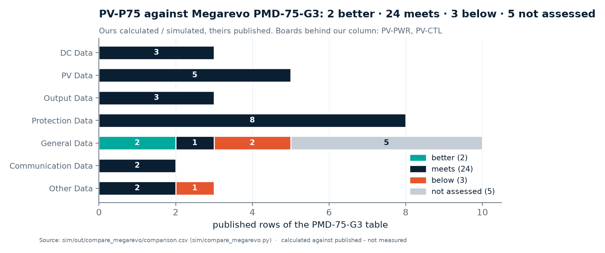

<!-- breadcrumb --> [Home](../../README.md) › [Documentation](../README.md) › Comparison with Megarevo

# 📐 Comparison with Megarevo

> How PV-P75 compares, row by row, with the published specification of Megarevo's PMD-75-G3 — and how every product compares with the owner's price benchmark.

---

> [!NOTE]
> **The table describes the cost-first boards** — power board PV-PWR rev A2 and control board PV-CTL rev A1. It is
> written by [`sim/compare_megarevo.py`](../../sim/compare_megarevo.py) from the design files named in its evidence
> column and was regenerated on 2026-10-05. Three rows are below Megarevo's published figure:
> [what they are and what closes them](#the-three-rows-below-megarevo).

## 🧭 The competitor products

| Product | What it is | Role in this project | What is on file |
|---|---|---|---|
| **PMD-75-G3** | 75 kW non-isolated bidirectional buck-boost DC/DC module with one centralised MPPT, 250–1000 V on both ports, 135 A, 3U (550 × 444 × 133 mm, 30 kg) | the target of PV-P75 ([REQUIREMENTS.md §2](../requirements/REQUIREMENTS.md#2-pv-p75--pv-p100--pv-p110-non-isolated)) | published specification table and datasheet v1.0, retrieved 2026-10-04: [spec.md](../reference-designs/megarevo/pmd-75-g3/spec.md) |
| **MPHV 1500 V string PCS** | 145–250 kW three-level string PCS, IP66, a complete AC/DC unit (not a DC/DC module) | the **price benchmark**: the 228 kW version sells for 1,500 USD = 6.6 USD/kW, as stated by the owner | datasheet V1.1 ([README](../reference-designs/megarevo/string-pcs-1500v/README.md)); the price is not published |
| **PMA0125** (PMA family) | 125 kW modular PCS, AC side | the target of PCS-P125 ([AC-02](../requirements/REQUIREMENTS.md#8-dc-to-ac-pcs-and-the-volume-basis-owner-instruction-2026-10-04)) | datasheets and user manual ([README](../reference-designs/megarevo/pma/README.md)) |

Megarevo publishes no price for the PMD-75-G3 itself ([COST-REVIEW.md §1](../requirements/COST-REVIEW.md#1-the-benchmark)).

---

## 🔬 Scorecard

<!-- BEGIN:megarevo-score -->

    &nbsp;of 34 published rows

<!-- END:megarevo-score -->

Source: <a href="../../sim/out/compare_megarevo/comparison.csv">comparison.csv</a> (written by <a href="../../sim/compare_megarevo.py">sim/compare_megarevo.py</a>) · calculated against published, not measured

The five *not assessed* rows (humidity, IP rating, dimensions, weight, mounting) need the mechanical design, which is
outside this project's scope ([REQUIREMENTS.md §1](../requirements/REQUIREMENTS.md#1-scope)).

## Row by row

<!-- BEGIN:megarevo-table -->

| Parameter | Megarevo PMD-75-G3 · published | PV-P75 · calculated or simulated | Verdict | Evidence |
|---|---|---|---|---|
| **DC Data** | | | | |
| Rated Power (kW) | 75 | 75 (3 interleaved phases on one power board) | ● meets | [module_spec.json](../../sim/out/pv_design/module_spec.json) |
| Max. Power (kW) | 82.5 | 82.5 | ● meets | [module_spec.json](../../sim/out/pv_design/module_spec.json) |
| MPPT Channels | 1 (Centralized 75kW Design) | 1 centralised tracker over the 3 interleaved phases | ● meets | [control_spec.json](../../sim/out/pv_control/control_spec.json) |
| **PV Data** | | | | |
| Operating Voltage Range (V) | 250~1000 | 250~1000 | ● meets | [module_spec.json](../../sim/out/pv_design/module_spec.json) |
| Full-Load Voltage Range (V) | 550~950 | 550~950 | ● meets | [module_spec.json](../../sim/out/pv_design/module_spec.json) |
| Max. Operating Current (A) | 135 | 135 (3 x 45 A) | ● meets | [module_spec.json](../../sim/out/pv_design/module_spec.json) |
| MPPT Tracking Accuracy | ≥99.9% | 99.932 % static (simulated), key /mppt/static_eta_min_in_window | ● meets | [control_spec.json](../../sim/out/pv_control/control_spec.json) |
| PV Start-up Voltage (V) | 250 | auxiliary supply starts at 206-215 V; the converter runs from 250 V | ● meets | [aux75_spec.json](../../sim/out/aux_hv_design/aux75_spec.json) |
| **Output Data** | | | | |
| Voltage Range (V) | 250~1000 | 250~1000 | ● meets | [module_spec.json](../../sim/out/pv_design/module_spec.json) |
| Full-Load Voltage Range (V) | 550~950 | 550~950 | ● meets | [module_spec.json](../../sim/out/pv_design/module_spec.json) |
| Max. Operating Current (A) | 135 | 135 (3 x 45 A) | ● meets | [module_spec.json](../../sim/out/pv_design/module_spec.json) |
| **Protection Data** | | | | |
| Over/Under Voltage Protection (Both Ports) | Supported | hardware trip 1058-1110 V (discrete comparators, latched) and firmware limit 1050 V on each port, stop below 240 V | ● meets | [cell_spec.json](../../sim/out/pv_design/cell_spec.json) [module_spec.json](../../sim/out/pv_design/module_spec.json) |
| Overcurrent Protection (Both Ports) | Supported | per phase: discrete hardware trip 68.9-79.9 A on the inductor current, controller comparator backup 81.1-101.9 A; battery port: hardware over-current trip 387-413 A | ● meets | [module_spec.json](../../sim/out/pv_design/module_spec.json) [port_spec.json](../../sim/out/port_design/port_spec.json) |
| Open-Circuit Protection (Both Ports) | Supported | full-power load rejection (calculated): the 1058-1110 V hardware over-voltage trip has the gates off 47 us after the crossing; the battery-side film bank needs 7 capacitors to stay under the device voltage limit and the drawn board has 7 | ● meets | [module_spec.json](../../sim/out/pv_design/module_spec.json) |
| Overtemperature Protection | Supported | hardware trips: heatsink 86.3-89.5 C, inductor 146.2-153.7 C; firmware derating below them | ● meets | [module_spec.json](../../sim/out/pv_design/module_spec.json) |
| Lightning Protection | Supported | monitored varistor network on the board, three Thinking Electronic TVT25751KFKG per port (pole to midpoint twice, midpoint to PE): effective level 3793 V pole-to-PE at 3 kA (calculated), 25 kA maximum | ● meets | [port_spec.json](../../sim/out/port_design/port_spec.json) |
| Insulation Impedance Detection | Supported | switched 992 kOhm test strings pole-to-PE through isolated solid-state relays on the power board; 33.3 kOhm threshold (1000 V / 30 mA) | ● meets | [port_spec.json](../../sim/out/port_design/port_spec.json) |
| Short-Circuit Protection | Supported | gate-driver DESAT at 9.26 V, gates off 0.62 us after detection (the 2 us device withstand is an assumption: no maker publishes one); 250 A aR fuse on each battery pole; the contactor is held closed above 967 A so the fuse clears first; faults of 967-1250 A must be cleared upstream within 0.26 s (installation requirement); the PV port has no fuse (current-limited source) | ● meets | [cell_spec.json](../../sim/out/pv_design/cell_spec.json) [port_spec.json](../../sim/out/port_design/port_spec.json) |
| Isolation Method | Non-Isolated | non-isolated, common negative rail (2-level non-inverting four-switch buck-boost (FSBB)) | ● meets | [cell_spec.json](../../sim/out/pv_design/cell_spec.json) |
| **General Data** | | | | |
| Max. Efficiency | 99% | 99.47 % peak at 900->1000 V, 49.5 kW (everything inside the module: phases, ports, auxiliary supply, contactor coils, fans); 98.77 % at the worst full-power corner, 45 C inlet | ▲ better | [module_spec.json](../../sim/out/pv_design/module_spec.json) |
| Operating Temperature Range (℃) | -30~60 (>45 Derating) | cold side: the fan is rated to -10 C (requirement and Megarevo: -30 C); the minimum rating of every other part has not been audited one by one. Hot side: full 82.5 kW to 45 C inlet at sea level, 75 % at 60 C (nominal thermal model; 73 % with the pessimistic model) | ▼ **below** | [module_spec.json](../../sim/out/pv_design/module_spec.json) |
| Operating Altitude (m) | ＞3000 Derating | derates with altitude: at 45 C inlet 86 % at 2000 m and 79 % at 3000 m; full power at 3000 m only up to about 25 C inlet. The inductor hot spot is the limit (144.7 C against a 146.2 C trip at sea level, 45 C inlet) | ▼ **below** | [module_spec.json](../../sim/out/pv_design/module_spec.json) |
| Relative Humidity | ≤95% (Non-condensing) | not assessed: mechanics and enclosure are outside this project's scope (schematic + BOM + simulation) | ○ not assessed | [REQUIREMENTS.md](../requirements/REQUIREMENTS.md) section 1 |
| IP Rating | IP20 | not assessed: mechanics and enclosure are outside this project's scope (schematic + BOM + simulation) | ○ not assessed | [REQUIREMENTS.md](../requirements/REQUIREMENTS.md) section 1 |
| Noise Level (dB) | ≤65 @1m | 60.8 dB(A) @1 m at full power, 45 C inlet (fan datasheet sound data + 3 dB installation estimate) | ▲ better | [module_spec.json](../../sim/out/pv_design/module_spec.json) |
| Cooling Method | Temperature-Controlled Smart Forced Air | forced air, 3 x Delta AFB1224SHE-F00 on one earthed heatsink, speed set through the fan supply from the heatsink and inductor NTCs; one fan failed still holds 84 % at 45 C | ● meets | [module_spec.json](../../sim/out/pv_design/module_spec.json) |
| Dimensions L*W*H (mm) | 550*444*133 | not assessed: mechanics and enclosure are outside this project's scope (schematic + BOM + simulation) | ○ not assessed | [REQUIREMENTS.md](../requirements/REQUIREMENTS.md) section 1 |
| Weight (kg) | 30 | not assessed: mechanics and enclosure are outside this project's scope (schematic + BOM + simulation) | ○ not assessed | [REQUIREMENTS.md](../requirements/REQUIREMENTS.md) section 1 |
| Mounting Method | Cabinet Fixed Installation | not assessed: mechanics and enclosure are outside this project's scope (schematic + BOM + simulation) | ○ not assessed | [REQUIREMENTS.md](../requirements/REQUIREMENTS.md) section 1 |
| **Communication Data** | | | | |
| Communication | 485, CAN | isolated CAN and isolated RS-485 on the control board, behind the module's one reinforced barrier | ● meets | [pv_ctrl.py](../../gen/pv_ctrl.py) |
| BMS Interface | Supported | over the same isolated CAN / RS-485 port (the cost-first build has no separate gateway card) | ● meets | [pv_ctrl.py](../../gen/pv_ctrl.py) |
| **Other Data** | | | | |
| Voltage Accuracy | ＜1%@100%Pn | <= 0.5 % (0.1 % dividers, ADC and reference) after the two-point calibration; a design budget, not an end-to-end calculation on the drawn boards (the control board's ADC share checks at 0.42 % worst) | ● meets | [ARCHITECTURE-COSTFIRST.md](../requirements/ARCHITECTURE-COSTFIRST.md) [PV-CTL_design_check.txt](../../hardware/PV-CTL/outputs/PV-CTL_design_check.txt) |
| Current Accuracy | ＜1%@100%Pn | <= 0.8 % at 135 A (shunt in the negative rail, temperature compensated) after the two-point calibration; a design budget, not an end-to-end calculation on the drawn boards (the control board's ADC share checks at 0.42 % worst) | ● meets | [ARCHITECTURE-COSTFIRST.md](../requirements/ARCHITECTURE-COSTFIRST.md) [PV-CTL_design_check.txt](../../hardware/PV-CTL/outputs/PV-CTL_design_check.txt) |
| Standby Power Consumption (W) | ＜20 | 11.4 with both contactors open, 21.0 with both held closed and the gates off, at 1000 V (8.1 / 15.3 at 600 V; estimate) | ▼ **below** | [module_spec.json](../../sim/out/pv_design/module_spec.json) |

Generated by <a href="../assets/figures_overview.py">figures_overview.py</a> from <a href="../../sim/out/compare_megarevo/comparison.csv">comparison.csv</a> (written by <a href="../../sim/compare_megarevo.py">sim/compare_megarevo.py</a>). Do not edit between the markers.

<!-- END:megarevo-table -->

## The three rows below Megarevo

| Row | Where the design stands (calculated) | Why | What closes it |
|---|---|---|---|
| Operating temperature | the fan is rated −10…+60 °C against a −30 °C requirement | the only fan found with a published −30 °C rating costs 88–113 USD | a qualified cold-start rule or the dearer fan — **open** ([R-05](../requirements/ARCHITECTURE-COSTFIRST.md#13-open-risks)) |
| Operating altitude | 79 % of full power at 3000 m and 45 °C inlet | the round-wire inductor runs at 144.7 °C against a 146.2 °C trip, so thinner air costs power directly | a litz-wound inductor (about +17 USD per phase) or more airflow ([D-054](../requirements/DECISIONS.md), [D-056](../requirements/DECISIONS.md)) |
| Standby power | 21.0 W with both contactors held at 1000 V; 11.4 W with them open | two contactor coils on the economiser at 2.35 W each | opening the PV contactor in standby, or a lower hold power |

The fourth row of the earlier table, open-circuit protection (full-power load rejection), was closed by the seventh
battery-side film capacitor drawn in PV-PWR rev A2 ([D-058](../requirements/DECISIONS.md)): the bank is now 315 µF
against 278.5 µF needed (calculated).

## What moved against the earlier platform

The table above describes the cost-first design. This is what changed when the eight-board platform was replaced.

| Row | Earlier platform | Cost-first design (table above) | Effect | Source |
|---|---|---|---|---|
| Communication | 2 × RS-485, 2 × CAN (one CAN FD), Ethernet → *better* | 1 CAN, 1 RS-485, stop input, status output | *meets* (Megarevo: 485, CAN) | [ARCHITECTURE-COSTFIRST §12](../requirements/ARCHITECTURE-COSTFIRST.md#12-what-the-lean-design-gives-up-plain-list-for-the-owner), item 6 |
| BMS interface | BMU-GW gateway daughtercard | the module's own isolated CAN / RS-485 port | *meets*, no separate gateway | ARCHITECTURE-COSTFIRST §0 |
| Operating temperature | fan rated to −40 °C | fan Delta AFB1224SHE-F00 rated **−10…+60 °C** | *below* — open | [R-05](../requirements/ARCHITECTURE-COSTFIRST.md#13-open-risks) |
| Operating altitude | full power at 3000 m up to a moderate inlet temperature | 79 % at 3000 m and 45 °C inlet | *below*: the cheaper inductor leaves no thermal reserve | [D-054](../requirements/DECISIONS.md), [D-056](../requirements/DECISIONS.md) |
| Max. efficiency | 99.48 % peak, 98.90 % worst full-power corner | 99.47 % peak, 98.77 % worst full-power corner at 45 °C inlet; junction about 110 °C instead of 78 °C | still *better* than the published 99 % | [module_spec.json](../../sim/out/pv_design/module_spec.json) |
| Standby power | 18.7 W (estimate) | 11.4 W with both contactors open, 21.0 W with both held, at 1000 V | *below* by 1.0 W in the held state | [module_spec.json](../../sim/out/pv_design/module_spec.json) |
| Lightning protection | DIN-rail arrester, 4,000 V protection level | monitored varistor network on the board, 3.79 kV effective level at 3 kA | *meets*; the varistors' thermal links have no DC rating | [D-042](../requirements/DECISIONS.md) |
| Short-circuit protection | 160 A gPV fuse on every pole, contactor hold-closed interlock | DESAT with turn-off booster; battery port: aR fuse per pole and a contactor held closed above 967 A; PV port: no fuse. Faults of 967–1250 A are left to the upstream battery protection | *meets*, with an **installation requirement** | [ARCHITECTURE-COSTFIRST §15](../requirements/ARCHITECTURE-COSTFIRST.md#15-changes-against-the-d-044-direction-where-i-refined-or-disagree) |
| Over-current / over-temperature trips | cell 72.4 A, port 202.5 A / 405 A; heatsink 86 °C | inductor window 68.9–79.9 A (narrowed by D-058), port 387–413 A, heatsink 86–90 °C, inductor 146–154 °C | *meets*, new thresholds | [PV-CTL design check](../../hardware/PV-CTL/outputs/PV-CTL_design_check.txt) |
| Voltage and current accuracy | 0.83 % after calibration (isolated sensing), calculated end to end | ≤ 0.5 % and ≤ 0.8 % as a design budget: dividers and shunts on the negative rail | *meets* on the budget; not yet an end-to-end calculation on the drawn boards | [ARCHITECTURE-COSTFIRST §6](../requirements/ARCHITECTURE-COSTFIRST.md) |

---

## 💰 Cost against the benchmark — all products

Source: <a href="../../bom/COST.md">bom/*_costed_BOM.csv</a>, <a href="../../sim/out/pcs_design/pcs_spec.json">pcs_spec.json</a>, <a href="../../gen/data/market_prices.csv">market_prices.csv</a> · estimated; the benchmark price is the owner's statement

| Product | Our figure | Against the benchmark | Source |
|---|---|---|---|
| PV-P75 (DC/DC, drawn boards) | BOM per kW in [the cost table](07-sourcing-and-cost.md#-the-costs-in-one-table) | about twice the current-adjusted benchmark BOM at 5,000 units | [bom/COST.md](../../bom/COST.md) |
| PCS-P125 (DC/AC, three-wire boards drawn) | the study's BOM per kW in [the cost table](07-sourcing-and-cost.md#-the-costs-in-one-table), read from `pcs_spec.json`; the drawn boards' module BOM in [bom/COST.md](../../bom/COST.md) | the drawn boards: about 1.9 × the ≈ 690 USD current-adjusted benchmark BOM at 5,000 units (1,292 USD, 10.3 USD/kW); the design study: about 1.6 × (1,131 USD, 9.0 USD/kW) (our arithmetic) | [D-063](../requirements/DECISIONS.md), [D-060](../requirements/DECISIONS.md), [ARCHITECTURE-PCS §12](../requirements/ARCHITECTURE-PCS.md#12-cost--both-products-catalogue-and-5000-units-against-the-benchmark) |
| DAB-D60 (isolated DC/DC) | earlier platform only; the cost-first outline estimates ≈ 1,140 USD (≈ 19 USD/kW) | well above, as expected for an isolated converter with a liquid cold plate | [ARCHITECTURE-COSTFIRST §16](../requirements/ARCHITECTURE-COSTFIRST.md#16-dab-d60-on-the-same-principles) |

The PCS-P125 design point also sits next to its own competitor: a calculated peak efficiency of 98.99 % (98.30 % at
125 kW and 750 V; [D-060](../requirements/DECISIONS.md), which replaced the study's 99.20 %, the 98.9–99.1 % of D-057
and the 99.09 % of D-059) against the 98.5 % maximum efficiency that the PMA0125 publishes (AC-02) — a calculation
against a published figure, not a measurement
([pcs_design/report.md](../../sim/out/pcs_design/report.md)).

---

## How to read this

- **Two kinds of evidence.** Megarevo's column is what Megarevo publishes. Ours is calculated or simulated from the
  design files named in the evidence column. *Better* means a calculated figure of ours exceeds a published figure of
  theirs — it is not a measured advantage. A calculated 99.5 % and a published 99 % are not the same kind of number.
- **Nothing of ours is bench-validated.** A verdict can move once hardware exists; the open risks that could move one
  are in [Risks and open items](12-risks-and-open-items.md).
- **Not assessed is not a failure.** Those rows need mechanics, which this project does not contain.
- **The benchmark is a selling price**, stated by the owner, of a larger AC/DC unit. Comparing it with a BOM needs the
  assumptions listed in [Sourcing and cost](07-sourcing-and-cost.md#-against-the-benchmark); change an assumption and the
  ratio moves.
- **The table is regenerated, not edited.** [`sim/compare_megarevo.py`](../../sim/compare_megarevo.py) writes the
  comparison; one run of [`figures_overview.py`](../assets/figures_overview.py) refreshes the scorecard, the badges and
  the table on this page.

---

<!-- footer --> ← [DAB-D60](10-dab-d60.md) · [Documentation index](../README.md) · [Risks and open items](12-risks-and-open-items.md) →
