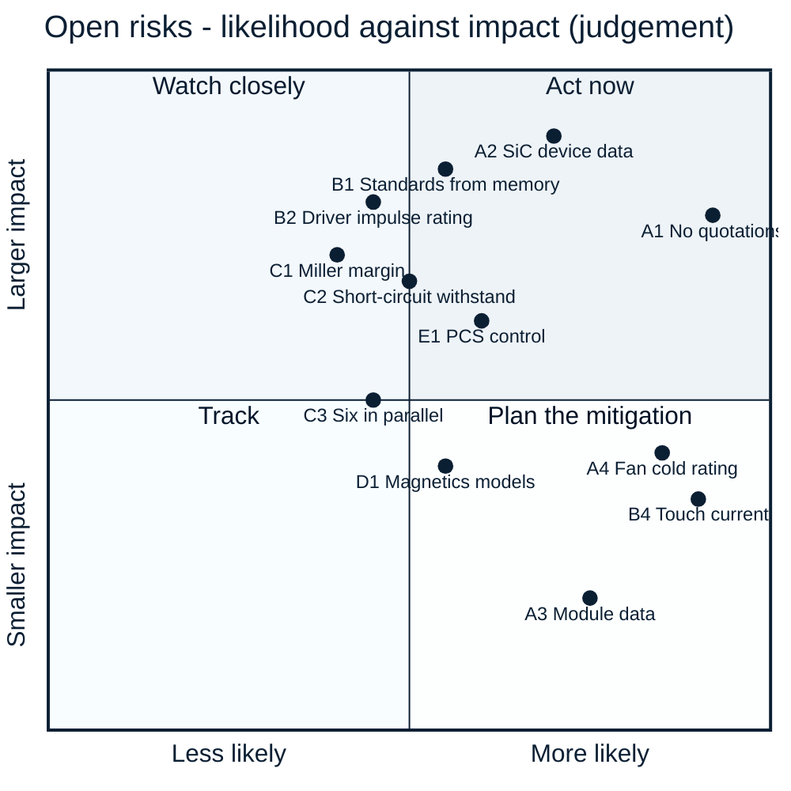

<!-- breadcrumb --> [Home](../../README.md) › [Documentation](../README.md) › Risks and open items

# ⚠️ Risks and open items

> Every open risk and unverified assumption on record, grouped and ranked, with its consequence and what would close it.

---

> [!IMPORTANT]
> **Why this list is long.** Nothing has been built, bought, quoted or measured. Every risk below is either a figure
> that rests on an estimate or an assumption, or a property that only hardware can show. The list is collected from
> the [decision register](../requirements/DECISIONS.md), the risk tables of
> [ARCHITECTURE-COSTFIRST.md §13](../requirements/ARCHITECTURE-COSTFIRST.md#13-open-risks) (R-01…R-18) and
> [ARCHITECTURE-PCS.md §11](../requirements/ARCHITECTURE-PCS.md#11-open-risks), and the "open items" sections of the
> simulation reports. Where a source has since closed an item, it is left out.

**Ranking.** Priority **1** = high impact and likely, or a release condition; **2** = high impact but less likely, or
likely with a contained consequence; **3** = worth tracking. Impact and likelihood are judgements from the records, not
calculations.

## ⚠️ Risk matrix

Point labels are the IDs used in the tables below. A point's position is a judgement made from the cited records.

---

## A · Evidence, supply and cost

| ID | Priority | Risk | Consequence | What closes it | Source |
|---|:---:|---|---|---|---|
| A1 | **1** | **No supplier quotations.** About three quarters of the PV-P75 catalogue total is engineering estimate; most of the 5,000-unit figure rests on assumed volume factors. The 800 USD working budget is not met | the gap to the benchmark cannot be judged honestly; it may be larger or smaller | quotations for the SiC devices, inductors, contactors, film capacitors and fuses | [D-052](../requirements/DECISIONS.md), [bom/COST.md](../../bom/COST.md) |
| A2 | **1** | **Sichain SG2M040170HJ** publishes no qualification statement, no short-circuit rating and no cosmic-ray data; its 4.07 USD price is an estimate that PV-P75 uses 24 times and PCS-P125 36 times | release blocked until the data exist; a price error multiplies; the failure rate at 950–1000 V is unknown | Sichain reliability report, short-circuit data and a quote; for PV-P75 the qualified Microchip MSC035SMA170B4 is an assembly variant — at 36 devices it does not fit the PCS budget | [D-043](../requirements/DECISIONS.md), [D-053](../requirements/DECISIONS.md), [pcs_design report](../../sim/out/pcs_design/report.md) |
| A3 | 3 | **Chinese power modules** (24 candidates): no public price, none on LCSC; short-circuit data on only a few sheets; HIITIO's sheets disagree with its OEM's for the same part | the module option cannot be evaluated; it stays a request-for-quotation alternate | quotations below the break-even prices; maker confirmation of the data | [D-055](../requirements/DECISIONS.md), [asia_modules.md](../../sim/data/asia_modules.md) |
| A4 | 2 | **Fan rated −10 °C** (Delta AFB1224SHE-F00) against the −30 °C requirement | a cold start below −10 °C is outside the fan's datasheet | a low-temperature variant, or a firmware rule for cold starts | [R-05](../requirements/ARCHITECTURE-COSTFIRST.md#13-open-risks), [D-045](../requirements/DECISIONS.md) |
| A5 | 2 | **Contactor and fuse data**: the Hongfa contactor does not state its coil-to-mounting insulation; the Hongfa aR fuse has no price and its curves are read conservatively; fuse–contactor coordination is not simulated in time | basic insulation unverified; a coordination gap or a wrong derating | a Hongfa statement and quote, or an insulating mounting plate; a time-domain coordination study | R-03, R-04 |
| A6 | 3 | **Film capacitors**: no Chinese price; the Faratronic second source is rated 1200 V at 70 °C instead of 1300 V | about half the voltage-life margin where the second source is used | quotes; use Faratronic only where the hot spot stays ≤ 70 °C | R-08, [ARCHITECTURE-COSTFIRST §12](../requirements/ARCHITECTURE-COSTFIRST.md#12-what-the-lean-design-gives-up-plain-list-for-the-owner) |

## B · Safety and insulation

| ID | Priority | Risk | Consequence | What closes it | Source |
|---|:---:|---|---|---|---|
| B1 | **1** | **Standard values transcribed from memory** (IEC 60664-1, EN 62477-1, IEC 62109-1/-2, CISPR 11, grid codes); whether a surge arrester may be credited for reinforced insulation is not verified against the standard text | barrier dimensions, the reinforced claim or the altitude rating could be wrong | buy the standards and check every value used in `sim/insulation.py` | [D-032](../requirements/DECISIONS.md), R-12, [insulation report](../../sim/out/insulation/report.md) |
| B2 | **1** | **Gate-driver impulse rating** 6,250 V against the 8 kV reinforced requirement: the NSI6651 passes only with the 6 kV arrester credit of B1 | if a certifier refuses the credit, the driver fails the reinforced requirement | TI UCC21750 is the footprint-compatible fallback (all but two pins) | [D-043](../requirements/DECISIONS.md) |
| B3 | 2 | **Varistor thermal links have no DC rating** | a certifier may require the IEC 61643-31 end-of-life tests on the board | certifier's position, or the tests | [D-042](../requirements/DECISIONS.md) |
| B4 | 2 | **High touch current**: the capacitance to PE of the cost-first port filter puts about 11 mA into the protective conductor | the product needs the high-touch-current measures (PE ≥ 10 mm² Cu and a warning label); the insulation monitor settles more slowly | accepted in D-048; to be confirmed by measurement | [D-048](../requirements/DECISIONS.md) |
| B5 | 2 | **No rated safety function**: the external stop is single-channel with no SIL/PL claim; the controller sits at up to 1000 V from earth | a cabinet that needs a rated stop must open its own DC switching devices; service needs isolated tools | installation requirement, stated in the product documentation | [ARCHITECTURE-COSTFIRST §12](../requirements/ARCHITECTURE-COSTFIRST.md#12-what-the-lean-design-gives-up-plain-list-for-the-owner) |
| B6 | 2 | **Battery-port fault band**: currents of 0.95–1.3 kA are left to the upstream battery protection | an installation requirement the integrator must meet | stated as an installation requirement | [ARCHITECTURE-COSTFIRST §15](../requirements/ARCHITECTURE-COSTFIRST.md#15-changes-against-the-d-044-direction-where-i-refined-or-disagree) |
| B7 | 3 | **Terminal-short survival given up**: a bolted short at a port's terminals probably destroys that port's legs; the module fails without fire and is repaired | repair, not a hazard | accepted in D-044 | [D-044](../requirements/DECISIONS.md) |
| B8 | 3 | **Heatsink temperature probes** bridge the live control and the earthed heatsink | basic insulation unproven at the probe | a probe with a stated lead-to-lug test voltage of at least 2.2 kV rms | R-10 |

## C · Power stage and gate drive

| ID | Priority | Risk | Consequence | What closes it | Source |
|---|:---:|---|---|---|---|
| C1 | **1** | **False turn-on margin** of the paralleled SiC gates rests on an estimated loop inductance and ringing | a parasitic turn-on at the extreme corner (high voltage, high current, hot) | the double-pulse test — the first bench item | [D-028](../requirements/DECISIONS.md), [D-043](../requirements/DECISIONS.md) |
| C2 | **1** | **Short-circuit withstand** of the Chinese SiC devices is assumed (no maker publishes one); in the DAB the driver's worst-case turn-off reaches 0.97 × the assumed hot withstand | a shoot-through at 1000 V and 150 °C may destroy the devices (the fuse clears) | maker data or a short-circuit test | [D-041](../requirements/DECISIONS.md), [dab_design report §0.1](../../sim/out/dab_design/report.md) |
| C3 | 2 | **Six paralleled TO-247 devices per switch** in the inverter: current sharing is a layout requirement, not a result | one device runs hot; derating | one-lot or binned devices; layout extraction; double-pulse test | [D-053](../requirements/DECISIONS.md) |
| C4 | 2 | **Common-mode transient margin** of the gate-drive channel: 150 V/ns rated against 124 V/ns calculated (× 1.21) | false trips or corrupted gate commands if the slew rate is higher than calculated | measurement on the first board | [PV-PWR design check](../../hardware/PV-PWR/outputs/PV-PWR_design_check.txt) |
| C5 | 2 | **Inductor-current sensor**: no dv/dt immunity figure at 124 V/ns | false or missed over-current trips | sensor data or a bench dv/dt test | R-07 |
| C6 | 3 | **Cosmic-ray failure rate** of the 1700 V devices: no maker curve; the 0.67 voltage rule is applied by scaling another maker's data | the failure-rate argument behind the device choice is an inference | maker data | [D-007](../requirements/DECISIONS.md), [pcs_design report](../../sim/out/pcs_design/report.md) |
| C8 | 2 | **Hardware over-current window** 68.9–79.9 A: its lower edge is 10.6 % above the 62.3 A normal peak (calculated; it was 66.2–79.9 A and 6 %) | nuisance trips at full current | an end-of-line offset trim or a better sensor; not taken ([D-058](../requirements/DECISIONS.md)): the 70 A target was missed by 1.1 A and that is accepted, because the sensor's own gain and zero tolerance take ±3.9 A of the 10 A available and 10 ppm/K resistors would buy only 0.4 A for 0.74 USD | [D-058](../requirements/DECISIONS.md), [D-056](../requirements/DECISIONS.md), [PV-CTL design check](../../hardware/PV-CTL/outputs/PV-CTL_design_check.txt) |
| C9 | 2 | **Comparator offset and the sensor's reference output.** The TLV9024's input offset is specified at 0 V common mode; at the 2.45 V trip node it can add 0.3–1.0 A (calculated from its common-mode rejection), which is in none of the control board's comparator bands yet. The over-current thresholds are now derived from each sensor's own reference output, which has no published drive rating or drift (it supplies 63 µA) | trip thresholds off by up to about 1 A, or drifting with the reference: a nuisance trip or a late one | the offset at the real common mode added to every comparator band; the maker's drive rating and drift for the reference output, or a bench measurement | [D-058](../requirements/DECISIONS.md), [PV-CTL design check](../../hardware/PV-CTL/outputs/PV-CTL_design_check.txt) |

Closed: **C7**, load rejection on the drawn power board, by [D-058](../requirements/DECISIONS.md) — the three-phase
board's battery-side film bank now has seven capacitors, 315 µF against 278.5 µF needed (calculated,
[module_spec.json](../../sim/out/pv_design/module_spec.json)).

## D · Magnetics and thermal

| ID | Priority | Risk | Consequence | What closes it | Source |
|---|:---:|---|---|---|---|
| D1 | 2 | **Magnetics are calculated only.** The two models (OpenMagnetics and our own) disagree by 27 % on a flat wire's copper loss; the PV inductor's hot spot is 145 °C against a 155 °C limit at the worst point; thermal networks are estimates | losses and temperatures can be higher than designed | a wound sample with calorimetric loss and a thermal run | [D-054](../requirements/DECISIONS.md), [magnetics report §7](../../sim/out/magnetics/report.md) |
| D2 | 2 | **DAB loss gap**: Wolfspeed's own measurements show about 2.5 × the loss our model gives; DAB-04 (99.2 % peak) is not claimed | derating at full power, or a transformer redesign | calorimetric loss split on the bench | [D-015](../requirements/DECISIONS.md), [dab_design report §13](../../sim/out/dab_design/report.md) |
| D3 | 2 | **PV-P100/110 is a derated build on the cost-first boards**: full power only up to 35 °C inlet (92 % at 45 °C), and on the 145 A lean battery port 100 kW needs at least 690 V | the four-phase build cannot be offered at the PV-P75's conditions | a litz-wound inductor (about +17 USD per phase) or more airflow; a 180 A port | [D-056](../requirements/DECISIONS.md), [module_spec.json](../../sim/out/pv_design/module_spec.json) |
| D6 | 2 | **Altitude**: PV-P75 holds 79 % at 3000 m and 45 °C inlet; Megarevo publishes no derating up to 3000 m. The round-wire inductor's hot spot (144.7 °C against a 146.2 °C trip) is the limit | less power at high sites | the same remedies as D3; a wound inductor sample to replace the estimate | [D-054](../requirements/DECISIONS.md), [D-056](../requirements/DECISIONS.md) |
| D7 | 3 | **Standby** 21.0 W with both contactors held at 1000 V against Megarevo's < 20 W (11.4 W with them open; estimate) | a published figure 1.0 W worse in one state | open the PV contactor in standby, or lower the hold power | [D-056](../requirements/DECISIONS.md), [D-058](../requirements/DECISIONS.md) |
| D4 | 3 | **EMI**: emission estimate against limits recalled from memory | one or two more cores, or a wound choke (+20–30 USD) | early pre-compliance scan; buy CISPR 11 | R-11 |
| D5 | 3 | **Gate-bias transformer** is a new custom part (partial-discharge-free between secondaries, ≤ 5 pF) | gate-rail or false-turn-on margin | samples with a partial-discharge test | R-06, [D-048](../requirements/DECISIONS.md) |

## E · Control and firmware

| ID | Priority | Risk | Consequence | What closes it | Source |
|---|:---:|---|---|---|---|
| E1 | 2 | **PCS-P125 control is not simulated**: current loop, PLL, grid forming, four-wire neutral control, THDi < 3 % at rated power; the filter holds the current-loop bandwidth to 0.75 kHz, and its stiff-grid resonance (7.7 kHz) is close to the 8.0 kHz limit | the power-stage design may need changes once the loops are designed; THDi < 3 % is unproven at that bandwidth | the control simulation (next step) | [D-053](../requirements/DECISIONS.md), [D-059](../requirements/DECISIONS.md), [ARCHITECTURE-PCS §9](../requirements/ARCHITECTURE-PCS.md#9-simulations-needed-before-boards-are-drawn-in-this-order) |
| E2 | 3 | **Firmware duplicates every hardware protection** and owns sequencing; a firmware error ends in a DESAT trip, a blown fuse or a watchdog reset | a damaged or stopped unit, not a hazard (by design) | the firmware safety-requirement list, with a start-up self-test of each trip path (firmware is out of scope here) | [D-050](../requirements/DECISIONS.md) |
| E3 | 3 | **Controller budget**: F280039C at 120 MHz for four phases; for the four-wire PCS 16 of 16 PWM and 23–24 of 25 ADC channels | control timing or a larger part (F28P550SJ, +0.39 USD) | a firmware timing estimate before the pin plan | R-14, [ARCHITECTURE-PCS §11](../requirements/ARCHITECTURE-PCS.md#11-open-risks) |
| E4 | 3 | **PV outer-loop phase margin** about 40° at the 250 V / 135 A constant-power-load corner (rule of thumb 45°) | adequate, with less margin than usual | a larger port capacitance or the inverter's own DC link raises it | [pv_control report §13](../../sim/out/pv_control/report.md) |

## F · PCS-P125 specific

| ID | Priority | Risk | Consequence | What closes it | Source |
|---|:---:|---|---|---|---|
| F1 | 2 | **Three-wire version on an earthed-neutral grid**: the battery's capacitance to earth (assumed 1–20 µF) limits operation below about 680 V | an installation limit or a transformer | the battery data; the common-mode study | [D-053](../requirements/DECISIONS.md) |
| F2 | 2 | **Grid-code and safety clauses** (EN 50549-1, IEC 62109-2, GB/T 34120, IEC 62116) are quoted from memory | relay redundancy, residual-current monitoring and anti-islanding details may change | buy the standards | D-053, ARCHITECTURE-PCS R-07 |
| F3 | 2 | **The inverter's filter is 37 % of its BOM and powder-core inductors were not searched.** The filter is 404 USD and 30 kg of the 1,092 USD at 5,000 units; the inductor search covered gapped nanocrystalline and amorphous C-cores only, L1 runs at its 140 °C hot-spot limit at 60 °C inlet, and no inductor price is quoted | powder block cores, which saturate softly and could be sized for the overload peak instead of the trip point, may be cheaper; a wrong inductor price moves the largest block; L1 has no thermal margin | add powder cores to the magnetics search before the filter is frozen; quotes; a wound L1 sample with a thermal run | [D-059](../requirements/DECISIONS.md), [tradeoff.md](../../sim/out/pcs_design/tradeoff.md) |
| F4 | 2 | **Threshold-voltage spread** of the SiC device (2.5–4.0 V) across six paralleled parts | at a 1.30 current share the hottest junction reaches 163 °C at 60 °C inlet, over the limit | threshold binning or one lot per switch, a Kelvin-source resistor per device, derating re-run | [D-057](../requirements/DECISIONS.md) |

---

## Where the records disagree

Not risks to the product, but places where two records say different things today. Each is stated, not resolved.

| What | Record 1 | Record 2 | Status |
|---|---|---|---|
| PV-P75 cost in the register | D-052 records the cost of the drawn boards before the inductor change | [bom/COST.md](../../bom/COST.md) after D-054 | the register row is historical by design |
| PV inductor winding | D-048 chose edgewise flat wire | D-054 reverses it (the tool had been run on the wrong conductor) | settled by D-054 |
| Standby power | ≈ 15 W (ARCHITECTURE-COSTFIRST R-18) | 8.1–21.0 W depending on contactor state and voltage ([module_spec.json](../../sim/out/pv_design/module_spec.json), [PV-PWR design check](../../hardware/PV-PWR/outputs/PV-PWR_design_check.txt)) | all estimates; the upper end exceeds Megarevo's < 20 W (risk D7) |
| Inductor-current sensor | TMR sensors (ARCHITECTURE-COSTFIRST §0) | STK-HO/A 75 drawn on PV-PWR (design check) | the board is the later record |

---

<!-- footer --> ← [Comparison with Megarevo](11-megarevo-comparison.md) · [Documentation index](../README.md) · [Repository guide](13-repository-guide.md) →
