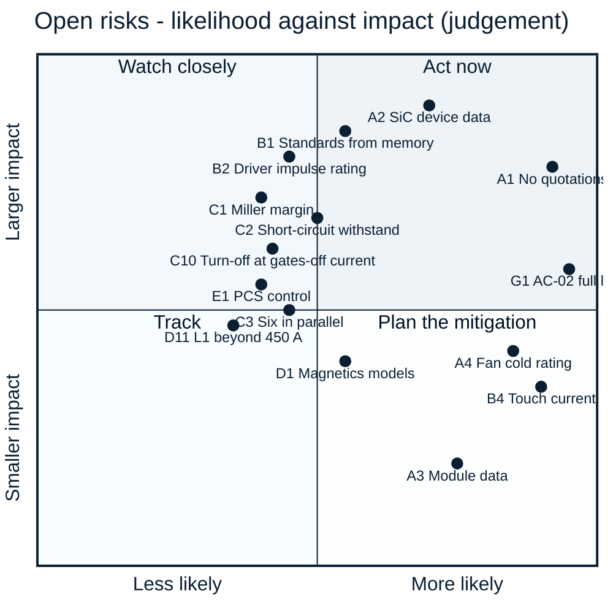

<!-- breadcrumb --> [Home](../../README.md) › [Documentation](../README.md) › Risks and open items

# ⚠️ Risks and open items

> Every open risk and unverified assumption on record, grouped and ranked, with its consequence and what would close it.

---

> [!IMPORTANT]
> **Why this list is long.** Nothing has been built, bought, quoted or measured. Every risk below is either a figure
> that rests on an estimate or an assumption, or a property that only hardware can show. The list is collected from
> the [decision register](../requirements/DECISIONS.md), the risk tables of
> [ARCHITECTURE-COSTFIRST.md §13](../requirements/ARCHITECTURE-COSTFIRST.md#13-open-risks) (R-01…R-18) and
> [ARCHITECTURE-PCS.md §11](../requirements/ARCHITECTURE-PCS.md#11-open-risks), the "open items" sections of the
> simulation reports and the open findings of the independent reviews ([review_pcm.csv](../../gen/data/review_pcm.csv),
> [review_r2.csv](../../gen/data/review_r2.csv), [review_r3.csv](../../gen/data/review_r3.csv)). Where a source has
> since closed an item, it is left out.

**Ranking.** Priority **1** = high impact and likely, or a release condition; **2** = high impact but less likely, or
likely with a contained consequence; **3** = worth tracking. Impact and likelihood are judgements from the records, not
calculations.

## 🔬 The re-check R2 of commit a427981 (2026-10-07)

An independent re-check of commit `a427981` raised 14 findings, R2-01 to R2-14 (8 high, 6 medium). Each was verified
against our own models first and then classified; the register [review_r2.csv](../../gen/data/review_r2.csv) holds every
row with its status, classification and closure — all 14 are closed there. The dispositions are
[D-078](../requirements/DECISIONS.md) (power stage and protection chain) and [D-079](../requirements/DECISIONS.md)
(control study and hand-over).

| Classification (register) | Findings | Count |
|---|---|---:|
| Confirmed | R2-01, R2-02, R2-03, R2-04, R2-06, R2-07, R2-12, R2-13, R2-14 | 9 |
| Firmware Handled | R2-05 | 1 |
| Already Fixed | R2-08, R2-10 | 2 |
| Not Applicable | R2-09 | 1 |
| Improvement Recommended | R2-11 | 1 |
| False Finding | — | 0 |

Closed in the register does not mean closed on the bench. The closures are calculations, simulations on averaged models
and zero-cost firmware, DAC, acceptance or gate-resistor values; what only hardware can show stays open below:
short-circuit survival (C2), the turn-off at the trip's gates-off current and its layout inductance (C10, C11), the L1
inductance beyond 450 A (D11), the RDS(on) distribution (F4), the ride-through margin (E6), the AC-start
residuals (E11), the residual-current monitor and the AC coil module (F7, F10) and the standards texts (B1, F2). Rows that
D-078 / D-079 resolved are marked where they stood.

## 🔬 The re-check R3 of commit 615e4b5 (2026-10-07)

A third independent re-check, of commit `615e4b5` (the R2 response), raised five findings, R3-01 to R3-05 (4 high,
1 low). Each was reproduced in our own checks first and then classified; the register
[review_r3.csv](../../gen/data/review_r3.csv) holds every row with its status, classification and closure — all five are
closed there. The disposition is [D-080](../requirements/DECISIONS.md): firmware rules the study executes, acceptance
rules the assembly carries and one requirement row (AC-04) — nothing added to the BOM.

| Classification (register) | Findings | Count |
|---|---|---:|
| Confirmed | R3-01, R3-02, R3-03, R3-04 | 4 |
| Improvement Recommended | R3-05 | 1 |
| Firmware Handled, Already Fixed, Not Applicable, False Finding | — | 0 |

Resolved by D-080 where the rows stood (simulated on the averaged or executed models, or calculated — not measured):

- **The synchronised close (R3-01, row E11).** SYNC → GFL / GFM commanded both AC contactor coils at once (54.9 /
  58.2 W against the 48 W live peak) and the invariant I12 excluded SYNC. Now SYNC → SYNC_CLOSE_K2 → settled 200 ms →
  SYNC_CLOSE_K1 → GFL or GFM; I12 holds without the exception; 646 state-event pairs and 24 fault runs over both starts
  pass; the coil peak is 38.9 / 42.2 W (three- / four-wire).
- **The four-wire trip coverage (R3-02, row E12).** The line-to-neutral short's 425 A first peak had been screened
  against the window's 426.0 A edge only, while the CMPSS backup's low edge is 423.9 A. With both layers replayed on
  their own signals the D-079 firmware trips the backup at the low plant corner; a 270 A clamp for a 5 ms onset window
  keeps every studied corner off both layers (hold 378.7 A, smallest margin 13.3 A). Every "may a layer trip" screen now
  uses 423.9 A: the per-sample clamp is 378.0 A (was 380.1 A), the ride-through onset margins are 20.5 / 18.4 A net of an
  ADC-noise term, and the stiff-grid fallback is re-tabled (row E6).
- **The DC/DC coordination assumption (R3-03, row E5).** The tail model's "DC/DC stops 50 µs after the PCS trip" was
  tied to no circuit (the PV board's external stop responds in 1.47 ms). It is replaced by the coupled PCS / PV
  trajectory with the PV modules' own protections: the island rides a full-load rejection up to a 909 V bus set point
  (two PV modules; 921 V with one), with requirements but no hardwired trip line below that.
- **The unscreened grade (R3-04, row F4).** The 209 A fallback was one corner (900 V, PF 0, 45 °C inlet) and the 110 %
  tier of a high-resistance population had never been limited. Now two module grades with full tier tables, bound to the
  module serial, and one 200 ms cap rule for both.
- **The off-grid envelope (R3-05, row E13).** It had been chosen to contain the simulated worst corner; it is now the
  ITIC-style points (FROM MEMORY), adopted by delegation as requirement AC-04, which the worst corner clears by
  +0.054 pu; the IEC 62040-3 classes are not met in the first 5 ms and not claimed.

New open items from D-080, in the tables below: the envelope as a delegated decision whose gates are the standards texts
and the bench (E13); the bench gates for the 13.3 A four-wire hold margin (E12), the 909 V set-point validity (E5) and
the 20.5 A onset margin (E6); Sichain's RDS(on) distribution or a ≤ 40 mΩ bin, which now decides the grade a
module ships in (F4); the relay timings, the synchronisation model, the path-check method and the ADC noise figure, all
ASSUMED (E11, E6); what the coupled DC/DC model leaves out — the PV modules' VB loop (not credited), the cable
between the modules, a switched model (E5).

## ⚠️ Risk matrix

Point labels are the IDs used in the tables below. A point's position is a judgement made from the cited records.

---

## A · Evidence, supply and cost

| ID | Priority | Risk | Consequence | What closes it | Source |
|---|:---:|---|---|---|---|
| A1 | **1** | **No supplier quotations.** About two thirds (66 %) of the PV-P75 catalogue total is engineering estimate; most of the 5,000-unit figure rests on assumed volume factors. The 800 USD working budget is not met (978 USD catalogue / 819 USD at 5,000 units, as of 2026-10-06) | the gap to the benchmark cannot be judged honestly; it may be larger or smaller | quotations for the SiC devices, inductors, contactors, film capacitors and fuses | [D-052](../requirements/DECISIONS.md), [bom/COST.md](../../bom/COST.md) |
| A2 | **1** | **Sichain SG2M040170HJ** publishes no qualification statement, no short-circuit rating and no cosmic-ray data; PV-P75 uses it 24 times, PCS-P125 36 times. The LCSC pass of 2026-10-05 found it on LCSC (C42456100: 5.07 USD at 90+, 418 in stock = 17 / 13 / 11 modules) — the earlier 4.07 USD estimate was 1.00 USD low — but no Chinese SiC datasheet states a short-circuit rating, AEC-Q101 is stated only by InventChip and the Western automotive parts, and no maker publishes a reliability report or a cosmic-ray curve | release blocked until the data exist; the failure rate at 950–1000 V is unknown | Sichain reliability report, short-circuit data and a quotation; for PV-P75 the qualified Microchip MSC035SMA170B4 is an assembly variant — at 36 devices it does not fit the PCS budget | [D-043](../requirements/DECISIONS.md), [D-053](../requirements/DECISIONS.md), [D-069](../requirements/DECISIONS.md), [lcsc_semis.md](../../sim/data/lcsc_semis.md) |
| A3 | 3 | **Chinese power modules** (24 candidates): no public price, none on LCSC; short-circuit data on only a few sheets; HIITIO's sheets disagree with its OEM's for the same part | the module option cannot be evaluated; it stays a request-for-quotation alternate | quotations below the break-even prices; maker confirmation of the data | [D-055](../requirements/DECISIONS.md), [asia_modules.md](../../sim/data/asia_modules.md) |
| A4 | 2 | **Fan rated −10 °C** (Delta AFB1224SHE-F00) against the −30 °C requirement. The cold start is now a modelled restriction ([D-072](../requirements/DECISIONS.md)): below −10 °C inlet the fans stay off and the power is limited to a passive-cooling table — PV-P75 19.2 / 17.5 / 15.5 kW at −30 / −20 / −10 °C inlet (pessimistic 6.8 / 0 / 0 kW), PV-P100/110 19.9 / 14.9 / 5.0 kW, none at 611 / 611 V; estimates ±50 %; the inlet warms from −30 to −10 °C in about 45–48 min | PV-20's −30 °C holds at reduced power only, on an unvalidated model | a cold-chamber run of the passive table; a −30 °C fan (Sanyo 9GT1224P1S001, +225–300 USD per module and over the SELV allocation) or a −20 °C one (ebm-papst 4414/2HHP, +63–198 USD) — priced, not taken | [R-05](../requirements/ARCHITECTURE-COSTFIRST.md#13-open-risks), [D-045](../requirements/DECISIONS.md), [D-072](../requirements/DECISIONS.md), [PV-CTL design check](../../hardware/PV-CTL/outputs/PV-CTL_design_check.txt) |
| A5 | 2 | **Contactor and fuse data**: the Hongfa contactor does not state its coil-to-mounting insulation; the Hongfa aR fuse has no price and its curves are read conservatively. For the inverter's 400 A fuse (HIITIO HCHVF1000-400A-38R) the coordination is now computed ([D-067](../requirements/DECISIONS.md), [port report §14](../../sim/out/port_design/report.md)): the port window (387–413 A) opens the contactor up to its 967–1,033 A hold-off band (2.3 openings at the band top); from 0.97 to 2.01 kA nothing clears quickly; the 400 A links clear 2.0–7.4 kA; above 7.5 kA prospective the contactor's short-circuit capacity (8 kA for 6 ms, 10 kA for 1.5 ms) is exceeded. The fuse chart's high-current tail does not match its tabulated I²t | basic insulation unverified; two installation requirements for the inverter's battery side: interrupt 0.97–2.01 kA within 2.5 s, and limit the prospective current at the PCS DC terminals to ≤ 7.5 kA (L/R ≤ 1 ms) or interrupt above it within the contactor's capacity; every installation condition of the modules, with the generated line it comes from, is collected in [INSTALLATION.md](../requirements/INSTALLATION.md) | a Hongfa statement and quote, or an insulating mounting plate; the HIITIO curve confirmed by quotation or test | R-03, R-04, [D-061](../requirements/DECISIONS.md), [D-067](../requirements/DECISIONS.md), [PCS-PWR design check](../../hardware/PCS-PWR/outputs/PCS-PWR_design_check.txt) |
| A6 | 3 | **Film capacitors**: no Chinese price; the Faratronic second source is rated 1200 V at 70 °C instead of 1300 V | about half the voltage-life margin where the second source is used | quotes; use Faratronic only where the hot spot stays ≤ 70 °C | R-08, [ARCHITECTURE-COSTFIRST §12](../requirements/ARCHITECTURE-COSTFIRST.md#12-what-the-lean-design-gives-up-plain-list-for-the-owner) |
| A7 | 3 | **Unpriced lines**: the TLV9024PWR comparator has no price row (one line on PV-P75 and PCS-P125, two on PV-P100/110 and PCS-P125-4W), and the four-wire build's 200 Ω DC precharge resistor (RFQ) has no estimate row | the module totals are lower bounds (PCS-P125-4W by three lines) | a price row for the TLV9024PWR and an estimate or quotation for the resistor | [bom/COST.md](../../bom/COST.md), [D-075](../requirements/DECISIONS.md), [D-076](../requirements/DECISIONS.md) |

## B · Safety and insulation

| ID | Priority | Risk | Consequence | What closes it | Source |
|---|:---:|---|---|---|---|
| B1 | **1** | **Standard values transcribed from memory** (IEC 60664-1, EN 62477-1, IEC 62109-1/-2, CISPR 11, grid codes); whether a surge arrester may be credited for reinforced insulation is not verified against the standard text. Since [D-079](../requirements/DECISIONS.md) / [D-080](../requirements/DECISIONS.md) the inverter's ride-through profile and its declared off-grid transient envelope are also set against classes recalled from memory — the envelope (requirement AC-04) *is* the ITIC curve's points as remembered, the IEC 62040-3 classes 1–3 are not met in the first 5 ms and not claimed, the ride-through profile follows EN 50549-1 / VDE-AR-N 4105 / 4110 | barrier dimensions, the reinforced claim or the altitude rating could be wrong; a declared envelope or ride-through profile could miss the real class | buy the standards and check every value used in `sim/insulation.py` and `sim/pcs_control.py` | [D-032](../requirements/DECISIONS.md), [D-079](../requirements/DECISIONS.md), [D-080](../requirements/DECISIONS.md), R-12, [insulation report](../../sim/out/insulation/report.md) |
| B2 | **1** | **Gate-driver impulse rating** 6,250 V against the 8 kV reinforced requirement: the NSI6651 passes only with the 6 kV arrester credit of B1 | if a certifier refuses the credit, the driver fails the reinforced requirement | TI UCC21750 is the footprint-compatible fallback (all but two pins) | [D-043](../requirements/DECISIONS.md) |
| B3 | 2 | **Varistor thermal links have no DC rating** | a certifier may require the IEC 61643-31 end-of-life tests on the board | certifier's position, or the tests | [D-042](../requirements/DECISIONS.md) |
| B4 | 2 | **High touch current**: the capacitance to PE of the cost-first port filter puts about 11 mA into the protective conductor | the product needs the high-touch-current measures (PE ≥ 10 mm² Cu and a warning label); the insulation monitor settles more slowly | accepted in D-048; to be confirmed by measurement | [D-048](../requirements/DECISIONS.md) |
| B5 | 2 | **No rated safety function**: the external stop is single-channel with no SIL/PL claim; the controller sits at up to 1000 V from earth | a cabinet that needs a rated stop must open its own DC switching devices; service needs isolated tools | installation requirement, stated in the product documentation | [ARCHITECTURE-COSTFIRST §12](../requirements/ARCHITECTURE-COSTFIRST.md#12-what-the-lean-design-gives-up-plain-list-for-the-owner) |
| B6 | 2 | **Battery-port fault band**: currents of 0.95–1.3 kA are left to the upstream battery protection | an installation requirement the integrator must meet | stated as an installation requirement | [ARCHITECTURE-COSTFIRST §15](../requirements/ARCHITECTURE-COSTFIRST.md#15-changes-against-the-d-044-direction-where-i-refined-or-disagree) |
| B7 | 3 | **Terminal-short survival given up**: a bolted short at a port's terminals probably destroys that port's legs; the module fails without fire and is repaired | repair, not a hazard | accepted in D-044 | [D-044](../requirements/DECISIONS.md) |
| B8 | 3 | **Heatsink temperature probes** bridge the live control and the earthed heatsink | basic insulation unproven at the probe | a probe with a stated lead-to-lug test voltage of at least 2.2 kV rms | R-10 |
| B9 | 2 | **Port A making current** (R-04): the PV port has no precharge; K_A closing onto the empty 290 µF bank at the array's Voc makes about 499 A (estimate) against a published making rating of 140 A at 20 V only. The port A declaration ([D-072](../requirements/DECISIONS.md)) therefore admits a current-limited PV array only (Isc ≤ 168.8 A, Voc ≤ 1000 V, ≤ 1.1 µF behind ≥ 11 µH), and with port B live the converter precharges bank A to within 20 V first; a stiff DC source on port A (about 7.4 kA peak) and reverse power into an array are not admitted | a contact weld on a PV-only start at high Voc | Hongfa's making rating at 1000 V; until then the declaration and the precharge-first rule | R-04, [D-072](../requirements/DECISIONS.md), [PV-PWR design check](../../hardware/PV-PWR/outputs/PV-PWR_design_check.txt) |
| B10 | 3 | **The insulation barrier audit stops on the new boards**: `sim/insulation.py` has no domain map for PV-CTL, PCS-PWR, PCS-PWR-4W, PCS-CTL, PORT-LEAN and PORT-LEAN-HOLD and its PV-PORT IMD-switch override no longer matches the drawn pair; a run ends with 102 problems and a non-zero exit (pre-existing tooling item, not raised by the review; the four-wire board added one) | the single barrier table does not cover the cost-first and inverter boards, although each board checks its own barrier parts in its design check | add the domain maps, fix the override, re-run | [08 · Verification](08-verification.md) |
| B11 | 3 | **Grid tap ties DC− to the grid** (both inverter builds, [D-074](../requirements/DECISIONS.md)): with the grid present the tap's lower diodes clamp DC− to the most negative phase, so the insulation monitor's reading is valid only with the AC side de-energised, and the DC link is fed from the AC side with the battery disconnected | a wrong insulation reading if the sequence is not followed; a live DC link with the battery isolated | declared: installation sequence, a firmware "not measurable" state and the label "two sources — isolate AC and DC; wait 15 min" | [09 · PCS-P125](09-pcs-p125.md#-start-up-from-the-grid) |

## C · Power stage and gate drive

| ID | Priority | Risk | Consequence | What closes it | Source |
|---|:---:|---|---|---|---|
| C1 | **1** | **False turn-on margin** of the paralleled SiC gates rests on an estimated loop inductance and ringing | a parasitic turn-on at the extreme corner (high voltage, high current, hot) | the double-pulse test — the first bench item | [D-028](../requirements/DECISIONS.md), [D-043](../requirements/DECISIONS.md) |
| C2 | **1** | **Short-circuit withstand** of the Chinese SiC devices is assumed (no maker publishes one). The DAB study's chain is corrected ([D-068](../requirements/DECISIONS.md)): the driver's deglitch is inside its DESAT-to-output delay, and in a short the current falls with the gate voltage, so the energy-equivalent full-current time is 1.112 µs = **0.99 × the assumed 1.12 µs hot withstand** (fault energy 1.09 J per device); the 2 × rule needs 0.50 and no lever inside the NSI6651 reaches it (best 0.61). The PV and PCS gate-drive presets print the same acceptance rule (PCS: tSC ≥ 2.07 µs, ESC ≥ 0.82 J at 1050 V; PV: 2.10 µs, 0.87 J at 1100 V). Since [D-078](../requirements/DECISIONS.md) (R2-07) the inverter keeps the pulse rating apart from survival: ID(pulse) 188 A per device for 100 µs is a thermal on-state rating that bounds a fault under load up to the DESAT detection (≤ 140 A per device); short-circuit survival stays a REQUIRES-HARDWARE-TEST release gate, never closed on paper | a shoot-through at 1000 V and 150 °C may destroy the devices (the fuse clears) | release block: for the DAB devices maker-confirmed tSC ≥ 2.22 µs at 1000 V / 150 °C (about 4.0 µs at 800 V / 25 °C) and ESC ≥ 2.18 J per device, the presets' figures for PV and PCS — or a short-circuit test on samples, or a device with a published withstand | [D-041](../requirements/DECISIONS.md), [D-068](../requirements/DECISIONS.md), [dab_design report §0.1](../../sim/out/dab_design/report.md), [PCS-PWR design check](../../hardware/PCS-PWR/outputs/PCS-PWR_design_check.txt), [GDRV-HB design check](../../hardware/GDRV-HB/outputs/GDRV-HB_design_check.txt) |
| C3 | 2 | **Six paralleled TO-247 devices per switch** in the inverter: static sharing is now bounded by an incoming acceptance rule (F4), dynamic sharing and the per-pair decoupling layout remain requirements, not results | one device runs hot; derating | layout extraction; double-pulse test | [D-053](../requirements/DECISIONS.md), [D-067](../requirements/DECISIONS.md) |
| C4 | 2 | **Common-mode transient margin** of the gate-drive channel: 150 V/ns rated against 124 V/ns calculated (× 1.21) | false trips or corrupted gate commands if the slew rate is higher than calculated | measurement on the first board | [PV-PWR design check](../../hardware/PV-PWR/outputs/PV-PWR_design_check.txt) |
| C5 | 2 | **Inductor-current sensor**: no dv/dt immunity figure at 124 V/ns | false or missed over-current trips | sensor data or a bench dv/dt test | R-07 |
| C6 | 3 | **Cosmic-ray failure rate** of the 1700 V devices: no maker curve; the 0.67 voltage rule is applied by scaling another maker's data | the failure-rate argument behind the device choice is an inference | maker data | [D-007](../requirements/DECISIONS.md), [pcs_design report](../../sim/out/pcs_design/report.md) |
| C8 | 2 | **Hardware over-current window** 67.9–80.5 A since the comparator's common-mode term is in it (was 68.9–79.9 A): its lower edge is 9.1 % above the 62.3 A normal peak (calculated) | nuisance trips at full current with every tolerance stacked | see C9 — the window's margin is now C9's open item | [D-058](../requirements/DECISIONS.md), [D-072](../requirements/DECISIONS.md), [PV-CTL design check](../../hardware/PV-CTL/outputs/PV-CTL_design_check.txt) |
| C10 | 2 | **Inverter turn-off at the trip's gates-off current** ([D-078](../requirements/DECISIONS.md), R2-02). The window trip turns the gates off at 520.5 A, not at the 485.5 A window top (3.54 µs chain on the L1 envelope, calculated); with RG,off raised from 7.5 to 8.75 Ω the leg deck peaks at 1,437 V against the 1,445 V limit (1,438 V at the over-voltage corner) and admits up to 533.6 A. The deck takes the bus and board inductance as 1.5 × an estimate; 8.75 Ω is not an E96 value (8.66 Ω would cost about 1.4 V of the 7.7 V margin) | a layout with more loop inductance than assumed would exceed 0.85 × VDSS at the trip | the layout's loop inductance extracted, or a double-pulse test near 520 A / 1,050 V; the resistor value fixed with the supplier | [D-078](../requirements/DECISIONS.md), [pcs_design report (e)](../../sim/out/pcs_design/report.md), [PCS-PWR design check](../../hardware/PCS-PWR/outputs/PCS-PWR_design_check.txt) |
| C11 | 3 | **Trip assumptions without maker data** ([D-078](../requirements/DECISIONS.md)): Sichain publishes no turn-off SOA — its switching data stop at 70 A per device, while the window trip turns off about 95 A on the hottest device; the TLV9024 delay is taken as 2 × typical (no maximum is published) and the sensor's 2 µs step as a pure delay; the CMPSS backup band (423.9–497.5 A as drawn, DAC ±1,075 codes) sits 6.6 A inside the 417.3–504.1 A requirement on stated DAC gain / INL, reference, resistor-drift and sensor errors | a slower comparator or a larger error moves the gates-off current toward the 533.6 A ceiling | a turn-off SOA statement from Sichain; comparator samples timed; the DAC setting checked against the idle null by the start-up self-test | [PCS-CTL design check](../../hardware/PCS-CTL/outputs/PCS-CTL_design_check.txt), [pcs_spec.json](../../sim/out/pcs_design/pcs_spec.json) `protection_chain` |
| C9 | 2 | **Comparator common-mode term: in every band now, the margin rule missed.** Since [D-072](../requirements/DECISIONS.md) every TLV9024 band on PV-CTL and PCS-CTL carries the common-mode error at the guaranteed 50 dB (3.3 V is unspecified; 0.98 A / 0.51 A at the inductor window) and the data-sheet delay at the real overdrive: the window is 67.9–80.5 A / 1.52 µs and misses the project's 1.10 × normal-peak floor (68.5 A) by 0.58 A, because the fixed error terms (5.84 A) exceed the corridor's half-width (5.69 A) — no ladder value restores it. Kept as drawn with a 1.09 margin and an [OPEN] line. The sensor's reference output still has no published drive rating or drift (63 µA drawn) | a nuisance trip at the worst ripple corner with every tolerance stacked, not a hazard; the top stays 0.7 A below the 81.1 A backup | the TLV9024's CMRR measured ≥ 60 dB at 3.3 V on samples plus 10 ppm/K ladder resistors (0.74 USD) give 68.8–79.8 A, which fits; the maker's data for the reference output | [D-058](../requirements/DECISIONS.md), [D-072](../requirements/DECISIONS.md), [PV-CTL design check](../../hardware/PV-CTL/outputs/PV-CTL_design_check.txt), PCM-19 |

Closed: **C7**, load rejection on the drawn power board, by [D-058](../requirements/DECISIONS.md) — the three-phase
board's battery-side film bank now has seven capacitors, 315 µF against 278.5 µF needed (calculated,
[module_spec.json](../../sim/out/pv_design/module_spec.json)); the re-based control model needs 243 µF
([D-065](../requirements/DECISIONS.md)). Closed by the review round: the leg commutation with the KEMET-era capacitor
values (R-08, its ESL part) — re-run with the drawn Jianghai parts, 1,374 V worst against 1,445 V
([D-072](../requirements/DECISIONS.md)). Closed by the re-check R2 ([D-078](../requirements/DECISIONS.md)): the
inverter's leg deck, which still carried the KEMET film values and chose RG,off at the 450 A window nominal
(R2-02) — it now runs the drawn Jianghai parts at the trip chain's gates-off current (C10). C9 stays as it is: the
re-check classified it *Improvement Recommended* (R2-11), a test gate, not a drawing change.

## D · Magnetics and thermal

| ID | Priority | Risk | Consequence | What closes it | Source |
|---|:---:|---|---|---|---|
| D1 | 2 | **Magnetics are calculated only.** The two models (OpenMagnetics and our own) disagree by 27 % on a flat wire's copper loss; the PV inductor's hot spot is 145 °C against a 155 °C limit at the worst point; thermal networks are estimates | losses and temperatures can be higher than designed | a wound sample with calorimetric loss and a thermal run | [D-054](../requirements/DECISIONS.md), [magnetics report §7](../../sim/out/magnetics/report.md) |
| D8 | 2 | **Magnetics tool data fault.** OpenMagnetics' data for the amorphous core material gives a permeability of 1 at 20, 24 and 30 kHz, so it modelled an air core there and flattered every amorphous inductor at those frequencies; only a change of the inverter's design point exposed it, when the script's own inductance differed from the tool's by a factor of 300 | every amorphous-core result at 20–30 kHz from before the fix is void: with the core modelled properly the 24 kHz inductor of D-059 loses 263 W instead of 165 W and reaches 198 °C against its 140 °C limit | the trade study is re-run (D-060); the script compares its own inductance with the tool's (limit 15 %) and now checks that its design files equal the study's selection; a wound sample with calorimetric loss decides | [D-060](../requirements/DECISIONS.md), [magnetics report](../../sim/out/magnetics/report.md) |
| D2 | 2 | **DAB loss gap**: Wolfspeed's own measurements show about 2.5 × the loss our model gives; DAB-04 (99.2 % peak) is not claimed | derating at full power, or a transformer redesign | calorimetric loss split on the bench | [D-015](../requirements/DECISIONS.md), [dab_design report §13](../../sim/out/dab_design/report.md) |
| D3 | 2 | **PV-P100/110 is a derated build on the cost-first boards**: full power only up to 35 °C inlet (92 % at 45 °C), and on the 145 A lean battery port 100 kW needs at least 690 V A→B and 697 V B→A (PV-P110: G3) | the four-phase build cannot be offered at the PV-P75's conditions | a litz-wound inductor (about +17 USD per phase) or more airflow; a 180 A port | [D-056](../requirements/DECISIONS.md), [module_spec.json](../../sim/out/pv_design/module_spec.json) |
| D6 | 2 | **Altitude: declared 2,000 m** ([D-075](../requirements/DECISIONS.md)). The control board's barrier B1 gives 8.0 mm clearance where 9.2 / 10.4 / 11.9 mm are needed at 3,000 / 4,000 / 5,000 m; it sets the ceiling, not the thermal model. Thermal: PV-P75 holds 86 / 79 / 70 % at 2,000 / 3,000 / 4,000 m and 45 °C inlet, the round-wire inductor's hot spot (144.7 °C against the 146.1–153.9 °C trip band) being the limit; the inverter has no altitude model. Megarevo publishes full rating to 3,000 m (PMD-75-G3) and 5,000 m with derating (PMA0125) | no high-site offer; two comparison rows below | the specified option: 15 mm (WW) isolators (+1.53 to +3.02 USD per board), AUX-T1 at ≥ 9.2 mm / 10.4 kV impulse, SELV connectors ≥ 9.2 mm from live copper — 3,000 m full, 5,000 m derated; a port-SPD credit to 4,000 m needs an effective level ≤ 4.0 kV and the standard's text (B1); thermally the remedies of D3 | [D-054](../requirements/DECISIONS.md), [D-056](../requirements/DECISIONS.md), [D-075](../requirements/DECISIONS.md), [PV-CTL design check](../../hardware/PV-CTL/outputs/PV-CTL_design_check.txt) |
| D7 | 3 | **Standby** 22.4 W with both contactors held at 1000 V against Megarevo's < 20 W (12.7 W with them open; 9.1 / 16.3 W at 600 V; estimate). It rose from 11.4 / 21.0 W when the control board's SELV logic grew to 1.44 W in standby (Ethernet not fitted) and the auxiliary was re-rated ([D-075](../requirements/DECISIONS.md), [D-076](../requirements/DECISIONS.md)); PV-P100/110's held case at the stack of maxima is 20.13 W (printed as a note, R-18) | a published figure 2.4 W worse in one state | open the PV contactor in standby, or lower the hold power | [D-056](../requirements/DECISIONS.md), [D-058](../requirements/DECISIONS.md), [D-076](../requirements/DECISIONS.md), [module_spec.json](../../sim/out/pv_design/module_spec.json) |
| D4 | 3 | **EMI**: emission estimate against limits recalled from memory | one or two more cores, or a wound choke (+20–30 USD) | early pre-compliance scan; buy CISPR 11 | R-11 |
| D5 | 3 | **Gate-bias transformer** is a new custom part (partial-discharge-free between secondaries, ≤ 5 pF) | gate-rail or false-turn-on margin | samples with a partial-discharge test | R-06, [D-048](../requirements/DECISIONS.md) |
| D9 | 3 | **DAB series-inductor saturation (MG-15).** The requirement rose to 700 A (1.1 × the 632 A trip fault peak of the corrected DR-03 chain); the rev M1 three-turn construction reaches 0.405 T = 0.99 Bsat at 100 °C against the 0.8 check limit, on a typical Bsat value | about 10 % margin to saturation in a fault | four turns on the same 4 × EE80: 0.74 Bsat, 106 W worst (three turns 90 W) — decided in the DAB cost round (rev M2) — or a measured L(I) to 700 A at 100 °C | [magnetics report §6](../../sim/out/magnetics/report.md), [D-068](../requirements/DECISIONS.md) |
| D10 | 3 | **Auxiliary transformer re-wound** for AUX-75 rev A3 ([D-076](../requirements/DECISIONS.md)): turns 50:9:10 on the same EC39A core, current sense 3 × 0.866 Ω. Only about ±0.5 % of nominal Lp works with that E96 value (the chosen low-ohm series must carry it); flux margin 5.7 % (10 % would need a larger core), drain margin 3.1 % at 1000 V; the design file's basis is the previous specification (values identical) | the re-rated live 30 W / 48 W rests on calculation | a new sample set: Lp, both leakages, switched capacitance, partial discharge | [D-076](../requirements/DECISIONS.md), [aux75_spec.json](../../sim/out/aux_hv_design/aux75_spec.json) |
| D11 | 2 | **The inverter's L1 beyond 450 A** ([D-078](../requirements/DECISIONS.md), R2-03). The construction table used to end at 450 A; the trajectory to 700 A (141 points; hot, −10 % and +5 % parts) puts the flux-rule current at 566 A and the hot knee of the +5 % part at 578 A; OpenMagnetics' saturation figure gives about 553 A, and the knee rests on a hot saturation flux of 1.40 T that is an estimate (the tool's figure for 2605SA1 is 1.35 T). The CMPSS backup band was lowered so that every gates-off current stays below the knee (ceiling 533.6 A); a core holding the flux rule to 650 A (+32 / +27 USD per three-wire module) was not taken | a softer core than calculated moves the knee toward the trip's gates-off current; above the knee only DESAT stops a fault | the first-article type test: L(I) to 600 A pulsed, at 25 °C and with the core at ≥ 100 °C, accepted at or above the envelope up to 566 A | [spec_pcs_l1.md §2a](../../sim/out/magnetics/spec_pcs_l1.md), [D-078](../requirements/DECISIONS.md) |

## E · Control and firmware

| ID | Priority | Risk | Consequence | What closes it | Source |
|---|:---:|---|---|---|---|
| E1 | 2 | **PCS-P125 control is calculated, not switched or measured** ([D-066](../requirements/DECISIONS.md), [D-077](../requirements/DECISIONS.md), [D-079](../requirements/DECISIONS.md)): an αβ PR current loop on the converter current, crossover 1,750 Hz on a stiff grid inside a usable band of 1.0–3.25 kHz; with the drawn Rd–Cd branch PM ≥ 48.5° and GM ≥ 12.1 dB from stiff to SCR 5 at the named corners, and since R2-01 a 1,944-case mixed-tolerance factorial plus 1,000 random cases at the assembly's tolerances (Cf, Cd ±10 %, Rd ±5 %): all meet the rule, worst PM 48.10°, worst GM 11.82 dB (rule 40° / 6 dB); THDi 1.5–2.2 % estimated with an assumed background distortion. Off-grid: voltage accuracy 0.59 % worst-case sum, frequency ±60 ppm, THDu 1.39 % / 2.11 % (three- / four-wire, analytical), imbalance ±0.41 % / ±0.76 %, the neutral-leg cascade PM 55°, GM 8.2 dB; full-load steps on the bounded averaged model 0.43 / 1.77 pu at the worst corner, inside the declared envelope — since [D-080](../requirements/DECISIONS.md) the ITIC-style points of requirement AC-04, cleared by +0.054 pu at the tightest point (the D-079 envelope, chosen to contain the simulation, and the 0.38 / 2.17 pu of D-077's unbounded model are superseded). The DC over-voltage limit at gates-off is now derived from the leg deck, 1,445 − 367 = 1,077 V (was the board's own 1,087 V), and the firmware ADC-PPB backup was lowered to 1,035 V (1,019–1,051 V) | no switched model, no measured THD or transient, no standards text (grid-code limits from memory), anti-islanding not simulated (IEC 62116 not claimed); not modelled: paralleled modules' restoration consensus, a switched neutral leg, the per-phase virtual reactance, mode B, droop and the PLL in the coupled four-wire cases, LVRT reactive-current injection | a switched simulation of the chosen loops; the first-millisecond excursion measured against the declared envelope at every corner; the standards bought; then the bench | [D-066](../requirements/DECISIONS.md), [D-077](../requirements/DECISIONS.md), [D-079](../requirements/DECISIONS.md), [D-080](../requirements/DECISIONS.md), [pcs_control report](../../sim/out/pcs_control/report.md) |
| E2 | 3 | **Firmware duplicates every hardware protection** and owns sequencing; a firmware error ends in a DESAT trip, a blown fuse or a watchdog reset | a damaged or stopped unit, not a hazard (by design) | the firmware safety-requirement list, with a start-up self-test of each trip path (firmware is out of scope here) | [D-050](../requirements/DECISIONS.md) |
| E3 | 3 | **Controller budget**: F280039C at 120 MHz — PV four phases untimed (R-14); the inverter's ISR is estimated at 4.8–5.8 µs = 31–37 % of its 15.6 µs period, 46.7 % in the four-wire row (operation count, cost model assumed), on 21 of 23 analog pins (22 for four-wire) and 6 (8) of 16 PWM outputs | control timing or a larger part (F28P550SJ, +0.39 USD) | a firmware timing measurement on the target | R-14, [pcs_control report §9](../../sim/out/pcs_control/report.md), [D-064](../requirements/DECISIONS.md), [D-077](../requirements/DECISIONS.md) |
| E4 | 3 | **PV outer-loop phase margin** 44.3° (three phases) / 45.0° (four) at the 250 V constant-power-load corner on the drawn port banks (rule of thumb 45°; modulus margin 0.67 / 0.66) | adequate, with less margin than usual | the inverter's own DC link raises it | [D-065](../requirements/DECISIONS.md), [pv_control report §5, §13](../../sim/out/pv_control/report.md) |
| E6 | 2 | **Deep grid dips on a stiff connection — a firmware measure whose margin needs the bench.** [D-077](../requirements/DECISIONS.md) left the first-millisecond onset on a stiff grid (484 / 465 / 445 A at 0 / 0.1 / 0.2 pu against the 426 A window) to a pre-fault derating. Since [D-079](../requirements/DECISIONS.md) (R2-05, *Firmware Handled*) the ride-through state lowers the per-sample clamp to 270 A and predicts on the Cf voltage with the divider's pole inverted: onset 382 A on a stiff 0 pu dip, 403 A at the worst corner and dip instant — **23.0 A** below the window's 426.0 A edge (rule ≥ 15 A) — and every peak ≤ 389 A from stiff to SCR 5 at 0–0.5 pu: rated current, no derating (simulated, averaged model). Since [D-080](../requirements/DECISIONS.md) (R3-02) the screen also takes the lower edge of the two hardware layers — the CMPSS backup's 423.9 A — and an ADC-noise term through the prediction (±1 LSB ASSUMED, 2.53 A worst case): **20.5 A** net to the window edge, **18.4 A** net to the backup's; the per-sample clamp outside the ride-through state is 378.0 A (was 380.1 A) | the margin rests on the averaged model's prediction and an assumed ADC noise; if a switched model or the bench shows less, the fallback applies: a grid-stiffness estimate (accuracy ASSUMED ±30 %) engages the derating 94.5 / 104.5 / 114.0 / 124.0 kW at 0 / 0.1 / 0.2 / 0.3 pu (was 95.5 / 105.5 / 115 kW) at an estimated SCR ≥ 61.7 (was 64.5) | the bench and a switched model confirm the margin; under the fallback the installation declaration applies — below 7.71 MVA fault level per 125 kW module no derating (was 8.07 MVA; n modules at one point: the point's fault level / n) | [D-077](../requirements/DECISIONS.md), [D-079](../requirements/DECISIONS.md), [D-080](../requirements/DECISIONS.md), [pcs_control report §4c](../../sim/out/pcs_control/report.md), [INSTALLATION.md](../requirements/INSTALLATION.md) |
| E7 | 3 | **DAB sensor offset — closed as a firmware rule.** The DAB60 check allowed ±4 A of uncalibrated transformer-current offset while the flux loop nulls the measured DC, so an un-nulled offset became a real bias of up to about 32 mT that the 5 A DC trip cannot see | none once the rule is implemented | FW-DAB-11: transformer- and branch-current offsets nulled at idle, a null outside ±4 A is a sensor fault ([D-071](../requirements/DECISIONS.md)); proven only when firmware exists | [D-071](../requirements/DECISIONS.md), [REFERENCE-LESSONS §6](../requirements/REFERENCE-LESSONS.md) |
| E8 | 3 | **Ethernet bridge CH9121T** ([D-075](../requirements/DECISIONS.md)): its supply current is published as typical only (× 1.3 assumed); LCSC showed 1,155 in stock; its LAN set-up tool cannot be disabled, so the firmware must authorise every write; one TCP client per port is assumed; the 25 MHz crystal's ageing reaches the 40 ppm limit near end of life | a supply-budget miss, a supply shortage, a configuration path that bypasses the firmware | a stock check before ordering, a measured supply current, the authorisation rule in firmware | [PCS-CTL design check](../../hardware/PCS-CTL/outputs/PCS-CTL_design_check.txt) |
| E9 | 3 | **No spare GPIO on the inverter's controller**: 55 of 55 used (the four-wire build needed none); a second firmware-read dry-contact input (the competitor's DI2) or a readable ready input would need a 56th | a later addition costs a function | take the HOLD read-back (the firmware can mirror it from IB_H) or a PCS-only line | [D-075](../requirements/DECISIONS.md), [pcs_ctrl_pin_plan.csv](../../gen/data/pcs_ctrl_pin_plan.csv) |
| E10 | 3 | **Thin control-board margins** ([D-075](../requirements/DECISIONS.md)): the status relay picks up at 4.66 V needed against 4.79 V at the coil at 85 °C with an assumed ≤ 3 Ω driver; the live +3.3 V rail is at 188 of 200 mA (94 %) | a relay that does not pick up hot; no room on +3.3 V | measure on the first board | [PV-CTL design check](../../hardware/PV-CTL/outputs/PV-CTL_design_check.txt) |
| E11 | 3 | **AC-start and synchronised-close residuals** ([D-079](../requirements/DECISIONS.md), R2-14; [D-080](../requirements/DECISIONS.md), R3-01). The AC start is part of the executed, fault-injected state machine (35 fault cases, no breach with the repairs H1–H5 and the own AC_STOP state); since D-080 the synchronised close of the DC-side start also closes one coil at a time (SYNC → SYNC_CLOSE_K2 → SYNC_CLOSE_K1; 24 fault runs over the grid and dead-bus starts, no breach), and the machine has 19 states and 15 invariants, all 646 state-event pairs passing. Left open: DC_MATCH stays in the transition table although the repaired start never enters it; the H2 numbers (2 s window, 0.2 % decay, 10 V below the tap peak) live in the executed code, not yet in the JSON; RECTIFY with a battery present has no DC-match timeout; H3 is checked at the coil command — a sag during the 100 ms pull-in is not among the 35 cases; relay timings and the 40 W auxiliary draw are ASSUMED; for the close also the module's synchronisation model, the path check after K1 (a small active-power step in grid-connected grid forming — an ASSUMED method) and the timeouts | a start-up or close path outside the checked set | the H2 numbers into the hand-over JSON, a DC-match timeout, a sag-during-pull-in case; relay and coil data from the RFQ; the synchronisation and the path check on the bench | [D-079](../requirements/DECISIONS.md), [D-080](../requirements/DECISIONS.md), [pcs_control report §9d, §9e](../../sim/out/pcs_control/report.md) |
| E12 | 2 | **Four-wire bolted output short: a firmware margin to the backup band** ([D-080](../requirements/DECISIONS.md), R3-02). With both trip layers replayed on their own signals (sensor delay and 200 kHz lag, board and node RC, the 32 kHz ripple up to 69.1 A peak-to-peak, each layer's threshold corners, the CMPSS 5-clock filter), the D-079 firmware let the CMPSS backup trip at the low plant corner (first peak 425 A against its 423.9 A edge). Adopted: a 270 A clamp for a 5 ms onset window on the shorted phase and the N leg — first peaks ≤ 351 A, hold 378.7 A, largest sensed peak 410.6 A, **13.3 A** below the backup's edge; no layer trips at any studied corner, the firmware trips at 200 ms, the healthy phases stay at 0.986–1.010 pu (simulated, averaged model with the ripple rebuilt) | the 13.3 A rests on the averaged model and a rebuilt triangle ripple (its exact shape and phase, the comparator's input noise and the N leg's own switching are not modelled); a unit outside the modelled bands trips in hardware — declared: latch, FAULT, no automatic clear after an over-current trip, a restart into a persisting short trips again, the third trip of a class within 10 min locks out (ASSUMED) | a switched model of the four-wire short and the bench; the backup band is not raised (D-078) | [D-080](../requirements/DECISIONS.md), [pcs_control report §9c-2](../../sim/out/pcs_control/report.md) |
| E13 | 2 | **The off-grid transient envelope is a delegated decision** ([D-080](../requirements/DECISIONS.md), R3-05, *Improvement Recommended*). The envelope a load may see on a 100 % step is requirement AC-04, adopted by delegation (D-051; the owner's instruction of 2026-10-07 to decide): the ITIC (CBEMA) curve's points as remembered — over 2 pu to 1 ms, 1.4 pu to 3 ms, 1.2 pu to 500 ms, 1.1 pu after; under 0 pu to 20 ms, 0.7 pu to 500 ms, 0.8 pu to 10 s, 0.9 pu after (FROM MEMORY). The simulated worst corner clears it by +0.054 pu at the tightest point (1.146 pu between 3 and 500 ms); the IEC 62040-3 classes 1–3 (FROM MEMORY) are not met in the first 5 ms (1.77 against 1.3 pu) and not claimed | a load that needs a tighter class (UPS grade, IEC 62040-3) is not served; the margin is an averaged-model figure and the points themselves are recalled, not read | the owner's confirmation or change of AC-04; the ITIC and IEC 62040-3 texts on file; the first milliseconds measured at every corner of the drawn parts | [D-080](../requirements/DECISIONS.md), [REQUIREMENTS.md AC-04](../requirements/REQUIREMENTS.md), [pcs_control report §7c](../../sim/out/pcs_control/report.md) |

## F · PCS-P125 specific

| ID | Priority | Risk | Consequence | What closes it | Source |
|---|:---:|---|---|---|---|
| F1 | 2 | **Three-wire version on an earthed-neutral grid**: the battery's capacitance to earth (assumed 1–20 µF) limits operation below about 680 V | an installation limit or a transformer | the battery data; the common-mode study | [D-053](../requirements/DECISIONS.md) |
| F2 | 2 | **Grid-code and safety clauses** (EN 50549-1, IEC 62109-2, GB/T 34120, IEC 62116) are quoted from memory; since [D-078](../requirements/DECISIONS.md) / [D-079](../requirements/DECISIONS.md) the residual-current monitor's trip thresholds, the reactive-current injection profile and the connection-code figures behind the ride-through declaration rest on them too, with the standard text as the gate | relay redundancy, residual-current monitoring, ride-through and anti-islanding details may change | buy the standards | D-053, [D-079](../requirements/DECISIONS.md), ARCHITECTURE-PCS R-07 |
| F3 | 2 | **The inverter's filter is 39 % of its BOM and powder-core inductors were not searched.** The filter is 443 USD and 39 kg of the 1,131 USD at 5,000 units; the inductor search covered gapped nanocrystalline and amorphous C-cores only, L1 runs at its 140 °C hot-spot limit at 60 °C inlet, and no inductor price is quoted. The exact frequency and inductance are not a firm result (the next two-level point is 11 USD away); the two-level choice is (148 USD below the cheapest compliant T-type) | powder block cores, which saturate softly and could be sized for the overload peak instead of the trip point, may be cheaper; a wrong inductor price moves the largest block; L1 has no thermal margin | add powder cores to the magnetics search before the filter is frozen; quotes; a wound L1 sample with a thermal run | [D-060](../requirements/DECISIONS.md), [tradeoff.md](../../sim/out/pcs_design/tradeoff.md) |
| F4 | 2 | **Six paralleled devices: acceptance rules and module grades whose feasibility is unconfirmed** ([D-067](../requirements/DECISIONS.md), [D-078](../requirements/DECISIONS.md)). *Matching:* RDS(on) of the six devices of a switch within ±5 % at VGS 18 V, 38 A pulsed, 25 °C; VGS(th) within ±0.25 V; one lot per switch — the hottest device then carries ≤ 1.08 × the mean and every 45 °C tier holds. *Absolute* (R2-07): the matching rule bounds the share, not the level, and the thermal model runs on typical RDS(on) — a switch of six 52 mΩ (data-sheet maximum) parts fails the 200 ms tier (9.68 V at 198 °C against the 6.39 V DESAT minimum), the 2-minute tier and 110 % continuous at 60 °C inlet; acceptance is therefore **RDS(on) ≤ 40.0 mΩ per device** in the same incoming measurement. *Grades* (R3-04, [D-080](../requirements/DECISIONS.md)): the result is a grade of the assembled module — **grade A** if every device passed, **grade B** otherwise (evaluated as six 52 mΩ devices per switch) — each with a full tier table over inlet 25–60 °C, 600–950 V DC, PF 1 and 0 and a cold or steady start. Grade A keeps the full tiers (198 / 216 / 259.2 A) to 45 °C and holds 198.0 / 216.0 / 242.9 A at 60 °C; grade B holds 196.8 / 207.5 / 207.5 A at 45 °C and 179.8 / 192.6 / 192.6 A at 60 °C (continuous / 2 min / 200 ms, steady start; no 110 % tier at 60 °C). The end-of-line test writes the grade's table into the controller's parameter set and the controller reports it with the module serial; no record = grade B (calculated; hot RDS(on) on the typical curve, ASSUMED). The single 209 A corner of D-078 is replaced | without the rules the data-sheet population takes 1.22 × the mean and 188 °C in the 45 °C 200 ms tier; the limit equals the data-sheet typical — the record estimates that a population centred on it puts about half the switches above the limit, and one such device makes the whole module grade B: no 200 ms tier above its 2-minute tier and, at 60 °C, no 110 % tier | Sichain's RDS(on) distribution or a ≤ 40 mΩ bin, with a price (RFQ) — it decides the grade mix; the integrator keeps the grade record with the module serial ([INSTALLATION.md](../requirements/INSTALLATION.md)) | [D-057](../requirements/DECISIONS.md), [D-067](../requirements/DECISIONS.md), [D-078](../requirements/DECISIONS.md), [D-080](../requirements/DECISIONS.md), [pcs_design report (b), (e)](../../sim/out/pcs_design/report.md) |
| F5 | 3 | **Desaturation re-coordinated with the overload** ([D-067](../requirements/DECISIONS.md)): the string is 2 × US1MH (was 3), trip band 6.41–9.37 V; at RG,off 8.75 Ω margin 1.07 at the 200 ms overload peak (66.2 A per device) at the predicted 162 °C junction, 1.00 at the 175 °C rating, 1.56 from a −30 °C inlet; a hard short is off 1.28 µs after it starts. The diodes' VF at 0.5 mA is extrapolated from typical curves; a switch of six data-sheet-maximum parts would reach 9.68 V at its own 198 °C junction, which the absolute acceptance rule of F4 handles ([D-078](../requirements/DECISIONS.md)); since [D-080](../requirements/DECISIONS.md) such a module is grade B, whose tier table is checked against the DESAT minimum at each inlet (6.31–6.45 V) | a nuisance trip of the 200 ms tier with maximum-RDS(on) parts — a protective stop, not a hazard | measure the string's VF | [D-061](../requirements/DECISIONS.md), [D-067](../requirements/DECISIONS.md), [PCS-PWR design check](../../hardware/PCS-PWR/outputs/PCS-PWR_design_check.txt) |
| F6 | 3 | **The hardware dead time is above the study's 300 ns**: 185–510 ns at the gates, and a firmware dead band below about 433 ns is stretched (turn-off 156 ns at RG,off 8.75 Ω) | dead-time compensation and the THDi budget assume 300 ns | compensate with the measured value, not the hand-over's 300 ns | [D-061](../requirements/DECISIONS.md), [PCS-PWR design check](../../hardware/PCS-PWR/outputs/PCS-PWR_design_check.txt) |
| F7 | 2 | **Phase-current sensor frozen; the residual-current monitor is a contract without a part** ([D-067](../requirements/DECISIONS.md), [D-078](../requirements/DECISIONS.md)). Sinomags STK-250HO/4 (IPN 250 A, ±625 A linear, 3.2 mV/A on its own 2.5 V reference, 200 kHz, 2 µs maximum step, 4.3 kV rms / 8 kV impulse, > 8 mm creepage) is drawn with PCS-CTL's window at 426.0–485.5 A and, since D-078, the CMPSS backup at 423.9–497.5 A (risk C11); its maker states no working voltage, no qualification and no dv/dt immunity. No type-B part was found that carries ≥ 180 A per phase through three (four) conductors; since R2-13 the residual-current monitor has a frozen RFQ contract: type B, trips in firmware at ≥ 1,250 mA continuous within 0.3 s and at 30 / 60 / 150 mA steps within 0.3 / 0.15 / 0.04 s, ±2.0 A range, output 2.50 V + 1.00 V/A (0.5–4.5 V), sensor fault ≤ 0.25 V or ≥ 4.75 V within 100 ms, a 50 mA DC test input driven from GPIO21, 5 V ≤ 50 mA, apertures 27 × 19 / 30.5 × 18 mm — all ASSUMED (IEC 62109-2 class figures from memory) until a part is chosen; its output impedance (≤ 44 Ω for the fault window) belongs in the RFQ; candidate class Magtron RCMU101SN-3P50G-6C | the residual-current protection cannot be confirmed; the phase sensor's insulation rests on its impulse and creepage figures | a quotation with a data sheet for a monitor meeting the contract; the phase sensor's working voltage from the maker and a bench dv/dt test | [D-061](../requirements/DECISIONS.md), [D-064](../requirements/DECISIONS.md), [D-067](../requirements/DECISIONS.md), [D-078](../requirements/DECISIONS.md), [PCS-PWR design check](../../hardware/PCS-PWR/outputs/PCS-PWR_design_check.txt) |
| F10 | 2 | **AC contactors and their coils** ([D-067](../requirements/DECISIONS.md), [D-076](../requirements/DECISIONS.md), [D-078](../requirements/DECISIONS.md)): no OEM data. Since R2-06 one coil contract — **20 W pull-in for ≤ 100 ms, 4 W hold** — is the single constant behind the budget, the contactor BOM text and the self-check; the 24 / 5.5 W the auxiliary's rating would allow is printed only as margin to that contract (4 / 1.5 W). Budgets on the re-rated auxiliary (30 W live, 48 W for 1 s): synchronised close 38.9 W three-wire / 42.2 W four-wire (reserve 9.1 / 5.8 W), running 22.9 / 26.2 W (reserve 7.1 / 3.8 W). The AC surge arresters are not monitored | a coil above the contract eats the 4 / 1.5 W margin and, beyond it, browns out the auxiliary at the close; an arrester failure goes unseen | an AC coil module meeting 20 / 4 W (RFQ); monitor the arresters | [D-067](../requirements/DECISIONS.md), [D-076](../requirements/DECISIONS.md), [D-078](../requirements/DECISIONS.md), [PCS-PWR design check](../../hardware/PCS-PWR/outputs/PCS-PWR_design_check.txt) |
| F11 | 3 | **Thin discharge margin and a second failure.** With the full connected capacitance (409.4 µF on the bus plus Cf, Cd and the auxiliary bulk) the bleeders reach 60 V after 14.7 min worst case (13.3 min nominal) against the "wait 15 min" label; a shorted DC-link capacitor over-stresses the other half (1.58 × UN at 950 V) for about 20 ms until the DC contactor opens | the label depends on tolerances; a first failure may cause a second | measured capacitance and bleeder tolerances; the label stays at 15 min | [D-067](../requirements/DECISIONS.md), [pcs_design report (d)](../../sim/out/pcs_design/report.md) |
| F12 | 3 | **L-N surge on the four-wire build**: the path is two varistors in series, 2 × 1,240 V = 2,480 V at 150 A (8/20 µs) against the 4 kV OVC III rated impulse at 230 V; a 3+1 arrangement (L-N varistors and an N-PE spark gap) would halve it | surge stress on line-to-neutral loads | a GDT data sheet on file, then the 3+1 circuit (with B3's DC-rating question) | [D-074](../requirements/DECISIONS.md), [PCS-PWR-4W design check](../../hardware/PCS-PWR-4W/outputs/PCS-PWR-4W_design_check.txt) |
| F13 | 3 | **DC-component measurement**: the regulator holds the output's DC component at its measurement floor (0.56 V of the 1.15 V limit), but the ADC gain drift of the two channels is an open term | an offset above 0.5 % Un | VGx and VGN on one ADC module, or nulling at no load (firmware) | [D-074](../requirements/DECISIONS.md), [D-077](../requirements/DECISIONS.md) |
| F14 | 3 | **Inverter cold start**: the fans are rated −10 °C; the PV module's passive-power rule ([D-072](../requirements/DECISIONS.md)) applies in principle but is not modelled for the inverter; 75 of the three-wire BOM's 128 orderable parts have no temperature-audit row | the −30 °C row stays below the PMA0125 | a passive table for the PCS, or a low-temperature fan; the temperature audit extended to the inverter modules | [D-074](../requirements/DECISIONS.md), [PCS comparison](../../sim/out/compare_megarevo_pcs/report.md) |
| F15 | 2 | **RFQ / CUSTOM parts without data sheets on the inverter**: the AC coil module, the 4-pole contactors, the type-B residual-current sensor (three and four conductors), the four-bar CM choke, the 220 Ω and 200 Ω precharge resistors (no pulse curve on file; the 200 Ω line is unpriced) | ratings, budgets and costs rest on class assumptions | requests for quotation with data sheets | [D-074](../requirements/DECISIONS.md), [D-076](../requirements/DECISIONS.md) |
| F16 | 3 | **Four-wire carrier ripple into a stiff grid**: 0.63 % of the rated peak at h640 at 950 V (three-wire 0.12 %, target 0.3 %; 0.04 % at SCR 50) | a pre-compliance finding on stiff connections | more L2 or the neutral leg's modulation | [D-074](../requirements/DECISIONS.md), [PCS-PWR-4W design check](../../hardware/PCS-PWR-4W/outputs/PCS-PWR-4W_design_check.txt) |

Closed on 2026-10-06 ([D-074](../requirements/DECISIONS.md)): **F8**, no start-up path from the AC side — both builds now
draw a grid tap (20 Ω + a 1.6 A / 500 V AC fuse per phase into six avalanche diodes, diode-OR into the auxiliary supply)
and an AC precharge (G7L-2A-X + 220 Ω on K_ACPRE), with a grid-start sequence in firmware ([09 · PCS-P125](09-pcs-p125.md#-start-up-from-the-grid));
**F9**, the four-wire build not drawn — PCS-PWR-4W and the four-wire assembly of PCS-CTL are drawn with a fourth
two-level leg (not a midpoint neutral), every check passes, and the neutral-leg loop was studied in
[D-077](../requirements/DECISIONS.md) ([09 · PCS-P125](09-pcs-p125.md#-the-four-wire-build-pcs-p125-4w)).

Resolved on 2026-10-07 by the re-check R2, where they stood: the stiff-grid pre-fault derating as the primary
ride-through measure (E6 — now the fallback behind the 270 A clamp, [D-079](../requirements/DECISIONS.md)); the AC start
outside the checked state machine (now executed with fault injection; residuals in E11); the unbounded 0.38 / 2.17 pu
off-grid transient (E1 — bounded at 0.43 / 1.77 pu, envelope declared); the two coil figures (F10 — one contract); the
CMPSS backup that could let the current run past the L1 knee (C11, D11 — band lowered on PCS-CTL,
[D-078](../requirements/DECISIONS.md)).

Resolved on 2026-10-07 by the re-check R3 ([D-080](../requirements/DECISIONS.md)), where they stood: the synchronised
close that commanded both AC coils at once (E11 — one coil at a time, the invariant without its exception); the
four-wire short screened against one trip layer (E12 — both layers replayed, a 5 ms onset clamp); the untied 50 µs DC/DC
stop (E5 — the coupled PCS / PV trajectory); the single-corner 209 A fallback for unscreened parts (F4 — two module
grades with full tier tables); the envelope chosen to contain the simulation (E13 — the ITIC-style points of AC-04). What
they leave open is in those rows.

## G · Requirements the calculations contradict

Owner's decisions: the requirement file is not edited by the design work ([REQUIREMENTS.md](../requirements/REQUIREMENTS.md)).

| ID | Priority | Risk | Consequence | What closes it | Source |
|---|:---:|---|---|---|---|
| G1 | **1** | **AC-02 "full load from 600 V at 400 V ±15 %" is not reachable** with the stated margins (5 % loop headroom and dead-time compensation assumed): rated current needs 605–643 V DC at a 400 V grid depending on the power factor (624 V to connect) and 698–737 V at 460 V; 590–600 V DC serves grids up to about 360 V only; with the grid 10 % high, rated current needs 672 V (stiff) / 790 V (SCR 5) | the rectangular requirement cannot be met; the firmware refuses operating points below the map | the owner's requirement decision | [D-067](../requirements/DECISIONS.md), [pcs_design report (f)](../../sim/out/pcs_design/report.md), [pcs_control report §10](../../sim/out/pcs_control/report.md) |
| G2 | 2 | **PV-P75 at 550 V: PV-04 / PV-07 against PV-05 / PV-08.** 75 kW at exactly 550 V needs 136.4 A at the port before loss (138.1 A at the source with the module loss) against the 135 A rating — inconsistent by 1 %. The module delivers 73.3 kW at 550 / 550 V and its rating from 562 V at equal port voltages (both directions, 35 and 45 °C inlet) | the full-load range starts at 562 V, not 550 V | the owner's requirement decision; published as is | [D-065](../requirements/DECISIONS.md), [pv_control report §12.3](../../sim/out/pv_control/report.md) |
| G3 | 2 | **PV-P110's 110 kW is an input-side rating.** The 27.5 kW per-phase limit is held at the source (PV) node, so A→B the module delivers 108.8 kW and never 110 kW; B→A it delivers 110 kW only from 765 V and at 35 °C inlet. PV-P100 is rated from 690 V A→B / 697 V B→A; at 60 °C inlet no product reaches its rating | the 110 kW figure needs a qualifier | state 110 kW as a PV-input rating, or reference the per-phase limit to the delivered side (+1.0 % on the cells at the unity points ≥ 750 V, which the thermal derating then has to hold) | [D-065](../requirements/DECISIONS.md), [envelope.csv](../../sim/out/pv_control/envelope.csv) |

---

## Where the records disagree

Not risks to the product, but places where two records say different things today. Each is stated, not resolved. Five
disagreements found while documenting the re-check R2 on 2026-10-07 were resolved at their source by the re-runs of the
same day and are no longer listed: the trip-chain figures (D-078 now states the board's 3.542 µs / 520.5 A beside its
3.572 µs / 520.8 A), the firmware over-voltage backup (the hand-over prints 1,019–1,051 V, 34.0 µs), the uncoordinated
DC/DC figures (all records then printed 0.59–0.75 ms, 1,048–1,110 V — D-080 has since recomputed them, row below), the
CMPSS backup's status (every generated record now reads "adopted on PCS-CTL (D-078)") and the module parity register
(its R2 figures were updated; its R3 figures are not, row below). Seven disagreements found by the 2026-10-05 documentation pass (DESAT band and hard-short response in D-067, the window edge in D-066, the pin-audit totals in D-070, the inverter thresholds in REFERENCE-LESSONS §6.2, the 400 A fuse sentence of the pcs_design report, the bandwidth statement) were resolved at their source the same day and are no longer listed.

| What | Record 1 | Record 2 | Status |
|---|---|---|---|
| PV-P75 cost in the register | D-052 records the cost of the drawn boards before the inductor change | [bom/COST.md](../../bom/COST.md) after D-054 | the register row is historical by design |
| PV inductor winding | D-048 chose edgewise flat wire | D-054 reverses it (the tool had been run on the wrong conductor) | settled by D-054 |
| Standby power | ≈ 15 W (ARCHITECTURE-COSTFIRST R-18); 12.6 / 22.3 W in [D-075](../requirements/DECISIONS.md) | 12.7 / 22.4 W at 1000 V for the module ([module_spec.json](../../sim/out/pv_design/module_spec.json), the comparison, [D-076](../requirements/DECISIONS.md)); 13.0 / 22.0 W in the power-board estimate ([PV-PWR design check](../../hardware/PV-PWR/outputs/PV-PWR_design_check.txt)) | all estimates; D-076 supersedes D-075's figure; the held case exceeds Megarevo's < 20 W (risk D7) |
| Inductor-current sensor | TMR sensors (ARCHITECTURE-COSTFIRST §0) | STK-HO/A 75 drawn on PV-PWR (design check) | the board is the later record |
| Inverter cost | the design study: 1,431 / 1,149 USD three-wire, 1,731 / 1,392 USD four-wire ([pcs_spec.json](../../sim/out/pcs_design/pcs_spec.json)) | the drawn boards: 1,588 / 1,348 USD and 1,924 / 1,635 USD ([bom/COST.md](../../bom/COST.md), as of 2026-10-06) | explained by D-063; both are shown and labelled |
| Inverter benchmark-equivalent BOM | ≈ 690 USD (ARCHITECTURE-PCS §12, AC-side current) | 744 USD ([bom/COST.md](../../bom/COST.md), gen/cost.py, 250 A DC-port current) | both quoted with their basis |
| DAB series-inductor saturation requirement | 700 A (D-068; dab report §13; magnetics check `lser_m1_b`) | 695 A = 1.1 × 632 A (dab report §0.1, DR-03 row); MG-15's recommendation and the magnetics report's cost section still say 635 A | these pages use 700 A |
| PV short-circuit timing | [pv_control report §9.3](../../sim/out/pv_control/report.md) adds the driver's 150–265 ns deglitch after the blanking: 1.17 µs typical / 1.51 µs worst | the gate-drive check times the deglitch inside the 360 ns DESAT-to-output delay ([GDRV-HB design check](../../hardware/GDRV-HB/outputs/GDRV-HB_design_check.txt)) | the control model is conservative by up to 265 ns |
| Small differences in today's register text | PM 56.4° / 1.4° (D-066); current-loop PM ≥ 57.6° (D-065); PV-P110 108.8 kW A→B (D-065) | 56.3° / 1.3° (pcs_control report); 57.5° for four phases (pv_control report); 108.75–108.99 kW at 750–950 V, 35 °C ([envelope.csv](../../sim/out/pv_control/envelope.csv)) | the generated reports are the records |

---

## 📐 Comparison summary

Both row-by-row comparisons, as their scripts print them (calculated against published; nothing measured), re-run on
2026-10-07 after the re-check R3: the counts did not move. In the PCS table two rows changed a figure, not a verdict —
the overload row and the operating-temperature row now print the 60 °C 200 ms tier as 243 A from the grade map
(grade A's lowest over 600–950 V, 242.9 A; it was 246 A, the 900 V point). The re-check R2 had put the bounded off-grid
transients (a 0 → rated step dips to 0.43 pu, rated → 0 overshoots to 1.75 pu, averaged model), THDu 1.39 / 2.11 % and the
efficiency rows 98.98 % peak / 98.29 % at full load into the same table. The remedies of the rows below are in
[Comparison with Megarevo](11-megarevo-comparison.md) and in the risks named here.

| Comparison | Result line (generated) | Rows below the published figure | Risks |
|---|---|---|---|
| PV-P75 against the PMD-75-G3 ([report](../../sim/out/compare_megarevo/report.md)) | 2 better, 24 meets, 3 below, 5 not assessed, 0 pending, out of 34 published rows | operating temperature (fan rated −10 °C); operating altitude (79 % at 3,000 m, declared 2,000 m); standby 22.4 W with both contactors held | A4, D6, D7 |
| PCS-P125 / PCS-P125-4W against the PMA0125 ([report](../../sim/out/compare_megarevo_pcs/report.md)) | 2 better, 38 meets, 4 below, 9 not assessed, 0 pending, out of 53 published rows | operating and full-load DC window on 3W+PE (624 / 643 V against 590 / 600 V); operating temperature (fans −10 °C); altitude 2,000 m against 5,000 m | G1, F14, D6 |
| Module parity register ([megarevo_2026_parity.csv](../../gen/data/megarevo_2026_parity.csv)) | 32 rows; gaps closed by D-074 to D-080; the PCS cells aligned to the R3 figures on 2026-10-07 | altitude (option specified, not fitted); the inverter's cold side; the AC SPD-failure alarm and the residual-current sensor (still RFQ; its contract frozen by D-078) | D6, F14, F10, F7, F15 |

---

<!-- footer --> ← [Comparison with Megarevo](11-megarevo-comparison.md) · [Documentation index](../README.md) · [Repository guide](13-repository-guide.md) →
