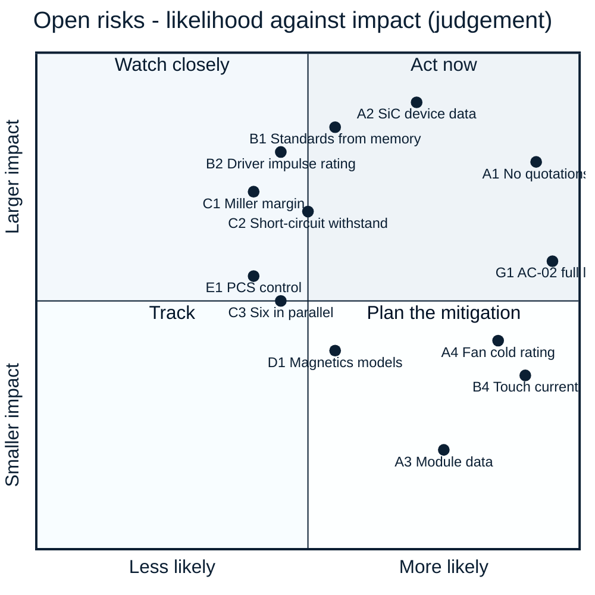

<!-- breadcrumb --> [Home](../../README.md) › [Documentation](../README.md) › Risks and open items

# ⚠️ Risks and open items

> Every open risk and unverified assumption on record, grouped and ranked, with its consequence and what would close it.

---

> [!IMPORTANT]
> **Why this list is long.** Nothing has been built, bought, quoted or measured. Every risk below is either a figure
> that rests on an estimate or an assumption, or a property that only hardware can show. The list is collected from
> the [decision register](../requirements/DECISIONS.md), the risk tables of
> [ARCHITECTURE-COSTFIRST.md §13](../requirements/ARCHITECTURE-COSTFIRST.md#13-open-risks) (R-01…R-18) and
> [ARCHITECTURE-PCS.md §11](../requirements/ARCHITECTURE-PCS.md#11-open-risks), the "open items" sections of the
> simulation reports and the open findings of the independent review ([review_pcm.csv](../../gen/data/review_pcm.csv)).
> Where a source has since closed an item, it is left out.

**Ranking.** Priority **1** = high impact and likely, or a release condition; **2** = high impact but less likely, or
likely with a contained consequence; **3** = worth tracking. Impact and likelihood are judgements from the records, not
calculations.

## ⚠️ Risk matrix

Point labels are the IDs used in the tables below. A point's position is a judgement made from the cited records.

---

## A · Evidence, supply and cost

| ID | Priority | Risk | Consequence | What closes it | Source |
|---|:---:|---|---|---|---|
| A1 | **1** | **No supplier quotations.** About two thirds (66 %) of the PV-P75 catalogue total is engineering estimate; most of the 5,000-unit figure rests on assumed volume factors. The 800 USD working budget is not met (976 USD catalogue / 817 USD at 5,000 units, as of 2026-10-05) | the gap to the benchmark cannot be judged honestly; it may be larger or smaller | quotations for the SiC devices, inductors, contactors, film capacitors and fuses | [D-052](../requirements/DECISIONS.md), [bom/COST.md](../../bom/COST.md) |
| A2 | **1** | **Sichain SG2M040170HJ** publishes no qualification statement, no short-circuit rating and no cosmic-ray data; PV-P75 uses it 24 times, PCS-P125 36 times. The LCSC pass of 2026-10-05 found it on LCSC (C42456100: 5.07 USD at 90+, 418 in stock = 17 / 13 / 11 modules) — the earlier 4.07 USD estimate was 1.00 USD low — but no Chinese SiC datasheet states a short-circuit rating, AEC-Q101 is stated only by InventChip and the Western automotive parts, and no maker publishes a reliability report or a cosmic-ray curve | release blocked until the data exist; the failure rate at 950–1000 V is unknown | Sichain reliability report, short-circuit data and a quotation; for PV-P75 the qualified Microchip MSC035SMA170B4 is an assembly variant — at 36 devices it does not fit the PCS budget | [D-043](../requirements/DECISIONS.md), [D-053](../requirements/DECISIONS.md), [D-069](../requirements/DECISIONS.md), [lcsc_semis.md](../../sim/data/lcsc_semis.md) |
| A3 | 3 | **Chinese power modules** (24 candidates): no public price, none on LCSC; short-circuit data on only a few sheets; HIITIO's sheets disagree with its OEM's for the same part | the module option cannot be evaluated; it stays a request-for-quotation alternate | quotations below the break-even prices; maker confirmation of the data | [D-055](../requirements/DECISIONS.md), [asia_modules.md](../../sim/data/asia_modules.md) |
| A4 | 2 | **Fan rated −10 °C** (Delta AFB1224SHE-F00) against the −30 °C requirement. The cold start is now a modelled restriction ([D-072](../requirements/DECISIONS.md)): below −10 °C inlet the fans stay off and the power is limited to a passive-cooling table — PV-P75 19.2 / 17.5 / 15.5 kW at −30 / −20 / −10 °C inlet (pessimistic 6.8 / 0 / 0 kW), PV-P100/110 19.9 / 14.9 / 5.0 kW, none at 611 / 611 V; estimates ±50 %; the inlet warms from −30 to −10 °C in about 45–48 min | PV-20's −30 °C holds at reduced power only, on an unvalidated model | a cold-chamber run of the passive table; a −30 °C fan (Sanyo 9GT1224P1S001, +225–300 USD per module and over the SELV allocation) or a −20 °C one (ebm-papst 4414/2HHP, +63–198 USD) — priced, not taken | [R-05](../requirements/ARCHITECTURE-COSTFIRST.md#13-open-risks), [D-045](../requirements/DECISIONS.md), [D-072](../requirements/DECISIONS.md), [PV-CTL design check](../../hardware/PV-CTL/outputs/PV-CTL_design_check.txt) |
| A5 | 2 | **Contactor and fuse data**: the Hongfa contactor does not state its coil-to-mounting insulation; the Hongfa aR fuse has no price and its curves are read conservatively. For the inverter's 400 A fuse (HIITIO HCHVF1000-400A-38R) the coordination is now computed ([D-067](../requirements/DECISIONS.md), [port report §14](../../sim/out/port_design/report.md)): the port window (387–413 A) opens the contactor up to its 967–1,033 A hold-off band (2.3 openings at the band top); from 0.97 to 2.01 kA nothing clears quickly; the 400 A links clear 2.0–7.4 kA; above 7.5 kA prospective the contactor's short-circuit capacity (8 kA for 6 ms, 10 kA for 1.5 ms) is exceeded. The fuse chart's high-current tail does not match its tabulated I²t | basic insulation unverified; two installation requirements for the inverter's battery side: interrupt 0.97–2.01 kA within 2.5 s, and limit the prospective current at the PCS DC terminals to ≤ 7.5 kA (L/R ≤ 1 ms) or interrupt above it within the contactor's capacity | a Hongfa statement and quote, or an insulating mounting plate; the HIITIO curve confirmed by quotation or test | R-03, R-04, [D-061](../requirements/DECISIONS.md), [D-067](../requirements/DECISIONS.md), [PCS-PWR design check](../../hardware/PCS-PWR/outputs/PCS-PWR_design_check.txt) |
| A6 | 3 | **Film capacitors**: no Chinese price; the Faratronic second source is rated 1200 V at 70 °C instead of 1300 V | about half the voltage-life margin where the second source is used | quotes; use Faratronic only where the hot spot stays ≤ 70 °C | R-08, [ARCHITECTURE-COSTFIRST §12](../requirements/ARCHITECTURE-COSTFIRST.md#12-what-the-lean-design-gives-up-plain-list-for-the-owner) |

## B · Safety and insulation

| ID | Priority | Risk | Consequence | What closes it | Source |
|---|:---:|---|---|---|---|
| B1 | **1** | **Standard values transcribed from memory** (IEC 60664-1, EN 62477-1, IEC 62109-1/-2, CISPR 11, grid codes); whether a surge arrester may be credited for reinforced insulation is not verified against the standard text | barrier dimensions, the reinforced claim or the altitude rating could be wrong | buy the standards and check every value used in `sim/insulation.py` | [D-032](../requirements/DECISIONS.md), R-12, [insulation report](../../sim/out/insulation/report.md) |
| B2 | **1** | **Gate-driver impulse rating** 6,250 V against the 8 kV reinforced requirement: the NSI6651 passes only with the 6 kV arrester credit of B1 | if a certifier refuses the credit, the driver fails the reinforced requirement | TI UCC21750 is the footprint-compatible fallback (all but two pins) | [D-043](../requirements/DECISIONS.md) |
| B3 | 2 | **Varistor thermal links have no DC rating** | a certifier may require the IEC 61643-31 end-of-life tests on the board | certifier's position, or the tests | [D-042](../requirements/DECISIONS.md) |
| B4 | 2 | **High touch current**: the capacitance to PE of the cost-first port filter puts about 11 mA into the protective conductor | the product needs the high-touch-current measures (PE ≥ 10 mm² Cu and a warning label); the insulation monitor settles more slowly | accepted in D-048; to be confirmed by measurement | [D-048](../requirements/DECISIONS.md) |
| B5 | 2 | **No rated safety function**: the external stop is single-channel with no SIL/PL claim; the controller sits at up to 1000 V from earth | a cabinet that needs a rated stop must open its own DC switching devices; service needs isolated tools | installation requirement, stated in the product documentation | [ARCHITECTURE-COSTFIRST §12](../requirements/ARCHITECTURE-COSTFIRST.md#12-what-the-lean-design-gives-up-plain-list-for-the-owner) |
| B6 | 2 | **Battery-port fault band**: currents of 0.95–1.3 kA are left to the upstream battery protection | an installation requirement the integrator must meet | stated as an installation requirement | [ARCHITECTURE-COSTFIRST §15](../requirements/ARCHITECTURE-COSTFIRST.md#15-changes-against-the-d-044-direction-where-i-refined-or-disagree) |
| B7 | 3 | **Terminal-short survival given up**: a bolted short at a port's terminals probably destroys that port's legs; the module fails without fire and is repaired | repair, not a hazard | accepted in D-044 | [D-044](../requirements/DECISIONS.md) |
| B8 | 3 | **Heatsink temperature probes** bridge the live control and the earthed heatsink | basic insulation unproven at the probe | a probe with a stated lead-to-lug test voltage of at least 2.2 kV rms | R-10 |
| B9 | 2 | **Port A making current** (R-04): the PV port has no precharge; K_A closing onto the empty 290 µF bank at the array's Voc makes about 499 A (estimate) against a published making rating of 140 A at 20 V only. The port A declaration ([D-072](../requirements/DECISIONS.md)) therefore admits a current-limited PV array only (Isc ≤ 168.8 A, Voc ≤ 1000 V, ≤ 1.1 µF behind ≥ 11 µH), and with port B live the converter precharges bank A to within 20 V first; a stiff DC source on port A (about 7.4 kA peak) and reverse power into an array are not admitted | a contact weld on a PV-only start at high Voc | Hongfa's making rating at 1000 V; until then the declaration and the precharge-first rule | R-04, [D-072](../requirements/DECISIONS.md), [PV-PWR design check](../../hardware/PV-PWR/outputs/PV-PWR_design_check.txt) |
| B10 | 3 | **The insulation barrier audit stops on the new boards**: `sim/insulation.py` has no domain map for PV-CTL, PCS-PWR, PCS-CTL, PORT-LEAN and PORT-LEAN-HOLD and its PV-PORT IMD-switch override no longer matches the drawn pair; a run ends with 101 problems and a non-zero exit (pre-existing tooling item, not raised by the review) | the single barrier table does not cover the cost-first boards, although each board checks its own barrier parts in its design check | add the domain maps, fix the override, re-run | [08 · Verification](08-verification.md) |

## C · Power stage and gate drive

| ID | Priority | Risk | Consequence | What closes it | Source |
|---|:---:|---|---|---|---|
| C1 | **1** | **False turn-on margin** of the paralleled SiC gates rests on an estimated loop inductance and ringing | a parasitic turn-on at the extreme corner (high voltage, high current, hot) | the double-pulse test — the first bench item | [D-028](../requirements/DECISIONS.md), [D-043](../requirements/DECISIONS.md) |
| C2 | **1** | **Short-circuit withstand** of the Chinese SiC devices is assumed (no maker publishes one). The DAB study's chain is corrected ([D-068](../requirements/DECISIONS.md)): the driver's deglitch is inside its DESAT-to-output delay, and in a short the current falls with the gate voltage, so the energy-equivalent full-current time is 1.112 µs = **0.99 × the assumed 1.12 µs hot withstand** (fault energy 1.09 J per device); the 2 × rule needs 0.50 and no lever inside the NSI6651 reaches it (best 0.61). The PV and PCS gate-drive presets print the same acceptance rule (PCS: tSC ≥ 2.07 µs, ESC ≥ 0.82 J at 1050 V; PV: 2.10 µs, 0.87 J at 1100 V) | a shoot-through at 1000 V and 150 °C may destroy the devices (the fuse clears) | release block: for the DAB devices maker-confirmed tSC ≥ 2.22 µs at 1000 V / 150 °C (about 4.0 µs at 800 V / 25 °C) and ESC ≥ 2.18 J per device, the presets' figures for PV and PCS — or a short-circuit test on samples, or a device with a published withstand | [D-041](../requirements/DECISIONS.md), [D-068](../requirements/DECISIONS.md), [dab_design report §0.1](../../sim/out/dab_design/report.md), [PCS-PWR design check](../../hardware/PCS-PWR/outputs/PCS-PWR_design_check.txt), [GDRV-HB design check](../../hardware/GDRV-HB/outputs/GDRV-HB_design_check.txt) |
| C3 | 2 | **Six paralleled TO-247 devices per switch** in the inverter: static sharing is now bounded by an incoming acceptance rule (F4), dynamic sharing and the per-pair decoupling layout remain requirements, not results | one device runs hot; derating | layout extraction; double-pulse test | [D-053](../requirements/DECISIONS.md), [D-067](../requirements/DECISIONS.md) |
| C4 | 2 | **Common-mode transient margin** of the gate-drive channel: 150 V/ns rated against 124 V/ns calculated (× 1.21) | false trips or corrupted gate commands if the slew rate is higher than calculated | measurement on the first board | [PV-PWR design check](../../hardware/PV-PWR/outputs/PV-PWR_design_check.txt) |
| C5 | 2 | **Inductor-current sensor**: no dv/dt immunity figure at 124 V/ns | false or missed over-current trips | sensor data or a bench dv/dt test | R-07 |
| C6 | 3 | **Cosmic-ray failure rate** of the 1700 V devices: no maker curve; the 0.67 voltage rule is applied by scaling another maker's data | the failure-rate argument behind the device choice is an inference | maker data | [D-007](../requirements/DECISIONS.md), [pcs_design report](../../sim/out/pcs_design/report.md) |
| C8 | 2 | **Hardware over-current window** 67.9–80.5 A since the comparator's common-mode term is in it (was 68.9–79.9 A): its lower edge is 9.1 % above the 62.3 A normal peak (calculated) | nuisance trips at full current with every tolerance stacked | see C9 — the window's margin is now C9's open item | [D-058](../requirements/DECISIONS.md), [D-072](../requirements/DECISIONS.md), [PV-CTL design check](../../hardware/PV-CTL/outputs/PV-CTL_design_check.txt) |
| C9 | 2 | **Comparator common-mode term: in every band now, the margin rule missed.** Since [D-072](../requirements/DECISIONS.md) every TLV9024 band on PV-CTL and PCS-CTL carries the common-mode error at the guaranteed 50 dB (3.3 V is unspecified; 0.98 A / 0.51 A at the inductor window) and the data-sheet delay at the real overdrive: the window is 67.9–80.5 A / 1.52 µs and misses the project's 1.10 × normal-peak floor (68.5 A) by 0.58 A, because the fixed error terms (5.84 A) exceed the corridor's half-width (5.69 A) — no ladder value restores it. Kept as drawn with a 1.09 margin and an [OPEN] line. The sensor's reference output still has no published drive rating or drift (63 µA drawn) | a nuisance trip at the worst ripple corner with every tolerance stacked, not a hazard; the top stays 0.7 A below the 81.1 A backup | the TLV9024's CMRR measured ≥ 60 dB at 3.3 V on samples plus 10 ppm/K ladder resistors (0.74 USD) give 68.8–79.8 A, which fits; the maker's data for the reference output | [D-058](../requirements/DECISIONS.md), [D-072](../requirements/DECISIONS.md), [PV-CTL design check](../../hardware/PV-CTL/outputs/PV-CTL_design_check.txt), PCM-19 |

Closed: **C7**, load rejection on the drawn power board, by [D-058](../requirements/DECISIONS.md) — the three-phase
board's battery-side film bank now has seven capacitors, 315 µF against 278.5 µF needed (calculated,
[module_spec.json](../../sim/out/pv_design/module_spec.json)); the re-based control model needs 243 µF
([D-065](../requirements/DECISIONS.md)). Closed by the review round: the leg commutation with the KEMET-era capacitor
values (R-08, its ESL part) — re-run with the drawn Jianghai parts, 1,374 V worst against 1,445 V
([D-072](../requirements/DECISIONS.md)).

## D · Magnetics and thermal

| ID | Priority | Risk | Consequence | What closes it | Source |
|---|:---:|---|---|---|---|
| D1 | 2 | **Magnetics are calculated only.** The two models (OpenMagnetics and our own) disagree by 27 % on a flat wire's copper loss; the PV inductor's hot spot is 145 °C against a 155 °C limit at the worst point; thermal networks are estimates | losses and temperatures can be higher than designed | a wound sample with calorimetric loss and a thermal run | [D-054](../requirements/DECISIONS.md), [magnetics report §7](../../sim/out/magnetics/report.md) |
| D8 | 2 | **Magnetics tool data fault.** OpenMagnetics' data for the amorphous core material gives a permeability of 1 at 20, 24 and 30 kHz, so it modelled an air core there and flattered every amorphous inductor at those frequencies; only a change of the inverter's design point exposed it, when the script's own inductance differed from the tool's by a factor of 300 | every amorphous-core result at 20–30 kHz from before the fix is void: with the core modelled properly the 24 kHz inductor of D-059 loses 263 W instead of 165 W and reaches 198 °C against its 140 °C limit | the trade study is re-run (D-060); the script compares its own inductance with the tool's (limit 15 %) and now checks that its design files equal the study's selection; a wound sample with calorimetric loss decides | [D-060](../requirements/DECISIONS.md), [magnetics report](../../sim/out/magnetics/report.md) |
| D2 | 2 | **DAB loss gap**: Wolfspeed's own measurements show about 2.5 × the loss our model gives; DAB-04 (99.2 % peak) is not claimed | derating at full power, or a transformer redesign | calorimetric loss split on the bench | [D-015](../requirements/DECISIONS.md), [dab_design report §13](../../sim/out/dab_design/report.md) |
| D3 | 2 | **PV-P100/110 is a derated build on the cost-first boards**: full power only up to 35 °C inlet (92 % at 45 °C), and on the 145 A lean battery port 100 kW needs at least 690 V A→B and 697 V B→A (PV-P110: G3) | the four-phase build cannot be offered at the PV-P75's conditions | a litz-wound inductor (about +17 USD per phase) or more airflow; a 180 A port | [D-056](../requirements/DECISIONS.md), [module_spec.json](../../sim/out/pv_design/module_spec.json) |
| D6 | 2 | **Altitude**: PV-P75 holds 79 % at 3000 m and 45 °C inlet; Megarevo publishes no derating up to 3000 m. The round-wire inductor's hot spot (144.7 °C against the inductor trip band, 146.1–153.9 °C as drawn) is the limit | less power at high sites | the same remedies as D3; a wound inductor sample to replace the estimate | [D-054](../requirements/DECISIONS.md), [D-056](../requirements/DECISIONS.md) |
| D7 | 3 | **Standby** 21.0 W with both contactors held at 1000 V against Megarevo's < 20 W (11.4 W with them open; estimate) | a published figure 1.0 W worse in one state | open the PV contactor in standby, or lower the hold power | [D-056](../requirements/DECISIONS.md), [D-058](../requirements/DECISIONS.md) |
| D4 | 3 | **EMI**: emission estimate against limits recalled from memory | one or two more cores, or a wound choke (+20–30 USD) | early pre-compliance scan; buy CISPR 11 | R-11 |
| D5 | 3 | **Gate-bias transformer** is a new custom part (partial-discharge-free between secondaries, ≤ 5 pF) | gate-rail or false-turn-on margin | samples with a partial-discharge test | R-06, [D-048](../requirements/DECISIONS.md) |
| D9 | 3 | **DAB series-inductor saturation (MG-15).** The requirement rose to 700 A (1.1 × the 632 A trip fault peak of the corrected DR-03 chain); the rev M1 three-turn construction reaches 0.405 T = 0.99 Bsat at 100 °C against the 0.8 check limit, on a typical Bsat value | about 10 % margin to saturation in a fault | four turns on the same 4 × EE80: 0.74 Bsat, 106 W worst (three turns 90 W) — decided in the DAB cost round (rev M2) — or a measured L(I) to 700 A at 100 °C | [magnetics report §6](../../sim/out/magnetics/report.md), [D-068](../requirements/DECISIONS.md) |

## E · Control and firmware

| ID | Priority | Risk | Consequence | What closes it | Source |
|---|:---:|---|---|---|---|
| E1 | 2 | **PCS-P125 control is calculated, not switched or measured** ([D-066](../requirements/DECISIONS.md)): an αβ PR current loop on the converter current, crossover 1,750 Hz on a stiff grid inside a usable band of 1.0–3.25 kHz; with the drawn Rd–Cd branch PM ≥ 48.7° and GM ≥ 12.1 dB from stiff to SCR 5 (rule 40° / 6 dB); a weak grid lowers the closed loop to about 0.3 kHz (−3 dB 2,650 Hz stiff, 301 Hz at SCR 5); without the branch the stiff grid is unstable (PM 1.3°); THDi 1.5–2.2 % estimated with an assumed background distortion. The firmware over-voltage limit (975 V) and the 1,087 V gates-off limit of PCS-CTL are still the board's own assumptions | no switched model, no measured THD, no standards text (grid-code limits from memory), anti-islanding not simulated (IEC 62116 not claimed); four-wire, parallel units and LVRT profiles not covered | a switched simulation of the chosen loops; the standards bought; then the bench | [D-066](../requirements/DECISIONS.md), [pcs_control report](../../sim/out/pcs_control/report.md) |
| E2 | 3 | **Firmware duplicates every hardware protection** and owns sequencing; a firmware error ends in a DESAT trip, a blown fuse or a watchdog reset | a damaged or stopped unit, not a hazard (by design) | the firmware safety-requirement list, with a start-up self-test of each trip path (firmware is out of scope here) | [D-050](../requirements/DECISIONS.md) |
| E3 | 3 | **Controller budget**: F280039C at 120 MHz — PV four phases untimed (R-14); the inverter's ISR is estimated at 3.9–4.8 µs = 25–31 % of its 15.6 µs period (cost model assumed), on 21 of 23 analog pins (22 for four-wire) and 6 of 16 PWM outputs | control timing or a larger part (F28P550SJ, +0.39 USD) | a firmware timing measurement on the target | R-14, [pcs_control report §9](../../sim/out/pcs_control/report.md), [D-064](../requirements/DECISIONS.md) |
| E4 | 3 | **PV outer-loop phase margin** 44.3° (three phases) / 45.0° (four) at the 250 V constant-power-load corner on the drawn port banks (rule of thumb 45°; modulus margin 0.67 / 0.66) | adequate, with less margin than usual | the inverter's own DC link raises it | [D-065](../requirements/DECISIONS.md), [pv_control report §5, §13](../../sim/out/pv_control/report.md) |
| E5 | 2 | **DC/DC-to-inverter link coordination.** The inverter's DC link that a DC/DC sees is 0.41 mF (the DAB control study had assumed 4 mF): at SCR 5 a 125 kW DC/DC load step collapses the bus and a 125 kW DC/DC trip lifts it to 1,098 V, above the 978–1,048 V over-voltage band | an inverter trip or a bus collapse on a weak grid | rules adopted, firmware not written: DC/DC power ramp ≤ 6.25 kW/ms (125 kW in 20 ms) shared between DAB branches and used for stops; a hazard trip reported at once while the inverter removes the step through its measured DC current; on a PCS trip the DAB's 1000 V port-1 trip acts first (bus peak 1,009 V < 1,050 V); off-grid a set point ≥ 752 V or a CV crossover ≥ 423 Hz (FW-DAB-8…10); on a weak grid the inverter cuts its current in the same control frame | [D-066](../requirements/DECISIONS.md), [D-068](../requirements/DECISIONS.md), [pcs_control report §6](../../sim/out/pcs_control/report.md), [dab_control report](../../sim/out/dab_control/report.md) |
| E6 | 2 | **A 0.1 pu grid dip trips the inverter.** With the power reference held, a 0.1 pu dip at 125 kW export peaks at 465 A on a stiff grid against the 426 A lower edge of the hardware window; a 0.5 pu dip stays inside (409–414 A) | the inverter stops on close-in faults instead of riding through | a decision: cycle-by-cycle limiting on the CMPSS below the latch band, a faster Cf divider (442 A at 30 kHz), or accepting the trip | [D-066](../requirements/DECISIONS.md), [pcs_control report §4, §10](../../sim/out/pcs_control/report.md) |
| E7 | 3 | **DAB sensor offset — closed as a firmware rule.** The DAB60 check allowed ±4 A of uncalibrated transformer-current offset while the flux loop nulls the measured DC, so an un-nulled offset became a real bias of up to about 32 mT that the 5 A DC trip cannot see | none once the rule is implemented | FW-DAB-11: transformer- and branch-current offsets nulled at idle, a null outside ±4 A is a sensor fault ([D-071](../requirements/DECISIONS.md)); proven only when firmware exists | [D-071](../requirements/DECISIONS.md), [REFERENCE-LESSONS §6](../requirements/REFERENCE-LESSONS.md) |

## F · PCS-P125 specific

| ID | Priority | Risk | Consequence | What closes it | Source |
|---|:---:|---|---|---|---|
| F1 | 2 | **Three-wire version on an earthed-neutral grid**: the battery's capacitance to earth (assumed 1–20 µF) limits operation below about 680 V | an installation limit or a transformer | the battery data; the common-mode study | [D-053](../requirements/DECISIONS.md) |
| F2 | 2 | **Grid-code and safety clauses** (EN 50549-1, IEC 62109-2, GB/T 34120, IEC 62116) are quoted from memory | relay redundancy, residual-current monitoring and anti-islanding details may change | buy the standards | D-053, ARCHITECTURE-PCS R-07 |
| F3 | 2 | **The inverter's filter is 39 % of its BOM and powder-core inductors were not searched.** The filter is 443 USD and 39 kg of the 1,131 USD at 5,000 units; the inductor search covered gapped nanocrystalline and amorphous C-cores only, L1 runs at its 140 °C hot-spot limit at 60 °C inlet, and no inductor price is quoted. The exact frequency and inductance are not a firm result (the next two-level point is 11 USD away); the two-level choice is (148 USD below the cheapest compliant T-type) | powder block cores, which saturate softly and could be sized for the overload peak instead of the trip point, may be cheaper; a wrong inductor price moves the largest block; L1 has no thermal margin | add powder cores to the magnetics search before the filter is frozen; quotes; a wound L1 sample with a thermal run | [D-060](../requirements/DECISIONS.md), [tradeoff.md](../../sim/out/pcs_design/tradeoff.md) |
| F4 | 2 | **Six paralleled devices: an acceptance rule whose feasibility is unconfirmed** ([D-067](../requirements/DECISIONS.md)). RDS(on) of the six devices of a switch matched within ±5 % at VGS 18 V, 38 A pulsed, 25 °C; VGS(th) within ±0.25 V; one lot per switch — the hottest device then carries ≤ 1.08 × the mean, every 45 °C tier holds, and at 60 °C the firmware derates the 200 ms tier to 246 A. Whether Sichain can bin or supply matched lots, and at what cost, is not confirmed | without the rule the data-sheet population (one 40 mΩ device among five at 52 mΩ) takes 1.22 × the mean and 186 °C in the 45 °C 200 ms tier (175 °C rating) | Sichain's confirmation and price, or an incoming measurement step | [D-057](../requirements/DECISIONS.md), [D-067](../requirements/DECISIONS.md), [pcs_design report (b)](../../sim/out/pcs_design/report.md) |
| F5 | 3 | **Desaturation re-coordinated with the overload** ([D-067](../requirements/DECISIONS.md)): the string is 2 × US1MH (was 3), trip band 6.41–9.37 V; margin 1.08 at the 200 ms overload peak (66.2 A per device) at the predicted 161 °C junction, 1.00 at the 175 °C rating, 1.57 from a −30 °C inlet; a hard short is off 1.28 µs after it starts. The diodes' VF at 0.5 mA is extrapolated from typical curves; a switch of six data-sheet-maximum parts would reach 8.09 V | a nuisance trip of the 200 ms tier with maximum-RDS(on) parts — a protective stop, not a hazard | measure the string's VF | [D-061](../requirements/DECISIONS.md), [D-067](../requirements/DECISIONS.md), [PCS-PWR design check](../../hardware/PCS-PWR/outputs/PCS-PWR_design_check.txt) |
| F6 | 3 | **The hardware dead time is above the study's 300 ns**: 185–510 ns at the gates, and a firmware dead band below about 430 ns is stretched | dead-time compensation and the THDi budget assume 300 ns | compensate with the measured value, not the hand-over's 300 ns | [D-061](../requirements/DECISIONS.md), [PCS-PWR design check](../../hardware/PCS-PWR/outputs/PCS-PWR_design_check.txt) |
| F7 | 2 | **Phase-current sensor frozen; the residual-current sensor is still a quotation** ([D-067](../requirements/DECISIONS.md)). Sinomags STK-250HO/4 (IPN 250 A, ±625 A linear, 3.2 mV/A on its own 2.5 V reference, 200 kHz, 2 µs maximum step, 4.3 kV rms / 8 kV impulse, > 8 mm creepage) is drawn and PCS-CTL's window re-valued to 426–486 A (backup 493–571 A, gates off at 596.5 A against the 600 A inductor limit — thin); its maker states no working voltage, no qualification and no dv/dt immunity. No type-B part was found that detects 6 mA DC and carries ≥ 180 A per phase through three conductors; the candidate class is Magtron RCMU101SN-3P50G-6C, and the applicable requirement is IEC 62109-2-style monitoring (300 mA continuous, 30 / 60 / 150 mA steps — standard text not on file), not the 6 mA DC of EV charging | the residual-current protection cannot be confirmed; the phase sensor's insulation rests on its impulse and creepage figures | a quotation with a data sheet for the residual-current sensor; the phase sensor's working voltage from the maker and a bench dv/dt test | [D-061](../requirements/DECISIONS.md), [D-064](../requirements/DECISIONS.md), [D-067](../requirements/DECISIONS.md), [PCS-PWR design check](../../hardware/PCS-PWR/outputs/PCS-PWR_design_check.txt) |
| F8 | 3 | **No start-up path from the AC side**: the auxiliary supply starts from the battery terminal or the DC link only; the study's AC tap is not drawn | the inverter cannot be started from the grid when the DC side is dead | draw the AC tap | [D-061](../requirements/DECISIONS.md) |
| F9 | 3 | **The four-wire build is not drawn**: it needs a fourth leg, the neutral inductor, a 4-pole disconnect and one more analog pin (22 of 23 by count) | the four-wire version and its 100 % unbalanced load rest on the study alone | draw it, with a controller pin check | [D-064](../requirements/DECISIONS.md) |
| F10 | 2 | **AC contactors and the auxiliary's live winding** ([D-067](../requirements/DECISIONS.md)): no OEM data — the 20 W / 100 ms pull-in and 4 W hold are assumed. The live-24 V step budget: DC contactor pull-in 21.7 W, each relay-test pull-in 31.4 W, the synchronised close with the PWM running **38.9 W against the auxiliary's 32 W live peak** (6.9 W over); running 22.9 W of 24.0 W (5 % reserve), hold-up 26 ms. The AC surge arresters are not monitored | the auxiliary may brown out at the synchronised close; an arrester failure goes unseen | firmware rules adopted (one coil at a time, the second AC contactor only after the first has settled, retries ≥ 10 s apart, 3 per start, lock-out on a welded contact); remedy named, not drawn: the auxiliary's live / SELV split to ≥ 29 W continuous / ≥ 43 W peak (no BOM cost) or a coil of ≤ 13.1 W pull-in — decided when the coil data exist; monitor the arresters | [D-061](../requirements/DECISIONS.md), [D-067](../requirements/DECISIONS.md), [PCS-PWR design check](../../hardware/PCS-PWR/outputs/PCS-PWR_design_check.txt) |
| F11 | 3 | **Thin discharge margin and a second failure.** With the full connected capacitance (409.4 µF on the bus plus Cf, Cd and the auxiliary bulk) the bleeders reach 60 V after 14.7 min worst case (13.3 min nominal) against the "wait 15 min" label; a shorted DC-link capacitor over-stresses the other half (1.58 × UN at 950 V) for about 20 ms until the DC contactor opens | the label depends on tolerances; a first failure may cause a second | measured capacitance and bleeder tolerances; the label stays at 15 min | [D-067](../requirements/DECISIONS.md), [pcs_design report (d)](../../sim/out/pcs_design/report.md) |

## G · Requirements the calculations contradict

Owner's decisions: the requirement file is not edited by the design work ([REQUIREMENTS.md](../requirements/REQUIREMENTS.md)).

| ID | Priority | Risk | Consequence | What closes it | Source |
|---|:---:|---|---|---|---|
| G1 | **1** | **AC-02 "full load from 600 V at 400 V ±15 %" is not reachable** with the stated margins (5 % loop headroom and dead-time compensation assumed): rated current needs 605–643 V DC at a 400 V grid depending on the power factor (624 V to connect) and 698–737 V at 460 V; 590–600 V DC serves grids up to about 360 V only; with the grid 10 % high, rated current needs 672 V (stiff) / 790 V (SCR 5) | the rectangular requirement cannot be met; the firmware refuses operating points below the map | the owner's requirement decision | [D-067](../requirements/DECISIONS.md), [pcs_design report (f)](../../sim/out/pcs_design/report.md), [pcs_control report §10](../../sim/out/pcs_control/report.md) |
| G2 | 2 | **PV-P75 at 550 V: PV-04 / PV-07 against PV-05 / PV-08.** 75 kW at exactly 550 V needs 136.4 A at the port before loss (138.1 A at the source with the module loss) against the 135 A rating — inconsistent by 1 %. The module delivers 73.3 kW at 550 / 550 V and its rating from 562 V at equal port voltages (both directions, 35 and 45 °C inlet) | the full-load range starts at 562 V, not 550 V | the owner's requirement decision; published as is | [D-065](../requirements/DECISIONS.md), [pv_control report §12.3](../../sim/out/pv_control/report.md) |
| G3 | 2 | **PV-P110's 110 kW is an input-side rating.** The 27.5 kW per-phase limit is held at the source (PV) node, so A→B the module delivers 108.8 kW and never 110 kW; B→A it delivers 110 kW only from 765 V and at 35 °C inlet. PV-P100 is rated from 690 V A→B / 697 V B→A; at 60 °C inlet no product reaches its rating | the 110 kW figure needs a qualifier | state 110 kW as a PV-input rating, or reference the per-phase limit to the delivered side (+1.0 % on the cells at the unity points ≥ 750 V, which the thermal derating then has to hold) | [D-065](../requirements/DECISIONS.md), [envelope.csv](../../sim/out/pv_control/envelope.csv) |

---

## Where the records disagree

Not risks to the product, but places where two records say different things today. Each is stated, not resolved. Seven disagreements found by the 2026-10-05 documentation pass (DESAT band and hard-short response in D-067, the window edge in D-066, the pin-audit totals in D-070, the inverter thresholds in REFERENCE-LESSONS §6.2, the 400 A fuse sentence of the pcs_design report, the bandwidth statement) were resolved at their source the same day and are no longer listed.

| What | Record 1 | Record 2 | Status |
|---|---|---|---|
| PV-P75 cost in the register | D-052 records the cost of the drawn boards before the inductor change | [bom/COST.md](../../bom/COST.md) after D-054 | the register row is historical by design |
| PV inductor winding | D-048 chose edgewise flat wire | D-054 reverses it (the tool had been run on the wrong conductor) | settled by D-054 |
| Standby power | ≈ 15 W (ARCHITECTURE-COSTFIRST R-18) | 8.1–21.0 W depending on contactor state and voltage ([module_spec.json](../../sim/out/pv_design/module_spec.json), [PV-PWR design check](../../hardware/PV-PWR/outputs/PV-PWR_design_check.txt)) | all estimates; the upper end exceeds Megarevo's < 20 W (risk D7) |
| Inductor-current sensor | TMR sensors (ARCHITECTURE-COSTFIRST §0) | STK-HO/A 75 drawn on PV-PWR (design check) | the board is the later record |
| Inverter cost | the design study at the design point of D-060: 1,409 / 1,131 USD ([pcs_spec.json](../../sim/out/pcs_design/pcs_spec.json)) | the drawn boards: 1,557 / 1,322 USD ([bom/COST.md](../../bom/COST.md), as of 2026-10-05) | explained by D-063 and the live switch price of D-069; COST.md's design-study section now names the drawn boards (resolved) |
| DAB series-inductor saturation requirement | 700 A (D-068; dab report §13; magnetics check `lser_m1_b`) | 695 A = 1.1 × 632 A (dab report §0.1, DR-03 row); MG-15's recommendation and the magnetics report's cost section still say 635 A | these pages use 700 A |
| PV short-circuit timing | [pv_control report §9.3](../../sim/out/pv_control/report.md) adds the driver's 150–265 ns deglitch after the blanking: 1.17 µs typical / 1.51 µs worst | the gate-drive check times the deglitch inside the 360 ns DESAT-to-output delay ([GDRV-HB design check](../../hardware/GDRV-HB/outputs/GDRV-HB_design_check.txt)) | the control model is conservative by up to 265 ns |
| Small differences in today's register text | PM 56.4° / 1.4° (D-066); current-loop PM ≥ 57.6° (D-065); PV-P110 108.8 kW A→B (D-065) | 56.3° / 1.3° (pcs_control report); 57.5° for four phases (pv_control report); 108.75–108.99 kW at 750–950 V, 35 °C ([envelope.csv](../../sim/out/pv_control/envelope.csv)) | the generated reports are the records |

---

<!-- footer --> ← [Comparison with Megarevo](11-megarevo-comparison.md) · [Documentation index](../README.md) · [Repository guide](13-repository-guide.md) →
