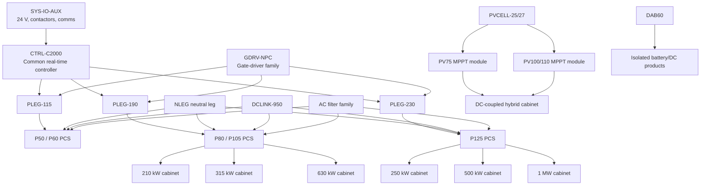
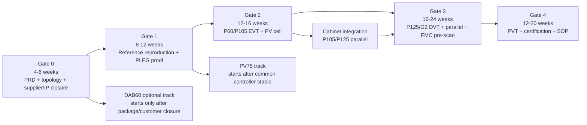

<!-- SOURCE OF TRUTH. Pasted by the user on 2026-10-03 as the reference for this project.
     Saved verbatim; only the chat-tool citation markers (citeturn…/fileciteturn…) were stripped.
     Do not edit. The DC-DC scope distilled from it lives in REQUIREMENTS.md. -->

# Engineering and Product Roadmap for a Modular 125 kW Bidirectional PCS Family

## Executive summary

The most practical route to compete with Megarevo is **not** to copy one PMA module as one monolithic design and it is also **not** to stack five complete 25 kW reference boards inside a 125 kW enclosure.

The stronger architecture is:

> **Standardise at the phase-leg, gate-driver, control-card, DC-link, sensing, auxiliary-power and filter-interface level; create three power-current classes; then stack complete 105 kW or 125 kW modules only at cabinet level.**

Megarevo's current PMA catalogue itself points in this direction. The 50/62.5 kW pair shares one mechanical family, the 80/105 kW pair shares another, and 125/135 kW occupies a larger 5U platform. Megarevo also explicitly describes three-level SVPWM, midpoint balancing, industrial IGBT power modules, independent forced-air cooling and parallel expansion. The supplied 2026 V1.2 brochure remains a useful document baseline for the broader product architecture.

### Recommended commercial architecture

| Our proposed family | Primary ratings | Main reusable power subassembly | Commercial role | Recommendation |
|---|---:|---|---|---|
| **PCS-P60** | 50 / 62.5 kW | `PLEG-115` current class | Small modular BESS, UPS, C&I storage | Develop first as the lower-risk native PCS prototype |
| **PCS-P105** | 80 / 105 kW | `PLEG-190` current class | Main cabinet-building block | High priority |
| **PCS-P125** | 125 kW, mechanically allowing a future 135 kW derivative | `PLEG-230` current class | 261 kWh-class BESS, 250/500 kW cabinets | **Highest commercial priority** |
| **PV-P75** | 75 kW rated / approximately 82.5 kW peak target | 3 × `PVCELL-25/27` | DC-coupled solar, MPS/MPSM-type systems | High priority after PCS control platform |
| **PV-P100/110** | 100–110 kW class | 4 × upgraded PV cell | Larger hybrid/microgrid products | Second-generation |
| **DAB-D60** | 60 kW isolated bidirectional DC/DC | Wolfspeed-derived DAB cell | Isolation/voltage adaptation only | Develop only against a real customer need |
| **U30/U40/U50** | Your existing 30/40/50 kW Vienna + DC/DC modules | Existing hardware | Charge-only DC systems and UPS input banks | Preserve and qualify; do not redesign unnecessarily |
| **STS-250** | Approximately 250 A-class 3P4W static-transfer assembly | SCR/thyristor power assembly + bypass | Backup/microgrid systems | Buy/build as separate assembly, not part of every PCS |

For the PCS itself, I recommend **three-level NPC2/T-type as the baseline production study**, with a cost/performance comparison between industrial IGBT and SiC implementations. That direction aligns with Megarevo's own description of three-level SVPWM and midpoint-balance control, TI's T-type AFE reference, ST's three-level bidirectional AFE and Infineon's explicit recommendation of three-level NPC2 solutions in the 10–125 kW, sub-1000 V PCS category.

A Wolfspeed **CRD250DA12E-XM3** is an excellent **high-current engineering platform**, because it supplies a complete 300 Arms-class liquid-cooled stack with modules, buswork, drivers, sensing and controller construction. It is **not**, however, a direct PMA0125 substitute: Wolfspeed specifies 800 V nominal and **900 V maximum** DC, while Megarevo's current PMA family permits operation to **950 V**.

The corresponding strategic decision is:

**Use XM3 to learn and prove high-current control, protection, sensing and busbar techniques. Build the production air-cooled 950 V-capable PCS as our own qualified three-level product.**

### Where vendor references really reduce risk

| Engineering problem | Best first reference | Why it matters |
|---|---|---|
| Bidirectional three-phase control | **TI TIDA-01606** | Full DQ AFE control basis plus schematic, BOM, Gerbers and PCB documentation |
| Three-level PCS topology | **TI TIDA-01606 + STDES-PFCBIDIR + Infineon REF-10KW3LNPC2** | Three independent vendor implementations/blueprints for T-type/NPC-class conversion |
| High-current mechanical power stack | **Wolfspeed CRD250DA12E-XM3** | 300 Arms, busbars, cooling, drivers, sensing and controller construction |
| Optional isolated bidirectional DC/DC | **Wolfspeed CRD60DD12N-GMB**, with **STDES-DABBIDIR** and **TI TIDA-010054** as control/design cross-checks | Native 60 kW Wolfspeed power path; ST provides unusually complete CAD/BOM/schematic files; TI provides detailed DAB control and verified test documentation |
| Precharge | **TI TIDA-050063 / TIDA-050082** | Complete reference hardware and calculator methodology |
| PV MPPT algorithm | **TI TIDM-SOLAR-DCDC / TIDM-BUCKBOOST-BIDIR** | C2000 MPPT and nonisolated buck-boost control starting points |
| Higher-power boost hardware | **Wolfspeed CRD-60DD12N** | Native 60 kW interleaved boost implementation |
| BMU/BCU | **TI TIDA-010247 / TIDA-010253** | 48–1500 V BMU and rack-controller architecture |
| Auxiliary HV bias | **Wolfspeed CRD-020DD17P-J** | 60–1000 V input 20 W isolated auxiliary-power reference |
| Whole-system partitioning | **onsemi 25 kW SiC DCFC design series TND6401–TND6408** | Systematic coverage of PFC, DAB, control, gate drive, auxiliaries and thermal design |

The key commercial insight is that **reference designs should eliminate unknowns, not dictate the final product rating**. TI's 11 kW and ST's 15 kW references are very useful control and topology resources even though we have no intention of launching a generic 10–15 kW PCS module.

## Megarevo target envelope

For engineering freeze, I recommend treating Megarevo's **current live PMA page** as the primary competitor specification because it exposes the latest G1/G2 tables. The uploaded brochure should remain under document control as the historical/product-range baseline.

### Exact PMA0060 target

A potentially confusing point is that the current product called **PMA0060 is rated at 62.5 kW active power**, not 60 kW.

| Parameter | PMA0060 G1, 3-wire | PMA0060 G2, four-wire capable |
|---|---:|---:|
| Rated active power | **62.5 kW** | **62.5 kW** |
| Maximum continuous DC power | 69 kW | 69 kW |
| DC operating range | 590–950 V | 590–950 V 3W+PE; **650–950 V 3W+N+PE** |
| Full-load DC window | 600–900 V | 600–900 V 3W+PE; **680–900 V 3W+N+PE** |
| Maximum DC current | ±125 A | ±125 A |
| Maximum continuous DC current | ±115 A | ±115 A |
| Rated AC voltage | 400 V L-L | 400/230 V |
| Rated AC current | 90 A | 90 A |
| Maximum AC current | 110 A | 110 A |
| Maximum continuous AC current | 99 A | 99 A |
| Maximum apparent power | 75 kVA | 75 kVA |
| Maximum continuous apparent power | 69 kVA | 69 kVA |
| Off-grid operation | Not listed for G1 | Yes |
| Three-phase unbalanced load | — | **100%** |
| Overload | — | ≤110% continuous; 110–120% for 2 min; >120% for 200 ms |
| Maximum efficiency | 98.5% | 98.5% |
| Cooling | Intelligent forced air | Intelligent forced air |
| Operating temperature | -30 to +60°C; derating above 45°C | Same |
| Body / rack dimensions | 483 mm overall width, **444 × 550 × 133 mm body**, 19-inch 3U | 533.4 mm overall width, **491 × 650 × 174 mm body**, 21-inch 4U |
| Weight | **38 kg** | **48 kg** |

Megarevo publishes THDi below 3% at rated power, adjustable power factor from -1 to +1, <20 ms charge/discharge switching time, IP20 power compartment/IP5X control compartment, and Ethernet/RS485/CAN interfaces for this family.

### Exact PMA0105 target

| Parameter | PMA0105 G1, 3-wire | PMA0105 G2, four-wire capable |
|---|---:|---:|
| Rated active power | **105 kW** | **105 kW** |
| Maximum continuous DC power | 115 kW | 115 kW |
| DC operating range | 590–950 V | 590–950 V 3W+PE; **650–950 V 3W+N+PE** |
| Full-load DC window | 600–900 V | 600–900 V 3W+PE; **680–900 V 3W+N+PE** |
| Maximum DC current | ±200 A | ±200 A |
| Maximum continuous DC current | ±190 A | ±190 A |
| Rated AC voltage | 400 V | 400/230 V |
| Rated AC current | 150 A | 150 A |
| Maximum AC current | 180 A | 180 A |
| Maximum continuous AC current | 165 A | 165 A |
| Maximum apparent power | 126 kVA | 126 kVA |
| Maximum continuous apparent power | 115 kVA | 115 kVA |
| Off-grid operation | No G1 off-grid table | Yes |
| Three-phase unbalanced load | — | **100%** |
| Maximum efficiency | 98.5% | 98.5% |
| Cooling | Intelligent forced air | Intelligent forced air |
| Body / rack dimensions | Body **444 × 680 × 174 mm** rear-service 4U, or 444 × 680 × 220 mm front-service 5U | Body **491 × 650 × 220 mm**, 21-inch 5U |
| Weight | **50 kg** | **55 kg** |

Megarevo lists the same -30 to +60°C operating range, derating above 45°C, 400 V ±15% grid window, Ethernet/RS485/CAN and <20 ms charge/discharge switching time for this family.

### Exact PMA0125 target

| Parameter | PMA0125 current specification |
|---|---:|
| Rated active power | **125 kW** |
| Maximum continuous DC power | **137 kW** |
| DC operating range, 3W+PE | **590–950 V** |
| DC operating range, 3W+N+PE | **650–950 V** |
| Full-load window, 3W+PE | **600–900 V** |
| Full-load window, 3W+N+PE | **680–900 V** |
| Maximum DC current | **±250 A** |
| Maximum continuous DC current | **±230 A** |
| Rated AC voltage | **400/230 V** |
| Rated AC current | **180 A** |
| Maximum AC current | **216 A** |
| Maximum continuous AC current | **198 A** |
| Maximum apparent power | **150 kVA** |
| Maximum continuous apparent power | **137 kVA** |
| Off-grid rated active power | 125 kW |
| L-N selectable voltage | 220 / 230 / 240 V |
| L-L selectable voltage | 380 / 400 / 415 V |
| Load imbalance | **100% three-phase unbalanced** |
| Overload | ≤110% continuous; 110–120% 2 min; >120% 200 ms |
| Maximum efficiency | **98.5%** |
| Cooling | **Intelligent forced air** |
| Operating temperature | -30 to +60°C, derating above 45°C |
| Overall / body dimensions | 690 mm overall; **650 × 700 × 220 mm body**, 5U |
| Weight | **75 kg** |

Megarevo also lists THDi below 3% at rated power, THDu below 3% for balanced linear load, adjustable PF -1 to +1, 400 V ±15%, Ethernet/RS485/CAN, hot-plug/quick-plug connection options and IP20 power/IP5X control compartments.

### The mechanical pattern is extremely informative

The present PMA catalogue groups its products as **50–60 kW G1/G2, 80–105 kW G1/G2 and 125–135 kW**, and explicitly says that its products use standardised power-capacity modules and support parallel expansion.

That strongly supports the following product architecture for us:

| Competitor family | Our equivalent family | Reuse strategy |
|---|---|---|
| 50/62.5 kW | P50/P60 | Same control/aux/mechanics and one lower-current phase-leg class |
| 80/105 kW | P80/P105 | Same control/aux/mechanics and one mid-current phase-leg class |
| 125/135 kW | P125, future P135 | Same control architecture, larger current-class phase leg and DC link |
| Four-wire G2 | G2 option | Add dedicated neutral-current hardware and corresponding control rather than merely a neutral terminal |

The calculated unity-PF currents at 400 V agree almost exactly with Megarevo's published rated currents:

\[
I=\frac{P}{\sqrt 3 V_{LL}}
\]

| Active power | Calculated current at 400 V | Megarevo rated current |
|---:|---:|---:|
| 50 kW | 72.2 A | 72 A |
| 62.5 kW | 90.2 A | 90 A |
| 80 kW | 115.5 A | 115 A |
| 105 kW | 151.6 A | 150 A |
| 125 kW | 180.4 A | 180 A |

Therefore, **current class—not the nominal kW printed on a board—is the correct internal standardisation parameter**.

Megarevo's current page also explicitly says it uses **three-level SVPWM and midpoint balance technology**, which matters because a 950 V DC envelope feeding a 400/230 V four-wire system is not just a generic two-level inverter problem.

### MPPT target

Megarevo's separate PMD-75-G3 provides an unusually clear target for our PV DC/DC module:

| PMD-75-G3 parameter | Published target |
|---|---:|
| Rated power | **75 kW** |
| Maximum power | **82.5 kW** |
| MPPT channels | **1 centralized MPPT** |
| PV operating range | **250–1000 V** |
| PV full-load range | **550–950 V** |
| Maximum PV current | **135 A** |
| Output range | **250–1000 V** |
| Output full-load range | **550–950 V** |
| Maximum output current | **135 A** |
| Isolation | **Non-isolated** |
| Maximum efficiency | **99%** |
| Cooling | Temperature-controlled forced air |
| Size | **550 × 444 × 133 mm** |
| Weight | **30 kg** |
| Communications | RS485, CAN; BMS interface |

That is **not** a simple boost-converter specification. A source or load may be above or below the opposite port voltage, so a faithful product requires an appropriate buck-boost operating capability rather than simply copying Wolfspeed's 470–800 V-to-850 V boost reference.

## Reference-design map and gap analysis

The most important procurement distinction is between **a manufacturable reference package**, **an evaluation power stack**, and **a finished commercial design**.

### Main PCS power stage

| Reference | Native capability | Files/software available | Value to P60/P105/P125 | What remains ours |
|---|---|---|---|---|
| [TI TIDA-01606](https://www.ti.com/tool/TIDA-01606) | 11 kW, 400 V three-phase, 800 V nominal/900 V maximum DC, bidirectional T-type AFE | Assembly drawing, BOM, CAD/CAE, Gerbers, PCB layout and schematic are public; C2000 DigitalPower SDK supplies software foundation | **Highest-value control/topology reference** | High-current semiconductor selection, 950 V envelope, busbars, larger filter, thermal design, four-wire neutral, complete product qualification |
| [Wolfspeed CRD-25BDA6512N-K](https://www.wolfspeed.com/products/power/reference-designs/crd-25bda6512n-k/) | 25 kW three-level T-type, 380–480 V AC; 650–900 V DC in PFC mode | Main-board files; firmware/GUI requested separately | Excellent SiC commutation/layout study | Scale current, neutral, filter, air cooling, full grid/off-grid controls, 950 V qualification |
| [ST STDES-PFCBIDIR](https://www.st.com/en/evaluation-tools/stdes-pfcbidir.html) + [STSW-PFCBIDIR](https://www.st.com/en/embedded-software/stsw-pfcbidir.html) | 15 kW, 3-phase, 3-level, 800 V/400 V bidirectional AFE | Public Gerber, BOM and schematic; STSW firmware implements VOC, rectifier/inverter operation, active/reactive control and standalone/grid modes | Excellent independent firmware/reference cross-check | High-current power stage and product packaging |
| [Infineon REF-10KW3LNPC2](https://www.infineon.com/evaluation-board/REF-10KW3LNPC2) | NPC2 power-conversion blueprint, 650–850 V input, 380–400 V output | Modular gate-driver and aux architecture; control card available; registered design resources | Strong IGBT/NPC2 cost benchmark | Scale to 100–230 A class, 950 V, production firmware |
| [onsemi 25 kW DCFC design series](https://www.onsemi.com/design/video-library/bidirectional-25kw-sic-based-dc-fast-charger-reference-design) | 25 kW SiC bidirectional charging system development | TND6401–TND6408 cover system, PFC, DAB, algorithms, gate drive, auxiliary power and thermal design | Excellent engineering-checklist reference | Not a plug-in PMA design |

TI explicitly publishes the TIDA-01606 assembly, BOM, CAD, Gerber, layout and schematic files, and its design implements full DQ-domain bidirectional AFE control. ST likewise publishes BOM, schematic and Gerber resources for its bidirectional AFE, while STSW-PFCBIDIR implements the associated rectifier and inverter control algorithms.

Infineon specifically recommends 1200 V half-bridge or three-level NPC2 solutions for sub-1000 V, 10–125 kW storage PCS, and moves toward 62 mm/EconoDUAL/PrimePACK-class modules as industrial power rises beyond that range.

**Production decision:** use these references to converge on our topology and controls, but do not scale PCB copper from 11 or 15 kW to 125 kW. At 180–200 Arms class, the current-carrying structure should become **power modules + laminated busbars + dedicated gate-driver boards + separate sensing/control PCB**, not a giant FR-4 version of a small reference board.

### High-current development stack

[Wolfspeed CRD250DA12E-XM3](https://www.wolfspeed.com/products/power/reference-designs/crd250da12e-xm3/) is unusually valuable because Wolfspeed specifies a **300 Arms** three-phase stack with 800 V nominal/900 V maximum DC link, 300 µF DC link, cold plate, CAN, gate drivers, sensing and controller construction. Wolfspeed makes controller-board and bus-discharge-board files, the system 3D model and auxiliary BOM available and lists firmware/GUI as separately requested.

I would purchase or obtain access to one XM250 system specifically for:

- high-current double-pulse testing and switching-waveform benchmarking;
- current-sensor/noise benchmarking;
- laminated-busbar inductance study;
- gate-driver/DESAT behaviour;
- controller-to-power-stage interfaces;
- 180–230 A RMS thermal validation methods.

It should **not** become the production architecture by default because its native 900 V maximum and liquid cooling do not match the full Megarevo-style 950 V/forced-air target.

### DC-link and precharge

| Function | Reference | What it gives us | Limitation |
|---|---|---|---|
| Active precharge | [TI TIDA-050063](https://www.ti.com/tool/TIDA-050063) | Schematic, BOM, Gerber, PCB, assembly and calculator methodology; up to 800 V and 4 A average | **Not a 950 V drop-in** |
| Updated active precharge | [TI TIDA-050082](https://www.ti.com/tool/TIDA-050082) | Positive-rail buck-style active precharge, 2 mF/800 V example, isolated drive | Again 800 V reference; power devices/insulation must be changed |
| Bus discharge | Wolfspeed XM3 reference | Dedicated discharge-board design resource | Native XM voltage class only |

TI's active-precharge reference demonstrates charging 2 mF to 800 V in 400 ms and publishes the full manufacturing package.

For our first commercial PCS I recommend **conventional resistor + precharge contactor** unless size/lifetime economics clearly justify solid-state precharge. It is easier to service and qualify. Use the TI designs to size and protect the circuit; do not copy their 800 V switch stage unchanged into a 950 V product.

### AC filter

TIDA-01606 uses a high-frequency T-type AFE with an **LCL output filter**, and ST's PFCBIDIR similarly supplies a high-frequency three-level reference around 400 V AC.

Our filter must be newly designed for each current class because:

\[
I_{\text{continuous,max}} =
99,\;165,\;198\text{ A}
\]

for the competitor's 62.5, 105 and 125 kW classes respectively.

The core/control methodology is reusable; **the inductor copper, core gap, thermal design and capacitor current ratings are not.**

### Isolated 60 kW DAB

The closest high-power native reference is [Wolfspeed CRD60DD12N-GMB](https://www.wolfspeed.com/products/power/reference-designs/crd60dd12n-gmb/). Wolfspeed publishes a 60 kW DAB using two CBB011M12GM4T full-bridge modules on one cold plate, 100 kHz switching, 99.2% peak efficiency and >98.8% above 20 kW. Schematics, PCB layout and BOM are listed.

There is, however, a firmware-access caveat. The current product page presents firmware and GUI as a separate request, while an official Wolfspeed support response in 2025 said the DAB firmware was not then being publicly shared because of its complexity. Wolfspeed's reference-design catalogue now lists a **May 2026 user guide**, so procurement should request written confirmation of the present firmware-access terms before committing the D60 programme.

Wolfspeed support also stated that the hardware was experimentally tested to rated 60 kW, initially around 800 V output; its support response describes full-power design down to approximately 700 V and derated operation toward 400 V, and identifies a custom transformer. This is application-support information rather than a formal product specification, so we should reproduce the operating map ourselves.

A particularly strong alternative hardware/software reference is [STDES-DABBIDIR](https://www.st.com/en/evaluation-tools/stdes-dabbidir.html). ST publishes **Gerber, BOM v2.0, schematic v2.0 and OrCAD CAD files**, while [STSW-DABBIDIR](https://www.st.com/en/embedded-software/stsw-dabbidir.html) implements bidirectional DAB control, soft switching, current/voltage loops, soft-start and protections on STM32G474.

TI's [TIDA-010054](https://www.ti.com/tool/TIDA-010054) adds another valuable cross-check: 10 kW DAB, 700–800 V primary, 350–500 V secondary under single-phase-shift operation, 100 kHz, 98.7% peak efficiency, full schematic/BOM/Gerber/PCB files and C2000 software support.

**D60 decision:** Wolfspeed hardware + our own controls should be the long-term route if we need a 60 kW isolated product; ST and TI should be used to reduce firmware/control risk.

### Nonisolated PV DC/DC

The [Wolfspeed CRD-60DD12N](https://www.wolfspeed.com/products/power/reference-designs/crd-60dd12n/) is a very useful high-power reference, but Wolfspeed explicitly specifies **470–800 V input and fixed 850 V output**. It is a 60 kW, four-phase interleaved boost converter, not a 250–1000 V adaptive buck-boost module. Wolfspeed does provide a complete schematic, PCB layout and BOM.

For controls, [TI TIDM-SOLAR-DCDC](https://www.ti.com/tool/TIDM-SOLAR-DCDC) supplies an MPPT implementation, C2000 control software and hardware files, although it is only a 500 W, 200–300 V-to-400 V learning platform and has been superseded by newer TI solar work.

[TIDM-BUCKBOOST-BIDIR](https://www.ti.com/tool/TIDM-BUCKBOOST-BIDIR) is more relevant to topology/control because it demonstrates bidirectional nonisolated buck-boost operation with voltage control, MPPT current control and reverse-voltage control, and includes software, GUI, schematic, PCB plots, BOM and source material.

Therefore:

> **PV-P75 must be our own high-voltage buck-boost power design. Wolfspeed gives the 60 kW high-power layout/interleaving lessons; TI gives the MPPT/buck-boost control foundation.**

### Auxiliary supply and gate drivers

[Wolfspeed CRD-020DD17P-J](https://www.wolfspeed.com/products/power/reference-designs/crd-020dd17p-j/) is a useful **20 W, 60–1000 V input, 15 V output flyback reference** for bootstrap/control power.

Twenty watts is insufficient for the complete P125 low-voltage subsystem, fans and all controls. My recommendation is therefore:

**HV bootstrap supply → protected 24 V intermediate rail → isolated point-of-load supplies for drivers/control/sensors.**

For gate drive, three particularly useful reference ecosystems are:

| Vendor | Reference implementation | Use |
|---|---|---|
| TI | **UCC21710** in TIDA-01606 and Wolfspeed DAB | Reinforced isolated SiC gate drive with integrated protection |
| ST | **STGAP2SICS** in STDES-DABBIDIR | SiC driver architecture tied to ST's power modules |
| Infineon | **EiceDRIVER** family in REF-10KW3LNPC2 / REF-CAV280KMSICINV | Module-mounted driver and DESAT concepts |
| onsemi | Gate-driver section of TND6406 and NCD5709x ecosystem | Independent design/qualification cross-check |

### BMU, BCU and STS

[TI TIDA-010247](https://www.ti.com/tool/TIDA-010247) supports up to 32 series cells per monitoring unit and is intended for 48–1500 V storage architectures with CAN stacking.

[TI TIDA-010253](https://www.ti.com/tool/TIDA-010253) is a rack BCU reference with high-voltage relay drivers, isolated CAN, RS485, daisy chain, Ethernet and interfaces for current/HV/humidity measurements.

These should inform our **BMS interface**, but PCS control should not duplicate cell-monitoring electronics unnecessarily.

For STS, I did **not** identify an equally complete public 125 kW three-phase static-transfer reference among the requested vendors. Infineon does offer industrial high-current thyristor modules such as TT400N26KOF and larger devices; these are component building blocks rather than an STS reference assembly.

Therefore the lowest-risk route is:

**Buy a qualified STS initially, while developing `STS-250` only after the core PCS is stable.**

## Proposed modular hardware and control architecture

### The important modularity decision

There are two completely different meanings of "stacking":

1. **Inside a PCS module:** repeat phase-leg, driver and magnetic building blocks.
2. **Inside a cabinet:** parallel complete PCS modules.

The first is how we should reduce BOM and engineering repetition. The second is how we should scale from 105/125 kW to hundreds of kilowatts.

We should **not** make each 25 kW phase section into a complete independent converter with its own enclosure, auxiliary power, contactors, controller and AC filter. That duplicates too much cost.

### Proposed board and subassembly library

The dimensions below are **our preliminary mechanical allocations**, not measurements of Megarevo's internal PCBs.

| Internal code | Function | Electrical design target | Suggested envelope | Reuse |
|---|---|---|---|---|
| **CTRL-C2000** | Common real-time control card | 24 V input; isolated interfaces; 16+ gate commands; 12+ fast measurements | ~160 × 100 mm | Every PCS and later MPPT/DAB derivatives |
| **SYS-IO-AUX** | Contactors, fans, interlocks, LV rails, isolated comms | 24 V system; isolated CAN/RS485/Ethernet interface | ~180 × 120 mm | All module families |
| **GDRV-NPC** | Isolated gate-driver daughtercard | 1200 V-class SiC/IGBT-compatible variant | Keep <100 mm local gate loop where possible | Every power leg |
| **PLEG-115** | Three-level phase leg | 950 V system, **115 Arms engineering continuous target** | ~150–220 × 220–300 mm power zone | 50/62.5 kW |
| **PLEG-190** | Three-level phase leg | 950 V, **190 Arms target** | larger module/busbar variant | 80/105 kW |
| **PLEG-230** | Three-level phase leg | 950 V, **230 Arms target** | larger 5U-class power zone | 125 kW / possible 135 kW |
| **NLEG-230** | Optional neutral/zero-sequence leg | up to full phase/neutral duty | Shared mechanics with PLEG where practical | G2 four-wire versions |
| **DCLINK-950-S/M/L** | Split DC link, sensing, discharge, precharge interface | 590–950 V operation; transient design set after surge study | Busbars + capacitor bank, not high-current PCB traces | Three current classes |
| **ACF-115/190/230** | L/LCL filter assembly | 400/415 V, relevant current class | Magnetics mounted in forced-air duct | PCS family |
| **PVCELL-25/27** | Nonisolated synchronous buck-boost cell | ~25–27.5 kW | ~100–150 × 250–350 mm plus inductor | PV75/PV100/PV110 |
| **DAB60** | Isolated bidirectional DC/DC | 60 kW class | Cold-plate module | Optional isolated systems |
| **STS-250** | Static transfer | 400/415 V, 250 A-class design goal | Separate rack module | Microgrid/backup |
| **BMU-GW** | BMS/PCS gateway rather than cell monitor | Isolated CAN/RS485 | CTRL/SYS daughtercard | All BESS products |

The 115/190/230 Arms design targets deliberately sit above Megarevo's published **99/165/198 A maximum continuous AC currents** for its 62.5/105/125 kW products. They are preliminary current-class goals, not final semiconductor ratings.

### How the boards create the module family

| Module | Phase assemblies | Neutral implementation | Power/current hardware | Competitor envelope to target |
|---|---|---|---|---|
| **P50** | 3 × PLEG-115 | None or optional | Same platform as P60, derated | 3U G1 / 4U G2 |
| **P60** | 3 × PLEG-115 | NLEG-115 for G2 if fourth-leg route selected | Higher software/current limit than P50 | 444×550×133 G1; 491×650×174 G2 |
| **P80** | 3 × PLEG-190 | Optional | Same platform as P105 | 4U/5U |
| **P105** | 3 × PLEG-190 | NLEG-190 for G2 | 105 kW calibrated build | 444×680×174 or 491×650×220 |
| **P125** | 3 × PLEG-230 | NLEG-230 for G2 | Large DCLINK and ACF | 650×700×220 |
| **P135 future** | Same family only if loss/temperature margin permits | Same | Semiconductor/filter upgrade as needed | Same 5U family |

The mechanical target envelopes are taken from Megarevo's current catalogue; our proposed internal board split is an engineering architecture.

### Four-wire architecture decision

There are two credible routes:

| Four-wire approach | Benefits | Main risk |
|---|---|---|
| Split DC link with active midpoint balancing | Lower semiconductor count; aligns closely with three-level architecture | Neutral current stresses link capacitors and midpoint controller under severe unbalance |
| **Dedicated active neutral leg** | Direct control of zero-sequence/neutral current; easier path to true 100% phase imbalance | Extra switches, driver, inductor and cooling cost |

Megarevo explicitly advertises midpoint-balance technology and 100% unbalanced loads, but it does not disclose the exact circuit.

For our **first G2 product**, I would prefer the dedicated neutral-leg path unless simulation and HIL testing demonstrate that the split-link architecture can meet the same half-wave/unbalanced-load requirements with materially lower cost. The extra hardware buys control margin and reduces the risk of discovering late in DVT that capacitor ripple or neutral control is inadequate.

### MPPT building blocks

I recommend:

\[
PV75 = 3 \times PVCELL_{25}
\]

\[
PV100 = 4 \times PVCELL_{25}
\]

\[
PV110 \approx 4 \times PVCELL_{27.5}
\]

The full PV75 module should have **one MPPT supervisor** when targeting Megarevo's centralized-PMD architecture; three internal power cells do not need to mean three independent MPPT trackers.

The complete design goal should match the competitor's 250–1000 V port ranges and 550–950 V full-power window rather than the narrower Wolfspeed boost window.

Because 1000 V is already close to the limit of a 1200 V two-level switching implementation once switching overshoot is included, Gate 0 should explicitly compare:

- 1700 V devices in a straightforward buck-boost;
- a three-level buck-boost using lower-voltage devices;
- a series-connected/interleaved architecture.

That decision needs device-loss and transient simulation; it should not be guessed from nominal voltage alone.

### Optional DAB stacking

Once one DAB60 branch is fully qualified:

| Required isolated power | Branch count | Average demand per branch | N+1 branch count |
|---:|---:|---:|---:|
| 60 kW | 1 | 60 kW | 2 |
| 120 kW | 2 | 60 kW | 3 |
| 125 kW | **3** | 41.7 kW | 4 |
| 150 kW | **3** | 50 kW | 4 |
| 240 kW | 4 | 60 kW | 5 |

Wolfspeed itself describes its 60 kW DAB as modular and easy to parallel, but the parallel-control, fusing, contactors and one-branch-fault behaviour remain system engineering responsibilities.

### Cabinet scaling

For our complete PCS modules:

| Building block | Cabinet rating |
|---|---:|
| 2 × P105 | **210 kW** |
| 3 × P105 | **315 kW** |
| 4 × P105 | **420 kW** |
| 5 × P105 | **525 kW** |
| 6 × P105 | **630 kW** |
| 2 × P125 | **250 kW** |
| 4 × P125 | **500 kW** |
| 8 × P125 | **1 MW** |

For N+1 operation, installed capacity must exceed promised output. Four P125 modules provide 500 kW installed but only 375 kW after loss of one module; a true 500 kW N+1 product therefore requires five appropriately qualified P125 branches.

### How your existing Vienna modules fit

Your current 30/40/50 kW **unidirectional AC→DC Vienna + DC/DC** family should be treated as a separate, already-invested product lane.

| Combination | Useful product |
|---|---|
| 2 × 50 kW | 100 kW isolated charge-only DC supply |
| 3 × 50 kW | 150 kW charge-only cabinet |
| 5 × 50 kW | 250 kW charger/DC supply |
| Existing rectifier bank + new P125 inverter | Online double-conversion/UPS-type architecture |
| Existing charger + AC-coupled P125 BESS | Battery-buffered charger/industrial energy system |

A Vienna rectifier is fundamentally one-way. ST's own 30 kW Vienna reference is specified as an AC→DC PFC stage, whereas its bidirectional AFE is a different topology/product.

Therefore, **do not spend R&D money converting your existing Vienna line into the new PCS family**. Preserve it for markets where charge-only conversion is actually required.

### Common control card

My recommendation is to standardise the production platform around **TI TMS320F28388D** after proving the reference algorithms on their native controllers.

TI specifies F28388D with two C28x cores plus two CLAs, a Cortex-M4 connectivity manager, 200 MHz operation, four ADCs supporting 12- or 16-bit modes, eight sigma-delta filters, **32 PWM channels**, three CAN interfaces, CAN-FD, Ethernet and EtherCAT.

A proposed assignment is:

| F28388D resource | Our use |
|---|---|
| C28x CPU1 + CLA1 | Fast phase-current loops, PWM update, modulation, neutral-point control |
| C28x CPU2 + CLA2 | PLL, DC-link loop, grid-forming outer loops, parallel-power control |
| Cortex-M4 connectivity manager | CAN/RS485/Ethernet, diagnostics, boot/update, configuration |
| 16–20 ADC channels | AC voltages, AC currents, DC bus halves, battery/DC current, auxiliary measurements |
| 4–8 SDFM channels | Isolated high-resolution current/voltage channels where required |
| 12 PWM channels | Three-level 3-phase power stage baseline |
| Additional 4 PWM channels | Dedicated neutral leg if selected |
| Remaining PWM/CLB | Fan, precharge, diagnostic and future converter functions |
| CAN-A | BMS |
| CAN-B | Cabinet/module bus |
| CAN-FD | Service/future high-speed module network |
| Ethernet | EMS/local service/firmware distribution |

The exact PWM count depends on final T-type/NPC2 switch arrangement; the purpose of selecting a 32-channel controller is to leave sufficient margin rather than design the MCU at 100% peripheral utilisation.

### Common I/O and auxiliary card

`SYS-IO-AUX` should contain:

| Function | Proposed requirement |
|---|---|
| Input power | Redundant/protected 24 V cabinet input plus HV bootstrap supply |
| Isolated CAN | Minimum 2 channels |
| RS485 | Minimum 2 isolated ports |
| Ethernet | 10/100BASE-T with isolated magnetics |
| Digital inputs | E-stop, door, smoke/fire, contactor feedback, breaker status, fan feedback |
| Safety outputs | Independent gate-enable chain, DC contactor commands, AC contactor/breaker, discharge |
| Temperature | 8–12 RTD/NTC channels or distributed sensors |
| Fan control | Four or more tachometer/PWM channels |
| Insulation monitor interface | Dry contact and/or CAN/RS485 |
| Hardware fault latch | Independent of application firmware |
| Service storage | Serial number, calibration, fault log, operating hours |
| Watchdog | Independent hardware watchdog plus MCU watchdog |

Fast overcurrent/desaturation should **not** pass through Ethernet, CAN or supervisory firmware before shutting down the switches. Gate-driver DESAT/OCP should feed an independent hardware trip matrix and the C2000 trip-zone path.

### Firmware ownership and migration

The recommended ownership split is:

| Layer | Ownership | Reference source |
|---|---|---|
| Gate timing, current loops, PWM/modulation | **Ours** | TI TIDA-01606, STSW-PFCBIDIR, Wolfspeed examples |
| DAB modulation/current/voltage loops | **Ours** | STSW-DABBIDIR + TI TIDA-010054; Wolfspeed hardware |
| MPPT | **Ours** | TI solar MPPT examples |
| Protection state machine | **Ours** | Reference designs for behaviour only |
| Parallel-module dispatch | **Ours** | No reference should be assumed to solve our cabinet |
| Grid-forming/grid-following | **Ours** | Vendor control examples as algorithm sources |
| BMS/EMS protocol | **Ours** | Interface specifications |
| Bootloader/update/security | **Ours** | MCU vendor libraries |
| Factory calibration/EOL firmware | **Ours** | Dedicated manufacturing branch |

TI's current C2000 DigitalPower SDK is version **26.01.00.00, released 3 August 2026**, and includes TIDA-01606 resources, DAB support and recent fixes to TIDA-010054.

The migration sequence should be:

**Native reference firmware → reproduce vendor board → build plant models/HIL → port one control loop at a time to F28388D → compare waveforms and dynamic response → remove vendor code that cannot be redistributed → freeze our own release branch.**

That is significantly safer than simultaneously changing the power stage, controller and algorithm.

## Thermal, mechanical and qualification strategy

### Air cooling should be the standard commercial PCS

Megarevo specifies intelligent forced-air cooling for the PMA0060, PMA0105 and PMA0125 families and derates above 45°C.

Therefore the competitive baseline should be:

**P60/P105/P125-A = forced-air production products.**

Liquid cooling should remain:

- an engineering platform for XM3;
- the native architecture for DAB60;
- a later P125-L variant where a customer pays for density/sealing advantages.

### Converter heat-loss budget

For output power \(P\) and efficiency \(\eta\):

\[
P_\text{loss}=P_\text{out}\left(\frac{1}{\eta}-1\right)
\]

| Output | Loss at 98.5% | Loss at 99.0% |
|---:|---:|---:|
| 50 kW | 0.761 kW | 0.505 kW |
| 62.5 kW | 0.952 kW | 0.631 kW |
| 80 kW | 1.218 kW | 0.808 kW |
| 105 kW | 1.599 kW | 1.061 kW |
| **125 kW** | **1.904 kW** | **1.263 kW** |
| 60 kW DAB | 0.914 kW | 0.606 kW |

These are heat-balance scenarios—not predictions of the final product. They show why moving from 98.5% toward 99% can remove roughly **640 W** of dissipation from a 125 kW converter.

### First-order airflow calculation

Assuming:

- air density = 1.1 kg/m³;
- heat capacity = 1,005 J/kg·K;
- allowed bulk temperature rise = 15 K,

the ideal bulk flow for a 125 kW converter dissipating 1.904 kW is approximately:

\[
\dot V \approx 413\text{ m}^3/\text{h}
\]

That number is **not** a fan specification. Filters, heatsink pressure drop, bypass leakage, recirculation and component hot spots mean the installed fan system needs substantially more free-air rating.

My preliminary forced-air design targets are:

| Module | Ideal heat-balance flow at 98.5% | Initial installed-airflow target for CFD/bench |
|---|---:|---:|
| P60 | ~207 m³/h | **400–500 m³/h** |
| P80 | ~265 m³/h | **500–650 m³/h** |
| P105 | ~347 m³/h | **700–850 m³/h** |
| P125 | ~413 m³/h | **850–1,050 m³/h** |

The second column is calculated; the final column is a deliberately conservative **engineering starting target**, to be replaced by measured fan pressure/flow and junction-temperature data.

We should use a front-to-rear independent power duct with:

- semiconductor heatsink first in the cool-air path;
- inductors and film capacitors positioned according to their temperature limits;
- separate protected control compartment;
- redundant/tach-monitored fan arrangement;
- serviceable filter if the enclosure includes filtration;
- at least two temperature sensors per main heatsink plus inductor and capacitor sensing.

### Liquid-cooling programme

Wolfspeed's XM250 reference uses a liquid cold plate. For its larger XM3 systems, Wolfspeed application support recommends maintaining coolant flow and has cited approximately 12 L/min as the validated reference flow for the 300 kW platform.

A pure heat-balance calculation for our 125 kW / 98.5%-efficient example, assuming a 5 K coolant rise and an illustrative 3.6 kJ/kg·K coolant heat capacity, is only about **6.2 L/min**.

That does **not** mean 6.2 L/min is a validated cold-plate requirement. Local convection and module baseplate thermal resistance may require much more flow.

For a later P125-L product, the cold-plate specification should therefore begin at:

| Requirement | Initial target |
|---|---|
| Coolant | Manufacturer-qualified glycol/water mixture |
| Nominal design flow | **8–12 L/min per P125 cold plate**, pending test |
| Maximum inlet during DVT | Test at 25, 35, 45 and 50°C |
| Target coolant ΔT | ≤5–8 K |
| Leak test | 100% production test |
| Pressure drop | Set from pump/cold-plate curve after prototype |
| Condensation | Dew-point-aware control if coolant can fall below ambient dew point |
| Flow failure | Hardware shutdown/rapid derate independent of cloud/EMS |
| Remaining components | Separate airflow for capacitors/inductors unless directly liquid cooled |

Wolfspeed has published very low thermal-resistance cold-plate work for XM3 and emphasises adequate, balanced coolant flow across module positions.

### Provisional air-product derating programme

Megarevo publishes only **">45°C derating"**, not a complete public derating curve.

Therefore, do not copy an invented competitor curve. For EVT, I recommend the following **temporary conservative operating envelope** until measured thermal models exist:

| Air inlet | EVT power limit |
|---:|---:|
| ≤45°C | 100% rated |
| 50°C | 80% |
| 55°C | 60% |
| 60°C | 40% |

The commercial DVT objective is to improve that curve as far as silicon, magnetics, capacitor life and fan acoustics permit. Publication should occur only after hot-chamber full-load tests.

### Filter and thermal qualification matrix

Every rating should be tested at:

| Variable | Minimum DVT points |
|---|---|
| DC bus | Minimum full-load, nominal, 900 V, 950 V reduced-load/operating point |
| Grid | -15%, nominal, +15% |
| PF | +1, -1 reactive endpoints where required, representative 0.9 |
| Ambient | 25, 40, 45, 50, 55, 60°C |
| Direction | Charge and discharge |
| Load | 10, 25, 50, 75, 100%, overload |
| G2 imbalance | Balanced, 50%, 100% single-phase bias, nonlinear/half-wave cases |
| Cooling fault | One fan failed, restricted intake, thermal-sensor fault |
| Module parallel | 2, 3 and required production count |

The Megarevo target includes 400 V ±15%, adjustable PF from -1 to +1 and, for G2, 100% three-phase load imbalance and specified overload behaviour.

### Safety, EMC and grid qualification

Megarevo currently lists the following standards on the PMA product page:

- grid: EN 50549-1, EN 50549-10, GB/T34120 and GB/T34133;
- safety: EN 62477-1 and EN 62109-1/-2;
- EMC: EN IEC 61000-6-2 and EN IEC 61000-6-4.

For our programme, these should become the **baseline design standards**, with India-specific and other country-specific grid/BIS/utility requirements added at Gate 0 according to launch market.

Do not fix hipot voltages or PCB creepage from a generic table before insulation coordination is frozen. Required distances and test voltages depend on working voltage, overvoltage category, pollution degree, material group, altitude and insulation type.

Megarevo itself lists external pollution degree 3, internal degree 2, DC overvoltage category II and AC category III for PMA. Those are useful competitor design targets.

## Manufacturing, procurement and supplier-risk plan

### Manufacturing philosophy

At 125 kW, I would separate **high-current power conduction** from **signal/control PCB functions**.

| Assembly | Recommended construction |
|---|---|
| Main commutation loop | Power module/direct-bonded substrate + laminated copper busbar |
| DC link | Film capacitors mounted directly to low-inductance bus |
| Gate drive | Local daughtercard mounted very close to power module |
| Current sensing | Busbar Hall/coreless sensor or isolated shunt/sigma-delta where appropriate |
| Control card | 6–8 layer normal-copper digital/analog PCB |
| Aux/communications | 4–6 layer isolated low-voltage PCB |
| MPPT power cell | Heavy copper + local busbar depending current |
| AC filter | Separate wound magnetic assemblies, not PCB inductors |
| DAB transformer | Dedicated HF magnetic assembly with controlled leakage |
| Cooling | Extrusion/heatpipe/forced-air block for production PCS; cold plate for DAB/liquid variant |

Wolfspeed's high-current references themselves use low-inductance module/busbar/cold-plate architectures rather than trying to carry hundreds of amps through conventional PCB copper.

### PCB stack-up starting points

These are proposed manufacturing targets:

| Board | Proposed stack |
|---|---|
| CTRL-C2000 | 8-layer FR-4, controlled impedance, 1 oz internal/external as signal integrity permits |
| SYS-IO-AUX | 6-layer, ≥1–2 oz where relay/24 V currents require |
| Gate driver | 4–6 layer, isolation slots and carefully controlled gate-return geometry |
| MPPT control/driver | 6 layer |
| Power PCB around module | 4–6 layer; current carried mainly through busbars |
| Reference-reproduction PCBs | **Use the vendor's exact stack-up first** before local optimisation |

The first prototype of any vendor reference should avoid simultaneous PCB-material, copper-weight, gate-resistor and semiconductor substitutions.

### Magnetics sourcing

Magnetics are one of the highest programme risks.

For P60/P105/P125, start by freezing:

- LCL/LC inductance;
- ripple-current requirement;
- saturation current at overload;
- loss at switching and fundamental frequency;
- winding temperature limit;
- insulation system;
- acoustic limit;
- allowable stray capacitance.

Then source two vendors from the **same controlled drawing and acceptance test**, not two independent vendor designs.

DAB60 is even more sensitive because transformer leakage inductance is part of the power-transfer function. Wolfspeed support has described its reference transformer as a custom wire-wound design and noted work with magnetics partners; that makes transformer sourcing a Gate-0 issue, not something to solve after PCB fabrication.

### Critical BOM and supplier risk

The "target lead time" column below is **our procurement objective**, not a statement of current supplier availability.

| Critical item | Primary design path | Alternate design path | Risk | Internal target |
|---|---|---|---|---|
| PCS power modules | Infineon industrial NPC2/IGBT/SiC study; Wolfspeed SiC study | ST ACEPACK / onsemi EliteSiC architecture | **High** | Engineering sample ≤6 weeks; production PO ≤12–16 weeks |
| XM3 development modules | Wolfspeed CAB425M12XM3 | Infineon EconoDUAL reference stack for alternative study | High | Reserve programme samples at Gate 0 |
| Gate drivers | TI UCC21710 | STGAP2SICS / Infineon EiceDRIVER / onsemi driver | Medium | ≤10–12 weeks |
| C2000 MCU | F28388D | Secondary controller architecture only after port validation | Medium-high | ≤12 weeks; hold ≥6 months safety stock near SOP |
| DC-link film capacitors | Qualified industrial film supplier | Second mechanically/electrically qualified supplier | **High** | ≤14–16 weeks |
| AC inductors | Two custom magnetics suppliers | Third local source | **High** | Prototype ≤8 weeks; production ≤12 weeks |
| DAB transformer | Custom dual-source programme | ST/TI-derived alternate design | **Very high** | Prototype samples before PCB release |
| Contactors | Two approved HV contactor families | Alternate vendor | Medium | ≤10–12 weeks |
| Fuses/SPD | Two industrial families | Alternate vendor | Medium | ≤8–10 weeks |
| Fans | ebm-papst/Delta/Nidec-class industrial sources | Alternate matched P-Q fan | Medium | ≤8 weeks |
| Laminated busbar | Local controlled drawing | Second fabricator | Medium | Prototype ≤5–6 weeks |
| Cold plate | Custom DAB/XM supplier | Second CNC/brazed supplier | Medium-high | Prototype ≤6–8 weeks |

Alternatives in the semiconductor row are **not form-fit substitutes**. Wolfspeed XM3, Infineon EconoDUAL/Easy, ST ACEPACK and onsemi modules use different mechanical/electrical interfaces. The "alternate" protects the programme architecture, not an individual production PCB.

Infineon's current PCS guidance explicitly spans Easy/CoolSiC, 62 mm, EconoDUAL and PrimePACK architectures over the 10 kW-to-MW storage range, while onsemi publishes 25 kW-class power-module system references and Wolfspeed provides several 25–300 kW power-stage platforms.

### Prototype and production test flow

| Stage | 100% test or sample | Required check |
|---|---|---|
| PCB incoming | 100% | Electrical test certificate, controlled impedance where applicable |
| Power modules | Lot + traceability | Part/lot verification, visual, baseplate/TIM condition |
| Magnetics | 100% | L, resistance, hipot/insulation, turns ratio where applicable |
| Busbar | 100% dimensional | Flatness, plating, insulation film, mounting geometry |
| Power assembly | 100% | Torque traceability, TIM process, creepage inspection |
| Low-voltage bring-up | 100% | Aux rails, MCU, communication, driver UVLO/faults |
| Gate verification | 100% | Gate amplitude, deadtime, DESAT trip, no spurious switching |
| Sensor calibration | 100% | AC current/voltage, DC current/voltage, temperature |
| Insulation/withstand | 100% | Values per final safety standard and insulation plan |
| Precharge/discharge | 100% | Timing, contactor sequence, stuck-contact detection |
| Reduced-power function | 100% | Both power directions, PF, current command |
| Full-power production run | 100% initial production; optimise later | Thermal and power verification |
| Extended burn-in | Pilot units / statistical sampling | Full thermal soak and cycling |
| EMC/grid | DVT/certification samples | Formal compliance |

For EVT/DVT I would additionally require double-pulse tests at maximum DC voltage and hot junction, switching-loop overshoot measurements, fault-at-maximum-current tests, shorted/open sensor fault injection, lost-CAN/Ethernet tests, fan failure and contactor-weld simulations.

### Reference-firmware and IP controls

Reference-design files are **development resources, not an assumption of unrestricted product-source ownership**.

The safe policy is:

| Vendor | Engineering use | Commercial/IP action |
|---|---|---|
| TI | Use C2000 SDK and reference algorithms as permitted | Record exact SDK version and licence manifest in source control; legal review before shipping derived code |
| Wolfspeed | Use power-stage files and requested evaluation firmware | Obtain written permission/terms for any firmware reused in product; preferably replace with our own implementation |
| ST | Use STSW packages for algorithm validation and bring-up | Freeze downloaded version and applicable ST software licence |
| Infineon | Use registered design resources/control cards | Do not assume registered resources imply unrestricted redistribution |
| onsemi | Use TND/reference material and device examples | Own production firmware and integration |

The most important case is Wolfspeed DAB60: its current page says firmware/GUI is separately requested, but its own 2025 technical-support response said firmware was not publicly distributed at that time. Procurement should obtain written 2026 status before we base schedule on receiving it.

**Our production code should ultimately own the fast control as well as the supervisor.** Otherwise, our most important product depends on vendor approval every time we need a bug fix or new mode.

## Development gates, budget and programme timing

The following costs are **ROM engineering-planning estimates**, not quotations. They exclude land/building and mass-production inventory and will vary materially depending on how much high-power laboratory work is outsourced.

### Gate structure

| Gate | Approx. duration | Peak team | Main work | Exit deliverables | ROM programme spend |
|---|---:|---:|---|---|---:|
| **Gate 0 — architecture closure** | 4–6 weeks | 5–7 FTE | Final specifications, topology trade-off, source/IP review, procurement, HIL plant models | Approved PRD, architecture, reference-package completeness matrix, supplier RFQs | **₹15–30 lakh** |
| **Gate 1 — reference reproduction and power-cell proof** | 8–12 weeks | 8–10 FTE | TI/ST control reproduction, XM3 high-current bench, gate-driver and sensing studies, PLEG prototype | Stable bidirectional control at reference power; switching/thermal baseline | **₹60 lakh–₹1.2 crore** |
| **Gate 2 — P60/P105 EVT + PV cell EVT** | 12–16 weeks | 10–14 FTE | 950 V air-cooled power hardware, control card, filter, precharge, first PV buck-boost cell | P60 full envelope, P105 partial/full power, PV cell operation, fault results | **₹1.0–2.0 crore** |
| **Gate 3 — P125 and G2 DVT** | 16–24 weeks | 12–16 FTE | P125 full current, neutral/unbalance, parallel units, thermal chamber, EMC precompliance | Design freeze, qualification report, production drawings/BOM | **₹1.5–3.0 crore** |
| **Gate 4 — PVT, certification and SOP** | 12–20 weeks | 8–12 FTE + manufacturing | Pilot line, EOL fixtures, supplier PPAP-style controls, external safety/EMC/grid testing | Production release, controlled firmware, service manuals, certificates | **₹1.0–2.5 crore** |

With overlap, a disciplined programme is roughly **12–18 months to a production-qualified family**, rather than the 52–78 weeks implied by simply adding every gate sequentially.

A sensible ROM for engineering NRE is therefore approximately **₹4–9 crore**, plus high-power laboratory capital and external certification.

### Laboratory capital decision

| Strategy | Description | Incremental capital estimate |
|---|---|---:|
| **Lean** | Use external regenerative grid/DC test laboratory for >100 kW testing | ₹50 lakh–₹1.5 crore internal instrumentation |
| **Balanced** | Own 150–200 kW regenerative AC/DC lab; outsource formal EMC/grid certification | **₹2–4 crore** |
| **Full internal precompliance** | Own grid simulator, battery emulator, thermal chamber and substantial EMC precompliance capability | **₹4–7 crore+** |

These are budgetary planning ranges. Procurement should obtain quotes before Gate 0 closes.

### Recommended core team

| Discipline | Peak requirement |
|---|---:|
| Lead power-electronics architects | 2 |
| Power PCB/busbar/gate-driver engineers | 2–3 |
| Control/firmware engineers | 3 |
| Magnetics engineer | 1 |
| Mechanical/thermal engineer | 1–2 |
| Test/HIL/safety engineer | 2 |
| Compliance engineer | 1 |
| Manufacturing/NPI engineer | 1 |
| Strategic sourcing/SQE | 1–2 |
| Programme manager | 1 |

Peak staffing is therefore approximately **14–18 people**, with several roles shared outside peak phases.

### Gate sequence

### What each gate must refuse to accept

**Gate 0 fails** if we have no source/licence path for the chosen firmware, no magnetics supplier or no approved 950 V electrical envelope.

**Gate 1 fails** if switching overshoot, gate behaviour, current sensing or protection cannot be reproduced safely.

**Gate 2 fails** if P60 cannot operate charge/discharge over its defined DC/grid/temperature window or if P105 scaling requires a fundamental layout redesign.

**Gate 3 fails** if P125 cannot sustain full current thermally, if G2 cannot handle the agreed unbalanced-load cases, if two modules cannot parallel safely or EMC precompliance is materially off target.

**Gate 4 fails** if pilot builds cannot pass EOL consistently, supplier variation moves critical parameters outside tolerance or formal certification exposes a design change.

## Immediate procurement actions and prioritised sources

### Actions to authorise immediately

| Priority | Action | Reason |
|---:|---|---|
| **A** | Procure or obtain access to **CRD250DA12E-XM3** and associated design/firmware package | Gives the team a 300 Arms-class benchmark immediately |
| **A** | Download and freeze **TIDA-01606 Rev J** hardware files and DigitalPower SDK 26.01 | Primary control/topology foundation |
| **A** | Obtain **STDES-PFCBIDIR + STSW-PFCBIDIR** files and build one control-validation platform | Independent AFE firmware reference |
| **A** | Register/download **Infineon REF-10KW3LNPC2** resources and request applications support for 125 kW NPC2 semiconductor selection | Cost/topology benchmark |
| **A** | Purchase **one PMA0060 G2 and one PMA0125** for controlled competitor teardown | Confirms actual module topology, busbars, capacitor bank, neutral implementation and cooling |
| **A** | Purchase **one PMD-75-G3** | Highest-value teardown for the MPPT programme |
| **A** | Request Wolfspeed **CRD60DD12N-GMB** current user guide, design files, transformer data and written firmware-access status | Determines whether DAB60 is truly schedule-ready |
| **A** | Issue RFQs for 1200 V SiC/IGBT module alternatives, DC-link capacitors, laminated busbars, LCL magnetics and fans | Cost and lead-time data is needed before topology freeze |
| **B** | Build two F28388D common-control prototypes | Starts migration path while vendor-native controllers remain available |
| **B** | Order programmable 24 V auxiliary supplies, isolated CAN/RS485 hardware and HIL I/O | Allows low-voltage controls to move independently of high-power hardware |
| **B** | Engage two magnetics suppliers before final schematic freeze | Magnetics is schedule-critical |
| **B** | Quote a 200 kVA-class regenerative grid source/load and ~1000 V bidirectional DC source | Determines own-lab vs outsourced-test economics |
| **C** | Start STS250 design only after P125 control is stable | Prevents a secondary function delaying the PCS |
| **C** | Begin DAB60 hardware only after an isolated-conversion customer/application is identified | Avoids adding an unnecessary conversion stage to every BESS |

A teardown should document, without destructive assumptions, at least:

- semiconductor/module part numbers;
- phase-leg count and topology;
- DC-link capacitance and voltage rating;
- laminated-busbar arrangement;
- gate-driver part numbers and local supplies;
- sensing technology;
- neutral connection;
- AC-filter topology and magnetic dimensions;
- fan model, pressure/flow rating and duct path;
- control MCU/DSP;
- connector sequencing and precharge mechanism;
- PCB layer/count/creepage where observable;
- measured efficiency and thermal images at multiple loads.

### Prioritised primary-source links

| Priority | Source | Why engineering should keep it under configuration control |
|---|---|---|
| **P0** | [Megarevo PMA modular PCS](https://www.megarevo.com/index.php/pm-modular-series-pma-model.html) | Live competitor target specifications for 50/62.5/80/105/125/135 kW |
| **P0** | [Megarevo PMD-75-G3](https://www.megarevo.com/pm-modular-series-pmd-dcdc-module.html) | Exact 75 kW nonisolated MPPT/DC-DC target |
| **P0** | [TI TIDA-01606](https://www.ti.com/tool/TIDA-01606) | Complete bidirectional T-type AFE design package and control basis |
| **P0** | [TI C2000 DigitalPower SDK](https://www.ti.com/tool/C2000WARE-DIGITALPOWER-SDK) | Common digital-power software foundation |
| **P0** | [TI TMS320F28388D](https://www.ti.com/product/TMS320F28388D) | Proposed common production controller |
| **P0** | [Wolfspeed CRD250DA12E-XM3](https://www.wolfspeed.com/products/power/reference-designs/crd250da12e-xm3/) | High-current stack benchmark |
| **P0** | [Wolfspeed CRD-25BDA6512N-K](https://www.wolfspeed.com/products/power/reference-designs/crd-25bda6512n-k/) | 25 kW three-level T-type SiC reference |
| **P0** | [ST STDES-PFCBIDIR](https://www.st.com/en/evaluation-tools/stdes-pfcbidir.html) | Bidirectional three-level AFE hardware reference |
| **P0** | [ST STSW-PFCBIDIR](https://www.st.com/en/embedded-software/stsw-pfcbidir.html) | VOC/grid/inverter firmware reference |
| **P1** | [Infineon PCS application guidance](https://www.infineon.com/application/power-conversion-systems) | Vendor topology/device recommendation by PCS power and voltage |
| **P1** | [Infineon REF-10KW3LNPC2](https://www.infineon.com/evaluation-board/REF-10KW3LNPC2) | IGBT7/NPC2 architecture benchmark |
| **P1** | [Wolfspeed CRD60DD12N-GMB](https://www.wolfspeed.com/products/power/reference-designs/crd60dd12n-gmb/) | Native 60 kW isolated bidirectional DAB |
| **P1** | [ST STDES-DABBIDIR](https://www.st.com/en/evaluation-tools/stdes-dabbidir.html) | Exceptionally complete 25 kW DAB manufacturing package |
| **P1** | [ST STSW-DABBIDIR](https://www.st.com/en/embedded-software/stsw-dabbidir.html) | DAB firmware algorithms |
| **P1** | [TI TIDA-010054](https://www.ti.com/tool/TIDA-010054) | DAB control, schematics, Gerbers, verified test data |
| **P1** | [Wolfspeed CRD-60DD12N](https://www.wolfspeed.com/products/power/reference-designs/crd-60dd12n/) | 60 kW boost hardware/layout reference |
| **P1** | [TI TIDM-BUCKBOOST-BIDIR](https://www.ti.com/tool/TIDM-BUCKBOOST-BIDIR) | Bidirectional nonisolated buck-boost control |
| **P1** | [TI TIDM-SOLAR-DCDC](https://www.ti.com/tool/TIDM-SOLAR-DCDC) | MPPT algorithm and C2000 implementation |
| **P1** | [TI TIDA-050063](https://www.ti.com/tool/TIDA-050063) | Precharge design methodology and manufacturing files |
| **P1** | [Wolfspeed CRD-020DD17P-J](https://www.wolfspeed.com/products/power/reference-designs/crd-020dd17p-j/) | High-voltage auxiliary-power reference |
| **P1** | [TI TIDA-010247](https://www.ti.com/tool/TIDA-010247) | BMU reference for HV storage |
| **P1** | [TI TIDA-010253](https://www.ti.com/tool/TIDA-010253) | Battery-rack controller reference |
| **P2** | [onsemi 25 kW bidirectional SiC charger reference](https://www.onsemi.com/design/video-library/bidirectional-25kw-sic-based-dc-fast-charger-reference-design) | Independent full-system engineering reference and device benchmark |

### Final product decision

The most robust roadmap is therefore:

**P60 proves the architecture → P105 proves the commercial cabinet cell → P125 becomes the flagship → PV75 adds DC-coupled solar → DAB60 remains optional → complete PCS modules are then stacked into cabinets.**

The board-level sweet spot is **not one universal 60 kW converter**. It is a reusable **control/driver/auxiliary platform plus three current-class phase-leg assemblies**.

The module-level sweet spot is **105–125 kW for bidirectional PCS**, because cabinet arithmetic becomes clean:

\[
2\times125=250\text{ kW},\quad
4\times125=500\text{ kW},\quad
8\times125=1\text{ MW}
\]

while 105 kW naturally supports:

\[
2\times105=210,\;
3\times105=315,\;
4\times105=420,\;
5\times105=525,\;
6\times105=630\text{ kW}.
\]

The PV sweet spot is initially **75 kW**, because Megarevo itself exposes a 75/82.5 kW nonisolated PMD module in a compact 3U-class package.

The isolated DC/DC sweet spot remains **60 kW**, because Wolfspeed has a native 60 kW DAB and ST has a highly reproducible 25 kW DAB design; but that stage should only enter a finished BESS when the system genuinely requires galvanic isolation or voltage transformation.

And your existing **30/40/50 kW Vienna + DC/DC modules should remain a separate charge-only asset**. They can immediately support 100/150/250 kW DC charging and online-conversion input banks while the new bidirectional PCS family is being developed. That avoids discarding completed engineering merely to make every product use the same topology.

The single most important Gate-0 decision is therefore **not the semiconductor brand**. It is the freeze of a **950 V-capable, 400/415 V, three-level, common-control architecture with clearly separated G1 three-wire and G2 four-wire requirements**. Once that is frozen, Wolfspeed, TI, ST, Infineon and onsemi reference work can remove much of the topology, control, gate-drive, sensing and validation risk without forcing us into their native lower power ratings.
