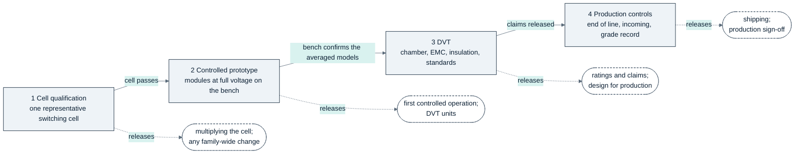

<!-- breadcrumb --> [Home](../../README.md) › [Documentation](../README.md) › Qualification plan

# 🔬 Qualification plan: every open gate

> One consolidated plan of the gates the five review rounds left open: what is tested, the acceptance number our records
> give, the asset that can close it, the product or claim it blocks and the stage it belongs to.

---

> [!IMPORTANT]
> **What this plan is, and what it is not.** The five review rounds ([review_pcm.csv][pcm], [review_r2.csv][r2],
> [review_r3.csv][r3], [review_r4.csv][r4], [review_r5.csv][r5]) closed their rows in the registers — all of R2 to R5,
> and 22 of the 27 rows of the first (PCM-08, -10, -19, -24 and -27 are still marked open and are gates below) — by
> calculation, by simulation on averaged models, by firmware and acceptance rules and by one diode substitution. Nothing
> was measured. What they left open is a set of gates that only hardware, a supplier statement, a purchased standard
> text or a layout can close: "never closed on paper" in the words of [D-078][dec] and [D-081][dec]. The fifth round's
> bottom line is that the next useful milestone is a controlled prototype and a representative switching-cell
> qualification, not another script pass; this page collects the gates so that programme can be run from one list. It is
> **not** a test report (nothing here has been run), **not** a certification plan (certification is out of scope,
> [REQUIREMENTS.md][req] §1) and **not** a layout (this repository has no PCB layout; where a gate needs one, the card
> says what the layout must deliver). Every acceptance figure is quoted from the record named beside it, with the label
> that record gives it — *calculated*, *simulated*, *ASSUMED*, *ESTIMATE*, *FROM MEMORY* — and none was invented for
> this page. Where the records give no number, the card says so.

## 🧭 How to read it

- **IDs.** Q-01 … Q-44. Q-01 … Q-12 are the four groups cited by the fifth register (R5-01 → Q-01…Q-03, R5-02 →
  Q-04…Q-06, R5-03 → Q-07…Q-09, R5-04 → Q-10…Q-12). Q-13 onward are the layout-, supplier-, installation- and
  production-dependent items that R5-06 consolidates, grouped by kind.
- **A card** has seven fields. *Tested*: what is measured or shown. *Accept when*: the criterion, with the number our
  records give. *Conditions*: voltage, current, temperature and state the records tie the number to. *Asset*: the thing
  that closes it — **representative switching cell** (one drawn inverter leg of six paralleled SG2M040170HJ per switch
  with its gate-drive channel, DESAT string, films and dampers, on a layout representative of the production one; for
  the PV modules one cell of two devices per switch), **controlled prototype** (assembled modules, real controllers,
  real protection chain), **thermal chamber**, **bench**, **supplier data**, **standard text**. *Blocks*: the product
  (PV-P75, PV-P100/110, PCS-P125 three-wire, PCS-P125-4W, DAB-D60) or the claim (the −30 °C rating, grid forming for
  managed islands, …) that stays unreleased until the gate closes. *Source*: register row, decision **Open** list,
  record and line. *Stage*: see [Stages](#stages).
- **Sources.** Register rows are named by ID (R5-01, E01, R3-02, PCM-08 …); a *D-nnn Open* is the **Open** list at the
  end of that decision in [DECISIONS.md][dec]; *INST-nn* is a row of [INSTALLATION.md][inst]; *O-nn* a row of
  [RFQ-MAGNETICS.md][rfq] without a number; *A1 … G3* a risk row of [guide 12][g12]; a label such as [PCS-PWR:10] is a
  link to that line of a generated design check or report (re-find a quote with `grep -nF`; the lines move with the next
  rebuild).
- **Numbers.** Each keeps the label its record gives it. A *simulated* peak is a prediction the gate is meant to confirm
  or replace, never a rating.
- **Order.** Free inside a stage unless a card says "after Q-nn".
- **Terms, once.** PCS: the inverter, power conversion system. DESAT: desaturation detection of a switch. CMPSS: the
  controller's comparator subsystem. CMTI: common-mode transient immunity. SOA: safe operating area. PD: partial
  discharge. RCM: residual-current monitor. IMD: insulation monitoring device. SCR: short-circuit ratio of the grid.
  LVRT / HVRT: low / high voltage ride-through. ROCOF: rate of change of frequency. VF: the off-grid voltage-forming
  mode. RFQ: request for quotation. DVT: design verification test. SELV: separated extra-low voltage. ESR / ESL:
  equivalent series resistance / inductance. NTC: temperature-sensing thermistor. pu: per unit. SC: short circuit.

## 🗺️ Stages

| Stage | Needs before it starts | Gates | Releases |
|---|---|---|---|
| **1 · Cell qualification** | a layout of one representative switching cell and its gate-drive channel (outside this repository's scope); samples of what the cell stands on — SG2M040170HJ from the lots to be bought with their RDS(on) data, BYG23T-M3/TR, STK-250HO/4, TLV9024, the drawn films and dampers; a double-pulse bench and a short-circuit-capable bench at the stated voltages; a low-energy high-voltage set-up and a chamber for the diode string; the supplier statements the RFQs ask for | closing: Q-01, Q-02, Q-10 … Q-12, Q-14, Q-15 (7); starting: Q-03, Q-13, Q-16, Q-17, Q-23 … Q-26, Q-29 | the measured cell: loop inductance and turn-off peak, DESAT string behaviour, current sharing, the short-circuit verdict, the RDS(on) distribution that sets the grade mix. A pass permits multiplying the cell into the prototype and any family-wide cost change (R5-06); Q-12 is a release gate: until it closes no product is released |
| **2 · Controlled prototype** | stage 1 passed for the cell that is multiplied; boards from the layout that Q-13 checked; RFQ parts with data in hand (coil module, residual-current monitor, 4-pole contactors, L1 first articles, auxiliary-transformer samples); the firmware rows on the target controllers; a DC source or battery emulator, a PV source, a grid simulator, a load bank and the island loads | closing: Q-03 … Q-06, Q-13, Q-17, Q-18, Q-21 … Q-23, Q-25, Q-27 … Q-34, Q-40 (20); starting: Q-08, Q-19, Q-20, Q-44 | first operation at full voltage and power with the real protection chain: the averaged-model statements (the 13.3 A, the 23 A, the 887 / 914 V peaks) confirmed or replaced; the grade and parameter-set mechanism exercised; the build of the DVT units |
| **3 · DVT** | units built to the design the prototype froze (their number and the sample plan are not in the records, RFQ-MAGNETICS O-17); the standard texts bought; a thermal chamber, EMC and insulation laboratories, a grid simulator | closing: Q-07 … Q-09 (Q-08 per island), Q-16, Q-19, Q-20, Q-24, Q-35 … Q-37, Q-41 … Q-44 (14) | the ratings and claims: the −10 °C cold rating, grid forming for managed islands, grid-code behaviour, insulation and altitude statements, the parity statements; the design for production |
| **4 · Production controls** | DVT passed; the end-of-line fixture and its records; incoming inspection of the devices; the sources the quotations settled | closing: Q-26, Q-38 (2); Q-10 continues as the incoming measurement on every device. Q-39 is deferred with the earlier platform | shipping: the grade record, the calibration set, the relay test and the attempt counter on every unit; production sign-off |

A stage releases nothing by itself. A claim is released when every gate that names it in the [final table](#final-table)
has closed; that table is the contract.

## ⚠️ What a paper waiver cannot replace

A waiver, in the reviewer's sense, restricts a claim: it states the excluded operating condition, the enforced limit,
who accepts the consequence and what evidence lifts it (the [standing restrictions][g12-sr] of guide 12 are written that
way). It cannot supply the evidence the physics asks for. The registers' own recommendation cells name what stays
outside every waiver:

- **Repetitive overstress and short-circuit survival.** "No blind waiver of repetitive overstress or device
  short-circuit survival" (R5-01); "no blind waiver before full-voltage switching" (E01). The stored-charge case in the
  DESAT string is covered only by a non-repetitive avalanche rating, and survival of the selected device is requested,
  not demonstrated — Q-02, Q-12.
- **Derating as evidence.** "Normal-power derating does not substitute for SC evidence" (R5-04); grade B is allowed
  "within its map; SC survival still mandatory" (E05) — Q-10, Q-12.
- **Model validities as ratings.** "Do not publish 846/909 V model boundaries as ratings" (R5-02); "no generic 909 V
  release from a lumped one-node model" (E04) — Q-04…Q-06.
- **Restricted grades sold as broad ones.** "Do not sell broad −30 C full-power or generic UPS capability under the
  restricted grade" (R5-03); "cold rating can be restricted, not silently retained" (E11); "not a universal ITIC or UPS
  claim" (E06) — Q-07…Q-09.
- **Closures that do not transfer.** "Current 1300 V diode closure does not transfer to untouched assemblies" (R5-05) —
  Q-39.
- **Uncovered fault regions.** "No waiver of the uncovered fault regions" (E10) — Q-24, [INSTALLATION.md][inst].
- **Limits behind a protective trip.** "Protective trip may be accepted; threshold/survival limits may not be ignored"
  (E03); "only nuisance margin can be accepted, not unbounded fault delay" (E08) — Q-27, Q-29.
- **Arithmetic.** "The product claim may be relaxed; arithmetic cannot be ignored" (E07) — the 74.25 kW at 550 V × 135 A
  is published as it is, not a gate.
- **Targeted checks as sign-off.** "No unrestricted HV/full-power/production sign-off from these targeted checks"
  (R5-06) — the whole plan.

What a waiver may do is narrow the product while the gate stays open: grade B's published map, the −10 °C grade, the 782
V window, the managed-island release, the 1.09 comparator margin. Each of those is a restriction with a boundary, listed
beside the gate that would lift it.

---

## 🛡️ A · The DESAT string (Q-01 … Q-03)

Two Vishay BYG23T-M3/TR (1,300 V) sit in every desaturation channel of both 1,700 V gate-drive presets — 12 / 16 / 24 /
32 on PCS-PWR / PCS-PWR-4W / PV-PWR / PV-PWR-4, which the fifth reviewer counted in our BOMs. Each diode alone blocks
the 1,130 V static envelope; nothing is balanced. The reviewer re-derived the trip window (6.415–9.365 V) and the margin
(150 V at the 1,150 V design envelope) and found no defect (R5-01); what is open is the dynamic qualification below.

#### Q-01 · Low-current VF of the string against temperature

- **Tested.** The forward voltage of each BYG23T-M3/TR at the 0.35–0.65 mA DESAT sense current over temperature, on
  samples of the lot to be bought, and the trip window it produces in the drawn channel (driver pin, Rs 100
  Ω, two diodes in series).
- **Accept when.** VF lies in the band the trip window is built on — "0.30–1.01 V per diode at 0.35–0.65 mA
  over −30..125 C" (±10 %, −2 mV/K ASSUMED) — so the trip stays at VDS 6.41–9.37 V and no lower. The BYG23T's
  own value is only extrapolated below its first published point: 0.59–0.81 V (ASSUMED). What rides on the lower edge:
  the lowest trip with the string at ≥ 45 °C is 6.71 V, and the grade tables are checked against the DESAT minimum at
  each inlet, 6.31 / 6.35 / 6.39 / 6.45 V; the margin to the hot on-state is 1.07 at the 200 ms overload peak (162 °C),
  1.00 at 175 °C and 1.56 from a −30 °C inlet (PCS), and × 2.0 over the 3.13 V on-state at the trip current at 175 °C
  (PV).
- **Conditions.** −30…125 °C; sense current 0.35–0.65 mA (the string passes ≥ 0.35 mA at the trip); the curve's ±10 %.
- **Asset.** Bench: the low-energy high-voltage set-up that risk F5 names, with a thermal chamber and a source-measure
  unit; the same set-up serves the static split of Q-02.
- **Blocks.** PCS-P125, PCS-P125-4W (the DESAT window and the 200 ms tier margin the grade tables rest on); PV-P75,
  PV-P100/110 (the 6.41–9.37 V window and its × 2.0 margin).
- **Source.** R5-01; E01; D-081 Open ("the VF extrapolation and tempco of the new diode"); risk F5;
  [PCS-PWR:10]; [PV-PWR:10]; [g04].
- **Stage.** 1 · cell qualification.

#### Q-02 · Voltage split of the two diodes, and sharing after reverse conduction

- **Tested.** The voltage on each diode of the string in every state — (a) static: the link across an OFF switch, the
  opposite switch on, and floating after the current has decayed; (b) dynamic: the turn-off edge; (c) the stored-charge
  mismatch at the partner's turn-on after reverse conduction (VDS below about −2 V drives tens of mA through
  the BAT54S and the string, and no datasheet gives the stored charge at mA currents) — and that no avalanche repeats.
- **Accept when.** Each diode alone blocks the static envelope, "×1.15 over the studied 1130 V, ×1.13 over gdrv's 1150
  V", without a balancing network; the dynamic share is "≤ 867 V per diode (×1.50)" (calculated; junction capacitances
  ±20 % ASSUMED); and the avalanche rating — "ER 5 mJ (non-repetitive)" — stays a backstop that is not used
  repeatedly: "a repetitive event of this kind is not rated", so the measured split at that edge must show none.
- **Conditions.** The envelope's states: link 590–950 V in operation; DC over-voltage band 978–1,048 V; 1,071 V at its
  gates-off corner; 1,094–1,106 V latched after a weak-grid DC-load rejection; 1,060–1,061 V on a link shared with PV
  modules and no coordination row; 1,063–1,130 V with the PV firmware dead; PV band top 1,110 V; turn-off peak
  1,437–1,445 V (decks).
- **Asset.** Representative switching cell at full voltage (the stored-charge edge needs the real switching), and the
  low-energy set-up for the static split.
- **Blocks.** PCS-P125, PCS-P125-4W, PV-P75, PV-P100/110; any claim that the string is free of repetitive overstress.
- **Source.** R5-01; E01; D-081 Open ("a stored-charge mismatch after reverse conduction (bench: the per-diode split)");
  risk F5; [PCS-PWR:10]; [GDRV-HB:86].
- **Stage.** 1 · cell qualification.

#### Q-03 · Blanking, false trips and fault turn-off timing with the real comparator and CMPSS settings

- **Tested.** On the drawn channel with the control board's comparator window and CMPSS backup as built: the blanking
  time; the absence of false trips from the dv/dt displacement into the DESAT node and from common-mode transients; the
  time from a hard short to gates off; the turn-off of a fault under load; and the order of the three layers (DESAT,
  comparator window, CMPSS backup).
- **Accept when.** "Blanking 276–861 ns" (≥ 250 ns needed); a hard short "detected after <= 861 ns blanking and the
  gates are off 0.40 us later … = 1.26 us from its start" (PV: gates off 0.99 µs typical / 1.28 µs worst); DESAT "stays
  the layer above the comparator window" ("VDS at the +/-450 A trip 6.30 V … < 6.41 V"); a fault under load
  "detected at <= 140 A per device" (IDM 188 A) — its turn-off is "not simulated"; displacement
  "CJ 9 pF at 4 V, 2.8 pF at 100 V … per diode", not above the US1MH's 10 pF; CMTI "150 V/ns vs 58 V/ns" (PCS
  worst turn-off) and "150 V/ns vs 124 V/ns (x1.21, THIN)" (PV). The other two layers as drawn: window 426.0–485.5 A /
  3.54 µs, CMPSS backup 423.9–497.5 A / 2.97 µs.
- **Conditions.** PCS 1,050 V and a 376 A short (Isc ASSUMED), PV 1,100 V; the channel's own turn-off dv/dt
  (58 V/ns PCS worst, 124 V/ns PV calculated); the CMPSS DAC read against the idle null by the start-up self-test.
- **Asset.** Representative switching cell with the real PCS-CTL / PV-CTL comparator and CMPSS settings; a scope and a
  current probe fast enough for 276 ns; repeated on the controlled prototype with the real control board.
- **Blocks.** PCS-P125, PCS-P125-4W, PV-P75, PV-P100/110.
- **Source.** R5-01 ("noise immunity and fault timing"); E01; risks C4, F5; [PCS-PWR:10]; [PV-PWR:10]; [GDRV-HB:86];
  [PCS-CTL:12]; [PCS-CTL:13]; [pcs_design report:799]; [g04].
- **Stage.** 1 → 2.

---

## ⚡ B · The battery-less DC bus and its harness (Q-04 … Q-06)

A battery-less link is a PCS DC link that forms an island together with one or two PV-P75 modules and no battery. The
product rule that [D-081][dec] enforces is a default set point of 750 V (755 V four-wire mode A), a 782 V firmware clamp
in the PV module, no island start above 791 V, and a harness contract for the integrator. The 909 / 921 V one-node and
846 V cable-model figures are model validities, not ratings (R5-02); the three gates below are the physical confirmation
of the window.

#### Q-04 · Coupled converter peaks on a qualified harness, including unequal runs

- **Tested.** The DC-link peaks at the PCS node and at the PV nodes after a full-load rejection of the island, on a
  battery-less link built to the harness contract — equal and unequal run lengths, one and two PV modules, nominal and
  late PV detection — and that no protection trips inside the window. The PV voltage loop, capacitor ESR and the skin
  effect, which the model does not credit, enter through the measurement.
- **Accept when.** The *simulated* peaks hold, or measured ones still ride through: "at a 750 V set point the PCS node
  peaks 849 / 856 / 887 V (nominal / slow / slow + late), at 782 V 878 / 884 / 914 V — all ride through (soft limit 975
  V)"; film halves ≤ 571 V against 600 V and devices ≤ 1,438 V against 1,445 V (D-080, one-node model). The 909 / 921 /
  846 V validities stay "model validities, NOT ratings" — the gate must not turn them into ratings. Behaviours to
  confirm, not to rely on: without the coordination row the PCS trips and the bus ends at 1,063–1,069 V; with the PV
  firmware dead 1,126–1,130 V, above the auxiliary's 1,107 V lock-out (island dark).
- **Conditions.** Harness contract: ≤ 20 m per PV run, one run per module, ≤ 1 µH/m and ≤ 20 µH per run including fuses,
  disconnectors and busbars, DC+ and DC− together, no series choke, loop resistance ≤ 12.6 mΩ per run (135 A, 1.7 V),
  nothing else on the link, ≤ 2 PV-P75 per link, PV power ≤ the PCS DC power tier. Corners 1 × 75, 1 × 82.5, 2 × 62.5
  and 2 × 75 kW; link capacitance ±10 %; the study's runs of 2 / 10 / 20 m at 0.6 / 1.0 µH/m (harness ASSUMED); unequal
  run lengths "not studied".
- **Asset.** Controlled prototype: PCS-P125 with PV-P75 modules on a battery-less link, a harness built and its loop
  inductance measured to the contract, a switched model alongside.
- **Blocks.** PCS-P125, PCS-P125-4W (island forming on a battery-less bus); PV-P75, PV-P100/110 (the coordination row);
  any DC-bus window above 782 V.
- **Source.** R5-02; E04; R3-03; D-081 Open ("the bench confirms the coupled-bus peaks"); [pcs_control report:640];
  [pcs_control report:638]; INST-71, INST-76; risk E5.
- **Stage.** 2 · controlled prototype.

#### Q-05 · The PV 209 µs cut and the 782 V clamp enforced on the target

- **Tested.** On the PV-CTL target firmware: that VB above VB* + 30 V at one sample sends every
  cell's current reference to zero, with the real divider and sampling, and the whole chain down to a zero current; and
  that the 782 V clamp of VB* is enforced in the PV module's parameter set on a bus declared battery-less —
  no parameter write and no CAN command above it is honoured — beside the 1,034 V firmware limit and the 1,039–1,110 V
  hardware band.
- **Accept when.** "This chain 209 us = 75 us to the threshold + 23 us divider lag + 47 us sampling + 64 us current
  decay = x2.42 margin (x2 ASSUMED)"; the PV current cut "0.20–0.28 ms after the rejection"; "cut complete within 0.51
  ms of the rejection" at 750 V and 125 kW; the × 2 margin holds to VB* = 782 V ("above it a shared hardwired
  trip line or a battery"); "a module-CAN message is too slow" (0.54 ms for one frame, ASSUMED) and is not relied on;
  the hardware band's 47 µs to gates off and the 1.47 ms external stop remain the slower backstops.
- **Conditions.** VB* default 750 V (755 V four-wire mode A), clamp 782 V; PCS link 409.4 µF plus the port-B
  bank of 334.8 µF per module; link ±10 %; the PV loop at its slowest, 2,279 Hz plus one 15.6 µs computation delay.
- **Asset.** Controlled prototype with the target PV-CTL firmware, a step of the island's full load and a scope on the
  link and on the current reference.
- **Blocks.** PV-P75, PV-P100/110 (the row is "mandatory for island operation on a battery-less bus"); PCS-P125 and
  PCS-P125-4W on a battery-less island.
- **Source.** R5-02; R3-03; R2-04; D-081 Open; [pv_control report:343]; INST-71, INST-72; risk E5.
- **Stage.** 2 · controlled prototype.

#### Q-06 · The PCS 791 V island-start refusal

- **Tested.** That the PCS refuses to start an island (VF) on a bus declared battery-less above 791 V and starts below
  it, with both measurements at their accuracy bounds (the PV VB and the PCS-CTL ADC, 0.57 % each); and that
  the default set points hold their floors, 750 V (three-wire, four-wire mode B) and 755 V (four-wire mode A).
- **Accept when.** "782 × 1.0057² = 790.9 V permissive" (the reviewer's arithmetic; 791 V in the record); mode A
  "(746.4 + 1.70) / (1 − 0.0057) = 752.4 V → 755 V", the 1.70 V being 135 A × 12.6 mΩ; the ADC share "0.57 %" (RSS 0.27
  %, worst 0.42 % plus the divider TCR mismatch 0.15 %, calculated).
- **Conditions.** A calibrated source, or the PV module's own bus forming, on the link; set points stepped across 782 V
  and 791 V; the battery-less declaration set.
- **Asset.** Controlled prototype with a calibrated reference meter.
- **Blocks.** PCS-P125, PCS-P125-4W (island start on a battery-less bus).
- **Source.** R5-02; E04; D-081 Open; [pcs_control report:638]; [PCS-CTL:19].
- **Stage.** 2 · controlled prototype.

---

## 🔬 C · Cold rating, managed islands and grid code (Q-07 … Q-09)

These three are claim boundaries more than design checks: the inverter is rated from −10 °C, grid forming is released
for managed island loads only, and nothing is claimed against a grid code or an output class. Each is a restriction the
register confirmed as defensible (R5-03); each lifts only on the evidence below.

#### Q-07 · Cold rating: the thermal chamber at −10 °C and the passive tables

- **Tested.** (a) The inverter's full operation from −10 °C inlet with the fans running at and above −10 °C; (b) its
  fans-off rule below −10 °C — the current limited to the passive table (standby with the gates off where the table is
  0), fans on at −10 °C or above or once any heatsink NTC exceeds 80 °C, a failed inlet NTC turning the fans on; (c) the
  same rule and tables for the PV modules; (d) the warm-up from −30 °C.
- **Accept when.** "Full operation from −10 C inlet" (REQUIREMENTS AC-02, amended by delegation). No table entry drives
  a limit past its value; an entry that does is lowered to what the chamber shows. The declared tables are *ESTIMATES*
  (±50 %): inverter, three-wire at 600 V DC 20 / 15 / 8 kVA at −30 / −20 / −10 °C inlet, 14 / 8 / 0 at 650 V, 3 / 0 / 0
  at 700 V, standby only from 750 V; four-wire 14 / 7 / 0 at 600 V and 5 / 0 / 0 at 650 V, nothing from 700 V; the
  heatsink NTC limit of 75 °C binds. PV-P75 19.2 / 17.5 / 15.5 kW and PV-P100/110 19.9 / 14.9 / 4.9 kW at −30 / −20 /
  −10 °C inlet, none at 611 / 611 V (guide 12 rounds the last figure to 5.0); limits heatsink 75 °C, inductor 130 °C,
  Tj 125 °C; the inlet warms from −30 to −10 °C in about 45–48 min.
- **Conditions.** Inlet −30 / −20 / −10 °C; DC link 600–950 V; 400 V AC; the inverter's closed enclosure is the PMA0125
  body (ASSUMED); the AFB1224SHE-F00 fans are rated −10…+60 °C.
- **Asset.** Thermal chamber with the controlled prototype (inverter, both builds) and a PV module. The path back to −30
  °C at power is a cold-rated 12 W fan from an RFQ, "worth adopting if its quote keeps the module within a few USD" (the
  only −30 °C fan on file, the Sanyo 9GT1224P1S001, adds 225–299 / 299–399 USD per three- / four-wire module and 2.2 ×
  the fan power: rejected).
- **Blocks.** The inverter's −10 °C rating (PCS-P125, PCS-P125-4W); the −30 °C claims — AC-02's and PV-20's hold only as
  standby or the passive table, on an unvalidated model (PV-P75, PV-P100/110).
- **Source.** R5-03; E11; D-081 Open ("the cold-rated fan RFQ"); D-072; risks A4, F14; [PCS-PWR:23]; [PV-CTL:89];
  INST-49, INST-77; REQUIREMENTS AC-02.
- **Stage.** 3 · DVT (the firmware rule is exercised from stage 2).

#### Q-08 · Managed-island load acceptance: transient and interruption, per island

- **Tested.** The voltage–time behaviour and the interruption seen by the actual loads of one managed island: the
  grid-forming module on a 100 % load step and a load rejection with those loads, the unplanned grid-to-island transfer,
  the load types (crest factor, direct-on-line motor starts).
- **Accept when.** The island's own "agreed voltage-time and interruption specification" is the number — **not in the
  records**; each island supplies it. The module's declared output capability, which the test must reproduce on the
  bench: over ≤ 2 pu to 1 ms, 1.4 pu to 3 ms, 1.2 pu to 500 ms, 1.1 pu after; under ≥ 0 pu to 20 ms, 0.7 pu to 500 ms,
  0.8 pu to 10 s, 0.9 pu after (ITIC-style points, FROM MEMORY); the simulated worst corner clears the tightest point by
  +0.054 pu (1.146 pu against 1.2 pu, 3–500 ms), dip ≥ 0.430 pu, overshoot ≤ 1.772 pu, within 10 % after ≤ 3.4 ms and 1
  % after ≤ 25.0 ms; load acceptance "crest factor <= 2.04 at rated rms, DOL motors <= 36 A rated at 6 x start"; an
  unplanned transfer interrupts about 150 ms (detection 100 ms plus drop-out 50 ms, both ASSUMED).
- **Conditions.** 400/230 V, 50 or 60 Hz; a single module (paralleled modules keep the droop's virtual impedance and the
  envelope is not declared for them); the first milliseconds at every corner of the drawn parts.
- **Asset.** Controlled prototype in grid-forming mode with a load bank, then the island's real loads; the switched
  model the study lacks.
- **Blocks.** Grid forming for managed island loads (PCS-P125, PCS-P125-4W). A general-purpose off-grid or UPS-like
  supply stays unclaimed until "an output class and test method exist"; IEC 62040-3 is not claimed.
- **Source.** R5-03; E06; R3-05; D-081 Open ("a managed-island load specification"); REQUIREMENTS AC-04; [PCS-CTL:109];
  [PCS-CTL:119]; [PCS-CTL:108]; risk E13.
- **Stage.** 2 (the envelope on the bench) → 3 (per island).

#### Q-09 · Grid-code compliance: the ride-through profile and anti-islanding against the standard texts

- **Tested.** The recorded settings against the texts once bought and on file — EN 50549-1, VDE-AR-N 4105 / 4110, GB/T
  34120, IEC 62116 for anti-islanding, IEC 62109-2 for the residual-current thresholds — and then the behaviour on a
  grid simulator: LVRT and HVRT, reactive-current injection, frequency and ROCOF windows, the anti-islanding detection.
- **Accept when.** The texts agree with the settings now recorded FROM MEMORY: LVRT "0 pu for 150 ms, 0.2 pu to 625 ms,
  linear to 0.9 pu at 2 s, reactive current k = 1.5 … up to 1.0 Ir"; HVRT "1.2 pu 10 s, 1.25 pu 1 s, 1.3 pu 0.5 s";
  anti-islanding "cease to energise within 2 s (IEC 62116 class, FROM MEMORY; not simulated)"; ROCOF ride-through ≤ 4
  Hz/s and the 45–55 Hz window of the generator mode (ASSUMED). No compliance is claimed today.
- **Conditions.** 50 and 60 Hz; SCR 5 to stiff; rated current at 0–0.5 pu residual voltage; the IEC 62116 test circuit
  as the text defines it.
- **Asset.** Standard text (to buy) first; then a grid simulator on the controlled prototype and in DVT.
- **Blocks.** Any grid-code claim for PCS-P125 and PCS-P125-4W; the parameter sets per country.
- **Source.** R5-03; D-080 Open; D-079 Open; risks B1, F2; [PCS-CTL:113]; [PCS-CTL:114]; [PCS-CTL:117];
  [pcs_control report:26] ("what it does not establish").
- **Stage.** 3 · DVT (the texts are needed before the prototype's settings are frozen).

---

## ⚡ D · The SiC switching cell (Q-10 … Q-12)

Sichain's SG2M040170HJ is the one device of the inverter (six per switch, 36 / 48) and the PV cell (two per switch, 24 /
32). It publishes no short-circuit rating, no hot VGS(th) minimum, no turn-off SOA above 70 A and no
qualification statement; the acceptance rules that bind its use were set in [D-067][dec], [D-078][dec] and [D-080][dec],
and none is demonstrated on hardware: the register calls the short-circuit figures "requested, not demonstrated"
(R5-04).

#### Q-10 · Incoming RDS(on) distribution and the grade binding

- **Tested.** Sichain's RDS(on) distribution — or a ≤ 40 mΩ bin and its price — and, on a sample lot, the
  incoming measurement itself: RDS(on) at 25 °C and hot, VGS(th), the fraction of devices above
  40.0 mΩ, and the hot curve against the typical curve the tier tables use.
- **Accept when.** "RDS(on) <= 40.0 mOhm for each device at VGS 18 V, ID 38 A pulsed (<
  200 us), TJ 25 C" (data sheet 40 typ / 52 max); the six devices of a switch "within +/-5 % of their mean",
  VGS(th) "within +/-0.25 V" (data-sheet spread 2.5–4.0 V), one lot per switch — "the hottest device carries
  k <= 1.080 (thermal model 1.10)" where the data-sheet population would take k 1.22 and 188 °C in the 45 °C 200 ms
  tier. A module is grade A only if every device passed; otherwise grade B (evaluated as six 52 mΩ devices per switch).
  Grade A: 198 / 216 / 259.2 A to 45 °C, 198.0 / 216.0 / 242.9 A at 60 °C; grade B: 196.8 / 207.5 / 207.5 A at 45 °C,
  179.8 / 192.6 / 192.6 A at 60 °C (continuous / 2 min / 200 ms), which at 60 °C is "124.57 kW at PF 1 and 400 V AC".
  Hot RDS(on) "follows the typical curve (ASSUMED)": the gate measures it. The distribution decides the mix —
  the record estimates that a population centred on the limit puts about half the switches above it, and that one such
  device makes the whole module grade B.
- **Conditions.** Incoming measurement on every device, the same one as the ±5 % matching (no extra test); 25 °C and
  hot.
- **Asset.** Supplier data (the distribution or bin, with a price); the representative-cell bench with a curve tracer at
  25 °C and at temperature for the hot curve.
- **Blocks.** PCS-P125, PCS-P125-4W: the grade mix, and with it the share of modules that ship with the full tiers; a
  grade-B module cannot be rated 125 kW at 60 °C inlet.
- **Source.** R5-04; E05; R3-04; R2-07; PCM-06; D-078 and D-080 Open (Sichain's distribution or bin); risk F4;
  [PCS-PWR:5]; [PCS-PWR:10].
- **Stage.** 1 · cell qualification (distribution and hot curve); the same measurement runs on every device in stage 4
  (Q-38).

#### Q-11 · Dynamic current sharing of the six paralleled devices, and false turn-on

- **Tested.** The current in each of the six devices of a switch at turn-on and turn-off on the real gate, Kelvin and
  busbar geometry, hot and cold, with the lot's VGS(th) spread; and that the held-off devices do not turn on.
- **Accept when.** The records give **no number for the dynamic split**: the only sharing figures are static — "the
  hottest device carries k <= 1.080 (thermal model 1.10)" — and dynamic sharing and the per-pair decoupling layout
  "remain requirements, not results". The criterion is to be fixed from the first double-pulse data, the thermal model's
  k = 1.10 being the only ceiling on file. False turn-on, as the decks state it: PV "die +1.21..+1.40 V against
  VGS(th) min 1.94 V at 175 C (margin 0.54 V, design margin 0.5 V)"; PCS Miller clamps on within 149 ns
  against an earliest complementary turn-on of 199 ns, dead time 185–510 ns against turn-off 156 ns + 20 ns, dv/dt 58
  V/ns — "NOT re-simulated (no device model)".
- **Conditions.** Double-pulse at 1,050 V (inverter) and 1,100 V (PV); the layout's actual loop; RG,off 8.75
  Ω.
- **Asset.** Representative switching cell on a double-pulse bench: "the double-pulse test — the first bench item".
- **Blocks.** PCS-P125, PCS-P125-4W (six per switch); PV-P75, PV-P100/110 (two per switch, false turn-on).
- **Source.** R5-04; PCM-06; D-067 / D-078 Open (dynamic sharing); risks C1, C3; [PCS-PWR:5]; [PCS-PWR:9]; [GDRV-HB:84];
  [PV-PWR:7]; [pcs_design report:799].
- **Stage.** 1 · cell qualification.

#### Q-12 · Selected-device short-circuit survival and the hot threshold

- **Tested.** Survival of the selected device in the six-device switch (PV: the two-device switch) through the drawn
  DESAT and booster chain — by the maker's confirmation or a destructive short-circuit test on samples; and the hot
  VGS(th) minimum and the DESAT trip against the hot on-state that the decks assume.
- **Accept when.** "tSC >= 2.03 us and ESC >= 0.80 J per device at 1050 V / 150 C start / VGS +18
  V" (PCS; teq 1.02 µs, fault energy 0.40 J at 1050 V × 376 A with Isc ASSUMED, assumed
  tsc 2.0 µs "not a rating") — "requested, not demonstrated"; PV preset "tSC >= 2.19 us and
  ESC >= 0.91 J per device at 1100 V / 150 C start / VGS +18 V". The 2 × rule behind it is the DAB rule
  DR-05. The hot threshold the decks use is VGS(th) 1.94 V at 175 °C — no Chinese maker publishes a hot
  minimum — and the DESAT margin there is 1.00 at the 175 °C rating (hot on-state 6.68 V against the lowest trip 6.71
  V). The pulse rating (ID(pulse) 188 A) is "a thermal on-state pulse rating, tP 100 us - not a
  short-circuit or turn-off rating".
- **Conditions.** "A destructive short-circuit test at 1050 V / 150 C start / +18 V on the six-device switch"
  (pcs_spec); PV at 1,100 V on its two-device switch; the booster chain as drawn.
- **Asset.** Supplier data (the maker's confirmation) or the representative switching cell on a short-circuit bench; the
  qualified fallback for PV-P75, Microchip's MSC035SMA170B4 (3.1 µs, a typical value only), is an assembly variant that
  does not fit the PCS budget at 36 devices.
- **Blocks.** PCS-P125, PCS-P125-4W, PV-P75, PV-P100/110 — a release gate, "never closed on paper"; no broad full-power
  claim before it.
- **Source.** R5-04; PCM-08; R2-07; D-078 Open ("short-circuit survival"); D-080 Open; risks A2, C2; [PCS-PWR:10];
  [GDRV-HB:53]; [GDRV-HB:85]; [pcs_spec:5351].
- **Stage.** 1 · cell qualification.

---

## 📐 E · Layout and the trip's turn-off (Q-13 … Q-17)

This repository stops at the schematic and the BOM. These gates say what a layout must deliver and what to measure on
it; Q-14 … Q-16 ride on the representative cell's layout, Q-13 on the production layout.

#### Q-13 · Complete pin and net review on the layout

- **Tested.** The layout's netlist against the generated netlist and the pin tables, part by part — including the parts
  the pin audit could not audit (two-terminal parts and connectors whose datasheets print no terminal numbers, a bare
  core, a contactor, RFQ parts), the polarity and orientation of the diode strings, the board-to-board contracts `PC`,
  `PCS_PC` and `PCS_X`, and the controller's pin plan (55 of 55 GPIO used on PCS-CTL).
- **Accept when.** "Every drawn pin table equals an independently transcribed ledger" (DEL-4), carried onto the layout:
  the baseline is 247 parts and 2,455 pins, "192 parts pass (1,961 pins), 0 fail", 55 "not auditable with a written
  reason"; "Pending PCS_PC / PCS_X nets (test points until their stage): none"; the exported netlist "identical to the
  Python design table" (DEL-2).
- **Conditions.** After layout; the net names and connector pin maps kept as generated.
- **Asset.** The layout (not in this repository) and a netlist comparison; supplier data for the not-auditable parts.
- **Blocks.** All four products — no prototype board goes to fabrication without it; and any "unrestricted HV /
  full-power / production sign-off" (R5-06).
- **Source.** R5-06 ("complete pin/net audit"); D-070; REQUIREMENTS DEL-2, DEL-4; [PCS-PWR:33]; [PCS-CTL:41]; [g08].
- **Stage.** 1 → 2 (the cell's layout first, the production layout before the prototype build).

#### Q-14 · The layout's loop inductance behind the trip's turn-off peak (the × 1.5 estimate)

- **Tested.** The commutation-loop inductance of the cell layout — by extraction, or by a double-pulse test near 520 A /
  1,050 V (inverter) and at the PV cell's trip current and 1,100 V — and the resulting turn-off peak with
  RG,off 8.75 Ω.
- **Accept when.** The turn-off peak stays ≤ 1,445 V (0.85 × VDSS). Inverter, as calculated with "bus and
  board x1.5": "1437 V at 520.5 A / 1,050 V" (387 V overshoot, 7.7 V below the limit), 1,438 V at the over-voltage
  corner (1,071 V bus, 485.5 A), about 1,441 V (ESTIMATE) for the CMPSS backup at 526.9 A, the deck admitting 534 A
  (ceiling 533.6 A); the 8.75 Ω is not an E96 value — 8.66 Ω "would cost about 1.4 V of the 7.7 V margin". PV: 1,275 /
  1,281 V at 1,000 V (62.3 / 72.5 A) and 1,367 / 1,374 V at 1,100 V (gates-off corner), the headline 1,401 V being the
  lumped 20 nH deck. The extracted or measured loop must not exceed the × 1.5 value the decks carry — "the commutation
  decks use the PV leg scaled x3 - re-run with the extracted layout".
- **Conditions.** 1,050 V bus and a current near 520 A (the window trip's 520.5 A, the backup's 526.9 A); the drawn
  films and dampers (9 × FCSA3DS225 and 3 RC dampers per leg); RG,off 8.75 Ω.
- **Asset.** Representative switching cell: field extraction and a double-pulse bench.
- **Blocks.** PCS-P125, PCS-P125-4W (the ceiling of the trip chain); PV-P75, PV-P100/110 (the turn-off peak).
- **Source.** R5-06 ("the 1.5 x layout inductance behind 1437 V"); R2-02; D-078 Open; risk C10; [PCS-PWR:6];
  [PCS-CTL:12]; [pcs_design report:350]; [pcs_design report:799]; [PV-PWR:7].
- **Stage.** 1 · cell qualification.

#### Q-15 · Turn-off safe operating area above 70 A per device

- **Tested.** The SG2M040170HJ's turn-off at the currents the trip produces on the hottest device — about 95 A — which
  lie above the 70 A where Sichain's switching data stop; no RBSOA is published.
- **Accept when.** A turn-off SOA statement from Sichain covering "about 95 A on the hottest device" at the trip, or a
  double-pulse sequence on the cell up to the chain's ceiling (533.6 A in total) without failure. The 188 A pulse rating
  is "a thermal on-state pulse rating, not a turn-off or short-circuit rating". The records give no other number.
- **Conditions.** 1,050 V, hot, RG,off 8.75 Ω, six devices in parallel.
- **Asset.** Supplier data; the double-pulse bench on the cell.
- **Blocks.** PCS-P125, PCS-P125-4W.
- **Source.** D-078 Open ("no turn-off SOA data above 70 A per device"); risk C11; [pcs_design report:350];
  [pcs_design report:799].
- **Stage.** 1 · cell qualification.

#### Q-16 · Creepage across one DESAT diode in the layout

- **Tested.** The pad-to-pad creepage and clearance across a single BYG23T-M3/TR (SMA) on the layout, coated and
  uncoated, and the functional-insulation test across it.
- **Accept when.** Each diode alone holds the string's static envelope — "×1.13 over gdrv's 1150 V" with the 1,300 V
  part — so the layout's pad spacing gives functional insulation for it and passes the functional-insulation test route
  that [D-081][dec] names. The millimetres and the test level for one diode are **not in the records** (the insulation
  audit has no domain map for the new boards).
- **Conditions.** The 1,150 V static / 1,445 V peak envelope; pollution degree 2 internal; 2,000 m; the coating process
  (the earlier platform's rule is "coat to PD1 (IEC 60664-3 Type 1)").
- **Asset.** The cell's layout and a functional-insulation test (hipot, partial discharge) on the cell boards.
- **Blocks.** PCS-P125, PCS-P125-4W, PV-P75, PV-P100/110.
- **Source.** D-081 Open ("creepage across one diode in layout (functional-insulation test route)"); E01; risk F5;
  [g04]; [insulation report:274].
- **Stage.** 1 → 3.

#### Q-17 · Trip-chain delays on the target: comparator at 2 × typical, sensor step, DAC null

- **Tested.** The TLV9024's propagation delay at the real overdrive, rail, common mode and temperature, on samples (no
  maximum is published); the sensor's 2 µs step response, which the chain treats as a pure delay; the CMPSS DAC setting
  against the idle null at the start-up self-test; and the chain total from a threshold crossing to gates off.
- **Accept when.** "The comparator delay is 2 × typical (no maximum published)" — 0.830 µs in the chain — holds, or the
  measured maximum keeps the local-window chain at "3.542 us" and gates off "at 520.5 A … <= I_ceiling 533.6 A" (the
  lower of the leg deck's 533.6 A at 1,445 V and the L1 flux rule 565.7 A); the CMPSS backup "423.9–497.5 A" stays
  "inside the requirement 417.3–504.1 A" (6.6 / 6.6 A), chain 2.97 µs ≤ 3.00 µs, gates off at 526.9 A. PV: "283 ns typ
  at 16 mV, x2 ASSUMED" gives the window 1.52 µs, gates off 1.52 µs against 6.92 µs.
- **Conditions.** −40…125 °C; 3.3 V rail; the overdrive of each band; both builds.
- **Asset.** Bench (comparator samples timed), then the controlled prototype (the real sensor, the DAC and the
  self-test).
- **Blocks.** PCS-P125, PCS-P125-4W (the 533.6 A ceiling); PV-P75, PV-P100/110.
- **Source.** D-078 Open ("the comparator delay (2 x typical, no maximum published) … estimates"); D-072 Open
  ("comparator maximum delay (x2 assumed)"); risks C9, C11; [PCS-CTL:12]; [PCS-CTL:13]; [PCS-PWR:6];
  [pcs_design report:333].
- **Stage.** 1 → 2.

---

## 🧲 F · Magnetics (Q-18 … Q-20)

[RFQ-MAGNETICS.md][rfq] indexes ten custom magnetic parts with the rows a quotation must hold; nothing is quoted and
nothing is wound. The gates below are the first-article tests that turn the calculations into evidence. The three- and
four-wire inverters stay separate assemblies; the DAB parts are Q-39.

#### Q-18 · L1 first article: L(I) to 600 A, the thermal run, and LN

- **Tested.** On first articles: L(I) to 600 A pulsed (a single half-sine or triangular pulse, I²t inside the winding's
  adiabatic rating) at 25 °C and with the core at ≥ 100 °C; the thermal run at 198 A with 32 kHz ripple in the duct air;
  the loss by calorimetry. The four-wire neutral inductor LN is the same part.
- **Accept when.** "Linc is at or above the envelope up to 566 A, the curve recorded beyond": 108.0 µH at 0
  A, 107.8 at 300 A, 107.2 at 450 A, 106.5 at 500 A, 105.8 at 520 A, 103.0 at 550 A, about 96 at 566 A. The knee is
  recorded, not accepted (hot +5 % part 577.8 A; OpenMagnetics' saturation figure 553 A); the 1.40 T hot saturation flux
  is an ESTIMATE (the tool's value is 1.35 T). Loss "169.4 W at 180 A / 750 V … 285.1 W at 198 A / 950 V"; hot spot "≤
  140 °C at 60 °C inlet" (139.6 °C calculated: no margin). The two loss models differ by 1.8 × on foil copper loss and
  the design takes the higher.
- **Conditions.** Core at 25 °C and ≥ 100 °C; the 141-point trajectory of the design file; −10 % and +5 % parts.
- **Asset.** Supplier first articles on a pulse bench; a duct and a thermal chamber for the run; calorimetry.
- **Blocks.** PCS-P125, PCS-P125-4W: the protection chain's ceiling is the flux-rule current 566 A; above the knee "only
  DESAT stops a fault".
- **Source.** R2-03; D-078 Open ("the first-article L(I) test to 600 A"); E12; risk D11; [rfq] RFQ-05;
  [pcs_design report:333].
- **Stage.** 2 · controlled prototype (first articles).

#### Q-19 · The other magnetics: first-article and type tests, and the 18 rows without a number

- **Tested.** The type tests of [RFQ-MAGNETICS.md][rfq]: RFQ-01 PV inductor (AC 2.2 / 4.4 kV 1 min; impulse 6 / 8 kV;
  L(I) to 72.4 A; thermal run 83.8 W in 150 m³/h); RFQ-03 TBIAS4 (impulse 3,790 V; thermal at 85 °C ambient;
  PD and capacitance on samples); RFQ-04 port common-mode ring (AC 2.2 kV 60 s; impulse 6 kV; Lcm at 16 / 100
  kHz with common-mode bias and rated DC; thermal run); RFQ-06 L2 (L(I) to 367 A; impulse 6 kV; thermal run at 198 A);
  RFQ-07 AC common-mode choke (impulse 6 kV; Lcm with 1.25 A rms at 150 Hz); the production tests on every
  part; and the 18 open rows O-01 … O-18 — measurement frequency and level of L(I), NTC data, creepage and clearance of
  L1 / L2, acoustic limits, sample plans, impulse level at altitude and others — which the supplier states or the owner
  sets.
- **Accept when.** The must-hold rows: PV inductor "L(45 A) ≥ 207.8 µH; L(72.4 A) ≥ 0.35 L0; loss ≤ 83.8 W at 1,000 V /
  D 0.5 / 45 A; hot spot ≤ 155 °C at 55 °C air" (145 °C calculated); TBIAS4 "Lhalf ≥ 27.6 µH
  (Imag ≤ 0.15 A); C ≤ 5 pF winding to winding; PD-free ≥ 1.75 kV pk"; port ring "flat-µ ≈ 30,000 ring … (not
  the catalogue high-µ grade); B ≤ 0.92 T"; L2 "Linc ≥ 5.4 / 4.8 / 3.6 µH at 0 / 305 / 367 A; loss ≤ 13.7 W
  at 198 A; hot spot ≤ 140 °C"; AC choke "Lcm ≥ 126.1 µH at 32 kHz at the −25 % µ corner; B ≤ 0.96 T"; PD ≤
  10 pC throughout. The two loss models disagree by 27 % on a flat wire's copper loss (risk D1). The number of first
  articles, the sample plan and the life and thermal-cycling qualification are themselves open (O-17).
- **Conditions.** As the sheet of each part states (winding 90 °C, core 100 °C for losses).
- **Asset.** Supplier first articles; a high-voltage and partial-discharge laboratory; a thermal run; calorimetry.
- **Blocks.** PV-P75, PV-P100/110 (RFQ-01, -03, -04); PCS-P125, PCS-P125-4W (RFQ-03, -04, -06, -07).
- **Source.** E12; R4 closure ("18 requirement rows without a number"); [rfq] summary table and rows O-01 … O-18; risks
  D1, D5, F3.
- **Stage.** 2 → 3 (first articles, then the type tests).

#### Q-20 · The auxiliary transformer's new sample set

- **Tested.** On a new sample set of the re-wound AUX-T1 (50 : 9 : 10 on the same EC39A core): Lp, both
  leakages, switched capacitance, partial discharge, flux, loss and the thermal run.
- **Accept when.** Lp "485 µH ±7 % at 10 kHz" — and only about ±0.5 % of nominal Lp works with the
  0.866 Ω sense resistors, an E96 value the chosen low-ohm series must carry; flux "≤ 348.5 mT on Amin" at
  4.07 A with Lp +7 % (design 328.5 mT, margin 5.7 %); leakage "≤ 12.0 µH" (sheet; the converter runs to 18.3
  µH); switched capacitance "≤ 45 pF" (sheet; the converter's limit 62.7 pF; drain 1,318 V of 1,360 V, margin 3.1 %);
  loss "≤ 2.5 W at 94.2 W"; PD "≤ 10 pC at 2,472 V pk" on every unit; clearance ≥ 10.4 mm; AC 4.4 kV 60 s; impulse 8 kV.
- **Conditions.** 94.2 W continuous and the 112.2 W 1 s peak (to be priced, O-05); core hot for Lp(I) to the
  4.07 A limit (reported, O-04); vacuum potting for the PD test.
- **Asset.** Supplier samples; a PD laboratory; a thermal run.
- **Blocks.** PV-P75, PV-P100/110, PCS-P125, PCS-P125-4W — one auxiliary design serves all four.
- **Source.** D-076 Open ("the re-wound transformer needs a new sample set (Lp, both leakages, switched
  capacitance, partial discharge)"); risk D10; [rfq] RFQ-02, O-04 … O-08, O-18.
- **Stage.** 2 → 3.

---

## 💰 G · Supplier-data gates (Q-21 … Q-26)

Parts whose data the records do not hold: RFQ lines and datasheets that a maker or a quotation still has to supply, and
the prototype measurement that follows each.

#### Q-21 · The AC contactors' coil module and the four-pole contactors

- **Tested.** From the RFQ data and then the samples: pull-in and hold power of the coil module with its economiser,
  pull-in and drop-out times, the AC-1 rating, coil-to-contact and coil-to-mounting insulation, the conditional
  short-circuit current with the upstream device (INST-22: no value on file), and the four-pole version for the neutral.
- **Accept when.** The one coil contract: "20 W pull-in for <= 100 ms, 4 W hold" (the 24 / 5.5 W the auxiliary's rating
  would allow is printed only as margin: 4 / 1.5 W); the contactor "AC-1 >= 248 A, Ui 1000 V, Uimp 8 kV, 24 V DC coil
  with economiser"; the budgets on the re-rated auxiliary — synchronised close 38.9 W three-wire / 42.2 W four-wire
  against the 48 W one-second rating (reserves 9.1 / 5.8 W), running 22.9 / 26.2 W against 30 W (reserves 7.1 / 3.8 W);
  the relay timings (pull-in, the 200 ms settle, the 50 ms drop-out), now ASSUMED, replaced by measured ones.
- **Conditions.** The live 24 V rail through the start-up sequence (the DC contactor's 9.9 W is taken at a −40 °C coil);
  retries ≥ 10 s apart, ≤ 3 per start (the rule the coil budget assumes).
- **Asset.** Supplier data (RFQ) before the prototype; the live-rail measurement during the close on the prototype.
- **Blocks.** PCS-P125, PCS-P125-4W (the four-wire's reserve is 3.8 W at stacked maxima).
- **Source.** R2-06; D-078 Open ("an AC coil module meeting 20 / 4 W"); D-076 Open; D-079 Open (relay timings ASSUMED);
  risks F10, F15; INST-22; [PCS-PWR:16]; [PCS-PWR:20]; [PCS-PWR-4W:19]; [PCS-PWR-4W:24].
- **Stage.** 2 · controlled prototype.

#### Q-22 · The type-B residual-current monitor

- **Tested.** From supplier data and then on the prototype: the sensor against the frozen RFQ contract, including the 50
  mA test step and the fault codes, and the firmware trips built on it.
- **Accept when.** The contract, all ASSUMED (IEC 62109-2 class figures FROM MEMORY): type B (AC to ≥ 2 kHz, pulsating
  and smooth DC, fluxgate), one sensor around every live conductor; firmware trips at continuous "≥ 1250 mA within 0.3
  s" and sudden "30 mA within 0.30 s / 60 mA within 0.15 s / 150 mA within 0.04 s"; range ±2.0 A, ±(3 % of reading + 3
  mA); output "2.50 V ±1 % + 1.00 V/A ±3 %" (0.50–4.50 V), fault "≤ 0.25 V or ≥ 4.75 V within ≤ 100 ms"; TEST input 3.3
  V CMOS injecting 50 mA DC ±20 % (output step 50 mV ±20 % within ≤ 50 ms); 5 V ≤ 50 mA; apertures 27 × 19 mm (three
  bars) and 30.5 × 18 mm (four); output impedance ≤ 44 Ω keeps the fault window (not yet in the contract).
- **Conditions.** 5 V from the board's +5V; the bars are live (Vdc/2 + 375 V × 1.2 against DC−).
- **Asset.** Supplier data (RFQ), then the controlled prototype. No part with a data sheet carries ≥ 180 A per phase
  through three (four) conductors with type-B detection; the candidate class is the Magtron RCMU101SN-3P50G-6C.
- **Blocks.** PCS-P125, PCS-P125-4W: the residual-current protection claim.
- **Source.** R2-13; PCM-20; D-078 Open ("an RCM meeting the contract"); risk F7; INST-23; [PCS-PWR:17]; [PCS-CTL:135].
- **Stage.** 2 · controlled prototype.

#### Q-23 · Phase-current sensors: working voltage, partial discharge and dv/dt immunity

- **Tested.** The maker's statement and then a bench dv/dt test of the sensor in place: STK-250HO/4 on the inverter,
  STK-HO/A 75 on the PV phases.
- **Accept when.** The maker states a working voltage, a partial-discharge level and a dv/dt immunity — today it states
  none ("no qualification statement on file") — and no false or missed trip results at the edge rate. Figures on file:
  STK-250HO/4 "4.3 kV rms 1 min, 8 kV 1.2/50 us, clearance / creepage > 8 mm, CTI 600", primary at the Cf
  node (Vdc/2 ± 375 V × 1.2 against AGND, ≤ 1,050 V), step 2.0 µs maximum; PV "primary at the switch node: 4
  kV rms, 8 kV impulse, 13.8 mm", noise "25 mVpp = 2.3 A pp per sample", and "no dv/dt immunity figure at 124 V/ns".
- **Conditions.** PV 124 V/ns at the switch node (calculated); the inverter's Cf node.
- **Asset.** Supplier data; a bench dv/dt test; the prototype.
- **Blocks.** PV-P75, PV-P100/110, PCS-P125, PCS-P125-4W (the first trip layer).
- **Source.** D-067 Open ("STK-250HO/4 working voltage, qualification, dv/dt immunity"); PCM-20; risks C5, F7;
  [PCS-PWR:12]; [PV-PWR:12].
- **Stage.** 1 → 2.

#### Q-24 · Contactor, fuse and upstream-protection data

- **Tested.** (a) The Hongfa contactor's making rating at 1,000 V and its economiser hold and capacitive inrush
  (INST-10); (b) its coil-to-mounting insulation, or an insulating mounting plate; (c) the HIITIO HCHVF1000-400A-38R
  curve, and the Hongfa aR link's L/R at 50 kA, the "1.5 kA once" no-fire test and the interpolated 1.0 kA rule; (d) a
  test of the fuse and contactor pair against the computed bands.
- **Accept when.** Making: "about 499 A (PV-P75) / 555 A (PV-P100/110) against a published making rating of 140 A at 20
  V only" becomes covered. Coordination as computed: the port window opens the contactor up to its 967–1,033 A hold-off
  band (2.3 openings at 1,033 A, 1,000 V, L/R ≤ 1 ms); 0.97–2.01 kA nothing clears quickly; the 400 A links clear
  2,029–7,414 A; above 7,487 A prospective the contactor's capacity (8 kA for 6 ms, 10 kA for 1.5 ms) is exceeded; PV
  battery port 0.97–1.25 kA within 0.26 s and ≤ 50 kA at L/R ≤ 1 ms. The fuse chart's tail (2.5–6 ms at 20–50 kA) must
  agree with the tabulated 43 kA²s.
- **Conditions.** 1,000 V; L/R ≤ 1 ms; the fuse data are chart averages (±10 % assumed).
- **Asset.** Supplier data (a Hongfa statement and quote; the HIITIO curve by quotation); a high-current test at a test
  house.
- **Blocks.** PV-P75, PV-P100/110 (a PV-only start, the 1.0 kA rule); PCS-P125, PCS-P125-4W (the DC-port coordination);
  the installation contract INST-10 … INST-15.
- **Source.** R2-12; PCM-15, PCM-16; D-072 Open ("R-04 making current"); risks A5, B9; INST-10 … INST-15; [PCS-PWR:15];
  [PV-PWR:15]; [inst] "Open".
- **Stage.** 1 (supplier data) → 3 (test).

#### Q-25 · Film capacitors and precharge resistors: reversal, surge and pulse data

- **Tested.** Supplier data on the PV bank capacitors (the reversal allowance, the surge current, ESR and ESL) the
  Faratronic second source (rated 1,200 V at 70 °C instead of 1,300 V, usable only where the hot spot stays ≤ 70 °C),
  and the pulse qualification of the RFQ precharge resistors (the RPRE_AL family, 220 Ω and 200 Ω).
- **Accept when.** The bank's reversal is covered by a maker's allowance: today "the bank-internal reversal worsens to
  -104 V (3 cells) / -92 V (4 cells) and neither capacitor datasheet gives a reversal allowance (open)". Decoupling
  FCSA3DS225 peak 34.2–37.5 A over the corners (61.5 A with the Qrr surrogate) against 176 A, rms 3.06–3.56 A
  against 3.9 A at 85 °C (calculated); DC-link film 25.8 A rms per capacitor, 64 % of Imax 40.2 A (70 °C, 10
  kHz), life 204 kh at 45 °C / 950 V (calculated). Precharge resistor: rating "RPRE_AL 280 J at 105 ms / 900 J in 0.15
  s" against 185 J at 950 V (tau 90 ms), 248 J worst case from 1,050 V (tau 104 ms) and 762 J in 0.14 s for a shorted
  bank (three-wire); on the four-wire 200 Ω line 260 J at tau 99 ms and 807 J in 0.14 s; the AC precharge 78 J at 460 V
  and 227 J in 0.17 s for a shorted bank — "no pulse curve on file".
- **Conditions.** C +10 %, R 5 %, from the 1,050 V trip.
- **Asset.** Supplier data; a pulse test on the resistors at the maker or a test house.
- **Blocks.** PV-P75, PV-P100/110, PCS-P125, PCS-P125-4W.
- **Source.** PCM-18; R2-10; D-072 Open ("Jianghai reversal allowance and surge current"); risks A6, A7, F15;
  [PCS-PWR:2]; [PCS-PWR:14]; [PCS-PWR-4W:15]; [PCS-PWR:25]; [PCS-CTL:122]; [PV-PWR:7].
- **Stage.** 1 → 2 (supplier data before the prototype).

#### Q-26 · Supplier evidence, quotations and second sources

- **Tested.** Requested of suppliers: (a) Sichain's reliability report, short-circuit data (Q-12), cosmic-ray curve and
  a quotation; (b) quotations for the SiC devices, inductors, contactors, film capacitors and fuses; (c) a second source
  for the BYG23T-M3/TR by RFQ; (d) the unpriced lines (the TLV9024PWR; the 200 Ω precharge resistor); (e) the sourcing
  facts that are a snapshot of 2026-10-05.
- **Accept when.** The records give the gap to close rather than a threshold: "about two thirds (66 %) of the PV-P75
  catalogue total is engineering estimate" and 77 % of the inverter boards'; "980 USD catalogue / 820 USD at 5,000
  units" against the 800 USD working budget; the BYG23T-M3/TR has "no AEC-Q101 variant and LCSC stock 10,840 against
  60–160 k parts a year"; the SG2M040170HJ is on LCSC (C42456100, 418 pieces = 17 / 13 / 11 modules, 5.07 USD at 90+).
  Each part must meet SRC-2: "proper, verified and reliable" — a complete datasheet, documented qualification, an
  established maker.
- **Conditions.** 5,000 modules a year of a product (SRC-6); stock and prices as of 2026-10-05.
- **Asset.** Supplier data.
- **Blocks.** Production release of all four products; the cost claim against the benchmark.
- **Source.** R5-06 ("supplier quotes"); PCM-24; D-069; D-081 Open; risks A1, A2, A7; [g12]; [cost].
- **Stage.** 1 → 4 (quotations before the prototype build; a second source before production).

---

## 🎛️ H · Protection and control on the bench (Q-27 … Q-34)

The control study is calculated: averaged and analytical models, no switched model, no standards text ([what it does not
establish][pcsc-no]). Each gate below is what the bench and a switched model must confirm against the number the
averaged model gives; where the bench shows less, the card names the fallback the records already hold.

#### Q-27 · The four-wire bolted output short: the 13.3 A hold margin, and the N leg

- **Tested.** A bolted line-to-neutral short in four-wire grid forming on the bench and in a switched model with the
  ripple measured, not rebuilt; the half-wave and unbalanced steps; the N leg's switched behaviour.
- **Accept when.** With the 270 A onset clamp for 5 ms: "first-ms peaks 344 A (phase) / 125 A (N leg)"; hold 378.7 A,
  largest sensed peak 410.6 A, "smallest margin 13.3 A" to the CMPSS backup's 423.9 A edge; "no layer trips at any
  studied corner", the firmware trips at 200 ms, healthy phases "0.986–1.010 pu". A hardware trip, if one occurs, is
  declared: "latch -> FAULT, no automatic clear after an over-current trip, a restart into a persisting short trips
  again, the third trip of a class within 10 min -> LOCKOUT" (ASSUMED); the backup band is not raised. N leg: 100 %
  unbalanced step "0.966–1.036 pu" phase-to-N; half-wave load DC "back below 1.15 V (0.5 % Un) after 469 ms",
  LN peak "319 A transient against 311 A continuous", far below the 578 A knee; N-leg cascade "PM 55 deg / GM
  8.2 dB".
- **Conditions.** Ripple up to 69.1 A pk-pk (950 V on the −10 % L1); 20 corners (2 ripple × 2 sensor × 5 threshold
  pairs); the files name no downstream device or its clearing time.
- **Asset.** Controlled prototype (four-wire build) with a shorting contactor; a switched model.
- **Blocks.** PCS-P125-4W and its "100 % unbalanced load" claim.
- **Source.** R3-02; R2-13; E03; D-080 Open; D-081 Open ("the bench confirms … the 13.3 A four-wire hold"); risk E12;
  INST-75; [pcs_control report:830]; [PCS-CTL:102].
- **Stage.** 2 · controlled prototype.

#### Q-28 · The stiff-grid ride-through onset margin

- **Tested.** The first-millisecond onset and the in-dip and recovery peaks of deep dips on a stiff connection with the
  ride-through state — a 270 A per-sample clamp predicting on the divider-inverted Cf voltage — on a grid
  simulator and in a switched model; the stiffness estimator's accuracy.
- **Accept when.** "Onset 382 A at a stiff 0 pu dip, 403 A at the worst corner / dip instant", margins "23.0 / 20.9 A,
  net of the 2.53 A noise term 20.5 / 18.4 A" to the window edge (426.0 A) and the CMPSS edge (423.9 A) against the rule
  ≥ 15 A; "every onset, in-dip and recovery peak <= 389 A from stiff to SCR 5 at 0-0.5 pu"; the per-sample clamp "378.0
  A". If the bench shows less, the fallback applies: derating "94.5 / 104.5 / 114 / 124 kW at 0 / 0.1 / 0.2 / 0.3 pu"
  from an estimated SCR ≥ 61.7 — the installation's 7.71 MVA fault level per 125 kW module — with the estimator's ±30 %
  ASSUMED.
- **Conditions.** ADC noise ±1 LSB (2.53 A, ASSUMED); ride-through state entered below 0.85 pu, left 40 ms after the
  voltage is back above 0.9 pu, dip-time limit 255 A pk.
- **Asset.** Controlled prototype on a grid simulator, and a switched model.
- **Blocks.** PCS-P125, PCS-P125-4W: rated current through a deep dip without derating; the installation's fault-level
  declaration.
- **Source.** R2-05; R3-02; D-079 Open; D-080 Open; risk E6; INST-27; [PCS-CTL:115]; [PCS-CTL:116];
  [pcs_control report:295].
- **Stage.** 2 · controlled prototype.

#### Q-29 · The PV comparator's 1.09 margin

- **Tested.** The TLV9024's CMRR at 3.3 V over −40…125 °C on samples, the window with 10 ppm/K divider and ladder
  resistors, and the nuisance-trip behaviour at the worst ripple corner.
- **Accept when.** "CMRR measured >= 60 dB at 3.3 V" with "10 ppm/K ladder resistors (0.74 USD)" gives "68.8–79.8 A",
  inside the corridor "68.5–79.9 A" (1.10 × the 62.3 A normal peak up to the 79.9 A cap). Today the window is "67.9–80.5
  A" — 0.58 A short at the bottom and over at the top — "kept as drawn with a 1.09 margin", an accepted availability
  restriction (D-072) whose hard conditions hold (top 0.7 A below the 81.1 A backup, gates-off peak 91.1 A against 129
  A). Only the nuisance margin may be accepted: "not unbounded fault delay" (E08).
- **Conditions.** 3.3 V, where the maker states no CMRR (the 50 dB used is the lower of its 60 dB at 5 V and 50 dB at
  1.8 V); the four variants: 50 dB with 25 ppm/K (as drawn) 67.9–80.5 A; 60 dB with 25 ppm/K 68.6–80.1 A; 50 dB with 10
  ppm/K 68.1–80.3 A; 60 dB with 10 ppm/K 68.8–79.8 A.
- **Asset.** Bench (samples), then the prototype at its ripple corner.
- **Blocks.** PV-P75, PV-P100/110 — the availability claim (a nuisance trip at the worst stacked corner); the inverter's
  window inherits the term.
- **Source.** PCM-19; R2-11; E08; D-072 Open; D-058; risk C9; [PV-CTL:3].
- **Stage.** 1 → 2.

#### Q-30 · The inverter's loops, THD and DC component on a switched model and the bench

- **Tested.** The current loop, PLL, DC-link loop and grid-forming loops; THDi and THDu with the dead-time compensation;
  the DC-component regulator; the paralleled-module restoration over the CAN; the switched N leg.
- **Accept when.** Current loop "PM >= 40 deg / GM >= 6 dB" with "worst PM 48.10 deg (SCR 5), worst GM 11.82 dB at a
  mixed corner" over the 1,944 + 1,000 cases; THDi "< 3 %" (AC-02) against the estimate "1.5-2.2 % (assumed background
  distortion)" (1.52 % with no dead time to 2.17 % with 510 ns uncompensated, at SCR 20); THDu "< 3 %" on a linear load
  against 1.39 / 2.11 % (three- / four-wire, analytical); DC component "|DC| <= 0.5 % Un = 1.15 V" against a floor of
  0.56 V (divider TCR mismatch at 750 V) with "the ADC gain drift of the two channels" open; PLL 30 Hz (PM 85° at SCR
  5); DC-link loop 40 Hz, stable only with the DC-current feed-forward; the hardware dead time 185–510 ns against the
  300 ns the study assumed — "compensate with the measured value".
- **Conditions.** SCR 5 to stiff; 32 kHz; −10 % and +5 % filter tolerances; the paralleled-module consensus is "stated,
  not modelled".
- **Asset.** Controlled prototype and a switched model.
- **Blocks.** PCS-P125, PCS-P125-4W: the THDi < 3 % claim, the THDu and imbalance statements, parallel operation.
- **Source.** R2-01; R2-04; D-066, D-077, D-079 Open; risks E1, F6, F13; REQUIREMENTS AC-02; [pcs_control report:642];
  [pcs_control report:950]; [PCS-CTL:108]; [PCS-CTL:112].
- **Stage.** 2 · controlled prototype.

#### Q-31 · The PV control loops and the load rejection on the bench

- **Tested.** The PV current loop, the outer voltage loop at the constant-power-load corner, the port-B load rejection
  and MPPT, with the real port banks, on a three- and a four-phase build.
- **Accept when.** "Current loop 2282–2750 Hz, PM ≥ 57.5 deg, GM ≥ 11.6 dB" and, with two samples of delay, 42.6–46.0°
  (one sample of computation delay stays a firmware requirement); the outer loop at the constant-power-load corner "44.3
  deg (3 ph) / 45.0 deg (4 ph)" (modulus margin 0.67 / 0.66); load rejection "1023.8 V", below the 1,039 V over-voltage
  band; "port-B bank needed 243 uF (drawn 334.8 uF)" — the seventh capacitor "stays … a cost lever" until a bench
  load-rejection test confirms the model; MPPT "99.95 % static (simulated)".
- **Conditions.** The drawn banks (289.8 / 334.8 µF; 386.4 µF four-phase); the STK-HO/A 75 and AFE as built.
- **Asset.** Controlled prototype (PV-P75 and a four-phase build) with a PV source and a bus or battery.
- **Blocks.** PV-P75, PV-P100/110; the decision whether the seventh port-B capacitor can go.
- **Source.** PCM-02; D-065 ("a bench load-rejection test confirms the model"); risks E3, E4, R-14; [pv_control].
- **Stage.** 2 · controlled prototype.

#### Q-32 · The AC start and the synchronised close with real relay data

- **Tested.** The AC start (grid present, DC side dead) and the DC-side start's synchronised close (K2, settled, then
  K1, one coil at a time) on the bench with the real coil module, relays and grid, and the residual cases the model
  lacks.
- **Accept when.** "35 fault cases … no safety breach with the repairs H1–H5"; "24 fault runs over both starts … no
  breach"; coil peaks "38.9 / 42.2 W against 48 W"; settle 200 ms; attempts "<= 3 per start >= 30 s apart … counted
  across resets in the recorder flash"; the closing permissive checked at each coil command and on every tick; the relay
  timings and the 40 W auxiliary draw (ASSUMED) replaced by measured ones; a sag during the 100 ms pull-in added to the
  cases; the firmware and record closures the files list — DC_MATCH in the table though never entered, the H2 numbers in
  the JSON, a DC-match timeout in RECTIFY with a battery; the synchronisation model and the path check (a small
  active-power step, an ASSUMED method).
- **Conditions.** Grid within ±10 %, |dV| ≤ 5 %, |dθ| ≤ 5°, |df| ≤ 0.1 Hz (ASSUMED) at the close; welded check
  Vdc < 50 V.
- **Asset.** Controlled prototype with a grid simulator and a battery emulator.
- **Blocks.** PCS-P125, PCS-P125-4W: the start from the grid and the grid-tie close.
- **Source.** R2-14; R3-01; D-079 Open; D-080 Open; risk E11; INST-31, INST-32, INST-74; [pcs_control report:847];
  [pcs_control report:895]; [PCS-CTL:121]; [PCS-CTL:122].
- **Stage.** 2 · controlled prototype.

#### Q-33 · Weak-grid DC-load rejection: the over-voltage chain and the auxiliary's lock-out margin

- **Tested.** A DC/DC load trip on the inverter's link at a weak grid (SCR 5, 750 V, 125 kW): gates-off level, bus peak
  and latched level, the diode-bridge dump, the capacitor halves and the auxiliary's input lock-out; the CV-mode soft
  limit and the DC/DC power limits by grid strength.
- **Accept when.** "the comparator turns the gates off at 1001-1068 V after 0.59-0.89 ms … leaves the bus at 1094-1106 V
  (halves <= 559 V), latched", at the band top "1 V below the auxiliary's 1,107 V input lock-out — thin"; the loop alone
  peaks at 1,098 V; comparator band "978–1048 V (47 us to gates off)" with bus ≤ 1,077 V at gates off, the ADC-PPB
  backup "1019–1051 V (34.0 us)", the soft limit "975 V (31 us)"; DC/DC power in CV mode "89.5 kW at SCR 5, 119.5 kW at
  SCR 10, full from SCR 20" (the selection ASSUMED).
- **Conditions.** SCR 5, 10, 20; 750 V; 125 kW DC/DC load; the averaged result is the one to confirm.
- **Asset.** Controlled prototype with a DC/DC load emulator on a weak-grid simulator.
- **Blocks.** PCS-P125, PCS-P125-4W on weak grids (an island that goes dark against one that survives).
- **Source.** R2-04; D-079 Open; risk E5; [PCS-CTL:5]; [PCS-CTL:11]; [PCS-CTL:105]; [PCS-CTL:106];
  [pcs_control report:406].
- **Stage.** 2 · controlled prototype.

#### Q-34 · Controller timing and the control board's thin margins on the target

- **Tested.** The interrupt execution time on the F280039C, the ADC load, and the first board's margins: the status
  relay's pick-up, the live +3.3 V rail, the Ethernet bridge and its crystal, the SELV allocation.
- **Accept when.** The inverter's interrupt, "estimated at 4.8–5.8 µs = 31–37 % of its 15.6 µs period, 46.7 % in the
  four-wire row" (an operation count, cost model assumed), and the PV four phases, "untimed (R-14)", are timed on the
  target; ADC "25.2 conversions per 31.25 us on 3 ADCs = 15 % busy"; the relay "picks up at 4.66 V needed against 4.79 V
  at the coil at 85 °C" with an assumed ≤ 3 Ω driver; the live +3.3 V rail "189 mA = 94 %" of 200 mA; the CH9121T's
  supply current "typical-only (x1.3 assumed)", its LAN set-up tool "cannot be disabled" (every write authorised in
  firmware), "one TCP client per port ASSUMED", crystal ±30 ppm + 3 ppm/year against the 40 ppm table limit at end of
  life; the SELV winding allocation, marked OPEN in both control-board checks: the power boards carry 0.6 W against this
  board's 2.13 W (the power-board owners raise it).
- **Conditions.** F280039C at 120 MHz; both builds; 85 °C coil.
- **Asset.** Controlled prototype with a profiler and scope; the first board's measurements.
- **Blocks.** PCS-P125, PCS-P125-4W, PV-P75, PV-P100/110.
- **Source.** D-075 Open; risks E3, E8, E10; R-14; [PCS-CTL:28]; [PCS-CTL:31]; [PCS-CTL:43]; [PCS-CTL:45]; [PCS-CTL:47];
  [PV-CTL:32].
- **Stage.** 2 · controlled prototype.

---

## 🔬 I · Thermal, EMC and insulation pre-compliance (Q-35 … Q-37)

Pre-compliance only: certification is out of scope. These are the three families R5-06 lists as standing gates, with the
numbers the records hold.

#### Q-35 · Thermal pre-compliance

- **Tested.** Heatsink, inductor and junction temperatures at full load and in the overload tiers over inlet 25–60 °C,
  DC 600–950 V, PF 1 and 0, cold and steady start; the cabinet airflow; the PV-P100/110 three-fan arrangement; the
  temperature audit of the inverter modules.
- **Accept when.** PV-P75 "sink 77.4 C at 45 C inlet", hottest device "Tj 107.5 C" (<= 125 C design limit), inductor
  "hot spot 145 C <= 155 C at 55 C local air", airflow ×0.983 "inside the thermal margin" (1.7 % against the 3 %
  allowed); inverter "worst Tj 137 C (2 min) / 162 C (200 ms) at 45 C inlet against 165 / 175 C", L1 "139.6 °C
  calculated at 198 A / 950 V" against the 140 °C limit at 60 °C inlet (no margin), heatsink Rsa 0.050 K/W
  per section at 149 m³/h; all of it calculated from data-sheet curves, not measured. PV-P100/110 needs "its own thermal
  run" (R-17); the temperature audit has no row for 75 of the three-wire BOM's 128 orderable parts and does not include
  the four-wire module (252 parts audited: 155 ok, 1 cold-limited, 2 hot-limited, 5 unknown, 90 not audited).
- **Conditions.** The declared derating — PV-P75 82.5 kW to 45 °C, then 78.7 / 71.5 / 62.2 kW at 50 / 55 / 60 °C; the
  inverter by grade (Q-10).
- **Asset.** Thermal chamber with the DVT units; calorimetry for the magnetics (Q-18, Q-19).
- **Blocks.** PV-P75, PV-P100/110, PCS-P125, PCS-P125-4W: every temperature, derating and overload-tier statement.
- **Source.** R5-06 ("thermal"); R2-07; risks D1, D3, F14; R-17; INST-44; [PV-PWR:4]; [PV-PWR:5]; [PCS-PWR:22];
  [pcs_design report:115]; [g08].
- **Stage.** 3 · DVT.

#### Q-36 · EMC pre-compliance, touch current and surge

- **Tested.** An early emission scan; the four-wire carrier ripple into a stiff grid; the touch current into PE; surge
  on the line-to-neutral path and on the DC side; the varistor thermal links on DC.
- **Accept when.** The records hold estimates and limits "recalled from memory": emission "106–112 dBµV" against limits
  not on file (CISPR 11 to buy); four-wire carrier "0.63 % of the rated peak at h640 at 950 V (three-wire 0.12 %, target
  0.3 %; 0.04 % at SCR 50)"; touch current "about 11 mA into the protective conductor" (accepted in D-048, "to be
  confirmed by measurement"; the architecture's figure is 3.5 mA with PE open); line-to-neutral surge "2 × 1,240 V =
  2,480 V at 150 A (8/20 µs) against the 4 kV OVC III rated impulse at 230 V" (a 3+1 arrangement needs a GDT data
  sheet); "varistor thermal links have no DC rating"; "IEC 61643-32 may ask for a Type 2 arrester with In ≥ 5 kA where
  the installer fits none". Standards baseline: EN 62477-1, EN 62109-1/-2, EN IEC 61000-6-2, EN IEC 61000-6-4 (ECO-11).
- **Conditions.** 950 V for the carrier; the AC and DC terminals in overvoltage categories III and II.
- **Asset.** EMC laboratory (pre-compliance); the standard texts.
- **Blocks.** All four products (the EMC statements); PCS-P125-4W (the line-to-neutral surge level).
- **Source.** R5-06 ("thermal/EMC/insulation"); D-074 Open; risks B3, B4, D4, F12, F16; R-11; ECO-11; INST-42;
  [PCS-PWR-4W:40].
- **Stage.** 3 · DVT.

#### Q-37 · Insulation pre-compliance: the audit's coverage, the standard texts and the barrier tests

- **Tested.** (a) The audit tooling: the insulation barrier audit extended to the cost-first and inverter boards —
  domain maps (`BOARD_DOMAINS`) for PV-CTL, PV-PWR, PV-PWR-4, PCS-PWR, PCS-PWR-4W, PCS-CTL, PORT-LEAN and
  PORT-LEAN-HOLD, the IMD-switch override fixed, rating entries for the barrier parts; (b) the standard texts bought and
  every value used in `sim/insulation.py` checked; (c) the barrier tests on the real parts: AC withstand, impulse,
  partial discharge, coating process, altitude clearance; (d) the heatsink NTC probe, which bridges the live control and
  the earthed heatsink.
- **Accept when.** The audit runs without a problem — today "98 problem(s)" and a non-zero exit (eight boards with no
  `BOARD_DOMAINS` entry, four IMD-switch override mismatches, 39 barrier parts with no rating entry, 47 not covered); on
  the earlier platform's 118 rows at 2,000 m "40 pass, 57 pass with a condition, 21 fail", at 3,000 and 4,000 m 41 fail
  — "altitude that can be claimed today: none". Barrier B1: "impulse 8000 V, AC 4400 Vrms 60 s, working 1100 V DC at the
  OV trip, clearance >= 8.0 mm (2000 m), creepage >= 8 mm"; the NSI6651's 6,250 V impulse rating passes the reinforced
  requirement "only with the 6 kV arrester credit" of the unverified standard (the UCC21750 is the footprint-compatible
  fallback); PD ≤ 10 pC; the CTI of laminate and custom bobbins. The heatsink probe: "no Asian probe with a stated >=
  2.2 kV rms lead-to-lug rating was found on file (R-10): made to order" — the BOM line asks "lead-to-lug dielectric >=
  2500 V rms 60 s, double PTFE leads".
- **Conditions.** Pollution degree 3 external / 2 internal; DC overvoltage category II, AC category III; 2,000 m; the
  tables are transcribed from memory (IEC 60664-1, EN 62477-1, IEC 62109-1/-2).
- **Asset.** Standard text; a high-voltage laboratory; the audit script.
- **Blocks.** All four products: the reinforced-insulation claim and the 2,000 m rating.
- **Source.** R5-06; PCM-27; risks B1, B2, B8, B10; R-10; D-032; [insulation report:367]; [PCS-CTL:23]; [PV-PWR
  BOM][bom-pvpwr]; [g08].
- **Stage.** 3 · DVT (the audit's coverage is a stage-1 task).

---

## 🧰 J · Production controls (Q-38)

#### Q-38 · End-of-line controls: the grade record, the calibration set, the relay test and the attempt counter

- **Tested.** That the end-of-line procedure writes, and the controller then uses: (a) the module grade's tier table in
  the parameter set, with the calibration's CRC, bound to the serial and reported with it; (b) the redundant,
  range-checked calibration (two-point calibration and idle re-zero), a failed load blocking the start; (c) the relay
  test at every start — each contactor alone, K2 then K1, onto the precharged link — and the welded check; (d) the
  attempt counter in the recorder flash, read before every attempt and surviving resets; (e) the start-up self-test that
  fires each fault line alone, with the 10 ms read-back; (f) flash ID and CRC at power-up, image CRC at every boot.
- **Accept when.** "The end-of-line test writes the grade's tier table into the controller's parameter set (CRC with the
  calibration set) from the lot's incoming RDS(on) record, the controller reports the grade with the module
  serial … a module without a grade record runs grade B; replacing a device re-grades the module"; calibration "in two
  copies with CRC (R-WS-9)", "a failed load blocks the start"; relay test "K2 alone / K1 alone onto the precharged
  link"; welded check "V_dc stays < 50 V" with K_ACPRE off and the grid present; attempts "<= 3 per start >= 30 s apart
  … counted across resets in the recorder flash"; coil retries "≥ 10 s apart, ≤ 3 per start"; the third hazard trip of a
  class within 10 min locks out (ASSUMED); the ADC share after calibration "RSS 0.27 %, worst 0.42 %".
- **Conditions.** Production records; the integrator records the grade with the module serial ([INSTALLATION.md][inst]).
- **Asset.** The production end-of-line fixture, exercised beforehand on the prototype.
- **Blocks.** Shipping of all four products; the grade claim of PCS-P125 and PCS-P125-4W.
- **Source.** R3-04; R2-14 (H1, H2, H5); R3-01; D-071 (R-WS-8, R-WS-9); [PCS-PWR:10]; [PCS-CTL:19]; [PCS-CTL:121];
  [PCS-CTL:122]; [PCS-CTL:123]; [PCS-CTL:124]; [PV-CTL:85]; [PV-CTL:88].
- **Stage.** 4 · production controls (the procedure written and exercised at stage 2, verified at stage 3).

---

## 🗺️ K · Deferred assemblies, parity statements and the installation contract (Q-39 … Q-44)

#### Q-39 · The earlier platform's assemblies, before any use: GDRV-HB and DAB-D60

- **Tested.** The qualification the deferred assemblies need: (a) the 1,200 V-class DESAT string (3 × US1MH) re-rated or
  replaced; (b) device short-circuit evidence; (c) the Miller hold at 950 V; (d) the double-pulse test that restores the
  900–950 V rows of the admitted map; (e) the series-inductor saturation and the transformer; (f) the loss gap; (g) a
  start from a large voltage mismatch; (h) the firmware rules FW-DAB-1 … 11, which are requirements, not code.
- **Accept when.** (a) "one 1000 V diode alone holds x0.95 of the DAB port-1 OV band peak 1048 V … dynamic share 600 V
  of the 1400 V trip-corner requirement (x1.67) - OPEN until that board is developed"; the 1,700 V-class string (2 ×
  BYG23T-M3/TR) is the drop-in. (b) "Maker-confirmed tSC >= 2.22 us at 1000 V / 150 C (about 4.0 us at 800 V
  / 25 C) and ESC >= 2.18 J per device": the chain is 0.99 × the assumed withstand and the 2 × rule needs
  0.50. (c) "2 x SG2M014120LJ at 950 V hard-switched … margin 0.30 V needs <= ~30 V/ns (RG,on >= ~22 ohm,
  interpolated) for 0.5 V"; "3 x IV3Q12013T4Z … FAILS at every speed" (proxy model). (d) Turn-off current ≤ 54 A at 950
  V and ≤ 58 A at 900 V, "full power at 11 of 20 window points", 12.5 kW at 950 / 900 V. (e) "No saturation to 700 A at
  100 °C" (0.99 Bsat typical). (f) "About 2.5 × the loss our model gives" in Wolfspeed's own measurements;
  DAB-04 (99.2 % peak) is not claimed. (g) "Start from idle on a large-mismatch TPS entry" is not simulated. (h) The
  firmware rules are "proven only when firmware exists" (E7).
- **Conditions.** DAB port 1 590–950 V, port 2 400–900 V; the earlier platform's decks; the DAB60 rev B0 board is
  frozen.
- **Asset.** Supplier data; a double-pulse bench; calorimetry; a DAB prototype, which does not exist.
- **Blocks.** DAB-D60 (the SKU is deferred behind the PV / PCS gates; no unrestricted 60 kW, high-voltage or
  short-circuit claim) and GDRV-HB. No redevelopment is imposed on the PV / PCS release.
- **Source.** R5-05; E09; R2-08; PCM-09 … PCM-12; D-068; D-081 Open; risks C12, D2, D9, E7; [GDRV-HB:87]; [GDRV-HB:93];
  [GDRV-HB:94]; [g10]; [rfq] RFQ-08 … RFQ-10.
- **Stage.** Deferred — its own qualification (stage 1 → 3) before any use.

#### Q-40 · Standby consumption

- **Tested.** Standby power of the PV modules (gates off, fans off) with the contactors open and held, at 600 and 1,000
  V.
- **Accept when.** The published parity figure is "< 20 W"; ours is "22.4 W with both contactors held at 1000 V … (12.7
  W with them open; 9.1 / 16.3 W at 600 V; estimate)" and, for PV-P100/110, "held standby 20.13 W at the stack of maxima
  (R-18)". The remedy if it fails: open the PV contactor in standby or lower the hold power.
- **Conditions.** Both contactors open and both held on the economiser; 600 and 1,000 V.
- **Asset.** Controlled prototype with a power analyser.
- **Blocks.** PV-P75, PV-P100/110: the "< 20 W" parity statement.
- **Source.** D-076 Open; risks D7, R-18; [compare_megarevo report:49]; [PV-PWR:25]; [parity].
- **Stage.** 2 · controlled prototype.

#### Q-41 · Altitude

- **Tested.** The declared 2,000 m and the options beyond it: the barrier's clearance, the auxiliary transformer's
  impulse type test, the SELV spacing, the thermal derating.
- **Accept when.** "Declared 2000 m — barrier: 2000 m (B1 isolators 8.0 mm minimum clearance)"; 9.2 / 10.4 / 11.9 mm are
  needed at 3,000 / 4,000 / 5,000 m; PV-P75 "100.0 / 93.8 / 86.3 / 79.2 / 70.4 % at 0 / 1000 / 2000 / 3000 / 4000 m" at
  45 °C inlet; "the inverter has no altitude model". AUX-T1: clearance ≥ 9.2 mm and a sea-level impulse test of 10.4 kV
  for 3,000 m (10.4 mm and 11.4 kV for 4,000 m); price 8.0 kV (2,000 m) and 9.5 kV (its sea-level equivalent), O-18; the
  15 mm (WW) isolator set costs +1.53 to +3.02 USD per board.
- **Conditions.** 45 °C inlet; tables from memory ("verify").
- **Asset.** A high-voltage laboratory for the impulse levels; a thermal run; the standard text.
- **Blocks.** Any claim above 2,000 m for any product; the parity row rated "GAP".
- **Source.** D-075 Open; risk D6; INST-46; [PV-CTL:26]; [PV-CTL:27]; [PCS-CTL:25]; [PCS-CTL:26]; [rfq] O-18; [parity].
- **Stage.** 3 · DVT.

#### Q-42 · Stabilised precision and measurement accuracy

- **Tested.** The DC voltage and DC current accuracy of both families after the two-point calibration and the cold-start
  re-zero.
- **Accept when.** The inverter, against the published "DC voltage +/-1 %, DC current +/-2 % of rated": "DC voltage 600
  V worst 1.54 % / RSS 0.74 % … 950 V (132 A rated) worst 2.19 % / RSS 0.95 %" — "meets by RSS … by the worst-case sum:
  NO"; the ADC share "RSS 0.27 %, worst 0.42 %" plus the divider mismatch 0.15 %. PV: "<= 0.5 % voltage, <= 0.8 %
  current at 135 A after two-point calibration" (design budget). The cheapest closure if a guarantee is wanted: read
  VMID on the 23rd analog pin and trim the DC-voltage reading against the BMS pack voltage (firmware).
- **Conditions.** Re-zero at cold start, a 30 K swing (ASSUMED).
- **Asset.** Calibrated reference meters and a chamber.
- **Blocks.** The parity statement "match by RSS only" (PCS-P125, PCS-P125-4W) and the PV accuracy statement.
- **Source.** D-074 (stabilisation-accuracy declaration); [PCS-PWR:30]; [PCS-CTL:19]; [parity].
- **Stage.** 3 · DVT.

#### Q-43 · Discharge time and the service labels

- **Tested.** The time to 60 V after disconnection with the measured capacitance and bleeder tolerances, and the
  second-failure case of a shorted DC-link capacitor.
- **Accept when.** Inverter "60 V after 14.7 min worst case (13.3 min nominal)" against the label "wait 15 min"; PV-P75
  "8.4 min port A, 9.7 min port B" against "wait 10 min" (0.3 min, the thinnest margin on any label); PV-P100/110 "11.2
  min" against "wait 15 min". A shorted DC-link capacitor stresses the other half (1.58 × UN at 950 V) for
  about 20 ms until the DC contactor opens — stated as a second failure, not covered.
- **Conditions.** R +1 %, C +10 %, from 1,050 V (inverter) / 1,144 V (PV) with the dividers credited and Cf
  at the 460 V AC peak.
- **Asset.** The prototype with its measured capacitance; DVT.
- **Blocks.** The service labels of all four products.
- **Source.** PCM-03; risk F11; INST-65, INST-66; [PCS-PWR:3]; [PV-PWR:14]; [PV-PWR-4:14].
- **Stage.** 3 · DVT.

#### Q-44 · The installation conditions the files do not close

- **Tested.** The "Open" list of [INSTALLATION.md][inst] — conditions the integrator cannot yet be held to because the
  files give no value or say it is not confirmed: the let-through of the AC path (INST-22, Q-21); the fuse data
  (INST-14, INST-15, Q-24); a DC voltage rating for the upstream device; the neutral bonding of the four-wire build; the
  battery's capacitance to earth (assumed 1–20 µF against the 5.8 µF the three-wire build tolerates on a TN grid below
  680 V, INST-16); the inverter's PE conductor (earth-leakage 73–90 mA at 32 kHz through the CM choke, 45–52 mA per µF
  at 150 Hz below 680 V); cabinet airflow (INST-48); the inverter's altitude derating (Q-41); the command path to the
  site's grid-tie switch (INST-29); humidity, IP rating and noise (the candidate PV-C6, not adopted); the CAN and RS-485
  settings; the arresters' monitoring; the standard texts behind INST-08, 16, 23, 24, 26, 33 and 50.
- **Accept when.** The records give no number: each item closes with a value or a decision on file — from the owner, a
  supplier or the standard text.
- **Conditions.** Per installation.
- **Asset.** Owner decisions; supplier data; standard texts.
- **Blocks.** The installation contract, and with it every product as installed.
- **Source.** R2-12; E10; risks F1, F10; INST-16; [inst] "Open: what the files do not close".
- **Stage.** 2 → 3.

---

## ⚠️ Open, but not test gates

Four kinds of open item are not in the table because no test, supplier statement or standard closes them; they are
listed so that nobody searches for a gate that does not exist.

- **Owner's requirement decisions** ([guide 12, group G][g12]): AC-02's "full load from 600 V at 400 V ±15 %" is not
  reachable with the stated margins (605–643 V DC at 400 V, 698–737 V at 460 V; G1); PV-04 / PV-05 at 550 V (74.25 kW at
  550 V × 135 A, published as it is; G2); PV-P110's 110 kW is an input-side rating (108.8 kW delivered A→B; G3). The two
  DC-window rows that the PCS comparison rates BELOW are the same AC-02 decision.
- **Design levers kept as options**: a powder-core search for the filter (F3, [RFQ-MAGNETICS.md][rfq] Appendix A's 48
  kHz variant), a three-level IGBT variant (A3), a hardwired trip line for a bus above 782 V (not needed inside the
  window), the seventh port-B capacitor (Q-31).
- **Accepted limitations, stated as such**: no rated safety function — the external stop is single-channel (B5);
  terminal-short survival given up (B7, D-044); the grid tap that ties DC− to the grid on both inverter builds (B11,
  declared).
- **Firmware recommendations and pin allocation**: R-WS-10 … R-WS-14 of [D-071][dec] stay recommendations; no spare GPIO
  is left on the inverter controller (E9) — a later addition would give up the HOLD read-back, which the firmware can
  mirror.

## 🔬 Coverage of the registers and decisions

Every open point the registers and the decisions' **Open** lists carry sits in a gate, except the four kinds listed
above; this is the cross-reference.

| Record | Open points → gates |
|---|---|
| [review_pcm.csv][pcm] | PCM-08 short-circuit evidence → Q-12 · PCM-10 DAB short circuit → Q-39 · PCM-19 comparator → Q-29 · PCM-24 quotations → Q-26 · PCM-27 standards, coating, barrier → Q-37 · PCM-02 PV loops → Q-31 · PCM-03 discharge → Q-43 · PCM-06 sharing → Q-10, Q-11 · PCM-18 capacitors → Q-25 · PCM-20 sensors → Q-22, Q-23 |
| [review_r2.csv][r2] | R2-01 → Q-30 · R2-04 → Q-08, Q-30, Q-33 · R2-02 → Q-14, Q-17 · R2-03 → Q-18 · R2-05 → Q-28 · R2-06 → Q-21 · R2-07 → Q-10, Q-12 · R2-08 → Q-39 · R2-10 → Q-25 · R2-11 → Q-29 · R2-12 → Q-24, Q-44 · R2-13 → Q-22, Q-27 · R2-14 → Q-32 |
| [review_r3.csv][r3] | R3-01 → Q-32 · R3-02 → Q-27, Q-28 · R3-03 → Q-04, Q-05 · R3-04 → Q-10, Q-38 · R3-05 → Q-08 |
| [review_r4.csv][r4] | E01 → Q-01 … Q-03, Q-16 (E02 and E07 carry no gate: a closure already in place, and arithmetic) · E03 → Q-27 · E04 → Q-04 … Q-06 · E05 → Q-10, Q-12 · E06 → Q-08 · E08 → Q-29 · E09 → Q-39 · E10 → Q-24, Q-44 · E11 → Q-07 · E12 → Q-18 … Q-20 |
| [review_r5.csv][r5] | R5-01 → Q-01 … Q-03 · R5-02 → Q-04 … Q-06 · R5-03 → Q-07 … Q-09 · R5-04 → Q-10 … Q-12 · R5-05 → Q-39 · R5-06 → Q-11, Q-13, Q-14, Q-24, Q-26 … Q-28, Q-33, Q-35 … Q-38 |
| Decisions' **Open** lists ([DECISIONS.md][dec]) | D-065 → Q-31 · D-067 → Q-10, Q-23, Q-43 · D-072 → Q-17, Q-24, Q-25, Q-29 · D-073 → Q-40 … Q-42 · D-074 → Q-07, Q-19, Q-21, Q-22, Q-30, Q-36 · D-075 → Q-26, Q-34, Q-41 · D-076 → Q-20, Q-21, Q-40 · D-077 → Q-28, Q-30 · D-078 → Q-10, Q-12, Q-14, Q-15, Q-17, Q-18, Q-21, Q-22 · D-079 → Q-08, Q-09, Q-21, Q-28, Q-32 · D-080 → Q-04, Q-08, Q-09, Q-10, Q-12, Q-27, Q-28, Q-32 · D-081 → Q-01, Q-02, Q-04, Q-07 … Q-10, Q-12, Q-16, Q-19, Q-26, Q-27, Q-39 · D-082 → every gate |
| [INSTALLATION.md][inst], [RFQ-MAGNETICS.md][rfq] | INSTALLATION "Open" → Q-04, Q-05, Q-21, Q-22, Q-24, Q-27, Q-28, Q-32, Q-36, Q-41, Q-44 · INSTALLATION "Standing restrictions" → Q-07, Q-08, Q-24, Q-10 (grade B), Q-04 · RFQ-MAGNETICS O-01 … O-18 → Q-18 … Q-20, Q-39, Q-41 |
| Generated design checks | PCS-PWR OPEN (2) hardware dead time → Q-11, Q-30 · (5) AC contactors and the RCM sensor → Q-21, Q-22 · (8) aux live winding and coil contract → Q-21 · PCS-CTL and PV-CTL OPEN (SELV allocation) → Q-34 · PV-CTL OPEN (comparator margin) → Q-29 · GDRV-HB OPEN (Miller hold, 1,200 V string) → Q-39 · PCS-CTL OPEN (spare GPIO) → not a gate (above) |

## 📐 Gate · Blocks · Stage · Source

*all four* = PV-P75, PV-P100/110, PCS-P125 and PCS-P125-4W; *PCS* = PCS-P125 and PCS-P125-4W; *PV* = PV-P75 and
PV-P100/110. Stages: **1** cell qualification · **2** controlled prototype · **3** DVT · **4** production controls; "1 →
2" starts in the first and closes in the second.

| Gate | Blocks | Stage | Source |
|---|---|---|---|
| [Q-01](#q-01) · VF of the DESAT string against temperature | all four | 1 | [R5-01][r5] · [E01][r4] · D-081 · risk F5 |
| [Q-02](#q-02) · Per-diode split and recovery sharing | all four | 1 | [R5-01][r5] · [E01][r4] · D-081 · risk F5 |
| [Q-03](#q-03) · Blanking, false trips, fault turn-off timing | all four | 1 → 2 | [R5-01][r5] · [E01][r4] · risks C4, F5 |
| [Q-04](#q-04) · Coupled peaks on a qualified harness, unequal runs | PCS island on a battery-less bus · PV coordination row · any window above 782 V | 2 | [R5-02][r5] · [E04][r4] · [R3-03][r3] · D-081 · risk E5 |
| [Q-05](#q-05) · PV 209 µs cut and 782 V clamp on the target | PV · PCS battery-less island | 2 | [R5-02][r5] · [R3-03][r3] · [R2-04][r2] · risk E5 |
| [Q-06](#q-06) · PCS 791 V island-start refusal | PCS island start on a battery-less bus | 2 | [R5-02][r5] · [E04][r4] · D-081 |
| [Q-07](#q-07) · Cold rating: chamber at −10 °C, passive tables | PCS −10 °C rating · the −30 °C claims (PV, PCS) | 3 | [R5-03][r5] · [E11][r4] · D-081 · risks A4, F14 |
| [Q-08](#q-08) · Managed-island load acceptance | PCS grid forming for managed islands; UPS-like supply stays unclaimed | 2 → 3 | [R5-03][r5] · [E06][r4] · [R3-05][r3] · risk E13 |
| [Q-09](#q-09) · Grid-code compliance against the standard texts | PCS: any grid-code claim | 3 | [R5-03][r5] · D-079 · risks B1, F2 |
| [Q-10](#q-10) · Incoming RDS(on) distribution and the grade binding | PCS: the grade mix (125 kW at 60 °C is grade A only) | 1 (→ 4) | [R5-04][r5] · [E05][r4] · [R3-04][r3] · [R2-07][r2] · risk F4 |
| [Q-11](#q-11) · Dynamic sharing of six devices; false turn-on | PCS (six per switch) · PV false turn-on | 1 | [R5-04][r5] · [PCM-06][pcm] · risks C1, C3 |
| [Q-12](#q-12) · SC survival 2.03 µs / 0.80 J; hot threshold | all four — release gate | 1 | [R5-04][r5] · [PCM-08][pcm] · [R2-07][r2] · risks A2, C2 |
| [Q-13](#q-13) · Pin and net review on the layout | all four; any unrestricted sign-off | 1 → 2 | [R5-06][r5] · D-070 |
| [Q-14](#q-14) · Layout loop inductance (× 1.5) behind 1437 V | all four | 1 | [R5-06][r5] · [R2-02][r2] · D-078 · risk C10 |
| [Q-15](#q-15) · Turn-off SOA above 70 A per device | PCS | 1 | D-078 · risk C11 |
| [Q-16](#q-16) · Creepage across one DESAT diode | all four | 1 → 3 | D-081 · [E01][r4] · risk F5 |
| [Q-17](#q-17) · Trip-chain delays: comparator 2 × typical, sensor, DAC null | all four | 1 → 2 | D-078 · D-072 · risks C9, C11 |
| [Q-18](#q-18) · L1 first article: L(I) to 600 A, thermal run | PCS | 2 | [R2-03][r2] · D-078 · risk D11 |
| [Q-19](#q-19) · Other magnetics: type tests, 18 open rows | all four (PV: RFQ-01, -03, -04; PCS: -03, -04, -06, -07) | 2 → 3 | [E12][r4] · [RFQ-MAGNETICS.md][rfq] |
| [Q-20](#q-20) · Auxiliary transformer sample set | all four | 2 → 3 | D-076 · risk D10 |
| [Q-21](#q-21) · AC coil module and four-pole contactors | PCS | 2 | [R2-06][r2] · D-078 · risks F10, F15 |
| [Q-22](#q-22) · Type-B residual-current monitor | PCS residual-current protection | 2 | [R2-13][r2] · D-078 · risk F7 |
| [Q-23](#q-23) · Current sensors: working voltage, PD, dv/dt | all four | 1 → 2 | D-067 · risks C5, F7 |
| [Q-24](#q-24) · Contactor, fuse and upstream-protection data | PV-only start · PCS DC-port coordination · INST-10 … 15 | 1 → 3 | [R2-12][r2] · D-072 · risks A5, B9 |
| [Q-25](#q-25) · Film capacitors and precharge resistors | all four | 1 → 2 | [PCM-18][pcm] · [R2-10][r2] · D-072 |
| [Q-26](#q-26) · Supplier evidence, quotations, second sources | all four: production and the cost claim | 1 → 4 | [R5-06][r5] · [PCM-24][pcm] · risks A1, A2 |
| [Q-27](#q-27) · Four-wire bolted short: 13.3 A hold margin, N leg | PCS-P125-4W | 2 | [R3-02][r3] · [E03][r4] · risk E12 |
| [Q-28](#q-28) · Stiff-grid ride-through onset margin | PCS: rated current through deep dips | 2 | [R2-05][r2] · [R3-02][r3] · risk E6 |
| [Q-29](#q-29) · PV comparator 1.09 margin | PV availability claim | 1 → 2 | [PCM-19][pcm] · [R2-11][r2] · [E08][r4] · risk C9 |
| [Q-30](#q-30) · Inverter loops, THD, DC component | PCS: THDi < 3 % · parallel operation | 2 | [R2-01][r2] · [R2-04][r2] · risk E1 |
| [Q-31](#q-31) · PV control loops and load rejection | PV | 2 | [PCM-02][pcm] · D-065 |
| [Q-32](#q-32) · AC start and synchronised close, real relays | PCS start from the grid · grid-tie close | 2 | [R2-14][r2] · [R3-01][r3] · risk E11 |
| [Q-33](#q-33) · Weak-grid DC-load rejection, aux lock-out margin | PCS on weak grids | 2 | [R2-04][r2] · D-079 · risk E5 |
| [Q-34](#q-34) · Controller timing, control-board margins | all four | 2 | D-075 · risks E3, E8, E10 |
| [Q-35](#q-35) · Thermal pre-compliance | all four | 3 | [R5-06][r5] · risks D1, D3 |
| [Q-36](#q-36) · EMC, touch current, surge | all four · PCS-P125-4W line-to-neutral surge | 3 | [R5-06][r5] · D-074 · risks B4, D4, F12 |
| [Q-37](#q-37) · Insulation audit coverage, standard texts, barrier tests | all four: reinforced claim, 2,000 m rating | 3 | [R5-06][r5] · [PCM-27][pcm] · risks B1, B10 |
| [Q-38](#q-38) · End-of-line controls | all four · the grade claim | 4 | [R3-04][r3] · [R2-14][r2] · D-071 |
| [Q-39](#q-39) · GDRV-HB and DAB-D60 before any use | DAB-D60 · GDRV-HB | Deferred | [R5-05][r5] · [E09][r4] · risk C12 |
| [Q-40](#q-40) · Standby consumption | PV: the "< 20 W" statement | 2 | D-076 · risk D7 |
| [Q-41](#q-41) · Altitude | any claim above 2,000 m | 3 | D-075 · risk D6 |
| [Q-42](#q-42) · Stabilised precision and accuracy | PCS precision parity · PV accuracy statement | 3 | D-074 · [parity register][parity] |
| [Q-43](#q-43) · Discharge time and service labels | all four | 3 | [PCM-03][pcm] · risk F11 |
| [Q-44](#q-44) · Installation conditions the files do not close | the installation contract | 2 → 3 | [R2-12][r2] · [E10][r4] · [INSTALLATION.md][inst] |

Nothing in this plan has been executed. No acceptance figure is a measurement: each is the number the cited record
gives, with the label that record gives it. As of 2026-10-07; re-read the cited generated lines after the next
rebuild.

---

<!-- footer -->
← [RFQ index for the magnetics](RFQ-MAGNETICS.md) · [Documentation index](../README.md) · [Risks and open
items](../guide/12-risks-and-open-items.md) →

<!-- Link targets. -->
[r5]: ../../gen/data/review_r5.csv
[r4]: ../../gen/data/review_r4.csv
[r3]: ../../gen/data/review_r3.csv
[r2]: ../../gen/data/review_r2.csv
[pcm]: ../../gen/data/review_pcm.csv
[dec]: DECISIONS.md
[req]: REQUIREMENTS.md
[inst]: INSTALLATION.md
[rfq]: RFQ-MAGNETICS.md
[g04]: ../guide/04-protection-and-safety.md
[g08]: ../guide/08-verification.md
[g10]: ../guide/10-dab-d60.md
[g12]: ../guide/12-risks-and-open-items.md
[g12-sr]: ../guide/12-risks-and-open-items.md#standing-restrictions
[cost]: ../../bom/COST.md
[parity]: ../../gen/data/megarevo_2026_parity.csv
[pv_control]: ../../sim/out/pv_control/report.md
[pcsc-no]: ../../sim/out/pcs_control/report.md?plain=1#L26
[PCS-PWR:2]: ../../hardware/PCS-PWR/outputs/PCS-PWR_design_check.txt#L2
[PCS-PWR:3]: ../../hardware/PCS-PWR/outputs/PCS-PWR_design_check.txt#L3
[PCS-PWR:5]: ../../hardware/PCS-PWR/outputs/PCS-PWR_design_check.txt#L5
[PCS-PWR:6]: ../../hardware/PCS-PWR/outputs/PCS-PWR_design_check.txt#L6
[PCS-PWR:9]: ../../hardware/PCS-PWR/outputs/PCS-PWR_design_check.txt#L9
[PCS-PWR:10]: ../../hardware/PCS-PWR/outputs/PCS-PWR_design_check.txt#L10
[PCS-PWR:12]: ../../hardware/PCS-PWR/outputs/PCS-PWR_design_check.txt#L12
[PCS-PWR:14]: ../../hardware/PCS-PWR/outputs/PCS-PWR_design_check.txt#L14
[PCS-PWR:15]: ../../hardware/PCS-PWR/outputs/PCS-PWR_design_check.txt#L15
[PCS-PWR:16]: ../../hardware/PCS-PWR/outputs/PCS-PWR_design_check.txt#L16
[PCS-PWR:17]: ../../hardware/PCS-PWR/outputs/PCS-PWR_design_check.txt#L17
[PCS-PWR:20]: ../../hardware/PCS-PWR/outputs/PCS-PWR_design_check.txt#L20
[PCS-PWR:22]: ../../hardware/PCS-PWR/outputs/PCS-PWR_design_check.txt#L22
[PCS-PWR:23]: ../../hardware/PCS-PWR/outputs/PCS-PWR_design_check.txt#L23
[PCS-PWR:25]: ../../hardware/PCS-PWR/outputs/PCS-PWR_design_check.txt#L25
[PCS-PWR:30]: ../../hardware/PCS-PWR/outputs/PCS-PWR_design_check.txt#L30
[PCS-PWR:33]: ../../hardware/PCS-PWR/outputs/PCS-PWR_design_check.txt#L33
[PCS-PWR-4W:15]: ../../hardware/PCS-PWR-4W/outputs/PCS-PWR-4W_design_check.txt#L15
[PCS-PWR-4W:19]: ../../hardware/PCS-PWR-4W/outputs/PCS-PWR-4W_design_check.txt#L19
[PCS-PWR-4W:24]: ../../hardware/PCS-PWR-4W/outputs/PCS-PWR-4W_design_check.txt#L24
[PCS-PWR-4W:40]: ../../hardware/PCS-PWR-4W/outputs/PCS-PWR-4W_design_check.txt#L40
[PCS-CTL:5]: ../../hardware/PCS-CTL/outputs/PCS-CTL_design_check.txt#L5
[PCS-CTL:11]: ../../hardware/PCS-CTL/outputs/PCS-CTL_design_check.txt#L11
[PCS-CTL:12]: ../../hardware/PCS-CTL/outputs/PCS-CTL_design_check.txt#L12
[PCS-CTL:13]: ../../hardware/PCS-CTL/outputs/PCS-CTL_design_check.txt#L13
[PCS-CTL:19]: ../../hardware/PCS-CTL/outputs/PCS-CTL_design_check.txt#L19
[PCS-CTL:23]: ../../hardware/PCS-CTL/outputs/PCS-CTL_design_check.txt#L23
[PCS-CTL:25]: ../../hardware/PCS-CTL/outputs/PCS-CTL_design_check.txt#L25
[PCS-CTL:26]: ../../hardware/PCS-CTL/outputs/PCS-CTL_design_check.txt#L26
[PCS-CTL:28]: ../../hardware/PCS-CTL/outputs/PCS-CTL_design_check.txt#L28
[PCS-CTL:31]: ../../hardware/PCS-CTL/outputs/PCS-CTL_design_check.txt#L31
[PCS-CTL:41]: ../../hardware/PCS-CTL/outputs/PCS-CTL_design_check.txt#L41
[PCS-CTL:43]: ../../hardware/PCS-CTL/outputs/PCS-CTL_design_check.txt#L43
[PCS-CTL:45]: ../../hardware/PCS-CTL/outputs/PCS-CTL_design_check.txt#L45
[PCS-CTL:47]: ../../hardware/PCS-CTL/outputs/PCS-CTL_design_check.txt#L47
[PCS-CTL:102]: ../../hardware/PCS-CTL/outputs/PCS-CTL_design_check.txt#L102
[PCS-CTL:105]: ../../hardware/PCS-CTL/outputs/PCS-CTL_design_check.txt#L105
[PCS-CTL:106]: ../../hardware/PCS-CTL/outputs/PCS-CTL_design_check.txt#L106
[PCS-CTL:108]: ../../hardware/PCS-CTL/outputs/PCS-CTL_design_check.txt#L108
[PCS-CTL:109]: ../../hardware/PCS-CTL/outputs/PCS-CTL_design_check.txt#L109
[PCS-CTL:112]: ../../hardware/PCS-CTL/outputs/PCS-CTL_design_check.txt#L112
[PCS-CTL:113]: ../../hardware/PCS-CTL/outputs/PCS-CTL_design_check.txt#L113
[PCS-CTL:114]: ../../hardware/PCS-CTL/outputs/PCS-CTL_design_check.txt#L114
[PCS-CTL:115]: ../../hardware/PCS-CTL/outputs/PCS-CTL_design_check.txt#L115
[PCS-CTL:116]: ../../hardware/PCS-CTL/outputs/PCS-CTL_design_check.txt#L116
[PCS-CTL:117]: ../../hardware/PCS-CTL/outputs/PCS-CTL_design_check.txt#L117
[PCS-CTL:119]: ../../hardware/PCS-CTL/outputs/PCS-CTL_design_check.txt#L119
[PCS-CTL:121]: ../../hardware/PCS-CTL/outputs/PCS-CTL_design_check.txt#L121
[PCS-CTL:122]: ../../hardware/PCS-CTL/outputs/PCS-CTL_design_check.txt#L122
[PCS-CTL:123]: ../../hardware/PCS-CTL/outputs/PCS-CTL_design_check.txt#L123
[PCS-CTL:124]: ../../hardware/PCS-CTL/outputs/PCS-CTL_design_check.txt#L124
[PCS-CTL:135]: ../../hardware/PCS-CTL/outputs/PCS-CTL_design_check.txt#L135
[PV-PWR:4]: ../../hardware/PV-PWR/outputs/PV-PWR_design_check.txt#L4
[PV-PWR:5]: ../../hardware/PV-PWR/outputs/PV-PWR_design_check.txt#L5
[PV-PWR:7]: ../../hardware/PV-PWR/outputs/PV-PWR_design_check.txt#L7
[PV-PWR:10]: ../../hardware/PV-PWR/outputs/PV-PWR_design_check.txt#L10
[PV-PWR:12]: ../../hardware/PV-PWR/outputs/PV-PWR_design_check.txt#L12
[PV-PWR:14]: ../../hardware/PV-PWR/outputs/PV-PWR_design_check.txt#L14
[PV-PWR:15]: ../../hardware/PV-PWR/outputs/PV-PWR_design_check.txt#L15
[PV-PWR:25]: ../../hardware/PV-PWR/outputs/PV-PWR_design_check.txt#L25
[PV-PWR-4:14]: ../../hardware/PV-PWR-4/outputs/PV-PWR-4_design_check.txt#L14
[PV-CTL:3]: ../../hardware/PV-CTL/outputs/PV-CTL_design_check.txt#L3
[PV-CTL:26]: ../../hardware/PV-CTL/outputs/PV-CTL_design_check.txt#L26
[PV-CTL:27]: ../../hardware/PV-CTL/outputs/PV-CTL_design_check.txt#L27
[PV-CTL:32]: ../../hardware/PV-CTL/outputs/PV-CTL_design_check.txt#L32
[PV-CTL:85]: ../../hardware/PV-CTL/outputs/PV-CTL_design_check.txt#L85
[PV-CTL:88]: ../../hardware/PV-CTL/outputs/PV-CTL_design_check.txt#L88
[PV-CTL:89]: ../../hardware/PV-CTL/outputs/PV-CTL_design_check.txt#L89
[GDRV-HB:53]: ../../hardware/GDRV-HB/outputs/GDRV-HB_design_check.txt#L53
[GDRV-HB:84]: ../../hardware/GDRV-HB/outputs/GDRV-HB_design_check.txt#L84
[GDRV-HB:85]: ../../hardware/GDRV-HB/outputs/GDRV-HB_design_check.txt#L85
[GDRV-HB:86]: ../../hardware/GDRV-HB/outputs/GDRV-HB_design_check.txt#L86
[GDRV-HB:87]: ../../hardware/GDRV-HB/outputs/GDRV-HB_design_check.txt#L87
[GDRV-HB:93]: ../../hardware/GDRV-HB/outputs/GDRV-HB_design_check.txt#L93
[GDRV-HB:94]: ../../hardware/GDRV-HB/outputs/GDRV-HB_design_check.txt#L94
[pcs_spec:5351]: ../../sim/out/pcs_design/pcs_spec.json#L5351
[pcs_control report:26]: ../../sim/out/pcs_control/report.md?plain=1#L26
[pcs_control report:295]: ../../sim/out/pcs_control/report.md?plain=1#L295
[pcs_control report:406]: ../../sim/out/pcs_control/report.md?plain=1#L406
[pcs_control report:638]: ../../sim/out/pcs_control/report.md?plain=1#L638
[pcs_control report:640]: ../../sim/out/pcs_control/report.md?plain=1#L640
[pcs_control report:642]: ../../sim/out/pcs_control/report.md?plain=1#L642
[pcs_control report:830]: ../../sim/out/pcs_control/report.md?plain=1#L830
[pcs_control report:847]: ../../sim/out/pcs_control/report.md?plain=1#L847
[pcs_control report:895]: ../../sim/out/pcs_control/report.md?plain=1#L895
[pcs_control report:950]: ../../sim/out/pcs_control/report.md?plain=1#L950
[pcs_design report:115]: ../../sim/out/pcs_design/report.md?plain=1#L115
[pcs_design report:333]: ../../sim/out/pcs_design/report.md?plain=1#L333
[pcs_design report:350]: ../../sim/out/pcs_design/report.md?plain=1#L350
[pcs_design report:799]: ../../sim/out/pcs_design/report.md?plain=1#L799
[pv_control report:343]: ../../sim/out/pv_control/report.md?plain=1#L343
[compare_megarevo report:49]: ../../sim/out/compare_megarevo/report.md?plain=1#L49
[insulation report:274]: ../../sim/out/insulation/report.md?plain=1#L274
[insulation report:367]: ../../sim/out/insulation/report.md?plain=1#L367
[bom-pvpwr]: ../../bom/PV-PWR_BOM.csv
