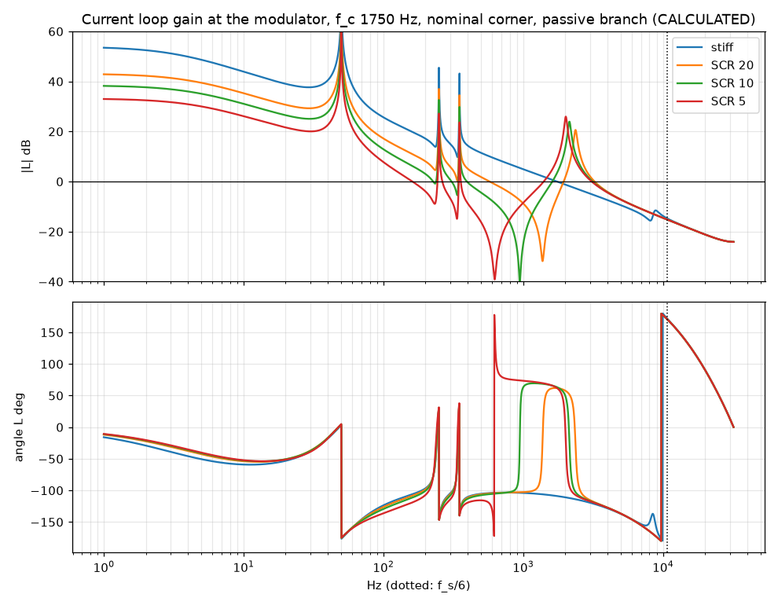
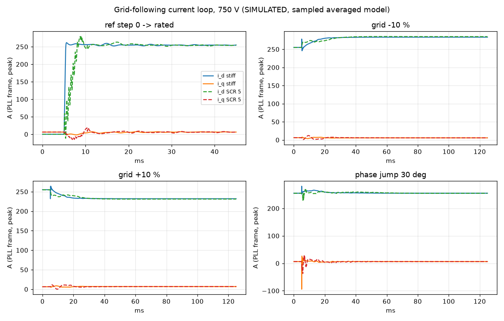
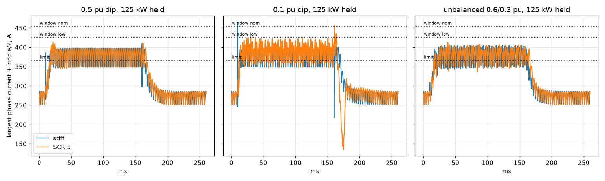
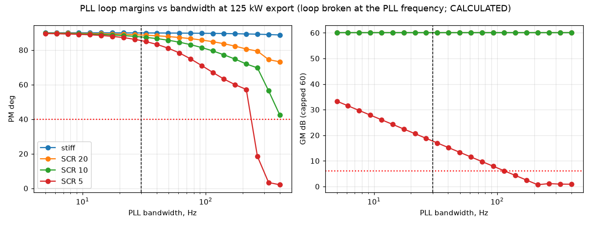
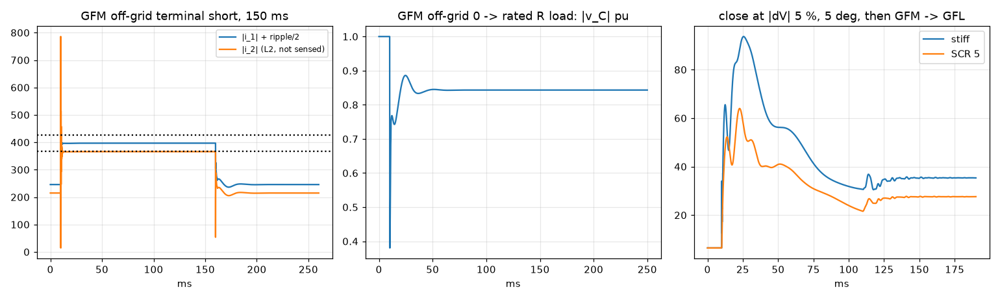

# PCS-P125 control study: current loop, PLL, DC link, grid forming, firmware

**CALCULATED by sim/pcs_control.py - not measured.** Sampled averaged models (no switching ripple in the loop, ideal devices), linear analyses and sample-by-sample simulations of the firmware structure; nothing is bench-validated. Every number below is written by the script (run time 37 s). Re-run: `caffeinate -i .venv/bin/python sim/pcs_control.py`. Hand-off: `pcs_control_spec.json`. Requirements: REQUIREMENTS AC-01, AC-02, SRC-7; closes the sampled-loop part of review finding PCM-21 / open item E1.

## What the study establishes

- **Current loop (grid following):** alpha-beta PR on the converter current (the sensor between L1 and C_f), crossover 1750 Hz on the stiff grid (K_p 1.39 ohm), resonant terms at h1 + h5, h7; with the drawn R_d-C_d branch it meets PM >= 40 deg and GM >= 6 dB from stiff to SCR 5 at every inductance, capacitance and sensor-delay corner: worst PM 48.7 deg, worst GM 12.1 dB. The crossover band that meets the rule is 1000-3250 Hz (delay-only limit 4750 Hz).
- **The passive branch is required:** without it the stiff grid fails the rule (resonance 9.01 kHz against f_s/6 = 10.67 kHz; worst PM 1.3 deg, largest |pole| 1.00087); capacitor-current active damping from the sensed C_f voltage cannot replace it at any gain tried (the 6.8 kHz divider pole and the delays make it negative damping at the stiff-grid resonance).
- **PLL:** SRF-PLL at 30 Hz has PM 85 deg / GM 17.7 dB at SCR 5 and 125 kW export; that case loses the margin rule above 114 Hz and is unstable from about 264 Hz (the PLL-induced negative resistance of the reference rotation).
- **DC link:** held at 40 Hz crossover with the measured DC-current feed-forward - mandatory: without it a constant-power DC/DC load is unstable at every SCR; large steps on the 0.41 mF link need a DC/DC power ramp and a coordinated trip at weak grids (section 6).
- **Grid forming:** droop + virtual impedance + C_f-voltage PR around a P-only current loop, voltage gains from a two-axis scan (crossover parameter 800 Hz, PR zero at 1/2 of it): closed-loop -3 dB 386 Hz at no load, 197 Hz at rated load; grid-connected stable from stiff to SCR 5 (least damping ratio 0.18); under a terminal short the limiter holds 366 A pk (limit 367 A), first peak 397 A below the window band (426-486 A); transfer sequence and permissives in section 7.
- **Firmware:** sampling plan, ISR budget, limits, anti-islanding methods and a protection state machine whose transition table passes an exhaustive invariant check (section 9).
- **Drawn hardware:** 5 mismatches (section 10): PCS-CTL phase window; Current-loop bandwidth statement (risk register E1, guide 09, pcs_spec hand-over); Pin plan route of K_A_M (AC contactor 1); DC-link capacitance seen by the DC/DC; Lowest full-load DC voltage (REQUIREMENTS AC-02: full load 600-900 V).

## What it does not establish

- No switched model: PWM ripple is added to peaks as +ripple/2, dead time is a voltage disturbance, no device or sensor nonlinearity. THDi is an estimate from the linear closed loop with assumed background distortion, not a measurement or a switched simulation.
- No standards text: grid-code limits (ROCOF, phase jump, LVRT, islanding times) are quoted from memory and labelled; no compliance is claimed, in particular not IEC 62116 anti-islanding (not simulated).
- Not covered: four-wire neutral-leg control, parallel units, LVRT reactive-current priority profiles, the AC-side start-up path, common-mode/leakage control (the C_f star on the DC midpoint is common mode only), switching-frequency interactions, ADC noise and quantisation, sensor offsets.

## 1. Inputs and assumptions

Read at run time: `sim/out/pcs_design/pcs_spec.json` (L1 120 uH, C_f 50 uF, L2 6.0 uH, R_d 2.0 ohm + C_d 10 uF; f_sw 32 kHz, sampling 64 kHz = double update, delay 1.5 T_s = 23.44 us confirmed; current tiers rated 180 A, continuous 198 A, 2_min 216 A, 200_ms 259.2 A; ripple 61.8 A pp; C_dc 0.409 mF = dc_link.C_total_uF; sync permissive 5 % / 5 deg); magnetics rev M1/M1 (L1 R_dc 2.24 mOhm, L2 0.35 mOhm at 110 C; -10 % parts at the highest current 107.3 / 5.41 uH; CM-choke DM leakage 0.58 uH added to L2); PCS-CTL / PCS-PWR design checks (current chain 2.47 us = the drawn chain 2.47 us with PCS-CTL's ASSUMED 2.0 us sensor replaced by the frozen part's 2.0 us max step (sensor source: sim/out/pcs_design/pcs_spec.json phase_current_sensor (read at run time)); C_f/grid voltage dividers 6.8 kHz; DC-link divider 30 us; DC current 11.3 kHz; phase window 426-486 A; CMPSS 493-571 A; dead time 185-510 ns). Corners: nom; low = -10 % parts at the trip current and C_f -5 %; high = +10 % at 0 A and C_f +5 %; slow = low with twice the current-chain delay; env = the pcs_spec L(I) envelope (sensitivity only). R_dc only: the HF winding resistance would add damping and is not credited. Stiff = L_g 0.

| assumption | value | basis (ASSUMED unless stated) |
|---|---|---|
| grid_rx | 0.1 | grid R/X behind the point of connection (Thevenin, SCR on the 400 V / 125 kW base) |
| scr | (None, 20.0, 10.0, 5.0) | SCRs studied (None = stiff, L_g 0); pcs_spec admits '5 .. stiff' |
| cf_tol | 0.05 | C_f tolerance (MKP film, a request-for-quotation part) |
| l_high | 1.1 | +10 % inductance corner at 0 A (magnetics tolerance +/-10 %) |
| sensor | part: Sinomags Technology STK-250HO/4, G_mV_per_A: 3.2, Vref_V: 2.5, linear_A: 625.0, bw_kHz: 200.0, t_step_us: 2.0 | phase-current sensor being frozen in sim/pcs_design.py by a parallel task (orchestrator brief 2026-10-05; read from pcs_spec phase_current_sensor at run time when that block exists, else this entry); PCS-CTL rev A0 re-valued its ladders for the 3.2 mV/A part (PCM-20). Loop: the design check's chain delay with its sensor term replaced by t_step, as one lag (conservative: 200 kHz alone is a 0.8 us lag) |
| slow_sensor | 2.0 | robustness corner: current-chain delay x this (a sensor or AFE slower than its data-sheet maximum) |
| fc_grid_Hz | (500.0, 6000.0, 250.0) | candidate stiff-grid crossovers of the current loop, K_p = 2 pi f_c (L1 + L2) |
| fz_Hz | 25.0 | fundamental resonant gain K_r = 2 K_p 2 pi f_z (dq-equivalent PI zero, error time constant ~6 ms) |
| harmonics | (5, 7, 11, 13) | resonant terms named by the pcs_spec hand-over; each kept only if its lead fits |
| sigma_h_Hz | 10.0 | harmonic resonant gains K_rh = 2 K_p 2 pi sigma (harmonic error time constant ~16 ms) |
| lead_margin_deg | 30.0 | harmonic term kept only if |phi_h + angle(plant seen by it)| <= 90 - this at every SCR |
| res_decay_frac | 0.5 | ... and only if its closed-loop mode decays at >= this x 2 pi sigma_h at every SCR and corner (a slower mode is close to the stability limit: the GFL reference path tipped h13 over at SCR 5 on import) |
| sogi_k | 1.4142135623730951 | SOGI band-pass of the C_f-voltage feed-forward (fundamental only, damping 0.71) |
| ff_reseed_pu | 0.1 | firmware: when the sensed C_f voltage leaves the SOGI output by more than this (pu of the phase peak), the SOGI state is re-seeded on the sensed vector (large steps only; no effect on the small-signal loop) |
| f_pll_Hz | 30.0 | SRF-PLL -3 dB bandwidth (zeta 0.707; 20-50 Hz class) |
| pll_dw_max_Hz | 5.0 | PLL frequency (integrator) clamp +/- (45-55 Hz), conditional integration |
| pll_slew_Hz | 25.0 | PLL total angle slew clamp +/- (lets the proportional path follow a phase jump) |
| vd_lpf_Hz | 20.0 | low-pass of the PLL-frame voltage that turns P/Q into current references (at 100 Hz the P/V conversion couples the DC-link loop into the h5/h7 resonant modes at SCR 5 and destabilises them on import) |
| f_dc_Hz | 40.0 | DC-link voltage-loop crossover on C_dc (PI zero at a quarter of it) |
| dc_zero_ratio | 4.0 | DC-link PI zero = f_dc / this |
| p_cpl_W | 125000.0 | DC/DC as a constant-power source or load on the DC bus, up to the PCS rating |
| m_max | 0.98 | modulation limit |u| <= m_max V_dc / sqrt(3) (min-max zero sequence; pcs_spec's 0.98 rule) |
| f_cv_max_Hz | 2000.0 | grid-forming C_f-voltage loop: highest crossover parameter tried, 100 Hz steps (inner loop P only) |
| fzv_ratios | (2.0, 3.0, 5.0, 10.0) | grid-forming voltage PR: dq-equivalent zero = crossover / ratio, scanned with the crossover; choice = the pair meeting the rule with the largest headroom min(PM - 40 deg, 5 x (GM - 6 dB)) |
| gfm_zeta_min | 0.1 | grid forming, grid-connected: least-damped closed-loop mode below 1 kHz has at least this damping ratio at every SCR (the multi-loop counterpart of the margin rule; the gains before the two-axis scan left 0.02 at about 100 Hz) |
| droop_p | 0.02 | P-f droop: 1 Hz (2 %) per 125 kW |
| droop_q | 0.05 | Q-V droop: 5 % of V per 125 kvar |
| f_pq_Hz | 5.0 | power measurement low-pass of the droop |
| zv_pu | (0.15, 0.3) | virtual impedance R_v, X_v (pu of 1.28 ohm), quasi-static at 50 Hz (0.05 / 0.15 pu left the grid-connected droop mode at 2-3 Hz unstable on every SCR; this pair is the smallest of a scan that is stable from stiff to SCR 5) |
| bg_harm_pct | 5: 3.0, 7: 2.0, 11: 1.0, 13: 1.0 | background grid-voltage harmonics for the THDi estimate (typical LV values; EN 50160 allows 6 / 5 / 3.5 / 3 %) |
| dt_resid_ns | 50.0 | dead-time compensation residual once each leg's dead time is identified at commissioning |
| r_sc_ohm | 0.005 | terminal short: resistance (bolted fault behind a short cable) |
| l_sc_H | 5e-06 | terminal short: cable inductance |
| t_lim_s | 0.2 | firmware: current limit 1.2 x I_max held for <= this, then trip (pcs_spec hand-over) |
| isr_cyc_per_op | 2.5 | C28x + FPU32 + TMU, compiled C: cycles per floating-point operation incl. loads/stores |
| isr_overhead_cyc | 80 | ISR entry/exit and context save with the FPU registers, cycles |
| codes | rocof_Hz_s: 2.0, f_band_Hz: (47.5, 51.5), phase_jump_deg: 30.0, dip_pu: 0.5, deep_pu: 0.1, dip_s: 0.15, island_s: 2.0, transfer_ms: 20.0 | grid-code-like limits FROM MEMORY (EN 50549-1 / ENTSO-E RfG / IEC 62116 class; Megarevo's 20 ms transfer), not verified - the standards are not on file |

## 2. Current loop (grid following)

**Structure (chosen):** PR in alpha-beta on the converter current, not PI in dq: it regulates positive and negative sequence without sequence separation (unbalanced grids, asymmetric faults, the four-wire build later), takes the harmonic terms of the hand-over directly, needs no w L cross-coupling terms (L1 varies with tolerance), and leaves the PLL only in the reference path. Feed-forward of the C_f voltage through a SOGI band-pass (fundamental only), re-seeded on steps > 0.1 pu; reference = (P - jQ)/(1.5 v_d) + j w C_eq v_d in the PLL frame, circular limiter, clamping anti-windup at the modulation limit.

**Bandwidth rule (stated):** K_p = 2 pi f_c (L1 + L2); the rule (PM >= 40 deg, GM >= 6 dB, closed loop stable) at every admitted SCR and corner fails at both ends of the f_c sweep: low f_c because the weak grid pulls the crossover (the loop sees L1 + L2 + L_g below the antiresonance) onto the resonant terms, high f_c because the stiff-grid resonance sits just below f_s/6 = 10.7 kHz, where the 1.5 T_s delay adds -90 deg to the inductor's -90 deg. Feasible 1000-3250 Hz; chosen = the grid point nearest its geometric centre (the lower on a tie): **f_c 1750 Hz**. Delay-only limit (L plant, no C_f) 4750 Hz. Harmonic terms are kept only if their lead fits every SCR and their closed-loop mode decays fast enough at every SCR and corner: h5: lead 33 deg, spread 25 deg, kept, h7: lead 42 deg, spread 30 deg, kept, h11: lead 53 deg, spread 36 deg, dropped, h13: lead 57 deg, spread 36 deg, dropped.

| f_c Hz | worst PM deg | worst GM dB | rule | harmonic terms |
|---|---|---|---|---|
| 500 | 16.3 | 18.1 | fail | - |
| 750 | 29.5 | 19.5 | fail | - |
| 1000 | 40.6 | 17.0 | pass | - |
| 1250 | 47.1 | 15.1 | pass | 5 |
| 1500 | 48.8 | 13.5 | pass | 5 |
| 1750 | 48.7 | 12.1 | pass | 5,7 |
| 2000 | 49.4 | 11.0 | pass | 5,7 |
| 2250 | 50.4 | 10.0 | pass | 5,7 |
| 2500 | 48.9 | 9.1 | pass | 5,7 |
| 2750 | 46.5 | 8.2 | pass | 5,7 |
| 3000 | 44.1 | 7.5 | pass | 5,7 |
| 3250 | 41.7 | 6.8 | pass | 5,7 |
| 3500 | 39.3 | 6.1 | fail | 5,7 |
| 3750 | 36.9 | 5.5 | fail | 5,7 |
| 4000 | 34.4 | 5.0 | fail | 5,7 |
| 4250 | 32.0 | 4.5 | fail | 5,7 |
| 4500 | 29.5 | 4.0 | fail | 5,7 |
| 4750 | 27.0 | 3.5 | fail | 5,7 |
| 5000 | 24.6 | 3.1 | fail | 5,7 |
| 5250 | 21.9 | 2.6 | fail | 5,7,11 |
| 5500 | 19.5 | 2.2 | fail | 5,7,11 |
| 5750 | 17.0 | 1.8 | fail | 5,7,11 |
| 6000 | 14.6 | 1.5 | fail | 5,7,11 |

Gains: K_p 1.392 ohm, K_r1 437.3 ohm/s, K_rh 174.9 ohm/s; Tustin with pre-warped poles at 64 kHz.

**Margins at the design gains** (worst over the corners nom/low/high/slow; nominal in brackets; f_res = highest resonant pole pair of the plant, f_bw = closed-loop -3 dB without the harmonic terms, peak = closed-loop reference response maximum):

| damping | grid | f_res kHz (zeta) | PM deg | GM dB | max abs(pole) | f_bw Hz | i_1 peak dB @ Hz | i_g peak dB @ Hz | rule |
|---|---|---|---|---|---|---|---|---|---|
| none | stiff | 9.01 (0.000) | 1.3 [7.9] | 2.5 [12.0] | 1.00087 | 2650 | 15.1 @ 9077 | 38.2 @ 9077 | FAIL |
| none | SCR 20 | 2.58 (0.001) | 50.7 [56.5] | 12.6 [14.2] | 0.99908 | 724 | 1.5 @ 364 | 2.0 @ 364 | pass |
| none | SCR 10 | 2.33 (0.001) | 51.8 [57.6] | 12.6 [14.2] | 0.99905 | 473 | 2.3 @ 262 | 3.2 @ 359 | pass |
| none | SCR 5 | 2.20 (0.001) | 49.4 [49.7] | 12.6 [14.2] | 0.99948 | 307 | 3.8 @ 258 | 5.4 @ 355 | pass |
| passive | stiff | 8.60 (0.048) | 67.9 [71.1] | 12.1 [13.7] | 0.99934 | 2650 | 0.5 @ 368 | 8.3 @ 8618 | pass |
| passive | SCR 20 | 2.37 (0.024) | 56.0 [61.4] | 12.7 [14.2] | 0.99908 | 705 | 1.5 @ 364 | 2.1 @ 364 | pass |
| passive | SCR 10 | 2.14 (0.022) | 56.3 [61.7] | 12.7 [14.2] | 0.99906 | 462 | 2.3 @ 262 | 3.5 @ 359 | pass |
| passive | SCR 5 | 2.02 (0.021) | 48.7 [49.0] | 12.7 [14.2] | 0.99951 | 301 | 3.9 @ 258 | 5.9 @ 355 | pass |
| active (K_ad 0.25 ohm) | stiff | 9.01 (0.000) | 26.1 [34.7] | 10.1 [20.8] | 1.01264 | 2641 | 0.5 @ 368 | 20.7 @ 9109 | FAIL |
| active (K_ad 0.25 ohm) | SCR 20 | 2.58 (0.001) | 43.5 [49.7] | 11.2 [13.2] | 0.99908 | 734 | 1.5 @ 364 | 2.0 @ 365 | pass |
| active (K_ad 0.25 ohm) | SCR 10 | 2.33 (0.001) | 45.1 [51.3] | 11.3 [13.2] | 0.99904 | 478 | 2.4 @ 359 | 3.3 @ 360 | pass |
| active (K_ad 0.25 ohm) | SCR 5 | 2.20 (0.001) | 45.8 [49.2] | 11.3 [13.2] | 0.99948 | 309 | 3.9 @ 258 | 5.6 @ 355 | pass |

Sensitivity 'env' (an inductor exactly at pcs_spec's L(I) envelope, 60 / 3.6 uH, passive branch): stiff PM 57 deg GM 7.5 dB (pass); SCR 20 PM 42 deg GM 7.8 dB (pass); SCR 10 PM 43 deg GM 7.8 dB (pass); SCR 5 PM 43 deg GM 7.8 dB (pass) - even a part at the envelope meets the rule.

Feed-forward variants (nominal corner, design gains, PM deg / GM dB): none: stiff 72/13.7, SCR 20 62/14.2, SCR 10 62/14.3, SCR 5 63/14.3; sogi: stiff 71/13.7, SCR 20 61/14.2, SCR 10 62/14.2, SCR 5 49/14.2; full: stiff 67/13.6, SCR 20 29/1.6, SCR 10 15/0.7, SCR 5 0/0.0. Full (unfiltered) C_f-voltage feed-forward collapses the weak-grid margins - the band-pass is not optional.

Active-damping scan (capacitor current from dv_C/dt of the sensed C_f voltage, branch not fitted; worst over SCRs and corners): K_ad 0.25 ohm: PM 26 deg, GM 10.1 dB, max |pole| 1.013 (fail); K_ad 0.5 ohm: PM 36 deg, GM 9.8 dB, max |pole| 1.024 (fail); K_ad 1.0 ohm: PM 27 deg, GM 7.0 dB, max |pole| 1.045 (fail); K_ad 2.0 ohm: PM 10 deg, GM 2.4 dB, max |pole| 1.081 (fail); K_ad 4.0 ohm: PM 2 deg, GM 0.4 dB, max |pole| 1.143 (fail); K_ad 8.0 ohm: PM 29 deg, GM 5.1 dB, max |pole| 1.239 (fail).

## 3. Step responses (125 kW export, 750 V unless stated)

| case | grid | V_dc | peak (averaged), A | tier reached | peak + ripple/2, A | window | settling to 5 % of rated, ms | overshoot % / deviation A | modulation limit, ms |
|---|---|---|---|---|---|---|---|---|---|
| ref step 0 -> rated | stiff | 750 | 256 | continuous (198 A rms) | 287 | inside | 0.4 | 2.6 % | 0.3 |
| grid -10 % | stiff | 750 | 283 | 2_min (216 A rms) | 314 | inside | 7.3 | 37 A | 0.0 |
| grid +10 % | stiff | 750 | 255 | continuous (198 A rms) | 286 | inside | 5.4 | 32 A | 0.0 |
| grid +10 % | stiff | 600 | runaway | - | > 486 | TRIP | - | - | 120.0 |
| phase jump 30 deg | stiff | 750 | 289 | 2_min (216 A rms) | 320 | inside | 0.8 | 104 A | 0.0 |
| ref step 0 -> rated | SCR 5 | 750 | 270 | continuous (198 A rms) | 301 | inside | 5.7 | 9.8 % | 3.1 |
| grid -10 % | SCR 5 | 750 | 285 | 2_min (216 A rms) | 316 | inside | 12.6 | 30 A | 0.0 |
| grid +10 % | SCR 5 | 750 | 255 | continuous (198 A rms) | 286 | inside | 0.5 | 24 A | 0.0 |
| grid +10 % | SCR 5 | 600 | 402 | above every tier | 433 | trip possible | 77.1 | 546 A | 125.0 |
| phase jump 30 deg | SCR 5 | 750 | 259 | continuous (198 A rms) | 290 | inside | 3.3 | 50 A | 0.9 |

Tiers as peaks: rated 180 A rms = 255 A, continuous 198 A rms = 280 A, 2_min 216 A rms = 305 A, 200_ms 259.2 A rms = 367 A; window band 426-486 A ('trip possible' = above the band's low edge). 'Deviation' = largest departure of the PLL-frame current from its final value. At 600 V the +10 % grid is outside the modulation range (rated current at any PF needs 672 V stiff / 790 V at SCR 5): the current is not controlled and the averaged model runs away - in hardware the window trips; firmware must refuse that operating point (operating map of sim/pcs_design.py).

## 4. Grid faults and current limiting (power reference held, so the reference saturates)

| case | grid | limit A pk | peak during dip | peak on recovery | in limit ms | modulation limit ms | above window low edge |
|---|---|---|---|---|---|---|---|
| 0.5 pu dip | stiff | 367 | 398 | 409 | 146 | 0.1 | no |
| 0.1 pu dip | stiff | 367 | 465 | 417 | 155 | 0.2 | YES |
| unbalanced 0.6/0.3 pu | stiff | 367 | 405 | 399 | 139 | 0.0 | no |
| 0.5 pu dip | SCR 5 | 367 | 414 | 412 | 148 | 0.3 | no |
| 0.1 pu dip | SCR 5 | 367 | 427 | 457 | 159 | 17.9 | YES |
| unbalanced 0.6/0.3 pu | SCR 5 | 367 | 413 | 396 | 140 | 0.0 | no |
| 0.5 pu dip, no re-seed | stiff | 367 | 410 | 397 | 146 | 0.0 | no |
| 0.1 pu dip, no re-seed | stiff | 367 | 510 | 404 | 155 | 0.0 | YES |
| unbalanced 0.6/0.3 pu, no re-seed | stiff | 367 | 414 | 398 | 139 | 0.0 | no |
| 0.5 pu dip, no re-seed | SCR 5 | 367 | 401 | 381 | 148 | 0.0 | no |
| 0.1 pu dip, no re-seed | SCR 5 | 367 | 504 | 415 | 157 | 15.3 | YES |
| unbalanced 0.6/0.3 pu, no re-seed | SCR 5 | 367 | 415 | 382 | 140 | 0.0 | no |
| 0.5 pu dip, no re-seed, limit 216 A rms | stiff | 305 | 410 | 345 | 156 | 0.0 | no |
| 0.1 pu dip, no re-seed, limit 216 A rms | stiff | 305 | 510 | 374 | 162 | 0.0 | YES |
| unbalanced 0.6/0.3 pu, no re-seed, limit 216 A rms | stiff | 305 | 356 | 337 | 152 | 0.0 | no |
| 0.5 pu dip, no re-seed, limit 216 A rms | SCR 5 | 305 | 389 | 353 | 156 | 0.0 | no |
| 0.1 pu dip, no re-seed, limit 216 A rms | SCR 5 | 305 | 447 | 399 | 162 | 14.4 | YES |
| unbalanced 0.6/0.3 pu, no re-seed, limit 216 A rms | SCR 5 | 305 | 357 | 349 | 153 | 0.0 | no |
| 0.5 pu dip, no feed-forward | SCR 5 | 367 | 440 | 366 | 148 | 0.0 | YES |

Peaks include +ripple/2 = 30.9 A. **0.5 pu dip at 125 kW export:** the limiter holds the reference at 367 A pk and the converter stays inside the window: peaks 409 A (stiff), 414 A (SCR 5) against the 426 A low edge of the band. What-if: the stiff 0.1 pu dip with a 30 kHz C_f divider 442 A against 465 A as drawn.

## 5. PLL

| grid | P kW | PM / GM at 30 Hz | rule holds up to Hz | unstable from Hz |
|---|---|---|---|---|
| stiff | +125 | 90 / inf | 400 | > 400 |
| stiff | -125 | 90 / inf | 400 | > 400 |
| SCR 20 | +125 | 89 / inf | 400 | > 400 |
| SCR 20 | -125 | 91 / inf | 400 | > 400 |
| SCR 10 | +125 | 88 / inf | 400 | > 400 |
| SCR 10 | -125 | 93 / inf | 400 | > 400 |
| SCR 5 | +125 | 85 / 17.7 | 114 | 264 |
| SCR 5 | -125 | 98 / inf | 400 | > 400 |

Loop broken at the PLL frequency with every other loop closed (current loop, reference rotation, feed-forward, the grid). Time domain at 30 Hz (limits ASSUMED from memory: phase jump 30 deg, ROCOF 2.0 Hz/s): phase jump stiff: angle error peak 41.6 deg, < 2 deg after 45 ms, frequency estimate peak 3.48 Hz, phase current 313 A; frequency ramp stiff: angle error peak 0.1 deg, ramp error 0.09 deg (type-2 theory 0.09), frequency estimate peak 0.75 Hz, phase current 286 A; phase jump SCR 5: angle error peak 40.4 deg, < 2 deg after 45 ms, frequency estimate peak 3.61 Hz, phase current 299 A; frequency ramp SCR 5: angle error peak 0.1 deg, ramp error 0.09 deg (type-2 theory 0.09), frequency estimate peak 0.75 Hz, phase current 286 A. Against the assumed limits: the 30 deg jump is ridden through (phase current at most 313 A against the 426 A window edge; the frequency estimate peaks at 3.61 Hz, inside its +/-5 Hz clamp) and the 2.0 Hz/s ramp is tracked with 0.09 deg error. The angle error peak exceeds the jump because the sensed C_f voltage overshoots the grid angle before the PLL moves: stiff: v_C at 41.8 deg 78 us after the jump, PLL moved 0.2 deg; SCR 5: v_C at 43.3 deg 1000 us after the jump, PLL moved 2.9 deg (stiff: LCL ringing; SCR 5: the current through the grid impedance).

## 6. DC-link voltage loop (inverter holds V_dc; DC/DC = constant-power source + / load -)

| grid | V_dc | DC/DC kW | DC-current feed-forward | PM deg | GM dB | worst-PM crossover Hz | max abs(pole) | rule |
|---|---|---|---|---|---|---|---|---|
| stiff | 600 | +125 | yes | 75.3 | 43.9 | 41 | 0.99933 | pass |
| stiff | 600 | +125 | no | 105.9 | inf | 3 | 0.99977 | pass |
| stiff | 600 | -125 | yes | 72.2 | 28.0 | 40 | 0.99933 | pass |
| stiff | 600 | -125 | no | 71.5 | 10.7 | 3 | 1.00783 | FAIL |
| stiff | 750 | +125 | yes | 75.7 | 47.8 | 41 | 0.99933 | pass |
| stiff | 750 | +125 | no | 114.1 | inf | 5 | 0.99968 | pass |
| stiff | 750 | -125 | yes | 72.6 | 27.9 | 41 | 0.99933 | pass |
| stiff | 750 | -125 | no | 59.1 | 6.8 | 5 | 1.00320 | FAIL |
| SCR 5 | 600 | +125 | yes | - | - | - | - | outside the modulation range |
| SCR 5 | 600 | +125 | no | - | - | - | - | outside the modulation range |
| SCR 5 | 600 | -125 | yes | 59.1 | 6.7 | 49 | 0.99967 | pass |
| SCR 5 | 600 | -125 | no | 71.5 | 11.1 | 3 | 1.00547 | FAIL |
| SCR 5 | 750 | +125 | yes | 86.3 | 47.7 | 46 | 0.99948 | pass |
| SCR 5 | 750 | +125 | no | 114.1 | inf | 5 | 0.99968 | pass |
| SCR 5 | 750 | -125 | yes | 58.5 | 6.6 | 50 | 0.99968 | pass |
| SCR 5 | 750 | -125 | no | 59.2 | 7.1 | 5 | 1.00256 | FAIL |

C_dc 0.409 mF stores 115 J at 750 V (about 1 ms of rated power); the constant-power pole at 600 V / 125 kW is 135 Hz.

| case | grid | ramp ms | C_dc mF | V min | V max | recovers |
|---|---|---|---|---|---|---|
| DC/DC load 0 -> 125 kW | stiff | 0 | 0.41 | 686 | 763 | yes |
| DC/DC load 125 kW trips | stiff | 0 | 0.41 | 735 | 842 | yes |
| DC/DC load 0 -> 125 kW | stiff | 0 | 1.64 | 734 | 753 | yes |
| DC/DC load 125 kW trips | stiff | 0 | 1.64 | 746 | 777 | yes |
| DC/DC load 0 -> 125 kW | stiff | 5 | 0.41 | 719 | 758 | yes |
| DC/DC load 0 -> 125 kW | stiff | 20 | 0.41 | 744 | 754 | yes |
| DC/DC load 0 -> 125 kW | SCR 5 | 0 | 0.41 | collapse | - | NO |
| DC/DC load 125 kW trips | SCR 5 | 0 | 0.41 | 700 | 1098 | yes |
| DC/DC load 0 -> 125 kW | SCR 5 | 0 | 1.64 | 569 | 893 | yes |
| DC/DC load 125 kW trips | SCR 5 | 0 | 1.64 | 727 | 881 | yes |
| DC/DC load 0 -> 125 kW | SCR 5 | 5 | 0.41 | 633 | 821 | yes |
| DC/DC load 0 -> 125 kW | SCR 5 | 20 | 0.41 | 720 | 789 | yes |

'collapse': the averaged model has no body-diode rectifier floor, so its voltage after a collapse means nothing; in hardware the bus falls to the rectified grid peak and the DC/DC's undervoltage limit acts.

## 7. Grid forming and transfers

Voltage PR on v_C, K_pv = 2 pi f_cv C_eq, dq-equivalent zero at f_cv / ratio. The rule (PM >= 40 deg, GM >= 6 dB, cascade poles inside the unit circle; no load and rated resistive load, every corner) holds on two islands per ratio, split by a gain-margin notch, so the choice is the pair with the largest headroom min(PM - 40, 5 (GM - 6)): **f_cv 800 Hz, ratio 2** (K_pv 0.302 S, K_rv 1516.0 S/s; worst PM 83 deg, GM 11.6 dB). Off-grid: nl/nom PM 86 GM 12.4 dB, closed-loop -3 dB 386 Hz; nl/low PM 86 GM 12.5 dB, closed-loop -3 dB 382 Hz; rl/nom PM 84 GM 11.6 dB, closed-loop -3 dB 197 Hz; rl/low PM 84 GM 11.6 dB, closed-loop -3 dB 197 Hz. Achievable: the fastest pair meeting the rule (f_cv 1300 Hz, ratio 2, PM 67 deg, GM 6.3 dB) reaches 480 Hz at rated load. The stiffness against a load step is set by K_pv x R_load < 1 (K_pv is capped by the inner loop), not by the bandwidth: see the load step below.

| zero ratio | f_cv meeting the rule, Hz | largest headroom there |
|---|---|---|
| 2 | 300, 600, 700, 800, 900, 1000, 1100, 1200, 1300 | 28.1 |
| 3 | 300, 800, 900, 1000, 1100, 1200, 1300, 1400, 1500 | 23.0 |
| 5 | 300, 400, 500, 1000, 1100, 1200, 1300, 1400, 1500, 1600 | 17.1 |
| 10 | 300, 400, 500, 600, 700, 800, 1500, 1600, 1700, 1800 | 22.8 |

Grid-connected poles (P_set 62.5 kW): stiff: max abs(pole) 0.999776, least damped 0.257 at 157 Hz; SCR 20: max abs(pole) 0.999771, least damped 0.221 at 142 Hz; SCR 10: max abs(pole) 0.999768, least damped 0.211 at 128 Hz; SCR 5: max abs(pole) 0.999763, least damped 0.184 at 107 Hz.

- Off-grid 0 -> rated resistive load: v_C dips to 0.38 pu, within 10 % after 5 ms, 5 % after 8 ms, ends at 0.843 pu (virtual-resistance drop: a slow secondary restoration is a firmware item), frequency -1.0 Hz (droop).
- Off-grid terminal short for 150 ms from rated load: the limiter holds 366 A pk; first peak 397 A incl. ripple (below the window's low edge 426 A); L2 carries the C_f discharge, 786 A pk, which no sensor sees; in limit 150 ms (firmware trips at 200 ms); after clearing v_C overshoots to 1.13 pu and is within 5 % after 100 ms.
- Close at the permissive edge (5 %, 5 deg), stiff: peak 124 A incl. ripple (pcs_spec inrush estimate 107 A); GFM -> GFL switch deviation 22 A.
- Close at the permissive edge (5 %, 5 deg), SCR 5: peak 95 A incl. ripple (pcs_spec inrush estimate 107 A); GFM -> GFL switch deviation 10 A.
- Islanding at SCR 10 with a 62.5 kW local load, inverter at 125.0 kW (export to the grid 62.5 kW): GFL -> GFM switch moves v_C by 0.3 %; when the upstream breaker opens v_C peaks at 1.40 pu, is 1.09 pu after 10 ms and settles at 1.10 pu; frequency +0.40 Hz (droop) - a load rejection: C_f charges before the voltage loop acts, and the set point keeps the virtual-impedance drop of the export (secondary restoration is a firmware item).
- Islanding at SCR 10 with a 62.5 kW local load, inverter at 62.5 kW (export to the grid 0.0 kW): GFL -> GFM switch moves v_C by 0.2 %; when the upstream breaker opens v_C peaks at 1.00 pu, is 1.00 pu after 10 ms and settles at 1.00 pu; frequency +0.00 Hz (droop) - the planned sequence.

A transfer within 20 ms needs the unit to be grid forming before the grid is lost (switching GFL -> GFM after detection takes as long as the detection), and a planned transfer ramps the grid exchange to zero first.

**Transfer sequence (state list):**

| state | entry | exit / permissive | outputs | measured | hardware behind it |
|---|---|---|---|---|---|
| IDLE | power-up (latch set), stop finished, fault cleared | start: IMD passed, polarity OK, no latch, T in range | all off | V_DC terminal, V_link, VPE, NTC | latch power-up tripped, ENABLE, heartbeat |
| DC PRECHARGE | start | |V_link - V_bat| <= 10 V -> K_DC closes, K_PRE opens; timeout 1.2 s (3 x the PCS-PWR 10 V time, ASSUMED factor) -> FAULT | K_PRE | V_link (VB), V_terminal (VBX), I_DC | hardware precharge-dV and polarity interlocks, port OC, DC OV |
| AC SYNCHRONISATION | precharged | grid: |dV| <= 5 %, |dtheta| <= 5 deg, |df| <= 0.1 Hz, relay test (each contactor alone) passed, V_dc >= 1.02 x sqrt(2) x V_LL,rms(measured) + 10 V and >= the map's V_dc for the commanded P / Q: 624 V at 400 V, 718 V at 460 V (no load) -> K_AC1+K_AC2 close -> GFL; dead bus (VG < 10 %) -> GFM | PWM (GFM on C_f, contactors open), K_DC | VC1-3, VG1-3 (both sides of the contactors), PLL on VG | phase window +/-455 A (426-486 A, 3.5 us) + CMPSS 493-571 A, DESAT per channel, DC OV 978-1048 V, OT, heartbeat, ENABLE, RDY |
| GFL RUN | synced_grid / gfl_cmd (bumpless) | stop, grid out of window or islanding -> STOP; limit > 200 ms -> STOP; island_cmd -> GFM | PWM, K_DC, K_AC | IL1-3, VC1-3, VG1-3, V_link, I_DC, RCM | phase window +/-455 A (426-486 A, 3.5 us) + CMPSS 493-571 A, DESAT per channel, DC OV 978-1048 V, OT, heartbeat, ENABLE, RDY, port OC/hold-off |
| GFM RUN | dead_bus / island_cmd (bumpless) | gfl_cmd when grid connected; stop; limit > 200 ms -> STOP | PWM, K_DC, K_AC | same + P/Q from v_C and i_1 - j w C v_C | phase window +/-455 A (426-486 A, 3.5 us) + CMPSS 493-571 A, DESAT per channel, DC OV 978-1048 V, OT, heartbeat, ENABLE, RDY, port OC/hold-off |
| CONTROLLED STOP | stop / grid_out / limit_timeout | current ramped to 0, K_AC open at zero current, PWM off, K_DC open below its breaking current -> IDLE | PWM until zero current | IL1-3, I_DC | phase window +/-455 A (426-486 A, 3.5 us) + CMPSS 493-571 A, DESAT per channel, DC OV 978-1048 V, OT, heartbeat, ENABLE, RDY |
| FAULT | any hardware latch source or firmware hazard trip | clear: every source inactive, cause logged, PWM commands low -> IDLE | all off (HOLD may keep K_DC) | latch status, FLT_N, RDY, OC_N, OVT_N | latch holds PWM, EN, K_PRE, K_AC1/2 low (HEALTHY gating); K_DC kept only by HOLD |
| SERVICE | service command in IDLE | exit -> IDLE | all off; IMD switches, trip-path self-test | everything (calibration, self-test) | latch held, ENABLE |

## 8. THDi estimate and dead time (CALCULATED, assumed background distortion)

| controller | dead time | worst THDi % | at |
|---|---|---|---|
| design (h1+h5+h7, 1750 Hz) | none (0 ns: background only) | 1.52 | SCR 20 |
| design (h1+h5+h7, 1750 Hz) | no compensation (510 ns) | 2.17 | SCR 20 |
| design (h1+h5+h7, 1750 Hz) | compensated at the band midpoint | 1.71 | SCR 20 |
| design (h1+h5+h7, 1750 Hz) | compensated, identified per leg | 1.58 | SCR 20 |
| design without harmonic terms (1750 Hz) | none (0 ns: background only) | 4.03 | SCR 20 |
| design without harmonic terms (1750 Hz) | no compensation (510 ns) | 5.60 | SCR 20 |
| design without harmonic terms (1750 Hz) | compensated at the band midpoint | 4.53 | SCR 20 |
| design without harmonic terms (1750 Hz) | compensated, identified per leg | 4.19 | SCR 20 |
| 1 kHz (risk register) | none (0 ns: background only) | 6.27 | stiff |
| 1 kHz (risk register) | no compensation (510 ns) | 8.81 | stiff |
| 1 kHz (risk register) | compensated at the band midpoint | 7.08 | stiff |
| 1 kHz (risk register) | compensated, identified per leg | 6.52 | stiff |

Dead-time error 185-510 ns at 900 V and 32 kHz = 5.3-14.7 V average, a square wave with the current sign; plus the PWM figure of pcs_spec (0.20 %).

## 9. Firmware requirements

| round | nets | pins | ADC A/B/C |
|---|---|---|---|
| 1 | IL1_ADC, IL2_ADC, IL3_ADC | A2/B6/C9, A10/B1/C10, A14/B14/C4 | A/B/C |
| 2 | VC1_ADC, VC2_ADC, VC3_ADC | A5, B5, B0/C11 | A/B/C |
| 3 | VA_ADC, VB_ADC, IB_ADC | A11/B10/C0, A1/B7/DACB_OUT, A7/C3 | A/B/C |
| 4 | VG1_ADC, VG2_ADC, VG3_ADC | A6, B11, C1 | A/B/C |

Rounds 1-3 at both update instants (carrier zero and peak), round 4 once per carrier period, VA/VB 4 times per period (every 7.8 us: the pin plan's ADC-PPB over-voltage backup needs <= 10 us), slow channels (NTC multiplexer, NTC9, inlet, RCM, VPE, VBX, IB_H) once per ms: 25.2 conversions per 31.25 us, 15 % ADC load at 0.56 us per conversion (PCS-CTL's own figure), last loop input 1.67 us after the trigger. The RCM rate is a placeholder until the type-B sensor (RFQ) fixes its output bandwidth.

| ISR at 64 kHz | operations | cycles | us | % of 15.625 us |
|---|---|---|---|---|
| GFL | 157 | 472 | 3.94 | 25 |
| GFL + DC link | 164 | 490 | 4.08 | 26 |
| GFM + DC link | 198 | 575 | 4.79 | 31 |

Cost model ASSUMED: 2.5 cycles per operation (compiled C, FPU32 + TMU), 80 cycles of entry/exit, F280039C at 120 MHz; slower tasks (grid protection, RMS, ROCOF, thermal model, anti-islanding) at 1 kHz add about 1 %. The CLA can take the 64 kHz part.

| limit / setting | value |
|---|---|
| current-reference limiter | circular on i_1 ref: 259 A rms (367 A pk) for <= 200 ms, then 216 A rms for <= 2 min, then 198 A rms; timer -> controlled stop |
| modulation limiter | |u| <= 0.5495 V_dc,meas (pcs_spec operating_map m_usable 1.0990 (dead-time and headroom deducted)); clamping anti-windup on the resonant terms; refuse to start / stop when V_dc is below the operating map (672 V at a +10 % grid, rated current, this study) |
| feed-forward | SOGI (k 1.41) on v_C; re-seed when |v_C - v_ff| > 0.1 pu |
| PLL | SRF on VC, 30 Hz, integrator +/-5 Hz with conditional integration, angle slew +/-25 Hz; add the divider lag atan(w tau_v) = 0.42 deg to the angle; protection frequency from the integrator, filtered |
| P/Q -> current | voltage magnitude low-passed at 20 Hz |
| DC-link loop | PI 40 Hz crossover + measured DC-current feed-forward (mandatory); DC/DC power ramp <= 125 kW in 20 ms; a DC/DC trip must stop the PCS current in the same frame (coordinated) |
| sampling | ADC SOC at carrier zero and period, delayed by the current-chain delay 2.47 us so the sample sits on the ripple midpoint; 3 simultaneous rounds before the ISR; VA/VB 4 x per carrier period (<= 10 us apart, ADC-PPB over-voltage backup) |
| dead time | program >= 433 ns so the firmware value, not the hardware stretch (185-510 ns), sets it; or identify each leg's effective dead time at commissioning and compensate (THDi estimate: section 8) |
| synchronisation | close K_AC1/K_AC2 only at |dV| <= 5 %, |dtheta| <= 5 deg (pcs_spec), |df| <= 0.1 Hz (assumed), after the relay test |
| ADC configuration | AGPIOCTRLA GPIO20/21 = 0: B5/B11 read on pins 32/30, pins 48/49 stay digital (TACH3, RCM_TST) |

| anti-islanding | method | measurements | note |
|---|---|---|---|
| passive | U/f windows on VG1-3 (RMS over one cycle, 1 kHz task) and ROCOF from the PLL integrator filtered over 100-200 ms; vector shift from the PLL angle error | VG1-3, VC1-3 | non-detection zone when P and Q match the local load |
| active | Sandia frequency shift: a chopping fraction cf = cf0 + k (f - f0) on the current reference (GFL only); a Q perturbation is the alternative | PLL frequency, IL1-3 | detection 0.2-2 s (from memory), small THD cost; not simulated, compliance (IEC 62116 test) not claimed |
| not possible | impedance measurement by injection would need the grid current: there is no grid-side current sensor (i_2 is only estimated as i_1 - C_f dv_C/dt) | - | - |

Protection state machine: outputs (PWM, K_PRE, K_DC, K_AC1+2) per state IDLE (0, 0, 0, 0), PRECHARGE (0, 1, 0, 0), SYNC (1, 0, 1, 0), GFL (1, 0, 1, 1), GFM (1, 0, 1, 1), STOP (1, 0, 1, 1), FAULT (0, 0, 0, 0), SERVICE (0, 0, 0, 0). Exhaustive check over every (state, event) pair: I1 hw_trip and fw_trip lead to FAULT from every state: holds; I2 FAULT: PWM off, precharge and AC contactors open: holds; I3 AC contactors close only out of SYNC on a permissive: holds; I4 DC contactor closes only out of PRECHARGE on 'precharged': holds; I5 PWM only in SYNC, GFL, GFM, STOP: holds; I6 FAULT is left only by 'clear', to IDLE: holds; I7 every state reachable from IDLE: holds; I8 IDLE reachable from every state: holds. (The check found that a stop during synchronisation routed through CONTROLLED STOP would have closed the AC contactors; the transition now goes to IDLE.) Verified = the table, not firmware code.

## 10. The drawn hardware against the loop

| item | as drawn / stated | study result | verdict |
|---|---|---|---|
| PCS-CTL phase window | +/-455 A nominal, worst band 426-486 A (basis 1.05 x the normal peak 397.5 A) | peaks above the band's low edge (averaged + ripple/2): 0.1 pu dip (stiff) 465 A (above the nominal threshold: trips); 0.1 pu dip (SCR 5) 457 A (above the nominal threshold: trips); highest peak below the band: 0.5 pu dip (SCR 5) 414 A | MISMATCH |
| Current-loop bandwidth statement (risk register E1, guide 09, pcs_spec hand-over) | 'the filter allows a current-loop bandwidth of up to 1 kHz (below half the lowest resonance)'; resonant terms h5/h7/h11/h13 | crossovers meeting the rule (stiff-grid parameter) 1000-3250 Hz, delay-only limit 4750 Hz: 1 kHz is the lower edge, not the ceiling; the weak grid lowers the loop (closed-loop -3 dB at the design: stiff 2650 Hz, SCR 5 301 Hz); at 1 kHz the harmonic terms kept are none and THDi reaches 6.5 % (estimate); h11/h13 fit at no crossover that meets the rule | MISMATCH |
| PCS-CTL ADC plan (design check) | '25 conversions per 31.25 us on 3 ADCs = 15 %', the PV control spec's plan | inverter: 25.2 conversions per 31.25 us, 15 % busy, last loop input 1.67 us after the trigger; VA/VB 4 x per period (every 7.8 us) for the pin plan's <= 10 us OV backup; IL1-3, VC1-3, VA/VB/IB and VG1-3 each convert simultaneously on A/B/C: yes | OK |
| TMUX1208 temperature multiplexer | 5 ms settling per address, NTC1-8 on one ADC pin | a full scan takes >= 40 ms: no loop uses a temperature; derating and the 1 s firmware layer are slower; the 200 ms overload rests on the current-based junction model; the hardware OT comparators sit on the NTC nets, not behind the multiplexer | OK |
| Dead time at the gates vs THDi < 3 % at rated current | 185-510 ns (PCS-PWR stretch) | THDi estimate, worst SCR, 900 V, with the harmonic terms: none (0 ns: background only) 1.5 %; no compensation (510 ns) 2.2 %; compensated at the band midpoint 1.7 %; compensated, identified per leg 1.6 %; without them: none (0 ns: background only) 4.0 %; no compensation (510 ns) 5.6 %; compensated at the band midpoint 4.5 %; compensated, identified per leg 4.2 % | OK (the dead time matters only without the harmonic terms) |
| Dead band in the PCS-CTL firmware table | 300 ns | pcs_spec hand-over 300 ns; PCS-PWR stretches any value below 433 ns to 185-510 ns, so neither reaches the gates (firmware rule in section 9) | OK |
| C_f voltage divider pole (VC1-3, VG1-3) | 6.8 kHz | capacitor-current active damping from dv_C/dt fails at the stiff grid for every gain tried (best max |pole| 1.013): the R_d-C_d branch is load-bearing; a 30 kHz divider would move the stiff 0.1 pu dip peak from 465 to 442 A | NOTE (keep the passive branch fitted) |
| PCS-CTL trip table, CMPSS row | 'requirement 492.0-572.0 A' | a PV cell-current band left in the inverter's table (the CMPSS backup sits at 493-571 A) | OK |
| Pin plan route of K_A_M (AC contactor 1) | gen/data/pcs_ctrl_pin_plan.csv: 'AND HEALTHY -> K_A (AC contactor 1: HEALTHY only, D-062; HOLD keeps only K_B)' | design check and gen/pcs_ctrl.py: HEALTHY only (D-062); FAULT in the state machine relies on it | MISMATCH (text) |
| DC-link capacitance seen by the DC/DC | 0.41 mF (dc_link.C_total_uF); sim/dab_control.py assumes C_pcs 4 mF | SCR 5, 750 V, steps: 125 kW DC/DC load -> bus collapse; 125 kW DC/DC trip -> 1098 V max (OV band 978-1048 V); with 4 x C_dc: 569 V min, 881 V | MISMATCH (cross-study; DC/DC power ramp and a coordinated trip needed) |
| Lowest full-load DC voltage (REQUIREMENTS AC-02: full load 600-900 V) | 600 V | rated current at any PF with the grid at +10 % needs 672 V (stiff) / 790 V (SCR 5) (pcs_spec operating_map m_usable 1.0990 (dead-time and headroom deducted)); pcs_spec operating map 706 V (grid impedance not counted); the +10 % grid step at 600 V loses current control | MISMATCH (requirement vs map; firmware rule) |
| L1/L2 L(I) envelope of the inductor specification | down to 60 / 3.6 uH at the trip current | a part at the envelope still meets the rule (worst PM 42 deg, GM 7.5 dB); the designed amorphous parts stay >= 107 / 5.4 uH | OK |
| Phase-current sensor gain vs the PCS-CTL window ladder | ladder computed for 3.2 mV/A (PCS-CTL assumption); frozen Sinomags Technology STK-250HO/4 3.2 mV/A, linear +/-625 A (ASSUMED, section 1) | the drawn ladder would trip at about 426-486 A (x 1.00), above the 493 A top the window must keep, gates off at about 516 A against the 600 A limit; the CMPSS backup is a DAC value (firmware) | OK |
| Phase-current sensor response | PCS-CTL assumed 2.0 us (chain 2.47 us); frozen part 2 us max step | loop: chain 2.47 us nominal; the rule holds at 2 x that (corner 'slow'); trip: gates off 3.47 us after the crossing -> 516 A <= 600 A (at the drawn gain) | OK |
| Grid-side current | not sensed (i_2 estimated as i_1 - C_f dv_C/dt) | grid forming off-grid: a 0 -> rated resistive step dips v_C to 0.38 pu, within 10 % after 5 ms; a load-current feed-forward needs a measured output current (the estimate contains the inner loop's own current) | NOTE (design gap if a stiff off-grid voltage is required: three grid-side sensors) |

## 11. Open items

- A switched (PWM, dead-time, ripple-sampling) simulation of the chosen loops and a THDi figure from it; ADC noise.
- Phase-current sensor: the frozen Sinomags Technology STK-250HO/4 (3.2 mV/A) needs the PCS-CTL window ladder re-valued (drawn for 3.2 mV/A); its 2 us step response is in the loop here; the residual-current sensor is still a quotation part.
- The fault-transient peaks above the window's low edge need a decision: cycle-by-cycle limiting on the CMPSS below the latch band, a faster C_f divider, or accepting a trip on close-in faults.
- DC/DC coordination: power ramp and a shared trip signal; the DAB study's 4 mF assumption.
- Grid forming without a grid-side current sensor: load-step voltage dip; secondary voltage/frequency restoration; the virtual impedance (0.15 + j0.30 pu) was not re-scanned with the new voltage-loop gains.
- PLL: plain SRF on v_C; a positive-sequence (DSOGI) front end for unbalanced grids is a firmware option, not studied.
- Standards (EN 50549-1, IEC 62116, GB/T 34120) to buy and check against the assumed limits.

## Files

`sim/pcs_control.py`; `sim/out/pcs_control/`: report.md, pcs_control_spec.json, bode_scr.png, steps.png, faults.png, pll_weak_grid.png, gfm.png.
