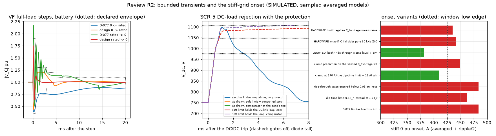
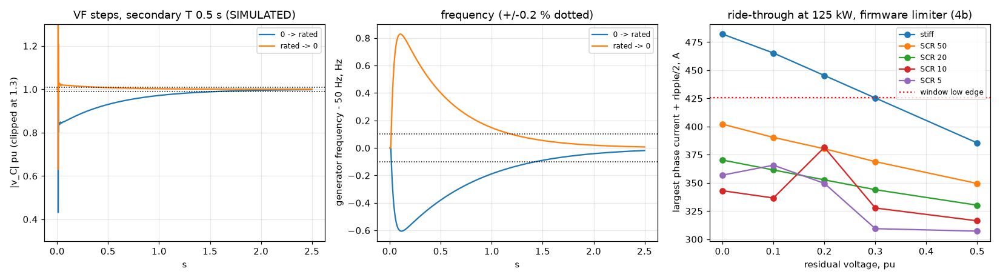

# PCS-P125 control study: current loop, PLL, DC link, grid forming, firmware

**CALCULATED by sim/pcs_control.py - not measured.** Sampled averaged models (no switching ripple in the loop, ideal devices), linear analyses and sample-by-sample simulations of the firmware structure; nothing is bench-validated. Every number below is written by the script (run time 203 s). Re-run: `caffeinate -i .venv/bin/python sim/pcs_control.py`. Hand-off: `pcs_control_spec.json`. Requirements: REQUIREMENTS AC-01, AC-02, SRC-7; closes the sampled-loop part of review finding PCM-21 / open item E1.

## What the study establishes

- **Current loop (grid following):** alpha-beta PR on the converter current (the sensor between L1 and C_f), crossover 1750 Hz on the stiff grid (K_p 1.39 ohm), resonant terms at h1 + h5, h7; with the drawn R_d-C_d branch it meets PM >= 40 deg and GM >= 6 dB from stiff to SCR 5 at every inductance, capacitance and sensor-delay corner: worst PM 48.5 deg, worst GM 12.1 dB. The crossover band that meets the rule is 1000-3250 Hz (delay-only limit 4750 Hz).
- **The passive branch is required:** without it the stiff grid fails the rule (resonance 9.01 kHz against f_s/6 = 10.67 kHz; worst PM 0.9 deg, largest |pole| 1.00117); capacitor-current active damping from the sensed C_f voltage cannot replace it at any gain tried (the 6.8 kHz divider pole and the delays make it negative damping at the stiff-grid resonance).
- **PLL:** SRF-PLL at 30 Hz has PM 85 deg / GM 17.7 dB at SCR 5 and 125 kW export; that case loses the margin rule above 114 Hz and is unstable from about 264 Hz (the PLL-induced negative resistance of the reference rotation).
- **DC link:** held at 40 Hz crossover with the measured DC-current feed-forward - mandatory: without it a constant-power DC/DC load is unstable at every SCR; large steps on the 0.41 mF link need a DC/DC power ramp and a coordinated trip at weak grids (section 6).
- **Grid forming:** droop + virtual impedance + C_f-voltage PR around a P-only current loop, voltage gains from a two-axis scan (crossover parameter 800 Hz, PR zero at 1/2 of it): closed-loop -3 dB 386 Hz at no load, 197 Hz at rated load; grid-connected stable from stiff to SCR 5 (least damping ratio 0.18); under a terminal short the limiter holds 366 A pk (limit 367 A), first peak 397 A below both hardware bands (window 426-486 A, CMPSS backup 424-498 A); transfer sequence and permissives in section 7.
- **Firmware:** sampling plan, ISR budget, limits, anti-islanding methods and a protection state machine whose transition table passes an exhaustive invariant check (section 9).
- **Ride-through (section 4b):** a ride-through state (dip-time limit 1.0 I_r, PLL free-running below 0.2 pu) and a per-sample clamp at 378 A hold every in-dip and recovery peak at <= 382 A from stiff to SCR 5 and 0 to 0.5 pu; the onset at a stiff connection still reaches 482 A for residual voltages <= 0.3 pu with that limiter; section 4c: a ride-through clamp level with the divider pole inverted holds it at 403 A at the worst corner, so no derating is needed (the SCR boundary 80.2, the estimator and the derating table are the specified fallback).
- **VF accuracy (section 7b):** secondary restoration (T 0.5 s) returns the voltage within +/-1 % in 1.57 / 0.35 s and the frequency within +/-0.2 % in 1.42 / 1.18 s after 0 -> rated / rated -> 0 (dip 0.43 pu, overshoot 1.75 pu, averaged model); voltage accuracy 0.59 % worst-case sum, frequency +/-60 ppm.
- **THDu (section 8b, analytical):** <= 1.39 % three-wire, <= 2.11 % four-wire on a linear balanced load (worst load point and DC voltage, dead time not compensated); output imbalance (8c) +/-0.41 % and 120 +/-0.40 deg three-wire, +/-0.76 % and 120 +/-0.052 deg four-wire.
- **Four-wire N leg (section 9b):** the same parts give the same loop only where the N node sees a held phase; on its capacitive terminations the grid-following PR alone fails, the VF cascade passes everywhere (worst PM 55 deg, GM 8.2 dB); a 100 % unbalanced load step moves the N node by 0.57 pu for 20 ms (linear); coupled nonlinear cases in 9c.
- **Tolerances (2b):** C_f, C_d, R_d, L1, L2 at the drawn assembly's tolerances - 1944 factorial + 1000 random cases all meet the rule (worst PM 48.1 deg, GM 11.8 dB).
- **Bounded transients (6b, 7c):** off-grid full-load steps 0.43 / 1.77 pu at the worst corner, within 10 % after <= 3.4 ms, inside the declared envelope (the D-077 0.38 / 2.17 pu superseded); a weak-grid DC-load rejection trips the DC over-voltage and leaves the bus at 1094-1106 V (trip-aware); a DC/DC on a battery-less bus must cut within 0.51 ms of an AC load rejection.
- **AC start (9d):** in the checked machine and executed with fault injection: 35 cases, 5 sequence holes found and repaired (firmware rows H1-H5), no breach left.
- **DC-start synchronised close (9e, review R3-01):** SYNC_CLOSE_K2 -> SYNC_CLOSE_K1, one coil at a time: live peak 38.9 / 42.2 W (was 54.9 / 58.2 W) against 48 W; 24 fault cases on both starts, no breach.
- **Four-wire bolted L-N short (9c-2, review R3-02):** both hardware layers replayed; with the D-079 firmware the CMPSS backup can trip at a tolerance corner; the adopted onset clamp keeps every corner off both layers (smallest margin 13.3 A), then the 200 ms firmware ride; a hardware trip, if one occurs, is declared (FAULT, no automatic clear).
- **Battery-less DC bus with PV-P75 (7d, 7e; reviews R3-03, R4 E04):** the coupled trajectory with the PV modules' own protections and the inter-module cable (2-20 m, ASSUMED harness): at 750 and 782 V the island rides a full-load rejection at every corner, also with the PV source's extremes (PCS-node peak <= 914 V against the 975 V soft limit); enforced window: default 750 V, firmware limit 782 V; the one-node model's 909 V and the cable model's 846 V are model validities, not ratings; without the PV coordination row the PCS trips; no hardware added.
- **VF envelope (7c; reviews R3-05, R4 E06):** the module's declared output capability on a 100 % load step (ITIC-style points FROM MEMORY, the simulated worst corner's margins) - not a load-compatibility claim; release sequence: grid-following first, grid forming for managed island loads with an agreed voltage-time and interruption specification, general off-grid or UPS-like supply only after an output class and its test method exist; IEC 62040-3 not claimed; the bench the gate.
- **Drawn hardware:** 4 mismatches (section 10): Current-loop bandwidth statement (risk register E1, guide 09, pcs_spec hand-over); Pin plan route of K_A_M (AC contactor 1); DC-link capacitance seen by the DC/DC; Lowest full-load DC voltage (REQUIREMENTS AC-02: full load 600-900 V).

## What it does not establish

- No switched model: PWM ripple is added to peaks as +ripple/2, dead time is a voltage disturbance, no device or sensor nonlinearity. THDi is an estimate from the linear closed loop with assumed background distortion, not a measurement or a switched simulation; THDu (8b) is analytical in the same sense.
- No standards text: grid-code limits (ROCOF, phase jump, LVRT, islanding times) are quoted from memory and labelled; no compliance is claimed, in particular not IEC 62116 anti-islanding (not simulated).
- Not covered: a switched four-wire model (9c is averaged per phase, its boundaries listed there), parallel units (the restoration consensus over the module CAN is stated, not modelled), LVRT reactive-current injection profiles (the ride-through study holds the power reference), the AC start's electrical transients (9d executes the sequence against a plant at the slow-task rate; the rectifier stage after it is this study's DC-link loop), common-mode/leakage control (the C_f star on the DC midpoint is common mode only), switching-frequency interactions, ADC noise and quantisation (only through the ride-through onset prediction, section 4c), sensor offsets.

## Review R2 (independent re-check of commit a427981): findings of this study

Verified independently first, then classified (Confirmed / Already Fixed / Firmware Handled / Not Applicable / False Finding / Improvement Recommended); changes only where required, at the root. The reviewer's figures are his, quoted; ours are this run's.

| finding | classification | reviewer (his figures) | this study (computed in this run) | change | new keys |
|---|---|---|---|---|---|
| R2-01 | Confirmed (a coverage defect; the gap is not an instability) | 1944 mixed-tolerance cases incl. C_f +/-10 %, all linearly stable; PM 71.15 / 61.38 / 61.68 / 49.04 deg at stiff / SCR 20 / 10 / 5 (his figures) | tolerances read from the drawn BOM and the magnetics files (C_f +/-10%, C_d +/-10%, R_d +/-5%, L1 / L2 +/-10%); nominal PM 71.15 / 61.38 / 61.68 / 49.04 deg (the same); 1944 factorial + 1000 random cases: 2944 meet PM >= 40 deg / GM >= 6 dB / poles inside; worst PM 48.10 deg, worst GM 11.82 dB (L1 x0.895, L2 x1.000, Cf x1.000, Cd x0.900, Rd x1.050, t_i x2.000, stiff) - below the named corners' figure, the coverage gap made visible; the design is unchanged; side effects of the assembly tolerances elsewhere: THDu (8b) 1.39 / 2.11 % three- / four-wire (D-077 printed 1.31 / 1.98 % with C_f +/-5 %), still below 3 % | corner() carries R_d / C_d at the assembly tolerances; the named corners read them; THDu's mismatch pair likewise; the regression is a self-check | tolerance_regression, inputs.tolerances |
| R2-04 | Confirmed (a model-boundary gap) - closed in the averaged model with the firmware of section 7c and the trip-aware tail; the bench and a switched model remain | 0.380 pu sag, 2.170 pu overshoot; 1098 V weak-grid DC-load rejection against the 978-1048 V OV band | D-077 configuration reproduced: 0.380 / 2.170 pu (unbounded averaged - superseded); bounded design, single module, every corner: dip >= 0.430 pu, overshoot <= 1.772 pu, within 10 % after <= 3.4 ms and 1 % after <= 25.0 ms, inside the declared envelope and the ITIC-style class; capacitive DC bus: the returned LCL energy 16.1 J lifts it to 801 V, a DC/DC must cut within 0.51 ms, uncoordinated it trips at 1.50-1.94 ms and the bus ends at 1060-1061 V; weak-grid DC-load rejection: the loop alone 1098 V (= the reviewer's), with the protection the gates go off at 1001-1068 V and the diode-bridge dump leaves 1094-1106 V (stopped, latched) | sections 6b and 7c: DC link and DC-side source in the grid-forming loop, the OV comparator / PPB and the gates-off diode tail; firmware: load-current feed-forward, over-voltage deadbeat, single-module Z_v 0, DC/DC coordination, CV-mode derating at weak grids, the soft limit holding the DC loop | vf_bounded, dc_rejection_bounded, vf_feedforward, vf_secondary_basis |
| R2-05 | Firmware Handled - by a firmware measure that removes the restriction in the averaged model; the enforceable derating rule is specified as the fallback | onset 484 / 465 / 445 A at 0 / 0.1 / 0.2 pu against 426 A; pre-fault limits 95.5 / 105.5 / 115 kW are restrictions, not ride-through | the same onsets (section 4b); boundary at rated current SCR 80.2 / 113.8 / 184.3 / 793.8 for 0 / 0.1 / 0.2 / 0.3 pu (SCR 50 passes with 21.7 A); the ride-through clamp at 270 A with the divider pole inverted holds the stiff onset at 382 A, 403 A at the worst corner / instant (23 A margin); fallback: grid-stiffness estimate engaging at SCR 61.7 (7.71 MVA per 125 kW module), the derating table above it | section 4c: the measure (firmware rows), the boundary, the estimator, the table and the declaration; the trip edge from pcs_spec protection_chain | ride_through_rule, protection_chain_used |
| R2-13 | Confirmed - the coupled four-wire cases the averaged per-phase model can carry are added | full nonlinear unbalanced behaviour open | 100 % unbalanced step: phase-to-N amplitudes 0.966-1.036 pu, N_F 0.45 pu instantaneous; L-N short (with the R3-02 onset clamp, section 9c-2): largest peak 410 A (phase) / 399 A (N leg) in the hold against 423.9 A (the lower edge of the two layers), firmware trip at 200 ms, the healthy phases >= 0.986 pu; the half-wave step, the GFL <-> GFM transitions with unbalance: section 9c | section 9c (ph4_run); firmware: DC regulators 0.02 s, N-leg feed-forward option | four_wire_coupled |
| R2-14 | Confirmed - the AC start is a state of the checked machine and executed with fault injection | AC start excluded from the checked machine | 19 states, invariants all hold; 35 fault cases; as specified the sequence breaches 3 safety checks (S2; S3; S4) and false-locks after a stuck contactor; with the repairs H1-H5 no breach remains | section 9d; SM_T / SM_OUT6 / verify_sm extended, sm_exec, firmware rows H1-H5 | ac_start_state_machine, firmware.state_machine |

**Independent corroboration (positive evidence, his figures):** the reviewer reproduced the inner current loop on his own model - 1,944 mixed-tolerance cases including C_f +/-10 %, all linearly stable, phase margins 71.15 / 61.38 / 61.68 / 49.04 deg at stiff / SCR 20 / 10 / 5 - against this study's nominal 71.15 / 61.38 / 61.68 / 49.04 deg (the D-077 report printed 71.1 / 61.4 / 61.7 / 49.0). The agreement to two decimals is an independent check of the plant, the delay model and the controller discretisation; it is not a measurement.

## Review R3 (re-check of commit 615e4b5): findings of this study

Verified first, then classified; changes only where required, at the root; the reviewer's figures are his, quoted; ours are this run's (SIMULATED on the sampled averaged models, executed slow-task models, or CALCULATED - nothing measured).

| finding | classification | reviewer (his figures) | this study (computed in this run) | change | new keys |
|---|---|---|---|---|---|
| R3-01 | Confirmed (a command-table / checker gap) | 561 state-event pairs, 2 counterexamples (SYNC -> GFL / GFM close both coils); 54.9 / 58.2 W against 48 W | the same two transitions in the D-079 table (SYNC --synced_grid--> GFL; SYNC --dead_bus--> GFM); executed as first specified: peak 54.9 / 58.2 W, breaches S5; S6; S8; repaired (SYNC_CLOSE_K2 -> SYNC_CLOSE_K1): 646 pairs, every invariant incl. the unconditional I12 holds, 24 fault cases on both starts, no breach, peak 38.9 / 42.2 W (the budget's 38.9 / 42.2 W) | SM_STATES / SM_OUT6 / SM_T: SYNC_CLOSE_K2, SYNC_CLOSE_K1; I3, I5 updated, I12 unconditional, I14, I15 added; sync_exec / study_sync (section 9e); firmware row | sync_close_state_machine, firmware.state_machine |
| R3-02 | Confirmed (a coverage gap) - closed by a firmware measure; the hardware-trip outcome declared | first peak 425 A screened against 426.0 A only, the backup's low edge 423.9 A | both layers replayed on their own signals: with the D-079 firmware the smallest margin is -0.4 A and the CMPSS backup trips at the low plant / threshold corner with the window-top ripple (low: both low, sensor typ, ripple max), gates off at 419 A (<= the 534 A ceiling); the D-079 ride-through clamp held for the whole state: first peak well under (margin 87 A) but the fault is held at the clamp for the whole ride (271 A instead of 379 A for a downstream protection) and half-wave loads are clipped (peak 300 A against 318 A) - rejected; adopted: the clamp for a 5 ms onset window - first-ms peaks <= 351 A, no layer trips at any studied corner (smallest margin 13.3 A, the hold), firmware trip at 200 ms, healthy phases >= 0.986 pu; ride-through onset margin net of the noise term 20.5 A (window) / 18.4 A (CMPSS low edge) | trip_replay (both layers, threshold / sensor / ripple / plant corners); ph4_run: the onset clamp option, recorded leg commands; rt4_onset_s; the noise term in section 4c; every 'may a layer trip' screen and the per-sample clamp on the lower edge of the two layers (423.9 A: clamp 378.0 A, coordinator decision); the backup band unchanged | four_wire_short_protection, ride_through_rule.noise, ride_through_rule.clamp_A, ride_through_rule.clamp_basis |
| R3-03 | Confirmed (an untied interface) - replaced by the coupled PCS / PV trajectory; firmware / installation rules, no hardware | ASSUMED 50 us stop after the PCS trip vs the PV external stop 1.47 ms; the 0.51 ms figure has a different reference | the PV module's own protections read from its specs: at 750, 782 V every corner rides through (bus <= 853 V against the 975 V soft limit; PV cut 0.20-0.28 ms after the rejection); at 950 V the PCS trips (bus 994-1016 V, dark); one-node set-point validity (a model figure, not a rating - review R4 E04) 1 x 82.5 kW 921 V, 2 x 75 kW 909 V; without the coordination row the bus ends at 1063-1069 V (aux running), with the PV firmware dead 1126-1130 V (aux locked out); halves <= 571 V against U_N 600 V, device <= 1445 V; the external stop never acts first; a hardwired line only above the validity (1 x 82.5 kW 116 us, 2 x 75 kW 56 us at 950 V) | ASSUME dcdc_stop_us removed; PVBus / dc_coupled / study_dc_coupled (section 7d); gates_off_tail takes a stateful source; vf_bounded 'uncoordinated' recomputed on the coupled model | dc_bus_coupled_pv, vf_bounded.uncoordinated |
| R3-05 | Improvement Recommended (an acceptance decision) - reframed | the envelope chosen to contain the simulated 0.43 / 1.77 pu | declared envelope = the ITIC-style points FROM MEMORY; the simulated worst corner meets it with a smallest margin of +0.054 pu; the IEC 62040-3 class points FROM MEMORY: class 1 -0.472 pu, class 2 -0.472 pu, class 3 -0.472 pu (not met: the first-millisecond over-voltage); adopting it is adopted as REQUIREMENTS AC-04 (D-080) (REQUIREMENTS.md), the bench is the gate; the 2.17 pu figure stays superseded | ASSUME vf_envelope (declared = ITIC-style), vf_classes_iec62040_3, VF_ENV_D079 (superseded), env_margins | vf_envelope_basis, vf_bounded.envelope_basis |

**Independent corroboration (his figures, positive evidence):** his inner-loop reruns again: 1,944 mixed-corner cases stable, worst spectral radius 0.999518, nominal PM 71.15 / 61.38 / 61.68 / 49.04 deg at stiff / SCR 20 / 10 / 5; this run: largest |pole| 0.999518 over the factorial and the random sample, nominal PM 71.15 / 61.38 / 61.68 / 49.04 deg. An independent check of the plant, the delay model and the discretisation; not a measurement.

## Review R4 (economical re-check of commit 845131d): items of this study

Verified first, then classified; changed only where required - firmware / product rules and the model, no hardware; the figures are this run's (SIMULATED on the averaged models with the executed PV detection, or CALCULATED - nothing measured; the harness ASSUMED).

| item | classification | reviewer | this study (computed in this run) | change | new keys |
|---|---|---|---|---|---|
| E03 | Already Fixed (D-080) - the declared behaviour restated from this run; no change | keep the 270 A onset clamp for 5 ms and replay both comparator paths; a protective trip may be accepted for severe shorts; threshold and survival limits may not be ignored | section 9c-2 recomputed: the onset clamp 270 A for 5 ms on the shorted phase - first-ms peaks <= 351 A, no hardware layer trips at any studied threshold / sensor / ripple / plant corner, the smallest margin 13.3 A to the lower edge 423.9 A (the hold; a bench / DVT item), the firmware trip at 200 ms; declared: a bolted output short in four-wire grid forming: ridden for the firmware's 200 ms at the 200 ms tier (the onset clamp keeps every studied corner off both hardware layers), then the firmware trip -> FAULT; on a hardware trip: a unit whose layers sit outside the modelled bands trips in hardware instead: gates off within the protection chain (far below the ceiling), the latch holds, FAULT; no automatic clear after an over-current trip (the latch-clear row); a restart by command into a persisting short trips again; the third hazard trip of a class within 10 min -> LOCKOUT (ASSUMED, the firmware-practice row). The hard-short figures read from pcs_spec in this run: window chain 3.542 us, gates off at 520.5 A, admissible 533.6 A, CMPSS chain 2.969 us; DESAT at 6.30 V V_DS, backstop 140 A per device (record only: DESAT is not in the averaged short's screen) | none | four_wire_short_protection (unchanged), review_r4 |
| E04 | Confirmed (a model boundary) - the inter-module cable added to the coupled model; the window enforced as a product rule; no hardware | the coupled model puts the PCS and the remote PV capacitance on one node; the cable is not modelled, which matters when remote capacitance is credited in a sub-millisecond event; keep the PV row's 782 V validity as the firmware limit, the 909 V not an unrestricted rating; prototype at 750 V where the PCS operating map allows | section 7e: series R-L per module (2, 10, 20 m, 0.6 / 1 uH/m ASSUMED, the least damping), the PV banks behind it, the PV detection on its own port: at 750 / 782 V every corner rides through - PCS-node peak <= 849 / 878 V with the nominal source, <= 887 / 914 V with the slow loop and the late detection, against the 975 V soft limit; the cable adds up to +28 V to the one-node peak (cable mode 2.5-13.6 kHz); set-point validity with the cable 884 V (nominal source) / 846 V (every extreme) against the one-node 909 V: the firmware limit keeps 64 V; enforced window (product rule): default 750 V (3W+PE 750 V, 3W+N+PE, mode A (N leg at 50 %) 755 V, 3W+N+PE, mode B (zero sequence on four legs) 750 V), firmware limit 782 V, the PCS's VF permissive 791 V; the one-node 921 V / 909 V recorded as model validities only; the harness contract (5 items) for the integrator | CableBus; dc_coupled(cable=, src=, tail=); PVBus(tau_i=, t_add=); prot_run on the inter-sample peak; study_dc_cable (section 7e); the requirement and firmware texts that quoted the one-node validity as a limit reworded | dc_bus_cable, dc_bus_operating_window, dc_bus_coupled_pv.requirements (reworded), firmware.limits |
| E06 | Improvement Recommended (an application decision) - the statement reframed; no control change | the ITI curve describes the input tolerance of IT equipment at 120 V / 60 Hz and is not a product or distribution specification: AC-04 adopting an ITIC-style envelope does not by itself establish 400 / 230 V load compatibility | the envelope is the module's DECLARED OUTPUT CAPABILITY on a load step (what the module does: the simulated worst corner clears the ITIC-style points FROM MEMORY by +0.054 pu), not a load-compatibility claim; release sequence as a product / firmware row: (1) grid-following operation qualified and released first; (2) grid forming (VF) released for managed island loads with an agreed voltage-time and interruption specification, against which the declared capability is checked; (3) general-purpose off-grid or UPS-like supply only after the required output class and its test method are established (IEC 62040-3 not claimed); not claimed: compatibility with an arbitrary 400 / 230 V load; an IEC 62040-3 output dynamic performance class (1-3); UPS-like or general-purpose off-grid supply; the 2.17 pu figure stays superseded; REQUIREMENTS AC-04 carries the same wording (checked by the self-check); the control measures unchanged | vf_envelope_basis: declared / adoption reworded, statement / release_sequence / not_claimed added; firmware row 'operating-mode release'; section 7c text | vf_envelope_basis.statement, vf_envelope_basis.release_sequence, vf_envelope_basis.not_claimed, firmware.limits |

## 1. Inputs and assumptions

Read at run time: `sim/out/pcs_design/pcs_spec.json` (L1 120 uH, C_f 50 uF, L2 6.0 uH, R_d 2.0 ohm + C_d 10 uF; f_sw 32 kHz, sampling 64 kHz = double update, delay 1.5 T_s = 23.44 us confirmed; current tiers rated 180 A, continuous 198 A, 2_min 216 A, 200_ms 259.2 A; ripple 61.8 A pp; C_dc 0.409 mF = dc_link.C_total_uF; sync permissive 5 % / 5 deg); magnetics rev M1/M1 (L1 R_dc 2.24 mOhm, L2 0.35 mOhm at 110 C; -10 % parts at the highest current 107.3 / 5.41 uH; CM-choke DM leakage 0.58 uH added to L2); PCS-CTL / PCS-PWR design checks (current chain 2.47 us = the drawn chain 2.47 us with PCS-CTL's ASSUMED 2.0 us sensor replaced by the frozen part's 2.0 us max step (sensor source: sim/out/pcs_design/pcs_spec.json phase_current_sensor (read at run time)); C_f/grid voltage dividers 6.8 kHz; DC-link divider 30 us; DC current 11.3 kHz; phase window 426-486 A; CMPSS 424-498 A; dead time 185-510 ns). Corners (every part at the drawn assembly's tolerance, review R2-01: C_f +/-10%, C_d +/-10%, R_d +/-5%): nom; low = -10 % parts at the trip current and C_f -5 %; high = +10 % at 0 A and C_f +5 %; slow = low with twice the current-chain delay; env = the pcs_spec L(I) envelope (sensitivity only). R_dc only: the HF winding resistance would add damping and is not credited. Stiff = L_g 0.

| assumption | value | basis (ASSUMED unless stated) |
|---|---|---|
| grid_rx | 0.1 | grid R/X behind the point of connection (Thevenin, SCR on the 400 V / 125 kW base) |
| scr | (None, 20.0, 10.0, 5.0) | SCRs studied (None = stiff, L_g 0); pcs_spec admits '5 .. stiff' |
| cf_tol | 0.1 | C_f tolerance, read at run time from the drawn BOM line (bom/PCS-PWR_BOM.csv; review R2-01 - the study had ASSUMED 5 %); C_d and R_d likewise (P['tol']) |
| l_high | 1.1 | +10% inductance corner at 0 A (read at run time: magnetics L_tol '+/-10 % at 0 A (gap ground to +/-5 %)') |
| tol_random | (1000, 20261007) | tolerance regression (review R2-01): size and seed of the random sample inside the tolerance box, added to the full factorial (reproducible) |
| sensor | part: Sinomags Technology STK-250HO/4, G_mV_per_A: 3.2, Vref_V: 2.5, linear_A: 625.0, bw_kHz: 200.0, t_step_us: 2.0 | phase-current sensor being frozen in sim/pcs_design.py by a parallel task (orchestrator brief 2026-10-05; read from pcs_spec phase_current_sensor at run time when that block exists, else this entry); PCS-CTL rev A0 re-valued its ladders for the 3.2 mV/A part (PCM-20). Loop: the design check's chain delay with its sensor term replaced by t_step, as one lag (conservative: 200 kHz alone is a 0.8 us lag) |
| slow_sensor | 2.0 | robustness corner: current-chain delay x this (a sensor or AFE slower than its data-sheet maximum) |
| fc_grid_Hz | (500.0, 6000.0, 250.0) | candidate stiff-grid crossovers of the current loop, K_p = 2 pi f_c (L1 + L2) |
| fz_Hz | 25.0 | fundamental resonant gain K_r = 2 K_p 2 pi f_z (dq-equivalent PI zero, error time constant ~6 ms) |
| harmonics | (5, 7, 11, 13) | resonant terms named by the pcs_spec hand-over; each kept only if its lead fits |
| sigma_h_Hz | 10.0 | harmonic resonant gains K_rh = 2 K_p 2 pi sigma (harmonic error time constant ~16 ms) |
| lead_margin_deg | 30.0 | harmonic term kept only if |phi_h + angle(plant seen by it)| <= 90 - this at every SCR |
| res_decay_frac | 0.5 | ... and only if its closed-loop mode decays at >= this x 2 pi sigma_h at every SCR and corner (a slower mode is close to the stability limit: the GFL reference path tipped h13 over at SCR 5 on import) |
| sogi_k | 1.4142135623730951 | SOGI band-pass of the C_f-voltage feed-forward (fundamental only, damping 0.71) |
| ff_reseed_pu | 0.1 | firmware: when the sensed C_f voltage leaves the SOGI output by more than this (pu of the phase peak), the SOGI state is re-seeded on the sensed vector (large steps only; no effect on the small-signal loop) |
| f_pll_Hz | 30.0 | SRF-PLL -3 dB bandwidth (zeta 0.707; 20-50 Hz class) |
| pll_dw_max_Hz | 5.0 | PLL frequency (integrator) clamp +/- (45-55 Hz), conditional integration |
| pll_slew_Hz | 25.0 | PLL total angle slew clamp +/- (lets the proportional path follow a phase jump) |
| vd_lpf_Hz | 20.0 | low-pass of the PLL-frame voltage that turns P/Q into current references (at 100 Hz the P/V conversion couples the DC-link loop into the h5/h7 resonant modes at SCR 5 and destabilises them on import) |
| f_dc_Hz | 40.0 | DC-link voltage-loop crossover on C_dc (PI zero at a quarter of it) |
| dc_zero_ratio | 4.0 | DC-link PI zero = f_dc / this |
| p_cpl_W | 125000.0 | DC/DC as a constant-power source or load on the DC bus, up to the PCS rating |
| m_max | 0.98 | modulation limit |u| <= m_max V_dc / sqrt(3) (min-max zero sequence; pcs_spec's 0.98 rule) |
| f_cv_max_Hz | 2000.0 | grid-forming C_f-voltage loop: highest crossover parameter tried, 100 Hz steps (inner loop P only) |
| fzv_ratios | (2.0, 3.0, 5.0, 10.0) | grid-forming voltage PR: dq-equivalent zero = crossover / ratio, scanned with the crossover; choice = the pair meeting the rule with the largest headroom min(PM - 40 deg, 5 x (GM - 6 dB)) |
| gfm_zeta_min | 0.1 | grid forming, grid-connected: least-damped closed-loop mode below 1 kHz has at least this damping ratio at every SCR (the multi-loop counterpart of the margin rule; the gains before the two-axis scan left 0.02 at about 100 Hz) |
| droop_p | 0.02 | P-f droop: 1 Hz (2 %) per 125 kW |
| droop_q | 0.05 | Q-V droop: 5 % of V per 125 kvar |
| f_pq_Hz | 5.0 | power measurement low-pass of the droop |
| zv_pu | (0.15, 0.3) | virtual impedance R_v, X_v (pu of 1.28 ohm), quasi-static at 50 Hz (0.05 / 0.15 pu left the grid-connected droop mode at 2-3 Hz unstable on every SCR; this pair is the smallest of a scan that is stable from stiff to SCR 5) |
| bg_harm_pct | 5: 3.0, 7: 2.0, 11: 1.0, 13: 1.0 | background grid-voltage harmonics for the THDi estimate (typical LV values; EN 50160 allows 6 / 5 / 3.5 / 3 %) |
| dt_resid_ns | 50.0 | dead-time compensation residual once each leg's dead time is identified at commissioning |
| r_sc_ohm | 0.005 | terminal short: resistance (bolted fault behind a short cable) |
| l_sc_H | 5e-06 | terminal short: cable inductance |
| t_lim_s | 0.2 | firmware: current limit 1.2 x I_max held for <= this, then trip (pcs_spec hand-over) |
| sec_rule | (10.0, 0.1) | VF secondary restoration time constant (firmware parameter, 0.5-2 s class) = the smallest of sec_T_scan_s whose restoration modes are real, at least this x slower than the nearest primary mode (the 5 Hz measurement filters) and move that mode by at most this fraction, and >= this x can_cycle_s |
| sec_reseed_pu | 0.02 | VF secondary voltage layer: re-seeded downwards when its state exceeds the virtual-impedance drop of the present output current by more than this (load rejection); never upwards (the slow integrator restores) |
| sec_T_scan_s | (0.5, 1.0, 2.0) | secondary time constants compared on the linearised island at rated load |
| iclamp_margin_A | 15.0 | per-sample current clamp level = the lower edge of the two hardware current layers (window, CMPSS backup; coordinator decision on review R3) - ripple/2 - this (prediction error of the sensed C_f voltage and of L1) |
| lvrt_pu | (0.85, 0.9) | ride-through state: entered when the sensed C_f voltage magnitude falls below the first, its hold timer runs down only above the second (EN 50549-1 class thresholds, FROM MEMORY) |
| pll_freeze_pu | 0.2 | ride-through: PLL integrator and angle held (free-running at the pre-dip frequency) while the sensed C_f voltage magnitude is below this; resumes above it |
| lvrt_hold_s | 0.04 | dip-time current limit kept this long after the voltage has returned (two grid periods) |
| rt_rule | table_scr: (75.0, 100.0, 150.0, 200.0, 300.0, 500.0), dq_pu: 0.2, acc: 0.3, margin_A: 15.0 | stiff-grid ride-through (review R2-05): tabulated SCRs of the fallback derating table above the boundary; the grid-stiffness estimate's reactive-current step (pu of rated) at connection and its accuracy in |Z_g| (ASSUMED +/-30 %: the grid's own voltage variation over the correlation window dominates; the method's deterministic error is computed); the margin the adopted onset measure must keep below the window's low edge at its worst corner (the clamp's prediction error, as iclamp_margin_A) |
| f_io_scan_Hz | (500.0, 1000.0, 2000.0, 5000.0) | VF load-current feed-forward i_1 - C_eq dv_C/dt (review R2-04): low-pass candidates; the highest meeting the margin rule at every corner is taken (one 0.88 V LSB of the sensed C_f voltage in one sample is 3.4 A of C_eq dv/dt: a 1 kHz filter, about 10 samples, holds the quantisation noise below 0.5 A rms) |
| vf_vclamp_pu | 1.2 | VF over-voltage deadbeat (review R2-04): above this |v_C| (divider-inverted sample) the inner loop's command is the one that ends the next period with i_1 at the unfiltered load-current estimate; the voltage PR does not integrate meanwhile (inactive in normal operation) |
| vf_envelope | ({'over': ((1.0, 2.0), (3.0, 1.4), (500.0, 1.2), (inf, 1.1)), 'under': ((20.0, 0.0), (500.0, 0.7), (10000.0, 0.8), (inf, 0.9))}, {'over': ((1.0, 2.0), (3.0, 1.4), (500.0, 1.2), (inf, 1.1)), 'under': ((20.0, 0.0), (500.0, 0.7), (10000.0, 0.8), (inf, 0.9))}) | VF transient envelope for a 100 % linear (resistive) load step, |v_C| in pu against the time after the step, piecewise constant (each limit valid up to its time in ms): first = the module's DECLARED OUTPUT CAPABILITY (review R3-05: standard-style points, not set to the simulation; review R4 E06: what the module does on a load step, not a load-compatibility claim) = second = the ITIC (CBEMA) curve as remembered (2.0 / 1.4 / 1.2 / 1.1 pu over to 1 ms / 3 ms / 0.5 s / steady, 0 / 0.7 / 0.8 / 0.9 pu under to 20 ms / 0.5 s / 10 s / steady) - FROM MEMORY, not verified: the standard texts (ITIC, IEC 62040-3) are not on file and are the gate; declared as REQUIREMENTS AC-04 under the delegation of D-051 (D-080) |
| vf_classes_iec62040_3 | class 1: {'over': ((5.0, 1.3), (100.0, 1.2), (inf, 1.1)), 'under': ((5.0, 0.7), (100.0, 0.8), (inf, 0.9))}, class 2: {'over': ((5.0, 1.3), (100.0, 1.2), (inf, 1.1)), 'under': ((1.0, 0.0), (5.0, 0.7), (100.0, 0.8), (inf, 0.9))}, class 3: {'over': ((5.0, 1.3), (100.0, 1.2), (inf, 1.1)), 'under': ((10.0, 0.0), (100.0, 0.8), (inf, 0.9))} | IEC 62040-3 output dynamic performance classifications 1 / 2 / 3 as remembered (FROM MEMORY, uncertain in the intermediate step): +/-30 % to 5 ms, +/-20 % to 100 ms, +/-10 % after; class 2 tolerates 1 ms and class 3 10 ms at zero voltage; not verified - the standard text is the gate, no class is claimed |
| dc_cable | run_m: (2.0, 10.0, 20.0), L_uH_per_m: (0.6, 1.0), mm2: (70.0, 95.0), T_C: (20.0, 90.0), rho_20C_ohm_m: 1.724e-08, alpha_per_K: 0.00393, sub: 8 | inter-module DC cable (review R4 E04): one run per PV module from its port-B terminals to the PCS link, DC+ and DC- laid together in the cabinet (the reference harness: 2 x 10 m of 70-95 mm2 copper); run lengths studied, loop inductance per metre of run (ASSUMED 0.6-1.0 uH/m for a pair laid together), cross-sections and conductor temperatures; R = 2 x run x rho (1 + alpha (T - 20 C)) / A (annealed copper); the dynamic cases take the LOWEST resistance (95 mm2 at 20 C: the least damping - capacitor ESR, busbars and the skin effect not credited), the static drop the highest (70 mm2 at 90 C); the n modules' runs identical (n in parallel: R / n, L / n, the banks n C_B on one node); the runs as lumped R-L, integrated exactly (zero-order hold) in 'sub' steps per control period |
| dc_bus_window | default_V: 750.0, round_V: 5.0 | VF on a battery-less DC bus (review R4 E04, the product rule): the PV modules' default CV set point - the reviewer's economical prototype recommendation, adopted where the PCS operating map allows it; a build whose full-load floor at the PCS terminals (+ the harness drop, over the PV's V_B accuracy) is above it gets the next multiple of round_V; the firmware limit is the PV coordination row's own validity (read at run time) |
| dc_reg_T_s | 0.02 | four-wire DC-component regulators (one-cycle mean -> integrator -> offset on the reference): time constant, a firmware parameter (review R2-13 compares 0.2 s: the half-wave DC transient then lasts 0.8 s) |
| sync_close | tau_sync_s: 0.3, dtheta0_deg: 30.0, dv0: 0.04, df0_Hz: 0.3, df_max_Hz: 0.1, t_sync_max_s: 60.0, slow_pull_s: 0.35, foreign_deg: 120.0, jump_deg: 30.0, t_run_s: 1.0 | DC-start synchronised close, executed model (review R3-01): the module's synchronisation to the grid converges exponentially with tau_sync from the initial phase / amplitude / frequency errors (ASSUMED: the PLL / GFM sync loop is not part of this slow-task model); |df| <= 0.1 Hz part of the permissive (ASSUMED, as section 7); SYNC gives up after t_sync_max (ASSUMED) with a report; a 'slow' contactor pulls in after slow_pull (beyond the settle window); a foreign source on a dead bus appears foreign_deg out of phase; the path check after K1 in the grid start = a small active-power step in grid-connected GFM, the measured P follows only if the path formed (ASSUMED method; read as the physical state); a running module is stopped after t_run to exercise the opening (a welded contact) |
| rt4_onset_s | 0.005 | four-wire grid forming (review R3-02): the ride-through clamp of section 4c applied per phase for this long after the phase-to-N voltage collapses (the onset window: the first peak forms within about 1 ms), then the normal per-sample clamp - a firmware parameter; held for the whole ride-through state it would hold a fault at the clamp for the whole 200 ms ride and clip half-wave loads (section 9c-2) |
| adc_noise_lsb | 1.0 | F280039C ADC noise per conversion, as a peak on top of the +/-1/2 LSB quantisation (ASSUMED: no figure on file) - review R3-02: the onset prediction's noise term |
| osc_ageing_ppm | 10.0 | controller oscillator ageing over the module life (Epson SG-210STF data sheet: +/-3 ppm in the first year at 25 C, lifetime not guaranteed by the maker; its +/-50 ppm tolerance covers initial, temperature, supply and load) |
| can_cycle_s | 0.05 | module-CAN cycle of the paralleled modules' restoration consensus (ASSUMED; not modelled) |
| isr_cyc_per_op | 2.5 | C28x + FPU32 + TMU, compiled C: cycles per floating-point operation incl. loads/stores |
| isr_overhead_cyc | 80 | ISR entry/exit and context save with the FPU registers, cycles |
| codes | rocof_Hz_s: 2.0, f_band_Hz: (47.5, 51.5), phase_jump_deg: 30.0, dip_pu: 0.5, deep_pu: 0.1, dip_s: 0.15, island_s: 2.0, transfer_ms: 20.0 | grid-code-like limits FROM MEMORY (EN 50549-1 / ENTSO-E RfG / IEC 62116 class; Megarevo's 20 ms transfer), not verified - the standards are not on file |

## 2. Current loop (grid following)

**Structure (chosen):** PR in alpha-beta on the converter current, not PI in dq: it regulates positive and negative sequence without sequence separation (unbalanced grids, asymmetric faults, the four-wire build later), takes the harmonic terms of the hand-over directly, needs no w L cross-coupling terms (L1 varies with tolerance), and leaves the PLL only in the reference path. Feed-forward of the C_f voltage through a SOGI band-pass (fundamental only), re-seeded on steps > 0.1 pu; reference = (P - jQ)/(1.5 v_d) + j w C_eq v_d in the PLL frame, circular limiter, clamping anti-windup at the modulation limit.

**Bandwidth rule (stated):** K_p = 2 pi f_c (L1 + L2); the rule (PM >= 40 deg, GM >= 6 dB, closed loop stable) at every admitted SCR and corner fails at both ends of the f_c sweep: low f_c because the weak grid pulls the crossover (the loop sees L1 + L2 + L_g below the antiresonance) onto the resonant terms, high f_c because the stiff-grid resonance sits just below f_s/6 = 10.7 kHz, where the 1.5 T_s delay adds -90 deg to the inductor's -90 deg. Feasible 1000-3250 Hz; chosen = the grid point nearest its geometric centre (the lower on a tie): **f_c 1750 Hz**. Delay-only limit (L plant, no C_f) 4750 Hz. Harmonic terms are kept only if their lead fits every SCR and their closed-loop mode decays fast enough at every SCR and corner: h5: lead 33 deg, spread 25 deg, kept, h7: lead 42 deg, spread 30 deg, kept, h11: lead 53 deg, spread 36 deg, dropped, h13: lead 57 deg, spread 36 deg, dropped.

| f_c Hz | worst PM deg | worst GM dB | rule | harmonic terms |
|---|---|---|---|---|
| 500 | 16.3 | 17.8 | fail | - |
| 750 | 29.5 | 19.5 | fail | - |
| 1000 | 40.6 | 17.0 | pass | - |
| 1250 | 47.1 | 15.1 | pass | 5 |
| 1500 | 48.6 | 13.5 | pass | 5 |
| 1750 | 48.5 | 12.1 | pass | 5,7 |
| 2000 | 49.1 | 11.0 | pass | 5,7 |
| 2250 | 50.1 | 10.0 | pass | 5,7 |
| 2500 | 48.1 | 9.1 | pass | 5,7 |
| 2750 | 45.8 | 8.2 | pass | 5,7 |
| 3000 | 43.5 | 7.5 | pass | 5,7 |
| 3250 | 41.2 | 6.8 | pass | 5,7 |
| 3500 | 38.8 | 6.1 | fail | 5,7 |
| 3750 | 36.4 | 5.5 | fail | 5,7 |
| 4000 | 34.0 | 5.0 | fail | 5,7 |
| 4250 | 31.5 | 4.5 | fail | 5,7 |
| 4500 | 29.1 | 4.0 | fail | 5,7 |
| 4750 | 26.6 | 3.5 | fail | 5,7 |
| 5000 | 24.2 | 3.1 | fail | 5,7 |
| 5250 | 21.6 | 2.6 | fail | 5,7,11 |
| 5500 | 19.2 | 2.2 | fail | 5,7,11 |
| 5750 | 16.7 | 1.8 | fail | 5,7,11 |
| 6000 | 14.3 | 1.5 | fail | 5,7,11 |

Gains: K_p 1.392 ohm, K_r1 437.3 ohm/s, K_rh 174.9 ohm/s; Tustin with pre-warped poles at 64 kHz.

**Margins at the design gains** (worst over the corners nom/low/high/slow; nominal in brackets; f_res = highest resonant pole pair of the plant, f_bw = closed-loop -3 dB without the harmonic terms, peak = closed-loop reference response maximum):

| damping | grid | f_res kHz (zeta) | PM deg | GM dB | max abs(pole) | f_bw Hz | i_1 peak dB @ Hz | i_g peak dB @ Hz | rule |
|---|---|---|---|---|---|---|---|---|---|
| none | stiff | 9.01 (0.000) | 0.9 [7.9] | 1.3 [12.0] | 1.00117 | 2650 | 15.1 @ 9077 | 38.2 @ 9077 | FAIL |
| none | SCR 20 | 2.58 (0.001) | 50.1 [56.5] | 12.5 [14.2] | 0.99908 | 724 | 1.5 @ 364 | 2.0 @ 364 | pass |
| none | SCR 10 | 2.33 (0.001) | 51.2 [57.6] | 12.5 [14.2] | 0.99906 | 473 | 2.3 @ 262 | 3.2 @ 359 | pass |
| none | SCR 5 | 2.20 (0.001) | 49.2 [49.7] | 12.5 [14.2] | 0.99948 | 307 | 3.8 @ 258 | 5.4 @ 355 | pass |
| passive | stiff | 8.60 (0.048) | 67.8 [71.1] | 12.1 [13.7] | 0.99934 | 2650 | 0.5 @ 368 | 8.3 @ 8618 | pass |
| passive | SCR 20 | 2.37 (0.024) | 55.0 [61.4] | 12.6 [14.2] | 0.99908 | 705 | 1.5 @ 364 | 2.1 @ 364 | pass |
| passive | SCR 10 | 2.14 (0.022) | 55.5 [61.7] | 12.6 [14.2] | 0.99906 | 462 | 2.3 @ 262 | 3.5 @ 359 | pass |
| passive | SCR 5 | 2.02 (0.021) | 48.5 [49.0] | 12.7 [14.2] | 0.99952 | 301 | 3.9 @ 258 | 5.9 @ 355 | pass |
| active (K_ad 0.25 ohm) | stiff | 9.01 (0.000) | 23.1 [34.7] | 11.5 [20.8] | 1.01335 | 2641 | 0.5 @ 368 | 20.7 @ 9109 | FAIL |
| active (K_ad 0.25 ohm) | SCR 20 | 2.58 (0.001) | 42.4 [49.7] | 11.1 [13.2] | 0.99908 | 734 | 1.5 @ 364 | 2.0 @ 365 | pass |
| active (K_ad 0.25 ohm) | SCR 10 | 2.33 (0.001) | 44.1 [51.3] | 11.2 [13.2] | 0.99904 | 478 | 2.4 @ 359 | 3.3 @ 360 | pass |
| active (K_ad 0.25 ohm) | SCR 5 | 2.20 (0.001) | 44.9 [49.2] | 11.2 [13.2] | 0.99948 | 309 | 3.9 @ 258 | 5.6 @ 355 | pass |

Sensitivity 'env' (an inductor exactly at pcs_spec's L(I) envelope, 60 / 3.6 uH, passive branch): stiff PM 57 deg GM 7.6 dB (pass); SCR 20 PM 42 deg GM 7.8 dB (pass); SCR 10 PM 42 deg GM 7.8 dB (pass); SCR 5 PM 42 deg GM 7.8 dB (pass) - even a part at the envelope meets the rule.

Feed-forward variants (nominal corner, design gains, PM deg / GM dB): none: stiff 72/13.7, SCR 20 62/14.2, SCR 10 62/14.3, SCR 5 63/14.3; sogi: stiff 71/13.7, SCR 20 61/14.2, SCR 10 62/14.2, SCR 5 49/14.2; full: stiff 67/13.6, SCR 20 29/1.6, SCR 10 15/0.7, SCR 5 0/0.0. Full (unfiltered) C_f-voltage feed-forward collapses the weak-grid margins - the band-pass is not optional.

Active-damping scan (capacitor current from dv_C/dt of the sensed C_f voltage, branch not fitted; worst over SCRs and corners): K_ad 0.25 ohm: PM 23 deg, GM 11.1 dB, max |pole| 1.013 (fail); K_ad 0.5 ohm: PM 33 deg, GM 9.6 dB, max |pole| 1.025 (fail); K_ad 1.0 ohm: PM 25 deg, GM 6.6 dB, max |pole| 1.046 (fail); K_ad 2.0 ohm: PM 8 deg, GM 1.9 dB, max |pole| 1.084 (fail); K_ad 4.0 ohm: PM 3 deg, GM 0.5 dB, max |pole| 1.148 (fail); K_ad 8.0 ohm: PM 26 deg, GM 4.7 dB, max |pole| 1.247 (fail).

## 2b. Mixed-tolerance regression of the current loop (review R2-01)

**Tolerances, read from the assembly (fail closed):** C_f +/-10%, C_d +/-10%, R_d +/-5% (the drawn lines of bom/PCS-PWR_BOM.csv, values checked against pcs_spec), L1 and L2 +/-10% at 0 A (the magnetics files' L_tol; the low end is the -10 % part's L(I) at the highest current). The study had ASSUMED C_f +/-5 % and left R_d and C_d nominal in every corner - the defect the reviewer found. The named corners now carry the assembly's tolerances (low = every part low, high = every part high); the design they select is unchanged (f_c, band, harmonic terms, grid-forming gains).

**Regression:** full factorial - L1, L2, C_f, C_d, R_d each at low / nominal / high, the current-chain delay at 2.47 us (the frozen sensor's maximum step) and 4.94 us, the four studied grids: 3^5 x 2 x 4 = 1944 cases - the reviewer's count; plus 1000 seeded random cases inside the same box (seed 20261007; delay from the typical 1.97 us to 4.94 us; 1/SCR uniform on [0, 1/5], stiff included). Design gains; margin rule PM >= 40 deg, GM >= 6 dB, every closed-loop pole inside the unit circle (CALCULATED, sampled averaged model).

| grid | nominal PM / GM | worst PM, at | worst GM, at | largest abs(pole) | cases meeting the rule |
|---|---|---|---|---|---|
| stiff | 71.15 deg / 13.67 dB | 67.85 deg (L1 x0.895, L2 x0.911, Cf x0.900, Cd x0.900, Rd x0.950, t_i x2.000) | 11.82 dB (L1 x0.895, L2 x1.000, Cf x1.000, Cd x0.900, Rd x1.050, t_i x2.000) | 0.999344 | 486 of 486 |
| SCR 20 | 61.38 deg / 14.23 dB | 55.02 deg (L1 x0.895, L2 x0.911, Cf x0.900, Cd x0.900, Rd x0.950, t_i x2.000) | 12.64 dB (L1 x0.895, L2 x0.911, Cf x0.900, Cd x0.900, Rd x1.050, t_i x2.000) | 0.999082 | 486 of 486 |
| SCR 10 | 61.68 deg / 14.24 dB | 55.49 deg (L1 x0.895, L2 x0.911, Cf x0.900, Cd x0.900, Rd x0.950, t_i x2.000) | 12.64 dB (L1 x0.895, L2 x0.911, Cf x0.900, Cd x0.900, Rd x1.050, t_i x2.000) | 0.999063 | 486 of 486 |
| SCR 5 | 49.04 deg / 14.24 dB | 48.10 deg (L1 x1.099, L2 x1.115, Cf x1.100, Cd x1.100, Rd x0.950, t_i x2.000) | 12.65 dB (L1 x0.895, L2 x0.911, Cf x0.900, Cd x0.900, Rd x1.050, t_i x2.000) | 0.999518 | 486 of 486 |

Factorial: 1944 of 1944 meet the rule (worst PM 48.10 deg at L1 x1.099, L2 x1.115, Cf x1.100, Cd x1.100, Rd x0.950, t_i x2.000, SCR 5; worst GM 11.82 dB at L1 x0.895, L2 x1.000, Cf x1.000, Cd x0.900, Rd x1.050, t_i x2.000, stiff); random: 1000 of 1000 (worst PM 48.45 deg, GM 12.71 dB); no case is unstable (largest |pole| 0.999518). The gain-margin minimum sits at a mixed corner (L1 x0.895, L2 x1.000, Cf x1.000, Cd x0.900, Rd x1.050, t_i x2.000, stiff) that neither named corner holds: the coverage gap was real; its consequence is a margin 0.32 dB below the named corners' minimum (12.14 dB), not an instability. The regression is a self-check of the script.

## 3. Step responses (125 kW export, 750 V unless stated)

| case | grid | V_dc | peak (averaged), A | tier reached | peak + ripple/2, A | window | settling to 5 % of rated, ms | overshoot % / deviation A | modulation limit, ms |
|---|---|---|---|---|---|---|---|---|---|
| ref step 0 -> rated | stiff | 750 | 256 | continuous (198 A rms) | 287 | inside | 0.4 | 2.6 % | 0.3 |
| grid -10 % | stiff | 750 | 283 | 2_min (216 A rms) | 314 | inside | 7.3 | 37 A | 0.0 |
| grid +10 % | stiff | 750 | 255 | continuous (198 A rms) | 286 | inside | 5.4 | 32 A | 0.0 |
| grid +10 % | stiff | 600 | runaway | - | > 486 | TRIP | - | - | 120.0 |
| phase jump 30 deg | stiff | 750 | 289 | 2_min (216 A rms) | 320 | inside | 0.8 | 104 A | 0.0 |
| ref step 0 -> rated | SCR 5 | 750 | 270 | continuous (198 A rms) | 301 | inside | 5.7 | 9.8 % | 3.1 |
| grid -10 % | SCR 5 | 750 | 285 | 2_min (216 A rms) | 316 | inside | 12.6 | 30 A | 0.0 |
| grid +10 % | SCR 5 | 750 | 255 | continuous (198 A rms) | 286 | inside | 0.5 | 24 A | 0.0 |
| grid +10 % | SCR 5 | 600 | 402 | above every tier | 433 | trip possible | 77.1 | 546 A | 125.0 |
| phase jump 30 deg | SCR 5 | 750 | 259 | continuous (198 A rms) | 290 | inside | 3.3 | 50 A | 0.9 |

Tiers as peaks: rated 180 A rms = 255 A, continuous 198 A rms = 280 A, 2_min 216 A rms = 305 A, 200_ms 259.2 A rms = 367 A; window band 426-486 A, CMPSS backup 423.9-497.5 A ('trip possible' = above 423.9 A, the lower edge of the two). 'Deviation' = largest departure of the PLL-frame current from its final value. At 600 V the +10 % grid is outside the modulation range (rated current at any PF needs 672 V stiff / 790 V at SCR 5): the current is not controlled and the averaged model runs away - in hardware the window trips; firmware must refuse that operating point (operating map of sim/pcs_design.py).

## 4. Grid faults and current limiting (power reference held, so the reference saturates)

| case | grid | limit A pk | peak during dip | peak on recovery | in limit ms | modulation limit ms | above the lower layer edge |
|---|---|---|---|---|---|---|---|
| 0.5 pu dip | stiff | 367 | 398 | 409 | 146 | 0.1 | no |
| 0.1 pu dip | stiff | 367 | 465 | 417 | 155 | 0.2 | YES |
| unbalanced 0.6/0.3 pu | stiff | 367 | 405 | 399 | 139 | 0.0 | no |
| 0.5 pu dip | SCR 5 | 367 | 414 | 412 | 148 | 0.3 | no |
| 0.1 pu dip | SCR 5 | 367 | 427 | 457 | 159 | 17.9 | YES |
| unbalanced 0.6/0.3 pu | SCR 5 | 367 | 413 | 396 | 140 | 0.0 | no |
| 0.5 pu dip, no re-seed | stiff | 367 | 410 | 397 | 146 | 0.0 | no |
| 0.1 pu dip, no re-seed | stiff | 367 | 510 | 404 | 155 | 0.0 | YES |
| unbalanced 0.6/0.3 pu, no re-seed | stiff | 367 | 414 | 398 | 139 | 0.0 | no |
| 0.5 pu dip, no re-seed | SCR 5 | 367 | 401 | 381 | 148 | 0.0 | no |
| 0.1 pu dip, no re-seed | SCR 5 | 367 | 504 | 415 | 157 | 15.3 | YES |
| unbalanced 0.6/0.3 pu, no re-seed | SCR 5 | 367 | 415 | 382 | 140 | 0.0 | no |
| 0.5 pu dip, no re-seed, limit 216 A rms | stiff | 305 | 410 | 345 | 156 | 0.0 | no |
| 0.1 pu dip, no re-seed, limit 216 A rms | stiff | 305 | 510 | 374 | 162 | 0.0 | YES |
| unbalanced 0.6/0.3 pu, no re-seed, limit 216 A rms | stiff | 305 | 356 | 337 | 152 | 0.0 | no |
| 0.5 pu dip, no re-seed, limit 216 A rms | SCR 5 | 305 | 389 | 353 | 156 | 0.0 | no |
| 0.1 pu dip, no re-seed, limit 216 A rms | SCR 5 | 305 | 447 | 399 | 162 | 14.4 | YES |
| unbalanced 0.6/0.3 pu, no re-seed, limit 216 A rms | SCR 5 | 305 | 357 | 349 | 153 | 0.0 | no |
| 0.5 pu dip, no feed-forward | SCR 5 | 367 | 440 | 366 | 148 | 0.0 | YES |

Peaks include +ripple/2 = 30.9 A. **0.5 pu dip at 125 kW export:** the limiter holds the reference at 367 A pk and the converter stays inside the window: peaks 409 A (stiff), 414 A (SCR 5) against 423.9 A, the lower edge of the two layers. What-if: the stiff 0.1 pu dip with a 30 kHz C_f divider 442 A against 465 A as drawn.

## 4b. Cycle-by-cycle limiting in ride-through (firmware limiter; D-074 open item)

**The limiter (firmware, three layers).** (1) The circular reference limiter of section 4 (367 A pk for <= 200 ms). (2) A ride-through state: entered when the sensed |v_C| falls below 0.85 pu, left 40 ms after it is back above 0.9 pu; while it runs the reference limit is 255 A pk - the hand-over profile's 1.0 I_r reactive-current cap (parsed from pcs_spec), not the 200 ms tier - and below 0.2 pu the PLL free-runs at its pre-dip frequency (otherwise it locks onto the module's own current through the grid impedance and the voltage comes back out of phase: without the freeze the 0 pu dip at SCR 50 recovered at 462 A). (3) A per-sample predictive clamp in the PWM update at 378.0 A (sampled, ripple-midpoint current) = the lower edge of the two hardware layers 423.9 A (the CMPSS backup's; the window's 426.0 A) - ripple/2 30.9 A - 15 A for the prediction error (sensed C_f voltage behind its divider, L1 tolerance): per phase, the current one period after the new command is predicted from the sensed current and the command already committed; a phase that would leave +/-378 A gets the deadbeat command that ends that period on the clamp (unit gain on that phase; the PR integrators are back-calculated). Dips at 125 kW export with the power reference held, 150 ms; onset = the first ms; peaks = averaged + ripple/2 (SIMULATED, sampled averaged model).

| grid | residual pu | onset A | in dip A | recovery A | in-dip current A pk | settled to 5 % ms | modulation limit ms | window |
|---|---|---|---|---|---|---|---|---|
| stiff | 0 | 482 | 287 | 301 | 255 | 0.7 | 0.3 | TRIP (onset) |
| stiff | 0.1 | 465 | 287 | 307 | 255 | 0.7 | 0.2 | TRIP (onset) |
| stiff | 0.2 | 445 | 287 | 306 | 255 | 0.7 | 0.2 | TRIP (onset) |
| stiff | 0.3 | 425 | 286 | 304 | 255 | 0.5 | 0.1 | TRIP (onset) |
| stiff | 0.5 | 385 | 287 | 298 | 255 | 0.4 | 0.1 | inside |
| SCR 50 | 0 | 402 | 286 | 296 | 255 | 1.0 | 0.4 | inside |
| SCR 50 | 0.1 | 390 | 287 | 299 | 255 | 0.9 | 0.4 | inside |
| SCR 50 | 0.2 | 380 | 288 | 297 | 255 | 0.9 | 0.3 | inside |
| SCR 50 | 0.3 | 369 | 286 | 289 | 255 | 0.8 | 0.2 | inside |
| SCR 50 | 0.5 | 350 | 285 | 299 | 255 | 0.7 | 0.2 | inside |
| SCR 20 | 0 | 370 | 297 | 290 | 255 | 2.9 | 0.6 | inside |
| SCR 20 | 0.1 | 362 | 293 | 289 | 255 | 2.1 | 0.4 | inside |
| SCR 20 | 0.2 | 353 | 292 | 288 | 255 | 2.8 | 0.3 | inside |
| SCR 20 | 0.3 | 344 | 288 | 293 | 255 | 2.0 | 0.3 | inside |
| SCR 20 | 0.5 | 330 | 292 | 291 | 255 | 1.9 | 0.3 | inside |
| SCR 10 | 0 | 343 | 300 | 288 | 255 | 3.6 | 0.4 | inside |
| SCR 10 | 0.1 | 337 | 301 | 288 | 255 | 3.6 | 0.3 | inside |
| SCR 10 | 0.2 | 332 | 296 | 382 | 255 | 2.8 | 0.4 | inside |
| SCR 10 | 0.3 | 328 | 293 | 290 | 255 | 2.9 | 0.3 | inside |
| SCR 10 | 0.5 | 316 | 293 | 289 | 255 | 3.2 | 0.3 | inside |
| SCR 5 | 0 | 320 | 310 | 357 | 268 | 31.0 | 14.7 | inside |
| SCR 5 | 0.1 | 315 | 310 | 366 | 268 | 36.5 | 16.6 | inside |
| SCR 5 | 0.2 | 310 | 310 | 350 | 256 | 97.8 | 0.4 | inside |
| SCR 5 | 0.3 | 308 | 309 | 298 | 256 | 108.1 | 0.4 | inside |
| SCR 5 | 0.5 | 300 | 307 | 296 | 255 | 3.9 | 0.3 | inside |

Clamp alone (no ride-through state, reference at the 200 ms tier): stiff 0.1 pu: 465 / 400 / 415 A (clamp active 0.1 ms); stiff 0.3 pu: 426 / 398 / 412 A (clamp active 0.0 ms); stiff 0.5 pu: 386 / 398 / 408 A (clamp active 0.0 ms); SCR 5 0.1 pu: 317 / 412 / 434 A (clamp active 19.2 ms); SCR 5 0.3 pu: 309 / 411 / 411 A (clamp active 17.6 ms); SCR 5 0.5 pu: 300 / 409 / 411 A (clamp active 0.8 ms). Against section 4 (no clamp) the clamp lowers the SCR 5 in-dip peak but not the recovery, where the modulation limit is reached; with the ride-through state the reference stays below it and it never acts - it is the backstop for a reference that would exceed it. The current loop settles onto the dip-time limit within the times in the table (SCR 5 longer: the modulation limit at the recovery and the weak-grid loop).

**What this limiter cannot do (D-077 - corrected in section 4c).** The onset peak forms within the first ms, before the C_f divider's lag (23 us) and the 1.5 T_s delay (23.4 us) let any firmware act: on a stiff grid it reaches 482 A at 0 pu, 465 A at 0.1 pu, 445 A at 0.2 pu, 425 A at 0.3 pu, 385 A at 0.5 pu against 423.9 A, the lower edge of the two layers (window 426.0 A, CMPSS backup 423.9 A) - rated current trips the window for residual voltages of 0.3 pu and below at stiff; from SCR 50 down every onset stays inside (SCR 50 current-loop margins: PM 54 deg, GM 12.6 dB). The study's dip instant is the worst of a 60 deg scan (482, 476, 453, 431, 463, 481 A). A CMPSS cycle-by-cycle threshold below the window or a faster divider would be hardware. Section 4c: the clamp itself, set lower while the ride-through state runs and predicting on the divider-inverted C_f voltage, does act inside the latency chain - the D-077 conclusion that no firmware can was too strong.

**Derating (firmware) at stiff connections.** The onset is affine in the pre-dip current; the pre-dip power that puts it on the low edge, rounded down and verified by simulation: 0 pu: 94.5 kW (76 %, onset 423 A); 0.1 pu: 104.5 kW (84 %, onset 424 A); 0.2 pu: 114.0 kW (91 %, onset 423 A); 0.3 pu: 124.0 kW (99 %, onset 423 A); 0.5 pu: 125.0 kW (100 %, onset 385 A).

**Ride-through profile** (hand-over, FROM MEMORY: 0 pu to 0.15 s, 0.2 pu to 0.625 s, linear to 0.9 pu at 2 s): during the dip the current is held at 1.0 I_r, inside the continuous tier, so the profile's durations add no limit and the peaks do not depend on the duration beyond 150 ms (the current is settled). At rated pre-dip current the whole profile rides through at SCR 50, SCR 20, SCR 10, SCR 5; at a stiff connection the points below 0.5 pu need the derating above.

## 4c. The stiff-grid onset: a firmware measure, and the enforceable fallback rule (review R2-05)

**Trip edge** (pcs_spec protection_chain (sim/pcs_design.py, read at run time)): window band 426-485.5 A; gates off at up to 520.5 A 3.54 us after the band top at 9.84 A/us; commutation admissible to 533.6 A (turn-off overshoot 387 V at 520 A, limit 1445 V). An onset that crosses the window turns off at no more than its own peak (482 A, inside the admissible 534 A): a failed ride-through, not a device over-stress.

**Why the onset forms, and what firmware can do (stiff grid, 0 pu, 125 kW, SIMULATED):** when the grid collapses, C_f discharges through L2 into the fault within a quarter of the L2-C_f ring (about 27 us) and rings below zero, so L1 sees up to twice the pre-dip voltage; the bridge keeps its committed command for up to two periods (the sample, then the 1.5 T_s update), and the divider (6.8 kHz pole) shows the controller only part of the collapse at the first sample. Variants:

| variant | onset A (averaged + ripple/2) | against the edge |
|---|---|---|
| D-077 limiter (section 4b) | 482 | TRIP |
| dip-time limit 0.5 I_r instead of 1.0 I_r | 462 | TRIP |
| ride-through state entered below 0.95 pu instead of 0.85 pu | 482 | TRIP |
| clamp at 270 A (the dip-time limit + 15 A) while the ride-through state runs | 410 | inside |
| clamp prediction on the sensed C_f voltage with the divider pole inverted | 449 | TRIP |
| ADOPTED: both (ride-through clamp level + divider inversion) | 382 | inside |
| HARDWARE what-if: C_f divider pole 30 kHz (D-077 limiter) | 441 | TRIP |
| HARDWARE limit: lag-free C_f-voltage measurement (D-077 limiter, 1.5 T_s kept) | 435 | TRIP |

The D-077 statement that no firmware can catch the first-millisecond peak was too strong: a reference freeze or an earlier ride-through entry changes nothing (the reference is not the bottleneck; the state is entered at the first sample either way), but the per-sample clamp acts inside the latency chain - set to the dip-time limit plus its margin while the ride-through state runs, and predicting on the C_f voltage with the divider's known pole inverted, it acts at the first update with the true C_f voltage. A larger virtual impedance in the first millisecond is the same lever as the dip-time limit (it acts through the reference) - in grid following there is none. The hardware what-ifs (a faster divider, a lag-free measurement) show that the divider lag is most of the latency; the inversion recovers it in firmware.

| ADOPTED measure, onset A | 0 pu | 0.1 pu | 0.2 pu | 0.3 pu |
|---|---|---|---|---|
| corner nom | 382 | 373 | 365 | 357 |
| corner low | 403 | 391 | 379 | 368 |
| corner high | 373 | 366 | 358 | 351 |
| corner slow | 403 | 391 | 380 | 368 |
| divider pole x0.949 | 384 | 375 | 367 | - |
| divider pole x1.051 | 379 | 371 | 363 | - |

Six dip instants over 60 deg at 0 pu: nom 382, 380, 373, 357, 375, 380 A; low 403, 395, 377, 358, 384, 399 A. Worst 403 A: 23 A below the edge (rule: >= 15 A) - adopted. With it the whole ride-through table (five grids x five depths, 150 ms, then recovery) stays inside: largest onset 382 A, largest in-dip / recovery peak 389 A; no derating is needed at any SCR in the averaged model.

**Noise and quantisation through the prediction (review R3-02, CALCULATED, worst signs):** the clamp predicts from one current sample and two C_f-voltage samples (the divider inversion v = (y[k] - a y[k-1]) / (1 - a), a = 0.513). Per conversion +/-1.5 LSB (quantisation + the ADC's own noise, ASSUMED +/-1 LSB): the current +/-1.33 A (0.4285 A/LSB, the sensor's own 1.38 A pp noise included), the inverted C_f voltage +/-4.10 V (0.881 V/LSB x (1 + a) / (1 - a)), which enters both prediction steps: +/-1.19 A. Together 2.53 A worst case (1.79 A RSS) on the predicted current, i.e. on the onset. The margin 23.0 A to the window's low edge is **20.5 A net of it**; against the CMPSS backup's low edge 423.9 A (D-078 placed it below the window's) 20.9 A, **18.4 A net** - both above the 15 A rule.

**The enforceable fallback rule** (if the measure is not taken, or the switched model / the bench shows less margin) - for the D-077 limiter:

| residual voltage | boundary SCR (rated current passes at or below it) | onset at the boundary A | margin at SCR 50 A |
|---|---|---|---|
| 0 pu | 80.2 | 423.9 | 21.7 |
| 0.1 pu | 113.8 | 423.9 | 33.5 |
| 0.2 pu | 184.3 | 423.9 | 43.6 |
| 0.3 pu | 793.8 | 423.9 | 55.0 |

| grid | P_max at 0 pu kW | P_max at 0.1 pu kW | P_max at 0.2 pu kW | P_max at 0.3 pu kW |
|---|---|---|---|---|
| SCR 100 | 120.0 | 125.0 | 125.0 | 125.0 |
| SCR 150 | 112.0 | 120.0 | 125.0 | 125.0 |
| SCR 200 | 107.0 | 114.5 | 123.5 | 125.0 |
| SCR 300 | 102.5 | 111.5 | 120.5 | 125.0 |
| SCR 500 | 98.5 | 108.0 | 117.5 | 125.0 |
| stiff | 94.5 | 104.5 | 114.0 | 124.0 |

**Grid-stiffness estimate (firmware):** at connection a 0.2 pu reactive-current step (in operation a pseudo-random sequence of it, correlated over about 10 s in the 1 kHz task); |Z_g| = |dV_G / dI_g| from the terminal-voltage phasor (VG1-3) and the estimated grid current (i_1 - j w C_eq v_C); SCR = Z_base / |Z_g|. Deterministic error of the method on the model's fixed points: SCR 5 +0.003 %; SCR 20 +0.003 %; SCR 50 +0.003 %; SCR 80.2 +0.003 %; SCR 200 +0.003 %. Accuracy ASSUMED +/-30 % (the grid's own voltage variation dominates; not simulated). The derating engages at an estimated SCR >= 61.7 (= 80.2 / 1.3); no valid estimate = treated as stiff. Signal at that level: 1.02 V = 1.2 LSB of the 0.881 V/LSB channel (V/1203) - the averaging is required.

**Installation declaration (fallback):** full ride-through of the profile at rated current where the connection's fault level per 125 kW module is below 7.71 MVA (SCR 61.7 with the estimate's tolerance; 10.02 MVA at the computed boundary); n modules at one point share it: the figure is the point's fault level divided by n. Above it the table applies. The reactive-current profile (k = 1.5 up to 1.0 I_r) and every connection-code figure stay FROM MEMORY; the standard texts (EN 50549-1, VDE-AR-N 4105 / 4110, GB/T 34120) are the gate.

## 5. PLL

| grid | P kW | PM / GM at 30 Hz | rule holds up to Hz | unstable from Hz |
|---|---|---|---|---|
| stiff | +125 | 90 / inf | 400 | > 400 |
| stiff | -125 | 90 / inf | 400 | > 400 |
| SCR 20 | +125 | 89 / inf | 400 | > 400 |
| SCR 20 | -125 | 91 / inf | 400 | > 400 |
| SCR 10 | +125 | 88 / inf | 400 | > 400 |
| SCR 10 | -125 | 93 / inf | 400 | > 400 |
| SCR 5 | +125 | 85 / 17.7 | 114 | 264 |
| SCR 5 | -125 | 98 / inf | 400 | > 400 |

Loop broken at the PLL frequency with every other loop closed (current loop, reference rotation, feed-forward, the grid). Time domain at 30 Hz (limits ASSUMED from memory: phase jump 30 deg, ROCOF 2.0 Hz/s): phase jump stiff: angle error peak 41.6 deg, < 2 deg after 45 ms, frequency estimate peak 3.48 Hz, phase current 313 A; frequency ramp stiff: angle error peak 0.1 deg, ramp error 0.09 deg (type-2 theory 0.09), frequency estimate peak 0.75 Hz, phase current 286 A; phase jump SCR 5: angle error peak 40.4 deg, < 2 deg after 45 ms, frequency estimate peak 3.61 Hz, phase current 299 A; frequency ramp SCR 5: angle error peak 0.1 deg, ramp error 0.09 deg (type-2 theory 0.09), frequency estimate peak 0.75 Hz, phase current 286 A. Against the assumed limits: the 30 deg jump is ridden through (phase current at most 313 A against the 426 A window edge; the frequency estimate peaks at 3.61 Hz, inside its +/-5 Hz clamp) and the 2.0 Hz/s ramp is tracked with 0.09 deg error. The angle error peak exceeds the jump because the sensed C_f voltage overshoots the grid angle before the PLL moves: stiff: v_C at 41.8 deg 78 us after the jump, PLL moved 0.2 deg; SCR 5: v_C at 43.3 deg 1000 us after the jump, PLL moved 2.9 deg (stiff: LCL ringing; SCR 5: the current through the grid impedance).

## 6. DC-link voltage loop (inverter holds V_dc; DC/DC = constant-power source + / load -)

| grid | V_dc | DC/DC kW | DC-current feed-forward | PM deg | GM dB | worst-PM crossover Hz | max abs(pole) | rule |
|---|---|---|---|---|---|---|---|---|
| stiff | 600 | +125 | yes | 75.3 | 43.9 | 41 | 0.99933 | pass |
| stiff | 600 | +125 | no | 105.9 | inf | 3 | 0.99977 | pass |
| stiff | 600 | -125 | yes | 72.2 | 28.0 | 40 | 0.99933 | pass |
| stiff | 600 | -125 | no | 71.5 | 10.7 | 3 | 1.00783 | FAIL |
| stiff | 750 | +125 | yes | 75.7 | 47.8 | 41 | 0.99933 | pass |
| stiff | 750 | +125 | no | 114.1 | inf | 5 | 0.99968 | pass |
| stiff | 750 | -125 | yes | 72.6 | 27.9 | 41 | 0.99933 | pass |
| stiff | 750 | -125 | no | 59.1 | 6.8 | 5 | 1.00320 | FAIL |
| SCR 5 | 600 | +125 | yes | - | - | - | - | outside the modulation range |
| SCR 5 | 600 | +125 | no | - | - | - | - | outside the modulation range |
| SCR 5 | 600 | -125 | yes | 59.1 | 6.7 | 49 | 0.99967 | pass |
| SCR 5 | 600 | -125 | no | 71.5 | 11.1 | 3 | 1.00547 | FAIL |
| SCR 5 | 750 | +125 | yes | 86.3 | 47.7 | 46 | 0.99948 | pass |
| SCR 5 | 750 | +125 | no | 114.1 | inf | 5 | 0.99968 | pass |
| SCR 5 | 750 | -125 | yes | 58.5 | 6.6 | 50 | 0.99968 | pass |
| SCR 5 | 750 | -125 | no | 59.2 | 7.1 | 5 | 1.00256 | FAIL |

C_dc 0.409 mF stores 115 J at 750 V (about 1 ms of rated power); the constant-power pole at 600 V / 125 kW is 135 Hz.

| case | grid | ramp ms | C_dc mF | V min | V max | recovers |
|---|---|---|---|---|---|---|
| DC/DC load 0 -> 125 kW | stiff | 0 | 0.41 | 686 | 763 | yes |
| DC/DC load 125 kW trips | stiff | 0 | 0.41 | 735 | 842 | yes |
| DC/DC load 0 -> 125 kW | stiff | 0 | 1.64 | 734 | 753 | yes |
| DC/DC load 125 kW trips | stiff | 0 | 1.64 | 746 | 777 | yes |
| DC/DC load 0 -> 125 kW | stiff | 5 | 0.41 | 719 | 758 | yes |
| DC/DC load 0 -> 125 kW | stiff | 20 | 0.41 | 744 | 754 | yes |
| DC/DC load 0 -> 125 kW | SCR 5 | 0 | 0.41 | collapse | - | NO |
| DC/DC load 125 kW trips | SCR 5 | 0 | 0.41 | 700 | 1098 | yes |
| DC/DC load 0 -> 125 kW | SCR 5 | 0 | 1.64 | 569 | 893 | yes |
| DC/DC load 125 kW trips | SCR 5 | 0 | 1.64 | 727 | 881 | yes |
| DC/DC load 0 -> 125 kW | SCR 5 | 5 | 0.41 | 633 | 821 | yes |
| DC/DC load 0 -> 125 kW | SCR 5 | 20 | 0.41 | 720 | 789 | yes |

'collapse': the averaged model has no body-diode rectifier floor, so its voltage after a collapse means nothing; in hardware the bus falls to the rectified grid peak and the DC/DC's undervoltage limit acts.

## 6b. Weak-grid DC-load rejection with the protection in the loop (review R2-04)

Section 6's case: the inverter holds the link in CV mode at SCR 5, 750 V, and a 125 kW DC/DC load on the link trips at once (the measured DC-current feed-forward sees it within the 11 kHz chain). Now in the loop: the per-sample clamp; the firmware soft limit (975 V, 31 us; as drawn a controlled stop, or holding the DC-link loop); the hardware comparator at either end of its band (978 / 1048 V, 47 us to gates off) with the ADC PPB backup (1019-1051 V, 34 us); after gates off the diode-bridge tail (the legs' diodes return the L1, L2 and grid-inductance energy into the two halves; the DC/DC has tripped, no DC-side current; RK4 at 1 us). SIMULATED, averaged.

| case | bus peak before gates off V | gates off | device at turn-off (bound: the protection chain's OV-corner deck, or bus + scaled overshoot) | bus after the diode dump | then |
|---|---|---|---|---|---|
| section 6: the loop alone, no protection | 1098 | no trip | - | - | 750 V, recovers |
| as drawn: soft limit = controlled stop, comparator at the band's low edge | 997 | 0.59 ms by the comparator at 1001 V, 152 A | 1438 V (inside 1445 V) | 1094 V (halves <= 557 V) | held at 1094 V; aux running |
| as drawn, comparator at the band's top edge | 1063 | 0.89 ms by the comparator at 1068 V, 166 A | 1438 V (inside 1445 V) | 1106 V (halves <= 559 V) | held at 1106 V; aux running |
| soft limit holds the DC-link loop, comparator at the low edge | 997 | 0.59 ms by the comparator at 1001 V, 152 A | 1438 V (inside 1445 V) | 1094 V (halves <= 557 V) | held at 1094 V; aux running |
| soft limit holds the loop, comparator at the top edge | 1063 | 0.89 ms by the comparator at 1068 V, 166 A | 1438 V (inside 1445 V) | 1106 V (halves <= 559 V) | held at 1106 V; aux running |

The loop alone reproduces the reviewer's 1098 V - an uninterrupted recovery the hardware would not allow. With the protection the trajectory is trip-aware: gates off 0.59-0.89 ms after the DC/DC trip, the diodes add the inductive energy (the SCR 5 grid inductance carries most of it), the AC contactors open at the next current zero, the module stays latched (no automatic clear after an OV trip) and the bus stays charged for minutes (bleeders, tau about 5 min); every half stays below its film's 600 V rating and the device's turn-off stays inside the protection chain's over-voltage corner (1438 V at 1071 V / 486 A, from pcs_spec). The bus left behind at the band's top edge is 1 V below the aux's input lock-out (1107 V, aux75_spec): a thin margin.

**What firmware can and cannot do.** Can: keep the measured DC-current feed-forward (mandatory, section 6); hold the DC-link loop through the soft limit in CV mode (as drawn the soft limit is a controlled stop, which removes the only sink - no difference here, the comparator trips first, but it leaves a charged bus where the loop would have recovered below the band); limit the DC/DC power it serves at weak grids so that a DC/DC trip stays below the soft limit: SCR 5 89.5 kW; SCR 10 119.5 kW; SCR 20 125.0 kW; stiff 125.0 kW (the grid-stiffness estimate of section 4c selects the row). Cannot: absorb the energy - no brake chopper is drawn; the bridge cannot reverse the grid current faster than the voltage headroom over the SCR 5 grid inductance allows; and once the gates are off the diodes deliver the inductive energy whatever the firmware does. Hardware alternatives (not taken): a battery on the bus, about 4 x the link capacitance (section 6), a chopper.

## 7. Grid forming and transfers

Voltage PR on v_C, K_pv = 2 pi f_cv C_eq, dq-equivalent zero at f_cv / ratio. The rule (PM >= 40 deg, GM >= 6 dB, cascade poles inside the unit circle; no load and rated resistive load, every corner) holds on two islands per ratio, split by a gain-margin notch, so the choice is the pair with the largest headroom min(PM - 40, 5 (GM - 6)): **f_cv 800 Hz, ratio 2** (K_pv 0.302 S, K_rv 1516.0 S/s; worst PM 83 deg, GM 11.6 dB). Off-grid: nl/nom PM 86 GM 12.4 dB, closed-loop -3 dB 386 Hz; nl/low PM 87 GM 12.0 dB, closed-loop -3 dB 379 Hz; rl/nom PM 84 GM 11.6 dB, closed-loop -3 dB 197 Hz; rl/low PM 84 GM 11.6 dB, closed-loop -3 dB 197 Hz. Achievable: the fastest pair meeting the rule (f_cv 1300 Hz, ratio 2, PM 66 deg, GM 6.3 dB) reaches 480 Hz at rated load. The stiffness against a load step is set by K_pv x R_load < 1 (K_pv is capped by the inner loop), not by the bandwidth: see the load step below.

| zero ratio | f_cv meeting the rule, Hz | largest headroom there |
|---|---|---|
| 2 | 300, 600, 700, 800, 900, 1000, 1100, 1200, 1300 | 28.0 |
| 3 | 300, 800, 900, 1000, 1100, 1200, 1300, 1400 | 20.3 |
| 5 | 300, 400, 500, 1000, 1100, 1200, 1300, 1400, 1500, 1600 | 14.3 |
| 10 | 300, 400, 500, 600, 700, 800, 1500, 1600, 1700 | 22.6 |

Grid-connected poles (P_set 62.5 kW): stiff: max abs(pole) 0.999776, least damped 0.257 at 157 Hz; SCR 20: max abs(pole) 0.999771, least damped 0.221 at 142 Hz; SCR 10: max abs(pole) 0.999768, least damped 0.211 at 128 Hz; SCR 5: max abs(pole) 0.999763, least damped 0.184 at 107 Hz.

- Off-grid 0 -> rated resistive load: v_C dips to 0.38 pu, within 10 % after 5 ms, 5 % after 8 ms, ends at 0.843 pu (virtual-resistance drop: a slow secondary restoration is a firmware item), frequency -1.0 Hz (droop).
- Off-grid terminal short for 150 ms from rated load: the limiter holds 366 A pk; first peak 397 A incl. ripple (below the lower edge of the two layers 423.9 A); L2 carries the C_f discharge, 786 A pk, which no sensor sees; in limit 150 ms (firmware trips at 200 ms); after clearing v_C overshoots to 1.13 pu and is within 5 % after 100 ms.
- Close at the permissive edge (5 %, 5 deg), stiff: peak 124 A incl. ripple (pcs_spec inrush estimate 107 A); GFM -> GFL switch deviation 22 A.
- Close at the permissive edge (5 %, 5 deg), SCR 5: peak 95 A incl. ripple (pcs_spec inrush estimate 107 A); GFM -> GFL switch deviation 10 A.
- Islanding at SCR 10 with a 62.5 kW local load, inverter at 125.0 kW (export to the grid 62.5 kW): GFL -> GFM switch moves v_C by 0.3 %; when the upstream breaker opens v_C peaks at 1.40 pu, is 1.09 pu after 10 ms and settles at 1.10 pu; frequency +0.40 Hz (droop) - a load rejection: C_f charges before the voltage loop acts, and the set point keeps the virtual-impedance drop of the export (secondary restoration is a firmware item).
- Islanding at SCR 10 with a 62.5 kW local load, inverter at 62.5 kW (export to the grid 0.0 kW): GFL -> GFM switch moves v_C by 0.2 %; when the upstream breaker opens v_C peaks at 1.00 pu, is 1.00 pu after 10 ms and settles at 1.00 pu; frequency +0.00 Hz (droop) - the planned sequence.

A transfer within 20 ms needs the unit to be grid forming before the grid is lost (switching GFL -> GFM after detection takes as long as the detection), and a planned transfer ramps the grid exchange to zero first.

**Transfer sequence (state list):**

| state | entry | exit / permissive | outputs | measured | hardware behind it |
|---|---|---|---|---|---|
| IDLE | power-up (latch set), stop finished, fault cleared | start: IMD passed, polarity OK, no latch, T in range | all off | V_DC terminal, V_link, VPE, NTC | latch power-up tripped, ENABLE, heartbeat |
| DC PRECHARGE | start | |V_link - V_bat| <= 10 V -> K_DC closes, K_PRE opens; timeout 1.2 s (3 x the PCS-PWR 10 V time, ASSUMED factor) -> FAULT | K_PRE | V_link (VB), V_terminal (VBX), I_DC | hardware precharge-dV and polarity interlocks, port OC, DC OV |
| AC SYNCHRONISATION | precharged | grid: |dV| <= 5 %, |dtheta| <= 5 deg, |df| <= 0.1 Hz, relay test (each contactor alone) passed, V_dc >= 1.02 x sqrt(2) x V_LL,rms(measured) + 10 V and >= the map's V_dc for the commanded P / Q: 624 V at 400 V, 718 V at 460 V (no load) -> SYNC_CLOSE_K2 (grid start); dead-bus start (VG < 10 %) -> SYNC_CLOSE_K2; the start mode is fixed at the start command (a grid lost during a grid start never becomes a dead-bus close); <= 3 close attempts >= 30 s apart, counted in the recorder flash -> LOCKOUT; no start condition within 60 s (ASSUMED) -> IDLE with a report | PWM (GFM on C_f, contactors open), K_DC | VC1-3, VG1-3 (both sides of the contactors), PLL on VG | phase window +/-455 A (426-486 A, 3.5 us) + CMPSS 424-498 A, DESAT per channel, DC OV 978-1048 V, OT, heartbeat, ENABLE, RDY |
| SYNC_CLOSE_K2 (review R3-01) | synced_grid / dead_bus: the permissive holds at the K2 command | K2 pulls in alone; the permissive re-checked every tick; after the settle (200 ms = the coil's pull-in window + 100 ms, the AC start's criterion) and the permissive at the K1 command -> SYNC_CLOSE_K1; permissive lost -> SYNC (K2 released); dead bus: VG live with K2 alone and in phase with v_C = K1 welded -> LOCKOUT; stop -> IDLE | PWM, K_DC, K_AC2 | VG1-3, VC1-3, V_link | phase window +/-455 A (426-486 A, 3.5 us) + CMPSS 424-498 A, DESAT per channel, DC OV 978-1048 V, OT, heartbeat, ENABLE, RDY |
| SYNC_CLOSE_K1 (review R3-01) | k2_settled: the permissive holds at the K1 command | K1 pulls in, K2 held; until the path forms the permissive re-checked every tick (lost -> SYNC, both coils released); after the settle the path check (grid start: a small active-power step in grid-connected GFM, the measured P follows - ASSUMED method; dead bus: VG follows v_C) -> GFL / GFM; path not formed (stuck or slow contactor) -> SYNC, a counted attempt; stop -> CONTROLLED STOP | PWM, K_DC, K_AC2, K_AC1 | VG1-3, VC1-3, P from v_C and i_1 | phase window +/-455 A (426-486 A, 3.5 us) + CMPSS 424-498 A, DESAT per channel, DC OV 978-1048 V, OT, heartbeat, ENABLE, RDY |
| GFL RUN | k1_settled / gfl_cmd (bumpless) | stop, grid out of window or islanding -> STOP; limit > 200 ms -> STOP; island_cmd -> GFM | PWM, K_DC, K_AC | IL1-3, VC1-3, VG1-3, V_link, I_DC, RCM | phase window +/-455 A (426-486 A, 3.5 us) + CMPSS 424-498 A, DESAT per channel, DC OV 978-1048 V, OT, heartbeat, ENABLE, RDY, port OC/hold-off |
| GFM RUN | k1_settled_dead_bus / island_cmd (bumpless) | gfl_cmd when grid connected; stop; limit > 200 ms -> STOP | PWM, K_DC, K_AC | same + P/Q from v_C and i_1 - j w C v_C | phase window +/-455 A (426-486 A, 3.5 us) + CMPSS 424-498 A, DESAT per channel, DC OV 978-1048 V, OT, heartbeat, ENABLE, RDY, port OC/hold-off |
| CONTROLLED STOP | stop / grid_out / limit_timeout | current ramped to 0, K_AC open at zero current, PWM off, K_DC open below its breaking current -> IDLE | PWM until zero current | IL1-3, I_DC | phase window +/-455 A (426-486 A, 3.5 us) + CMPSS 424-498 A, DESAT per channel, DC OV 978-1048 V, OT, heartbeat, ENABLE, RDY |
| FAULT | any hardware latch source or firmware hazard trip | clear: every source inactive, cause logged, PWM commands low -> IDLE | all off (HOLD may keep K_DC) | latch status, FLT_N, RDY, OC_N, OVT_N | latch holds PWM, EN, K_PRE, K_AC1/2 low (HEALTHY gating); K_DC kept only by HOLD |
| SERVICE | service command in IDLE | exit -> IDLE | all off; IMD switches, trip-path self-test | everything (calibration, self-test) | latch held, ENABLE |
| AC_TEST (AC start, section 9d) | grid_start: grid present, DC side dead, the attempt count and spacing allow | welded-precharge check: link < 50 V or (a retry, H2) decaying at the bleeder rate below the tap peak, VC dead -> AC_PRECHARGE; else LOCKOUT | all off | V_link, VG, VC | latch tripped at power-up |
| AC_PRECHARGE | tested | |tap - V_link| <= 10 V -> AC_CLOSE_K2; < 63 % of the tap at 172 ms or > 3 x 0.94 s -> RETRY_WAIT | K_ACPRE | V_link, the tap (VG) | latch drops K_ACPRE |
| AC_CLOSE_K2 / K1 | ac_precharged | K_ACPRE opens; relay test K2 alone / K1 alone onto the precharged link (H1); K2 then K1, each on V_link >= 0.95 x sqrt2 V_LL,meas with VG inside +/-10 % (H3); VC follows VG -> RECTIFY, else RETRY_WAIT | K_AC2, then K_AC1 | VG, VC, V_link | latch drops both |
| RECTIFY | k1_settled | the bridge raises the link to VBX (or 750 V); K_B closes on |dV| <= the window and VBX >= 1.05 sqrt2 V_LL,meas (H4) -> GFL; below it standby with a report | PWM, K_AC | V_link, VBX, IL1-3 | every running trip |
| RETRY_WAIT / LOCKOUT | abort, no permissive, stuck contactor | >= 30 s -> AC_TEST, at most 3 attempts, counted across resets (H5), then LOCKOUT until a service reset | all off | - | latch |

## 7b. VF (off-grid) secondary restoration and the accuracy statements

**Structure (firmware).** Above the droop + virtual impedance, two slow integrators: the generator's frequency deviation is integrated into an offset of the droop (d dw_s/dt = -dw/T) and the sensed C_f-voltage magnitude (5 Hz filtered) into an offset of the voltage set point (d dV_s/dt = (V_n - |v_C|)/T). Steady state: 50 Hz and V_n exactly (integral action); the droop and the virtual impedance still act on every transient. VF only: in grid-connected grid forming the grid sets f and V, the integrators would wind up against it - frozen and ramped out before re-synchronisation. The voltage layer is re-seeded downwards when it exceeds the virtual-impedance drop of the present output current by > 0.02 pu (load rejection), never upwards. Paralleled modules share the restoration over the module CAN (a consensus of the offsets, so that each module's integrator does not pull the droop's sharing apart - stated, not modelled).

**Time constant (firmware parameter): 0.5 s.** Linearised island at rated load (the fixed point exists with the restoration); rule: the restoration modes real, >= 10 x slower than the nearest primary mode (the 5 Hz measurement filters), moving it by <= 10 %, and T >= 10 x the 50 ms CAN cycle; the smallest value meeting it is taken:

| T s | restoration modes tau s | real | separation from the 5 Hz filters | filter mode moved % | least-damped mode | rule |
|---|---|---|---|---|---|---|
| 0.5 | 0.50 / 0.56 | yes | 15.0 x | 5.5 | zeta 0.245 at 46 Hz | pass |
| 1 | 1.01 / 1.15 | yes | 30.8 x | 2.4 | zeta 0.245 at 46 Hz | pass |
| 2 | 2.01 / 2.33 | yes | 62.8 x | 0.6 | zeta 0.245 at 46 Hz | pass |

The least-damped mode of the primary loops is the same at every T: the restoration does not reach into the droop or the voltage loop. (The island's free angle - eigenvalue 1 - is excluded: off-grid there is no angle reference.)

| step (SIMULATED) | v_C min pu | v_C max pu | within 10 % ms | within +/-1 % s | f min / max Hz | within +/-0.2 % s | at the end of the run |
|---|---|---|---|---|---|---|---|
| 0 -> rated | 0.431 | 1.020 | 289.4 | 1.574 | -0.606 / +0.000 | 1.419 | 0.9981 pu, -0.0188 Hz at 2.5 s |
| rated -> 0 | 0.631 | 1.751 | 1.4 | 0.355 | -0.000 / +0.829 | 1.184 | 1.0001 pu, +0.0073 Hz at 2.5 s |
| rated -> 0, no re-seed | 0.631 | 1.751 | 300.5 | 1.372 | -0.000 / +0.830 | 1.184 | 1.0009 pu, +0.0073 Hz at 2.5 s |
| rated -> 0, primary layer only | 0.773 | 1.550 | 0.9 | 0.019 | +0.290 / +1.000 | not restored | 1.0004 pu, +0.9999 Hz at 0.3 s |

Frequency band +/-0.2 % = +/-0.10 Hz. The dip (0.43 pu) and the overshoot (1.75 pu) are the primary loops' first milliseconds (the restoration is too slow to touch them); from the primary layer's own rated-load voltage the same rejection reaches 1.55 pu - L1's current charges C_f before the inner loop turns it; these runs carry the VF firmware of section 7c (load-current feed-forward, over-voltage deadbeat, clamp), which set those first milliseconds; the re-seed shortens the tail above +1 % from 1.37 s to 0.35 s. Paralleled modules (the virtual impedance on) are shown; a single module runs without it (section 7c: within 1 % in milliseconds). The bounded plant, the DC link and the declared envelope: section 7c.

Steady state (Newton fixed point with the restoration): no load: v_C 1.00003 pu, load terminals 1.00003 pu, frequency -1.6e-09 Hz; rated resistive: v_C 1.00003 pu, load terminals 0.99976 pu, frequency -2.1e-12 Hz - zero error by construction on the sensed C_f magnitude (the divider's 50 Hz attenuation, 27 ppm, remains); the load terminals sit below it by the L2 drop at rated load (measuring the restoration on VG1-3 instead removes it).

**Voltage accuracy (CALCULATED):** regulation residual 0.024 % + sensing floor (PCS-CTL design check, after the two-point calibration: ADC share RSS 0.27 % / worst 0.42 %, divider TCR mismatch 0.15 %) = **0.59 % worst-case sum** (0.33 % RSS), no load to rated.

**Frequency accuracy (CALCULATED):** the output frequency is the angle generator's: oscillator SPXO SG-210STF 25.000000 MHz L +/-50 ppm (module BOM; covers initial, temperature, supply and load) + ageing 10 ppm (ASSUMED) + the 32-bit per-unit accumulator's rounded increment 0.06 ppm + the restoration residual 3.3e-05 ppm = **+/-60.1 ppm = +/-0.0060 %**. (A float32 radian accumulator, the alternative, would add 0.91 ppm over one second - also negligible.)

Four-wire 100 % unbalanced load: section 9b (per-phase loops, the N node).

## 7c. Off-grid (VF) full-load steps with the plant bounded (review R2-04)

**Bounds now in the loop:** the bridge's output within the firmware's circular modulation limit (u_frac x V_dc,meas, inside the hexagon the legs can reach; the body diodes clamp the switch nodes, not C_f - C_f can ring above V_dc/2 through L1 until its current reverses into the link); the per-sample clamp; the DC link as a stiff battery (the PCS-P125 baseline) or as its finite capacitance (409.4 uF, pcs_spec) with a DC-side source model; the hardware DC over-voltage comparator / PPB and, after gates off, the diode-bridge tail. **Firmware measures (adopted):** the load-current feed-forward i_1 - C_eq dv_C/dt (low-pass 1000 Hz: the highest of the scan meeting the margin rule - PM 53 deg, GM 7.4 dB; 2000 Hz GM 5.2 dB, 5000 Hz GM 3.3 dB fail it), the over-voltage deadbeat above 1.2 pu, and for a single module the virtual impedance at 0 (paralleled modules keep it for sharing).

| step, battery on the DC port (SIMULATED, averaged) | v_C min pu | v_C max pu | within 10 % ms | within 1 % | declared envelope | ITIC-style class |
|---|---|---|---|---|---|---|
| D-077 configuration (unbounded averaged), 0 -> rated | 0.380 | 1.000 | 283.28 | not within the 0.3 s run | inside | inside |
| design, single module, nom, 0 -> rated | 0.433 | 1.210 | 3.20 | 15.9 ms | inside | inside |
| design, single module, low, 0 -> rated | 0.435 | 1.219 | 2.86 | 13.8 ms | inside | inside |
| design, single module, high, 0 -> rated | 0.430 | 1.211 | 3.36 | 25.0 ms | inside | inside |
| design, single module, slow, 0 -> rated | 0.437 | 1.216 | 2.86 | 13.5 ms | inside | inside |
| design, paralleled (Z_v 0.15 + j0.3 pu), 0 -> rated | 0.431 | 1.020 | 289.41 | 1.574 s | inside | inside |
| D-077 configuration (unbounded averaged), rated -> 0 | 0.500 | 2.170 | 14.91 | not within the 0.3 s run | OUTSIDE | OUTSIDE |
| design, single module, nom, rated -> 0 | 0.631 | 1.751 | 0.73 | 3.1 ms | inside | inside |
| design, single module, low, rated -> 0 | 0.528 | 1.772 | 0.66 | 2.8 ms | inside | inside |
| design, single module, high, rated -> 0 | 0.704 | 1.726 | 0.67 | 1.3 ms | inside | inside |
| design, single module, slow, rated -> 0 | 0.528 | 1.771 | 0.67 | 2.7 ms | inside | inside |
| design, paralleled (Z_v 0.15 + j0.3 pu), rated -> 0 | 0.631 | 1.751 | 1.37 | 0.355 s | inside | inside |

|v_C| is the alpha-beta magnitude (for a three-wire load an upper bound of every instantaneous line-to-neutral value). **Declared output capability (reviews R3-05, R4 E06): what the module does on a 100 % linear load step, drawn as standard-style points not set to the simulation** - the ITIC (CBEMA) curve as remembered (FROM MEMORY, not verified; the standard texts ITIC and IEC 62040-3 are not on file and are the gate): over 2 pu to 1 ms, 1.4 pu to 3 ms, 1.2 pu to 500 ms, 1.1 pu after; under 0 pu to 20 ms, 0.7 pu to 500 ms, 0.8 pu to 10000 ms, 0.9 pu after. **Not a load-compatibility claim:** the ITI (CBEMA) curve describes the input tolerance of information-technology equipment at 120 V / 60 Hz; it is not a product or distribution design specification, so meeting ITIC-style points does not by itself establish compatibility with 400 / 230 V loads - that is the load's own specification, agreed per application (review R4 E06); the points state what the module does on a load step (its declared output capability), nothing about what a load tolerates. Declared as REQUIREMENTS AC-04 under the delegation of D-051 (D-080, reworded on review R4 E06); release sequence (product rule, firmware row 'operating-mode release'): (1) grid-following operation qualified and released first; (2) grid forming (VF) released for managed island loads with an agreed voltage-time and interruption specification, against which the declared capability is checked; (3) general-purpose off-grid or UPS-like supply only after the required output class and its test method are established (IEC 62040-3 not claimed). Bench validation of the first milliseconds at every corner of the drawn parts is the gate. The D-079 envelope (set to contain the simulated worst corner with margin: over 1.9 pu to 0.5 ms, 1.3 pu to 3 ms, 1.2 pu to 5 ms, 1.1 pu to 20 ms, 1.05 pu to 50 ms, 1.03 pu after; under 0.35 pu to 0.5 ms, 0.75 pu to 3 ms, 0.88 pu to 20 ms, 0.95 pu to 50 ms, 0.97 pu after) is superseded, as are the D-077 0.38 / 2.17 pu (the unbounded averaged model). Paralleled modules (virtual impedance on): the same first milliseconds, then the plateau the secondary layer restores (section 7b) - inside the ITIC-style points.

| points (single module, every corner, both 100 % steps; SIMULATED worst corner) | met | smallest margin pu | per point |
|---|---|---|---|
| declared (ITIC-style, FROM MEMORY) | yes | +0.054 | over 0-1 ms: limit 2, worst 1.772, margin +0.228 pu; over 1-3 ms: limit 1.4, worst 1.216, margin +0.184 pu; over 3-500 ms: limit 1.2, worst 1.146, margin +0.054 pu; over after 500 ms: limit 1.1, worst 1.000, margin +0.100 pu; under 0-20 ms: limit 0, worst 0.430, margin +0.430 pu; under 20-500 ms: limit 0.7, worst 0.988, margin +0.288 pu; under 500-10000 ms: limit 0.8, worst 1.000, margin +0.200 pu |
| IEC 62040-3 class 1 (FROM MEMORY) | NO | -0.472 | over 0-5 ms: limit 1.3, worst 1.772, margin -0.472 pu; over 5-100 ms: limit 1.2, worst 1.021, margin +0.179 pu; over after 100 ms: limit 1.1, worst 1.000, margin +0.100 pu; under 0-5 ms: limit 0.7, worst 0.430, margin -0.270 pu; under 5-100 ms: limit 0.8, worst 0.928, margin +0.128 pu; under after 100 ms: limit 0.9, worst 1.000, margin +0.100 pu |
| IEC 62040-3 class 2 (FROM MEMORY) | NO | -0.472 | over 0-5 ms: limit 1.3, worst 1.772, margin -0.472 pu; over 5-100 ms: limit 1.2, worst 1.021, margin +0.179 pu; over after 100 ms: limit 1.1, worst 1.000, margin +0.100 pu; under 0-1 ms: limit 0, worst 0.430, margin +0.430 pu; under 1-5 ms: limit 0.7, worst 0.925, margin +0.225 pu; under 5-100 ms: limit 0.8, worst 0.928, margin +0.128 pu; under after 100 ms: limit 0.9, worst 1.000, margin +0.100 pu |
| IEC 62040-3 class 3 (FROM MEMORY) | NO | -0.472 | over 0-5 ms: limit 1.3, worst 1.772, margin -0.472 pu; over 5-100 ms: limit 1.2, worst 1.021, margin +0.179 pu; over after 100 ms: limit 1.1, worst 1.000, margin +0.100 pu; under 0-10 ms: limit 0, worst 0.430, margin +0.430 pu; under 10-100 ms: limit 0.8, worst 0.988, margin +0.188 pu; under after 100 ms: limit 0.9, worst 1.000, margin +0.100 pu |
| D-079 envelope (set to contain the simulation; SUPERSEDED) | yes | +0.030 | over 0-0.5 ms: limit 1.9, worst 1.772, margin +0.128 pu; over 0.5-3 ms: limit 1.3, worst 1.219, margin +0.081 pu; over 3-5 ms: limit 1.2, worst 1.146, margin +0.054 pu; over 5-20 ms: limit 1.1, worst 1.021, margin +0.079 pu; over 20-50 ms: limit 1.05, worst 1.004, margin +0.046 pu; over after 50 ms: limit 1.03, worst 1.000, margin +0.030 pu; under 0-0.5 ms: limit 0.35, worst 0.430, margin +0.080 pu; under 0.5-3 ms: limit 0.75, worst 0.816, margin +0.066 pu; under 3-20 ms: limit 0.88, worst 0.925, margin +0.045 pu; under 20-50 ms: limit 0.95, worst 0.988, margin +0.038 pu; under after 50 ms: limit 0.97, worst 1.000, margin +0.030 pu |

The records run 2 s (nominal corner) / 0.3 s (the other corners): the later points are covered by the nominal corner only. The IEC 62040-3 class points are as remembered, with the intermediate step uncertain: no class is claimed - on the over side the first-millisecond excursion of a 2 % C_f filter at a 100 % step exceeds the +30 % they allow.

**DC bus without a battery** (a DC/DC holds it; the module forms the island): with an ideally coordinated, unidirectional source (it follows the bridge's draw and absorbs nothing) a full-load rejection returns 16.1 J to the link, which rises to 801 V; if the source keeps its pre-step current the link reaches the 975 V soft limit after 0.51 ms (961 V at 0.95 x that, 986 V at 1.05 x): **a DC/DC on such a bus must cut its current within 0.51 ms** (its own bus-voltage limiter or a shared trip line - a system rule). Uncoordinated (review R3-03: the coupled PCS / PV trajectory of section 7d replaces the ASSUMED 50 us stop - two PV-P75 at the PCS's rated power, 750 V, the PV modules without the coordination row, their own firmware limit and comparator acting, the external stop not wired): PCS comparator at 978 V: gates off 1.50 ms after the step at 990 V, 37 A (device 1438 V), the PV modules cut by their firmware over-voltage limit 1034 V at 1.84 ms, the bus ends at 1060 V (halves <= 535 V), aux running; PCS comparator at 1048 V: gates off 1.94 ms after the step at 1055 V, 37 A (device 1438 V), the PV modules cut by their firmware over-voltage limit 1034 V at 1.84 ms, the bus ends at 1061 V (halves <= 534 V), aux running - the island goes dark, the module latches. The PCS cannot do better alone: in VF there is no grid to export to and no chopper; the energy is the DC/DC's to withhold.

What a switched simulation would add: the PWM ripple on the deadbeat's prediction, the dead-time error at the rejection, the modulator's minimum pulses at the limit, the C_f zero sequence on M during the transient. The bench: the measured first-millisecond excursion against the declared envelope at every corner of the drawn parts.

## 7d. Battery-less DC bus: the coupled PCS / PV trajectory of an AC full-load rejection (review R3-03)

Replaces the ASSUMED 50 us DC/DC stop. The PCS forms the island (VF, single module, the section 7c firmware) on a link held by n PV-P75 modules (bus forming at the CV set point V_B*), and the island's full load drops out. The link = the PCS's 409.4 uF + 334.8 uF port-B bank per module, both at the corner factor. The PV modules' own protections, read from their specs (P['pv']): the coordination row - the 16-sample mean of V_B over the 31.25 us outer period behind the 6.8 kHz divider above V_B* + 30 V -> every cell's current reference to zero, the inductor current decaying with the 2500 Hz current loop; the firmware limit 1034 V (the same cut); the comparator 1039-1110 V, gates off 47 us after the crossing; the external stop (the PCS's trip opening the PV ENABLE contact) 1.47 ms; before the cut each module holds its pre-step current (its V_B loop not credited, as the PV row); the residual inductor energy 3 x 1/2 L I^2 per module (226 uH +8 %, I = the cell's normal peak 62.3 A) released with the decay. The PCS: the over-voltage comparator at its band's low edge 978 V (its earliest trip), the soft limit 975 V (VF: a controlled stop - the island goes dark), the diode tail after a trip with the modules still feeding. Both PV evaluation phases; the worse kept. SIMULATED (averaged) + the executed PV detection.

| V_B* V | modules x kW | link factor | link uF | PV cut ms | PCS trip ms | bus peak V | bus end V | half peak V | outcome |
|---|---|---|---|---|---|---|---|---|---|
| 750 | 1 x 75 | 0.9 | 670 | 0.23 | - | 804 | 804 | 402 | the island rides through |
| 750 | 1 x 75 | 1.1 | 819 | 0.27 | - | 798 | 798 | 399 | the island rides through |
| 750 | 1 x 82.5 | 0.9 | 670 | 0.22 | - | 807 | 807 | 404 | the island rides through |
| 750 | 1 x 82.5 | 1.1 | 819 | 0.25 | - | 801 | 801 | 400 | the island rides through |
| 750 | 2 x 62.5 | 0.9 | 971 | 0.22 | - | 813 | 813 | 407 | the island rides through |
| 750 | 2 x 62.5 | 1.1 | 1187 | 0.23 | - | 804 | 804 | 402 | the island rides through |
| 750 | 2 x 75 | 0.9 | 971 | 0.20 | - | 825 | 823 | 412 | the island rides through |
| 750 | 2 x 75 | 1.1 | 1187 | 0.22 | - | 813 | 813 | 407 | the island rides through |
| 782 | 1 x 75 | 0.9 | 670 | 0.25 | - | 837 | 836 | 418 | the island rides through |
| 782 | 1 x 75 | 1.1 | 819 | 0.28 | - | 830 | 830 | 415 | the island rides through |
| 782 | 1 x 82.5 | 0.9 | 670 | 0.23 | - | 839 | 839 | 420 | the island rides through |
| 782 | 1 x 82.5 | 1.1 | 819 | 0.25 | - | 831 | 831 | 415 | the island rides through |
| 782 | 2 x 62.5 | 0.9 | 971 | 0.22 | - | 843 | 843 | 421 | the island rides through |
| 782 | 2 x 62.5 | 1.1 | 1187 | 0.25 | - | 836 | 836 | 418 | the island rides through |
| 782 | 2 x 75 | 0.9 | 971 | 0.20 | - | 853 | 853 | 427 | the island rides through |
| 782 | 2 x 75 | 1.1 | 1187 | 0.22 | - | 843 | 842 | 421 | the island rides through |
| 950 | 1 x 75 | 0.9 | 670 | 0.30 | 0.28 | 997 | 997 | 499 | latched PCS trip (comparator): the island goes dark |
| 950 | 1 x 75 | 1.1 | 819 | 0.36 | 0.34 | 1009 | 1009 | 511 | latched PCS trip (comparator): the island goes dark |
| 950 | 1 x 82.5 | 0.9 | 670 | 0.27 | 0.27 | 999 | 999 | 500 | latched PCS trip (comparator): the island goes dark |
| 950 | 1 x 82.5 | 1.1 | 819 | 0.31 | 0.31 | 994 | 994 | 497 | latched PCS trip (comparator): the island goes dark |
| 950 | 2 x 62.5 | 0.9 | 971 | 0.23 | 0.25 | 1002 | 1002 | 501 | latched PCS trip (comparator): the island goes dark |
| 950 | 2 x 62.5 | 1.1 | 1187 | 0.28 | 0.28 | 997 | 997 | 499 | latched PCS trip (comparator): the island goes dark |
| 950 | 2 x 75 | 0.9 | 971 | 0.22 | 0.22 | 1016 | 1016 | 515 | latched PCS trip (comparator): the island goes dark |
| 950 | 2 x 75 | 1.1 | 1187 | 0.23 | 0.25 | 1007 | 1007 | 509 | latched PCS trip (comparator): the island goes dark |

Residual energy at the operating current instead of the cells' peak (750 V, link -10 %): 1 x 82.5 kW 805 V; 2 x 75 kW 821 V. **Set-point validity of this one-node model** (the largest V_B* whose worst corner - link -10 %, peak residual energy, the worse phase - rides through): 1 x 82.5 kW 921 V, 2 x 75 kW 909 V - a model figure, NOT a rating (review R4 E04: section 7e adds the inter-module cable and the PV source's extremes; the enforced window is default 750 V, firmware limit 782 V = the PV row's validity, its x2 time-margin rule ASSUMED). **What a hardwired trip line could do** (the PV gates off a fixed time after the rejection): an ideal one at the rejection leaves 1 x 82.5 kW at 750 V -> 759 V; 2 x 75 kW at 750 V -> 767 V; 1 x 82.5 kW at 950 V -> 956 V; 2 x 75 kW at 950 V -> 962 V (the PCS's own returned LCL energy); at 950 V it must stop the modules within 1 x 82.5 kW 116 us, 2 x 75 kW 56 us of the rejection.

| backstop (link -10 %, PCS and PV comparators at their band tops) | V_B* V | modules x kW | PV cut by | PV cut ms | PCS trip ms | PV gates off ms | bus peak V | bus end V | half peak V | device V at the PCS turn-off | aux |
|---|---|---|---|---|---|---|---|---|---|---|---|
| coordination row absent, external stop wired | 750 | 1 x 82.5 | firmware over-voltage limit 1034 V | 1.75 | 1.84 | 3.31 | 1063 | 1063 | 535 | 1438 | running |
| coordination row absent, external stop wired | 750 | 2 x 75 | firmware over-voltage limit 1034 V | 1.37 | 1.45 | 2.92 | 1069 | 1069 | 540 | 1438 | running |
| coordination row absent, external stop wired | 950 | 1 x 82.5 | firmware over-voltage limit 1034 V | 0.66 | 0.80 | 2.27 | 1064 | 1064 | 536 | 1438 | running |
| coordination row absent, external stop wired | 950 | 2 x 75 | firmware over-voltage limit 1034 V | 0.50 | 0.61 | 2.08 | 1064 | 1064 | 540 | 1438 | running |
| coordination row absent, not wired | 750 | 1 x 82.5 | firmware over-voltage limit 1034 V | 1.75 | 1.84 | - | 1063 | 1063 | 535 | 1438 | running |
| coordination row absent, not wired | 750 | 2 x 75 | firmware over-voltage limit 1034 V | 1.37 | 1.45 | - | 1069 | 1069 | 540 | 1438 | running |
| coordination row absent, not wired | 950 | 1 x 82.5 | firmware over-voltage limit 1034 V | 0.66 | 0.80 | - | 1064 | 1064 | 536 | 1438 | running |
| coordination row absent, not wired | 950 | 2 x 75 | firmware over-voltage limit 1034 V | 0.50 | 0.61 | - | 1064 | 1064 | 540 | 1438 | running |
| PV firmware dead, external stop wired | 750 | 1 x 82.5 | - | - | 1.84 | 2.20 | 1126 | 1126 | 567 | 1438 | LOCKED OUT |
| PV firmware dead, external stop wired | 750 | 2 x 75 | - | - | 1.45 | 1.73 | 1128 | 1128 | 569 | 1438 | LOCKED OUT |
| PV firmware dead, external stop wired | 950 | 1 x 82.5 | - | - | 0.78 | 1.23 | 1130 | 1130 | 568 | 1438 | LOCKED OUT |
| PV firmware dead, external stop wired | 950 | 2 x 75 | - | - | 0.61 | 0.97 | 1127 | 1127 | 571 | 1438 | LOCKED OUT |
| PV firmware dead, not wired | 750 | 1 x 82.5 | - | - | 1.84 | 2.20 | 1126 | 1126 | 567 | 1438 | LOCKED OUT |
| PV firmware dead, not wired | 750 | 2 x 75 | - | - | 1.45 | 1.73 | 1128 | 1128 | 569 | 1438 | LOCKED OUT |
| PV firmware dead, not wired | 950 | 1 x 82.5 | - | - | 0.78 | 1.23 | 1130 | 1130 | 568 | 1438 | LOCKED OUT |
| PV firmware dead, not wired | 950 | 2 x 75 | - | - | 0.61 | 0.97 | 1127 | 1127 | 571 | 1438 | LOCKED OUT |

Limits (pcs_spec / aux75_spec): the film halves 600 V rated, 900 V for 100 ms; the device 1445 V (0.85 V_DSS; the turn-off at the over-voltage corner is the protection chain's deck result); the aux's input lock-out 1107 V. **Requirements that follow** (firmware / installation; no hardware added): (1) the PV modules' coordination row (V_B > V_B* + 30 V -> every cell's current reference to zero) is required for VF on a battery-less bus: without it every full-load rejection trips the PCS (bus 1063-1069 V); (2) the CV set point in VF on a battery-less bus: default 750 V, firmware limit <= 782 V (the PV coordination row's own validity) - the enforced product rule (review R4 E04: pcs_control_spec dc_bus_operating_window); 909 V is this one-node model's validity only (no cable, the PV banks on the PCS node) - not a rating; (3) the PV power on one link <= the PCS's DC power tier (one module at 82.5 kW and two at the 2-min tier studied); (4) the external stop wiring (1.47 ms) is not needed for this event - it acts after the PV module's own limit and comparator; it stays a general interlock; (5) a hardwired trip line (cost class low: an isolated digital line, a connector and a latch input, a few USD per module) is not needed inside the enforced window; in this one-node model it would be needed above 909 V and must stop the modules within 1 x 82.5 kW 116 us, 2 x 75 kW 56 us of the rejection at 950 V; not added; (6) with the PV firmware dead the bus ends at 1126-1130 V, above the aux's 1107 V input lock-out: dark until it bleeds down.

## 7e. Battery-less DC bus: the inter-module cable and the PV source's extremes (review R4 E04)

Section 7d puts the PCS link and the PV modules' port-B banks on one node, so the banks' charge arrives at once. Here each module's bank (334.8 uF) sits on its own node behind its run to the PCS link (series R + L per module; identical runs, n in parallel), the PCS link is its own 409.4 uF; the PV current (section 7d's source: held until the cut, then the decay) feeds the PV node and the PV protections (coordination row, firmware limit, comparator) read the PV node; the PCS's soft limit and comparator read its own node at the inter-sample peak; the network is integrated exactly (zero-order hold) in 8 steps per control period and continued through the PCS's diode tail; the bus end is the value both nodes settle to (charge-weighted). Harness ASSUMED ('dc_cable'): runs of 2, 10, 20 m, loop inductance 0.6 / 1 uH per metre of run (DC+ and DC- together), the resistance of 95 mm2 copper at 20 C (the least damping: 2 m 0.73 mOhm, 10 m 3.63 mOhm, 20 m 7.26 mOhm per run; capacitor ESR, busbars and the skin effect not credited); the cable mode 2.5-13.6 kHz. PV source: **nominal (7d)** - section 7d's: the decay at the 2500 Hz design crossover from the detection; **slow loop** - the PV study's lowest crossover 2279 Hz (its inductance-tolerance and port corners) and one 15.6 us current-loop computation delay before the decay (first-order, charge-equivalent: the PI's own voltage-limited response is faster); **slow loop + late detection** - 'slow loop' with the coordination row's 209 us chain taking its x2 time margin (ASSUMED): the decay a further 209 us later. SIMULATED (averaged PCS) + the executed PV detection; the runs are lumped R-L (no transmission-line effects at these lengths).

**PCS-node bus peak, V** (the worst over the link -10 / +10 % and both PV evaluation phases; soft limit 975 V, the comparator band from 978 V; SIMULATED):

| V_B* V | modules x kW | PV source | one node (7d) | 2 m, 0.6 uH/m | 2 m, 1 uH/m | 10 m, 0.6 uH/m | 10 m, 1 uH/m | 20 m, 0.6 uH/m | 20 m, 1 uH/m | PV-node peak V | PV cut ms (cable) | outcome |
|---|---|---|---|---|---|---|---|---|---|---|---|---|
| 750 | 1 x 75 | nominal (7d) | 804 | 802 | 806 | 805 | 815 | 817 | 820 | 825 | 0.22-0.29 | rides through |
| 750 | 1 x 75 | slow loop | 807 | 806 | 809 | 808 | 818 | 821 | 825 | 830 | 0.23-0.30 | rides through |
| 750 | 1 x 75 | slow loop + late detection | 837 | 838 | 841 | 839 | 847 | 847 | 850 | 853 | 0.44-0.51 | rides through |
| 750 | 1 x 82.5 | nominal (7d) | 807 | 807 | 809 | 810 | 815 | 821 | 827 | 832 | 0.22-0.29 | rides through |
| 750 | 1 x 82.5 | slow loop | 811 | 811 | 812 | 813 | 819 | 825 | 832 | 837 | 0.23-0.30 | rides through |
| 750 | 1 x 82.5 | slow loop + late detection | 844 | 847 | 847 | 847 | 850 | 854 | 861 | 864 | 0.44-0.51 | rides through |
| 750 | 2 x 62.5 | nominal (7d) | 813 | 820 | 818 | 815 | 821 | 824 | 833 | 823 | 0.20-0.26 | rides through |
| 750 | 2 x 62.5 | slow loop | 817 | 822 | 821 | 818 | 823 | 827 | 839 | 828 | 0.21-0.27 | rides through |
| 750 | 2 x 62.5 | slow loop + late detection | 852 | 858 | 858 | 857 | 858 | 860 | 864 | 858 | 0.42-0.48 | rides through |
| 750 | 2 x 75 | nominal (7d) | 825 | 828 | 834 | 829 | 831 | 837 | 849 | 838 | 0.19-0.25 | rides through |
| 750 | 2 x 75 | slow loop | 828 | 833 | 836 | 831 | 834 | 840 | 856 | 843 | 0.20-0.27 | rides through |
| 750 | 2 x 75 | slow loop + late detection | 870 | 872 | 878 | 873 | 875 | 880 | 887 | 881 | 0.41-0.47 | rides through |
| 782 | 1 x 75 | nominal (7d) | 837 | 837 | 837 | 836 | 845 | 847 | 857 | 861 | 0.22-0.29 | rides through |
| 782 | 1 x 75 | slow loop | 840 | 840 | 839 | 839 | 848 | 850 | 861 | 866 | 0.23-0.30 | rides through |
| 782 | 1 x 75 | slow loop + late detection | 868 | 869 | 870 | 868 | 875 | 875 | 880 | 883 | 0.44-0.51 | rides through |
| 782 | 1 x 82.5 | nominal (7d) | 839 | 837 | 839 | 840 | 845 | 851 | 856 | 861 | 0.22-0.29 | rides through |
| 782 | 1 x 82.5 | slow loop | 843 | 841 | 842 | 843 | 850 | 855 | 861 | 866 | 0.23-0.30 | rides through |
| 782 | 1 x 82.5 | slow loop + late detection | 875 | 875 | 875 | 876 | 879 | 882 | 888 | 890 | 0.44-0.51 | rides through |
| 782 | 2 x 62.5 | nominal (7d) | 843 | 848 | 847 | 844 | 850 | 853 | 869 | 859 | 0.22-0.26 | rides through |
| 782 | 2 x 62.5 | slow loop | 846 | 851 | 850 | 849 | 852 | 856 | 874 | 863 | 0.23-0.27 | rides through |
| 782 | 2 x 62.5 | slow loop + late detection | 880 | 886 | 886 | 887 | 886 | 889 | 898 | 892 | 0.44-0.48 | rides through |
| 782 | 2 x 75 | nominal (7d) | 853 | 856 | 862 | 857 | 859 | 865 | 878 | 867 | 0.19-0.26 | rides through |
| 782 | 2 x 75 | slow loop | 858 | 861 | 864 | 859 | 862 | 869 | 884 | 872 | 0.20-0.27 | rides through |
| 782 | 2 x 75 | slow loop + late detection | 897 | 900 | 906 | 900 | 902 | 907 | 914 | 909 | 0.41-0.48 | rides through |

**Set-point validity, V** (the largest V_B* whose worst corner rides through - link -10 %, both phases; section 7d's search):

| modules x kW | PV source | one node (7d) | 2 m, 0.6 uH/m | 2 m, 1 uH/m | 10 m, 0.6 uH/m | 10 m, 1 uH/m | 20 m, 0.6 uH/m | 20 m, 1 uH/m | worst with the cable |
|---|---|---|---|---|---|---|---|---|---|
| 1 x 82.5 kW | nominal (7d) | 921 | 918 | 918 | 918 | 909 | 909 | 900 | 900 |
| 1 x 82.5 kW | slow loop | 918 | 915 | 918 | 915 | 906 | 906 | 896 | 896 |
| 1 x 82.5 kW | slow loop + late detection | 887 | 887 | 884 | 887 | 878 | 878 | 878 | 878 |
| 2 x 75 kW | nominal (7d) | 909 | 903 | 903 | 909 | 903 | 896 | 884 | 884 |
| 2 x 75 kW | slow loop | 906 | 900 | 900 | 903 | 900 | 893 | 878 | 878 |
| 2 x 75 kW | slow loop + late detection | 868 | 859 | 856 | 868 | 859 | 856 | 846 | 846 |

**Model check:** 2 x 75 kW at 782 V, link -10 %, phase 0: one node 850.4 V, near-zero runs 854.2 V (0.4 uH lossless runs, 0.2 uH for the two in parallel - about the smallest the diode tail's 1 us step resolves; the difference is the runs themselves and the one-node model's forward-Euler step on the decaying PV current, conservative there by a few volts). **Resistance:** the worst run (20 m, 1 uH/m, two modules at 782 V) 877.6 V at 7.26 mOhm, 879.4 V lossless - the first peak is set by the inductance, not the damping.

**Reading.** The run delays the PV banks' charge and the PV module's own detection (it reads the slower PV node): the PCS node overshoots by up to +28 V over the one-node model, most on the longest, most inductive run with two modules. Every corner at the default and at the PV row's validity rides through, with the slow loop and the late detection too (largest 914 V). The set-point validity falls from the one-node 909 V to 846 V at the worst run and source extreme - 64 V above the firmware limit 782 V. Neither validity is a rating.

**The enforced window (product rule; pcs_control_spec dc_bus_operating_window):** default set point 750 V - per build, against its floor = (full load from, at the PCS terminals, + the 1.7 V harness drop) / (1 - the PV's 0.57 % V_B accuracy): 3W+PE 750 V (full load from 643.4 V, floor 648.8 V); 3W+N+PE, mode A (N leg at 50 %) 755 V (full load from 746.4 V, floor 752.3 V); 3W+N+PE, mode B (zero sequence on four legs) 750 V (full load from 643.4 V, floor 648.8 V); firmware limit 782 V (the PV coordination row's own validity, its x2 time margin ASSUMED (sim/out/pv_control/control_spec.json); enforced as the PV module's V_B* clamp on a bus declared battery-less); the PCS's VF permissive 791 V (the firmware limit plus the PV's 0.57 % V_B accuracy and the PCS-CTL's 0.57 % ADC accuracy: VF on a bus declared battery-less starts only below it); the one-node model's validity (section 7d: the PV banks on the PCS node, no cable) - a model figure, NOT a rating: 1 x 82.5 kW 921 V, 2 x 75 kW 909 V; the cable model's validity (section 7e: the worst run and PV source extreme) - a model figure, NOT a rating: 846 V.

**Qualified harness contract (for the integrator):** (1) run length <= 20 m per PV module, its port-B terminals to the PCS's DC terminals; one run per module (a shared busbar section counts in each run). (2) loop inductance <= 1 uH per metre of run and <= 20 uH per run including fuses, disconnectors and busbar sections: DC+ and DC- routed together (a two-core cable, or the single cores bundled and touching in the same tray), never separated or looped through other sections; no series choke or ferrite on the link (its differential-mode inductance counts). (3) cross-section: copper, sized by the installation rules for the module's 135 A port current; loop resistance <= 12.6 mOhm per run (20 m of 70 mm2 at 90 C: 1.7 V at 135 A, the drop the set-point floors carry); heavier conductors allowed (the first peak hardly depends on the resistance: +1.8 V lossless at the worst run). (4) nothing else on the link: no capacitance, filter, DC source or load beyond the PCS's DC link and the PV modules' port-B banks as drawn (a battery or another source is a different study); at most two PV-P75 modules per PCS link, their power <= the PCS's DC power tier (section 7d). (5) the commissioning record carries the as-built runs (length, cross-section, routing), the battery-less declaration, the set point and both modules' serials.

## 8. THDi estimate and dead time (CALCULATED, assumed background distortion)

| controller | dead time | worst THDi % | at |
|---|---|---|---|
| design (h1+h5+h7, 1750 Hz) | none (0 ns: background only) | 1.52 | SCR 20 |
| design (h1+h5+h7, 1750 Hz) | no compensation (510 ns) | 2.17 | SCR 20 |
| design (h1+h5+h7, 1750 Hz) | compensated at the band midpoint | 1.71 | SCR 20 |
| design (h1+h5+h7, 1750 Hz) | compensated, identified per leg | 1.58 | SCR 20 |
| design without harmonic terms (1750 Hz) | none (0 ns: background only) | 4.03 | SCR 20 |
| design without harmonic terms (1750 Hz) | no compensation (510 ns) | 5.60 | SCR 20 |
| design without harmonic terms (1750 Hz) | compensated at the band midpoint | 4.53 | SCR 20 |
| design without harmonic terms (1750 Hz) | compensated, identified per leg | 4.19 | SCR 20 |
| 1 kHz (risk register) | none (0 ns: background only) | 6.27 | stiff |
| 1 kHz (risk register) | no compensation (510 ns) | 8.81 | stiff |
| 1 kHz (risk register) | compensated at the band midpoint | 7.08 | stiff |
| 1 kHz (risk register) | compensated, identified per leg | 6.52 | stiff |

Dead-time error 185-510 ns at 900 V and 32 kHz = 5.3-14.7 V average, a square wave with the current sign; plus the PWM figure of pcs_spec (0.20 %).

## 8b. THDu on a linear balanced load (VF, off-grid; CALCULATED - analytical, not a switched simulation)

Terms: (a) the carrier groups of regular-sampled double-update PWM (sim/pcs_design.py's exact Fourier series, imported) through the LCL with the load, at the load terminals; (b) the dead-time error with a ripple-aware shape (it is a square wave only where the current exceeds half the local ripple; at no load it nearly vanishes) through the closed VF loop; (c) wherever a zero sequence is modulated (three-wire m > 0.98: min-max; four-wire mode B), its 150 Hz family through the filters' tolerance mismatch (corner pair 'high' against 'low': L1, C_f and the R_d-C_d branch at the assembly's tolerances) and, three-wire, through the per-channel gain error into the measured alpha-beta. Three-wire = line-to-neutral of a balanced star load (non-triplen orders); four-wire = phase-to-N (every order; mode A with the N leg at 50 %, its carrier term included; mode B's carrier approximated with the N leg at zero reference). h2-h50 plus the carrier groups, against the fundamental.

Voltage loop: the design (PR at h1) and the option with h5 / h7 resonant terms (lead h5 23 deg, h7 24 deg, K_h 37.9 S/s): margin rule met (PM 73 deg, GM 11.6 dB), but their closed-loop modes decay at 8.0/9.1 1/s against the 31.4 1/s the current loop's rule asks: not adopted - and not needed (below).

| wire | load | voltage loop | dead time | THDu % (worst V_dc) | at | carrier % | dead time % | zero sequence % | dominant terms |
|---|---|---|---|---|---|---|---|---|---|
| 3W | rated | PR h1 | 510 ns, not compensated | 1.39 | 643 V (minmax) | 0.10 | 0.44 | 1.31 | h33 zero sequence via the filter mismatch 1.01 %; h39 zero sequence via the filter mismatch 0.75 %; h5 dead time 0.32 % |
| 3W | rated | PR h1 | compensated per leg | 1.31 | 643 V (minmax) | 0.10 | 0.04 | 1.31 | h33 zero sequence via the filter mismatch 1.01 %; h39 zero sequence via the filter mismatch 0.75 %; h45 zero sequence via the filter mismatch 0.28 % |
| 3W | rated | PR h1+h5+h7 | 510 ns, not compensated | 1.33 | 643 V (minmax) | 0.10 | 0.21 | 1.31 | h33 zero sequence via the filter mismatch 1.01 %; h39 zero sequence via the filter mismatch 0.75 %; h45 zero sequence via the filter mismatch 0.28 % |
| 3W | rated | PR h1+h5+h7 | compensated per leg | 1.31 | 643 V (minmax) | 0.10 | 0.02 | 1.31 | h33 zero sequence via the filter mismatch 1.01 %; h39 zero sequence via the filter mismatch 0.75 %; h45 zero sequence via the filter mismatch 0.28 % |
| 3W | 50 % | PR h1 | 510 ns, not compensated | 1.39 | 643 V (minmax) | 0.13 | 0.46 | 1.31 | h33 zero sequence via the filter mismatch 1.01 %; h39 zero sequence via the filter mismatch 0.75 %; h5 dead time 0.36 % |
| 3W | 50 % | PR h1 | compensated per leg | 1.32 | 643 V (minmax) | 0.13 | 0.05 | 1.31 | h33 zero sequence via the filter mismatch 1.01 %; h39 zero sequence via the filter mismatch 0.75 %; h45 zero sequence via the filter mismatch 0.28 % |
| 3W | 50 % | PR h1+h5+h7 | 510 ns, not compensated | 1.32 | 643 V (minmax) | 0.13 | 0.15 | 1.31 | h33 zero sequence via the filter mismatch 1.01 %; h39 zero sequence via the filter mismatch 0.75 %; h45 zero sequence via the filter mismatch 0.28 % |
| 3W | 50 % | PR h1+h5+h7 | compensated per leg | 1.31 | 643 V (minmax) | 0.13 | 0.01 | 1.31 | h33 zero sequence via the filter mismatch 1.01 %; h39 zero sequence via the filter mismatch 0.75 %; h45 zero sequence via the filter mismatch 0.28 % |
| 3W | no load | PR h1 | 510 ns, not compensated | 1.33 | 643 V (minmax) | 0.14 | 0.19 | 1.31 | h33 zero sequence via the filter mismatch 1.01 %; h39 zero sequence via the filter mismatch 0.75 %; h45 zero sequence via the filter mismatch 0.28 % |
| 3W | no load | PR h1 | compensated per leg | 1.32 | 643 V (minmax) | 0.14 | 0.02 | 1.31 | h33 zero sequence via the filter mismatch 1.01 %; h39 zero sequence via the filter mismatch 0.75 %; h45 zero sequence via the filter mismatch 0.28 % |
| 3W | no load | PR h1+h5+h7 | 510 ns, not compensated | 1.32 | 643 V (minmax) | 0.14 | 0.05 | 1.31 | h33 zero sequence via the filter mismatch 1.01 %; h39 zero sequence via the filter mismatch 0.75 %; h45 zero sequence via the filter mismatch 0.28 % |
| 3W | no load | PR h1+h5+h7 | compensated per leg | 1.31 | 643 V (minmax) | 0.14 | 0.00 | 1.31 | h33 zero sequence via the filter mismatch 1.01 %; h39 zero sequence via the filter mismatch 0.75 %; h45 zero sequence via the filter mismatch 0.28 % |
| 4W | rated | PR h1 | 510 ns, not compensated | 2.11 | 643 V (mode B) | 0.43 | 0.67 | 1.95 | h33 zero sequence via the filter mismatch 1.51 %; h39 zero sequence via the filter mismatch 1.13 %; h3 dead time 0.46 % |
| 4W | rated | PR h1 | compensated per leg | 2.00 | 643 V (mode B) | 0.43 | 0.07 | 1.95 | h33 zero sequence via the filter mismatch 1.51 %; h39 zero sequence via the filter mismatch 1.13 %; carrier groups 0.43 % |
| 4W | rated | PR h1+h5+h7 | 510 ns, not compensated | 2.07 | 643 V (mode B) | 0.43 | 0.55 | 1.95 | h33 zero sequence via the filter mismatch 1.51 %; h39 zero sequence via the filter mismatch 1.13 %; h3 dead time 0.47 % |
| 4W | rated | PR h1+h5+h7 | compensated per leg | 2.00 | 643 V (mode B) | 0.43 | 0.05 | 1.95 | h33 zero sequence via the filter mismatch 1.51 %; h39 zero sequence via the filter mismatch 1.13 %; carrier groups 0.43 % |
| 4W | 50 % | PR h1 | 510 ns, not compensated | 2.11 | 643 V (mode B) | 0.38 | 0.71 | 1.95 | h33 zero sequence via the filter mismatch 1.51 %; h39 zero sequence via the filter mismatch 1.13 %; h3 dead time 0.51 % |
| 4W | 50 % | PR h1 | compensated per leg | 1.99 | 643 V (mode B) | 0.38 | 0.07 | 1.95 | h33 zero sequence via the filter mismatch 1.51 %; h39 zero sequence via the filter mismatch 1.13 %; h45 zero sequence via the filter mismatch 0.42 % |
| 4W | 50 % | PR h1+h5+h7 | 510 ns, not compensated | 2.06 | 643 V (mode B) | 0.38 | 0.57 | 1.95 | h33 zero sequence via the filter mismatch 1.51 %; h39 zero sequence via the filter mismatch 1.13 %; h3 dead time 0.52 % |
| 4W | 50 % | PR h1+h5+h7 | compensated per leg | 1.98 | 643 V (mode B) | 0.38 | 0.06 | 1.95 | h33 zero sequence via the filter mismatch 1.51 %; h39 zero sequence via the filter mismatch 1.13 %; h45 zero sequence via the filter mismatch 0.42 % |
| 4W | no load | PR h1 | 510 ns, not compensated | 2.04 | 643 V (mode B) | 0.34 | 0.49 | 1.95 | h33 zero sequence via the filter mismatch 1.51 %; h39 zero sequence via the filter mismatch 1.13 %; h3 dead time 0.45 % |
| 4W | no load | PR h1 | compensated per leg | 1.98 | 643 V (mode B) | 0.34 | 0.05 | 1.95 | h33 zero sequence via the filter mismatch 1.51 %; h39 zero sequence via the filter mismatch 1.13 %; h45 zero sequence via the filter mismatch 0.42 % |
| 4W | no load | PR h1+h5+h7 | 510 ns, not compensated | 2.03 | 643 V (mode B) | 0.34 | 0.47 | 1.95 | h33 zero sequence via the filter mismatch 1.51 %; h39 zero sequence via the filter mismatch 1.13 %; h3 dead time 0.46 % |
| 4W | no load | PR h1+h5+h7 | compensated per leg | 1.98 | 643 V (mode B) | 0.34 | 0.05 | 1.95 | h33 zero sequence via the filter mismatch 1.51 %; h39 zero sequence via the filter mismatch 1.13 %; h45 zero sequence via the filter mismatch 0.42 % |

Worst over the load points per DC voltage (design loop, dead time not compensated): 3W 643 V 1.39 %; 3W 750 V 0.52 %; 3W 950 V 0.61 %; 4W 643 V 2.11 %; 4W 750 V 0.90 %; 4W 950 V 1.08 % - the zero-sequence term exists only where a zero sequence is modulated (three-wire below 668 V at rated load, where m > 0.98; four-wire mode B below 746 V).

DC component (separately, not part of THDu): the DC-component regulator holds it at its measurement floor, 0.56 V (0.24 % of Un; divider TCR mismatch at 750 V, pcs_spec) against the 1.15 V (0.5 % Un) limit; the ADC gain drift of the two channels is the open term of that row. What a switched model would add: the dead-time error's dependence on the commutation (device capacitance, current-dependent switching times) and the minimum pulse near m = 1, the ripple's sampling and aliasing in the ADC, the device voltage drops (a resistive term), the interaction of the carrier sidebands with the loop, and the N leg's own switching in four-wire mode B.

## 8c. Output voltage imbalance on a linear balanced load (CALCULATED)

The loops regulate the measured voltages exactly at the fundamental (resonant terms at +/-50 / 60 Hz), so the output carries the inverse of each channel's gain and phase error. Gain: +/-0.57 % per channel after the two-point calibration (the control board's ADC share + divider TCR, every term independent per channel - the reference drift is counted although the three ADCs may share it). Phase: the drawn anti-alias poles - PCS-PWR divider R_th 4.99 k (+/-0.1 %) with 4.7 nF (+/-5 % C0G), PCS-CTL charge bucket 100 R (+/-1 %) with 1 nF (+/-5 %): common lag 0.424 deg at 50 Hz (no effect on the displacement), per-channel spread +/-0.0216 deg (50 Hz) / +/-0.0260 deg (60 Hz); VC1-3 convert simultaneously (yes: no skew); the software angle generator's float32 constants 3.6e-06 deg. Worst over every sign corner, 50 and 60 Hz:

| build | loop | amplitude: largest deviation from the mean | displacement: largest deviation from 120 deg | negative / positive sequence |
|---|---|---|---|---|
| three-wire (line-to-line) | alpha-beta PR | +/-0.41 % | 120 +/-0.40 deg | 0.41 % |
| four-wire (phase-to-N) | per-phase PR | +/-0.76 % | 120 +/-0.052 deg | 0.41 % |

Three-wire: the gain errors rotate the line-to-line phasors (the zero sequence of the measured set is free), so the angle term there comes from the gains, not the filters. Regulation residual at the fundamental: zero (resonant terms on both sequences / per phase).

## 9. Firmware requirements

| round | nets | pins | ADC A/B/C |
|---|---|---|---|
| 1 | IL1_ADC, IL2_ADC, IL3_ADC | A2/B6/C9, A10/B1/C10, A14/B14/C4 | A/B/C |
| 2 | VC1_ADC, VC2_ADC, VC3_ADC | A5, B5, B0/C11 | A/B/C |
| 3 | VA_ADC, VB_ADC, IB_ADC | A11/B10/C0, A1/B7/DACB_OUT, A7/C3 | A/B/C |
| 4 | VG1_ADC, VG2_ADC, VG3_ADC | A6, B11, C1 | A/B/C |

Rounds 1-3 at both update instants (carrier zero and peak), round 4 once per carrier period, VA/VB 4 times per period (every 7.8 us: the pin plan's ADC-PPB over-voltage backup needs <= 10 us), slow channels (NTC multiplexer, NTC9, inlet, RCM, VPE, VBX, IB_H) once per ms: 25.2 conversions per 31.25 us, 15 % ADC load at 0.56 us per conversion (PCS-CTL's own figure), last loop input 1.67 us after the trigger. The RCM rate is a placeholder until the type-B sensor (RFQ) fixes its output bandwidth.

| ISR at 64 kHz | operations | cycles | us | % of 15.625 us |
|---|---|---|---|---|
| GFL | 199 | 578 | 4.81 | 31 |
| GFL + DC link | 206 | 595 | 4.96 | 32 |
| GFM + DC link | 248 | 700 | 5.83 | 37 |
| GFM + DC link, four-wire | 318 | 875 | 7.29 | 47 |

Cost model ASSUMED: 2.5 cycles per operation (compiled C, FPU32 + TMU), 80 cycles of entry/exit, F280039C at 120 MHz; slower tasks (grid protection, RMS, ROCOF, thermal model, anti-islanding) at 1 kHz add about 1 %. The CLA can take the 64 kHz part.

| limit / setting | value |
|---|---|
| current-reference limiter | circular on i_1 ref: 259 A rms (367 A pk) for <= 200 ms, then 216 A rms for <= 2 min, then 198 A rms; timer -> controlled stop |
| modulation limiter | |u| <= 0.5495 V_dc,meas (pcs_spec operating_map m_usable 1.0990 (dead-time and headroom deducted)); clamping anti-windup on the resonant terms; refuse to start / stop when V_dc is below the operating map (672 V at a +10 % grid, rated current, this study) |
| feed-forward | SOGI (k 1.41) on v_C; re-seed when |v_C - v_ff| > 0.1 pu |
| PLL | SRF on VC, 30 Hz, integrator +/-5 Hz with conditional integration, angle slew +/-25 Hz; add the divider lag atan(w tau_v) = 0.42 deg to the angle; protection frequency from the integrator, filtered |
| P/Q -> current | voltage magnitude low-passed at 20 Hz |
| DC-link loop | PI 40 Hz crossover + measured DC-current feed-forward (mandatory); DC/DC power ramp <= 125 kW in 20 ms; a DC/DC trip must stop the PCS current in the same frame (coordinated) |
| sampling | ADC SOC at carrier zero and period, delayed by the current-chain delay 2.47 us so the sample sits on the ripple midpoint; 3 simultaneous rounds before the ISR; VA/VB 4 x per carrier period (<= 10 us apart, ADC-PPB over-voltage backup) |
| dead time | program >= 433 ns so the firmware value, not the hardware stretch (185-510 ns), sets it; or identify each leg's effective dead time at commissioning and compensate (THDi estimate: section 8) |
| synchronisation | close K_AC1/K_AC2 only at |dV| <= 5 %, |dtheta| <= 5 deg (pcs_spec), |df| <= 0.1 Hz (assumed), after the relay test |
| ADC configuration | AGPIOCTRLA GPIO20/21 = 0: B5/B11 read on pins 32/30, pins 48/49 stay digital (TACH3, RCM_TST) |
| ride-through state (LVRT) | entered when the sensed |v_C| < 0.85 pu, kept 40 ms after it is back above 0.9 pu; reference limit 255 A pk during it (the hand-over profile's 1.0 I_r reactive-current cap) instead of the 200 ms tier; PLL integrator and angle held below 0.2 pu (free-running at the pre-dip frequency) |
| per-sample current clamp | in the PWM update, per phase: the current one period after the new command, predicted from the sensed current and the committed command over the -10 % L1, limited to 378.0 A (sampled) = the lower edge of the two hardware layers 423.9 A (window 426.0 A, CMPSS backup 423.9 A) - ripple/2 30.9 A - 15 A; deadbeat correction with unit gain on that phase, anti-windup through the PR back-calculation; backstop only - the ride-through state keeps the reference below it |
| stiff-grid deep-dip derating (FALLBACK, section 4c) | needed only if the onset measure below is not taken or not confirmed: with the D-077 limiter rated current reaches the window at a stiff connection for residual voltages of 0.3 pu and below, from SCR 80.2 stiffer; the grid-stiffness estimate engages the table of section 4c at SCR 61.7 (stiff: 0 pu 94.5 kW, 0.1 pu 104.5 kW, 0.2 pu 114.0 kW, 0.3 pu 124.0 kW) |
| VF secondary restoration | frequency and C_f-voltage magnitude integrators, time constant 0.5 s (sec_rule); VF only - off in grid-connected GFM, frozen and ramped out before re-synchronisation; voltage layer re-seeded downwards on a load rejection (> 0.02 pu above the present need); paralleled modules agree the restoration terms over the module CAN (consensus, 50 ms cycle ASSUMED, not modelled) so the droop's sharing is kept |
| angle generator (VF) | 32-bit per-unit phase accumulator, increment rounded (0.06 ppm), TMU sin/cos of the per-unit angle: the output frequency is the controller oscillator's |
| voltage-loop h5 / h7 resonant terms (VF) | not adopted: margin rule met (PM 73 deg, GM 11.6 dB) but their modes decay at 8/9 1/s against 31 1/s; THDu without them <= 1.39 % (three-wire) / 2.11 % (four-wire), dead time not compensated |
| zero sequence in VF (THDu option) | min-max zero sequence (m > 0.98) excites the L1-C_f resonance through the filters' tolerance mismatch: up to 1.95 % (4W, 643 V); a pure third-harmonic zero sequence (same linear range) leaves only its 150 Hz term (0.054 %) - firmware option, not adopted here |
| four-wire per-phase loops | one C_f-voltage PR per phase on its phase-to-N voltage (N held on M by the N leg): the alpha-beta design per axis - margins and bandwidth identical (386 Hz no load, 197 Hz rated); per-phase amplitude restoration (the secondary voltage layer per phase); per-phase virtual reactance through a quadrature generator (not simulated); DC-component regulator per phase on the phase-to-N one-cycle mean (pcs_spec row) |
| four-wire N leg | the VF cascade in every mode: P-only current loop on IL4 with the phases' K_p and SOGI feed-forward, the phases' C_f-voltage PR on VGN - VA (reference 0 in mode A; mode B: the min-max zero sequence u_0 as feed-forward to its modulator and reference); not the grid-following PR alone (max |pole| 1.00039 on the capacitive N node); N-leg DC regulator: one-cycle mean of VGN - VA -> integrator -> offset on its reference (without it a half-wave load's 89 A DC shifts N_F by 296 V through the voltage loop's 0.302 S); the phases' DC regulators act on the phase-to-N means - independent quantities |
| ride-through onset measure (review R2-05; adopted) | while the ride-through state runs the per-sample clamp sits at the dip-time limit + 15 A = 270 A (sampled) instead of 378 A, and the clamp predicts on the sensed C_f voltage with the divider's known pole inverted (v = (y[k] - a y[k-1]) / (1 - a), a = exp(-T / tau_v)); stiff 0 pu onset 382 A, worst corner / instant 403 A against the 426 A window edge |
| grid-stiffness estimate (fallback of the onset measure; also the CV-mode rule) | at connection a 0.2 pu reactive-current step (a PRBS of it in operation, correlated over 10 s in the 1 kHz task): the terminal-voltage phasor change (VG1-3) over the estimated grid-current change (i_1 - j w C_eq v_C), SCR = Z_base / |Z|; deterministic error of the method in the model 0.003 %; accuracy ASSUMED +/-30 % (the grid's own voltage variation); signal at the engage level 1.02 V = 1.2 LSB of the 0.881 V/LSB channel (averaging needed); no valid estimate = treated as stiff |
| VF load-current feed-forward (review R2-04; adopted) | i_ref += LPF(i_1 - C_eq (v_C[k] - v_C[k-1]) / T), low-pass 1000 Hz (the highest of the scan meeting the rule: PM 53 deg, GM 7.4 dB at every corner); VF only, not in grid-connected grid forming |
| VF over-voltage deadbeat (review R2-04; adopted) | above 1.2 pu (divider-inverted sample) the inner command is the one that ends the next period with i_1 at the unfiltered load-current estimate; the voltage PR does not integrate meanwhile; full-load rejection 1.77 pu at the worst corner instead of 2.17 pu |
| VF virtual impedance | single module: 0 (the voltage PR holds the C_f voltage exactly; 1 % after <= 25 ms); paralleled modules: the droop's 0.15 + j0.3 pu for sharing, restored by the secondary layer (section 7b) |
| DC/DC coordination on a DC bus without a battery (VF) | an AC load rejection returns 16 J to the link; a DC/DC feeding it must cut its current within 0.51 ms (a bus-voltage limiter or a shared trip line), else the PCS trips on DC over-voltage and the island goes dark; the PCS cannot absorb it (no brake chopper drawn) |
| CV mode with DC/DC loads at weak grids (review R2-04) | DC/DC load on the link limited so that its trip stays below the 975 V soft limit: SCR 5 89.5 kW, SCR 10 119.5 kW, SCR 20 125.0 kW, stiff 125.0 kW (the grid-stiffness estimate selects it); the soft limit HOLDS the DC-link loop in CV mode (as drawn it is a controlled stop, which would remove the only sink); a DC over-voltage trip leaves the bus charged for minutes |
| four-wire DC-component regulators | time constant 0.02 s on the one-cycle means (section 9c: the half-wave step's DC component returns below 0.5 % Un within the time printed there; 0.2 s takes about twice as long) |
| four-wire N-leg feed-forward (option, not adopted) | the N leg's current reference + the sum of the phases' load-current estimates: halves the N-node swing of a 100 % unbalanced step (section 9c); stability shown only in the averaged simulation |
| AC start repair H1 (review R2-14) | the relay test of K1 / K2 after the AC precharge, onto the precharged link (as first specified (D-074, before the H1-H5 repairs of D-079) it runs on the dead link: a welded contactor turns the test into an unprecharged close) |
| AC start repair H2 (review R2-14) | at a retry the welded-precharge check accepts a link charged by the earlier attempt if it decays at the bleeder rate (never rises) and sits below the tap peak (as first specified (D-074, before the H1-H5 repairs of D-079): 'below 50 V', impossible within minutes - false lock-out) |
| AC start repair H3 (review R2-14) | the closing permissive also needs the grid inside +/-10 % at the command (as first specified (D-074, before the H1-H5 repairs of D-079) it uses the measured, possibly sagging, peak; the contactor closes 100 ms later onto a link the aux has drained) |
| AC start repair H4 (review R2-14) | the DC contactor permissive VBX >= 1.05 sqrt2 V_LL,meas, the hand-over's rectification threshold (as first specified (D-074, before the H1-H5 repairs of D-079) the K_PRE route closes K_B onto a battery below the grid peak: uncontrolled rectification); below it standby and a report |
| AC start repair H5 (review R2-14) | the attempt counter, its spacing and the lock-out kept across a controller reset and checked before every attempt (as specified they live in RAM: an aux brown-out restarts the count) |
| DC-start synchronised close, one coil at a time (review R3-01) | SYNC -> SYNC_CLOSE_K2 -> SYNC_CLOSE_K1 -> GFL (grid start) / GFM (dead-bus start): K2 alone, settled (200 ms: the coil's pull-in window + 100 ms, the AC start's criterion), then K1; PWM and K_DC as in SYNC; the closing permissive re-checked at each coil command and at every tick until the path forms (lost -> SYNC, both coils released); after K1 settles the path check (grid start: a small active-power step in grid-connected GFM, the measured P follows - ASSUMED method; dead bus: VG follows v_C), not formed -> SYNC, a counted attempt (<= 3 per start, >= 30 s apart, in the recorder flash) -> LOCKOUT; dead bus: VG live with K2 alone and in phase with v_C = K1 welded -> LOCKOUT; the start mode fixed at the start command (a lost grid never becomes a dead-bus close); live 24 V peak 38.9 / 42.2 W (three- / four-wire) against 48 W |
| four-wire grid forming: ride-through clamp for the onset (review R3-02; adopted) | per phase, when the phase-to-N voltage error exceeds 0.15 V0 (the D-079 entry depth), the per-sample clamp of that phase and of the N leg sits at 270 A for 5 ms (prediction on the divider-inverted C_f voltage), then the normal 378 A clamp; a bolted L-N short: first-ms peaks <= 351 A, no hardware layer trips at any studied corner (smallest margin 13.3 A to the lower edge of the two bands, the hold), the firmware limit timer trips at 200 ms; held for the whole state it would hold the fault at the clamp for the whole ride and clip half-wave loads (rejected) |
| four-wire bolted output short: the declared outcome (review R3-02) | the firmware-timed 200 ms ride at the 200 ms tier applies where no hardware layer trips; if a layer trips (a unit outside the modelled tolerances; with the D-079 firmware the CMPSS backup trips at the low corner: low: both low, sensor typ, ripple max; low: window high, CMPSS low, sensor typ, ripple max): the gates off within the protection chain, the latch holds, FAULT; no automatic clear after an over-current trip (the latch-clear row); a restart by command into a short that persists trips again; the third hazard trip of a class within 10 min -> LOCKOUT (ASSUMED, the firmware-practice row) |
| ride-through onset: noise term (review R3-02) | ADC quantisation and noise (+/-1.5 LSB, the ADC's own ASSUMED) and the sensor's noise through the clamp's prediction: 2.5 A worst case (1.8 A RSS); the margin 23.0 A to the window edge is 20.5 A net of it, to the CMPSS backup's low edge 20.9 / 18.4 A |
| VF on a battery-less DC bus with PV-P75 (review R3-03; installation / system rule) | the PV modules' coordination row (V_B > V_B* + 30 V -> current references to zero) is required: with it the island rides through a full-load rejection inside the enforced window (row 'DC-bus set point on a battery-less bus', review R4 E04: default 750 V, firmware limit 782 V); the one-node model rides to 909 V (two modules at the PCS's 2-min power, link -10 %, residual energy at the cells' peak; one module 921 V) - a model validity, not a rating; without it the PCS trips (the bus ends at 1063-1069 V); the external stop path (1.47 ms) changes nothing on this event; a hardwired trip line is needed only above the one-node validity (the PV stopped within 56 us of the rejection at 950 V; cost class low, not added) |
| DC-bus set point on a battery-less bus (product rule, review R4 E04) | PV-P75 parameter set: V_B* default 750 V in CV mode on a bus the installation declares battery-less (3W+N+PE, mode A (N leg at 50 %): 755 V - its full-load floor 746.4 V at the PCS terminals + the harness drop 1.7 V over the PV's 0.57 % V_B accuracy = 752.3 V), clamped to <= 782 V (the coordination row's validity), the coordination row enabled; PCS-P125: VF on a bus declared battery-less starts only with V_dc,meas <= 791 V, else it refuses and reports; the one-node model's 909 V and the cable model's 846 V are model validities, not ratings; the harness contract (section 7e) is part of the installation |
| operating-mode release (product rule, review R4 E06) | the parameter set carries the released operating modes (CRC with the calibration, reported with the serial, like the grade record): stage 1 - grid-following operation qualified and released first (as shipped until grid forming is qualified); stage 2 - grid forming (VF) released for managed island loads with an agreed voltage-time and interruption specification, against which the declared capability is checked (enabled per installation, the agreement recorded with the serial); stage 3 - general-purpose off-grid or UPS-like supply only after the required output class and its test method are established (IEC 62040-3 not claimed): not released; the controller refuses a mode the parameter set does not release |

| anti-islanding | method | measurements | note |
|---|---|---|---|
| passive | U/f windows on VG1-3 (RMS over one cycle, 1 kHz task) and ROCOF from the PLL integrator filtered over 100-200 ms; vector shift from the PLL angle error | VG1-3, VC1-3 | non-detection zone when P and Q match the local load |
| active | Sandia frequency shift: a chopping fraction cf = cf0 + k (f - f0) on the current reference (GFL only); a Q perturbation is the alternative | PLL frequency, IL1-3 | detection 0.2-2 s (from memory), small THD cost; not simulated, compliance (IEC 62116 test) not claimed |
| not possible | impedance measurement by injection would need the grid current: there is no grid-side current sensor (i_2 is only estimated as i_1 - C_f dv_C/dt) | - | - |

Four-wire build and AC start (sim/pcs_design.py step i, read at run time; the N-leg loop: section 9b): the N leg runs in mode A (50 % duty, reference L_N di_N/dt plus a v(N_F - M) loop on VGN - VA; 724 V DC to connect at 230 V) or mode B (the min-max zero sequence on all four legs: the three-wire window, 624 V), the per-phase current loops here take the phase-to-N voltages, the neutral current is limited to the phase tiers, and a DC-component regulator holds the off-grid output below 0.5 % Un with half-wave loads; the grid-start path (8 steps in pcs_spec ac_start: grid tap boots the controller -> relay test -> AC precharge -> K2, K1 onto the precharged link -> rectifier start -> DC port) enters this study's DC-link loop (PI 40 Hz, DC-current feed-forward = 0 with the DC contactor open) as a rectifier; its states, the executable sequence and the fault coverage: section 9d.

Protection state machine: outputs (PWM, K_ACPRE, K_PRE, K_DC, K_AC2, K_AC1) per state IDLE (0, 0, 0, 0, 0, 0), PRECHARGE (0, 0, 1, 0, 0, 0), SYNC (1, 0, 0, 1, 0, 0), GFL (1, 0, 0, 1, 1, 1), SYNC_CLOSE_K2 (1, 0, 0, 1, 1, 0), SYNC_CLOSE_K1 (1, 0, 0, 1, 1, 1), GFM (1, 0, 0, 1, 1, 1), STOP (1, 0, 0, 1, 1, 1), FAULT (0, 0, 0, 0, 0, 0), SERVICE (0, 0, 0, 0, 0, 0), AC_TEST (0, 0, 0, 0, 0, 0), AC_PRECHARGE (0, 1, 0, 0, 0, 0), AC_CLOSE_K2 (0, 0, 0, 0, 1, 0), AC_CLOSE_K1 (0, 0, 0, 0, 1, 1), RECTIFY (1, 0, 0, 0, 1, 1), DC_MATCH (1, 0, 1, 0, 1, 1), AC_STOP (1, 0, 0, 0, 1, 1), RETRY_WAIT (0, 0, 0, 0, 0, 0), LOCKOUT (0, 0, 0, 0, 0, 0). Exhaustive check over every (state, event) pair: I1 hw_trip and fw_trip lead to FAULT from every state but LOCKOUT (which they leave in place): holds; I2 FAULT, LOCKOUT, RETRY_WAIT, IDLE: everything off: holds; I3 the AC power path (K_AC1 and K_AC2) forms only out of SYNC_CLOSE_K2 or AC_CLOSE_K2 on 'k2_settled' (K2 held, K1 added): holds; I4 the DC contactor closes only out of PRECHARGE / DC_MATCH on 'precharged' or RECTIFY on 'dc_matched': holds; I5 PWM only in SYNC, SYNC_CLOSE_K2 / K1, GFL, GFM, STOP, RECTIFY, DC_MATCH, AC_STOP: holds; I6 FAULT is left only by 'clear' (or a brown-out reset), to IDLE: holds; I9 K_ACPRE only in AC_PRECHARGE, with K_PRE, K_DC, K_AC1 and K_AC2 open: holds; I10 K_ACPRE and K_DC never commanded together: holds; I11 LOCKOUT is left only by 'reset', to IDLE (trips and brown-outs leave it): holds; I12 no transition closes both AC contactors at once (one coil at a time: K2, then K1; unconditional, review R3-01): holds; I13 the AC precharge relay opens before any AC contactor closes: holds; I14 the synchronised-close substates keep SYNC's PWM and DC contactor (PWM and K_DC on, K_ACPRE and K_PRE off): holds; I15 a lost closing permissive releases both AC coils: holds; I7 every state reachable from IDLE: holds; I8 IDLE reachable from every state: holds. (The check found that a stop during synchronisation routed through CONTROLLED STOP would have closed the AC contactors; the transition now goes to IDLE.) Verified = the table, not firmware code.

## 9b. Four-wire: the neutral leg and the per-phase loops (CALCULATED / SIMULATED, linear)

Same parts (asserted from pcs_spec four_wire): L_N = the L1 part, C_fN = C_f, the same R_d-C_d branch, IL4 and VGN through the same sensor and divider chains. Not the same plant beyond N_F: the N path has no L2 of its own; the neutral current returns through the load and the phases' L2 to their C_f star on M (off-grid) or through the grid's neutral and the phases' L2 in parallel (grid-connected, the phases current-controlled: their C_f star is the only return to M). Margins, worst over the nom / low / high / slow corners (the phases' C_f in the path follow the same tolerance), for the phases' grid-following PR current controller alone on IL4 and for the VF cascade (P-only inner loop with the phases' K_p and SOGI feed-forward, the phases' C_f-voltage PR on VGN - VA):

| N-node termination | PR current loop alone: PM / GM / max |pole| | VF cascade: PM / GM / max |pole| | cascade -3 dB Hz |
|---|---|---|---|
| off-grid, N terminal open (balanced load: no neutral current) | 8.5 / 2.7 / 1.00028 (FAIL) | 84.9 / 11.7 / 0.99771 (pass) | 386 |
| off-grid, balanced rated load, the loads' star on N, the phase nodes as their C_f | 9.2 / 1.9 / 1.00038 (FAIL) | 60.9 / 25.0 / 0.99802 (pass) | 411 |
| off-grid, 100 % unbalance, the loaded phase's node as its C_f | 0.8 / 0.2 / 1.00034 (FAIL) | 74.6 / 18.0 / 0.99782 (pass) | 411 |
| off-grid, 100 % unbalance, the loaded phase's node held by its loop | 84.5 / 12.8 / 0.99962 (pass) | 83.2 / 11.6 / 0.99794 (pass) | 197 |
| grid-connected, stiff: zero-sequence path to the phases' C_f star | 1.6 / 0.3 / 1.00039 (FAIL) | 58.5 / 22.7 / 0.99802 (pass) | 460 |
| grid-connected, SCR 20: zero-sequence path to the phases' C_f star | 3.3 / 0.6 / 1.00039 (FAIL) | 57.8 / 8.2 / 0.99802 (pass) | 454 |
| grid-connected, SCR 10: zero-sequence path to the phases' C_f star | 5.3 / 0.9 / 1.00039 (FAIL) | 57.0 / 9.7 / 0.99802 (pass) | 448 |
| grid-connected, SCR 5: zero-sequence path to the phases' C_f star | 9.7 / 1.6 / 1.00039 (FAIL) | 55.4 / 10.7 / 0.99802 (pass) | 428 |

The phases for comparison: current loop (grid-connected) worst PM 48.5 deg / GM 12.1 dB; VF voltage loop worst PM 83.2 deg / GM 11.6 dB, -3 dB 386 Hz (no load) / 197 Hz (rated). Where the N node sees a resistive path to a held voltage (the loaded phase), it IS the phase plant and the numbers are the phases' (PR alone PM 85 deg; cascade 83 deg / 11.6 dB, 197 Hz = the rated-load phase loop). Wherever the N node closes only through capacitors (open terminal, balanced load, grid-connected zero sequence) the grid-following PR alone has no current path at the fundamental but its own and fails; the N leg therefore runs the VF cascade in every mode, holding v(N_F - M) - which meets the rule at every termination.

**Per-phase voltage loops (four-wire, mode A):** each phase's C_f voltage against M is its phase-to-N voltage while the N leg holds N_F on M; the per-phase PR is the alpha-beta design per axis - same margins, same bandwidth (386 Hz no load, 197 Hz rated); amplitude restoration per phase (the 7b voltage layer on each phase's RMS).

**100 % unbalanced load (linear, SIMULATED):** a rated resistive load switched on between a held phase at its peak and N draws up to 258 A through the N leg; the N node moves by 0.57 pu at most and is within 1 % after 20 ms, 1.4e-05 pu after 80 ms (the 50 Hz resonant term). The unloaded phases' phase-to-N voltages carry that excursion; the loaded phase also its own dip, which per phase is the balanced step's (0.43 pu, section 7b). Steady state: every phase-to-N RMS restored by its own integrator - the imbalance is the sensing bound of 8c. Not simulated: the per-phase virtual reactance's quadrature generator, the droop seeing one third of the power, the switched N leg, the combined nonlinear transient.

**Mode B zero-sequence feed-forward:** below the mode-A window the min-max zero sequence u_0 of the phase references (at 643 V and m 1.017: 68 V at 150 Hz) is added to all four legs and is the N leg's reference (feed-forward to its modulator, the voltage loop correcting the rest). It cancels in phase-to-N to the filters' mismatch: at opposite tolerance corners 0.054 % at 150 Hz but 1.51 % at h33 near the L1-C_f resonance, 1.95 % over h2-h50 (in the THDu of 8b); a pure third-harmonic zero sequence would leave only the 150 Hz term (firmware option).

**DC-component regulators:** u_0 has no DC (4e-15 V over a period), so mode B does not disturb them. The voltage PR has no gain at DC beyond K_pv: a half-wave load's 89 A DC through the N leg would shift N_F by 296 V (89 A / 0.302 S) - so the N leg needs its own DC regulator (one-cycle mean of VGN - VA -> integrator -> offset on its reference) beside the phases' (one-cycle mean of each phase-to-N voltage): four integrators on four independent DC quantities (three phase-to-N, one N-to-M), none fighting another. Firmware rows in section 9.

## 9c. Four-wire: coupled cases in a per-phase averaged model (review R2-13)

A per-phase stationary-frame model (ph4_run): three phase legs and the N leg (L_N = the L1 part into N_F, C_fN + its branch to M), every load returning to N_F, the grid (where connected) through L_g with its star solid at N_F (ASSUMED); the three-wire design's blocks applied per phase - the C_f-voltage PR on each phase-to-N voltage with the load-current feed-forward and the over-voltage deadbeat (section 7c), the reference limiter at the 200 ms tier, the P-only inner loop with the SOGI feed-forward, the per-sample clamp on the divider-inverted voltage (section 4c) on all four legs with the onset clamp of section 9c-2 (review R3-02, adopted); the N leg's cascade of section 9b; DC regulators on the three phase-to-N means and on N_F (T 0.02 s); each leg within m_A V_dc/2 (mode A, m_A 0.9474); the DC link a battery at 750 V; the limit timer trips at 200 ms. SIMULATED, averaged (+ripple/2 on the current peaks).

| case | phase-to-N amplitude a / b / c pu (one-cycle DFT) | largest instantaneous deviation pu (time above 0.1) | N_F swing pu | peaks a / b / c / N A | window | all within 1 % after ms |
|---|---|---|---|---|---|---|
| 100 % unbalanced step (phase a rated, b / c open) | 0.966-1.036 / 0.990-1.008 / 0.989-1.009 | 0.75 (4.3 ms > 0.1) | 0.45 | 290 / 67 / 76 / 290 | inside | 27 |
| 100 % unbalanced step (phase a rated, b / c open), N-leg feed-forward option | 0.983-1.017 / 0.998-1.002 / 0.995-1.005 | 0.75 (1.6 ms > 0.1) | 0.37 | 300 / 67 / 76 / 300 | inside | 21 |
| half-wave load step (phase a, 280 A peak declared), DC regulators T 0.02 s | 0.962-1.021 / 0.984-1.015 / 0.982-1.019 | 0.78 (12.9 ms > 0.1) | 0.48 | 318 / 67 / 76 / 319 | inside | 64 |
| half-wave load step (phase a, 280 A peak declared), DC regulators T 0.2 s | 0.962-1.021 / 0.969-1.024 / 0.977-1.024 | 0.78 (192.3 ms > 0.1) | 0.48 | 309 / 67 / 76 / 309 | inside | 51 |
| line-to-neutral short phase a from rated balanced load | 0.007-1.000 / 0.978-1.018 / 0.987-1.013 | 1.57 (187.2 ms > 0.1) | 0.62 | 410 / 378 / 318 / 399 | inside | 200 |
| GFL -> GFM islanding at SCR 10, local load phase a, planned (phase a supplies its load, no exchange) | 0.991-1.009 / 0.992-1.006 / 0.996-1.008 | 0.40 (0.6 ms > 0.1) | 0.49 | 325 / 105 / 124 / 337 | inside | 0 |
| GFL -> GFM islanding at SCR 10, local load phase a, 125 kW balanced export (b, c rejected) | 0.975-1.015 / 0.984-1.023 / 0.981-1.024 | 0.22 (0.4 ms > 0.1) | 0.22 | 317 / 330 / 321 / 296 | inside | 77 |
| GFM -> GFL: close onto SCR 10 at the permissive edge, phase-a load, then grid following | 0.993-1.020 / 0.997-1.009 / 1.000-1.005 | 0.38 (0.5 ms > 0.1) | 0.06 | 293 / 395 / 276 / 292 | inside | 200 |

**Half-wave load** (phase a, 1.166 ohm through an ideal diode, the declared 280 A peak): regulators T 0.02 s: DC component of phase a's phase-to-N voltage up to 18.0 V, back below 1.15 V (0.5 % Un) after 469 ms, +0.22 V at the end; N_F's own DC +0.1 V; L_N peak 319 A against the part's 311 A; DC through the N leg 89 A; regulators T 0.2 s: DC component of phase a's phase-to-N voltage up to 43.5 V, back below 1.15 V (0.5 % Un) after 680 ms, -4.58 V at the end; N_F's own DC +37.8 V; L_N peak 309 A against the part's 311 A; DC through the N leg 86 A. The static declaration holds once the regulators settle; the transient DC is the regulator's. The declaration's L_N limit ('DC + AC + ripple/2 <= the L1 part's continuous peak') is a continuous figure: the faster regulator's transient peak exceeds it by 8 A for the regulator's settling time, far below L1's saturation knee (578 A hot, pcs_spec protection_chain) - a trade-off between the DC component's duration and the L_N peak, firmware parameter.

**Line-to-neutral short** (phase a, 5 mOhm + 5 uH to N, from a balanced rated load; the onset clamp of section 9c-2 in the loop): first-ms peaks 344 A (phase) / 125 A (N leg), the largest peaks 410 / 399 A in the hold, against 423.9 A, the lower edge of the two layers - inside; the limiter then holds 379 A (phase) / 365 A (N), the healthy phases' phase-to-N amplitudes stay >= 0.986 pu, and the limit timer trips at 200 ms (firmware, gates off; the battery takes the inductors' energy).

The GFM -> GFL row ends 2 % high on phase a by design: the grid sits 5 % high at the permissive edge and grid following lets the terminals follow it. The short's '1 %' column is the run end (the short is not cleared; the timer trips).

**Boundaries** (what this model does not carry): no switching (ripple added to the peaks; the N leg's switching and its common-mode coupling not modelled), linear magnetics (L_N and L1 below saturation), the PLL omitted in grid following (the grid's angle used), no droop, virtual impedance or secondary layer in these four-wire runs (fixed frequency; the per-phase virtual reactance needs a quadrature generator), mode A only (mode B's zero-sequence feed-forward not run), the grid neutral solid at N_F, the CM choke's fourth bar not in the N path, an ideal half-wave diode, the DC link stiff. The N-leg feed-forward row is an option (not adopted: no linear margin check on the coupled plant).

### 9c-2. The line-to-neutral short against both hardware layers (review R3-02)

Each leg's current (phases a, b, c and the N leg) is rebuilt at 0.25 us from the averaged record plus the 32 kHz ripple (a triangle zero at the sampling instants; peak-to-peak from the leg command at 750 V on the -10 % L1 part, 'run', or the operating window's largest - 950 V on the -10 % part, 69.1 A pp, 'max') and replayed through each layer's own chain (pcs_spec protection_chain and the PCS-CTL check): the sensor as a pure delay plus its 200 kHz lag (0.80 us) making up its step response (1.5 us typical / 2.0 us maximum), the PV-PWR RC 0.13 us, the comparator node 0.29 us; the window (TLV9024) at its band corner 426.0 / 485.5 A, then 1.122 us to the gates (comparator, logic, driver, turn-off); the CMPSS backup through the IL_RC lag 47 ns at its DAC band corner 423.9 / 497.5 A, then 0.502 us (buffer, CMPSS, digital filter 5 of 5 SYSCLK at 120 MHz, trip zone, driver, turn-off; 2.969 us in all). Per corner the earliest qualified trip over the four legs and both layers decides the trajectory (SIMULATED, averaged + reconstructed ripple):

| firmware | plant corner | first-ms peaks a / b / c / N A (avg + ripple/2) | largest sensed A | smallest margin to the edge A | earliest qualified trip (20 corners: 2 ripple x 2 sensor x 5 threshold pairs) | firmware 200 ms ride: limit timer | hold after 50 ms a / b / c / N A (averaged) | healthy phases pu (after 50 ms) |
|---|---|---|---|---|---|---|---|---|
| D-079 firmware (per-sample clamp 378 A on every leg) | nom | 423 / 180 / 228 / 162 | 420.4 | +3.5 | no layer trips at any corner | 200 ms | 379 / 344 / 285 / 360 | 0.990-1.007 |
| D-079 firmware (per-sample clamp 378 A on every leg) | low | 425 / 183 / 228 / 162 | 424.3 | -0.4 | TRIP at both low, sensor typ, ripple max: cmpss on a 166 us, gates off at 419 A; window high, CMPSS low, sensor typ, ripple max: cmpss on a 166 us, gates off at 419 A (+2 corners) | no (a hardware trip ends it) | 379 / 344 / 283 / 360 | 0.991-1.007 |
| ride-through clamp 270 A held for the whole ride-through state (rejected) | nom | 344 / 176 / 224 / 125 | 337.2 | +86.7 | no layer trips at any corner | 200 ms | 271 / 299 / 267 / 270 | 0.994-1.003 |
| ride-through clamp 270 A held for the whole ride-through state (rejected) | low | 351 / 178 / 224 / 127 | 336.0 | +87.9 | no layer trips at any corner | 200 ms | 271 / 302 / 267 / 270 | 0.994-1.003 |
| ride-through clamp 270 A for the 5 ms onset window (ADOPTED) | nom | 344 / 176 / 224 / 125 | 410.5 | +13.4 | no layer trips at any corner | 200 ms | 379 / 347 / 287 / 365 | 0.986-1.010 |
| ride-through clamp 270 A for the 5 ms onset window (ADOPTED) | low | 351 / 178 / 224 / 127 | 410.6 | +13.3 | no layer trips at any corner | 200 ms | 379 / 346 / 285 / 365 | 0.986-1.010 |

**The ride-through clamp on the other four-wire steps:** 100 % unbalanced step, D-079 firmware: peaks 290 / 67 / 76 / 290 A, phase-to-N 0.966-1.036 pu, N_F 0.45 pu; 100 % unbalanced step, clamp held for the state (rejected): peaks 290 / 67 / 76 / 290 A, phase-to-N 0.966-1.036 pu, N_F 0.45 pu; 100 % unbalanced step, adopted: peaks 290 / 67 / 76 / 290 A, phase-to-N 0.966-1.036 pu, N_F 0.45 pu; half-wave load step, D-079 firmware: peaks 318 / 67 / 76 / 319 A, phase-to-N 0.962-1.021 pu, N_F 0.48 pu; half-wave load step, clamp held for the state (rejected): peaks 300 / 67 / 76 / 300 A, phase-to-N 0.962-1.021 pu, N_F 0.48 pu; half-wave load step, adopted: peaks 318 / 67 / 76 / 319 A, phase-to-N 0.962-1.021 pu, N_F 0.48 pu.

**Reading.** With the D-079 firmware the first peak of a bolted L-N short sits within a few amperes of the CMPSS backup's low edge (423.9 A, which D-078 placed below the window's 426.0 A): at the low plant corner with the window-top ripple the backup trips - a hardware trip, latched, the island dark; elsewhere the firmware 200 ms ride. The D-079 ride-through clamp held for the whole ride-through state takes the first peak far below both edges, but it holds the fault at the clamp for the whole 200 ms ride (271 A instead of 379 A: less current for a downstream protection to clear a branch short) and clips a half-wave load (peak 300 A against 318 A: below the declared 280 A sampled peak) - rejected. Limited to an onset window it keeps the first peak far below both edges, leaves the hold at the normal clamp (the same hold as D-079, the smallest margin of the adopted rows), the half-wave and the unbalanced steps unchanged: adopted (firmware only). **Declared outcome:** a bolted output short in four-wire grid forming is ridden for the firmware's 200 ms at the 200 ms tier, then the firmware trip (FAULT); a unit whose layers sit outside the modelled bands trips in hardware instead - the gates off within the protection chain far below the ceiling, the latch holds, FAULT, no automatic clear after an over-current trip; a restart by command into a persisting short trips again; the third hazard trip of a class within 10 min locks out (ASSUMED, the firmware-practice row). The backup band is not raised (D-078). Not modelled: the switched ripple's exact shape and phase, the comparator's input noise, the N leg's own switching, the DC voltage above 750 V for the averaged current (only its ripple is scaled).

## 9d. AC start and transfer: the checked machine, executed with fault injection (review R2-14)

The transition table now carries the AC-start states of pcs_spec ac_start (AC_TEST: welded-precharge check and relay test; AC_PRECHARGE; AC_CLOSE_K2 / AC_CLOSE_K1, one coil at a time; RECTIFY: the bridge raises the link; DC_MATCH: the K_PRE route; AC_STOP; RETRY_WAIT; LOCKOUT) with outputs PWM, K_ACPRE, K_PRE, K_DC, K_AC2, K_AC1; the exhaustive check over every (state, event) pair: I1 hw_trip and fw_trip lead to FAULT from every state but LOCKOUT (which they leave in place): holds; I2 FAULT, LOCKOUT, RETRY_WAIT, IDLE: everything off: holds; I3 the AC power path (K_AC1 and K_AC2) forms only out of SYNC_CLOSE_K2 or AC_CLOSE_K2 on 'k2_settled' (K2 held, K1 added): holds; I4 the DC contactor closes only out of PRECHARGE / DC_MATCH on 'precharged' or RECTIFY on 'dc_matched': holds; I5 PWM only in SYNC, SYNC_CLOSE_K2 / K1, GFL, GFM, STOP, RECTIFY, DC_MATCH, AC_STOP: holds; I6 FAULT is left only by 'clear' (or a brown-out reset), to IDLE: holds; I9 K_ACPRE only in AC_PRECHARGE, with K_PRE, K_DC, K_AC1 and K_AC2 open: holds; I10 K_ACPRE and K_DC never commanded together: holds; I11 LOCKOUT is left only by 'reset', to IDLE (trips and brown-outs leave it): holds; I12 no transition closes both AC contactors at once (one coil at a time: K2, then K1; unconditional, review R3-01): holds; I13 the AC precharge relay opens before any AC contactor closes: holds; I14 the synchronised-close substates keep SYNC's PWM and DC contactor (PWM and K_DC on, K_ACPRE and K_PRE off): holds; I15 a lost closing permissive releases both AC coils: holds; I7 every state reachable from IDLE: holds; I8 IDLE reachable from every state: holds. (While extending it the check found that a stop out of RECTIFY routed through CONTROLLED STOP would have closed the DC contactor - CONTROLLED STOP holds K_DC; the AC start has its own AC_STOP.)

**Executed against a plant** (sm_exec, the firmware's slow task): the grid and its tap (line peak - 2 V_F), the battery terminal, the link (C_dc, bleeders, the aux's draw from the link while it feeds it), K_ACPRE / K_PRE / K_B / K2 / K1 with pull-in and release times (ASSUMED: K_ACPRE 20 / 10 ms, K_PRE 20 / 10 ms, K_B 50 / 10 ms, K2 100 / 50 ms, K1 100 / 50 ms), VG / VC, the body diodes, the bridge as a rectifier, the aux's brown-in / brown-out, start-up and hold-up (aux75_spec). Safety checks on the actual relay states every tick: S1 the precharge resistor charging the battery, S2 an AC close onto a link below the permissive (inrush through the body diodes), S3 the DC contactor on a battery below the rectification threshold, S4 more than the allowed precharge attempts in 10 min. Each fault strikes at the entry of the state named; 'as first specified (D-074, before the H1-H5 repairs of D-079)' = pcs_spec read literally, 'repaired' = with H1-H5:

| fault | at | as first specified (D-074, before the H1-H5 repairs of D-079): outcome | breaches | repaired: outcome | breaches |
|---|---|---|---|---|---|
| none (battery appears at RECTIFY) | RECTIFY | running (DC contactor closed) | - | running (DC contactor closed) | - |
| none (no battery) | start | standby on the grid (no battery) | - | standby on the grid (no battery) | - |
| grid lost | AC_TEST | dark: grid absent, the aux down | - | dark: grid absent, the aux down | - |
| grid lost | AC_PRECHARGE | dark: grid absent, the aux down | - | dark: grid absent, the aux down | - |
| grid lost | AC_CLOSE_K2 | dark: grid absent, the aux down | - | dark: grid absent, the aux down | - |
| grid lost | AC_CLOSE_K1 | dark: grid absent, the aux down | - | dark: grid absent, the aux down | - |
| grid lost | RECTIFY | dark: grid absent, the aux down | - | dark: grid absent, the aux down | - |
| grid lost for 5 s | AC_TEST | standby on the grid (no battery) | - | standby on the grid (no battery) | - |
| grid lost for 5 s | AC_PRECHARGE | standby on the grid (no battery) | - | standby on the grid (no battery) | - |
| grid lost for 5 s | AC_CLOSE_K2 | standby on the grid (no battery) | - | standby on the grid (no battery) | - |
| grid lost for 5 s | AC_CLOSE_K1 | standby on the grid (no battery) | - | standby on the grid (no battery) | - |
| grid lost for 5 s | RECTIFY | standby on the grid (no battery) | - | standby on the grid (no battery) | - |
| DC appears (battery 750 V) | AC_TEST | running (DC contactor closed) | - | running (DC contactor closed) | - |
| DC appears (battery 750 V) | AC_PRECHARGE | running (DC contactor closed) | - | running (DC contactor closed) | - |
| DC appears (battery 750 V) | AC_CLOSE_K2 | running (DC contactor closed) | - | running (DC contactor closed) | - |
| DC appears (battery 750 V) | AC_CLOSE_K1 | running (DC contactor closed) | - | running (DC contactor closed) | - |
| DC appears (battery 750 V) | RECTIFY | running (DC contactor closed) | - | running (DC contactor closed) | - |
| aux brown-out (0.3 s at 0.2 pu) | AC_TEST | standby on the grid (no battery) | - | standby on the grid (no battery) | - |
| aux brown-out (0.3 s at 0.2 pu) | AC_PRECHARGE | standby on the grid (no battery) | - | standby on the grid (no battery) | - |
| aux brown-out (0.3 s at 0.2 pu) | AC_CLOSE_K2 | standby on the grid (no battery) | S2 | standby on the grid (no battery) | - |
| aux brown-out (0.3 s at 0.2 pu) | AC_CLOSE_K1 | standby on the grid (no battery) | - | standby on the grid (no battery) | - |
| aux brown-out (0.3 s at 0.2 pu) | RECTIFY | standby on the grid (no battery) | - | standby on the grid (no battery) | - |
| K_ACPRE welded | start | LOCKOUT: link or C_f side live with everything open: a welded K_ACPRE / K_PRE / K_B or both contactors | - | LOCKOUT: link or C_f side live with everything open: a welded K_ACPRE / K_PRE / K_B or both contactors | - |
| K_ACPRE welded | AC_CLOSE_K2 | standby on the grid (no battery) | - | standby on the grid (no battery) | - |
| K_ACPRE stuck open | start | LOCKOUT: precharge abort: shorted bank or open path (3 attempts) | - | LOCKOUT: precharge abort: shorted bank or open path (3 attempts) | - |
| K1 welded | start | LOCKOUT: relay test: K1 welded | S2 | LOCKOUT: relay test: K1 welded | - |
| K2 welded | start | LOCKOUT: relay test: K2 welded | S2 | LOCKOUT: relay test: K2 welded | - |
| K1 stuck open | start | LOCKOUT: link or C_f side live with everything open: a welded K_ACPRE / K_PRE / K_B or both contactors | - | LOCKOUT: contactor stuck open (VC does not follow VG) (3 attempts) | - |
| K2 stuck open | start | LOCKOUT: link or C_f side live with everything open: a welded K_ACPRE / K_PRE / K_B or both contactors | - | LOCKOUT: contactor stuck open (VC does not follow VG) (3 attempts) | - |
| K_B welded, the battery then appears | AC_PRECHARGE | DC-start path (battery live) | - | DC-start path (battery live) | - |
| K_B welded, the battery then appears | RECTIFY | running (DC contactor closed) | - | running (DC contactor closed) | - |
| DC-link bank shorted | start | LOCKOUT: precharge abort: shorted bank or open path (3 attempts) | - | LOCKOUT: precharge abort: shorted bank or open path (3 attempts) | - |
| aux brown-out at every precharge entry | AC_PRECHARGE | LOCKOUT: link or C_f side live with everything open: a welded K_ACPRE / K_PRE / K_B or both contactors | - | LOCKOUT: 3 precharge attempts without a completed start (resets in between) | - |
| battery below the grid peak (600 V, 460 V grid) | AC_CLOSE_K1 | running (DC contactor closed) | S3 | standby: battery below the grid peak, no DC connection (reported) | - |
| aux brown-out at every precharge entry, all repairs but H5 | AC_PRECHARGE | no end within 240 s (state OFF) | S4 | LOCKOUT: 3 precharge attempts without a completed start (resets in between) | - |

**Sequence holes found (fed back as firmware rows, section 9 table):** **H1** the relay test of K1 / K2 after the AC precharge, onto the precharged link (as first specified (D-074, before the H1-H5 repairs of D-079) it runs on the dead link: a welded contactor turns the test into an unprecharged close). **H2** at a retry the welded-precharge check accepts a link charged by the earlier attempt if it decays at the bleeder rate (never rises) and sits below the tap peak (as first specified (D-074, before the H1-H5 repairs of D-079): 'below 50 V', impossible within minutes - false lock-out). **H3** the closing permissive also needs the grid inside +/-10 % at the command (as first specified (D-074, before the H1-H5 repairs of D-079) it uses the measured, possibly sagging, peak; the contactor closes 100 ms later onto a link the aux has drained). **H4** the DC contactor permissive VBX >= 1.05 sqrt2 V_LL,meas, the hand-over's rectification threshold (as first specified (D-074, before the H1-H5 repairs of D-079) the K_PRE route closes K_B onto a battery below the grid peak: uncontrolled rectification); below it standby and a report. **H5** the attempt counter, its spacing and the lock-out kept across a controller reset and checked before every attempt (as specified they live in RAM: an aux brown-out restarts the count). As specified the sequence breaches S2 AC contactors closed onto a link below the closing permissive (inrush through the body diodes); S3 K_B closed onto a battery below the rectification threshold: uncontrolled rectification; S4 more than 3 precharge attempts within 10 min; with the repairs no safety check is breached in the modelled set.

**Residual (stated, not modelled):** a K_ACPRE that welds while opening is invisible while the link sits above the tap peak (the tap's diodes block); it is found by the welded-precharge check at the next start, and with H4 it can never charge the battery (the battery is above the grid peak whenever K_B is closed); a K_B welded with the battery then appearing is outside this sequence (the DC-start path's own checks); the relay timings and the 40 W aux draw are ASSUMED until the RFQ coil data exist.

## 9e. DC-start synchronised close, one coil at a time (review R3-01)

As drawn in D-079 the transition table closed both AC contactors at once out of SYNC (SYNC --synced_grid--> GFL; SYNC --dead_bus--> GFM), and I12 excluded SYNC. Repaired: SYNC -> SYNC_CLOSE_K2 -> SYNC_CLOSE_K1 -> GFL / GFM with SYNC's PWM and DC contactor (I14), K2 alone, settled after the AC start's criterion (200 ms), then K1; the closing permissive at each coil command and at every tick until the path forms; I12 now unconditional, I15 (a lost permissive releases both coils). Outputs (PWM, K_ACPRE, K_PRE, K_DC, K_AC2, K_AC1): SYNC (1, 0, 0, 1, 0, 0), SYNC_CLOSE_K2 (1, 0, 0, 1, 1, 0), SYNC_CLOSE_K1 (1, 0, 0, 1, 1, 1), GFL (1, 0, 0, 1, 1, 1), GFM (1, 0, 0, 1, 1, 1), STOP (1, 0, 0, 1, 1, 1), IDLE (0, 0, 0, 0, 0, 0), LOCKOUT (0, 0, 0, 0, 0, 0). Transitions: SYNC --synced_grid--> SYNC_CLOSE_K2, SYNC --dead_bus--> SYNC_CLOSE_K2, SYNC --relay_fail--> FAULT, SYNC --stop--> IDLE, SYNC_CLOSE_K2 --k2_settled--> SYNC_CLOSE_K1, SYNC_CLOSE_K2 --no_permissive--> SYNC, SYNC_CLOSE_K2 --welded--> LOCKOUT, SYNC_CLOSE_K2 --stop--> IDLE, SYNC_CLOSE_K1 --k1_settled--> GFL, SYNC_CLOSE_K1 --k1_settled_dead_bus--> GFM, SYNC_CLOSE_K1 --no_permissive--> SYNC, SYNC_CLOSE_K1 --stuck_open--> SYNC, SYNC_CLOSE_K1 --stop--> STOP, SYNC --attempts_out--> LOCKOUT. Permissive: grid start - VG inside +/-10 %, |dV| <= 5 %, |dtheta| <= 5 deg, |df| <= 0.1 Hz (ASSUMED), V_dc above the DC closing permissive - at the K2 and the K1 command and every tick of the settle wait until the path forms; dead bus - VG < 10 % at each coil command and every settle tick; VG live with K2 alone and in phase with v_C = K1 welded -> LOCKOUT; a foreign source -> SYNC.

**Executed** (sync_exec, the slow task at 5 ms, both starts, the relay test first; relay times ASSUMED K2 100 / 50 ms, K1 100 / 50 ms; the module's synchronisation, the path check and the timeouts ASSUMED - assumptions 'sync_close'); checks every tick: S5 live 24 V draw above the 48 W live peak allocation, S6 the path formed outside the permissive, S7 the path still formed after both coils were released, S8 running with the path not formed:

| start | fault | at | as first specified (D-079): outcome | breaches | live peak W 3W / 4W | repaired: outcome | breaches | live peak W 3W / 4W | close attempts |
|---|---|---|---|---|---|---|---|---|---|
| grid | none | start | ran (GFL), stopped | S5 | 54.9 / 58.2 | ran (GFL), stopped | - | 38.9 / 42.2 | 1 |
| grid | K1 welded before the start (the relay test) | start | LOCKOUT: relay test: K1 welded | - | 31.4 / 33.5 | LOCKOUT: relay test: K1 welded | - | 31.4 / 33.5 | 0 |
| grid | K1 welds closed after the relay test | SYNC_CLOSE_K2 | ran (GFL), stopped; K1 welded closed, the path opened by the other (found by the next relay test) | S5 | 54.9 / 58.2 | ran (GFL), stopped; K1 welded closed, the path opened by the other (found by the next relay test) | - | 38.9 / 42.2 | 1 |
| grid | K2 welds (open command at the stop) | SYNC_CLOSE_K1 | ran (GFL), stopped; K2 welded closed, the path opened by the other (found by the next relay test) | S5 | 54.9 / 58.2 | ran (GFL), stopped; K2 welded closed, the path opened by the other (found by the next relay test) | - | 38.9 / 42.2 | 1 |
| grid | K1 stuck open | SYNC_CLOSE_K2 | ran (GFL), stopped | S5; S8 | 54.9 / 58.2 | LOCKOUT: contactor stuck open or not settled within 200 ms (3 close attempts) | - | 38.9 / 42.2 | 3 |
| grid | K2 stuck open | SYNC_CLOSE_K2 | ran (GFL), stopped | S5; S8 | 54.9 / 58.2 | LOCKOUT: contactor stuck open or not settled within 200 ms (3 close attempts) | - | 38.9 / 42.2 | 3 |
| grid | K1 pull-in beyond the settle window | SYNC_CLOSE_K2 | ran (GFL), stopped | S5; S8 | 54.9 / 58.2 | LOCKOUT: contactor stuck open or not settled within 200 ms (3 close attempts) | - | 38.9 / 42.2 | 3 |
| grid | grid lost (grid start) / foreign source on the bus (dead bus) | SYNC_CLOSE_K2 | ran (GFL), stopped | S5; S6 | 54.9 / 58.2 | stopped (IDLE): synchronisation timeout: the start condition did not return (report) | - | 34.9 / 38.2 | 1 |
| grid | grid lost (grid start) / foreign source on the bus (dead bus) | SYNC_CLOSE_K1 | ran (GFL), stopped | S5; S6 | 54.9 / 58.2 | stopped (IDLE): synchronisation timeout: the start condition did not return (report) | - | 38.9 / 42.2 | 1 |
| grid | grid lost for 5 s | SYNC_CLOSE_K2 | ran (GFL), stopped | S5; S6 | 54.9 / 58.2 | ran (GFL), stopped | - | 38.9 / 42.2 | 2 |
| grid | grid phase jump | SYNC_CLOSE_K1 | ran (GFL), stopped | S5; S6 | 54.9 / 58.2 | ran (GFL), stopped | - | 38.9 / 42.2 | 2 |
| grid | stop command | SYNC_CLOSE_K2 | ran (GFL), stopped | S5 | 54.9 / 58.2 | stopped (IDLE): stop | - | 34.9 / 38.2 | 1 |
| grid | stop command | SYNC_CLOSE_K1 | ran (GFL), stopped | S5 | 54.9 / 58.2 | stopped (IDLE): stop | - | 38.9 / 42.2 | 1 |
| dead_bus | none | start | ran (GFM), stopped | S5 | 54.9 / 58.2 | ran (GFM), stopped | - | 38.9 / 42.2 | 1 |
| dead_bus | K1 welded before the start (the relay test) | start | LOCKOUT: relay test: K1 welded | - | 34.9 / 38.2 | LOCKOUT: relay test: K1 welded | - | 34.9 / 38.2 | 0 |
| dead_bus | K1 welds closed after the relay test | SYNC_CLOSE_K2 | ran (GFM), stopped; K1 welded closed, the path opened by the other (found by the next relay test) | S5 | 54.9 / 58.2 | LOCKOUT: K1 welded: the bus energised with K2 alone | - | 34.9 / 38.2 | 1 |
| dead_bus | K2 welds (open command at the stop) | SYNC_CLOSE_K1 | ran (GFM), stopped; K2 welded closed, the path opened by the other (found by the next relay test) | S5 | 54.9 / 58.2 | ran (GFM), stopped; K2 welded closed, the path opened by the other (found by the next relay test) | - | 38.9 / 42.2 | 1 |
| dead_bus | K1 stuck open | SYNC_CLOSE_K2 | ran (GFM), stopped | S5; S8 | 54.9 / 58.2 | LOCKOUT: contactor stuck open or not settled within 200 ms (3 close attempts) | - | 38.9 / 42.2 | 3 |
| dead_bus | K2 stuck open | SYNC_CLOSE_K2 | ran (GFM), stopped | S5; S8 | 54.9 / 58.2 | LOCKOUT: contactor stuck open or not settled within 200 ms (3 close attempts) | - | 38.9 / 42.2 | 3 |
| dead_bus | K1 pull-in beyond the settle window | SYNC_CLOSE_K2 | ran (GFM), stopped | S5; S8 | 54.9 / 58.2 | LOCKOUT: contactor stuck open or not settled within 200 ms (3 close attempts) | - | 38.9 / 42.2 | 3 |
| dead_bus | grid lost (grid start) / foreign source on the bus (dead bus) | SYNC_CLOSE_K2 | ran (GFM), stopped | S5; S6 | 54.9 / 58.2 | stopped (IDLE): synchronisation timeout: the start condition did not return (report) | - | 34.9 / 38.2 | 1 |
| dead_bus | grid lost (grid start) / foreign source on the bus (dead bus) | SYNC_CLOSE_K1 | ran (GFM), stopped | S5; S6 | 54.9 / 58.2 | stopped (IDLE): synchronisation timeout: the start condition did not return (report) | - | 38.9 / 42.2 | 1 |
| dead_bus | stop command | SYNC_CLOSE_K2 | ran (GFM), stopped | S5 | 54.9 / 58.2 | stopped (IDLE): stop | - | 34.9 / 38.2 | 1 |
| dead_bus | stop command | SYNC_CLOSE_K1 | ran (GFM), stopped | S5 | 54.9 / 58.2 | stopped (IDLE): stop | - | 38.9 / 42.2 | 1 |

**Coil budget (the contract 20 W pull-in for 100 ms / 4 W hold on pcs_spec aux_budget's switching base 10.9 / 14.2 W):** as first specified 54.9 / 58.2 W (three- / four-wire), repaired 38.9 / 42.2 W against 48 W - one coil at a time, the budget's own synchronised-close step. As first specified the machine breaches S5 the live 24 V draw above the aux's live peak allocation (two AC coils pulling in at once); S6 the AC path formed outside the closing permissive (grid start: absent / out-of-phase grid; dead bus: a source on the bus); S8 running (GFL / GFM) with the AC path not formed: a stuck contactor not detected; repaired: none. Rules: (1) the start mode is fixed at the start command: a grid lost during a grid start never becomes a dead-bus close (SYNC waits for the grid, then gives up with a report); a source appearing on a dead bus is never closed onto. (2) in the grid start a welded K1 after the relay test is not observable during the close (v_C is synchronised to VG): the close then happens on K2's pull-in, inside the permissive checked at K2's command; the next relay test finds it. (3) a stop in SYNC_CLOSE_K2 goes to IDLE (K1 open, no AC current); in SYNC_CLOSE_K1 to CONTROLLED STOP (both coils commanded, the permissive valid: the exchange to zero, then both open).

## 10. The drawn hardware against the loop

| item | as drawn / stated | study result | verdict |
|---|---|---|---|
| PCS-CTL phase window | +/-455 A nominal, worst band 426-486 A (basis 1.072 x the normal peak 397.5 A) | with the firmware limiter of section 4b (ride-through state, PLL freeze, per-sample clamp) every in-dip and recovery peak is <= 382 A; peaks above the lower edge of the two layers, 423.9 A (averaged + ripple/2): 0 pu dip at 125 kW (stiff) onset 482 A (above the nominal threshold: trips); 0.1 pu dip at 125 kW (stiff) onset 465 A (above the nominal threshold: trips); 0.2 pu dip at 125 kW (stiff) onset 445 A (may trip); 0.3 pu dip at 125 kW (stiff) onset 425 A (may trip); highest peak below the band: 0 pu dip at 125 kW (SCR 50) onset 402 A; without the ride-through state (section 4): 0.1 pu dip (stiff) 465 A | OK (the onset measure of section 4c holds every onset at <= 403 A; the D-077 limiter alone would trip at a stiff connection - the fallback derating) |
| Current-loop bandwidth statement (risk register E1, guide 09, pcs_spec hand-over) | 'the filter allows a current-loop bandwidth of up to 1 kHz (below half the lowest resonance)'; resonant terms h5/h7/h11/h13 | crossovers meeting the rule (stiff-grid parameter) 1000-3250 Hz, delay-only limit 4750 Hz: 1 kHz is the lower edge, not the ceiling; the weak grid lowers the loop (closed-loop -3 dB at the design: stiff 2650 Hz, SCR 5 301 Hz); at 1 kHz the harmonic terms kept are none and THDi reaches 6.5 % (estimate); h11/h13 fit at no crossover that meets the rule | MISMATCH |
| PCS-CTL ADC plan (design check) | '25 conversions per 31.25 us on 3 ADCs = 15 %', the PV control spec's plan | inverter: 25.2 conversions per 31.25 us, 15 % busy, last loop input 1.67 us after the trigger; VA/VB 4 x per period (every 7.8 us) for the pin plan's <= 10 us OV backup; IL1-3, VC1-3, VA/VB/IB and VG1-3 each convert simultaneously on A/B/C: yes | OK |
| TMUX1208 temperature multiplexer | 5 ms settling per address, NTC1-8 on one ADC pin | a full scan takes >= 40 ms: no loop uses a temperature; derating and the 1 s firmware layer are slower; the 200 ms overload rests on the current-based junction model; the hardware OT comparators sit on the NTC nets, not behind the multiplexer | OK |
| Dead time at the gates vs THDi < 3 % at rated current | 185-510 ns (PCS-PWR stretch) | THDi estimate, worst SCR, 900 V, with the harmonic terms: none (0 ns: background only) 1.5 %; no compensation (510 ns) 2.2 %; compensated at the band midpoint 1.7 %; compensated, identified per leg 1.6 %; without them: none (0 ns: background only) 4.0 %; no compensation (510 ns) 5.6 %; compensated at the band midpoint 4.5 %; compensated, identified per leg 4.2 % | OK (the dead time matters only without the harmonic terms) |
| Dead band in the PCS-CTL firmware table | 300 ns | pcs_spec hand-over 300 ns; PCS-PWR stretches any value below 433 ns to 185-510 ns, so neither reaches the gates (firmware rule in section 9) | OK |
| C_f voltage divider pole (VC1-3, VG1-3) | 6.8 kHz | capacitor-current active damping from dv_C/dt fails at the stiff grid for every gain tried (best max |pole| 1.013): the R_d-C_d branch is load-bearing; a 30 kHz divider would move the stiff 0.1 pu dip peak from 465 to 442 A | NOTE (keep the passive branch fitted) |
| PCS-CTL trip table, CMPSS row | 'requirement 417.3-504.1 A' | a PV cell-current band left in the inverter's table (the CMPSS backup sits at 424-498 A) | OK |
| Pin plan route of K_A_M (AC contactor 1) | gen/data/pcs_ctrl_pin_plan.csv: 'AND HEALTHY -> K_A (AC contactor 1: HEALTHY only, D-062; HOLD keeps only K_B)' | design check and gen/pcs_ctrl.py: HEALTHY only (D-062); FAULT in the state machine relies on it | MISMATCH (text) |
| DC-link capacitance seen by the DC/DC | 0.41 mF (dc_link.C_total_uF); sim/dab_control.py assumes C_pcs 4 mF | SCR 5, 750 V, steps: 125 kW DC/DC load -> bus collapse; 125 kW DC/DC trip -> 1098 V max (OV band 978-1048 V); with 4 x C_dc: 569 V min, 881 V; with the protection in the loop (section 6b) the DC over-voltage trips and the bus is left at 1106 V; firmware: CV-mode DC/DC power at weak grids SCR 5 89.5 kW, SCR 10 119.5 kW, SCR 20 125.0 kW, stiff 125.0 kW | MISMATCH (cross-study; DC/DC power ramp and a coordinated trip needed) |
| Lowest full-load DC voltage (REQUIREMENTS AC-02: full load 600-900 V) | 600 V | rated current at any PF with the grid at +10 % needs 672 V (stiff) / 790 V (SCR 5) (pcs_spec operating_map m_usable 1.0990 (dead-time and headroom deducted)); pcs_spec operating map 706 V (grid impedance not counted); the +10 % grid step at 600 V loses current control | MISMATCH (requirement vs map; firmware rule) |
| L1/L2 L(I) envelope of the inductor specification | down to 60 / 3.6 uH at the trip current | a part at the envelope still meets the rule (worst PM 42 deg, GM 7.6 dB); the designed amorphous parts stay >= 107 / 5.4 uH | OK |
| Phase-current sensor gain vs the PCS-CTL window ladder | ladder computed for 3.2 mV/A (PCS-CTL assumption); frozen Sinomags Technology STK-250HO/4 3.2 mV/A, linear +/-625 A (ASSUMED, section 1) | the drawn ladder would trip at about 426-486 A (x 1.00), above the 498 A top the window must keep, gates off at about 520 A against the 534 A limit; the CMPSS backup is a DAC value (firmware) | OK |
| Phase-current sensor response | PCS-CTL assumed 2.0 us (chain 2.47 us); frozen part 2 us max step | loop: chain 2.47 us nominal; the rule holds at 2 x that (corner 'slow'); trip: gates off 3.55 us after the crossing -> 520 A <= 534 A (at the drawn gain) | OK |
| Grid-side current | not sensed (i_2 estimated as i_1 - C_f dv_C/dt) | grid forming off-grid with the load-current feed-forward from that estimate and the over-voltage deadbeat (section 7c): full-load steps 0.43 / 1.77 pu at the worst corner, within 10 % after <= 3.4 ms - inside the declared envelope; the first-millisecond excursion is the 2 % C_f filter's (C_f charges at about 4 V/us from the rated L1 current during the 1.5 T_s and divider latency), which a grid-side sensor would not remove | OK (envelope declared, section 7c; bench item) |

## 11. Open items

- A switched (PWM, dead-time, ripple-sampling) simulation of the chosen loops and a THDi figure from it; ADC noise.
- Phase-current sensor: the frozen Sinomags Technology STK-250HO/4 (3.2 mV/A) needs the PCS-CTL window ladder re-valued (drawn for 3.2 mV/A); its 2 us step response is in the loop here; the residual-current sensor is still a quotation part.
- Ride-through: the onset measure of section 4c holds the stiff onset 23 A below the window in the averaged model (20.5 A net of the noise term; 18.4 A net below the CMPSS backup's low edge); a switched model and the bench must confirm that margin (the prediction error of the deadbeat clamp), else the fallback rule (the grid-stiffness estimate, ASSUMED +/-30 %, and the derating table) applies; the ride-through thresholds and the dip-time cap follow grid-code values quoted from memory.
- DC/DC coordination: power ramp; on a battery-less bus the PV modules' coordination row (section 7d: no shared trip line needed up to the set-point validity); the DAB study's 4 mF assumption.
- Grid forming: the declared envelope (7c) rests on the averaged model with the load-current feed-forward and the over-voltage deadbeat - a switched simulation and the bench are open; the DC/DC coordination time on a battery-less bus is a system requirement for the DC/DC firmware; the virtual impedance (0.15 + j0.30 pu) was not re-scanned with the new voltage-loop gains; paralleled modules' restoration consensus over the CAN is not modelled.
- PLL: plain SRF on v_C; a positive-sequence (DSOGI) front end for unbalanced grids is a firmware option, not studied.
- Standards (EN 50549-1, IEC 62116, GB/T 34120) to buy and check against the assumed limits.
- Four-wire: the per-phase virtual reactance (quadrature generator), a switched model of the coupled cases (9c is averaged), mode B and the mode A / B hand-over, the L-N short's onset clamp and hold (9c-2: averaged + reconstructed ripple); the AC-start relay timings and the aux draw are ASSUMED until the RFQ coil data exist (9d).
- VF THDu: the min-max zero sequence near the L1-C_f resonance through the filters' tolerance mismatch is the largest term at low DC voltage; the third-harmonic zero sequence (firmware option) is not adopted or simulated.
- Review R3: the DC-start close's relay timings, synchronisation model and path-check method are ASSUMED (9e); the four-wire short's hold sits 13 A under the CMPSS backup's low edge with the window-top ripple - a switched model and the bench confirm it (9c-2); the coupled DC bus does not credit the PV V_B loop, and the cable between the boards is a lumped R-L per module on an ASSUMED harness (7e); its set-point validities are model figures - the enforced window stands until the bench; the declared VF points and the IEC 62040-3 class figures are FROM MEMORY (7c).
- Review R4: the harness (loop inductance per metre, copper resistance) is ASSUMED - an as-built harness outside the contract of 7e is a new study; the slow-loop extreme is a first-order, charge-equivalent decay (the PI's own voltage-limited response is faster) and the late-detection extreme the row's ASSUMED time margin consumed, not a measured chain; capacitor ESR and the skin effect are not credited; the declared VF capability (7c) is not a load-compatibility claim - a managed island needs an agreed voltage-time and interruption specification, general off-grid an output class and test method; the four-wire short's 13.3 A hold margin is a bench / DVT item (9c-2).
- The per-sample clamp is referenced to the lower edge of the two layers (coordinator decision on the review R3-02 side finding): min(window low edge 426.0 A, CMPSS backup low edge 423.9 A) = 423.9 A - ripple/2 30.9 A - iclamp_margin_A 15.0 A = 378.0 A (sampled, ripple-midpoint current; the window-referenced value was 380.1 A); the generator's window rule (bottom - ripple/2 - clamp >= 15 A) now leaves 17.1 A and its text should read ride_through_rule.clamp_basis.

## Files

`sim/pcs_control.py`; `sim/out/pcs_control/`: report.md, pcs_control_spec.json, bode_scr.png, steps.png, faults.png, pll_weak_grid.png, gfm.png, vf_and_ride_through.png, bounded.png.
