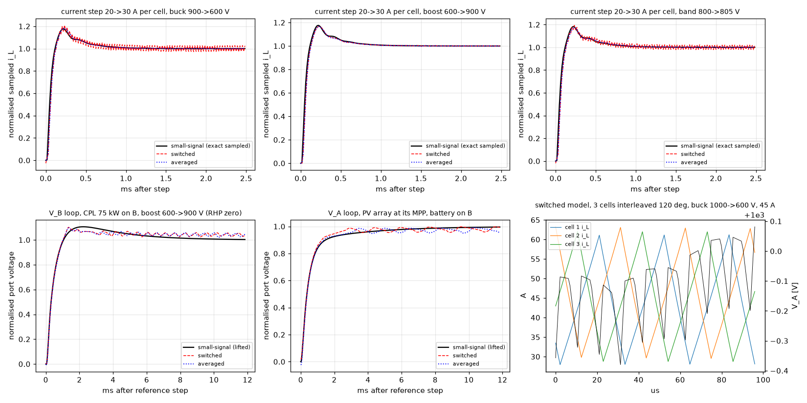
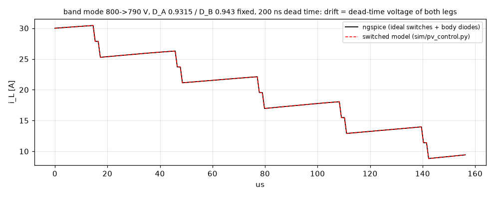
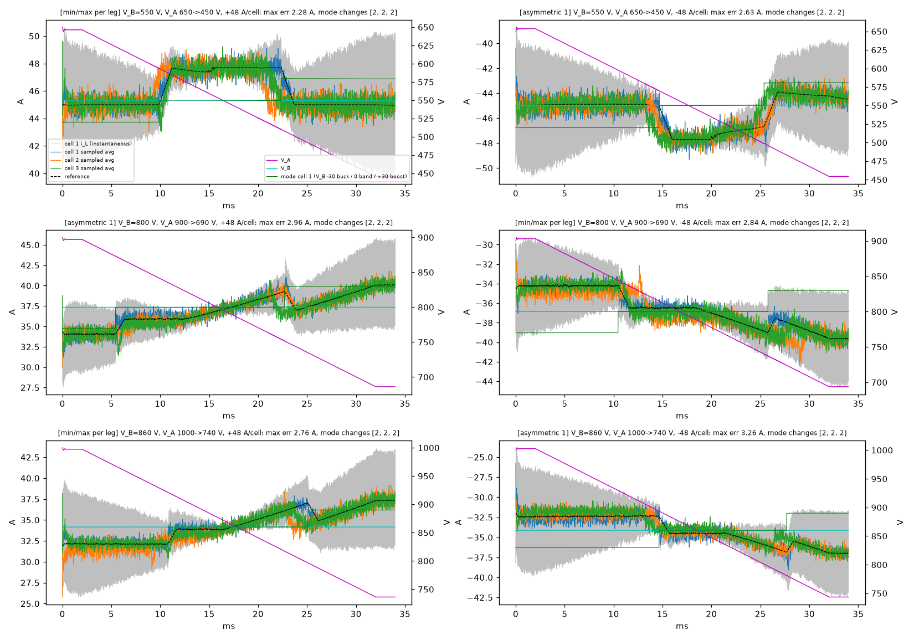
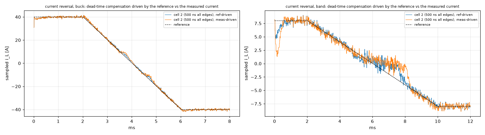
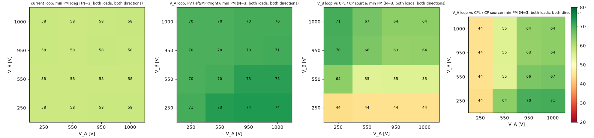
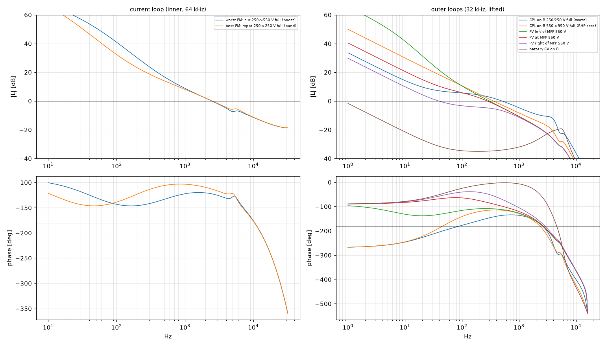
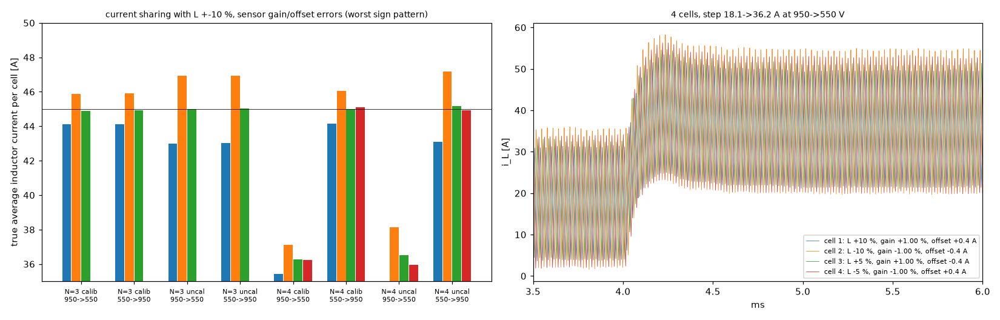
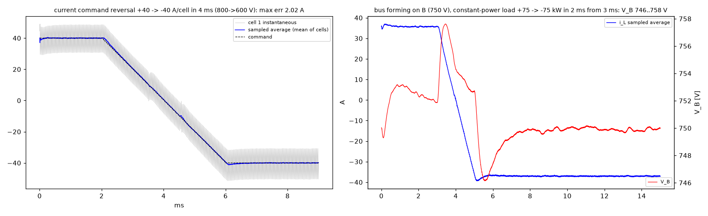
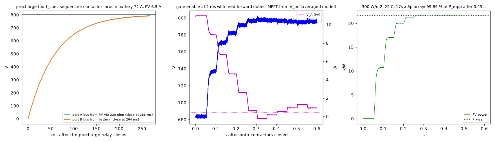
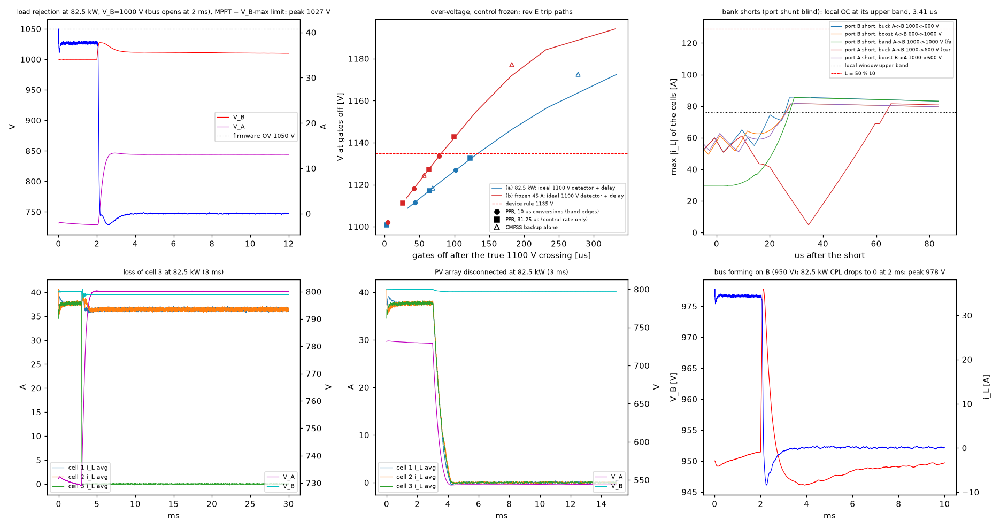

# PV-P75 / PV-P100-110 module control: plant, loops, stability, protection, delivered-power envelope

Generated by `sim/pv_control.py`; every number below is written by the script. **Simulated / calculated, not bench-validated.** Hand-off: `control_spec.json`. MPPT: `sim/out/pv_mppt/report.md`. Hardware basis: the cost-first build as drawn - PV-PWR / PV-PWR-4 rev A2, PV-CTL rev A1 (F280039C), inductor rev M2, STK-HO/A 75; the earlier platform's values (CTRL-C2000, PVCELL-25 with the LEM LA 150-P, PV-PORT) are no longer used.

## 1. Inputs and assumptions

- Inputs (read, never substituted - a missing file or line stops the run): sim/out/pv_design/cell_spec.json; sim/out/pv_design/inductor_L_vs_I.csv; sim/out/magnetics/design_pv_inductor.json; sim/out/pv_design/module_spec.json; sim/out/pv_design/module_envelope.csv; hardware/PV-PWR/outputs/PV-PWR_design_check.txt; hardware/PV-PWR-4/outputs/PV-PWR-4_design_check.txt; hardware/PV-CTL/outputs/PV-CTL_design_check.txt; sim/out/port_design/port_spec.json.
- Power stage: f_sw 32 kHz, firmware dead band 200 ns stretched by the gate-drive interlock to 181-586 ns at the gates (designed for an unknown 150-600 ns per edge), D_max 0.94333 (min pulse 1.771 us), L(I) 244 uH at 0 A / 226 uH at 45 A / 198 uH at 72.4 A / 50 % of L0 at 129 A (tolerance +/-8 %), series R 81.6 mOhm.
- Port banks as drawn (PV-PWR design check, incl. the leg decoupling films): PV-P75 port A 289.8 uF, port B 334.8 uF; PV-P100/110 386.4 / 386.4 uF. The 2.2 uF X capacitor per port sits on the terminal side of the contactor and the common-mode ring and is left out (conservative for over-voltage and CPL). The earlier model used a symmetric 3 x 90 + 4.4 = 274.4 uF.
- Inductor current as drawn: STK-HO/A 75 on PV-PWR + PV-CTL AFE: 10.14 mV/A at the ADC, 0.0722 A/LSB, -3 dB 331 kHz, delay 0.81 us (modelled as one lag of that value, which is also the sampling offset), noise 25 mVpp = 2.3 A pp -> 0.38 A rms per sample (pp / 6, ASSUMED crest factor); after calibration gain drift <= 1.0 %, linearity 0.38 A.
- Port sensing as drawn: V_A / V_B = V/1203 behind the PV-PWR divider pole 6.8 kHz (23.4 us) and the PV-CTL RC 1.6 MHz, 0.881 V/LSB, full scale -1974..+1623 V; I_A / I_B = lean shunt 3.0 mV/A, pole 11.3 kHz (lag 14.2 us), 0.244 A/LSB; F280039C ADC noise 0.44 LSB rms (ENOB 11.4); 17 conversions per 31.25 us (PV-CTL sampling plan).
- Hardware trips as drawn (bands and responses of the IL window, the CMPSS backup and the OV comparator from cell_spec's PV-CTL records, the port OC band from port_spec lean, the rest from the PV-CTL trip table; centres = band midpoints): inductor local window 74.2 A (67.9-80.5 A), gates off 1.52 us after the crossing; CMPSS backup +/-91.5 A (81.1-101.9 A), 1.21 us; port OV comparator 1074 V (1039-1110 V), lag 47 us from the true crossing (divider pole 23.4 us + overdrive build-up + comparator + logic); ADC PPB backup 1100 V (1084-1116 V) every 10 us, lag 33.9 us; port OC 400 A (387-413 A) on PV-PWR, 0.19 us after detection; firmware OV 1034 V, UV stop 240 V.
- Limits (section 12): inductor current 45.0 A in buck / boost, 47.70 A in the band; node-A power 27.5 kW per cell; port currents PV-P75 135 / 135 A, PV-P100/110 180 / 145 A (PV port A / battery port B).
- Our assumptions:

| key | value | meaning |
|---|---|---|
| f_ci_Hz | 2500 | current-loop crossover target at L(45 A) (fixed gain, no scheduling) |
| ci_zero_ratio | 5 | current-loop PI zero = f_ci / this |
| f_cv_Hz | 300 | outer voltage-loop crossover target (port-current reference / that port's capacitance) |
| cv_zero_ratio | 6 | voltage-loop PI zero = f_cv / this (6 chosen over 4..10: +1.6 deg at the worst CPL corner) |
| k_ff_bus | 1 | feed-forward of the measured port current when that port is a DC bus (inverter = CPL); 0 for a PV array or a battery (there it cancels the source's own damping / closes a unity loop) |
| mode_hyst | 0.02 | mode hysteresis in duty: leave band when the single-leg duty falls below D_max - this; sized >= 2.5 x the dead-time residual of one leg (225 ns x 32 kHz = 0.0072 -> 0.018, rounded up) so an unknown dead time cannot make the cell re-enter the mode it just left (asserted) |
| dt_range_ns | (150.0, 600.0) | per-edge dead time at the gates: unknown to firmware, different per leg and per edge; covers the gate drive's 181-586 ns (cell_spec, asserted inside) |
| dt_hat_ns | 375 | firmware dead-time estimate per edge = midpoint of dt_range (residual <= +/-225 ns) |
| dt_slope_frac | 0.4 | if the dead-time compensation is driven by the MEASURED current: its slope <= this x kp with all four edge ramps overlapping (band, near zero current), since it is positive feedback on the current and must never cancel more than this share of the proportional action |
| dt_comp_input | ref | dead-time compensation driven by a model of the closed current loop fed with the REFERENCE (feed-forward: adds no loop gain, so its sign ramp can be sharp, and on a reversing step it flips with the current, not with the reference) - 'meas' = measured current with the dt_slope_frac rule |
| dt_model_slew_A_per_us | 0.8 | that model = the reference slew-limited to the rate the loop reaches on a large step (kp x step / L); the type-2 loop follows slower ramps without lag, and so does the model |
| mode_exit_tau_s | 0.003 | band is left only when the single-leg duty is below the exit threshold for the demand u AND for the PI integrator filtered with this time constant (the steady-state demand: it carries neither the proportional kick nor the integrator's overshoot of a large step); band is entered on u alone (more voltage authority at once) |
| dt_ff_ramp_A | 2 | width of each edge's sign ramp when the compensation is driven by the reference |
| plim_trim_tau_s | 0.005 | port-current limit: a slow integral trim on the MEASURED port current (I_A / I_B shunt) corrects the conversion through the commanded duty, which the dead time biases by up to t_d f_sw / D (~2 %) |
| ilim_slew_A_per_s | 2000 | slew of each cell's current limit: a mode change moves the phase limit (buck/boost <-> band) and the node-A power limit by 1/D_max - 1 = 5.3 % without kicking the current loop |
| t_conv_s | 3e-07 | F280039C conversion incl. sample and hold: 75 ns window + 11 ADCCLK at 60 MHz (SPRSP61C 6.13.3.2), rounded up |
| t_sh_s | 7.5e-08 | F280039C sample-and-hold window, the first part of t_conv_s (SPRSP61C 6.13.3.2) |
| adc_noise_lsb | 0.44 | ADC noise per sample incl. quantisation: F280039C ENOB 11.4 bits with an external VREFHI (SPRSP61C 6.13.3.2.2) -> 2^0.6 / sqrt(12) LSB rms |
| desat_filter_ns | (100.0, 320.0) | NSI6651 DESAT deglitch filter, -Q1 / industrial envelope - INSIDE t_DESAT_OFF (both timed from the threshold crossing, NSI66x1A Fig. 8.10 p23 / -Q1 Fig. 8.8 p25): information only, not added to the chain (review PCM-10, gen/gdrv.py) |
| noise_pp_per_rms | 6 | peak-to-peak / rms of a sensor noise quoted as pp (+/-3 sigma): STK-HO/A 75 25 mVpp is specified over DC-100 kHz; the PV-CTL AFE passes 331 kHz (noise above 100 kHz unknown) |
| body_v0_V | 2.9 | body-diode threshold, the lower of SG2M040170HJ (V_SD 3.7 V at 19 A, p.6) and MSC035SMA170B4 (3.7 V at 30 A, p.4); assumption |
| body_r_ohm | 0.027 | body-diode slope through the MSC035SMA170B4 point (the steeper of the two; assumption) |
| aw_margin_A | 0.9 | anti-windup: a non-selected main loop may sit at most this far (per cell) above the selected one |
| vlim_qmax_A | 3 | V_B-max limit loop: integrator upper clamp (port amps).  With the load-current feed-forward the candidate then rides this margin above the module's own current, so it neither winds up nor closes a positive loop through a stiff bus, and is selected at once on a load rejection |
| f_isense_Hz | 200000 | cell inductor-current sensor bandwidth REQUIRED (cell_spec minimum); the model uses the drawn chain (PV-PWR sensor + PV-CTL AFE) |
| i_sense_fs_A | 100 | cell inductor-current range REQUIRED (cell_spec sensing) |
| res_il_req_A_per_LSB | 0.0759 | i_L resolution REQUIRED, kept from the control design of rev E (the boards were drawn to it); not binding: the drawn sensor's noise is about 30 counts pp |
| res_v_req_V_per_LSB | 0.638 | V_A / V_B resolution REQUIRED per outer-loop sample, kept from rev E (PV-CTL meets it with its 16-fold oversampling; the model samples once per outer step, 0.881 V/LSB) |
| res_ip_req_A_per_LSB | 0.258 | I_A / I_B resolution REQUIRED, kept from rev E |
| batt_R | 0.032 | battery/bus source resistance incl. loop (port_design A_RS_BATT 30 mOhm + A_R_LOOP 2 mOhm) |
| batt_L | 3.5e-06 | battery/bus source inductance incl. loop (port_design A_LS_BATT 3 uH + A_L_LOOP 0.5 uH) |
| L_mismatch | 0.1 | inductance mismatch between cells for the sharing study (+/-10 %, brief; A_L tolerance 8 %) |
| env_inlet_C | (35.0, 45.0, 60.0) | inlet temperatures of the published envelope (PV-20: full power to 45 C; D-056: the 4-phase build to 35 C) |

Plant dead times when a study does not vary them (unknown to the firmware, which uses 375 ns): cell k uses (leg A rise, A fall, B rise, B fall) = (600, 600, 150, 150); (150, 150, 600, 600); (465, 285, 285, 465) ns.

## 2. Loop structure and rates

```
MPPT (dP-P&O, 20 Hz, sim/pv_mppt.py) --V_A*--> [ramp] --+
                                                         v
  V_A loop  PI (+ I_A feed-forward on a bus port) --+   min-select   per-cell limits      I_port* / (N_act D_actual)
  V_B-max limit PI (+ I_B feed-forward, bus)  ------+--> (tracking --> i_L 45 / 47.7 A  --> i_L* (same for all cells)
  or V_B loop (bus forming)                         |    anti-windup)  27.5 kW, ports              |
                                                                                                  v
  per cell (64 kHz, own carrier, 120/90 deg):  i_L(sampled at carrier zero/peak + t_soc) -> PI -> u = v_L*
     -> + dead-time feed-forward (midpoint estimate, sign from i_L*) -> modulator (buck/band/boost, V_A, V_B
        feed-forward, hysteresis) -> D_A, D_B -> shadow load at the next zero/peak -> ePWM (200 ns dead band)
     -> PC connector -> PV-PWR buffer -> NOVOSENSE NSI6651ASC-Q1 (dead time 181-586 ns at the gates) -> 2 x SG2M040170HJ per switch
  hardware (PV-CTL / PV-PWR): IL local window (comparator) and CMPSS window (backup) -> latch; VA/VB comparator +
        ADC PPB (backup); port OC comparators -> FLT_N; DESAT -> FLT_N -> latch -> all PWM, EN, contactors off
```

- Current loop: kp 3.548 V/A, ki 11147 V/(A s) (design 2500 Hz at L(45 A), zero at 500 Hz); achieved crossover 2282-2750 Hz over all corners.
- Outer loops, each scaled with its own port bank: V_A loop kp 0.546 A/V, ki 171.6 A/(V s); V_B loops kp 0.631 A/V, ki 198.3 A/(V s) (3 phases; 4 phases 0.728 / 228.8 on both ports), design 300 Hz, zero at 50 Hz. Load-current feed-forward 1 on a DC-bus port, 0 on a PV or battery port (section 5).
- Timing: sample at the carrier extremum + 0.81 us (the drawn i_L chain delay); duty loaded at the next extremum (one-sample delay, 15.62 us); budget per loop execution 14.5 us after the conversion (F280039C: architecture estimate ~200 cycles = 1.7 us on the 120 MHz CLA, 6 / 8 executions per 31.25 us - R-14 stays open until the firmware is timed); mode changes only take effect at a carrier zero.

## 3. Plant models and their agreement

Switched model: gate-level PWM per cell (dead time on each rising edge, body diode chosen by the current sign), event-exact integration between edges; averaged model: the same equations with period-average switching functions and the dead-time voltage derived from the ripple edge currents; small-signal: the averaged model linearised, discretised exactly (ZOH, sampling offset, one-sample delay, sensor poles), outer loop lifted over two inner samples.

| test | overshoot small-signal / switched / averaged | RMS deviation from small-signal (switched / averaged) |
|---|---|---|
| current step 20->30 A, buck 900->600 V | 17.6 / 20.8 / 18.2 % | 3.5 / 2.3 % of the step |
| current step 20->30 A, boost 600->900 V | 17.6 / 16.7 / 16.7 % | 2.4 / 2.4 % of the step |
| current step 20->30 A, band 800->805 V | 18.3 / 19.4 / 17.2 % | 3.2 / 2.4 % of the step |
| current step 20->30 A, buck 900->600 V, single cell | 14.5 / 19.9 / 15.6 % | 4.8 / 0.5 % of the step |
| current step 20->30 A, buck 900->600 V, 4 cells at 90 deg | 18.3 / 19.8 / 19.3 % | 2.0 / 2.0 % of the step |
| V_B loop, CPL 75 kW on B, boost 600->900 V (RHP zero) | 10.6 / 10.1 / 9.7 % | 2.8 / 2.8 % |
| V_A loop, PV array at its MPP, battery on B | -0.4 / -0.3 / -0.8 % | 1.8 / 1.7 % |

Steady state of the switched model against the analytic mode map (duties include the R drop and dead time):

| mode | V_A -> V_B | i [A] | D_A sim / map | D_B sim / map | residual avg v_L [V] | ripple sim / analytic [A] |
|---|---|---|---|---|---|---|
| buck | 900.0 -> 600.0 | 19.92 | 0.6815 / 0.6667 | 1.0000 / 1.0000 | 0.101 | 26.03 / 26.05 |
| boost | 600.0 -> 900.0 | 20.15 | 1.0000 / 1.0000 | 0.6520 / 0.6667 | -0.100 | 26.21 / 26.11 |
| band | 800.0 -> 805.0 | 20.03 | 0.9433 / 0.9433 | 0.9097 / 0.9375 | -0.019 | 1.11 / - |

Energy balance of the switched model over a 20->40 A transient: in 253.44 J, out 251.62 J, R loss 1.340 J, capacitor 0.037 J, inductor 0.452 J -> residual -0.012 J (0.005 %).



Independent check with ngspice (sim/out/pv_control/ngspice_band_check.cir): one cell in band mode (800 -> 790 V, both legs switching, 586 ns dead time on every edge, body diodes) with fixed duties D_A 0.9315 / D_B 0.943 from 30 A for 5 periods. The current drifts by -16.376 A in ngspice and -16.383 A in the switched model (the dead-time voltage of both legs), ripple 5.164 / 5.170 A, RMS waveform difference 3.5 mA.



## 4. Mode transitions with an unknown dead time (V_A swept through V_B, switched model, 3 cells, 6.7 V/ms)

Every sweep is run for three dead-time sets; inside a set each cell has its own per-edge dead times (ns, leg A rise / A fall / B rise / B fall), the firmware always assumes 375 ns:

- min/max per leg: cell 1 (150, 150, 150, 150); cell 2 (600, 600, 600, 600); cell 3 (150, 150, 600, 600)
- asymmetric 1: cell 1 (600, 600, 150, 150); cell 2 (375, 375, 375, 375); cell 3 (600, 150, 150, 600)
- asymmetric 2: cell 1 (150, 600, 600, 150); cell 2 (600, 150, 600, 150); cell 3 (150, 600, 150, 600)

| dead-time set | V_B [V] | sweeps | max sampled-current error [A] | max RMS [A] | mode changes per cell | peak i_L [A] |
|---|---|---|---|---|---|---|
| min/max per leg | 550 | 4 (V_A up/down, +/-47.7 A command) | 2.44 | 0.49 | 2 | 50.8 |
| min/max per leg | 800 | 4 (V_A up/down, +/-47.7 A command) | 2.84 | 0.52 | 2 | 46.4 |
| min/max per leg | 860 | 4 (V_A up/down, +/-47.7 A command) | 2.90 | 0.54 | 2 | 44.1 |
| asymmetric 1 | 550 | 4 (V_A up/down, +/-47.7 A command) | 2.63 | 0.49 | 2 | 50.7 |
| asymmetric 1 | 800 | 4 (V_A up/down, +/-47.7 A command) | 2.96 | 0.53 | 2 | 46.2 |
| asymmetric 1 | 860 | 4 (V_A up/down, +/-47.7 A command) | 3.26 | 0.55 | 2 | 44.0 |
| asymmetric 2 | 550 | 4 (V_A up/down, +/-47.7 A command) | 2.21 | 0.50 | 2 | 50.8 |
| asymmetric 2 | 800 | 4 (V_A up/down, +/-47.7 A command) | 2.50 | 0.55 | 2 | 46.2 |
| asymmetric 2 | 860 | 4 (V_A up/down, +/-47.7 A command) | 2.96 | 0.57 | 2 | 44.0 |

Over all 36 sweeps every cell enters and leaves the band exactly once (no chatter, also with the drawn sensor's noise of 0.38 A rms per sample, which the sampled-current errors below include), the worst sampled-current deviation is 3.26 A (2.63 A at full current, V_B 550 V) and the highest instantaneous current 50.8 A (local OC trip band starts at 67.9 A). At 550 V the command is held by each cell's phase limit, which steps 45.0 -> 47.70 -> 45.0 A with the cell's own mode; at 800 / 860 V by its 27.5 kW limit, which steps by 1/D_max - 1 = 5.3 % the same way; both are slewed (part of the error is that tracking).

Band edges seen in the sweeps (V_B / V_A at the mode change, all cells, sets and both power directions; the dead-time-free rule is D_max = 0.943 and 1/D_max = 1.060): boost->band 1.0340-1.0975; band->buck 0.8923-0.9570; buck->band 0.9144-0.9653; band->boost 1.0437-1.1211. With the longest dead times a leg's buck / boost duty can only reach D_max - t_d f_sw (0.924), so such a cell needs the band over a wider ratio window than the dead-time-free rule; the band costs both legs' switching loss there (power-stage efficiency model: nominal band only).



### 4.1 What the unknown dead time does and what the firmware does about it

- Per switching leg, the edge whose current opposes the commanded transition loses (or gains) t_d x f_sw x V_leg: 150-600 ns is 0.48-1.92 % of the leg voltage (2.6-10.6 V at 550 V, 4.8-19.2 V at 1000 V). The firmware compensates the midpoint; the residual is <= 225 ns = 4.0 V at 550 V, 5.8 V at 800 V, 7.2 V at 1000 V per leg (225 ns x V volt-seconds per period).
- In a single-leg mode the PI integrator absorbs the switching leg's residual exactly (so the buck/boost -> band decision is exact); in band it holds the sum of both legs' residuals, so the band -> buck/boost decision is biased by one leg's residual, <= 0.0072 in duty. The band-exit hysteresis 0.02 is 2.8 x that, so a cell cannot re-enter the mode it just left. When a leg starts or stops switching, its residual appears as a voltage step the current loop removes: that is the transition error in the table.
- The cause of the reported chatter was not the dead time itself: each cell's 27.5 kW current limit was computed from the ratio map duties_ss on the noisy V_B/V_A, so at a band edge the limit flipped by 1/D_max = +5.3 % every outer sample and kicked the current loops across the mode thresholds. The limits and the port-current conversions now use each cell's actual duty and mode (which carry the hysteresis) and the limits are slewed.
- Zero crossings (the compensation acts on a current near zero, where the ripple straddles zero in buck and all four edges flip together in band):

| compensation driven by | case | dead-time set | max error [A] | RMS near zero [A] | max near zero [A] |
|---|---|---|---|---|---|
| slew-limited reference (design) | buck 800->600 V, +40 -> -40 A in 4 ms | min/max per leg | 3.13 | 0.87 | 2.37 |
| slew-limited reference (design) | band 800->805 V, +8 -> -8 A in 8 ms | min/max per leg | 3.29 | 0.71 | 3.29 |
| slew-limited reference (design) | buck 800->600 V, +40 -> -40 A in 4 ms | asymmetric 1 | 2.77 | 0.89 | 2.77 |
| slew-limited reference (design) | band 800->805 V, +8 -> -8 A in 8 ms | asymmetric 1 | 1.90 | 0.54 | 1.90 |
| slew-limited reference (design) | buck 800->600 V, +40 -> -40 A in 4 ms | asymmetric 2 | 2.85 | 0.87 | 2.37 |
| slew-limited reference (design) | band 800->805 V, +8 -> -8 A in 8 ms | asymmetric 2 | 2.02 | 0.55 | 2.02 |
| measured current (slope-limited) | buck 800->600 V, +40 -> -40 A in 4 ms | min/max per leg | 4.43 | 1.08 | 3.86 |
| measured current (slope-limited) | band 800->805 V, +8 -> -8 A in 8 ms | min/max per leg | 4.33 | 0.91 | 4.33 |
| measured current (slope-limited) | buck 800->600 V, +40 -> -40 A in 4 ms | asymmetric 1 | 4.14 | 1.39 | 4.14 |
| measured current (slope-limited) | band 800->805 V, +8 -> -8 A in 8 ms | asymmetric 1 | 3.56 | 0.87 | 3.56 |
| measured current (slope-limited) | buck 800->600 V, +40 -> -40 A in 4 ms | asymmetric 2 | 3.86 | 1.09 | 3.86 |
| measured current (slope-limited) | band 800->805 V, +8 -> -8 A in 8 ms | asymmetric 2 | 3.95 | 0.89 | 3.95 |

  Driven by the measured current the compensation is positive feedback on the current; its sign ramp must then be slope-limited (<= 0.4 x kp with all four edges overlapping) and near zero it leaves the plant's sharp dead-time step to the integrator: worst 4.43 A. Driven by a model of the closed loop (the reference slew-limited to 0.8 A/us: equal to the reference on ramps, which the type-2 loop follows without lag, and rising like the current on a step) it adds no loop gain and can be sharp (2 A ramp): worst 3.29 A, in the 500 ns cell where its edge current crosses zero (the buck ramp at 20 A/ms). Fed with the raw reference, a reversing step flipped the compensation before the current and added both legs' dead-time voltage to the overshoot; with a first-order model (80 us) the ramp lag mistimed the flip. Design: slew-limited model.

  

- Large reference steps at / next to V_A = V_B (dead time 500 ns on every edge of cell 2, 150 ns on cell 1): mode sequence per cell (0 buck, 1 band, 2 boost) and overshoot beyond the new reference:

| V_A / V_B [V] | step [A] | modes cell 1 / 2 / 3 | overshoot [A] | peak i_L [A] |
|---|---|---|---|---|
| 800 / 805 | +20 -> +40 | 1 / 1 / 1 | 0.7 | 40.9 |
| 800 / 805 | +40 -> +5 | 1 / 1 / 1 | 5.4 | 37.9 |
| 800 / 805 | +30 -> -30 | 1 / 1 / 1 | 16.1 | 45.9 |
| 800 / 780 | +20 -> +40 | 1 / 1 / 1 | 0.9 | 41.2 |
| 800 / 780 | +40 -> +5 | 1 / 1 / 1 | 5.9 | 38.3 |
| 800 / 780 | +30 -> -30 | 1 / 1 / 1 | 16.1 | 46.9 |
| 780 / 800 | +20 -> +40 | 1 / 1 / 1 | 1.8 | 42.7 |
| 780 / 800 | +40 -> +5 | 1 / 1 / 1 | 5.7 | 39.6 |
| 780 / 800 | +30 -> -30 | 1 / 1 / 1 | 16.1 | 46.1 |

  Inside the band no cell leaves it on a large step (exit needs the PI integrator filtered with 3 ms to agree); a change of the final mode where the current reverses next to a band edge is the steady state moving, not an excursion. The overshoot is the current loop's linear step response (~19 %, PI zero at 500 Hz): commands from the BMS / supervisor should be slew-limited, as the outer loops are.

- Optional identification: with each edge's dead time known exactly (residual 0) the worst transition error at V_B 860 V falls from 3.26 A to 1.98 A. Not needed for stability, chatter or limits; if wanted, firmware can learn each leg's residual from the integrator jump at its first band entry/exit (the jump is that leg's residual within (1 - D_max) x the voltage-measurement mismatch, ~0.7 V).
- Firmware therefore needs no per-unit dead-time value: midpoint estimate, compensation sign from the slew-limited reference, band-exit hysteresis 0.02 tested also on the filtered integrator, per-cell duty-based slewed limits (control_spec.json dead_time/firmware_must).

## 5. Stability over the envelope

**3 cells** (320 cases: V_A, V_B in 250/550/950/1000 V, 5 % and 100 % of the power the limits allow there (section 12), both directions; PV incremental conductance left of / at / right of the MPP = 0.05 / 1 / 3.41 x I/V; CPL and CP source against port A 289.8 uF / port B 334.8 uF; battery 32 mOhm / 3.5 uH). Closed-loop eigenvalues: 0 unstable.

| loop | minimum | where |
|---|---|---|
| current, phase margin | 57.6 deg | cur (current loop, B->A), V_A 250 V / V_B 250 V, full load, band |
| current, gain margin | 11.6 dB | cvb_cpl (CP source on B, B->A), V_A 250 V / V_B 250 V, full load, band |
| outer, phase margin | 44.3 deg (crossover 508 Hz) | cva_cpl (CPL on A, B->A), V_A 250 V / V_B 250 V, full load, band |
| outer, modulus margin min abs(1+L) | 0.67 | cva_cpl (CPL on A, B->A), V_A 550 V / V_B 250 V, full load, buck |
| outer, gain margin (upper or lower) | 6.0 dB | cva_cpl (CPL on A, B->A), V_A 250 V / V_B 250 V, full load, band |
| CV on a battery (port B) | crossover 1.01-1.01 Hz, PM >= 91 deg, all stable | the battery's 32 mOhm makes the V_B plant tiny: the CV limit acts in ~0.1-1 s, adequate for a battery whose voltage moves slowly |

Without the load-current feed-forward (full-load corners): CPL on B: 0 of 16 unstable, stable ones PM >= 14.2 deg; CPL on A: 4 of 16 unstable (250/250 V) (250/550 V) (250/950 V) (250/1000 V), stable ones PM >= 45.8 deg (with it: >= 44.3 deg). The feed-forward stays: it is what holds the margin at 250 V.

**4 cells** (320 cases: V_A, V_B in 250/550/950/1000 V, 5 % and 100 % of the power the limits allow there (section 12), both directions; PV incremental conductance left of / at / right of the MPP = 0.05 / 1 / 3.41 x I/V; CPL and CP source against port A 386.4 uF / port B 386.4 uF; battery 32 mOhm / 3.5 uH). Closed-loop eigenvalues: 0 unstable.

| loop | minimum | where |
|---|---|---|
| current, phase margin | 57.5 deg | cur (current loop, B->A), V_A 250 V / V_B 550 V, full load, boost |
| current, gain margin | 11.7 dB | cvb_bat (battery on B (CV), A->B), V_A 250 V / V_B 550 V, full load, boost |
| outer, phase margin | 45.0 deg (crossover 521 Hz) | cva_cpl (CPL on A, B->A), V_A 250 V / V_B 550 V, full load, boost |
| outer, modulus margin min abs(1+L) | 0.66 | cvb_cpl (CPL on B, A->B), V_A 250 V / V_B 550 V, full load, boost |
| outer, gain margin (upper or lower) | 6.0 dB | cva_cpl (CPL on A, B->A), V_A 250 V / V_B 550 V, full load, boost |
| CV on a battery (port B) | crossover 1.17-1.17 Hz, PM >= 91 deg, all stable | the battery's 32 mOhm makes the V_B plant tiny: the CV limit acts in ~0.1-1 s, adequate for a battery whose voltage moves slowly |

Without the load-current feed-forward (full-load corners): CPL on B: 0 of 16 unstable, stable ones PM >= 19.8 deg; CPL on A: 3 of 16 unstable (250/550 V) (250/950 V) (250/1000 V), stable ones PM >= 19.8 deg (with it: >= 45.0 deg). The feed-forward stays: it is what holds the margin at 250 V.

Current loop against the inductance (3 cells; at 250->1000, 1000->250 and 550/550 V; L(I) at 0 A, at 45 A and at the 72.4 A trip, times the factor) and against the computation delay (one sample = the design, two = the duty loaded a sample later):

| delay | L | PM [deg] | GM [dB] | crossover [Hz] |
|---|---|---|---|---|
| 1 sample | L(45 A) x 0.92 | 56.9-57.3 | 11.0-11.1 | 2599-2683 |
| 1 sample | L(45 A) nominal | 57.7-58.2 | 11.8-11.9 | 2430-2497 |
| 1 sample | L(45 A) x 1.08 | 58.4-58.9 | 12.4-12.5 | 2279-2333 |
| 1 sample | all: L(0 A) / L(45 A) / L(trip) x 0.90-1.10 | 55.1-59.6 | 9.6-13.4 | 2104-3047 |
| 2 samples | L(45 A) x 0.92 | 42.6-43.0 | 6.2-6.5 | 2534-2638 |
| 2 samples | L(45 A) nominal | 44.4-44.6 | 7.0-7.3 | 2376-2460 |
| 2 samples | L(45 A) x 1.08 | 45.9-46.0 | 7.7-8.0 | 2235-2304 |
| 2 samples | all: L(0 A) / L(45 A) / L(trip) x 0.90-1.10 | 39.1-47.7 | 4.8-8.8 | 2069-2982 |

Over all 64 current-loop corners of the sweep (L(I) at the operating point): one sample 57.6-58.9 deg, GM >= 11.6 dB; two samples 43.9-46.0 deg, GM >= 6.6 dB. A fixed gain copes with the soft saturation (no scheduling); the one-sample computation delay is a firmware REQUIREMENT (with two the loop is below the 45 deg rule and would need a lower crossover).

Cross-check with the review's reduced model (PCM-02: 1/(sL + R) with an exact ZOH, the same PI, the drawn 0.81 us chain as an uncompensated lag, ideal ports, L(45 A) x 0.92-1.08): 1 sample 56.8-58.8 deg at 2424-2833 Hz against 56.9-58.9 deg at 2279-2683 Hz here; 2 samples 40.9-45.1 deg at 2424-2833 Hz against 42.6-46.0 deg at 2235-2638 Hz here. The exact sampled model carries the port banks and sources, the modulator sensitivities and the sampled V_A / V_B feed-forward, which lower its loop gain near crossover and with it the crossover itself: with one sample the two agree, with two the exact model keeps more phase because the extra sample costs less at the lower crossover. Both put two samples below 45 deg at the low-inductance end.

Notes: the worst constant-power-load corner is cva_cpl (CPL on A, B->A), V_A 250 V / V_B 250 V, full load, band: 135 A at 250 V on port A against 289.8 uF (unstable pole 297 Hz). The margin there is set by how fast the feed-forward path (port-current sensor, sample, inner loop) cancels the negative conductance, not by the voltage filter: moving the divider pole from 6.8 kHz to 20 kHz changes the PM there from 44.3 to 46.2 deg. The boost right-half-plane zero (regulating the higher-voltage port while power flows into it) is in the model; at 250->1000 V, 45 A it sits at 3.91 kHz and costs 4.9 deg at that corner's 336 Hz crossover.





## 6. Current sharing (switched model, worst sign pattern of the errors)

| cells | sensor errors | V_A -> V_B | reference [A] | per-cell average [A] | max deviation from mean | expected from sensor errors [A] |
|---|---|---|---|---|---|---|
| 3 | calibrated (gain 1.00 %, offset 0.4 A) | 950 -> 550 | 45.00 | 44.10 / 45.88 / 44.89 | 0.92 A (2.0 % of 45 A) | 44.18 / 45.84 / 44.93 |
| 3 | calibrated (gain 1.00 %, offset 0.4 A) | 550 -> 950 | 45.00 | 44.11 / 45.90 / 44.92 | 0.92 A (2.0 % of 45 A) | 44.18 / 45.84 / 44.93 |
| 3 | uncalibrated (gain 2.00 %, offset 1.0 A) | 950 -> 550 | 45.00 | 43.00 / 46.93 / 45.00 | 1.98 A (4.4 % of 45 A) | 43.14 / 46.94 / 45.10 |
| 3 | uncalibrated (gain 2.00 %, offset 1.0 A) | 550 -> 950 | 45.00 | 43.01 / 46.95 / 45.04 | 1.99 A (4.4 % of 45 A) | 43.14 / 46.94 / 45.10 |
| 4 | calibrated (gain 1.00 %, offset 0.4 A) | 950 -> 550 | 36.25 | 35.44 / 37.13 / 36.26 / 36.22 | 0.87 A (1.9 % of 45 A) | 35.51 / 37.00 / 36.27 / 36.23 |
| 4 | calibrated (gain 1.00 %, offset 0.4 A) | 550 -> 950 | 45.00 | 44.15 / 46.07 / 45.01 / 45.11 | 0.98 A (2.2 % of 45 A) | 44.18 / 45.84 / 44.93 / 45.07 |
| 4 | uncalibrated (gain 2.00 %, offset 1.0 A) | 950 -> 550 | 36.25 | 34.47 / 38.14 / 36.50 / 35.95 | 1.87 A (4.2 % of 45 A) | 34.56 / 38.01 / 36.52 / 35.97 |
| 4 | uncalibrated (gain 2.00 %, offset 1.0 A) | 550 -> 950 | 45.00 | 43.10 / 47.16 / 45.17 / 44.93 | 2.07 A (4.6 % of 45 A) | 43.14 / 46.94 / 45.10 / 44.90 |

Inductance mismatch (L +10 %, -10 %, +5 %, -5 %) only changes ripple and the transient; the DC share is set by the current-sensor gain and offset alone (each cell regulates its own sensor reading). With the drawn sensor after the 2-point calibration (gain drift <= 1.0 %, linearity 0.38 A, PV-PWR design check) every cell stays within 2.2 % of 45 A; uncalibrated parts (2 %, 1 A) give 4.6 %. The per-cell limits act on the sensor reading, so a cell with a low-reading sensor carries up to gain x limit + offset more (about +0.9 A) - inside the inductor and device ratings (normal peak 62.3 A, local window from 67.9 A).



## 7. Bidirectional operation and power reversal

- Current command +40 -> -40 A per cell in 4 ms at 800->600 V (through zero, where the dead-time voltage changes sign and the ripple crosses zero): max sampled-current error 2.64 A, RMS 0.69 A.
- Bus forming on port B at 750 V (battery on A at 700 V), constant-power load ramped +75 kW -> -75 kW in 2 ms (inverter reverses): V_B stays within 746.8..757.2 V; peak instantaneous i_L 41.6 A; final per-cell current -37.0 A.



## 8. Start-up sequence (cost-first ports, contactors, soft start, MPPT)

1. K_A closes the PV array (17s x 8p, 300 W/m2, V_oc 802 V) straight onto the 289.8 uF port-A bank - the cost-first PV port has no precharge (D-044 / D-045): the array, a current source, charges it to 99 % of V_oc in 7.6 ms. The contactor's closing transient from the array's own capacitance is the port design's open item (port_spec lean pv_make).
2. Port B precharges from the battery (800 V) through 220 ohm (port design, port_spec lean: tau 69 ms, done in 319 ms, 158 J); the hardware dV interlock (3.5-16.5 V) lets K_B close, inrush 125 A at the band top.
3. Gate enable at a carrier zero with the feed-forward duties (zero inductor voltage): the largest cell current in the first two periods is 0.32 A (no inrush).
4. V_A reference = measured V_oc, MPPT steps down with 3 % steps, reference ramp 2000 V/s: after 0.45 s the module delivers 99.97 % of P_mpp (21.57 of 21.57 kW).



## 9. Protection: requirements derived by simulation, checked against the trips as drawn (PV-CTL / PV-PWR)

### 9.1 Over-voltage after load rejection

- With the control acting (MPPT at the 82.5 kW limit, bus at 1000 V opens): the V_B-max limit loop with load-current feed-forward is selected within one outer sample; V_B peaks at **1023.8 V** and settles at 1010 V; firmware OV (1034 V) not reached.
- Bus forming on B at 950 V, 82.5 kW constant-power load dropping to zero: peak 973.9 V.
- Protection only (controller output frozen, inner current loops alive, firmware OV disabled), two cases with port B 334.8 uF: (a) 82.5 kW from the PV array at V_B 1000 V - V_B crosses 1100 V at 0.22 V/us; (b) the cells held at their limit from a stiff port A at 1000 V with V_B at 611 V - the steepest crossing, 0.36 V/us.
- Limit: last switching event at <= 1135 V (0.85 x 1700 V with the 301 V turn-off ringing (cell_spec) scaled to the bus voltage); the film bank's 1.15 x 1100 V = 1265 V is not binding. Derived requirement (an ideal detector at 1100 V on the measured voltage plus delay, table): **gates off <= 164 us after the true 1100 V crossing in case (a), <= 99 us in case (b)**.

| ideal detector at 1100 V + added delay [us] | (a) gates off after crossing [us] | (a) V at gates off [V] | (b) gates off after crossing [us] | (b) V at gates off [V] |
|---|---|---|---|---|
| 0 | 25.3 | 1105.6 | 26.9 | 1109.8 |
| 20 | 45.3 | 1110.0 | 46.9 | 1117.0 |
| 50 | 75.3 | 1116.6 | 76.9 | 1127.6 |
| 100 | 125.3 | 1127.2 | 126.9 | 1144.1 |
| 150 | 175.3 | 1137.2 | 176.9 | 1158.3 |
| 200 | 225.3 | 1146.2 | 226.9 | 1169.1 |
| 300 | 325.3 | 1160.8 | 326.9 | 1179.2 |

As drawn: the comparator sees the port voltage behind the divider pole (6.8 kHz, a lag of 25 us on these ramps); the rest of PV-CTL's 47 us lag (overdrive build-up, comparator, logic, driver: 23.6 us) is applied as a fixed delay - exact at PV-CTL's design slope, conservative on a steeper ramp. The PPB backup converts every 10 us.

| path | threshold [V] | (a) gates off after crossing [us] | (a) V at gates off [V] | (b) gates off after crossing [us] | (b) V at gates off [V] |
|---|---|---|---|---|---|
| comparator | 1039 | before 1100 V | 1050.3 | before 1100 V | 1056.3 |
| comparator | 1110 | 95.6 | 1121.1 | 76.3 | 1127.5 |
| comparator | 1074 | before 1100 V | 1085.5 | before 1100 V | 1091.5 |
| PPB backup (comparator failed) | 1084 | before 1100 V | 1091.7 | before 1100 V | 1096.7 |
| PPB backup (comparator failed) | 1116 | 108.5 | 1123.8 | 78.8 | 1128.4 |
| PPB backup (comparator failed) | 1100 | 35.6 | 1107.8 | 37.2 | 1113.5 |

- **Comparator at its upper band edge (1110 V): gates off at 1121.1 V in case (a) and 1127.5 V in case (b) -> MET** against 1135 V. Its whole lag may be up to 111 us (a) / 69 us (b); drawn 47 us.
- **Port-B bank:** the smallest bank that keeps the gates-off voltage <= 1135 V with the comparator at its upper band edge is 135 uF (a) / 243 uF (b); drawn 334.8 uF (7 x 45 uF + the leg decoupling films). The power-stage figure that sized the 7th capacitor (D-056; module_spec cost-first port_film_bank B) is 278.5 uF, counted there against the 45 uF parts alone (decoupling films left out), from a lumped 135 A into port B for the whole 47 us response. Here the frozen cells hold their inductor current while V_B rises past V_A, so in boost the port-B current N D_B i_L falls with D_B = V_A / V_B and the bank needs less. Without the 7th capacitor the bank would be 289.8 uF with the decoupling films, above both this model's 243 uF and the lumped 278.5 uF: a possible saving, for the owner to weigh against the margin (D-056 item 1 stands until then).
- PPB backup alone (comparator failed): 1108 V at its nominal threshold, 1124 V at its upper band edge -> within the 0.85 rule; a second line only, and the 1034 V firmware trip on the outer-loop sample acts before either in any case where the firmware runs.

### 9.2 Short circuits

| case | trips in force | i_L at gates off [A] | peak i_L in the window [A] | first trip | detected after short [us] | gates off after short [us] | upper band -> 50 % L0, no trip: local / backup [us] |
|---|---|---|---|---|---|---|---|
| port B short, buck A->B 1000->600 V | terminal short, all trips as drawn | 53.5 | 61.3 | port OC | 3.8 | 4.0 | - / - |
| port B short, buck A->B 1000->600 V | bank short, local OC at its upper band | 89.8 | 106.4 | local | 27.5 | 29.0 | - / - |
| port B short, buck A->B 1000->600 V | bank short, local failed: CMPSS backup at its upper band | 110.8 | 128.6 | CMPSS backup | 34.2 | 35.4 | - / - |
| port B short, buck A->B 1000->600 V | no trip | - | 207.8 | - | - | - | 10.2 / 3.5 |
| port B short, boost A->B 600->1000 V | terminal short, all trips as drawn | 57.5 | 61.3 | port OC | 3.2 | 3.4 | - / - |
| port B short, boost A->B 600->1000 V | bank short, local OC at its upper band | 86.8 | 117.8 | local | 30.1 | 31.6 | - / - |
| port B short, boost A->B 600->1000 V | bank short, local failed: CMPSS backup at its upper band | 107.8 | 139.6 | CMPSS backup | 35.3 | 36.5 | - / - |
| port B short, boost A->B 600->1000 V | no trip | - | 365.2 | - | - | - | 10.4 / 5.2 |
| port B short, band A->B 1000->1000 V (fastest di/dt) | terminal short, all trips as drawn | 29.3 | 29.4 | port OC | 3.2 | 3.4 | - / - |
| port B short, band A->B 1000->1000 V (fastest di/dt) | bank short, local OC at its upper band | 90.4 | 122.7 | local | 30.1 | 31.6 | - / - |
| port B short, band A->B 1000->1000 V (fastest di/dt) | bank short, local failed: CMPSS backup at its upper band | 111.3 | 146.3 | CMPSS backup | 33.3 | 34.5 | - / - |
| port B short, band A->B 1000->1000 V (fastest di/dt) | no trip | - | 330.3 | - | - | - | 6.9 / 3.7 |
| port A short, buck A->B 1000->600 V (current reverses) | terminal short, all trips as drawn | 53.5 | 61.3 | port OC | 3.9 | 4.1 | - / - |
| port A short, buck A->B 1000->600 V (current reverses) | bank short, local OC at its upper band | 86.1 | 94.3 | local | 60.2 | 61.7 | - / - |
| port A short, buck A->B 1000->600 V (current reverses) | bank short, local failed: CMPSS backup at its upper band | 102.5 | 109.0 | CMPSS backup | 65.9 | 67.1 | - / - |
| port A short, buck A->B 1000->600 V (current reverses) | no trip | - | 108.8 | - | - | - | - / - |
| port A short, boost B->A 1000->600 V | terminal short, all trips as drawn | 58.9 | 64.3 | port OC | 3.2 | 3.4 | - / - |
| port A short, boost B->A 1000->600 V | bank short, local OC at its upper band | 86.7 | 116.3 | local | 27.9 | 29.4 | - / - |
| port A short, boost B->A 1000->600 V | bank short, local failed: CMPSS backup at its upper band | 107.6 | 138.2 | CMPSS backup | 32.9 | 34.2 | - / - |
| port A short, boost B->A 1000->600 V | no trip | - | 319.2 | - | - | - | 10.4 / 5.3 |

- Terminal shorts (5 mOhm / 1 uH bolted, at full current): first trip port OC, gates off <= 4.1 us after the short, peak inductor current 59 A. No reverse clamp is fitted (D-044): the bank rings below zero and the legs' body diodes take the external branch's current - up to 17.0 kA per module, 2839 A per device (274.0 A2s) against I_DM 376 A per position in this static lumped model; the architecture accepts that the port-side legs are likely destroyed (ARCHITECTURE-COSTFIRST 6.4).
- Bank shorts (inside the module, not seen by the port shunt): the inductor current rises at up to 7.0 A/us. From the local window's upper band edge (80.5 A) it reaches 129 A (L = 50 % L0) in 6.92 us: **local layer as drawn 1.52 us -> peak 90 A, met.** From the CMPSS backup's upper band edge (101.9 A) 3.48 us remain: **backup as drawn 1.21 us -> 111 A, met** against 129 A and the 376 A device pulse rating per position (current when the gates go off). Without the reverse clamp the bank rings below zero in these cases and the reversed bank keeps driving the inductor current up after the gates are off, through the body diodes: up to 146 A inside the 0.2 ms window (static diode model) - part of the accepted loss of the port-side legs (ARCHITECTURE-COSTFIRST 6.4), not a trip-timing result.
- A short on port A while power flows A->B reverses the current: every layer is a window (+/-).
- After the trip the inductor current freewheels through two body diodes (2 x 2.9 V against it) and decays.

### 9.3 Short inside a cell (leg shoot-through, switch-node or inductor short)

Not seen by the inductor sensor when the inductor is bypassed: the gate driver's DESAT is the protection (NOVOSENSE NSI6651ASC-Q1, gate drive as drawn on PV-PWR). Blanking 0.26-0.82 us + filter 0.10-0.32 us after the device leaves saturation, then the short-circuit booster has the gates off 0.42 us later (required <= 1.0 us; the driver's soft turn-off alone 1.96 us): **0.96 us typ / 1.24 us worst** against a short-circuit withstand of 2.0 us that is an ASSUMPTION (no Chinese datasheet states one): met with 0.76 us margin if the assumption holds. The DESAT threshold 5.43-8.47 V corresponds to 272-484 A (25 C) and 123-261 A (175 C) per position over both device options: DESAT is a short-circuit detector only; the inductor OC layers are the over-current protection.

### 9.4 Loss of one cell at full load

MPPT on a 17s x 9p array at 1000 W/m2 (module at its 82.5 kW limit, i.e. every cell at its own 27.5 kW), cell 3 faults at 3 ms: the references are re-divided by the healthy cells, which stay at their own limits (sampled average max 39.7 A, instantaneous peak 42.1 A, below the local trip band); module power 82.7 -> 55.0 kW and V_A moves right on the PV curve to 799 V; no trip. Below full load the healthy cells take over the lost share up to the same per-cell limits.

### 9.5 Loss of the PV source

Array disconnected at 82.5 kW: V_A falls until the V_A loop (300 Hz, reference clamped >= 0, so no reverse power into port A) has cut the current: minimum V_A 554 V (UV stop 240 V not reached), V_B max 800.0 V. The supervisor declares 'PV lost' on zero power with the reference not followed and stops; at an operating point below ~450 V the same dip reaches the UV stop, which is the intended outcome.

### 9.6 Firmware second layer (described, not simulated)

PV-CTL's design check writes the firmware layer on top of each hardware trip (CMPSS / PPB backups, soft limits, over-temperature derating, heartbeat, latch-clear rules, configuration lock, clock loss); it is carried into control_spec.json `firmware_second_layer` together with the lean ports' rules (polarity and dV enables, port OC latency).



## 10. Requirements on sensing and protection hardware

| signal / trip | requirement | as drawn | met |
|---|---|---|---|
| cell i_L chain | +/-100 A, >= 200 kHz, delay to the CMPSS input <= 3.08 us, <= 0.0759 A/LSB | STK-HO/A 75 + PV-CTL AFE: 0.81 us, -3 dB 331 kHz, 0.0722 A/LSB | yes |
| IL local window | gates off <= 6.92 us after 80.5 A | 1.52 us, peak 90 A | yes |
| IL CMPSS backup | gates off <= 3.48 us after 101.9 A | 1.21 us, peak 111 A | yes |
| port OV comparator (a, 82.5 kW) | gates off <= 164 us after the true 1100 V crossing | 95.6 us at the 1110 V band edge, 1121 V | yes |
| port OV comparator (b, frozen at the limit) | <= 99 us | 76.3 us, 1127 V | yes |
| port OV PPB backup | second line only | 1124 V at the upper band edge | within the 0.85 rule |
| port-B bank for load rejection | >= 243 uF (this model) | 334.8 uF | yes |
| V_A / V_B signal | >= 3 kHz, <= 0.638 V/LSB per outer sample | 6.8 kHz pole, 0.881 V/LSB raw (PV-CTL oversamples 16 x) | yes |
| port OC (I_A, I_B) | terminal short off before the inductor current leaves its normal range | gates off 4.1 us after the short, 59 A | yes |
| I_A / I_B for feed-forward | bus port, >= 10 kHz | lean shunt 11.3 kHz (lag 14.2 us) | yes |
| DESAT + booster | gates off within the withstand (2.0 us ASSUMED) | 0.96 us typ / 1.24 us worst | yes, if the assumed withstand holds |
| MPPT power measurement | see sim/out/pv_mppt/report.md | | |

## 11. Synchronous-sampling ripple (port A)

- 950->550 V at 45.0 A/cell: V_A ripple 0.806 V pp, sample minus period mean at the capacitor -0.6 mV; behind the 6.8 kHz divider pole the 96 kHz ripple is attenuated ~14x, so the ADC bias is negligible.
- 550->950 V at 45.0 A/cell: V_A ripple 0.507 V pp, sample minus period mean at the capacitor 35.3 mV; behind the 6.8 kHz divider pole the 96 kHz ripple is attenuated ~14x, so the ADC bias is negligible.
- 800->800 V at 36.4 A/cell: V_A ripple 1.019 V pp, sample minus period mean at the capacitor -55.9 mV; behind the 6.8 kHz divider pole the 96 kHz ripple is attenuated ~14x, so the ADC bias is negligible.

## 12. Limits and the delivered-power envelope

### 12.1 Which limit is which

- **Inductor (phase) current**, the only limit on the inductor itself: 45.0 A mean in buck / boost (one leg switching, ripple up to 34.6 A pp: the inductor's DC design current, normal peak 62.3 A; 1.10 x 62.3 = 68.5 A against the 67.9 A window edge: **short by 0.6 A**, the window's own design-margin item on PV-CTL (it stays above the normal peak); not a consequence of the band limit); **47.70 A in the band** (both legs at or near D_max = 0.94333: almost no ripple; the inductor's rms design value I_rms_max, which is the power stage's band point: P_lim at unity ratio = 45 A per cell at the port = 47.70 A in the inductor). sim/pv_design.py and sim/pv_module.py evaluate the band corners at that current, so nothing in the hardware was sized for less: devices 46.3 A rms per position (= I_rms_max x sqrt(D_max)); inductor DC copper loss at the band limit 50.6 W (R_dc at 110 C of the rev M2 winding; the small band ripple adds little) against the 83.8 W of its worst point (500 / 1000 V, full ripple), whose hot spot (144.7 C at 45 C inlet, module model at 1000->500) sets the inductor limit; hottest junction of the module model 109.5 C at 611->611 full power (45 C inlet, limit 125 C), a band point at this current. Band peak at that current: 12.2.
- **Port currents** (lean ports, module_spec cost-first, flat in inlet temperature): PV port A 135 A, battery port B 135 A on PV-P75; 180 A / 145 A on PV-P100/110 (the HPE501 aR pair at 65 C fuse air, D-056), enforced per cell as limit / (N x actual duty) with a slow trim on the measured port current.
- **Power**: 27.5 kW per cell at the converter's port-A node (= the PV / source side for A->B, the delivered side for B->A); **thermal derating** (module_spec cost-first, thermal only, fraction of the point's P_max on the delivered power): PV-P75 25 C 1.000, 30 C 1.000, 35 C 1.000, 40 C 1.000, 45 C 1.000, 50 C 0.954, 55 C 0.866, 60 C 0.754; PV-P100/110 25 C 1.000, 30 C 1.000, 35 C 1.000, 40 C 0.974, 45 C 0.917, 50 C 0.861, 55 C 0.806, 60 C 0.720. Firmware derates on the NTC readings (PV-CTL firmware layer); the control simulation has no thermal state, the envelope applies the fraction.
- **D_max = 1 - t_min f_sw = 0.94333**, the same in every mode: t_min 1.771 us = 0.6 us of complementary on-time + 2 x the 586 ns longest dead time at the gates (cell_spec min_pulse_basis). Raising it needs a shorter minimum pulse: with no complementary on-time at all it would be 0.9625, and the dead-time stretch is a protection that stays (D-050). The sampling plan has no room either: the i_L sample is taken 0.81 us after the carrier extremum (the drawn chain delay) and its 75 ns S/H window closes 0.5 ns before the edge of a minimum pulse centred on that extremum (0.885 us); the switch node moves one driver delay later. A shorter pulse puts the edge into the window unless the sample moves earlier, which gives up the chain-delay compensation. The band limit, not D_max, is the lever.

Averaged-model checks that each limit holds where it binds (command ramped beyond it): 3 cells at 550/550 V: phase 47.69 against 47.70 (peak 48.09); 3 cells at 650/650 V: power 27475.04 against 27500.00 (peak 27680.30); 4 cells at 800/600 V: port B 145.04 against 145.00 (peak 146.54) (A for currents, W per cell for power).

### 12.2 Band peak at the band limit

Over the band as the transition sweeps of section 4 occupy it (V_B / V_A 0.892-1.121: the band is left late, by the hysteresis and the dead time, not at D_max / 1/D_max), V 250-1000 V, current at the cell's band limit there and the inductance at its -8 % tolerance, the normal peak is at most **52.3 A** (ripple 9.3 A pp at 675 -> 602 V, 47.7 A): below the 62.3 A design peak, and 1.10 x 52.3 = 57.6 A stays under the 67.9 A window edge; L at 52 A is 220 uH nominal (L(45 A) 226 uH). The trip window therefore needs no change for the band limit. Nor does the over-voltage case of 9.1 (b): the band limit binds only up to V_A = 611 V (above it the node-A power does), so frozen cells at the band limit push at most 80 A (N i_band V_A / V_B) into port B at the 1100 V crossing (boost, D_B = V_A / V_B), against 123 A in case (b) (1000 V in, 45 A); calculated from the steady-state duties.

### 12.3 Envelope (steady state; P_src = power drawn at the source port, P_del = delivered at the other port)

Direction A->B = PV / port A to port B; B->A = battery / port B to port A. The earlier law (45 A on the inductor in every mode) is shown for comparison at 45 C (before loss).

**PV-P75 (3 phases):**

| V_A / V_B [V] | direction | mode | P_src at 45 C [kW] | binding at 45 C | earlier law (45 A in band) P_src [kW] | P_del 35C [kW] | P_del 45C [kW] | P_del 60C [kW] | PV-P75 rated (75 kW) at 45 C |
|---|---|---|---|---|---|---|---|---|---|
| 250 / 1000 | A->B | boost | 33.75 | phase current = port A current | 33.75 | 32.99 | 32.98 | 25.45 | **no** |
| 250 / 1000 | B->A | boost | 34.54 | phase current = port A current = thermal | 34.54 | 33.75 | 33.75 | 25.45 | **no** |
| 500 / 1000 | A->B | boost | 67.50 | phase current = port A current | 67.50 | 66.67 | 66.64 | 50.90 | **no** |
| 500 / 1000 | B->A | boost | 68.38 | phase current = port A current = thermal | 68.38 | 67.50 | 67.50 | 50.90 | **no** |
| 550 / 550 | A->B | band | 74.25 | phase current = port A current | 70.04 | 73.37 | 73.34 | 55.98 | **no** |
| 550 / 550 | B->A | band | 74.25 | port B current | 70.91 | 73.37 | 73.34 | 55.98 | **no** |
| 600 / 600 | A->B | band | 81.00 | phase current = port A current | 76.41 | 80.08 | 80.04 | 61.07 | yes |
| 600 / 600 | B->A | band | 81.00 | port B current | 77.32 | 80.08 | 80.04 | 61.07 | yes |
| 611 / 611 | A->B | band | 82.48 | phase current = node-A power = port A current | 77.81 | 81.63 | 81.60 | 62.19 | yes |
| 611 / 611 | B->A | band | 82.48 | port B current | 78.66 | 81.63 | 81.60 | 62.19 | yes |
| 650 / 650 | A->B | band | 82.50 | node-A power | 82.50 | 81.63 | 81.59 | 62.20 | yes |
| 650 / 650 | B->A | band | 83.42 | node-A power = thermal | 83.42 | 82.50 | 82.50 | 62.20 | yes |
| 750 / 750 | A->B | band | 82.50 | node-A power | 82.50 | 81.72 | 81.68 | 62.20 | yes |
| 750 / 750 | B->A | band | 83.33 | node-A power = thermal | 83.33 | 82.50 | 82.50 | 62.20 | yes |
| 950 / 950 | A->B | band | 82.50 | node-A power | 82.50 | 81.77 | 81.73 | 62.20 | yes |
| 950 / 950 | B->A | band | 83.28 | node-A power = thermal | 83.28 | 82.50 | 82.50 | 62.20 | yes |

**PV-P100 / PV-P110 (4 phases, same build; the products differ in rating only):**

| V_A / V_B [V] | direction | mode | P_src at 45 C [kW] | binding at 45 C | earlier law (45 A in band) P_src [kW] | P_del 35C [kW] | P_del 45C [kW] | P_del 60C [kW] | PV-P100 rated (100 kW) at 45 C | PV-P110 rated (110 kW) at 45 C |
|---|---|---|---|---|---|---|---|---|---|---|
| 250 / 1000 | A->B | boost | 42.26 | thermal | 42.26 | 43.97 | 41.27 | 32.40 | **no** | **no** |
| 250 / 1000 | B->A | boost | 42.26 | thermal | 42.26 | 45.00 | 41.27 | 32.40 | **no** | **no** |
| 500 / 1000 | A->B | boost | 83.62 | thermal | 83.62 | 88.87 | 82.53 | 64.80 | **no** | **no** |
| 500 / 1000 | B->A | boost | 83.62 | thermal | 83.62 | 90.00 | 82.53 | 64.80 | **no** | **no** |
| 550 / 550 | A->B | band | 80.67 | port B current | 80.67 | 79.75 | 79.75 | 71.28 | **no** | **no** |
| 550 / 550 | B->A | band | 79.75 | port B current | 79.75 | 78.88 | 78.84 | 71.28 | **no** | **no** |
| 600 / 600 | A->B | band | 87.97 | port B current | 87.97 | 87.00 | 87.00 | 77.76 | **no** | **no** |
| 600 / 600 | B->A | band | 87.00 | port B current | 87.00 | 86.09 | 86.04 | 77.76 | **no** | **no** |
| 611 / 611 | A->B | band | 89.50 | port B current | 89.50 | 88.59 | 88.59 | 79.19 | **no** | **no** |
| 611 / 611 | B->A | band | 88.59 | port B current | 88.59 | 87.74 | 87.70 | 79.19 | **no** | **no** |
| 650 / 650 | A->B | band | 95.27 | port B current | 95.27 | 94.25 | 94.25 | 79.20 | **no** | **no** |
| 650 / 650 | B->A | band | 94.25 | port B current | 94.25 | 93.29 | 93.24 | 79.20 | **no** | **no** |
| 750 / 750 | A->B | band | 101.92 | thermal | 101.92 | 108.75 | 100.87 | 79.20 | yes | **no** |
| 750 / 750 | B->A | band | 101.92 | thermal | 101.92 | 107.69 | 100.87 | 79.20 | yes | **no** |
| 950 / 950 | A->B | band | 101.85 | thermal | 101.85 | 108.99 | 100.87 | 79.20 | yes | **no** |
| 950 / 950 | B->A | band | 101.85 | thermal | 101.85 | 110.00 | 100.87 | 79.20 | yes | **no** |

Lowest V_A = V_B at which the rated power is delivered:

| product | rated [kW] | direction | 35 C | 45 C | 60 C |
|---|---|---|---|---|---|
| PV-P75 | 75 | A->B | 562 V | 562 V | not reached |
| PV-P75 | 75 | B->A | 562 V | 562 V | not reached |
| PV-P100 | 100 | A->B | 690 V | 690 V | not reached |
| PV-P100 | 100 | B->A | 696 V | 697 V | not reached |
| PV-P110 | 110 | A->B | not reached | not reached | not reached |
| PV-P110 | 110 | B->A | 765 V | not reached | not reached |

- PV-P75 at 550/550 V: 74.25 kW from the PV port (phase current = port A current), 73.34 kW delivered; with the earlier 45 A inductor ceiling it was 70.04 kW before loss. **75 kW at exactly 550 V needs 136.4 A at the port before loss (138.1 A at the source port with the module loss): PV-04 / PV-07 (full load from 550 V) and PV-05 / PV-08 (135 A) are inconsistent by 1.0 % at that corner** - 74.25 kW is the most a 135 A port passes there.
- PV-P75's 82.5 kW maximum is reached at the PV / source port (node A) for A->B and as delivered power for B->A; delivered A->B it is 82.5 kW less the module loss.
- PV-P100/110: the 145 A battery port binds below about 759 V (110 kW) / 690 V (100 kW) before loss; in B->A the battery is the source, so the delivered power also carries the module loss (100 kW delivered needs the battery above the 'B->A' voltage in the table). The thermal derating (D-056) holds the 4-phase P_max only to the inlet where its fraction is 1 (35 C); PV-P100's 100 kW holds to the inlets the table marks. **PV-P110 (110 kW = 4 x 27.5 kW) is never delivered A->B**: the 27.5 kW per cell is held at the source (PV) node, so 110 kW drawn from the PV port delivers that less the module loss; B->A it is delivered above the battery voltage in the table, at the full-power inlets only. Either PV-P110's rating is a PV-input rating, or the per-cell limit is referenced to the delivered side (+1.0 % on the cells at the unity points >= 750 V, which the thermal derating then has to hold).
- The products are selected by phase count only through `load_params(N)`: N = 3 -> PV-P75 values, N = 4 -> PV-P100/110 values, anything else stops; no P75 constant is used for the 4-phase build.

## 13. Open items and honesty

- Nothing is bench-validated. Switches are ideal (no switching transients, no C_oss charging in the dead time - the real dead-time voltage near zero current is smaller and smoother than modelled), the cells are lumped on one port node (no busbar inductance between cells), sensors are first-order lags (the drawn i_L chain's 0.2 us transport delay is folded into one lag of its total delay), the PV array is static (no array capacitance), the inverter on port B is an ideal constant-power load, the battery is an EMF behind 32 mOhm / 3.5 uH.
- The STK-HO/A 75 noise is specified only over DC-100 kHz (25 mVpp); the AFE passes 331 kHz and the crest factor pp / rms = 6 is ASSUMED. The sampled-current errors in sections 4 and 7 include this noise.
- The comparator delays inside PV-CTL's responses are that board's own estimates (the TLV9024 publishes no maximum delay; PV-CTL's design check states the factor it ASSUMES on the typical figure); the over-voltage layers apply PV-CTL's total lag on the filtered voltage.
- The one-sample computation delay is a REQUIREMENT on the F280039C firmware (architecture R-14, not yet timed); with two samples the current loop drops below 45 deg.
- The outer-loop phase margin at the worst constant-power-load corner (risk E4) is 44.3 deg on PV-P75 / 45.0 deg on PV-P100/110 (modulus margin 0.67 / 0.66) with the drawn banks: adequate, below the 45 deg rule of thumb; the inverter's own DC link raises it.
- The envelope's delivered power uses sim/pv_module.py's published module efficiency grid (calculated, at each point's P_lim and 25 C inlet, A->B), corrected to the inlet with the largest 25 -> 45 C drop of module_spec's corners (linear beyond 45 C: ASSUMED) and used for B->A as well; the thermal derating is that script's thermal-only figure (an estimate) applied on top of the control's limits.
- Terminal shorts are not survivable on PV-PWR (no reverse clamp, D-044); the body-diode figures are a static model.
- Load-current feed-forward must be switched by port type (bus 1, PV/battery 0): the supervisor needs to know what is connected (BMS present = battery).
