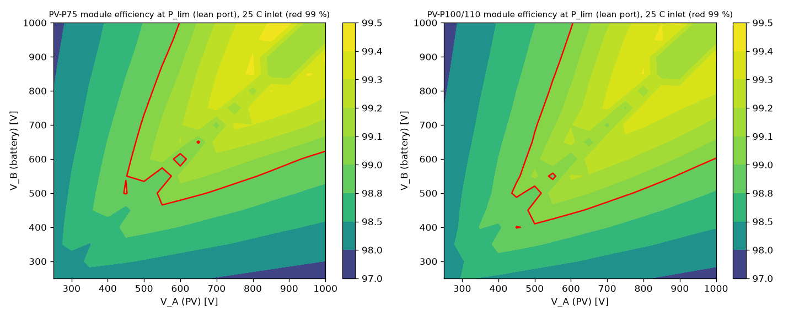
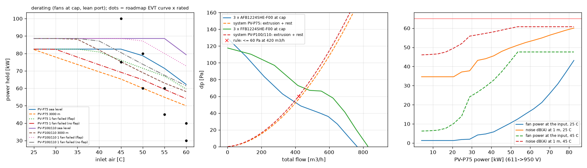

# PV-P75 / PV-P100/110 module level - cost-first build

Generated by `sim/pv_module.py`; every number is written by the script. **Calculated, not measured.** Comparison file: `module_spec.json` (new items in its `costfirst` block). Cell design: `report.md`, `cell_spec.json`.

Inductor read at run time: rev M2, solid round enamelled Cu 3.15 mm grade 2, 1 layer - worst 83.8 W, hot spot 145 C (magnetics basis), 40.5 USD.

## 1. What is inside the enclosure

| group | value | source |
|---|---|---|
| phases | N x cell losses (gate bias and sensing moved to the aux line) | sim/pv_design.py |
| PV port (A) | 0.60 mOhm: HFE82V 0.2 + shunt 0.1 + busbars 0.30 | Hongfa-HFE82V-300C.pdf p.1; port_spec lean shunt; busbars ESTIMATE (port report A_R_LOOP_X) |
| battery port (B) | 2.95 mOhm: as A + 2 x HPE501/000B100-250 1.174 mOhm | port_spec lean battery_fuse loss_W_per_link |
| aux 75 W flyback | bias 3.0 W/phase + logic 2.07 W through 5 V (0.85), coils 2 x 2.35 W, fans / 0.9 + 1.0 W SELV 5 V, all / eta_aux(V) | PV-PWR / PV-CTL budgets; aux75_spec efficiency |
| passive HV | per port: varistor monitor 990k, bleeder 660k, 2 dividers 6 M; PE divider | PV-PWR; dividers ASSUMPTION |
| fans | 3 x AFB1224SHE-F00 (12.0 W), PV-P100/110: 3 x FFB1224SHE-F00 capped 17 W | docs/datasheets/thermal/AFB1224SHE-F00.pdf |

## 2. Module efficiency (25 C inlet, sea level, fan law)

| module | peak | at | 550->950 | 950->550 | 550->550 | 950->950 | 611->611 (45 C) | EU-weighted 750->750 (grid min-max) | standby open / held at 1000 V |
|---|---|---|---|---|---|---|---|---|---|
| PV-P75 | **99.47 %** | 900->1000 V, 49.5 kW | 98.94 | 98.89 | 98.86 | 99.15 | 98.83 | 98.81 (98.53-99.30) | 11.4 / 20.6 W |
| PV-P100/110 | **99.46 %** | 900->1000 V, 66.0 kW | 98.93 | 98.94 | 98.96 | 99.13 | 98.92 | 98.78 (98.51-99.27) | 12.0 / 21.2 W |

Losses by group at 611->611 V full power, 45 C inlet [W]:

| module | phases | port | aux + passive HV | fans (at the input) | total | exhaust |
|---|---|---|---|---|---|---|
| PV-P75 | 837 | 65 | 24.1 | 46.8 | 972 | 52.8 C |
| PV-P100/110 | 801 | 75 | 28.2 | 66.3 | 970 | 51.9 C |

## 3. Cooling

- One extrusion (model): 53.4 fins at 8.32 mm pitch, 40 x 1.5 mm, 10 mm base, 444 mm wide, 150 / 200 mm long (3.09 / 4.13 kg): solved for R_sa = 0.06 K/W at 400 m3/h, the spec limit.
- PV-P75: 3 x AFB1224SHE-F00 at 100 %: 402 m3/h (134 per fan) at 52.9 Pa; R_sa there 0.0597 K/W (spec 0.06); system 56.8 Pa at 420 m3/h (rule <= 60); fans 36.0 W.
- PV-P100/110: 3 x FFB1224SHE-F00 at 96 %: 455 m3/h (152 per fan) at 70.1 Pa; R_sa there 0.0473 K/W (spec 0.049); system 60.3 Pa at 420 m3/h (rule <= 60); fans 51.0 W.
- Noise at 1 m, all fans (+3.0 dB installation, ESTIMATE): PV-P75 60.8 dB(A) at the cap, PV-P100/110 63.4 dB(A) at the cap.
- **Cold limit:** RESTRICTION: both Delta fans are rated -10..60 C operating (p.3 4-1; storage -40..+75 C); PV-20 asks for -30 C. Below -10 C inlet the fans run outside their rating (bearing grease): firmware holds them off and limits the module to what the heatsink passes without forced air (not modelled) until the inlet is above -10 C (R-05), or Delta's low-temperature grease option is ordered (no datasheet on file). Cheapest fan ON FILE with a published rating <= -30 C: Sanyo Denki 9GT1224P1S001 (-40..+85 C; 88-113 USD each, gen/data/prices.csv) - open item: a cheaper one.

| fan (3-phase module, at its cap) | full power at 45 C | noise at full power 45 C | flow per phase [m3/h] | 1 fan failed 45 C: shutter / none | fits 36 W |
|---|---|---|---|---|---|
| PFC1224DE-F00 | 100 % | 65.0 (speed 65 %) | 154 | 99 % / 89 % | no |
| 4414-2HHP | 100 % | 62.8 (speed 100 %) | 162 | 100 % / 90 % | yes |
| 4414FNH | 100 % | 63.8 (speed 100 %) | 160 | 95 % / 82 % | yes |
| 9GT1224P1S001 | 100 % | 65.0 (speed 97 %) | 216 | 100 % / 100 % | no |
| AFB1224SHE-F00 | 100 % | 60.8 (speed 100 %) | 134 | 92 % / 84 % | yes |
| FFB1224SHE-F00 | 100 % | 64.3 (speed 100 %) | 163 | 100 % / 93 % | no |

## 4. Ambient derating (fans at the cap; Tj 125 C, inductor hot spot <= 146.2 C (trip band low end), heatsink <= 86.3 C (trip band low end), C4AQ hot spot, lean battery-port current)

**PV-P75** - power held [kW] (fraction of 82.5 kW max):

| inlet [C] | 25 | 30 | 35 | 40 | 45 | 50 | 55 | 60 |
|---|---|---|---|---|---|---|---|---|
| sea level | 82.5 | 82.5 | 82.5 | 82.5 | 82.5 | 78.7 | 71.5 | 62.2 |
| 3000 m | 82.3 | 77.9 | 73.7 | 69.4 | 65.3 | 60.1 | 54.9 | 50.0 |
| 1 fan failed (flap) | 82.5 | 82.5 | 82.5 | 80.8 | 76.1 | 71.5 | 67.0 | 59.6 |
| 1 fan failed (no flap) | 82.5 | 82.4 | 77.9 | 73.5 | 69.2 | 64.9 | 59.4 | 54.1 |
| thermal only (no port cap) | 82.5 | 82.5 | 82.5 | 82.5 | 82.5 | 78.7 | 71.5 | 62.2 |

Full power: Tj 109.5 / 130.9 C, heatsink 82.2 / 101.3 C, inductor hot spot 144.7 / 163.1 C at 45 / 60 C inlet. Battery port 135 A: rated power from V_B 556 V, P_max from 611 V.
Altitude, fraction of P_max at 45 C: 0 m 100 %, 1000 m 94 %, 2000 m 86 %, 3000 m 79 %, 4000 m 70 %; at 60 C: 0 m 75 %, 1000 m 73 %, 2000 m 68 %, 3000 m 61 %, 4000 m 54 %.
Worst case 60 C + 3000 m + one fan dead (no shutter): 48 % of P_max. Pessimistic estimates together (K_rest x1.5, inductor h x0.7, case-sink R_th x1.3), sea level: 25 C 100 %, 30 C 100 %, 35 C 100 %, 40 C 100 %, 45 C 96 %, 50 C 91 %, 55 C 84 %, 60 C 73 %.

**PV-P100/110** - power held [kW] (fraction of 110.0 kW max):

| inlet [C] | 25 | 30 | 35 | 40 | 45 | 50 | 55 | 60 |
|---|---|---|---|---|---|---|---|---|
| sea level | 88.6 | 88.6 | 88.6 | 88.6 | 88.6 | 88.6 | 88.6 | 79.3 |
| 3000 m | 88.6 | 88.6 | 88.1 | 81.9 | 75.3 | 69.0 | 63.0 | 58.1 |
| 1 fan failed (flap) | 88.6 | 88.6 | 88.6 | 88.6 | 88.6 | 87.2 | 80.0 | 72.8 |
| 1 fan failed (no flap) | 88.6 | 88.6 | 88.6 | 87.1 | 80.5 | 73.8 | 67.5 | 61.4 |
| thermal only (no port cap) | 110.0 | 110.0 | 110.0 | 107.1 | 100.9 | 94.7 | 88.6 | 79.2 |

Full power: Tj 99.6 / 119.4 C, heatsink 75.4 / 93.5 C, inductor hot spot 145.9 / 164.5 C at 45 / 60 C inlet. Battery port 145 A: rated power from V_B 690 V, P_max from 759 V.
Altitude, fraction of P_max at 45 C: 0 m 81 %, 1000 m 81 %, 2000 m 77 %, 3000 m 68 %, 4000 m 60 %; at 60 C: 0 m 72 %, 1000 m 66 %, 2000 m 59 %, 3000 m 53 %, 4000 m 47 %.
Worst case 60 C + 3000 m + one fan dead (no shutter): 41 % of P_max. Pessimistic estimates together (K_rest x1.5, inductor h x0.7, case-sink R_th x1.3), sea level: 25 C 81 %, 30 C 81 %, 35 C 81 %, 40 C 81 %, 45 C 81 %, 50 C 81 %, 55 C 75 %, 60 C 68 %.

## 5. Trip bands against the boards (per phase)

| device | trip | band [A] | response | peak [A] | L/L0 (>= 0.35) | B/B_sat (<= 0.85) | I_DM [A] | V_pk at 1110 V (<= limit) | ok |
|---|---|---|---|---|---|---|---|---|---|
| primary | hardware | 66.2-79.9 | 1.95 us | 92.1 | 0.702 | 0.433 | 376 | 1396 (1445) | True |
| primary | backup | 81.1-101.9 | 1.21 us | 110.9 | 0.597 | 0.497 | 376 | 1407 (1445) | True |
| alternate | hardware | 66.2-79.9 | 1.95 us | 92.1 | 0.702 | 0.433 | 400 | 1386 (1445) | True |
| alternate | backup | 81.1-101.9 | 1.21 us | 110.9 | 0.597 | 0.497 | 400 | 1402 (1445) | True |

## 6. Cost questions (D-052)

**(a) Common port film bank (FCSA3DS456 45 uF):**

| module | port | ripple current | voltage ripple 1 % | load rejection (1110 V / 1100 V trip) | minimum parts | today | binding |
|---|---|---|---|---|---|---|---|
| PV-P75 | A | 94 uF | 12 uF | - | 3 | 6 | ripple_current |
| PV-P75 | B | 94 uF | 12 uF | 278 / 199 uF | 7 | 6 | load_rejection |

PV-P75: saving 10.8 USD per module; port B could fall to 3 parts if the OV trip acted within 20.4 us (today 47 us). CPL pole at 550 V: 145 Hz today, 124 Hz at the minimum, against the 300 Hz voltage-loop crossover - any smaller bank needs the control owner's re-run.

| PV-P100/110 | A | 88 uF | 10 uF | - | 2 | 8 | ripple_current |
| PV-P100/110 | B | 88 uF | 8 uF | 306 / 218 uF | 7 | 8 | load_rejection |

PV-P100/110: saving 37.9 USD per module; port B could fall to 2 parts if the OV trip acted within 9.8 us (today 47 us). CPL pole at 550 V: 117 Hz today, 133 Hz at the minimum, against the 300 Hz voltage-loop crossover - any smaller bank needs the control owner's re-run.

**(b) Switching frequency** (ripple ratio held; inductor saving is an upper bound with its loss held):

| fsw [kHz] | L(45 A) [uH] | inductor USD/phase | module loss at the peak point [W] | peak eff | Tj max 45 C | heatsink +USD | D_max | module cost delta | ok |
|---|---|---|---|---|---|---|---|---|---|
| 24 | 301.2 | 47.3 | 225.6 | 99.55 % | 98.2 | 0.0 | 0.9575 | 20.4 | True |
| 32 | 225.9 | 40.5 | 263.3 | 99.47 % | 109.5 | 0.0 | 0.9433 | 0.0 | True |
| 40 | 180.7 | 36.1 | 302.0 | 99.39 % | 122.1 | 2.1 | 0.9292 | -11.1 | True |
| 48 | 150.6 | 33.1 | 342.0 | 99.31 % | 136.2 | 7.2 | 0.915 | -15.0 | True |
| 64 | 112.9 | 29.0 | 895.8 | 98.22 % | 171.1 | 39.1 | 0.8867 | 4.6 | False |

## 7. Open items

- Fan cold rating (R-05): see section 3; no cheaper fan than the San Ace 9GT with a published -30 C rating is on file.
- Heatsink geometry, plenum (even flow spread with one fan dead), K_rest, dead-fan K, installation noise, divider values and the aux efficiency at part load are estimates; confirm with CFD / bench.
- Port film bank: the cell-level capacitor temperature check still uses the C4AQ model of the cell design; the FCSA3DS456 bank is checked on PV-PWR (ripple 53 % of its 85 C rating).
