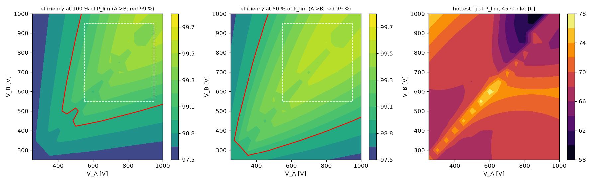
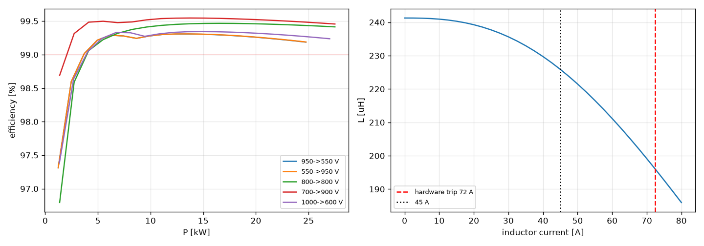
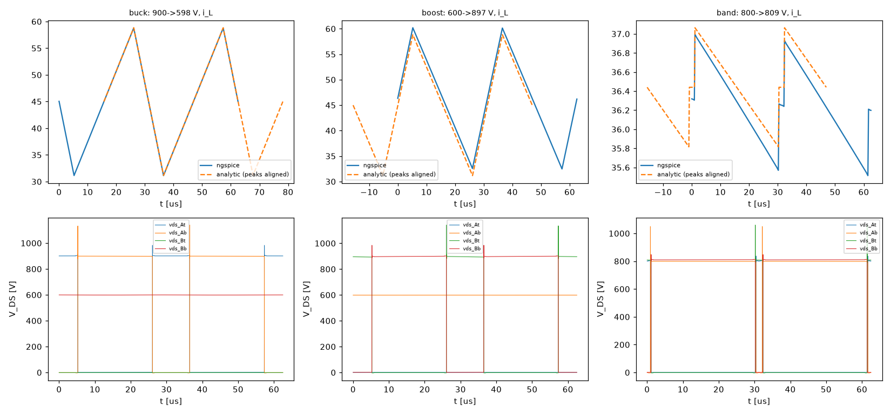

# PVCELL-25/27.5 power-stage design

Generated by `sim/pv_design.py`; every number is written by the script. **Calculated, not measured.** Hand-off file: `cell_spec.json`.

Topology: **A  2-level FSBB, 1700 V SiC** - kept by Gate-0b with Asian devices and USD cost (`sim/out/pv_tradeoff/gate0b.md`, D-031): best 2-level SC20x1-opt 324 USD/cell vs best 3-level 3L-SG2M014120LJx1 428 USD/cell; rule: 2-level if <= 1.15 x.

## 1. Design point

**A17:SG2M040170HJx2@32k/r0.80** (this report: the primary device) - the D-007 point (2-level, 32 kHz, ripple 0.8, today's inductor). Devices: **primary 2 x SG2M040170HJ**, **alternate 2 x MSC035SMA170B4**; cell_spec.json carries the worse of the two in every check (key 'worst_of') and both in device_primary / device_alternate. Worst corner of this device 99.01 % (target 99.2 %, floor 99.0 %). D-041: no Chinese alternate passes the false-turn-on check (InventChip IV2Q17020T4Z +4.0 V, IV2Q17040T4Z +4.41 V at the die, rev-5 gdrv_miller; single SG2M020170HJ +3.96 V) - the qualified fallback is the Microchip part as an assembly variant; Sichain states no qualification (release condition).

| item | value |
|---|---|
| switch positions | S1/S2 leg A, S3/S4 leg B, each 2 x SG2M040170HJ (Sichain, 1700 V, TO-247-4L (outline TO-247-4L-A, p11)) |
| switching frequency | 32.0 kHz, centre-aligned, dead time 200 ns firmware = 181-586 ns at the gates (UCC21710 interlock stretch), minimum pulse 1.77 us, D_max 0.943 |
| gate drive | +18 / -4 V, R_G,on 3.8 ohm / R_G,off 2.5 ohm per device + 0.5 ohm Kelvin-source resistor in both paths (E_on x1.18, E_off x1.09 from the datasheet E-vs-R_G curves), UCC21710 split outputs, 4 channels |
| leg decoupling / damper | 3 x FCSA3DS225 per leg (PVR-03) / 2 x 4.99 ohm + 2 x 4.7 nF per leg as drawn, its loss in the model (PVR-02) |
| inductor | 226 uH at 45 A (L0 244 uH, 196 uH at the 72.4 A trip), NPC290026 x 2 (stacked, 0.5 mm spacer) x2 (POCO NPC 26), 37 turns Litz 7.8 mm2, DCR 16.4 mOhm @20 C, 1.74 kg |
| inductor flux | B_dc 0.29 T at 45 A, 0.44 T at trip (B_sat 1.25 T); L at trip 80 % of L0; 50 % of L0 at 129 A |
| port A / B capacitors | 2 x C4AQUEW5450A3BJ = 90 uF / 2 x C4AQUEW5450A3BJ = 90 uF (1300 V at 70 C, 1100 V at 85 C hot spot); trade-study rule gave the minimum, the hand-off uses >= 2 per port with ripple <= 50 % of the summed rating |
| hardware current trip | 72.4 A = 1.15 x (45 A + half the worst ripple) |

### Primary vs alternate device (cell_spec takes the worse of the two)

| | primary | alternate |
|---|---|---|
| device | SG2M040170HJ | MSC035SMA170B4 |
| maker | Sichain | Microchip |
| per position | 2 | 2 |
| price USD (source) | 5.07 | 39.44 |
| R_G on / off [ohm] | 3.75 / 2.5 | 6.0 / 4.0 |
| lowest corner eta [%] | 99.01% | 99.00% |
| peak eta | 99.61% | 99.50% |
| Tj max at 45 C [C] | 78 | 80 |
| V_DS peak at OVP/trip [V] | 1396 | 1401 |
| turn-on dv/dt [V/ns] | 124 | 92 |
| Miller: die peak [V] | +1.41 | - |
| body diode peak in a port short [A] | 51 | 88 |
| qualification | none stated: p1 lists only halogen-free / RoHS; p13 RoHS + REACH statements; p14 item 8 says to consult Sichain for high-reliability applications | - |

## 2. Efficiency

- Peak: **99.61 %** at 900->1000 V, 13.8 kW.
- Full-load points (P = P_lim, 45 C inlet):

| V_A->V_B | P [kW] | mode | eta [%] | loss [W] | cond | sw | dead | core | cu | cap | gate | misc | aux | damp | hottest Tj [C] |
|---|---|---|---|---|---|---|---|---|---|---|---|---|---|---|---|
| 550->950 | 24.75 | boost | 99.06 | 235 | 104.4 | 33.8 | 5.7 | 21.3 | 58.0 | 1.0 | 0.2 | 1.3 | 6.0 | 3.5 | 69 |
| 950->550 | 24.75 | buck | 99.06 | 236 | 104.7 | 34.1 | 5.7 | 21.3 | 58.0 | 1.0 | 0.2 | 1.3 | 6.0 | 3.5 | 71 |
| 550->550 | 24.75 | band | 99.01 | 248 | 116.8 | 43.2 | 11.9 | 0.6 | 62.5 | 0.4 | 0.4 | 1.4 | 6.0 | 5.3 | 77 |
| 950->950 | 27.50 | band | 99.41 | 164 | 45.4 | 64.6 | 7.1 | 0.6 | 32.7 | 0.2 | 0.4 | 0.6 | 6.0 | 6.8 | 67 |
| 611->950 | 27.50 | boost | 99.16 | 232 | 103.9 | 34.3 | 5.7 | 18.7 | 57.8 | 0.9 | 0.2 | 1.3 | 6.0 | 3.5 | 69 |
| 950->611 | 27.50 | buck | 99.16 | 233 | 104.4 | 34.6 | 5.7 | 18.7 | 57.8 | 0.9 | 0.2 | 1.3 | 6.0 | 3.5 | 73 |
| 611->611 | 27.50 | band | 99.08 | 256 | 117.4 | 49.4 | 11.9 | 0.6 | 62.5 | 0.4 | 0.4 | 1.4 | 6.0 | 5.7 | 78 |
| 1000->500 | 22.50 | buck | 98.93 | 243 | 105.4 | 35.7 | 5.7 | 25.4 | 58.3 | 1.0 | 0.2 | 1.3 | 6.0 | 3.6 | 71 |
| 500->1000 | 22.50 | boost | 98.93 | 242 | 105.4 | 35.4 | 5.7 | 25.4 | 58.3 | 1.0 | 0.2 | 1.3 | 6.0 | 3.6 | 71 |

- Over the whole 250-1000 V square at P_lim: min 98.00 % at 250->1000 V; 134/256 grid points below 99 %, of which 0 inside the 550-950 V window. Below 99 % happens only where the 45 A limit cuts the power (low port voltage) and the other port is high.
- V_A = V_B transition (V_A = 800 V, P_lim): efficiency falls from 99.50 % to 99.21 % in the band where both legs hard-switch; inductor ripple there 0.0-5.4 A.
- Bidirectional: losses(V_A,V_B,+P) = losses(V_B,V_A,-P) (asserted); maps are A->B.

## 3. Thermal

- Heatsink model (estimate): sink-to-inlet 0.045 K/W (effectiveness-NTU, of which mean air rise 0.011 K/W) at 150 m3/h (6.6 m/s; the real fan operating point is in module_report.md); R_th,jc 0.39 K/W (datasheet max), case-sink 0.198 K/W (insulated, estimate), spreading 0.08 K/W.
- Hottest junction at full power: **78 C** at 45 C inlet (600->600 V, 27.0 kW); 95 C at 60 C inlet without derating; 70 C with the roadmap EVT derating (40 % at 60 C).
- Heatsink over-temperature trip: 95 C (sink temperature at which the hottest device reaches the 125 C design limit at full power is 100 C).
- Inductor: worst loss 83.8 W (core 25.4 W, copper 62.5 W); estimated hot-spot rise 90 K at the design point (forced air, h = 25 W/m2K, estimate).

## 4. Device voltage and transient (ngspice)

- VDMOS model fitted from the SG2M040170HJ datasheet: V_th 3.1 V, C_iss/C_rss/C_oss at 1400 V, Q_gd 24.0 nC fitted to 24 nC (C_gd shape a = 0.0544), R_DS(on) 40 mOhm, body diode from V_SD/Q_rr; effective external gate resistance 4.52 ohm (datasheet 2.5 ohm) fitted so that the simulated E_off at the datasheet test point equals the datasheet value. All transient decks use this calibrated model.
- Model check at the datasheet point (1200 V, 38 A, 25 C, single device, 15 nH): E_off 147 uJ vs datasheet-model 148 uJ; E_on 408 uJ vs 729 uJ (the VDMOS body diode under-predicts recovery, so the loss model keeps the datasheet energies; the transient model is used for di/dt and overshoot only).
- Worst commutation: 1100 V (OVP), 72.4 A (hardware trip), 2 devices, loop 20 nH with 10 ohm parallel damping (estimates), R_G,on = 1.5 x R_G,off: overshoot of the switching device at turn-off 130 V, of the complementary device during hard turn-on 296 V (turn-on dv/dt 124 V/ns) -> **296 V**, di/dt 6.3 A/ns, dv/dt 96 V/ns -> peak 1396 V = 0.82 x V_DSS (rule <= 0.85). Continuous 1000 V = 0.59 x V_DSS (rule <= 0.67). Deck: `sim/spice/pv_dpt_SG2M040170HJx2_2L_1100V.cir`.
- **Gate rail +18/-4 V** (gate-driver design, `gen/gdrv.py rev 5 (design_check record + constants via Python), sim/gdrv_miller.py`: on 17.83-18.56 V, off -3.55..-3.46 V; +20/-5 V is outside the UCC14241-Q1 range). Peak gate current 5.4 A source / 8.81 A sink per channel (6/4 ohm per device, driver ROH_EFF/ROL included) vs the UCC21710's 10 A: the 10.3 A in the previous cell_spec used 25 V and left out the 0.3 ohm pull-down. DESAT 7.89 V nominal (6.41-9.37 V), blanking 276-861 ns, detect + soft turn-off 0.42 us vs None us typical withstand.
- What -4 V instead of the datasheet's -4 V changes in the model: (1) turn-off energy x1.098 (calibrated VDMOS at the datasheet point; the stored factor 1.0985 is asserted against it and applied to the datasheet E_off); (2) gate-charge power uses the 22 V swing; (3) dead-time diode drop kept at the datasheet's -5 V value (slightly conservative); (4) dv/dt immunity: see the Miller check below.
- **Physical leg deck** (`sim/spice/pv_dpt_leg*.cir`, PVR-01/02/03; PCM-18: Jianghai capacitors as drawn): port bank 2 x FCSA3DS456 (35 nH / 4.0 mOhm each) -> 15 nH bus (layout requirement of gen/pvcell.py) -> leg decoupling (3 x FCSA3DS225 (2.2 uF / 1300 V, Ipkr 176 A, ESL 25 nH, Jianghai CBB138 DS p.30 (v2026.2)) per leg) -> 11.5 nH (board + devices) -> device pins with the drawn RC damper (2 x 4.99 ohm in series + 2 x 4.7 nF 2000 V C0G in series); Kelvin-source 0.5 ohm in every gate loop; clamp engaged. At 1100 V / 72.4 A: device peak 1374 V (lumped deck 1401 V), turn-on dv/dt 115 V/ns.

| leg deck corner | device peak [V] (limit 1445) | turn-off overshoot [V] | complementary turn-on overshoot [V] | dv/dt [V/ns] | decoupling peak / rms per capacitor [A] |
|---|---|---|---|---|---|
| 1000 V, 62.3 A (normal peak) | 1275 | 86 | 275 | 108 | 34.2 / 3.06 |
| 1000 V, 72.5 A (hardware trip) | 1281 | 130 | 281 | 108 | 36.7 / 3.55 |
| 1100 V, 62.3 A (normal peak) | 1367 | 81 | 267 | 115 | 35.0 / 3.06 |
| 1100 V, 72.5 A (hardware trip) | 1374 | 124 | 274 | 115 | 37.5 / 3.56 |

- **Miller check (rev-5 gate network, sim/gdrv_miller.py rev 5 (AO3400A clamp loop <= 1 nH), gen/gdrv.py MILLER_SIM)**: pin -2.47 V, die 1.41 V (ideal clamp loop 0.95 V) at 3.22 A per device; limits {'design_target': 1.44, 'V_th_min_175C': 1.94, 'V_th_min_25C': 2.5}; die +1.41 V vs V_th(min, 175 C) 1.94 V: within the 0.5 V design margin. Without any clamp the lumped deck's pin reaches +2.32 V - the clamp stays mandatory.
- **RC damper loss (PVR-02)**: energy per edge from the leg deck, in the loss model as group 'damp'. Per cycle at the trip corner 178 uJ (1100 V, 72.4 A: hard turn-on 169 uJ + turn-off 8 uJ (the loop's Q_oss/commutation energy, nearly independent of the damper C)) = 5.71 W per leg; worst in normal operation 3.78 W per leg at 250->1000 V. Peak damper current 47.1 A = 235 V per 4.99 ohm element. Required: >= 5.6 W per leg continuous at the mounting temperature, >= 290 V per element (the drawn 2 x 1 W 2512, 200 V, is not enough).

| E_damp per edge [uJ]: hard turn-on / turn-off | 2 A | 20 A | 45 A | 72 A |
|---|---|---|---|---|
| 250 V | 20 / 0.0 | 28 / 0.3 | 38 / 4.6 | 48 / 15.6 |
| 550 V | 44 / 0.0 | 59 / 0.2 | 77 / 2.5 | 97 / 12.1 |
| 800 V | 62 / 0.0 | 81 / 0.1 | 106 / 1.9 | 133 / 9.8 |
| 1000 V | 75 / 0.0 | 97 / 0.1 | 126 / 1.6 | 158 / 8.5 |
| 1100 V | 81 / 0.0 | 105 / 0.1 | 135 / 1.5 | 169 / 7.9 |

- **Leg decoupling (PVR-03)**: 3 x FCSA3DS225 (2.2 uF / 1300 V, Ipkr 176 A, ESL 25 nH, Jianghai CBB138 DS p.30 (v2026.2)) per leg: 39.8 A per capacitor (VDMOS, Q_oss), 61.5 A with the Q_rr surrogate, vs Ipkr 176 A; 3.56 A rms per capacitor vs 5.2 A; ESL 8.33 nH keeps the loop. Rejected: 2 x FCSA3DS225: 47 A per cap vs Ipkr 176 A. physical-leg deck (sim/spice/pv_dpt_leg_dec.cir): 1100 V, 72.4 A trip current, worst of on-times 0.6, 1.0, 1.5, 2.2, 3.0 us (decoupling-bulk resonance); rule: peak <= Ipkr/1.2 (VDMOS, Q_oss) and <= Ipkr with the Q_rr surrogate, ESL <= 8.5 nH so the 20 nH loop holds. Capacitors as drawn on PV-PWR (PCM-18): 2 x FCSA3DS456 per phase and port (Ls 35 nH, ESR 4.0 mOhm each) and 3 x FCSA3DS225 per leg (Ls 25 nH, ESR 22.5 mOhm each), Jianghai CBB138 DS p.30; the deck ran the KEMET C4AQ values before.

| decoupling per leg | C [uF] | ESL [nH] | peak per cap [A] (Ipkr) | with Q_rr surrogate [A] | rms per cap [A] | device peak [V] |
|---|---|---|---|---|---|---|
| 2 x FCSA3DS225 | 4.4 | 12.5 | 47 (176) | - | 4.57 | 1381 |
| 3 x FCSA3DS225 | 6.6 | 8.3 | 38 (176) | 61 | 3.56 | 1374 |
| 4 x FCSA3DS225 | 8.8 | 6.2 | 31 (176) | - | 3.03 | 1369 |

- Switching-level FSBB decks (VDMOS devices, gate drives with dead time, loop inductance, C4AQ banks, linear L at the operating bias):

| point | V_A->V_B (sim) | i_L avg [A] | ripple sim / analytic [A] | max V_DS sim / analytic: S1, S2, S3, S4 [V] | P_in-P_out-dE/dt sim [W] | deck |
|---|---|---|---|---|---|---|
| buck | 900->598 | 44.9 | 27.65 / 27.77 | 983/1005, 1140/1142, -1/0, 599/598 | 156 | `sim/spice/pv_fsbb_buck.cir` |
| boost | 600->897 | 46.3 | 27.65 / 27.48 | 1/0, 599/600, 1135/1138, 984/1002 | 166 | `sim/spice/pv_fsbb_boost.cir` |
| band | 800->809 | 36.2 | 1.41 / 1.12 | 837/866, 1050/1015, 1059/1027, 847/875 | 124 | `sim/spice/pv_fsbb_band.cir` |

Analytic device voltage = blocking port voltage + turn-off overshoot scaled with the peak current (S1/S4) or turn-on ringing scaled with the blocking voltage (S2/S3), both from the worst-case commutation run. Asserted: ripple within 15 %, every device peak within 12 %. The simulated P_in-P_out uses VDMOS switching (not datasheet energies) and is shown for information only.

## 5. Worst-case stresses (envelope, both directions)

- device_VDS_peak_V: 1400.6
- device_VDS_rating_V: 1700
- device_VDS_peak_frac: 0.8
- device_VDS_continuous_max_V: 1000.0
- device_Irms_per_position_A: 46.3
- device_Irms_per_device_A: 23.2
- device_I_turnoff_max_per_device_A: 36.2
- device_loss_max_per_position_W: 90.2
- Tj_max_45C_C: 80.3
- Tj_max_60C_full_power_C: 97.6
- Tj_max_60C_EVT_derated_C: 79.3
- turnoff_overshoot_V: 300.6
- turnoff_didt_A_per_ns: 6.3
- inductor_I_peak_A: 62.3
- inductor_I_rms_A: 47.7
- port_cap_I_rms_A: 23.6
- port_cap_V_max_V: 1100.0
- device_VDS_peak_lumped_deck_V: 1400.6
- device_VDS_peak_physical_leg_V: 1374.4
- device_VDS_peak_basis: larger of the lumped 20 nH deck (loop estimate, no capacitor model) and the physical-leg deck with the Jianghai capacitors as drawn (PCM-18), both at the OVP trip 1100 V and the hardware trip current

## 6. Module level (cells interleaved on common port banks)

| cells | interleave | P rated/max [kW] | C per port total [uF] (parts) | worst port ripple current [A rms] | per capacitor [A rms] (use limit) | worst port ripple [V pp] | ripple freq [kHz] |
|---|---|---|---|---|---|---|---|
| 1 | 360 deg | 25/27.5 | 90 (2) | 23.6 | 11.8 (23.8) | 3.91 | 32 |
| 3 | 120 deg | 75/82.5 | 270 (6) | 23.1 | 3.9 (23.8) | 0.43 | 96 |
| 4 | 90 deg | 100/110.0 | 360 (8) | 21.5 | 2.7 (23.8) | 0.21 | 128 |

## 7. Port-terminal short: bus reverse clamp (cell_spec.json 'bus_reverse_clamp')

Loop from sim/out/port_design: L 0.50 uH (A_L_LOOP), R 1.74 mOhm (135 A port: A_R_LOOP_X + 2 cold HP10NH1GPV160) / 1.09 mOhm (180 A port, HP10NH2GPV250); bank 2 x C4AQUEW5450A3BJ per port per cell (ESR, ESL from C4AQ p.14); body diodes: MSC035SMA170B4 Fig.1-9 fit; bolted short (0 ohm). Decks `sim/spice/pv_dump_*.cir`.

| cells | port | bank V | module peak [kA] | Q | clamp | body diode per device: peak [A] / I2t [A2s] / energy | clamp per device: peak [A] / I2t [A2s] (allowed at t95) | bank internal min [V] | fuse I2t [kA2s] (melt) |
|---|---|---|---|---|---|---|---|---|---|
| 3 | A | 1000 | 22.2 | 19.1 | none | 4070 / 444 / 7.99e+03 mJ | - | -155 | 21 (19) |
| 3 | A | 1000 | 22.2 | 19.1 | 8 x WND75P16W6 | 37 / 0.00159 / 0.252 mJ | 1926 / 162 (612) | -72 | 68 (19) |
| 3 | A | 1100 | 24.5 | 19.1 | none | 4479 / 542 / 9.65e+03 mJ | - | -170 | 25 (19) |
| 3 | A | 1100 | 24.5 | 19.1 | 8 x WND75P16W6 | 51 / 0.00334 / 0.416 mJ | 2116 / 196 (615) | -79 | 83 (19) |
| 3 | B | 1000 | 22.2 | 19.1 | none | 4070 / 444 / 7.99e+03 mJ | - | -155 | 21 (19) |
| 3 | B | 1000 | 22.2 | 19.1 | 8 x WND75P16W6 | 37 / 0.00159 / 0.252 mJ | 1926 / 162 (612) | -72 | 68 (19) |
| 3 | B | 1100 | 24.5 | 19.1 | none | 4479 / 542 / 9.65e+03 mJ | - | -170 | 25 (19) |
| 3 | B | 1100 | 24.5 | 19.1 | 8 x WND75P16W6 | 51 / 0.00334 / 0.416 mJ | 2116 / 196 (615) | -79 | 83 (19) |
| 4 | A | 1000 | 26.0 | 25.3 | none | 3600 / 466 / 8.51e+03 mJ | - | -138 | 37 (80) |
| 4 | A | 1000 | 26.0 | 25.3 | 8 x WND75P16W6 | 22 / 0.000478 / 0.118 mJ | 1694 / 192 (899) | -63 | 142 (80) |
| 4 | A | 1100 | 28.6 | 25.3 | none | 3962 / 569 / 1.03e+04 mJ | - | -151 | 46 (80) |
| 4 | A | 1100 | 28.6 | 25.3 | 8 x WND75P16W6 | 35 / 0.00118 / 0.21 mJ | 1861 / 233 (906) | -69 | 173 (80) |
| 4 | B | 1000 | 26.0 | 25.3 | none | 3600 / 466 / 8.51e+03 mJ | - | -138 | 37 (80) |
| 4 | B | 1000 | 26.0 | 25.3 | 8 x WND75P16W6 | 22 / 0.000478 / 0.118 mJ | 1694 / 192 (899) | -63 | 142 (80) |
| 4 | B | 1100 | 28.6 | 25.3 | none | 3962 / 569 / 1.03e+04 mJ | - | -151 | 46 (80) |
| 4 | B | 1100 | 28.6 | 25.3 | 8 x WND75P16W6 | 35 / 0.00118 / 0.21 mJ | 1861 / 233 (906) | -69 | 173 (80) |

- **Without a clamp** every SiC device of the shorted port's leg carries up to 4479 A (569 A2s, 10.3 J; the datasheet's only limit is I_DM 188 A pulsed, p.2): the leg is destroyed. The fuse's I2t is reached during the freewheel, not before the reversal.
- **Clamp:** 8 x WND75P16W6 (1600 V, I_FSM 1050 A, I2t 5513 A2s at 10 ms, I_FSM-vs-t_p curve Fig.4 for shorter pulses, docs/datasheets/power-semiconductors/WND75P16W6.pdf) in parallel across EACH bank (port A and port B of every cell, cathode to bus +): 48 per PV-P75, 64 per PV-P100/110. Chosen as the smallest count from [4, 6, 8, 10, 12, 16] with the body diodes <= 80 % of I_DM and the clamp I2t <= 50 % of its rating in the worst case.
- Worst clamp duty: 4 cells, port A, 1100 V: group peak 12.4 kA (the bank's internal ESL resonates with the clamp, so the peak exceeds the loop current), 1861 A and 233 A2s per device vs 906 A2s allowed at t95 = 0.59 ms (I2sqrt(t) x sqrt(t95)): margin 3.9x. Reverse voltage 1160 V (OVP 1100 V + bank ESL 9.5 nH x 6.3 A/ns) vs V_RRM 1600 V: margin 1.38.
- **Body-diode share with the clamp:** <= 88 A peak per device (I_DM 188 A), 0.011 A2s, 0.73 mJ: a microsecond transient while the clamp current builds up, inside the datasheet's pulsed rating.
- **Where:** on the cell's laminated DC bus AT the C4AQ bank terminals (port-A bank and port-B bank), devices spread symmetrically between the two capacitors; a clamp on the port board alone does not protect the cell legs. Tolerated clamp-branch inductance 1.5 nH (body diodes reach I_DM beyond it; sweep below), estimated 0.75 nH for 8 TO-247 in parallel. The film capacitors' own ESL makes their internal voltage reverse to -79 V for microseconds on the C4AQ design basis (the same 2 x 45 uF per port and cell as drawn); with the bank as drawn (Jianghai FCSA3DS456, 35 nH / 4.0 mOhm per part, table below) -104 V. Neither data sheet gives a reversal allowance (Jianghai CBB138 defines a surge current, 50 ms / 1000 occurrences, but lists no value): ask the capacitor maker.

**Bolted short, port A, 1100 V, the chosen clamp group: C4AQ design basis vs the bank as drawn** (ngspice, calculated; `drawn_bank_check`)

| cells | bank | module peak [kA] | clamp per device: peak [A] / I2t [A2s] (allowed at t95) | t95 [ms] | body diode peak [A] | bank internal min [V] |
|---|---|---|---|---|---|---|
| 3 | C4AQ (design basis) | 24.5 | 2116 / 196 (615) | 0.39 | 51 | -79 |
| 3 | FCSA3DS456 (as drawn) | 24.4 | 2125 / 196 (614) | 0.39 | 34 | -104 |
| 4 | C4AQ (design basis) | 28.6 | 1861 / 233 (906) | 0.59 | 35 | -69 |
| 4 | FCSA3DS456 (as drawn) | 28.4 | 1871 / 232 (904) | 0.59 | 19 | -92 |

| clamp branch [nH] | 0.25 | 0.50 | 0.75 | 1.00 | 1.50 | 2.00 | 3.00 |
|---|---|---|---|---|---|---|---|
| body diode peak per device [A] | 39 | 37 | 51 | 81 | 148 | 216 | 349 |

- Leakage at 1000 V / 85 C: 8.81 W per PV-P75, 11.75 W per PV-P100/110 (I_RM 0.05 mA (25 C) / 2.0 mA (150 C) at V_RRM, exponential in T, linear in V (ESTIMATE between the two datasheet points)). Normal operation: permanently reverse-biased (bus >= 240 V): no forward conduction, no recovery event, no switching loss; junction capacitance <= 8 x 300 pF (ESTIMATE) in parallel with the bank, not across a switch.
- **Alternative, differential-mode inductance** (port design's 5 kA values): 3 cells 10.8 uH: module peak 5.5 kA but Q = 89, the bank still reverses and each body diode carries 1029 A, 460 A2s; 4 cells 14.4 uH: module peak 5.5 kA but Q = 136, the bank still reverses and each body diode carries 777 A, 440 A2s. Overdamping would need R >= 2 sqrt(L/C) in the 135-180 A path. The inductance only lowers the peak (contactor weld); it does not replace the clamp, and a 10-15 uH choke at 135-180 A DC is a large part with its own loss.
- Contactor weld: not removed: the first current peak through the contactor flows before the bank voltage crosses zero - the port design's weld finding stands.
- **One clamp per port (the DAB's DD600N16K arm) does not work here.** On the port board, 10 nH per cell (low estimate) away from the banks, each SiC device still carries 1982 A (12 A2s): the current in that bus closes through the body diodes whatever the port-board clamp does. One arm per bank: 569 A per device - its terminal inductance (5 nH estimated, low) is above the 1.50 nH the bank tolerates. Decision: one clamp group per cell bank (2 per cell), not one per port: the bus from the port board to each cell bank (>= 10 nH even laminated) is in series with a port-board clamp, and the current stored in it closes through the cell's body diodes.

## 8. Sensing and protection (see cell_spec.json)

- inductor_overcurrent_hw_trip_A: 72.4
- current_limit_avg_A: 45.0
- overvoltage_hw_trip_port_A_V: 1100.0
- overvoltage_hw_trip_port_B_V: 1100.0
- overvoltage_sw_limit_V: 1034.0
- undervoltage_stop_V: 240.0
- desat_VDS_threshold_V: 9.3
- desat_blanking_ns: 465
- desat_threshold_range_V: [8.5, 10.0]
- desat_blanking_range_ns: [350, 465]
- short_circuit_detect_to_off_us: 0.42
- short_circuit_withstand_us_typ: 2.0
- desat_basis: NSI6651 DESAT pin threshold 8.5/9.3/10.0 V (envelope of the drawn -Q1 grade and the industrial alternate, gen/gdrv.py NSI), LEB 200 ns, DESAT to OUT <= 360 ns (contains the deglitch filter) (sim/data/asia_drivers.md); V_DS(on) at the trip current, 175 C: SG2M040170HJ 3.1 V (margin 2.7x), MSC035SMA170B4 2.4 V (margin 3.6x); short-circuit withstand ASSUMED 2.0 us (no Chinese datasheet gives one)
- heatsink_overtemperature_trip_C: 95.0
- heatsink_trip_basis: heatsink temperature at which the hottest device reaches 125 C at full load, minus 5 K

## 9. Assumptions and open items

- Loop inductance 20 nH, heatsink geometry/airflow, insulated-mount R_cs, bias/sense power, cost weights: estimates (see sim/out/pv_tradeoff/report.md section 6). Overshoot scales with the real layout: re-run the DPT deck with the extracted loop.
- No 1700 V cosmic-ray FIT data on file; the 0.67 x V_DSS rule is scaled from Wolfspeed's Gen3 1200 V curve. Request Microchip FIT vs V_DS for SG2M040170HJ (and the 2000 V alternative IMYH200R024M1H/IMYH200R012M1H, Infineon) before schematic freeze.
- Parallel devices assumed to share current and switching energy equally; layout must be symmetric (Kelvin source, equal gate loops).
- Second source: the Infineon 2 kV variant (candidate A2k in the study) needs different gate voltages (+18/-3 V) and package (TO-247-4-PLUS); onsemi NTH4L028N170M1 (1700 V, 28 mOhm) was not on file and is not modelled.
- Inductor: catalog fits only; build and measure L(I), loss and temperature on a prototype; Litz strand and layer design open.
- Physical-leg decks: VDMOS body diode is capacitive only (Q_oss). The decoupling check adds the datasheet Q_rr less Q_oss(1000 V) as a linear capacitance switched in for the turn-on edge (ESTIMATE, conservative: it also lifts the device peak to 1584 V); the damper table and the Miller check use Q_oss only. 15 nH bulk-to-leg bus and 11.5 nH board + devices are layout requirements/estimates; re-run with the extracted layout.
- Clamp alternatives: the 10 nH port-board-to-bank bus and the 5 nH DD600N16K arm are deliberately low estimates; both only strengthen the per-bank decision.
- Nothing here is bench-validated.

