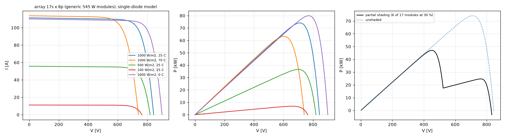

# PV-P75 / PV-P100-110 MPPT study (PV-02, PV-C1, PV-C2)

Generated by `sim/pv_mppt.py`; every number is written by the script. **Simulated, not measured.** Results are also written to `sim/out/pv_control/control_spec.json` (section `mppt`) and `mppt_result.json`.

## 1. PV array model

- Module: GENERIC 545 W class (144 half-cut mono PERC) datasheet values - P_mp 545 W, V_mp 41.8 V, I_mp 13.04 A, V_oc 49.65 V, I_sc 13.92 A, dI_sc/dT +0.048 %/K, dV_oc/dT -0.27 %/K. Not a specific product (assumption).
- Single-diode model fitted at STC (ideality 1.1 assumed): I_L 13.930 A, I_0 3.456e-10 A, R_s 126.8 mOhm, R_sh 181.0 ohm; De Soto translation in G and T with the band-gap term fitted to the datasheet dV_oc/dT (E_g,eff 0.980 eV). Model dP_mp/dT -0.32 %/K (datasheet -0.35 %/K).
- Strings of 17 modules (V_oc 968 V at -30 C, inside the 1000 V port range), 8 strings = 74.1 kW at STC (EN 50530 100 % point ~ rated 75 kW). Three bypass diodes per module for the shading case. Low-voltage arrays 8s x 8p and 7s x 8p for the lower range and the 250 V start.

## 2. Algorithm and why

dP-P&O (perturb and observe with a mid-period power sample, Sera et al. 2008) at 20 Hz on the V_A reference of the cascaded V_A loop (sim/pv_control.py), with:
- step adapted to the measured normalised slope |dlnP/dlnV| x 0.03, clamped to 0.6-3 % of V_A;
- measurements = averages over the last 20 ms of each half period (the V_A loop settles in ~1.6 ms, time constant 0.55 ms from the exact sampled model), V_A and I_A oversampled at 500 kS/s;
- the irradiance-drift cancellation of dP-P&O (perturbation effect = (P_x - P_k) - (P_k+1 - P_x)) removes the wrong-direction steps of plain P&O on ramps (EN 50530 dynamic test), at the cost of half the update rate;
- freeze-and-track while a module limit (135 A / 82.5 kW / V_B max) holds the operating point (no reference wind-up), floor 255 V;
- global scan (reference swept down to 45 % of V at 1000 V/s, then P&O from the best point) every 300 s for partial shading.
Incremental conductance was not chosen: with the 0.26 A current LSB its dI/dV estimate is noise-dominated at low irradiance and on ramps it has the same drift problem; model-based / fractional-V_oc methods need array knowledge. P&O variants are what the TI references (TIDM-SOLAR-DCDC, TIDM-BUCKBOOST-BIDIR) use too.

## 3. Static MPPT efficiency (energy over 30 s after 4 s settling; reference = available power under the module limits)

| array | T_cell [C] | 50 W/m2 | 100 W/m2 | 200 W/m2 | 300 W/m2 | 500 W/m2 | 700 W/m2 | 1000 W/m2 |
|---|---|---|---|---|---|---|---|---|
| 8s x 8p (low voltage, 35 kW STC) | 25 | 99.934 | 99.964 | 99.973 | 99.976 | 99.977 | 99.977 | 99.978 |
| 8s x 8p (low voltage, 35 kW STC) | 70 | 99.854 | 99.982 | 99.978 | 99.980 | 99.982 | 99.983 | 99.984 |
| 17s x 8p (1000 V class, 74 kW STC) | 0 | 99.932 | 99.961 | 99.971 | 99.973 | 99.974 | 99.974 | 99.975 |
| 17s x 8p (1000 V class, 74 kW STC) | 25 | 99.934 | 99.963 | 99.973 | 99.975 | 99.977 | 99.977 | 99.978 |
| 17s x 8p (1000 V class, 74 kW STC) | 50 | 99.941 | 99.966 | 99.976 | 99.979 | 99.980 | 99.980 | 99.981 |
| 17s x 8p (1000 V class, 74 kW STC) | 70 | 99.944 | 99.970 | 99.978 | 99.980 | 99.982 | 99.983 | 99.984 |

- 8s x 8p at 50 W/m2, 70 C: V_mp 242 V is below the 255 V tracking floor (port range 250-1000 V): the tracker reaches 99.854 % of what is available above the floor; the floor itself costs 2.64 % of P_mpp (range loss, not tracking).

- 8s x 8p at 100 W/m2, 70 C: V_mp 254 V is below the 255 V tracking floor (port range 250-1000 V): the tracker reaches 99.982 % of what is available above the floor; the floor itself costs 0.02 % of P_mpp (range loss, not tracking).

Minimum with the MPP in the window 99.932 % (17s x 8p (1000 V class, 74 kW STC), 50 W/m2, 0 C); overall 99.854 % (8s x 8p (low voltage, 35 kW STC), 50 W/m2, 70 C); EU-weighted (5/10/20/30/50/100 % weights 0.03/0.06/0.13/0.10/0.48/0.20, 25 C) **99.974 %**.

**PV-C1 (>= 99.9 % static) is met at every grid point whose MPP lies inside the 255-1000 V tracking window** - with the oversampled measurement of section 4; it is not met without it.
**Not met where the MPP lies below the 255 V floor:** 8s x 8p 50 W/m2 70 C = 99.854 % of the power available above the floor (plus 2.64 % range loss). The tracker sits on the floor and must probe upward now and then to notice when the MPP moves back into the window; each probe on that steep flank costs power. A module/array combination whose MPP falls below 250 V is outside PV-03 anyway.

## 4. Measurement chain: noise, quantisation, sampling rate, offset, interleaving ripple

Port-A chain (sim/out/port_design): V_A 0.638 V/LSB, 0.46 V rms noise per sample (AMC3330 + ADC); I_A 0.258 A/LSB, 0.21 A rms per sample (AMC3302 over the 100 uOhm shunt + ADC); interleaving ripple at the synchronous sampling instant after the 3.2 kHz divider RC: 5.40 mV (capacitor node: 89 mV).

| measurement | 50 W/m2 | 100 W/m2 | 300 W/m2 | 1000 W/m2 |
|---|---|---|---|---|
| ideal measurement | 99.979 % | 99.978 % | 99.978 % | 99.978 % |
| 12-bit quantisation only | 98.766 % | 99.525 % | 99.742 % | 99.948 % |
| + noise, 32 kS/s (control samples only) | 99.695 % | 99.863 % | 99.955 % | 99.975 % |
| + noise, 500 kS/s oversampled (design) | 99.934 % | 99.963 % | 99.975 % | 99.978 % |
| design + 0.3 A offset + ripple bias | 99.933 % | 99.962 % | 99.975 % | 99.978 % |

- Quantisation alone (no noise to dither it) leaves a staircase in the measured power that P&O can sit on; the real noise (~0.8 LSB rms) dithers it, and averaging then recovers sub-LSB resolution.
- With only the control-loop samples (32 kS/s, 640 per window) the power noise at 50-100 W/m2 exceeds the change a minimum step produces near the MPP and the operating point random-walks: below 99.9 %. **Requirement: V_A and I_A oversampled at >= 500 kS/s (>= 10 000 independent samples per 20 ms window), accumulated by DMA/CLA, or an equivalent sigma-delta channel.** ADC-A/ADC-D have the capacity (3.5 MS/s each).
- A calibrated current offset of 0.3 A shifts the perceived MPP by dP/dV = -I_off; its cost is 0.002 %-points at 50 W/m2 and negligible above. Gain errors do not move the MPP.
- The interleaving ripple at the synchronous sampling instant is negligible behind the port-board RC.

## 5. Dynamic MPPT efficiency (EN 50530-style ramps, 25 C)

Shortened sequences (one cycle per slope, 10 s dwells; the standard repeats each slope several times): energy-based efficiency over the whole sequence.

| sequence | slope [W/m2/s] | duration [s] | efficiency |
|---|---|---|---|
| 100->500 W/m2 | 0.5 | 1630 | 99.947 % |
| 100->500 W/m2 | 2 | 430 | 99.951 % |
| 100->500 W/m2 | 10 | 110 | 99.975 % |
| 100->500 W/m2 | 30 | 57 | 99.975 % |
| 100->500 W/m2 | 50 | 46 | 99.972 % |
| 300->1000 W/m2 | 10 | 170 | 99.977 % |
| 300->1000 W/m2 | 30 | 77 | 99.978 % |
| 300->1000 W/m2 | 50 | 58 | 99.978 % |
| 300->1000 W/m2 | 100 | 44 | 99.975 % |

Overall (energy-weighted): **99.957 %** -> PV-C1 met dynamically (lowest: 100->500 W/m2 at 0.5 W/m2/s, 99.947 %).

## 6. Start-up from the 250 V region (PV-C2)

- 7s x 8p array (V_oc ~348 V at STC), morning ramp 20 -> 400 W/m2 in 60 s, tracking starts at V_oc: energy efficiency 99.96 % including the descent from V_oc.
- static 200 W/m2, 25 C: V_mp 279 V, operating 279 V, tracking efficiency 99.973 %
- static 1000 W/m2, 70 C: V_mp 248 V, operating 255 V, tracking efficiency 99.937 %; the MPP is below the 255 V floor (port range 250-1000 V), which costs a further 0.67 % of P_mpp - set by the port range, not the tracker

## 7. Behaviour at the 135 A and 82.5 kW limits (curtailment)

- 12s x 11p (135 A port-current limit), irradiance 700 -> 1150 -> 700 W/m2 at 30 W/m2/s (P_mpp up to 82.8 kW): highest port current 135.0 A, highest power 73.38 kW; efficiency against the available power under the limit 99.897 %. While limited, the MPPT holds its reference at the measured V_A, so it resumes without wind-up when the limit releases.
- 17s x 11p (82.5 kW power limit), irradiance 700 -> 1150 -> 700 W/m2 at 30 W/m2/s (P_mpp up to 117.3 kW): highest port current 118.3 A, highest power 82.50 kW; efficiency against the available power under the limit 99.972 %. While limited, the MPPT holds its reference at the measured V_A, so it resumes without wind-up when the limit releases.
- The limited operating point is always right of the MPP (higher voltage, lower current): stable for the V_A loop (the array behaves as a voltage source there).

## 8. Partial shading (two local maxima)

- 17s x 8p, 6 of 17 modules per string at 30 % at 1000 W/m2: maxima at 451 V / 47.0 kW, 762 V / 24.7 kW; global 451 V / 47.0 kW.
- Starting from V_oc, P&O alone settles on the local maximum: 52.5 % of the global maximum.
- With the global scan (every 8 s in this demonstration) the tracker moves to 447 V: 99.27 % of the global maximum.
- Cost of the scheduled scan (every 300 s) in unshaded operation at 600 W/m2: 0.015 %-points of static efficiency.

## 9. Model check against the switching-cycle-averaged model

The same MPPT code driving the averaged model of sim/pv_control.py (32 kHz samples, no noise) from 0.88 V_mp at 1000 W/m2: RMS difference of the V_A trajectory against the quasi-static tracker 0.70 V over 0.4 s; mean power over the last 0.15 s 73.45 kW (averaged) vs 73.42 kW (quasi-static), P_mpp 74.13 kW.

## 10. Verdict on PV-C1 (>= 99.9 % MPPT accuracy) and honesty

- Static: met at every grid point with the MPP in the window, not met where the MPP is below the 255 V floor (minimum in the window 99.932 %, EU-weighted 99.974 %) - only with the oversampled V_A/I_A measurement. Dynamic (EN 50530-style ramps): 99.957 % overall.
- What is not modelled: array capacitance and cable inductance, module mismatch inside the array, irradiance noise faster than the ramps, ADC 1/f noise and drift inside the window, temperature transients; the module data are generic. The V_A loop is represented by its closed-loop time constant (checked against the averaged model).
- Megarevo's 99.9 % is a published figure without a stated test method; ours is EN 50530-style simulation. Nothing here is measured.
