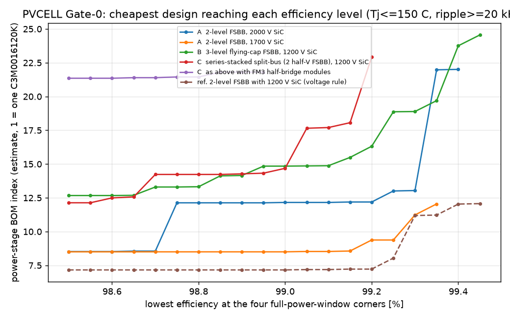
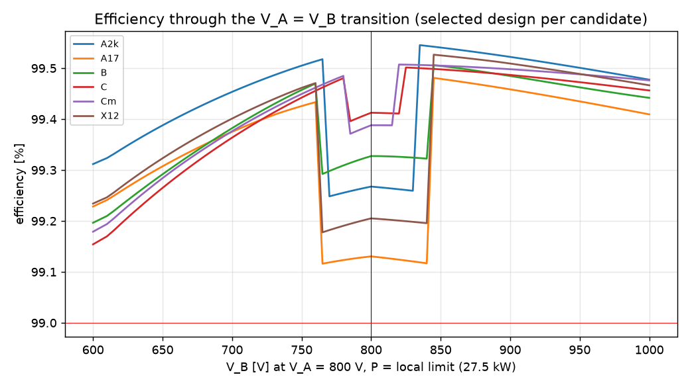
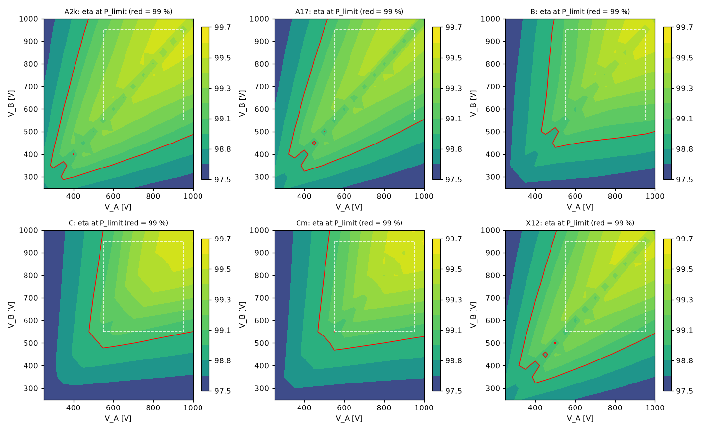
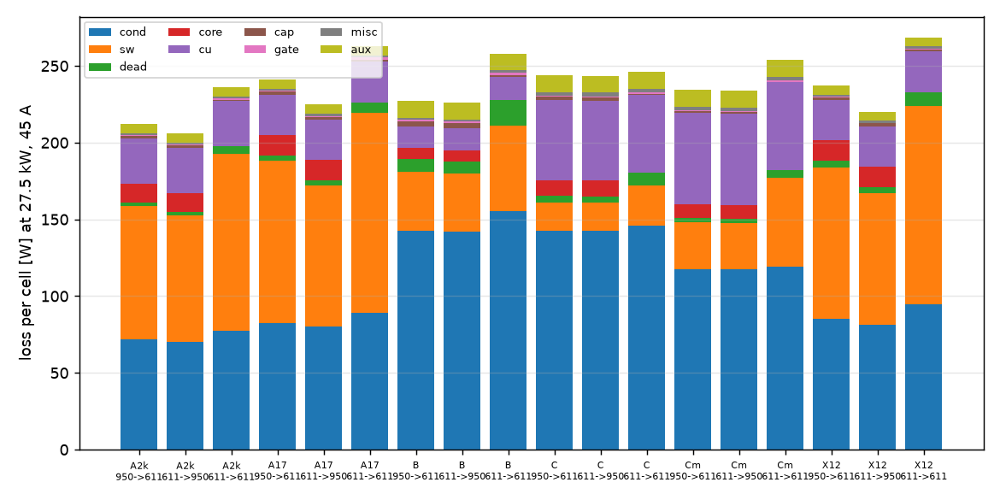

# PVCELL-25/27.5 Gate-0 topology study (PV-18)

Generated by `sim/pv_tradeoff.py` - every number below is written by the script. **Calculated, not measured.**

**Recommendation: A  2-level FSBB, 1700 V SiC** (topology A, two-level four-switch buck-boost). Runner-up: B  3-level flying-cap FSBB, 1200 V SiC.

## 1. Basis

- Cell: 25 kW rated / 27.5 kW max, 45 A on the lower-voltage port, both ports 250-1000 V, full power 550-950 V, P_lim = min(27.5 kW, 45 A x min(V_A,V_B)) (PV-22).
- Bidirectional: the FSBB is mirror-symmetric, losses(V_A,V_B,+P) = losses(V_B,V_A,-P) (asserted in the self-check), so all maps are A->B.
- Full-load evaluation points (V_A->V_B): 550->950, 950->550, 550->550, 950->950, 611->950, 950->611, 611->611, 1000->500, 500->1000; corners = 550->950, 950->550, 550->550, 950->950.
- Modulation: buck or boost with one static leg; both legs switch only in the band V_B/V_A in (D_max, 1/D_max), D_max = 1 - 1.0 us x f_sw; centre-aligned PWM; 3-level legs phase-shifted 180 deg (FC at V/2).
- Design space per candidate: f_sw 10, 12.5, 16, 20, 25, 32, 40, 50 kHz, peak-peak ripple 0.30, 0.45, 0.60, 0.80 x 45 A at the worst-ripple point, devices and parallel count as listed. Inductor ripple frequency >= 20 kHz (audible-noise assumption). For every combination a catalog inductor and C4AQ capacitor banks are designed automatically.
- Selection inside a candidate: the lowest power-stage BOM index whose efficiency is >= 99.0 % at every full-power-window corner and Tj <= 150 C at 45 C inlet. Candidate ranking: among candidates that pass the voltage rules and reach >= 99 % peak, the lowest mean BOM index over the corner-efficiency levels 99.0-99.3 % (front average, unreachable level = 1.5 x the candidate's dearest design), so the ranking does not hinge on one point of the front.

## 2. Selected design per candidate

| | A2k | A17 | B | C | Cm | X12 |
|---|---|---|---|---|---|---|
| topology | A  2-level FSBB, 2000 V SiC | A  2-level FSBB, 1700 V SiC | B  3-level flying-cap FSBB, 1200 V SiC | C  series-stacked split-bus (2 half-V FSBB), 1200 V SiC | C  as above with FM3 half-bridge modules | ref. 2-level FSBB with 1200 V SiC (voltage rule) |
| device (V_DSS) | IMYH200R024M1H (2000 V) | MSC035SMA170B4 (1700 V) | C3M0032120K (1200 V) | C3M0032120K (1200 V) | CAB011M12FM3 (1200 V) | C3M0016120K (1200 V) |
| devices / gate drivers per cell | 8 / 4 | 8 / 4 | 16 / 8 | 16 / 8 | 8 / 8 | 4 / 4 |
| f_sw / ripple freq [kHz] | 40.0 / 40.0 | 50.0 / 50.0 | 50.0 / 100.0 | 25.0 / 25.0 | 20.0 / 20.0 | 50.0 / 50.0 |
| L at 45 A [uH] x inductors | 176 x1 | 139 x1 | 35 x1 | 139 x2 | 176 x2 | 139 x1 |
| inductor energy 0.5 L Ipk^2 [J] (all) | 0.35 | 0.28 | 0.07 | 0.55 | 0.70 | 0.28 |
| inductor (Magnetics catalog) | 00Y8044E026 x2, 33 t | 00Y8044E026 x2, 29 t | 00Y8044E026 x1, 20 t | 00Y8044E026 x2, 29 t | 00Y8044E026 x2, 33 t | 00Y8044E026 x2, 29 t |
| inductor mass [kg] (all) | 1.7 | 1.6 | 0.8 | 3.2 | 3.4 | 1.6 |
| film caps per cell (C4AQ) | A:1xC4AQUEW5450A3BJ, B:1xC4AQUEW5450A3BJ | A:1xC4AQUEW5450A3BJ, B:1xC4AQUEW5450A3BJ | A:1xC4AQUEW5450A3BJ, B:1xC4AQUEW5450A3BJ, FC:2xC4AQIEW6100A3BJ per leg | A:1xC4AQCEW6130A3BJ, B:1xC4AQCEW6130A3BJ (x2: upper+lower) | A:2xC4AQCEW6130A3BJ, B:2xC4AQCEW6130A3BJ (x2: upper+lower) | A:1xC4AQUEW5450A3BJ, B:1xC4AQUEW5450A3BJ |
| cap banks: C [uF] / worst ripple [A rms] / rating used [A rms] | A 45/23.6/23.8; B 45/23.6/23.8 | A 45/23.7/23.8; B 45/23.7/23.8 | A 45/22.6/23.8; B 45/22.6/23.8; FC 200/45.0/56.8 | A 130/23.7/30.0; B 130/23.7/30.0 | A 260/23.6/60.1; B 260/23.6/60.1 | A 45/23.7/23.8; B 45/23.7/23.8 |
| eta min at corners [%] | 99.12 | 99.03 | 99.00 | 99.02 | 99.00 | 99.01 |
| eta mean full-load points [%] | 99.16 | 99.05 | 99.12 | 99.08 | 99.10 | 99.08 |
| eta min over whole envelope at P_lim [%] | 98.14 | 97.88 | 97.96 | 97.91 | 97.99 | 97.94 |
| eta peak [%] (at) | 99.63 (800->1000 V, 5.5 kW) | 99.52 (750->1000 V, 5.5 kW) | 99.63 (950->1000 V, 16.5 kW) | 99.68 (950->1000 V, 13.8 kW) | 99.71 (950->1000 V, 11.0 kW) | 99.62 (950->1000 V, 13.8 kW) |
| eta dip at V_A=V_B=800 V (sweep min/max) [%] | 99.25 / 99.55 | 99.12 / 99.48 | 99.20 / 99.51 | 99.15 / 99.50 | 99.18 / 99.51 | 99.18 / 99.53 |
| worst Tj at 45 / 60 C inlet, full load [C] | 79 / 97 | 101 / 120 | 77 / 94 | 71 / 88 | 74 / 90 | 131 / 150 |
| DC utilisation V_dc/V_DSS (rule <= 0.67) | 0.50 | 0.59 | 0.44 | 0.44 | 0.44 | 0.83 |
| hardware current trip [A] | 72.4 | 72.4 | 72.4 | 72.4 | 72.4 | 72.4 |
| turn-off di/dt at trip: datasheet t_f / ngspice [A/ns] | 3.2 / 5.9 | 3.4 / 5.6 | 6.4 / 6.7 | 6.4 / 6.9 | 6.1 / 7.1 | 4.5 / 8.0 |
| ngspice model: R_G,eff fitted to E_off [ohm] | 6.39 (ds 2.0), E_off 568/564 uJ | 4.37 (ds 4.0), E_off 191/188 uJ | 1.50 (ds 2.5), E_off 80/80 uJ | 1.50 (ds 2.5), E_off 80/80 uJ | 0.31 (ds 1.0), E_off 835/730 uJ | 1.55 (ds 2.5), E_off 647/650 uJ |
| ngspice overshoot: turn-off / complementary at turn-on [V] | 122 / 1 | 116 / 299 | 173 / 319 | 144 / 337 | 120 / 97 | 165 / -1 |
| R_G,on / R_G,off needed for the peak rule (E_on penalty in losses) | 1.0 | 1.5 | 1.0 | 1.0 | 1.0 | 1.0 |
| peak incl. L di/dt at trip & OVP (rule <= 0.85) | 0.61 (1222 V, +122 V) | 0.82 (1399 V, +299 V) | 0.75 (897 V, +319 V) | 0.76 (914 V, +337 V) | 0.58 (698 V, +120 V) | 1.05 (1265 V, +165 V) |
| sea-level SEB rate [FIT/cm2] (basis) | 0.001 (scaled by V_DSS) | 0.245 (scaled by V_DSS) | 0.001 (vendor curve) | 0.001 (vendor curve) | 0.001 (vendor curve) | 150 (vendor curve) |
| semiconductor cost index (est.) | 9.0 | 5.3 | 7.8 | 7.8 | 14.9 | 4.0 |
| power-stage BOM index (est.) | 12.2 | 8.5 | 14.8 | 14.7 | 23.1 | 7.2 |
| passes voltage rules / 99 % corners | yes / yes | yes / yes | yes / yes | yes / yes | yes / NO | NO / yes |

Full-power corner efficiencies [%]:

| corner | A2k | A17 | B | C | Cm | X12 |
|---|---|---|---|---|---|---|
| 550->950 | 99.17 | 99.10 | 99.11 | 99.02 | 99.06 | 99.11 |
| 950->550 | 99.15 | 99.04 | 99.11 | 99.02 | 99.05 | 99.05 |
| 550->550 | 99.12 | 99.03 | 99.00 | 99.03 | 99.00 | 99.01 |
| 950->950 | 99.29 | 99.09 | 99.41 | 99.53 | 99.51 | 99.25 |

## 3. Cheapest design per efficiency level (BOM index; '-' = not reachable)

| corner-min eta | A2k | A17 | B | C | Cm | X12 |
|---|---|---|---|---|---|---|
| >= 98.8 % | 12.1 | 8.5 | 13.3 | 14.2 | 21.4 | 7.2 |
| >= 99.0 % | 12.2 | 8.5 | 14.8 | 14.7 | - | 7.2 |
| >= 99.1 % | 12.2 | 8.5 | 14.9 | 17.7 | - | 7.2 |
| >= 99.2 % | 12.2 | 9.4 | 16.3 | 22.9 | - | 7.2 |
| >= 99.3 % | 13.0 | 11.2 | 18.9 | - | - | 11.2 |
| >= 99.4 % | 22.0 | - | 23.8 | - | - | 12.0 |
| >= 99.5 % | - | - | - | - | - | - |

## 4. Qualitative comparison

| topology | control / hardware complexity | behaviour at V_A ~= V_B |
|---|---|---|
| A | 1 inductor-current loop + buck/boost/band mode logic; 4 gate drives; V_A, V_B, i_L sensing | band mode: both legs hard-switch at full voltage (switching loss ~2x of buck/boost), inductor ripple ~0 |
| B | as 2L plus 2 flying-cap voltage loops (2 isolated V sensors), FC precharge before switching, phase-shifted PWM on 8 channels, FC must be held while a leg is static | band mode: 8 switches active, both flying caps must be regulated at once; ripple ~0 |
| C | 2 current loops + midpoint (power-split) balance loop, 2 inductors, midpoint V sensing on both ports; ports share NO rail (A- != B- when V_A != V_B) - PV/battery must be floating/symmetric | band mode in both half-cells: 4 legs switching at V/2; ripple ~0 |

## 5. Why this recommendation

1. **Recommended A17** (A  2-level FSBB, 1700 V SiC): 99.03 % at the worst full-power corner, 99.52 % peak; 8 x MSC035SMA170B4 (1700 V), 4 gate drivers, 1 inductor(s) 1.6 kg, BOM index 8.5 at the selection point, front average 9.2, best reachable corner efficiency 99.35 %. Lowest cost at every efficiency level up to its limit; common negative rail between the ports; no balancing loop (1 inductor-current loop + buck/boost/band mode logic; 4 gate drives; V_A, V_B, i_L sensing).
2. **Runner-up B** (B  3-level flying-cap FSBB, 1200 V SiC): 99.00 % worst corner, 99.63 % peak; 16 x C3M0032120K (1200 V), 8 gate drivers, 1 inductor(s) 0.8 kg, BOM index 14.8 at the selection point, front average 16.3, best reachable corner efficiency 99.45 %. Lost on cost and complexity: as 2L plus 2 flying-cap voltage loops (2 isolated V sensors), FC precharge before switching, phase-shifted PWM on 8 channels, FC must be held while a leg is static.
3. **X12** (ref. 2-level FSBB with 1200 V SiC (voltage rule)): 4 x C3M0016120K (1200 V), 4 gate drivers, 1 inductor(s) 1.6 kg, BOM index 7.2 at the selection point, front average 7.9, best reachable corner efficiency 99.45 %. Excluded by the voltage rule: 0.83 x V_DSS continuous (150 FIT/cm2 on the vendor curve) and 1.05 x V_DSS peak.
4. **A2k** (A  2-level FSBB, 2000 V SiC): 8 x IMYH200R024M1H (2000 V), 4 gate drivers, 1 inductor(s) 1.7 kg, BOM index 12.2 at the selection point, front average 12.4, best reachable corner efficiency 99.40 %. 1 inductor-current loop + buck/boost/band mode logic; 4 gate drives; V_A, V_B, i_L sensing.
5. **C** (C  series-stacked split-bus (2 half-V FSBB), 1200 V SiC): 16 x C3M0032120K (1200 V), 8 gate drivers, 2 inductor(s) 3.2 kg, BOM index 14.7 at the selection point, front average 22.8, best reachable corner efficiency 99.20 %. 2 current loops + midpoint (power-split) balance loop, 2 inductors, midpoint V sensing on both ports; ports share NO rail (A- != B- when V_A != V_B) - PV/battery must be floating/symmetric.
6. **Cm** (C  as above with FM3 half-bridge modules): 8 x CAB011M12FM3 (1200 V), 8 gate drivers, 2 inductor(s) 3.4 kg, BOM index 23.1 at the selection point, front average 148.5, best reachable corner efficiency 98.95 %. 2 current loops + midpoint (power-split) balance loop, 2 inductors, midpoint V sensing on both ports; ports share NO rail (A- != B- when V_A != V_B) - PV/battery must be floating/symmetric.

## 6. Rules, assumptions and what most affects the conclusion

- **Voltage rule** (applied to every device): continuous DC blocking <= 0.67 x V_DSS, peak (OVP 1100 V + L_loop di/dt at the hardware current trip, 1.15 x the largest normal peak) <= 0.85 x V_DSS; L di/dt is the larger of the datasheet-fall-time estimate and the ngspice VDMOS commutation (decks sim/spice/pv_dpt_*.cir); each VDMOS model has Q_gd fitted to the datasheet and its effective gate resistance fitted so that the simulated E_off at the datasheet test point equals the datasheet value. Source of the 0.67: docs/datasheets/power-semiconductors/Wolfspeed_Designed_to_Last_Even_in_the_Harshest_Environments.pdf, Fig. 4 p7 (Gen3 1200 V: ~5 FIT/cm2 at 800 V, 150 FIT/cm2 at 1000 V). No 1700/2000 V FIT curve is on file: the rule is scaled by V_DSS - **ask Microchip/Infineon for FIT vs V before Gate 0 closes.**
- Loop inductance (estimates): 2L/C discrete 20 nH, 3L outer loop 25 nH, FM3 16.4 nH, each with 10 ohm in parallel (skin-effect/ESR damping of the 50-100 MHz ringing; with only 5 mOhm series damping the ringing never decays and the complementary-device peak doubles - the damping value is the least certain transient input).
- Transient check per selected design (sim/spice/pv_dpt_*.cir): turn-off of the switching device AND ringing of the complementary device while the switch turns on hard, at OVP x share and the hardware trip current. Where the peak rule fails, the smallest turn-on resistor multiplier from [1.0, 1.5, 2.0, 2.5, 3.0] that passes is applied and its E_on penalty (datasheet E-vs-R_G curve) is put into the losses before re-optimising (multipliers used: {'MSC035SMA170B4x2 2L': 1.5}).
- Source quality: the cosmic-ray curve is read from a Wolfspeed marketing paper (an independent audit re-read our points within 21 %); Infineon's tabulated E_oss is ~27 % below the integral of its own C_oss curve (using the table under-subtracts E_oss, i.e. errs high on loss); the IMYH200R024M1H E_off table (p5) is 30 % below its own plots (p10) - the plots are used.
- Switching energies: datasheet double-pulse curves scaled E ~ (V/V_ref)^kv x (1+kt(Tj-T_ref)); E_rr from vendor E_fr/E_RR or 0.45 x Q_rr x V; per hard edge E_on+E_oss (switch) and E_rr-E_oss (diode), per hard turn-off E_off-E_oss, residual-voltage loss for incomplete ZVS; dead time 200 ns on the body diode. Model accuracy is not validated: treat +-0.1 %-point as the band.
- Heatsink (estimate): one plate-fin extrusion per cell, 150 x 300 mm base, 30 fins x 60 mm, 150 m3/h -> sink-to-inlet 0.045 K/W (effectiveness-NTU; mean air rise 0.011 K/W), 6.6 m/s; the module-level fan operating point is in sim/out/pv_design/module_report.md; insulated TO-247 mount R_cs = 0.35 K/W (TO-247-4-PLUS 0.25), +0.08 K/W spreading; datasheet max R_th,jc where given. Tj is not the limiting factor for any candidate at this airflow.
- Inductor: Magnetics Kool Mu MAX / XFlux E-cores (2025 catalog A_L and DC-bias fits); core loss by iGSE with the HIGHER of the catalog E-core fit and the catalog toroid fit / XFlux bulletin 'Shapes' value (the sources disagree by 1.4-2.3x; the E-core fit is the low one), Litz copper at 4.5 A/mm2, fill 0.3, AC factor 2.0 on the ripple, >= 35 % of L0 and B <= 0.85 B_sat at the hardware trip current, chosen to minimise loss + 8.0 W/kg x mass, <= 6.0 kg.
- Cost: die-area proxy (C_iss relative to C3M0016120K) x voltage-class premium {1200: 1.0, 1700: 1.4, 2000: 1.6} (modules x1.25); BOM index adds 0.5 per gate-driver channel, 0.35 per kg of inductor, 0.3 per C4AQ capacitor, 0.5 per flying-cap leg (precharge + isolated V sense), 0.3 per midpoint sense. **All cost weights are estimates**; the ranking A < B < C holds over the whole front (section 3).
- Assumptions that would change the answer: (i) the 1700 V variant runs at 0.59 x V_DSS DC - if vendor FIT data force a lower limit, the 2000 V variant (0.50) keeps topology A valid; (ii) allowing an audible (< 20 kHz) ripple makes A cheaper still; (iii) B is cheaper than A only from 99.40 % corner efficiency upward and A cannot exceed 99.40 % - a full-load target above that would require B.
- Efficiency is power-stage efficiency including gate-drive energy, 1.0 W per isolated driver channel and 2.0 W sensing per cell (estimates); fans and the controller are module-level and excluded.
- Not modelled: PCB/busbar losses beyond 0.6 mOhm, fan and control power, EMI filter, current sharing between parallel dies (assumed perfect), FC/midpoint voltage ripple effect on loss, thermal coupling between cells.

## 7. Where 99 % is not reached (P = P_lim, A->B, 50 V grid)

PV-11 is a peak-efficiency target, so these points are reported, not failures of PV-11.

- A2k: 91/256 grid points below 99 %: near V_A=V_B up to min(V) = 400 V (current-limited power); with both ports >= 550 V: none; 0 inside the 550-950 V window; worst 98.14 % at 1000->250 V, 11.2 kW.
- A17: 114/256 grid points below 99 %: near V_A=V_B up to min(V) = 500 V (current-limited power); with both ports >= 550 V: from conversion ratio 1.82 up; 0 inside the 550-950 V window; worst 97.88 % at 1000->250 V, 11.2 kW.
- B: 130/256 grid points below 99 %: near V_A=V_B up to min(V) = 500 V (current-limited power); with both ports >= 550 V: none; 0 inside the 550-950 V window; worst 97.96 % at 1000->250 V, 11.2 kW.
- C: 150/256 grid points below 99 %: near V_A=V_B up to min(V) = 500 V (current-limited power); with both ports >= 550 V: from conversion ratio 1.82 up; 0 inside the 550-950 V window; worst 97.91 % at 1000->250 V, 11.2 kW.
- Cm: 146/256 grid points below 99 %: near V_A=V_B up to min(V) = 550 V (current-limited power); with both ports >= 550 V: from conversion ratio 1.00 up; 1 inside the 550-950 V window; worst 97.99 % at 250->250 V, 11.2 kW.
- X12: 112/256 grid points below 99 %: near V_A=V_B up to min(V) = 500 V (current-limited power); with both ports >= 550 V: none; 0 inside the 550-950 V window; worst 97.94 % at 1000->250 V, 11.2 kW.

## 8. Files

- `designs.csv` every evaluated design; `selected.csv` table above; `fronts.csv`; `envelope_<cand>.csv` efficiency grids (A->B, P_lim and 50 %); `selection.json`.
